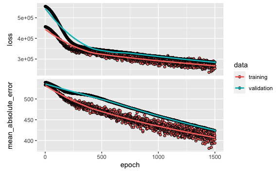
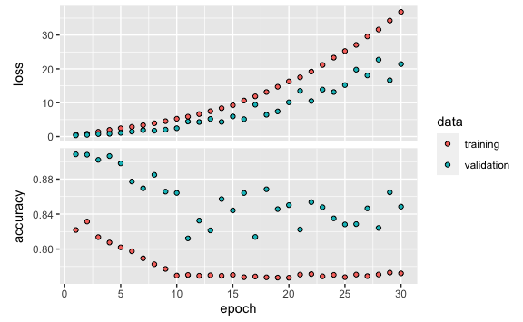
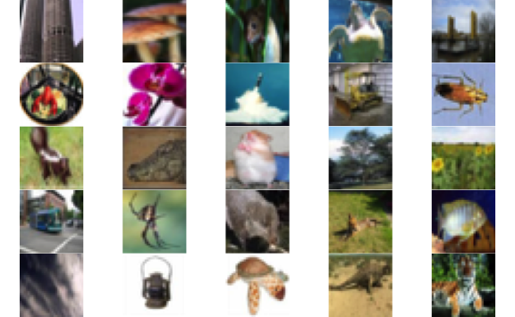
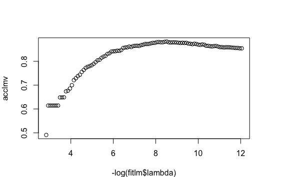
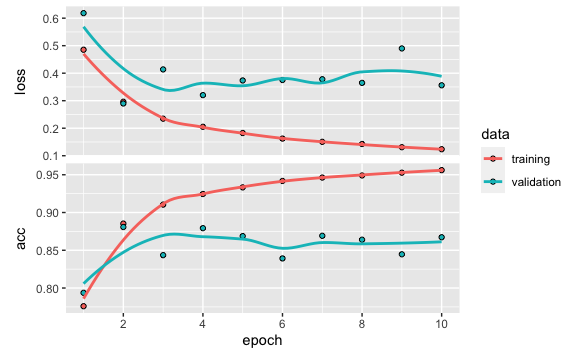
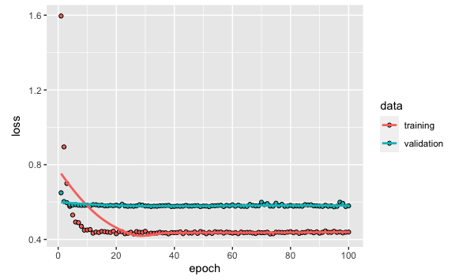

Lab 10 Deep Learning
================
Evan Woods
2023-12-31

    Installation complete.

## Single layer network on the hitters data

    [1] 213.1017

    [1] 252.2994

    Epoch 1/1500
    6/6 - 3s - loss: 456669.5312 - mean_absolute_error: 533.8972 - val_loss: 555127.5625 - val_mean_absolute_error: 539.8419 - 3s/epoch - 420ms/step
    Epoch 2/1500
    6/6 - 0s - loss: 456433.6250 - mean_absolute_error: 533.8485 - val_loss: 554781.0000 - val_mean_absolute_error: 539.7841 - 81ms/epoch - 14ms/step
    Epoch 3/1500
    6/6 - 0s - loss: 456221.7812 - mean_absolute_error: 533.7952 - val_loss: 554467.1875 - val_mean_absolute_error: 539.7363 - 67ms/epoch - 11ms/step
    Epoch 4/1500
    6/6 - 0s - loss: 455872.6250 - mean_absolute_error: 533.6572 - val_loss: 554140.6875 - val_mean_absolute_error: 539.6899 - 65ms/epoch - 11ms/step
    Epoch 5/1500
    6/6 - 0s - loss: 455510.1875 - mean_absolute_error: 533.5154 - val_loss: 553861.8125 - val_mean_absolute_error: 539.6403 - 66ms/epoch - 11ms/step
    Epoch 6/1500
    6/6 - 0s - loss: 455377.4062 - mean_absolute_error: 533.4642 - val_loss: 553558.9375 - val_mean_absolute_error: 539.5922 - 65ms/epoch - 11ms/step
    Epoch 7/1500
    6/6 - 0s - loss: 455142.3125 - mean_absolute_error: 533.4498 - val_loss: 553222.6250 - val_mean_absolute_error: 539.5400 - 84ms/epoch - 14ms/step
    Epoch 8/1500
    6/6 - 0s - loss: 454847.8750 - mean_absolute_error: 533.3647 - val_loss: 552942.1875 - val_mean_absolute_error: 539.4869 - 69ms/epoch - 12ms/step
    Epoch 9/1500
    6/6 - 0s - loss: 454466.4688 - mean_absolute_error: 533.2101 - val_loss: 552602.6875 - val_mean_absolute_error: 539.4275 - 67ms/epoch - 11ms/step
    Epoch 10/1500
    6/6 - 0s - loss: 454353.8750 - mean_absolute_error: 533.2125 - val_loss: 552297.8125 - val_mean_absolute_error: 539.3700 - 73ms/epoch - 12ms/step
    Epoch 11/1500
    6/6 - 0s - loss: 454338.8125 - mean_absolute_error: 533.2432 - val_loss: 551967.5625 - val_mean_absolute_error: 539.3126 - 67ms/epoch - 11ms/step
    Epoch 12/1500
    6/6 - 0s - loss: 454030.6875 - mean_absolute_error: 533.1033 - val_loss: 551603.1875 - val_mean_absolute_error: 539.2514 - 67ms/epoch - 11ms/step
    Epoch 13/1500
    6/6 - 0s - loss: 453652.5938 - mean_absolute_error: 532.9440 - val_loss: 551278.8750 - val_mean_absolute_error: 539.1905 - 67ms/epoch - 11ms/step
    Epoch 14/1500
    6/6 - 0s - loss: 453252.5938 - mean_absolute_error: 532.8420 - val_loss: 550919.3750 - val_mean_absolute_error: 539.1201 - 66ms/epoch - 11ms/step
    Epoch 15/1500
    6/6 - 0s - loss: 453431.5000 - mean_absolute_error: 532.9610 - val_loss: 550554.3750 - val_mean_absolute_error: 539.0528 - 65ms/epoch - 11ms/step
    Epoch 16/1500
    6/6 - 0s - loss: 452931.6875 - mean_absolute_error: 532.8386 - val_loss: 550156.0625 - val_mean_absolute_error: 538.9811 - 66ms/epoch - 11ms/step
    Epoch 17/1500
    6/6 - 0s - loss: 452881.9062 - mean_absolute_error: 532.7766 - val_loss: 549809.6875 - val_mean_absolute_error: 538.9092 - 66ms/epoch - 11ms/step
    Epoch 18/1500
    6/6 - 0s - loss: 452284.5938 - mean_absolute_error: 532.4165 - val_loss: 549479.2500 - val_mean_absolute_error: 538.8362 - 67ms/epoch - 11ms/step
    Epoch 19/1500
    6/6 - 0s - loss: 451833.1875 - mean_absolute_error: 532.2662 - val_loss: 549100.8125 - val_mean_absolute_error: 538.7565 - 65ms/epoch - 11ms/step
    Epoch 20/1500
    6/6 - 0s - loss: 451963.4688 - mean_absolute_error: 532.4228 - val_loss: 548663.6250 - val_mean_absolute_error: 538.6764 - 65ms/epoch - 11ms/step
    Epoch 21/1500
    6/6 - 0s - loss: 451566.3750 - mean_absolute_error: 532.3246 - val_loss: 548307.2500 - val_mean_absolute_error: 538.5939 - 66ms/epoch - 11ms/step
    Epoch 22/1500
    6/6 - 0s - loss: 450845.9688 - mean_absolute_error: 531.8779 - val_loss: 547875.0625 - val_mean_absolute_error: 538.5091 - 65ms/epoch - 11ms/step
    Epoch 23/1500
    6/6 - 0s - loss: 451112.1250 - mean_absolute_error: 531.9774 - val_loss: 547478.0000 - val_mean_absolute_error: 538.4224 - 64ms/epoch - 11ms/step
    Epoch 24/1500
    6/6 - 0s - loss: 450585.7188 - mean_absolute_error: 531.7991 - val_loss: 547061.0000 - val_mean_absolute_error: 538.3348 - 63ms/epoch - 11ms/step
    Epoch 25/1500
    6/6 - 0s - loss: 450673.4688 - mean_absolute_error: 531.8036 - val_loss: 546628.8125 - val_mean_absolute_error: 538.2419 - 69ms/epoch - 12ms/step
    Epoch 26/1500
    6/6 - 0s - loss: 449939.8125 - mean_absolute_error: 531.7058 - val_loss: 546176.0000 - val_mean_absolute_error: 538.1499 - 64ms/epoch - 11ms/step
    Epoch 27/1500
    6/6 - 0s - loss: 449255.9688 - mean_absolute_error: 531.2745 - val_loss: 545707.5625 - val_mean_absolute_error: 538.0537 - 65ms/epoch - 11ms/step
    Epoch 28/1500
    6/6 - 0s - loss: 449307.9062 - mean_absolute_error: 531.2972 - val_loss: 545274.8750 - val_mean_absolute_error: 537.9615 - 65ms/epoch - 11ms/step
    Epoch 29/1500
    6/6 - 0s - loss: 448811.5000 - mean_absolute_error: 531.2045 - val_loss: 544830.2500 - val_mean_absolute_error: 537.8633 - 67ms/epoch - 11ms/step
    Epoch 30/1500
    6/6 - 0s - loss: 448273.0000 - mean_absolute_error: 530.9727 - val_loss: 544347.0625 - val_mean_absolute_error: 537.7572 - 65ms/epoch - 11ms/step
    Epoch 31/1500
    6/6 - 0s - loss: 448727.5938 - mean_absolute_error: 531.5557 - val_loss: 543860.5625 - val_mean_absolute_error: 537.6605 - 66ms/epoch - 11ms/step
    Epoch 32/1500
    6/6 - 0s - loss: 447550.2188 - mean_absolute_error: 530.7260 - val_loss: 543364.5625 - val_mean_absolute_error: 537.5654 - 66ms/epoch - 11ms/step
    Epoch 33/1500
    6/6 - 0s - loss: 447806.0312 - mean_absolute_error: 530.8558 - val_loss: 542811.9375 - val_mean_absolute_error: 537.4639 - 64ms/epoch - 11ms/step
    Epoch 34/1500
    6/6 - 0s - loss: 446646.6250 - mean_absolute_error: 530.1691 - val_loss: 542291.5000 - val_mean_absolute_error: 537.3571 - 61ms/epoch - 10ms/step
    Epoch 35/1500
    6/6 - 0s - loss: 446334.1250 - mean_absolute_error: 530.1564 - val_loss: 541775.0000 - val_mean_absolute_error: 537.2498 - 63ms/epoch - 10ms/step
    Epoch 36/1500
    6/6 - 0s - loss: 446528.8125 - mean_absolute_error: 530.4177 - val_loss: 541206.5625 - val_mean_absolute_error: 537.1404 - 65ms/epoch - 11ms/step
    Epoch 37/1500
    6/6 - 0s - loss: 445446.8750 - mean_absolute_error: 529.9798 - val_loss: 540677.8750 - val_mean_absolute_error: 537.0345 - 63ms/epoch - 10ms/step
    Epoch 38/1500
    6/6 - 0s - loss: 445858.8750 - mean_absolute_error: 530.1581 - val_loss: 540116.2500 - val_mean_absolute_error: 536.9249 - 63ms/epoch - 11ms/step
    Epoch 39/1500
    6/6 - 0s - loss: 444897.5312 - mean_absolute_error: 529.7229 - val_loss: 539539.2500 - val_mean_absolute_error: 536.8182 - 66ms/epoch - 11ms/step
    Epoch 40/1500
    6/6 - 0s - loss: 445179.0000 - mean_absolute_error: 529.9991 - val_loss: 538931.2500 - val_mean_absolute_error: 536.7017 - 64ms/epoch - 11ms/step
    Epoch 41/1500
    6/6 - 0s - loss: 444290.2812 - mean_absolute_error: 529.5895 - val_loss: 538390.4375 - val_mean_absolute_error: 536.5859 - 68ms/epoch - 11ms/step
    Epoch 42/1500
    6/6 - 0s - loss: 444012.9062 - mean_absolute_error: 529.8166 - val_loss: 537852.4375 - val_mean_absolute_error: 536.4712 - 66ms/epoch - 11ms/step
    Epoch 43/1500
    6/6 - 0s - loss: 442641.3750 - mean_absolute_error: 528.8976 - val_loss: 537223.7500 - val_mean_absolute_error: 536.3572 - 67ms/epoch - 11ms/step
    Epoch 44/1500
    6/6 - 0s - loss: 443850.0938 - mean_absolute_error: 529.7170 - val_loss: 536594.6875 - val_mean_absolute_error: 536.2419 - 63ms/epoch - 11ms/step
    Epoch 45/1500
    6/6 - 0s - loss: 442133.6250 - mean_absolute_error: 528.8007 - val_loss: 535976.2500 - val_mean_absolute_error: 536.1240 - 63ms/epoch - 10ms/step
    Epoch 46/1500
    6/6 - 0s - loss: 442435.2812 - mean_absolute_error: 528.7878 - val_loss: 535303.4375 - val_mean_absolute_error: 536.0040 - 62ms/epoch - 10ms/step
    Epoch 47/1500
    6/6 - 0s - loss: 440634.6875 - mean_absolute_error: 527.9342 - val_loss: 534616.3750 - val_mean_absolute_error: 535.8828 - 63ms/epoch - 10ms/step
    Epoch 48/1500
    6/6 - 0s - loss: 440460.6250 - mean_absolute_error: 528.0503 - val_loss: 533992.9375 - val_mean_absolute_error: 535.7595 - 65ms/epoch - 11ms/step
    Epoch 49/1500
    6/6 - 0s - loss: 440968.9062 - mean_absolute_error: 528.2706 - val_loss: 533324.7500 - val_mean_absolute_error: 535.6430 - 66ms/epoch - 11ms/step
    Epoch 50/1500
    6/6 - 0s - loss: 440124.2812 - mean_absolute_error: 527.9160 - val_loss: 532631.5625 - val_mean_absolute_error: 535.5261 - 65ms/epoch - 11ms/step
    Epoch 51/1500
    6/6 - 0s - loss: 440849.8750 - mean_absolute_error: 528.4716 - val_loss: 532035.3750 - val_mean_absolute_error: 535.4092 - 65ms/epoch - 11ms/step
    Epoch 52/1500
    6/6 - 0s - loss: 439883.5312 - mean_absolute_error: 528.0804 - val_loss: 531440.1875 - val_mean_absolute_error: 535.2870 - 65ms/epoch - 11ms/step
    Epoch 53/1500
    6/6 - 0s - loss: 438248.8125 - mean_absolute_error: 527.4971 - val_loss: 530741.6875 - val_mean_absolute_error: 535.1687 - 64ms/epoch - 11ms/step
    Epoch 54/1500
    6/6 - 0s - loss: 437853.6250 - mean_absolute_error: 527.0823 - val_loss: 530045.9375 - val_mean_absolute_error: 535.0451 - 67ms/epoch - 11ms/step
    Epoch 55/1500
    6/6 - 0s - loss: 438075.3750 - mean_absolute_error: 527.3178 - val_loss: 529356.3125 - val_mean_absolute_error: 534.9225 - 68ms/epoch - 11ms/step
    Epoch 56/1500
    6/6 - 0s - loss: 437034.5000 - mean_absolute_error: 527.0834 - val_loss: 528629.0000 - val_mean_absolute_error: 534.8046 - 69ms/epoch - 12ms/step
    Epoch 57/1500
    6/6 - 0s - loss: 436784.9688 - mean_absolute_error: 527.5707 - val_loss: 527996.4375 - val_mean_absolute_error: 534.6831 - 65ms/epoch - 11ms/step
    Epoch 58/1500
    6/6 - 0s - loss: 437795.6250 - mean_absolute_error: 527.4047 - val_loss: 527318.0000 - val_mean_absolute_error: 534.5623 - 68ms/epoch - 11ms/step
    Epoch 59/1500
    6/6 - 0s - loss: 436047.5312 - mean_absolute_error: 526.5165 - val_loss: 526628.3125 - val_mean_absolute_error: 534.4438 - 68ms/epoch - 11ms/step
    Epoch 60/1500
    6/6 - 0s - loss: 434903.4062 - mean_absolute_error: 526.7618 - val_loss: 525827.0000 - val_mean_absolute_error: 534.3212 - 88ms/epoch - 15ms/step
    Epoch 61/1500
    6/6 - 0s - loss: 434164.6250 - mean_absolute_error: 526.0489 - val_loss: 525088.1875 - val_mean_absolute_error: 534.1981 - 66ms/epoch - 11ms/step
    Epoch 62/1500
    6/6 - 0s - loss: 434387.1875 - mean_absolute_error: 525.9763 - val_loss: 524326.6875 - val_mean_absolute_error: 534.0778 - 62ms/epoch - 10ms/step
    Epoch 63/1500
    6/6 - 0s - loss: 433060.5312 - mean_absolute_error: 525.5791 - val_loss: 523563.7188 - val_mean_absolute_error: 533.9542 - 63ms/epoch - 11ms/step
    Epoch 64/1500
    6/6 - 0s - loss: 432465.6250 - mean_absolute_error: 525.5439 - val_loss: 522712.5000 - val_mean_absolute_error: 533.8212 - 65ms/epoch - 11ms/step
    Epoch 65/1500
    6/6 - 0s - loss: 432907.0000 - mean_absolute_error: 525.5639 - val_loss: 521976.9062 - val_mean_absolute_error: 533.7007 - 64ms/epoch - 11ms/step
    Epoch 66/1500
    6/6 - 0s - loss: 431281.6875 - mean_absolute_error: 524.4070 - val_loss: 521221.2500 - val_mean_absolute_error: 533.5746 - 72ms/epoch - 12ms/step
    Epoch 67/1500
    6/6 - 0s - loss: 431263.8750 - mean_absolute_error: 525.1931 - val_loss: 520485.1562 - val_mean_absolute_error: 533.4474 - 65ms/epoch - 11ms/step
    Epoch 68/1500
    6/6 - 0s - loss: 429692.4688 - mean_absolute_error: 524.0853 - val_loss: 519599.9062 - val_mean_absolute_error: 533.3101 - 63ms/epoch - 11ms/step
    Epoch 69/1500
    6/6 - 0s - loss: 430967.6875 - mean_absolute_error: 525.1897 - val_loss: 518892.4062 - val_mean_absolute_error: 533.1920 - 64ms/epoch - 11ms/step
    Epoch 70/1500
    6/6 - 0s - loss: 429547.2812 - mean_absolute_error: 524.2183 - val_loss: 518083.5312 - val_mean_absolute_error: 533.0662 - 63ms/epoch - 11ms/step
    Epoch 71/1500
    6/6 - 0s - loss: 430274.4062 - mean_absolute_error: 524.9921 - val_loss: 517301.8438 - val_mean_absolute_error: 532.9426 - 66ms/epoch - 11ms/step
    Epoch 72/1500
    6/6 - 0s - loss: 426899.0938 - mean_absolute_error: 524.0797 - val_loss: 516469.8750 - val_mean_absolute_error: 532.8160 - 64ms/epoch - 11ms/step
    Epoch 73/1500
    6/6 - 0s - loss: 427487.0000 - mean_absolute_error: 523.5078 - val_loss: 515687.8750 - val_mean_absolute_error: 532.6884 - 65ms/epoch - 11ms/step
    Epoch 74/1500
    6/6 - 0s - loss: 426792.4062 - mean_absolute_error: 523.2719 - val_loss: 514890.0312 - val_mean_absolute_error: 532.5665 - 67ms/epoch - 11ms/step
    Epoch 75/1500
    6/6 - 0s - loss: 427434.0312 - mean_absolute_error: 523.9449 - val_loss: 514020.5938 - val_mean_absolute_error: 532.4366 - 65ms/epoch - 11ms/step
    Epoch 76/1500
    6/6 - 0s - loss: 425273.0312 - mean_absolute_error: 522.6257 - val_loss: 513251.7188 - val_mean_absolute_error: 532.3151 - 65ms/epoch - 11ms/step
    Epoch 77/1500
    6/6 - 0s - loss: 425972.7188 - mean_absolute_error: 523.8694 - val_loss: 512331.2188 - val_mean_absolute_error: 532.1788 - 67ms/epoch - 11ms/step
    Epoch 78/1500
    6/6 - 0s - loss: 424281.7188 - mean_absolute_error: 522.5203 - val_loss: 511609.9375 - val_mean_absolute_error: 532.0651 - 65ms/epoch - 11ms/step
    Epoch 79/1500
    6/6 - 0s - loss: 425471.2188 - mean_absolute_error: 523.2565 - val_loss: 510863.3125 - val_mean_absolute_error: 531.9434 - 69ms/epoch - 11ms/step
    Epoch 80/1500
    6/6 - 0s - loss: 423627.4062 - mean_absolute_error: 522.1955 - val_loss: 510014.9062 - val_mean_absolute_error: 531.8171 - 64ms/epoch - 11ms/step
    Epoch 81/1500
    6/6 - 0s - loss: 424271.8750 - mean_absolute_error: 522.4642 - val_loss: 509215.2500 - val_mean_absolute_error: 531.6937 - 64ms/epoch - 11ms/step
    Epoch 82/1500
    6/6 - 0s - loss: 423279.8750 - mean_absolute_error: 521.6937 - val_loss: 508259.3125 - val_mean_absolute_error: 531.5587 - 64ms/epoch - 11ms/step
    Epoch 83/1500
    6/6 - 0s - loss: 421372.2812 - mean_absolute_error: 521.6002 - val_loss: 507401.8438 - val_mean_absolute_error: 531.4299 - 65ms/epoch - 11ms/step
    Epoch 84/1500
    6/6 - 0s - loss: 421070.7188 - mean_absolute_error: 521.7872 - val_loss: 506570.7188 - val_mean_absolute_error: 531.3058 - 64ms/epoch - 11ms/step
    Epoch 85/1500
    6/6 - 0s - loss: 422823.1875 - mean_absolute_error: 523.7018 - val_loss: 505737.1875 - val_mean_absolute_error: 531.1805 - 65ms/epoch - 11ms/step
    Epoch 86/1500
    6/6 - 0s - loss: 422131.4062 - mean_absolute_error: 522.4882 - val_loss: 504916.0938 - val_mean_absolute_error: 531.0584 - 66ms/epoch - 11ms/step
    Epoch 87/1500
    6/6 - 0s - loss: 419306.5312 - mean_absolute_error: 521.2496 - val_loss: 503942.9375 - val_mean_absolute_error: 530.9185 - 64ms/epoch - 11ms/step
    Epoch 88/1500
    6/6 - 0s - loss: 420794.5312 - mean_absolute_error: 521.9506 - val_loss: 503097.7500 - val_mean_absolute_error: 530.7919 - 64ms/epoch - 11ms/step
    Epoch 89/1500
    6/6 - 0s - loss: 419636.0938 - mean_absolute_error: 521.3345 - val_loss: 502152.8125 - val_mean_absolute_error: 530.6545 - 68ms/epoch - 11ms/step
    Epoch 90/1500
    6/6 - 0s - loss: 420046.7188 - mean_absolute_error: 521.4258 - val_loss: 501258.4062 - val_mean_absolute_error: 530.5293 - 66ms/epoch - 11ms/step
    Epoch 91/1500
    6/6 - 0s - loss: 419166.9062 - mean_absolute_error: 521.4503 - val_loss: 500291.4062 - val_mean_absolute_error: 530.3916 - 66ms/epoch - 11ms/step
    Epoch 92/1500
    6/6 - 0s - loss: 416882.4062 - mean_absolute_error: 520.2065 - val_loss: 499348.4688 - val_mean_absolute_error: 530.2534 - 64ms/epoch - 11ms/step
    Epoch 93/1500
    6/6 - 0s - loss: 416803.8125 - mean_absolute_error: 519.9783 - val_loss: 498519.7812 - val_mean_absolute_error: 530.1293 - 67ms/epoch - 11ms/step
    Epoch 94/1500
    6/6 - 0s - loss: 417788.9688 - mean_absolute_error: 520.6623 - val_loss: 497645.3750 - val_mean_absolute_error: 530.0015 - 65ms/epoch - 11ms/step
    Epoch 95/1500
    6/6 - 0s - loss: 413782.6875 - mean_absolute_error: 519.0995 - val_loss: 496623.4062 - val_mean_absolute_error: 529.8556 - 64ms/epoch - 11ms/step
    Epoch 96/1500
    6/6 - 0s - loss: 413967.4688 - mean_absolute_error: 519.6956 - val_loss: 495697.8438 - val_mean_absolute_error: 529.7211 - 64ms/epoch - 11ms/step
    Epoch 97/1500
    6/6 - 0s - loss: 415224.8750 - mean_absolute_error: 519.5228 - val_loss: 494884.7500 - val_mean_absolute_error: 529.5967 - 65ms/epoch - 11ms/step
    Epoch 98/1500
    6/6 - 0s - loss: 412737.0000 - mean_absolute_error: 518.5347 - val_loss: 493880.8125 - val_mean_absolute_error: 529.4546 - 64ms/epoch - 11ms/step
    Epoch 99/1500
    6/6 - 0s - loss: 413005.7188 - mean_absolute_error: 518.8098 - val_loss: 492915.6250 - val_mean_absolute_error: 529.3180 - 64ms/epoch - 11ms/step
    Epoch 100/1500
    6/6 - 0s - loss: 414176.2188 - mean_absolute_error: 518.9480 - val_loss: 492004.4062 - val_mean_absolute_error: 529.1790 - 65ms/epoch - 11ms/step
    Epoch 101/1500
    6/6 - 0s - loss: 410587.6250 - mean_absolute_error: 517.0318 - val_loss: 490969.8438 - val_mean_absolute_error: 529.0338 - 67ms/epoch - 11ms/step
    Epoch 102/1500
    6/6 - 0s - loss: 411629.1875 - mean_absolute_error: 517.4548 - val_loss: 490036.3125 - val_mean_absolute_error: 528.8931 - 66ms/epoch - 11ms/step
    Epoch 103/1500
    6/6 - 0s - loss: 410498.3125 - mean_absolute_error: 517.9732 - val_loss: 489105.3750 - val_mean_absolute_error: 528.7593 - 65ms/epoch - 11ms/step
    Epoch 104/1500
    6/6 - 0s - loss: 408322.0000 - mean_absolute_error: 517.7283 - val_loss: 488037.4375 - val_mean_absolute_error: 528.6124 - 64ms/epoch - 11ms/step
    Epoch 105/1500
    6/6 - 0s - loss: 408605.7812 - mean_absolute_error: 517.0530 - val_loss: 487172.7812 - val_mean_absolute_error: 528.4813 - 65ms/epoch - 11ms/step
    Epoch 106/1500
    6/6 - 0s - loss: 407591.9688 - mean_absolute_error: 517.4971 - val_loss: 486203.8750 - val_mean_absolute_error: 528.3430 - 64ms/epoch - 11ms/step
    Epoch 107/1500
    6/6 - 0s - loss: 406454.3125 - mean_absolute_error: 515.4930 - val_loss: 485296.4688 - val_mean_absolute_error: 528.2066 - 122ms/epoch - 20ms/step
    Epoch 108/1500
    6/6 - 0s - loss: 407226.4688 - mean_absolute_error: 516.2555 - val_loss: 484318.5312 - val_mean_absolute_error: 528.0609 - 65ms/epoch - 11ms/step
    Epoch 109/1500
    6/6 - 0s - loss: 406206.9062 - mean_absolute_error: 516.8292 - val_loss: 483296.5938 - val_mean_absolute_error: 527.9163 - 67ms/epoch - 11ms/step
    Epoch 110/1500
    6/6 - 0s - loss: 402375.4688 - mean_absolute_error: 515.1113 - val_loss: 482227.2188 - val_mean_absolute_error: 527.7633 - 69ms/epoch - 11ms/step
    Epoch 111/1500
    6/6 - 0s - loss: 406736.0938 - mean_absolute_error: 516.9472 - val_loss: 481226.9062 - val_mean_absolute_error: 527.6143 - 66ms/epoch - 11ms/step
    Epoch 112/1500
    6/6 - 0s - loss: 406946.0312 - mean_absolute_error: 516.2364 - val_loss: 480337.7500 - val_mean_absolute_error: 527.4777 - 81ms/epoch - 13ms/step
    Epoch 113/1500
    6/6 - 0s - loss: 405059.8750 - mean_absolute_error: 516.5515 - val_loss: 479502.8125 - val_mean_absolute_error: 527.3474 - 66ms/epoch - 11ms/step
    Epoch 114/1500
    6/6 - 0s - loss: 401777.7188 - mean_absolute_error: 515.3704 - val_loss: 478594.8438 - val_mean_absolute_error: 527.2109 - 67ms/epoch - 11ms/step
    Epoch 115/1500
    6/6 - 0s - loss: 403655.9062 - mean_absolute_error: 515.7700 - val_loss: 477554.9375 - val_mean_absolute_error: 527.0609 - 68ms/epoch - 11ms/step
    Epoch 116/1500
    6/6 - 0s - loss: 400673.0938 - mean_absolute_error: 513.6212 - val_loss: 476543.4375 - val_mean_absolute_error: 526.9065 - 65ms/epoch - 11ms/step
    Epoch 117/1500
    6/6 - 0s - loss: 402588.6250 - mean_absolute_error: 516.9343 - val_loss: 475575.3125 - val_mean_absolute_error: 526.7548 - 65ms/epoch - 11ms/step
    Epoch 118/1500
    6/6 - 0s - loss: 396353.8125 - mean_absolute_error: 513.3028 - val_loss: 474581.0000 - val_mean_absolute_error: 526.6100 - 64ms/epoch - 11ms/step
    Epoch 119/1500
    6/6 - 0s - loss: 398486.5312 - mean_absolute_error: 514.0815 - val_loss: 473606.7500 - val_mean_absolute_error: 526.4610 - 68ms/epoch - 11ms/step
    Epoch 120/1500
    6/6 - 0s - loss: 397396.7812 - mean_absolute_error: 512.2341 - val_loss: 472571.6875 - val_mean_absolute_error: 526.3031 - 64ms/epoch - 11ms/step
    Epoch 121/1500
    6/6 - 0s - loss: 397428.2812 - mean_absolute_error: 512.6590 - val_loss: 471466.4062 - val_mean_absolute_error: 526.1414 - 64ms/epoch - 11ms/step
    Epoch 122/1500
    6/6 - 0s - loss: 395403.5000 - mean_absolute_error: 511.6500 - val_loss: 470439.5938 - val_mean_absolute_error: 525.9819 - 64ms/epoch - 11ms/step
    Epoch 123/1500
    6/6 - 0s - loss: 396047.7188 - mean_absolute_error: 512.7899 - val_loss: 469555.8125 - val_mean_absolute_error: 525.8384 - 64ms/epoch - 11ms/step
    Epoch 124/1500
    6/6 - 0s - loss: 395418.7812 - mean_absolute_error: 512.9062 - val_loss: 468538.7188 - val_mean_absolute_error: 525.6793 - 64ms/epoch - 11ms/step
    Epoch 125/1500
    6/6 - 0s - loss: 394473.3125 - mean_absolute_error: 513.2211 - val_loss: 467635.0000 - val_mean_absolute_error: 525.5309 - 65ms/epoch - 11ms/step
    Epoch 126/1500
    6/6 - 0s - loss: 394125.9062 - mean_absolute_error: 512.0522 - val_loss: 466656.7500 - val_mean_absolute_error: 525.3742 - 65ms/epoch - 11ms/step
    Epoch 127/1500
    6/6 - 0s - loss: 393282.2812 - mean_absolute_error: 509.7922 - val_loss: 465688.0000 - val_mean_absolute_error: 525.2244 - 64ms/epoch - 11ms/step
    Epoch 128/1500
    6/6 - 0s - loss: 394466.6875 - mean_absolute_error: 513.6522 - val_loss: 464773.2812 - val_mean_absolute_error: 525.0718 - 66ms/epoch - 11ms/step
    Epoch 129/1500
    6/6 - 0s - loss: 395012.7188 - mean_absolute_error: 512.8948 - val_loss: 463734.2500 - val_mean_absolute_error: 524.9089 - 67ms/epoch - 11ms/step
    Epoch 130/1500
    6/6 - 0s - loss: 389109.5000 - mean_absolute_error: 508.8662 - val_loss: 462802.8125 - val_mean_absolute_error: 524.7615 - 64ms/epoch - 11ms/step
    Epoch 131/1500
    6/6 - 0s - loss: 392914.3750 - mean_absolute_error: 509.3561 - val_loss: 461847.7188 - val_mean_absolute_error: 524.6024 - 67ms/epoch - 11ms/step
    Epoch 132/1500
    6/6 - 0s - loss: 390047.3750 - mean_absolute_error: 511.0335 - val_loss: 460817.7500 - val_mean_absolute_error: 524.4435 - 67ms/epoch - 11ms/step
    Epoch 133/1500
    6/6 - 0s - loss: 394463.3750 - mean_absolute_error: 512.7946 - val_loss: 459777.8438 - val_mean_absolute_error: 524.2803 - 70ms/epoch - 12ms/step
    Epoch 134/1500
    6/6 - 0s - loss: 386067.1875 - mean_absolute_error: 508.9362 - val_loss: 458816.5000 - val_mean_absolute_error: 524.1252 - 66ms/epoch - 11ms/step
    Epoch 135/1500
    6/6 - 0s - loss: 386776.7812 - mean_absolute_error: 509.4792 - val_loss: 457791.6250 - val_mean_absolute_error: 523.9603 - 64ms/epoch - 11ms/step
    Epoch 136/1500
    6/6 - 0s - loss: 383089.6875 - mean_absolute_error: 505.8817 - val_loss: 456623.3125 - val_mean_absolute_error: 523.7820 - 63ms/epoch - 10ms/step
    Epoch 137/1500
    6/6 - 0s - loss: 387174.6875 - mean_absolute_error: 509.0497 - val_loss: 455644.1875 - val_mean_absolute_error: 523.6217 - 75ms/epoch - 13ms/step
    Epoch 138/1500
    6/6 - 0s - loss: 386246.7188 - mean_absolute_error: 508.4019 - val_loss: 454665.5625 - val_mean_absolute_error: 523.4612 - 70ms/epoch - 12ms/step
    Epoch 139/1500
    6/6 - 0s - loss: 389996.9062 - mean_absolute_error: 511.4522 - val_loss: 453681.5625 - val_mean_absolute_error: 523.2953 - 62ms/epoch - 10ms/step
    Epoch 140/1500
    6/6 - 0s - loss: 384905.6875 - mean_absolute_error: 508.1924 - val_loss: 452602.6562 - val_mean_absolute_error: 523.1212 - 65ms/epoch - 11ms/step
    Epoch 141/1500
    6/6 - 0s - loss: 381403.9062 - mean_absolute_error: 506.2032 - val_loss: 451540.8750 - val_mean_absolute_error: 522.9550 - 64ms/epoch - 11ms/step
    Epoch 142/1500
    6/6 - 0s - loss: 385471.8125 - mean_absolute_error: 508.6630 - val_loss: 450531.0312 - val_mean_absolute_error: 522.7841 - 65ms/epoch - 11ms/step
    Epoch 143/1500
    6/6 - 0s - loss: 381011.8438 - mean_absolute_error: 507.0540 - val_loss: 449497.1875 - val_mean_absolute_error: 522.6218 - 67ms/epoch - 11ms/step
    Epoch 144/1500
    6/6 - 0s - loss: 385722.0312 - mean_absolute_error: 509.0492 - val_loss: 448645.0625 - val_mean_absolute_error: 522.4711 - 65ms/epoch - 11ms/step
    Epoch 145/1500
    6/6 - 0s - loss: 380391.3750 - mean_absolute_error: 507.9159 - val_loss: 447591.0000 - val_mean_absolute_error: 522.2964 - 64ms/epoch - 11ms/step
    Epoch 146/1500
    6/6 - 0s - loss: 381451.3125 - mean_absolute_error: 506.5296 - val_loss: 446615.0938 - val_mean_absolute_error: 522.1339 - 67ms/epoch - 11ms/step
    Epoch 147/1500
    6/6 - 0s - loss: 378910.5625 - mean_absolute_error: 505.9727 - val_loss: 445592.1875 - val_mean_absolute_error: 521.9618 - 65ms/epoch - 11ms/step
    Epoch 148/1500
    6/6 - 0s - loss: 381763.3750 - mean_absolute_error: 507.3830 - val_loss: 444520.2188 - val_mean_absolute_error: 521.7825 - 68ms/epoch - 11ms/step
    Epoch 149/1500
    6/6 - 0s - loss: 377736.5000 - mean_absolute_error: 504.9858 - val_loss: 443491.5312 - val_mean_absolute_error: 521.6137 - 66ms/epoch - 11ms/step
    Epoch 150/1500
    6/6 - 0s - loss: 378142.1562 - mean_absolute_error: 506.2317 - val_loss: 442445.7500 - val_mean_absolute_error: 521.4371 - 64ms/epoch - 11ms/step
    Epoch 151/1500
    6/6 - 0s - loss: 377534.5938 - mean_absolute_error: 505.5409 - val_loss: 441556.8750 - val_mean_absolute_error: 521.2784 - 66ms/epoch - 11ms/step
    Epoch 152/1500
    6/6 - 0s - loss: 377025.9688 - mean_absolute_error: 504.0088 - val_loss: 440594.3125 - val_mean_absolute_error: 521.1058 - 67ms/epoch - 11ms/step
    Epoch 153/1500
    6/6 - 0s - loss: 382188.5000 - mean_absolute_error: 508.0925 - val_loss: 439619.8750 - val_mean_absolute_error: 520.9349 - 69ms/epoch - 11ms/step
    Epoch 154/1500
    6/6 - 0s - loss: 374086.1562 - mean_absolute_error: 504.1284 - val_loss: 438705.9688 - val_mean_absolute_error: 520.7719 - 68ms/epoch - 11ms/step
    Epoch 155/1500
    6/6 - 0s - loss: 380189.7188 - mean_absolute_error: 508.9953 - val_loss: 437887.4375 - val_mean_absolute_error: 520.6182 - 65ms/epoch - 11ms/step
    Epoch 156/1500
    6/6 - 0s - loss: 380332.9688 - mean_absolute_error: 507.6416 - val_loss: 436889.4375 - val_mean_absolute_error: 520.4518 - 66ms/epoch - 11ms/step
    Epoch 157/1500
    6/6 - 0s - loss: 377485.4688 - mean_absolute_error: 508.8835 - val_loss: 435884.9688 - val_mean_absolute_error: 520.2735 - 65ms/epoch - 11ms/step
    Epoch 158/1500
    6/6 - 0s - loss: 375187.2812 - mean_absolute_error: 506.7961 - val_loss: 434965.4375 - val_mean_absolute_error: 520.1089 - 65ms/epoch - 11ms/step
    Epoch 159/1500
    6/6 - 0s - loss: 376731.9062 - mean_absolute_error: 507.2600 - val_loss: 434135.0000 - val_mean_absolute_error: 519.9523 - 64ms/epoch - 11ms/step
    Epoch 160/1500
    6/6 - 0s - loss: 373023.2188 - mean_absolute_error: 504.1920 - val_loss: 433096.0000 - val_mean_absolute_error: 519.7748 - 64ms/epoch - 11ms/step
    Epoch 161/1500
    6/6 - 0s - loss: 372723.4688 - mean_absolute_error: 504.8414 - val_loss: 432214.6250 - val_mean_absolute_error: 519.6194 - 67ms/epoch - 11ms/step
    Epoch 162/1500
    6/6 - 0s - loss: 373333.2500 - mean_absolute_error: 503.1127 - val_loss: 431241.4688 - val_mean_absolute_error: 519.4522 - 66ms/epoch - 11ms/step
    Epoch 163/1500
    6/6 - 0s - loss: 369297.0625 - mean_absolute_error: 501.7587 - val_loss: 430246.2500 - val_mean_absolute_error: 519.2746 - 66ms/epoch - 11ms/step
    Epoch 164/1500
    6/6 - 0s - loss: 369561.7812 - mean_absolute_error: 504.6893 - val_loss: 429255.7812 - val_mean_absolute_error: 519.0959 - 64ms/epoch - 11ms/step
    Epoch 165/1500
    6/6 - 0s - loss: 367747.5312 - mean_absolute_error: 502.6102 - val_loss: 428276.5938 - val_mean_absolute_error: 518.9085 - 63ms/epoch - 11ms/step
    Epoch 166/1500
    6/6 - 0s - loss: 364019.0312 - mean_absolute_error: 498.3055 - val_loss: 427191.4375 - val_mean_absolute_error: 518.7124 - 63ms/epoch - 10ms/step
    Epoch 167/1500
    6/6 - 0s - loss: 370322.3750 - mean_absolute_error: 502.3404 - val_loss: 426378.2188 - val_mean_absolute_error: 518.5522 - 65ms/epoch - 11ms/step
    Epoch 168/1500
    6/6 - 0s - loss: 371070.4062 - mean_absolute_error: 504.3911 - val_loss: 425473.7500 - val_mean_absolute_error: 518.3802 - 63ms/epoch - 11ms/step
    Epoch 169/1500
    6/6 - 0s - loss: 371799.2812 - mean_absolute_error: 503.2115 - val_loss: 424592.4688 - val_mean_absolute_error: 518.2089 - 63ms/epoch - 10ms/step
    Epoch 170/1500
    6/6 - 0s - loss: 367598.2812 - mean_absolute_error: 503.4245 - val_loss: 423608.7500 - val_mean_absolute_error: 518.0235 - 64ms/epoch - 11ms/step
    Epoch 171/1500
    6/6 - 0s - loss: 368115.0312 - mean_absolute_error: 503.1445 - val_loss: 422628.5625 - val_mean_absolute_error: 517.9330 - 63ms/epoch - 11ms/step
    Epoch 172/1500
    6/6 - 0s - loss: 367949.2812 - mean_absolute_error: 499.8596 - val_loss: 421605.3438 - val_mean_absolute_error: 517.8724 - 63ms/epoch - 10ms/step
    Epoch 173/1500
    6/6 - 0s - loss: 364474.0000 - mean_absolute_error: 502.0139 - val_loss: 420676.9688 - val_mean_absolute_error: 517.8127 - 64ms/epoch - 11ms/step
    Epoch 174/1500
    6/6 - 0s - loss: 364199.5938 - mean_absolute_error: 502.6672 - val_loss: 419704.3750 - val_mean_absolute_error: 517.7597 - 64ms/epoch - 11ms/step
    Epoch 175/1500
    6/6 - 0s - loss: 367680.8438 - mean_absolute_error: 502.1809 - val_loss: 418913.0938 - val_mean_absolute_error: 517.7003 - 66ms/epoch - 11ms/step
    Epoch 176/1500
    6/6 - 0s - loss: 370579.8750 - mean_absolute_error: 503.6943 - val_loss: 418097.4375 - val_mean_absolute_error: 517.6313 - 65ms/epoch - 11ms/step
    Epoch 177/1500
    6/6 - 0s - loss: 363335.3750 - mean_absolute_error: 501.0748 - val_loss: 417131.3438 - val_mean_absolute_error: 517.5760 - 63ms/epoch - 10ms/step
    Epoch 178/1500
    6/6 - 0s - loss: 359061.0312 - mean_absolute_error: 498.2330 - val_loss: 416207.5000 - val_mean_absolute_error: 517.5160 - 63ms/epoch - 10ms/step
    Epoch 179/1500
    6/6 - 0s - loss: 366481.0312 - mean_absolute_error: 502.4001 - val_loss: 415411.8125 - val_mean_absolute_error: 517.4559 - 64ms/epoch - 11ms/step
    Epoch 180/1500
    6/6 - 0s - loss: 363973.0000 - mean_absolute_error: 501.7788 - val_loss: 414527.9062 - val_mean_absolute_error: 517.3992 - 63ms/epoch - 11ms/step
    Epoch 181/1500
    6/6 - 0s - loss: 356903.4062 - mean_absolute_error: 495.6196 - val_loss: 413621.7500 - val_mean_absolute_error: 517.3420 - 64ms/epoch - 11ms/step
    Epoch 182/1500
    6/6 - 0s - loss: 362041.2812 - mean_absolute_error: 498.8668 - val_loss: 412783.1250 - val_mean_absolute_error: 517.2735 - 67ms/epoch - 11ms/step
    Epoch 183/1500
    6/6 - 0s - loss: 362486.8750 - mean_absolute_error: 499.2667 - val_loss: 412033.5938 - val_mean_absolute_error: 517.2054 - 65ms/epoch - 11ms/step
    Epoch 184/1500
    6/6 - 0s - loss: 360163.3750 - mean_absolute_error: 497.5965 - val_loss: 411160.1875 - val_mean_absolute_error: 517.1428 - 64ms/epoch - 11ms/step
    Epoch 185/1500
    6/6 - 0s - loss: 356670.6562 - mean_absolute_error: 498.4828 - val_loss: 410234.8125 - val_mean_absolute_error: 517.0768 - 64ms/epoch - 11ms/step
    Epoch 186/1500
    6/6 - 0s - loss: 360493.8438 - mean_absolute_error: 501.4329 - val_loss: 409435.9062 - val_mean_absolute_error: 517.0212 - 63ms/epoch - 11ms/step
    Epoch 187/1500
    6/6 - 0s - loss: 358969.7812 - mean_absolute_error: 500.7515 - val_loss: 408644.8125 - val_mean_absolute_error: 516.9529 - 69ms/epoch - 12ms/step
    Epoch 188/1500
    6/6 - 0s - loss: 353452.3438 - mean_absolute_error: 495.0665 - val_loss: 407869.5312 - val_mean_absolute_error: 516.8837 - 64ms/epoch - 11ms/step
    Epoch 189/1500
    6/6 - 0s - loss: 361974.4375 - mean_absolute_error: 499.7699 - val_loss: 407125.0938 - val_mean_absolute_error: 516.8092 - 65ms/epoch - 11ms/step
    Epoch 190/1500
    6/6 - 0s - loss: 356849.4688 - mean_absolute_error: 496.0220 - val_loss: 406323.7812 - val_mean_absolute_error: 516.7543 - 66ms/epoch - 11ms/step
    Epoch 191/1500
    6/6 - 0s - loss: 357582.9062 - mean_absolute_error: 497.6359 - val_loss: 405534.1562 - val_mean_absolute_error: 516.6944 - 66ms/epoch - 11ms/step
    Epoch 192/1500
    6/6 - 0s - loss: 355046.3125 - mean_absolute_error: 496.8323 - val_loss: 404644.5000 - val_mean_absolute_error: 516.6337 - 64ms/epoch - 11ms/step
    Epoch 193/1500
    6/6 - 0s - loss: 360757.3750 - mean_absolute_error: 498.7424 - val_loss: 403932.9062 - val_mean_absolute_error: 516.5721 - 64ms/epoch - 11ms/step
    Epoch 194/1500
    6/6 - 0s - loss: 353168.0312 - mean_absolute_error: 493.9195 - val_loss: 403177.9375 - val_mean_absolute_error: 516.5168 - 63ms/epoch - 11ms/step
    Epoch 195/1500
    6/6 - 0s - loss: 355727.2500 - mean_absolute_error: 498.7823 - val_loss: 402454.4062 - val_mean_absolute_error: 516.4511 - 65ms/epoch - 11ms/step
    Epoch 196/1500
    6/6 - 0s - loss: 361160.5000 - mean_absolute_error: 501.5569 - val_loss: 401754.2188 - val_mean_absolute_error: 516.3921 - 64ms/epoch - 11ms/step
    Epoch 197/1500
    6/6 - 0s - loss: 357688.7188 - mean_absolute_error: 496.7433 - val_loss: 401111.0938 - val_mean_absolute_error: 516.3303 - 64ms/epoch - 11ms/step
    Epoch 198/1500
    6/6 - 0s - loss: 352928.6562 - mean_absolute_error: 496.6753 - val_loss: 400377.8750 - val_mean_absolute_error: 516.2634 - 64ms/epoch - 11ms/step
    Epoch 199/1500
    6/6 - 0s - loss: 357457.7188 - mean_absolute_error: 496.2433 - val_loss: 399603.7188 - val_mean_absolute_error: 516.1965 - 65ms/epoch - 11ms/step
    Epoch 200/1500
    6/6 - 0s - loss: 352180.8438 - mean_absolute_error: 496.3513 - val_loss: 398883.2188 - val_mean_absolute_error: 516.1318 - 63ms/epoch - 11ms/step
    Epoch 201/1500
    6/6 - 0s - loss: 356893.4688 - mean_absolute_error: 495.1908 - val_loss: 398247.3438 - val_mean_absolute_error: 516.0757 - 64ms/epoch - 11ms/step
    Epoch 202/1500
    6/6 - 0s - loss: 355955.9688 - mean_absolute_error: 500.6567 - val_loss: 397534.3438 - val_mean_absolute_error: 516.0138 - 111ms/epoch - 18ms/step
    Epoch 203/1500
    6/6 - 0s - loss: 352559.3125 - mean_absolute_error: 498.0030 - val_loss: 396822.9375 - val_mean_absolute_error: 515.9543 - 65ms/epoch - 11ms/step
    Epoch 204/1500
    6/6 - 0s - loss: 358480.2812 - mean_absolute_error: 496.5685 - val_loss: 396139.1250 - val_mean_absolute_error: 515.9021 - 64ms/epoch - 11ms/step
    Epoch 205/1500
    6/6 - 0s - loss: 354304.6562 - mean_absolute_error: 496.6955 - val_loss: 395477.9688 - val_mean_absolute_error: 515.8452 - 67ms/epoch - 11ms/step
    Epoch 206/1500
    6/6 - 0s - loss: 349703.7500 - mean_absolute_error: 492.2341 - val_loss: 394838.6562 - val_mean_absolute_error: 515.7830 - 66ms/epoch - 11ms/step
    Epoch 207/1500
    6/6 - 0s - loss: 347756.5938 - mean_absolute_error: 491.2565 - val_loss: 394194.3438 - val_mean_absolute_error: 515.7162 - 65ms/epoch - 11ms/step
    Epoch 208/1500
    6/6 - 0s - loss: 361581.9375 - mean_absolute_error: 502.2932 - val_loss: 393678.8438 - val_mean_absolute_error: 515.6513 - 65ms/epoch - 11ms/step
    Epoch 209/1500
    6/6 - 0s - loss: 349371.0312 - mean_absolute_error: 494.8807 - val_loss: 392937.5312 - val_mean_absolute_error: 515.5842 - 66ms/epoch - 11ms/step
    Epoch 210/1500
    6/6 - 0s - loss: 349546.5938 - mean_absolute_error: 496.1444 - val_loss: 392376.6562 - val_mean_absolute_error: 515.5244 - 66ms/epoch - 11ms/step
    Epoch 211/1500
    6/6 - 0s - loss: 357121.8750 - mean_absolute_error: 497.1822 - val_loss: 391846.4375 - val_mean_absolute_error: 515.4606 - 65ms/epoch - 11ms/step
    Epoch 212/1500
    6/6 - 0s - loss: 354139.8125 - mean_absolute_error: 495.6227 - val_loss: 391281.1562 - val_mean_absolute_error: 515.3925 - 66ms/epoch - 11ms/step
    Epoch 213/1500
    6/6 - 0s - loss: 352376.8125 - mean_absolute_error: 493.3338 - val_loss: 390629.0625 - val_mean_absolute_error: 515.3315 - 65ms/epoch - 11ms/step
    Epoch 214/1500
    6/6 - 0s - loss: 356694.6875 - mean_absolute_error: 494.6330 - val_loss: 390125.2812 - val_mean_absolute_error: 515.2769 - 76ms/epoch - 13ms/step
    Epoch 215/1500
    6/6 - 0s - loss: 347647.4375 - mean_absolute_error: 493.6324 - val_loss: 389514.5625 - val_mean_absolute_error: 515.2122 - 69ms/epoch - 12ms/step
    Epoch 216/1500
    6/6 - 0s - loss: 360729.8125 - mean_absolute_error: 497.0975 - val_loss: 389021.5938 - val_mean_absolute_error: 515.1450 - 66ms/epoch - 11ms/step
    Epoch 217/1500
    6/6 - 0s - loss: 347988.8125 - mean_absolute_error: 493.5970 - val_loss: 388400.5625 - val_mean_absolute_error: 515.0870 - 69ms/epoch - 11ms/step
    Epoch 218/1500
    6/6 - 0s - loss: 355976.7812 - mean_absolute_error: 498.8305 - val_loss: 387848.0938 - val_mean_absolute_error: 515.0124 - 65ms/epoch - 11ms/step
    Epoch 219/1500
    6/6 - 0s - loss: 355389.8438 - mean_absolute_error: 498.8961 - val_loss: 387275.8750 - val_mean_absolute_error: 514.9485 - 67ms/epoch - 11ms/step
    Epoch 220/1500
    6/6 - 0s - loss: 349299.1250 - mean_absolute_error: 496.5391 - val_loss: 386752.0000 - val_mean_absolute_error: 514.8927 - 69ms/epoch - 12ms/step
    Epoch 221/1500
    6/6 - 0s - loss: 354131.2812 - mean_absolute_error: 498.2476 - val_loss: 386214.0625 - val_mean_absolute_error: 514.8334 - 68ms/epoch - 11ms/step
    Epoch 222/1500
    6/6 - 0s - loss: 349082.7188 - mean_absolute_error: 493.7187 - val_loss: 385709.1875 - val_mean_absolute_error: 514.7651 - 67ms/epoch - 11ms/step
    Epoch 223/1500
    6/6 - 0s - loss: 349228.3125 - mean_absolute_error: 492.5733 - val_loss: 385160.5625 - val_mean_absolute_error: 514.7020 - 65ms/epoch - 11ms/step
    Epoch 224/1500
    6/6 - 0s - loss: 353660.6250 - mean_absolute_error: 495.4392 - val_loss: 384726.1250 - val_mean_absolute_error: 514.6360 - 67ms/epoch - 11ms/step
    Epoch 225/1500
    6/6 - 0s - loss: 349378.6875 - mean_absolute_error: 491.1855 - val_loss: 384241.7812 - val_mean_absolute_error: 514.5612 - 67ms/epoch - 11ms/step
    Epoch 226/1500
    6/6 - 0s - loss: 350465.5938 - mean_absolute_error: 494.8071 - val_loss: 383774.3125 - val_mean_absolute_error: 514.4927 - 66ms/epoch - 11ms/step
    Epoch 227/1500
    6/6 - 0s - loss: 345458.4688 - mean_absolute_error: 491.0729 - val_loss: 383283.6250 - val_mean_absolute_error: 514.4217 - 66ms/epoch - 11ms/step
    Epoch 228/1500
    6/6 - 0s - loss: 359490.7188 - mean_absolute_error: 500.7145 - val_loss: 382875.2500 - val_mean_absolute_error: 514.3460 - 66ms/epoch - 11ms/step
    Epoch 229/1500
    6/6 - 0s - loss: 347958.3750 - mean_absolute_error: 492.6107 - val_loss: 382318.7500 - val_mean_absolute_error: 514.2855 - 68ms/epoch - 11ms/step
    Epoch 230/1500
    6/6 - 0s - loss: 345967.2812 - mean_absolute_error: 491.7454 - val_loss: 381848.9688 - val_mean_absolute_error: 514.2576 - 68ms/epoch - 11ms/step
    Epoch 231/1500
    6/6 - 0s - loss: 347957.5000 - mean_absolute_error: 495.6815 - val_loss: 381332.2188 - val_mean_absolute_error: 514.2598 - 67ms/epoch - 11ms/step
    Epoch 232/1500
    6/6 - 0s - loss: 346751.2188 - mean_absolute_error: 491.9275 - val_loss: 380869.1250 - val_mean_absolute_error: 514.2361 - 66ms/epoch - 11ms/step
    Epoch 233/1500
    6/6 - 0s - loss: 343755.8750 - mean_absolute_error: 488.4211 - val_loss: 380431.0000 - val_mean_absolute_error: 514.2213 - 65ms/epoch - 11ms/step
    Epoch 234/1500
    6/6 - 0s - loss: 343782.6250 - mean_absolute_error: 489.0355 - val_loss: 379948.0000 - val_mean_absolute_error: 514.1988 - 64ms/epoch - 11ms/step
    Epoch 235/1500
    6/6 - 0s - loss: 337734.5625 - mean_absolute_error: 486.2631 - val_loss: 379396.1875 - val_mean_absolute_error: 514.2020 - 67ms/epoch - 11ms/step
    Epoch 236/1500
    6/6 - 0s - loss: 344631.4688 - mean_absolute_error: 489.7292 - val_loss: 378939.0938 - val_mean_absolute_error: 514.1837 - 65ms/epoch - 11ms/step
    Epoch 237/1500
    6/6 - 0s - loss: 347684.6562 - mean_absolute_error: 493.1313 - val_loss: 378524.5312 - val_mean_absolute_error: 514.1612 - 67ms/epoch - 11ms/step
    Epoch 238/1500
    6/6 - 0s - loss: 350187.9062 - mean_absolute_error: 493.6196 - val_loss: 378107.5625 - val_mean_absolute_error: 514.1437 - 67ms/epoch - 11ms/step
    Epoch 239/1500
    6/6 - 0s - loss: 350639.2188 - mean_absolute_error: 494.7406 - val_loss: 377774.4688 - val_mean_absolute_error: 514.1191 - 66ms/epoch - 11ms/step
    Epoch 240/1500
    6/6 - 0s - loss: 349743.7188 - mean_absolute_error: 488.4391 - val_loss: 377397.4375 - val_mean_absolute_error: 514.0981 - 68ms/epoch - 11ms/step
    Epoch 241/1500
    6/6 - 0s - loss: 346867.6875 - mean_absolute_error: 491.9400 - val_loss: 376965.9375 - val_mean_absolute_error: 514.0823 - 67ms/epoch - 11ms/step
    Epoch 242/1500
    6/6 - 0s - loss: 344720.4688 - mean_absolute_error: 486.0775 - val_loss: 376651.8750 - val_mean_absolute_error: 514.0497 - 64ms/epoch - 11ms/step
    Epoch 243/1500
    6/6 - 0s - loss: 343746.0938 - mean_absolute_error: 488.9951 - val_loss: 376263.1250 - val_mean_absolute_error: 514.0379 - 69ms/epoch - 11ms/step
    Epoch 244/1500
    6/6 - 0s - loss: 347583.8438 - mean_absolute_error: 489.7805 - val_loss: 375945.4375 - val_mean_absolute_error: 513.9966 - 69ms/epoch - 11ms/step
    Epoch 245/1500
    6/6 - 0s - loss: 348136.7812 - mean_absolute_error: 489.6358 - val_loss: 375560.6250 - val_mean_absolute_error: 513.9674 - 64ms/epoch - 11ms/step
    Epoch 246/1500
    6/6 - 0s - loss: 346421.5000 - mean_absolute_error: 488.2080 - val_loss: 375129.8438 - val_mean_absolute_error: 513.9501 - 66ms/epoch - 11ms/step
    Epoch 247/1500
    6/6 - 0s - loss: 348697.4375 - mean_absolute_error: 493.5788 - val_loss: 374720.9688 - val_mean_absolute_error: 513.9460 - 65ms/epoch - 11ms/step
    Epoch 248/1500
    6/6 - 0s - loss: 352324.7812 - mean_absolute_error: 493.8913 - val_loss: 374414.5938 - val_mean_absolute_error: 513.9108 - 63ms/epoch - 11ms/step
    Epoch 249/1500
    6/6 - 0s - loss: 338341.5312 - mean_absolute_error: 488.4195 - val_loss: 374061.6250 - val_mean_absolute_error: 513.8883 - 64ms/epoch - 11ms/step
    Epoch 250/1500
    6/6 - 0s - loss: 344439.8125 - mean_absolute_error: 489.5194 - val_loss: 373682.3125 - val_mean_absolute_error: 513.8615 - 67ms/epoch - 11ms/step
    Epoch 251/1500
    6/6 - 0s - loss: 345352.1250 - mean_absolute_error: 490.7412 - val_loss: 373319.5312 - val_mean_absolute_error: 513.8378 - 66ms/epoch - 11ms/step
    Epoch 252/1500
    6/6 - 0s - loss: 345725.8125 - mean_absolute_error: 491.3661 - val_loss: 372954.0625 - val_mean_absolute_error: 513.8140 - 64ms/epoch - 11ms/step
    Epoch 253/1500
    6/6 - 0s - loss: 340074.7500 - mean_absolute_error: 486.6014 - val_loss: 372570.2188 - val_mean_absolute_error: 513.7810 - 68ms/epoch - 11ms/step
    Epoch 254/1500
    6/6 - 0s - loss: 342028.7188 - mean_absolute_error: 492.6035 - val_loss: 372238.9688 - val_mean_absolute_error: 513.7504 - 65ms/epoch - 11ms/step
    Epoch 255/1500
    6/6 - 0s - loss: 354907.6562 - mean_absolute_error: 494.6777 - val_loss: 371996.0312 - val_mean_absolute_error: 513.7241 - 67ms/epoch - 11ms/step
    Epoch 256/1500
    6/6 - 0s - loss: 336569.0312 - mean_absolute_error: 485.3496 - val_loss: 371657.4688 - val_mean_absolute_error: 513.6899 - 65ms/epoch - 11ms/step
    Epoch 257/1500
    6/6 - 0s - loss: 344673.0938 - mean_absolute_error: 491.5377 - val_loss: 371432.1875 - val_mean_absolute_error: 513.6375 - 67ms/epoch - 11ms/step
    Epoch 258/1500
    6/6 - 0s - loss: 344598.3750 - mean_absolute_error: 492.2483 - val_loss: 371175.5000 - val_mean_absolute_error: 513.5927 - 66ms/epoch - 11ms/step
    Epoch 259/1500
    6/6 - 0s - loss: 346040.3125 - mean_absolute_error: 491.8807 - val_loss: 370869.0312 - val_mean_absolute_error: 513.5525 - 68ms/epoch - 11ms/step
    Epoch 260/1500
    6/6 - 0s - loss: 341059.4062 - mean_absolute_error: 488.8739 - val_loss: 370522.1562 - val_mean_absolute_error: 513.5222 - 64ms/epoch - 11ms/step
    Epoch 261/1500
    6/6 - 0s - loss: 336779.0312 - mean_absolute_error: 487.1317 - val_loss: 370198.9688 - val_mean_absolute_error: 513.5098 - 65ms/epoch - 11ms/step
    Epoch 262/1500
    6/6 - 0s - loss: 333694.3750 - mean_absolute_error: 482.6646 - val_loss: 369901.0000 - val_mean_absolute_error: 513.4965 - 68ms/epoch - 11ms/step
    Epoch 263/1500
    6/6 - 0s - loss: 352026.2812 - mean_absolute_error: 497.1686 - val_loss: 369619.5312 - val_mean_absolute_error: 513.4807 - 67ms/epoch - 11ms/step
    Epoch 264/1500
    6/6 - 0s - loss: 335659.2188 - mean_absolute_error: 486.6999 - val_loss: 369334.6250 - val_mean_absolute_error: 513.4634 - 66ms/epoch - 11ms/step
    Epoch 265/1500
    6/6 - 0s - loss: 344371.1562 - mean_absolute_error: 492.5228 - val_loss: 369103.5312 - val_mean_absolute_error: 513.4262 - 68ms/epoch - 11ms/step
    Epoch 266/1500
    6/6 - 0s - loss: 341924.3438 - mean_absolute_error: 488.0373 - val_loss: 368829.5938 - val_mean_absolute_error: 513.3899 - 67ms/epoch - 11ms/step
    Epoch 267/1500
    6/6 - 0s - loss: 341664.2812 - mean_absolute_error: 488.0944 - val_loss: 368505.4688 - val_mean_absolute_error: 513.3733 - 66ms/epoch - 11ms/step
    Epoch 268/1500
    6/6 - 0s - loss: 341119.0625 - mean_absolute_error: 484.8739 - val_loss: 368303.5938 - val_mean_absolute_error: 513.3355 - 65ms/epoch - 11ms/step
    Epoch 269/1500
    6/6 - 0s - loss: 349542.6250 - mean_absolute_error: 492.3020 - val_loss: 368061.8438 - val_mean_absolute_error: 513.2997 - 66ms/epoch - 11ms/step
    Epoch 270/1500
    6/6 - 0s - loss: 342737.5312 - mean_absolute_error: 489.3069 - val_loss: 367817.1875 - val_mean_absolute_error: 513.2785 - 65ms/epoch - 11ms/step
    Epoch 271/1500
    6/6 - 0s - loss: 338839.5312 - mean_absolute_error: 486.2184 - val_loss: 367558.0000 - val_mean_absolute_error: 513.2640 - 65ms/epoch - 11ms/step
    Epoch 272/1500
    6/6 - 0s - loss: 345244.5625 - mean_absolute_error: 489.0933 - val_loss: 367402.2812 - val_mean_absolute_error: 513.2131 - 64ms/epoch - 11ms/step
    Epoch 273/1500
    6/6 - 0s - loss: 339388.5938 - mean_absolute_error: 482.1393 - val_loss: 367108.3125 - val_mean_absolute_error: 513.2013 - 64ms/epoch - 11ms/step
    Epoch 274/1500
    6/6 - 0s - loss: 343499.7188 - mean_absolute_error: 490.3267 - val_loss: 366890.2188 - val_mean_absolute_error: 513.1734 - 64ms/epoch - 11ms/step
    Epoch 275/1500
    6/6 - 0s - loss: 336733.9062 - mean_absolute_error: 483.3554 - val_loss: 366622.1250 - val_mean_absolute_error: 513.1608 - 65ms/epoch - 11ms/step
    Epoch 276/1500
    6/6 - 0s - loss: 328953.5938 - mean_absolute_error: 477.2872 - val_loss: 366327.6250 - val_mean_absolute_error: 513.1553 - 64ms/epoch - 11ms/step
    Epoch 277/1500
    6/6 - 0s - loss: 342106.1875 - mean_absolute_error: 486.0049 - val_loss: 366091.5312 - val_mean_absolute_error: 513.1355 - 64ms/epoch - 11ms/step
    Epoch 278/1500
    6/6 - 0s - loss: 338527.3750 - mean_absolute_error: 483.6658 - val_loss: 365865.6875 - val_mean_absolute_error: 513.1107 - 64ms/epoch - 11ms/step
    Epoch 279/1500
    6/6 - 0s - loss: 345961.6250 - mean_absolute_error: 489.7784 - val_loss: 365637.0312 - val_mean_absolute_error: 513.0834 - 63ms/epoch - 11ms/step
    Epoch 280/1500
    6/6 - 0s - loss: 331762.6875 - mean_absolute_error: 482.0086 - val_loss: 365453.6562 - val_mean_absolute_error: 513.0200 - 65ms/epoch - 11ms/step
    Epoch 281/1500
    6/6 - 0s - loss: 348018.3750 - mean_absolute_error: 493.0566 - val_loss: 365298.7500 - val_mean_absolute_error: 512.9699 - 64ms/epoch - 11ms/step
    Epoch 282/1500
    6/6 - 0s - loss: 346751.1250 - mean_absolute_error: 489.0268 - val_loss: 365160.7500 - val_mean_absolute_error: 512.9100 - 64ms/epoch - 11ms/step
    Epoch 283/1500
    6/6 - 0s - loss: 336691.6562 - mean_absolute_error: 480.6321 - val_loss: 364919.5938 - val_mean_absolute_error: 512.8885 - 65ms/epoch - 11ms/step
    Epoch 284/1500
    6/6 - 0s - loss: 339428.6250 - mean_absolute_error: 486.7070 - val_loss: 364684.0938 - val_mean_absolute_error: 512.8695 - 64ms/epoch - 11ms/step
    Epoch 285/1500
    6/6 - 0s - loss: 343090.3125 - mean_absolute_error: 490.4120 - val_loss: 364455.9062 - val_mean_absolute_error: 512.8563 - 64ms/epoch - 11ms/step
    Epoch 286/1500
    6/6 - 0s - loss: 333034.6875 - mean_absolute_error: 486.2662 - val_loss: 364221.3125 - val_mean_absolute_error: 512.8444 - 64ms/epoch - 11ms/step
    Epoch 287/1500
    6/6 - 0s - loss: 341457.0938 - mean_absolute_error: 489.0740 - val_loss: 364048.5000 - val_mean_absolute_error: 512.7990 - 66ms/epoch - 11ms/step
    Epoch 288/1500
    6/6 - 0s - loss: 349471.4062 - mean_absolute_error: 488.7959 - val_loss: 363880.5000 - val_mean_absolute_error: 512.7477 - 65ms/epoch - 11ms/step
    Epoch 289/1500
    6/6 - 0s - loss: 340068.9062 - mean_absolute_error: 487.6391 - val_loss: 363718.4375 - val_mean_absolute_error: 512.6915 - 73ms/epoch - 12ms/step
    Epoch 290/1500
    6/6 - 0s - loss: 337109.2188 - mean_absolute_error: 481.9366 - val_loss: 363493.9062 - val_mean_absolute_error: 512.6680 - 64ms/epoch - 11ms/step
    Epoch 291/1500
    6/6 - 0s - loss: 349968.1562 - mean_absolute_error: 487.9117 - val_loss: 363344.1875 - val_mean_absolute_error: 512.6300 - 69ms/epoch - 11ms/step
    Epoch 292/1500
    6/6 - 0s - loss: 347166.8438 - mean_absolute_error: 491.8208 - val_loss: 363170.4688 - val_mean_absolute_error: 512.6033 - 69ms/epoch - 12ms/step
    Epoch 293/1500
    6/6 - 0s - loss: 340862.4688 - mean_absolute_error: 484.3349 - val_loss: 362985.2188 - val_mean_absolute_error: 512.5538 - 67ms/epoch - 11ms/step
    Epoch 294/1500
    6/6 - 0s - loss: 335785.7500 - mean_absolute_error: 486.0619 - val_loss: 362796.8125 - val_mean_absolute_error: 512.5161 - 67ms/epoch - 11ms/step
    Epoch 295/1500
    6/6 - 0s - loss: 349378.0938 - mean_absolute_error: 491.2404 - val_loss: 362645.5312 - val_mean_absolute_error: 512.4755 - 66ms/epoch - 11ms/step
    Epoch 296/1500
    6/6 - 0s - loss: 336202.4062 - mean_absolute_error: 484.9335 - val_loss: 362509.0000 - val_mean_absolute_error: 512.4290 - 66ms/epoch - 11ms/step
    Epoch 297/1500
    6/6 - 0s - loss: 334887.4062 - mean_absolute_error: 483.8542 - val_loss: 362354.6250 - val_mean_absolute_error: 512.3881 - 68ms/epoch - 11ms/step
    Epoch 298/1500
    6/6 - 0s - loss: 338285.7188 - mean_absolute_error: 486.8164 - val_loss: 362195.0000 - val_mean_absolute_error: 512.3475 - 66ms/epoch - 11ms/step
    Epoch 299/1500
    6/6 - 0s - loss: 339427.2812 - mean_absolute_error: 487.0573 - val_loss: 362037.7812 - val_mean_absolute_error: 512.2745 - 65ms/epoch - 11ms/step
    Epoch 300/1500
    6/6 - 0s - loss: 328253.9062 - mean_absolute_error: 475.3929 - val_loss: 361841.7500 - val_mean_absolute_error: 512.2496 - 66ms/epoch - 11ms/step
    Epoch 301/1500
    6/6 - 0s - loss: 339571.4375 - mean_absolute_error: 485.3682 - val_loss: 361689.9688 - val_mean_absolute_error: 512.2174 - 66ms/epoch - 11ms/step
    Epoch 302/1500
    6/6 - 0s - loss: 347718.5000 - mean_absolute_error: 495.8114 - val_loss: 361513.2500 - val_mean_absolute_error: 512.1705 - 65ms/epoch - 11ms/step
    Epoch 303/1500
    6/6 - 0s - loss: 348134.6250 - mean_absolute_error: 491.0572 - val_loss: 361357.2188 - val_mean_absolute_error: 512.1435 - 67ms/epoch - 11ms/step
    Epoch 304/1500
    6/6 - 0s - loss: 335953.3750 - mean_absolute_error: 481.5755 - val_loss: 361202.2812 - val_mean_absolute_error: 512.1117 - 64ms/epoch - 11ms/step
    Epoch 305/1500
    6/6 - 0s - loss: 332211.4062 - mean_absolute_error: 482.7635 - val_loss: 361060.0938 - val_mean_absolute_error: 512.0660 - 64ms/epoch - 11ms/step
    Epoch 306/1500
    6/6 - 0s - loss: 334583.1250 - mean_absolute_error: 479.8039 - val_loss: 360895.0938 - val_mean_absolute_error: 512.0178 - 68ms/epoch - 11ms/step
    Epoch 307/1500
    6/6 - 0s - loss: 341542.8750 - mean_absolute_error: 486.0356 - val_loss: 360781.7500 - val_mean_absolute_error: 511.9508 - 66ms/epoch - 11ms/step
    Epoch 308/1500
    6/6 - 0s - loss: 340578.0312 - mean_absolute_error: 486.3552 - val_loss: 360664.3438 - val_mean_absolute_error: 511.8932 - 64ms/epoch - 11ms/step
    Epoch 309/1500
    6/6 - 0s - loss: 346354.5312 - mean_absolute_error: 491.3885 - val_loss: 360548.2500 - val_mean_absolute_error: 511.8298 - 63ms/epoch - 11ms/step
    Epoch 310/1500
    6/6 - 0s - loss: 341942.7188 - mean_absolute_error: 487.2226 - val_loss: 360364.8125 - val_mean_absolute_error: 511.8013 - 63ms/epoch - 10ms/step
    Epoch 311/1500
    6/6 - 0s - loss: 348860.5938 - mean_absolute_error: 490.9318 - val_loss: 360229.0000 - val_mean_absolute_error: 511.7398 - 63ms/epoch - 10ms/step
    Epoch 312/1500
    6/6 - 0s - loss: 337194.2188 - mean_absolute_error: 481.0047 - val_loss: 360124.6875 - val_mean_absolute_error: 511.6858 - 63ms/epoch - 11ms/step
    Epoch 313/1500
    6/6 - 0s - loss: 344055.0312 - mean_absolute_error: 489.5090 - val_loss: 360009.7500 - val_mean_absolute_error: 511.6263 - 64ms/epoch - 11ms/step
    Epoch 314/1500
    6/6 - 0s - loss: 340619.7812 - mean_absolute_error: 487.3045 - val_loss: 359879.0938 - val_mean_absolute_error: 511.5714 - 65ms/epoch - 11ms/step
    Epoch 315/1500
    6/6 - 0s - loss: 351500.8125 - mean_absolute_error: 491.1878 - val_loss: 359728.2188 - val_mean_absolute_error: 511.5255 - 67ms/epoch - 11ms/step
    Epoch 316/1500
    6/6 - 0s - loss: 344078.6875 - mean_absolute_error: 488.4876 - val_loss: 359621.6562 - val_mean_absolute_error: 511.4751 - 66ms/epoch - 11ms/step
    Epoch 317/1500
    6/6 - 0s - loss: 335919.4375 - mean_absolute_error: 487.9344 - val_loss: 359450.5312 - val_mean_absolute_error: 511.4576 - 65ms/epoch - 11ms/step
    Epoch 318/1500
    6/6 - 0s - loss: 339751.0000 - mean_absolute_error: 481.4062 - val_loss: 359338.3438 - val_mean_absolute_error: 511.4097 - 65ms/epoch - 11ms/step
    Epoch 319/1500
    6/6 - 0s - loss: 346549.0938 - mean_absolute_error: 486.2541 - val_loss: 359206.8125 - val_mean_absolute_error: 511.3785 - 65ms/epoch - 11ms/step
    Epoch 320/1500
    6/6 - 0s - loss: 338309.9062 - mean_absolute_error: 482.7911 - val_loss: 359123.3125 - val_mean_absolute_error: 511.3106 - 64ms/epoch - 11ms/step
    Epoch 321/1500
    6/6 - 0s - loss: 339156.5625 - mean_absolute_error: 487.3276 - val_loss: 359024.9062 - val_mean_absolute_error: 511.2597 - 63ms/epoch - 11ms/step
    Epoch 322/1500
    6/6 - 0s - loss: 335614.5312 - mean_absolute_error: 483.3912 - val_loss: 358879.3125 - val_mean_absolute_error: 511.2366 - 66ms/epoch - 11ms/step
    Epoch 323/1500
    6/6 - 0s - loss: 339670.8750 - mean_absolute_error: 485.6573 - val_loss: 358750.4062 - val_mean_absolute_error: 511.2177 - 65ms/epoch - 11ms/step
    Epoch 324/1500
    6/6 - 0s - loss: 342287.0938 - mean_absolute_error: 484.1472 - val_loss: 358630.6250 - val_mean_absolute_error: 511.2190 - 63ms/epoch - 11ms/step
    Epoch 325/1500
    6/6 - 0s - loss: 341502.0938 - mean_absolute_error: 485.1713 - val_loss: 358534.9062 - val_mean_absolute_error: 511.1938 - 64ms/epoch - 11ms/step
    Epoch 326/1500
    6/6 - 0s - loss: 339276.4688 - mean_absolute_error: 487.1329 - val_loss: 358381.3750 - val_mean_absolute_error: 511.2509 - 64ms/epoch - 11ms/step
    Epoch 327/1500
    6/6 - 0s - loss: 352254.9062 - mean_absolute_error: 490.0599 - val_loss: 358272.8438 - val_mean_absolute_error: 511.2200 - 64ms/epoch - 11ms/step
    Epoch 328/1500
    6/6 - 0s - loss: 352390.6250 - mean_absolute_error: 488.2849 - val_loss: 358151.5938 - val_mean_absolute_error: 511.2047 - 64ms/epoch - 11ms/step
    Epoch 329/1500
    6/6 - 0s - loss: 334620.2188 - mean_absolute_error: 478.8936 - val_loss: 358044.6875 - val_mean_absolute_error: 511.1860 - 64ms/epoch - 11ms/step
    Epoch 330/1500
    6/6 - 0s - loss: 332630.3438 - mean_absolute_error: 483.2177 - val_loss: 357909.3750 - val_mean_absolute_error: 511.1859 - 64ms/epoch - 11ms/step
    Epoch 331/1500
    6/6 - 0s - loss: 342048.2812 - mean_absolute_error: 487.2325 - val_loss: 357787.8125 - val_mean_absolute_error: 511.1618 - 65ms/epoch - 11ms/step
    Epoch 332/1500
    6/6 - 0s - loss: 345045.1562 - mean_absolute_error: 491.8906 - val_loss: 357669.1875 - val_mean_absolute_error: 511.1791 - 67ms/epoch - 11ms/step
    Epoch 333/1500
    6/6 - 0s - loss: 336556.5000 - mean_absolute_error: 481.0340 - val_loss: 357544.6562 - val_mean_absolute_error: 511.1886 - 66ms/epoch - 11ms/step
    Epoch 334/1500
    6/6 - 0s - loss: 334690.8750 - mean_absolute_error: 484.7310 - val_loss: 357451.0312 - val_mean_absolute_error: 511.0971 - 65ms/epoch - 11ms/step
    Epoch 335/1500
    6/6 - 0s - loss: 345540.1250 - mean_absolute_error: 491.9938 - val_loss: 357359.6250 - val_mean_absolute_error: 511.0339 - 64ms/epoch - 11ms/step
    Epoch 336/1500
    6/6 - 0s - loss: 332419.9688 - mean_absolute_error: 484.6342 - val_loss: 357219.8125 - val_mean_absolute_error: 511.0623 - 63ms/epoch - 11ms/step
    Epoch 337/1500
    6/6 - 0s - loss: 340793.7812 - mean_absolute_error: 486.5168 - val_loss: 357158.4062 - val_mean_absolute_error: 510.9531 - 64ms/epoch - 11ms/step
    Epoch 338/1500
    6/6 - 0s - loss: 333355.7812 - mean_absolute_error: 475.9886 - val_loss: 357019.2812 - val_mean_absolute_error: 510.9594 - 64ms/epoch - 11ms/step
    Epoch 339/1500
    6/6 - 0s - loss: 338565.6562 - mean_absolute_error: 474.7928 - val_loss: 356907.2188 - val_mean_absolute_error: 510.9356 - 63ms/epoch - 11ms/step
    Epoch 340/1500
    6/6 - 0s - loss: 344288.3750 - mean_absolute_error: 487.1507 - val_loss: 356829.0625 - val_mean_absolute_error: 510.8643 - 64ms/epoch - 11ms/step
    Epoch 341/1500
    6/6 - 0s - loss: 331303.2812 - mean_absolute_error: 476.5796 - val_loss: 356686.7500 - val_mean_absolute_error: 510.8458 - 65ms/epoch - 11ms/step
    Epoch 342/1500
    6/6 - 0s - loss: 335093.1875 - mean_absolute_error: 478.8867 - val_loss: 356570.3125 - val_mean_absolute_error: 510.8409 - 67ms/epoch - 11ms/step
    Epoch 343/1500
    6/6 - 0s - loss: 339034.1250 - mean_absolute_error: 480.3216 - val_loss: 356458.5938 - val_mean_absolute_error: 510.8184 - 66ms/epoch - 11ms/step
    Epoch 344/1500
    6/6 - 0s - loss: 348584.4688 - mean_absolute_error: 492.7146 - val_loss: 356361.0938 - val_mean_absolute_error: 510.7747 - 71ms/epoch - 12ms/step
    Epoch 345/1500
    6/6 - 0s - loss: 332935.3125 - mean_absolute_error: 479.4218 - val_loss: 356246.9062 - val_mean_absolute_error: 510.7639 - 67ms/epoch - 11ms/step
    Epoch 346/1500
    6/6 - 0s - loss: 340932.5938 - mean_absolute_error: 486.8619 - val_loss: 356172.0625 - val_mean_absolute_error: 510.7157 - 71ms/epoch - 12ms/step
    Epoch 347/1500
    6/6 - 0s - loss: 334275.6875 - mean_absolute_error: 482.3405 - val_loss: 356080.4375 - val_mean_absolute_error: 510.6616 - 67ms/epoch - 11ms/step
    Epoch 348/1500
    6/6 - 0s - loss: 332421.0625 - mean_absolute_error: 476.7307 - val_loss: 355956.4688 - val_mean_absolute_error: 510.6746 - 65ms/epoch - 11ms/step
    Epoch 349/1500
    6/6 - 0s - loss: 352340.4375 - mean_absolute_error: 489.2978 - val_loss: 355868.5000 - val_mean_absolute_error: 510.6396 - 63ms/epoch - 11ms/step
    Epoch 350/1500
    6/6 - 0s - loss: 334345.5312 - mean_absolute_error: 481.9916 - val_loss: 355790.0625 - val_mean_absolute_error: 510.5851 - 63ms/epoch - 11ms/step
    Epoch 351/1500
    6/6 - 0s - loss: 350901.1875 - mean_absolute_error: 488.3752 - val_loss: 355705.3750 - val_mean_absolute_error: 510.4986 - 63ms/epoch - 11ms/step
    Epoch 352/1500
    6/6 - 0s - loss: 337759.6875 - mean_absolute_error: 481.7743 - val_loss: 355588.0000 - val_mean_absolute_error: 510.4846 - 65ms/epoch - 11ms/step
    Epoch 353/1500
    6/6 - 0s - loss: 334527.2812 - mean_absolute_error: 477.5192 - val_loss: 355493.7812 - val_mean_absolute_error: 510.4625 - 64ms/epoch - 11ms/step
    Epoch 354/1500
    6/6 - 0s - loss: 330444.1250 - mean_absolute_error: 478.2719 - val_loss: 355415.8750 - val_mean_absolute_error: 510.4018 - 65ms/epoch - 11ms/step
    Epoch 355/1500
    6/6 - 0s - loss: 327974.6250 - mean_absolute_error: 474.3232 - val_loss: 355300.6562 - val_mean_absolute_error: 510.3799 - 65ms/epoch - 11ms/step
    Epoch 356/1500
    6/6 - 0s - loss: 340078.8750 - mean_absolute_error: 484.9456 - val_loss: 355206.9375 - val_mean_absolute_error: 510.3093 - 64ms/epoch - 11ms/step
    Epoch 357/1500
    6/6 - 0s - loss: 330360.9688 - mean_absolute_error: 476.3422 - val_loss: 355069.1875 - val_mean_absolute_error: 510.3383 - 64ms/epoch - 11ms/step
    Epoch 358/1500
    6/6 - 0s - loss: 339778.8125 - mean_absolute_error: 489.3414 - val_loss: 355001.5625 - val_mean_absolute_error: 510.2571 - 64ms/epoch - 11ms/step
    Epoch 359/1500
    6/6 - 0s - loss: 338002.1250 - mean_absolute_error: 480.3502 - val_loss: 354902.0312 - val_mean_absolute_error: 510.2370 - 65ms/epoch - 11ms/step
    Epoch 360/1500
    6/6 - 0s - loss: 338354.7188 - mean_absolute_error: 481.4492 - val_loss: 354811.0000 - val_mean_absolute_error: 510.1775 - 64ms/epoch - 11ms/step
    Epoch 361/1500
    6/6 - 0s - loss: 345973.7500 - mean_absolute_error: 486.9199 - val_loss: 354754.1562 - val_mean_absolute_error: 510.0388 - 63ms/epoch - 11ms/step
    Epoch 362/1500
    6/6 - 0s - loss: 333263.6562 - mean_absolute_error: 484.5161 - val_loss: 354641.1875 - val_mean_absolute_error: 510.0037 - 63ms/epoch - 10ms/step
    Epoch 363/1500
    6/6 - 0s - loss: 344135.7188 - mean_absolute_error: 484.2969 - val_loss: 354542.4688 - val_mean_absolute_error: 509.9730 - 63ms/epoch - 11ms/step
    Epoch 364/1500
    6/6 - 0s - loss: 333261.3438 - mean_absolute_error: 484.2794 - val_loss: 354470.8125 - val_mean_absolute_error: 509.8630 - 72ms/epoch - 12ms/step
    Epoch 365/1500
    6/6 - 0s - loss: 336300.0000 - mean_absolute_error: 480.7345 - val_loss: 354357.7500 - val_mean_absolute_error: 509.8307 - 65ms/epoch - 11ms/step
    Epoch 366/1500
    6/6 - 0s - loss: 343072.5312 - mean_absolute_error: 478.5076 - val_loss: 354258.4375 - val_mean_absolute_error: 509.8028 - 64ms/epoch - 11ms/step
    Epoch 367/1500
    6/6 - 0s - loss: 323353.2500 - mean_absolute_error: 472.3130 - val_loss: 354121.3438 - val_mean_absolute_error: 509.8438 - 63ms/epoch - 10ms/step
    Epoch 368/1500
    6/6 - 0s - loss: 339938.5938 - mean_absolute_error: 487.5106 - val_loss: 354054.1562 - val_mean_absolute_error: 509.7246 - 64ms/epoch - 11ms/step
    Epoch 369/1500
    6/6 - 0s - loss: 342616.3438 - mean_absolute_error: 481.6700 - val_loss: 353968.7188 - val_mean_absolute_error: 509.6548 - 66ms/epoch - 11ms/step
    Epoch 370/1500
    6/6 - 0s - loss: 349914.7812 - mean_absolute_error: 487.8309 - val_loss: 353905.3438 - val_mean_absolute_error: 509.5400 - 66ms/epoch - 11ms/step
    Epoch 371/1500
    6/6 - 0s - loss: 340607.9062 - mean_absolute_error: 481.2915 - val_loss: 353806.9062 - val_mean_absolute_error: 509.5018 - 64ms/epoch - 11ms/step
    Epoch 372/1500
    6/6 - 0s - loss: 332306.7812 - mean_absolute_error: 477.6443 - val_loss: 353683.3438 - val_mean_absolute_error: 509.5328 - 66ms/epoch - 11ms/step
    Epoch 373/1500
    6/6 - 0s - loss: 340041.0312 - mean_absolute_error: 483.0637 - val_loss: 353584.9062 - val_mean_absolute_error: 509.4786 - 65ms/epoch - 11ms/step
    Epoch 374/1500
    6/6 - 0s - loss: 335362.2812 - mean_absolute_error: 484.1921 - val_loss: 353486.3125 - val_mean_absolute_error: 509.4400 - 65ms/epoch - 11ms/step
    Epoch 375/1500
    6/6 - 0s - loss: 334326.4688 - mean_absolute_error: 481.1825 - val_loss: 353377.0000 - val_mean_absolute_error: 509.3884 - 65ms/epoch - 11ms/step
    Epoch 376/1500
    6/6 - 0s - loss: 341361.5000 - mean_absolute_error: 487.3520 - val_loss: 353261.1875 - val_mean_absolute_error: 509.3906 - 65ms/epoch - 11ms/step
    Epoch 377/1500
    6/6 - 0s - loss: 332872.7812 - mean_absolute_error: 473.9696 - val_loss: 353163.6875 - val_mean_absolute_error: 509.3330 - 67ms/epoch - 11ms/step
    Epoch 378/1500
    6/6 - 0s - loss: 336834.3125 - mean_absolute_error: 482.0204 - val_loss: 353051.8125 - val_mean_absolute_error: 509.3237 - 64ms/epoch - 11ms/step
    Epoch 379/1500
    6/6 - 0s - loss: 336389.0938 - mean_absolute_error: 488.7144 - val_loss: 352983.2188 - val_mean_absolute_error: 509.2289 - 63ms/epoch - 11ms/step
    Epoch 380/1500
    6/6 - 0s - loss: 322023.6562 - mean_absolute_error: 473.2751 - val_loss: 352874.2812 - val_mean_absolute_error: 509.2253 - 64ms/epoch - 11ms/step
    Epoch 381/1500
    6/6 - 0s - loss: 327992.1562 - mean_absolute_error: 472.2229 - val_loss: 352769.0938 - val_mean_absolute_error: 509.2347 - 63ms/epoch - 11ms/step
    Epoch 382/1500
    6/6 - 0s - loss: 331474.6250 - mean_absolute_error: 477.5870 - val_loss: 352665.2500 - val_mean_absolute_error: 509.2455 - 64ms/epoch - 11ms/step
    Epoch 383/1500
    6/6 - 0s - loss: 333791.7188 - mean_absolute_error: 477.7343 - val_loss: 352593.8438 - val_mean_absolute_error: 509.1394 - 63ms/epoch - 11ms/step
    Epoch 384/1500
    6/6 - 0s - loss: 335956.3125 - mean_absolute_error: 481.2732 - val_loss: 352472.5625 - val_mean_absolute_error: 509.0911 - 66ms/epoch - 11ms/step
    Epoch 385/1500
    6/6 - 0s - loss: 344553.7812 - mean_absolute_error: 489.4268 - val_loss: 352396.2500 - val_mean_absolute_error: 509.0248 - 65ms/epoch - 11ms/step
    Epoch 386/1500
    6/6 - 0s - loss: 323810.4688 - mean_absolute_error: 475.8055 - val_loss: 352284.1250 - val_mean_absolute_error: 508.9758 - 65ms/epoch - 11ms/step
    Epoch 387/1500
    6/6 - 0s - loss: 330462.6875 - mean_absolute_error: 480.4402 - val_loss: 352188.6562 - val_mean_absolute_error: 508.9123 - 64ms/epoch - 11ms/step
    Epoch 388/1500
    6/6 - 0s - loss: 342927.7812 - mean_absolute_error: 485.1181 - val_loss: 352099.1562 - val_mean_absolute_error: 508.8468 - 63ms/epoch - 11ms/step
    Epoch 389/1500
    6/6 - 0s - loss: 339619.2188 - mean_absolute_error: 488.2134 - val_loss: 351993.3438 - val_mean_absolute_error: 508.8119 - 67ms/epoch - 11ms/step
    Epoch 390/1500
    6/6 - 0s - loss: 337845.1875 - mean_absolute_error: 484.5084 - val_loss: 351895.0000 - val_mean_absolute_error: 508.7506 - 67ms/epoch - 11ms/step
    Epoch 391/1500
    6/6 - 0s - loss: 336898.6250 - mean_absolute_error: 479.9506 - val_loss: 351789.5625 - val_mean_absolute_error: 508.7026 - 66ms/epoch - 11ms/step
    Epoch 392/1500
    6/6 - 0s - loss: 348784.0312 - mean_absolute_error: 486.0642 - val_loss: 351717.5938 - val_mean_absolute_error: 508.5889 - 65ms/epoch - 11ms/step
    Epoch 393/1500
    6/6 - 0s - loss: 328330.5938 - mean_absolute_error: 481.8652 - val_loss: 351651.6250 - val_mean_absolute_error: 508.4947 - 104ms/epoch - 17ms/step
    Epoch 394/1500
    6/6 - 0s - loss: 328717.3750 - mean_absolute_error: 479.1081 - val_loss: 351556.5312 - val_mean_absolute_error: 508.4633 - 65ms/epoch - 11ms/step
    Epoch 395/1500
    6/6 - 0s - loss: 332593.4375 - mean_absolute_error: 477.0404 - val_loss: 351475.2500 - val_mean_absolute_error: 508.4390 - 65ms/epoch - 11ms/step
    Epoch 396/1500
    6/6 - 0s - loss: 339956.3438 - mean_absolute_error: 482.4333 - val_loss: 351398.2188 - val_mean_absolute_error: 508.3823 - 64ms/epoch - 11ms/step
    Epoch 397/1500
    6/6 - 0s - loss: 317785.1875 - mean_absolute_error: 465.8817 - val_loss: 351284.9062 - val_mean_absolute_error: 508.3883 - 63ms/epoch - 11ms/step
    Epoch 398/1500
    6/6 - 0s - loss: 336262.4375 - mean_absolute_error: 480.6777 - val_loss: 351198.2188 - val_mean_absolute_error: 508.3740 - 65ms/epoch - 11ms/step
    Epoch 399/1500
    6/6 - 0s - loss: 335468.4688 - mean_absolute_error: 480.2166 - val_loss: 351111.7812 - val_mean_absolute_error: 508.2852 - 65ms/epoch - 11ms/step
    Epoch 400/1500
    6/6 - 0s - loss: 336044.0312 - mean_absolute_error: 479.4138 - val_loss: 351039.3438 - val_mean_absolute_error: 508.1768 - 65ms/epoch - 11ms/step
    Epoch 401/1500
    6/6 - 0s - loss: 338309.5625 - mean_absolute_error: 485.6172 - val_loss: 350938.2188 - val_mean_absolute_error: 508.1610 - 66ms/epoch - 11ms/step
    Epoch 402/1500
    6/6 - 0s - loss: 335724.8750 - mean_absolute_error: 479.1582 - val_loss: 350871.5938 - val_mean_absolute_error: 508.1008 - 69ms/epoch - 11ms/step
    Epoch 403/1500
    6/6 - 0s - loss: 332549.1875 - mean_absolute_error: 476.7317 - val_loss: 350793.4688 - val_mean_absolute_error: 508.0866 - 65ms/epoch - 11ms/step
    Epoch 404/1500
    6/6 - 0s - loss: 339381.7812 - mean_absolute_error: 481.8222 - val_loss: 350707.8125 - val_mean_absolute_error: 508.0639 - 67ms/epoch - 11ms/step
    Epoch 405/1500
    6/6 - 0s - loss: 336099.0312 - mean_absolute_error: 479.6421 - val_loss: 350619.5312 - val_mean_absolute_error: 507.9769 - 65ms/epoch - 11ms/step
    Epoch 406/1500
    6/6 - 0s - loss: 337658.7188 - mean_absolute_error: 476.0259 - val_loss: 350526.0000 - val_mean_absolute_error: 507.9180 - 65ms/epoch - 11ms/step
    Epoch 407/1500
    6/6 - 0s - loss: 344074.5000 - mean_absolute_error: 486.3926 - val_loss: 350471.5625 - val_mean_absolute_error: 507.8005 - 64ms/epoch - 11ms/step
    Epoch 408/1500
    6/6 - 0s - loss: 328194.0312 - mean_absolute_error: 479.3061 - val_loss: 350414.9062 - val_mean_absolute_error: 507.6751 - 65ms/epoch - 11ms/step
    Epoch 409/1500
    6/6 - 0s - loss: 339318.8750 - mean_absolute_error: 482.5376 - val_loss: 350326.1250 - val_mean_absolute_error: 507.5716 - 64ms/epoch - 11ms/step
    Epoch 410/1500
    6/6 - 0s - loss: 343937.7188 - mean_absolute_error: 488.9283 - val_loss: 350237.5312 - val_mean_absolute_error: 507.5478 - 64ms/epoch - 11ms/step
    Epoch 411/1500
    6/6 - 0s - loss: 340384.6250 - mean_absolute_error: 486.0912 - val_loss: 350142.4062 - val_mean_absolute_error: 507.5127 - 64ms/epoch - 11ms/step
    Epoch 412/1500
    6/6 - 0s - loss: 338936.2812 - mean_absolute_error: 481.4045 - val_loss: 350097.6875 - val_mean_absolute_error: 507.3634 - 64ms/epoch - 11ms/step
    Epoch 413/1500
    6/6 - 0s - loss: 339118.2500 - mean_absolute_error: 487.2119 - val_loss: 350023.0312 - val_mean_absolute_error: 507.2582 - 65ms/epoch - 11ms/step
    Epoch 414/1500
    6/6 - 0s - loss: 337481.5312 - mean_absolute_error: 479.9820 - val_loss: 349972.5312 - val_mean_absolute_error: 507.1162 - 65ms/epoch - 11ms/step
    Epoch 415/1500
    6/6 - 0s - loss: 332095.4062 - mean_absolute_error: 477.8399 - val_loss: 349900.2188 - val_mean_absolute_error: 507.0228 - 65ms/epoch - 11ms/step
    Epoch 416/1500
    6/6 - 0s - loss: 325498.7812 - mean_absolute_error: 468.0258 - val_loss: 349848.7500 - val_mean_absolute_error: 506.9217 - 64ms/epoch - 11ms/step
    Epoch 417/1500
    6/6 - 0s - loss: 333908.2188 - mean_absolute_error: 473.1420 - val_loss: 349768.9688 - val_mean_absolute_error: 506.9009 - 65ms/epoch - 11ms/step
    Epoch 418/1500
    6/6 - 0s - loss: 330335.9688 - mean_absolute_error: 478.7420 - val_loss: 349664.3438 - val_mean_absolute_error: 506.9002 - 63ms/epoch - 11ms/step
    Epoch 419/1500
    6/6 - 0s - loss: 329211.1250 - mean_absolute_error: 476.0308 - val_loss: 349576.7812 - val_mean_absolute_error: 506.8778 - 67ms/epoch - 11ms/step
    Epoch 420/1500
    6/6 - 0s - loss: 331706.2188 - mean_absolute_error: 476.4345 - val_loss: 349524.8125 - val_mean_absolute_error: 506.7750 - 65ms/epoch - 11ms/step
    Epoch 421/1500
    6/6 - 0s - loss: 332902.8438 - mean_absolute_error: 481.7073 - val_loss: 349468.4688 - val_mean_absolute_error: 506.6729 - 64ms/epoch - 11ms/step
    Epoch 422/1500
    6/6 - 0s - loss: 330795.1875 - mean_absolute_error: 474.5821 - val_loss: 349382.5625 - val_mean_absolute_error: 506.5959 - 64ms/epoch - 11ms/step
    Epoch 423/1500
    6/6 - 0s - loss: 329434.3750 - mean_absolute_error: 468.2315 - val_loss: 349294.8438 - val_mean_absolute_error: 506.5175 - 65ms/epoch - 11ms/step
    Epoch 424/1500
    6/6 - 0s - loss: 332229.8125 - mean_absolute_error: 479.2719 - val_loss: 349241.0000 - val_mean_absolute_error: 506.3726 - 65ms/epoch - 11ms/step
    Epoch 425/1500
    6/6 - 0s - loss: 326729.5625 - mean_absolute_error: 468.9384 - val_loss: 349169.4375 - val_mean_absolute_error: 506.2835 - 66ms/epoch - 11ms/step
    Epoch 426/1500
    6/6 - 0s - loss: 338386.8750 - mean_absolute_error: 477.3347 - val_loss: 349102.1562 - val_mean_absolute_error: 506.1974 - 64ms/epoch - 11ms/step
    Epoch 427/1500
    6/6 - 0s - loss: 338419.4375 - mean_absolute_error: 478.2354 - val_loss: 349046.4062 - val_mean_absolute_error: 506.0975 - 64ms/epoch - 11ms/step
    Epoch 428/1500
    6/6 - 0s - loss: 341266.1875 - mean_absolute_error: 482.8471 - val_loss: 348975.5625 - val_mean_absolute_error: 506.0365 - 141ms/epoch - 23ms/step
    Epoch 429/1500
    6/6 - 0s - loss: 326586.5000 - mean_absolute_error: 477.7151 - val_loss: 348866.4688 - val_mean_absolute_error: 506.0392 - 76ms/epoch - 13ms/step
    Epoch 430/1500
    6/6 - 0s - loss: 334620.8438 - mean_absolute_error: 479.4922 - val_loss: 348815.0000 - val_mean_absolute_error: 505.9070 - 71ms/epoch - 12ms/step
    Epoch 431/1500
    6/6 - 0s - loss: 337121.5625 - mean_absolute_error: 482.7565 - val_loss: 348754.5625 - val_mean_absolute_error: 505.7954 - 73ms/epoch - 12ms/step
    Epoch 432/1500
    6/6 - 0s - loss: 327210.7500 - mean_absolute_error: 479.0394 - val_loss: 348681.4375 - val_mean_absolute_error: 505.6880 - 70ms/epoch - 12ms/step
    Epoch 433/1500
    6/6 - 0s - loss: 326141.6875 - mean_absolute_error: 472.5276 - val_loss: 348598.9062 - val_mean_absolute_error: 505.6494 - 66ms/epoch - 11ms/step
    Epoch 434/1500
    6/6 - 0s - loss: 332412.0312 - mean_absolute_error: 473.6506 - val_loss: 348528.4688 - val_mean_absolute_error: 505.5871 - 66ms/epoch - 11ms/step
    Epoch 435/1500
    6/6 - 0s - loss: 330384.8125 - mean_absolute_error: 478.9780 - val_loss: 348441.7188 - val_mean_absolute_error: 505.5345 - 65ms/epoch - 11ms/step
    Epoch 436/1500
    6/6 - 0s - loss: 329424.5312 - mean_absolute_error: 475.8676 - val_loss: 348386.8438 - val_mean_absolute_error: 505.4391 - 64ms/epoch - 11ms/step
    Epoch 437/1500
    6/6 - 0s - loss: 334509.3750 - mean_absolute_error: 481.3148 - val_loss: 348304.5000 - val_mean_absolute_error: 505.4077 - 65ms/epoch - 11ms/step
    Epoch 438/1500
    6/6 - 0s - loss: 336542.1875 - mean_absolute_error: 480.8836 - val_loss: 348225.1875 - val_mean_absolute_error: 505.3129 - 65ms/epoch - 11ms/step
    Epoch 439/1500
    6/6 - 0s - loss: 330574.0625 - mean_absolute_error: 478.8628 - val_loss: 348145.1875 - val_mean_absolute_error: 505.2558 - 74ms/epoch - 12ms/step
    Epoch 440/1500
    6/6 - 0s - loss: 336699.6250 - mean_absolute_error: 479.0083 - val_loss: 348099.3125 - val_mean_absolute_error: 505.1383 - 65ms/epoch - 11ms/step
    Epoch 441/1500
    6/6 - 0s - loss: 337107.7188 - mean_absolute_error: 475.1888 - val_loss: 348054.4688 - val_mean_absolute_error: 505.0313 - 65ms/epoch - 11ms/step
    Epoch 442/1500
    6/6 - 0s - loss: 323041.6250 - mean_absolute_error: 472.9890 - val_loss: 347924.9688 - val_mean_absolute_error: 505.0408 - 66ms/epoch - 11ms/step
    Epoch 443/1500
    6/6 - 0s - loss: 330848.1875 - mean_absolute_error: 472.7913 - val_loss: 347823.5625 - val_mean_absolute_error: 505.0117 - 66ms/epoch - 11ms/step
    Epoch 444/1500
    6/6 - 0s - loss: 324500.9062 - mean_absolute_error: 467.4236 - val_loss: 347714.5000 - val_mean_absolute_error: 504.9854 - 69ms/epoch - 12ms/step
    Epoch 445/1500
    6/6 - 0s - loss: 342690.3750 - mean_absolute_error: 481.4031 - val_loss: 347692.5625 - val_mean_absolute_error: 504.8242 - 65ms/epoch - 11ms/step
    Epoch 446/1500
    6/6 - 0s - loss: 326932.3750 - mean_absolute_error: 471.7632 - val_loss: 347633.4062 - val_mean_absolute_error: 504.7099 - 70ms/epoch - 12ms/step
    Epoch 447/1500
    6/6 - 0s - loss: 332301.0000 - mean_absolute_error: 478.1289 - val_loss: 347553.5312 - val_mean_absolute_error: 504.6301 - 67ms/epoch - 11ms/step
    Epoch 448/1500
    6/6 - 0s - loss: 326776.6250 - mean_absolute_error: 471.8767 - val_loss: 347448.4062 - val_mean_absolute_error: 504.5888 - 66ms/epoch - 11ms/step
    Epoch 449/1500
    6/6 - 0s - loss: 320743.0312 - mean_absolute_error: 470.1599 - val_loss: 347359.4062 - val_mean_absolute_error: 504.5354 - 66ms/epoch - 11ms/step
    Epoch 450/1500
    6/6 - 0s - loss: 331197.5312 - mean_absolute_error: 475.2360 - val_loss: 347270.6250 - val_mean_absolute_error: 504.5261 - 67ms/epoch - 11ms/step
    Epoch 451/1500
    6/6 - 0s - loss: 328087.7188 - mean_absolute_error: 477.5174 - val_loss: 347172.0000 - val_mean_absolute_error: 504.4943 - 66ms/epoch - 11ms/step
    Epoch 452/1500
    6/6 - 0s - loss: 333333.9375 - mean_absolute_error: 478.6471 - val_loss: 347101.0938 - val_mean_absolute_error: 504.4443 - 65ms/epoch - 11ms/step
    Epoch 453/1500
    6/6 - 0s - loss: 329029.2188 - mean_absolute_error: 476.4778 - val_loss: 347031.4062 - val_mean_absolute_error: 504.3630 - 64ms/epoch - 11ms/step
    Epoch 454/1500
    6/6 - 0s - loss: 327521.9062 - mean_absolute_error: 470.6817 - val_loss: 346946.4375 - val_mean_absolute_error: 504.3100 - 65ms/epoch - 11ms/step
    Epoch 455/1500
    6/6 - 0s - loss: 316397.2812 - mean_absolute_error: 470.5017 - val_loss: 346880.6250 - val_mean_absolute_error: 504.1850 - 64ms/epoch - 11ms/step
    Epoch 456/1500
    6/6 - 0s - loss: 331952.6875 - mean_absolute_error: 477.9661 - val_loss: 346809.2812 - val_mean_absolute_error: 504.1322 - 64ms/epoch - 11ms/step
    Epoch 457/1500
    6/6 - 0s - loss: 338129.4062 - mean_absolute_error: 483.1877 - val_loss: 346739.4062 - val_mean_absolute_error: 504.0421 - 64ms/epoch - 11ms/step
    Epoch 458/1500
    6/6 - 0s - loss: 334782.6250 - mean_absolute_error: 468.0625 - val_loss: 346708.2812 - val_mean_absolute_error: 503.8937 - 100ms/epoch - 17ms/step
    Epoch 459/1500
    6/6 - 0s - loss: 321812.3438 - mean_absolute_error: 465.9843 - val_loss: 346603.8750 - val_mean_absolute_error: 503.9016 - 66ms/epoch - 11ms/step
    Epoch 460/1500
    6/6 - 0s - loss: 335428.9688 - mean_absolute_error: 481.1541 - val_loss: 346527.4062 - val_mean_absolute_error: 503.8401 - 71ms/epoch - 12ms/step
    Epoch 461/1500
    6/6 - 0s - loss: 317866.7812 - mean_absolute_error: 465.0762 - val_loss: 346426.9375 - val_mean_absolute_error: 503.8147 - 72ms/epoch - 12ms/step
    Epoch 462/1500
    6/6 - 0s - loss: 319711.0938 - mean_absolute_error: 466.6617 - val_loss: 346346.0000 - val_mean_absolute_error: 503.7690 - 66ms/epoch - 11ms/step
    Epoch 463/1500
    6/6 - 0s - loss: 322129.5938 - mean_absolute_error: 471.7897 - val_loss: 346271.2812 - val_mean_absolute_error: 503.6733 - 64ms/epoch - 11ms/step
    Epoch 464/1500
    6/6 - 0s - loss: 326641.4688 - mean_absolute_error: 470.0133 - val_loss: 346199.9688 - val_mean_absolute_error: 503.5742 - 64ms/epoch - 11ms/step
    Epoch 465/1500
    6/6 - 0s - loss: 322992.9688 - mean_absolute_error: 469.7614 - val_loss: 346149.1562 - val_mean_absolute_error: 503.4185 - 66ms/epoch - 11ms/step
    Epoch 466/1500
    6/6 - 0s - loss: 339874.2500 - mean_absolute_error: 478.6935 - val_loss: 346090.4062 - val_mean_absolute_error: 503.3142 - 64ms/epoch - 11ms/step
    Epoch 467/1500
    6/6 - 0s - loss: 327814.2812 - mean_absolute_error: 473.0064 - val_loss: 345989.2188 - val_mean_absolute_error: 503.2656 - 65ms/epoch - 11ms/step
    Epoch 468/1500
    6/6 - 0s - loss: 328121.3125 - mean_absolute_error: 477.5396 - val_loss: 345907.5000 - val_mean_absolute_error: 503.2108 - 65ms/epoch - 11ms/step
    Epoch 469/1500
    6/6 - 0s - loss: 334228.2812 - mean_absolute_error: 478.3037 - val_loss: 345850.6250 - val_mean_absolute_error: 503.0856 - 72ms/epoch - 12ms/step
    Epoch 470/1500
    6/6 - 0s - loss: 331823.4688 - mean_absolute_error: 476.4917 - val_loss: 345830.1250 - val_mean_absolute_error: 502.9120 - 65ms/epoch - 11ms/step
    Epoch 471/1500
    6/6 - 0s - loss: 335565.7812 - mean_absolute_error: 472.1010 - val_loss: 345741.2188 - val_mean_absolute_error: 502.8751 - 69ms/epoch - 12ms/step
    Epoch 472/1500
    6/6 - 0s - loss: 328679.4688 - mean_absolute_error: 475.1622 - val_loss: 345683.2812 - val_mean_absolute_error: 502.7500 - 66ms/epoch - 11ms/step
    Epoch 473/1500
    6/6 - 0s - loss: 317221.8125 - mean_absolute_error: 471.5424 - val_loss: 345602.0625 - val_mean_absolute_error: 502.6615 - 65ms/epoch - 11ms/step
    Epoch 474/1500
    6/6 - 0s - loss: 329502.2188 - mean_absolute_error: 473.0213 - val_loss: 345581.5625 - val_mean_absolute_error: 502.5119 - 66ms/epoch - 11ms/step
    Epoch 475/1500
    6/6 - 0s - loss: 329045.8750 - mean_absolute_error: 478.4911 - val_loss: 345495.9688 - val_mean_absolute_error: 502.4146 - 67ms/epoch - 11ms/step
    Epoch 476/1500
    6/6 - 0s - loss: 331427.0938 - mean_absolute_error: 475.2829 - val_loss: 345386.9062 - val_mean_absolute_error: 502.3604 - 66ms/epoch - 11ms/step
    Epoch 477/1500
    6/6 - 0s - loss: 331850.8125 - mean_absolute_error: 474.2356 - val_loss: 345363.4375 - val_mean_absolute_error: 502.1802 - 65ms/epoch - 11ms/step
    Epoch 478/1500
    6/6 - 0s - loss: 335989.0312 - mean_absolute_error: 476.0962 - val_loss: 345255.4062 - val_mean_absolute_error: 502.1524 - 64ms/epoch - 11ms/step
    Epoch 479/1500
    6/6 - 0s - loss: 324695.5938 - mean_absolute_error: 471.7520 - val_loss: 345189.4375 - val_mean_absolute_error: 502.0640 - 65ms/epoch - 11ms/step
    Epoch 480/1500
    6/6 - 0s - loss: 322883.7188 - mean_absolute_error: 464.9242 - val_loss: 345100.0312 - val_mean_absolute_error: 502.0217 - 65ms/epoch - 11ms/step
    Epoch 481/1500
    6/6 - 0s - loss: 320493.1250 - mean_absolute_error: 470.0628 - val_loss: 345004.3125 - val_mean_absolute_error: 501.9659 - 65ms/epoch - 11ms/step
    Epoch 482/1500
    6/6 - 0s - loss: 335864.9688 - mean_absolute_error: 477.8271 - val_loss: 344946.3750 - val_mean_absolute_error: 501.8324 - 65ms/epoch - 11ms/step
    Epoch 483/1500
    6/6 - 0s - loss: 332300.3438 - mean_absolute_error: 479.7386 - val_loss: 344872.2812 - val_mean_absolute_error: 501.7644 - 65ms/epoch - 11ms/step
    Epoch 484/1500
    6/6 - 0s - loss: 328376.3438 - mean_absolute_error: 469.1256 - val_loss: 344820.5625 - val_mean_absolute_error: 501.6382 - 66ms/epoch - 11ms/step
    Epoch 485/1500
    6/6 - 0s - loss: 330634.0625 - mean_absolute_error: 474.7984 - val_loss: 344759.5938 - val_mean_absolute_error: 501.5523 - 112ms/epoch - 19ms/step
    Epoch 486/1500
    6/6 - 0s - loss: 323465.8750 - mean_absolute_error: 467.0002 - val_loss: 344683.2500 - val_mean_absolute_error: 501.4555 - 66ms/epoch - 11ms/step
    Epoch 487/1500
    6/6 - 0s - loss: 327495.5000 - mean_absolute_error: 468.7982 - val_loss: 344644.7500 - val_mean_absolute_error: 501.3477 - 71ms/epoch - 12ms/step
    Epoch 488/1500
    6/6 - 0s - loss: 330355.8438 - mean_absolute_error: 471.1728 - val_loss: 344612.5625 - val_mean_absolute_error: 501.2103 - 65ms/epoch - 11ms/step
    Epoch 489/1500
    6/6 - 0s - loss: 323045.7812 - mean_absolute_error: 465.7495 - val_loss: 344530.7500 - val_mean_absolute_error: 501.1397 - 64ms/epoch - 11ms/step
    Epoch 490/1500
    6/6 - 0s - loss: 329977.7812 - mean_absolute_error: 476.0552 - val_loss: 344438.0625 - val_mean_absolute_error: 501.0886 - 67ms/epoch - 11ms/step
    Epoch 491/1500
    6/6 - 0s - loss: 314557.2188 - mean_absolute_error: 468.6239 - val_loss: 344316.3750 - val_mean_absolute_error: 501.0823 - 67ms/epoch - 11ms/step
    Epoch 492/1500
    6/6 - 0s - loss: 318232.5000 - mean_absolute_error: 463.2766 - val_loss: 344211.5312 - val_mean_absolute_error: 501.0522 - 70ms/epoch - 12ms/step
    Epoch 493/1500
    6/6 - 0s - loss: 334041.5938 - mean_absolute_error: 472.9914 - val_loss: 344121.1250 - val_mean_absolute_error: 501.0202 - 66ms/epoch - 11ms/step
    Epoch 494/1500
    6/6 - 0s - loss: 312657.4375 - mean_absolute_error: 462.8334 - val_loss: 344032.5000 - val_mean_absolute_error: 500.9491 - 66ms/epoch - 11ms/step
    Epoch 495/1500
    6/6 - 0s - loss: 331852.9062 - mean_absolute_error: 469.7496 - val_loss: 344001.4375 - val_mean_absolute_error: 500.8188 - 66ms/epoch - 11ms/step
    Epoch 496/1500
    6/6 - 0s - loss: 315082.9688 - mean_absolute_error: 465.8331 - val_loss: 343904.3750 - val_mean_absolute_error: 500.7870 - 66ms/epoch - 11ms/step
    Epoch 497/1500
    6/6 - 0s - loss: 320771.0625 - mean_absolute_error: 464.9781 - val_loss: 343855.0938 - val_mean_absolute_error: 500.6748 - 68ms/epoch - 11ms/step
    Epoch 498/1500
    6/6 - 0s - loss: 328452.4375 - mean_absolute_error: 475.1481 - val_loss: 343812.4375 - val_mean_absolute_error: 500.5703 - 66ms/epoch - 11ms/step
    Epoch 499/1500
    6/6 - 0s - loss: 321480.9062 - mean_absolute_error: 469.7482 - val_loss: 343704.5625 - val_mean_absolute_error: 500.5446 - 68ms/epoch - 11ms/step
    Epoch 500/1500
    6/6 - 0s - loss: 325091.7812 - mean_absolute_error: 469.3116 - val_loss: 343667.6875 - val_mean_absolute_error: 500.4074 - 69ms/epoch - 11ms/step
    Epoch 501/1500
    6/6 - 0s - loss: 329741.8125 - mean_absolute_error: 476.6645 - val_loss: 343654.1250 - val_mean_absolute_error: 500.2350 - 65ms/epoch - 11ms/step
    Epoch 502/1500
    6/6 - 0s - loss: 329140.8750 - mean_absolute_error: 476.9831 - val_loss: 343572.1875 - val_mean_absolute_error: 500.1779 - 65ms/epoch - 11ms/step
    Epoch 503/1500
    6/6 - 0s - loss: 327346.0312 - mean_absolute_error: 472.0853 - val_loss: 343483.6562 - val_mean_absolute_error: 500.1028 - 65ms/epoch - 11ms/step
    Epoch 504/1500
    6/6 - 0s - loss: 310790.0000 - mean_absolute_error: 463.7227 - val_loss: 343381.3438 - val_mean_absolute_error: 500.0600 - 66ms/epoch - 11ms/step
    Epoch 505/1500
    6/6 - 0s - loss: 314078.5312 - mean_absolute_error: 463.1719 - val_loss: 343292.0938 - val_mean_absolute_error: 500.0037 - 64ms/epoch - 11ms/step
    Epoch 506/1500
    6/6 - 0s - loss: 321660.2500 - mean_absolute_error: 469.3191 - val_loss: 343241.0000 - val_mean_absolute_error: 499.9159 - 65ms/epoch - 11ms/step
    Epoch 507/1500
    6/6 - 0s - loss: 319192.4688 - mean_absolute_error: 471.3667 - val_loss: 343180.4688 - val_mean_absolute_error: 499.8279 - 65ms/epoch - 11ms/step
    Epoch 508/1500
    6/6 - 0s - loss: 322252.3125 - mean_absolute_error: 464.4884 - val_loss: 343067.3438 - val_mean_absolute_error: 499.7957 - 65ms/epoch - 11ms/step
    Epoch 509/1500
    6/6 - 0s - loss: 325749.0000 - mean_absolute_error: 466.0509 - val_loss: 343009.4062 - val_mean_absolute_error: 499.7177 - 64ms/epoch - 11ms/step
    Epoch 510/1500
    6/6 - 0s - loss: 327668.5938 - mean_absolute_error: 470.4853 - val_loss: 342964.3438 - val_mean_absolute_error: 499.5867 - 72ms/epoch - 12ms/step
    Epoch 511/1500
    6/6 - 0s - loss: 315660.2812 - mean_absolute_error: 465.2425 - val_loss: 342866.4062 - val_mean_absolute_error: 499.5417 - 64ms/epoch - 11ms/step
    Epoch 512/1500
    6/6 - 0s - loss: 327881.4062 - mean_absolute_error: 470.6934 - val_loss: 342794.5000 - val_mean_absolute_error: 499.4677 - 65ms/epoch - 11ms/step
    Epoch 513/1500
    6/6 - 0s - loss: 324409.2188 - mean_absolute_error: 472.0839 - val_loss: 342669.6562 - val_mean_absolute_error: 499.4690 - 69ms/epoch - 12ms/step
    Epoch 514/1500
    6/6 - 0s - loss: 322483.7500 - mean_absolute_error: 466.5500 - val_loss: 342627.0312 - val_mean_absolute_error: 499.3211 - 65ms/epoch - 11ms/step
    Epoch 515/1500
    6/6 - 0s - loss: 330792.8750 - mean_absolute_error: 470.7140 - val_loss: 342600.3750 - val_mean_absolute_error: 499.1635 - 65ms/epoch - 11ms/step
    Epoch 516/1500
    6/6 - 0s - loss: 324698.9375 - mean_absolute_error: 469.8944 - val_loss: 342541.5625 - val_mean_absolute_error: 499.0724 - 64ms/epoch - 11ms/step
    Epoch 517/1500
    6/6 - 0s - loss: 327132.5312 - mean_absolute_error: 472.5605 - val_loss: 342531.5000 - val_mean_absolute_error: 498.8564 - 64ms/epoch - 11ms/step
    Epoch 518/1500
    6/6 - 0s - loss: 329815.1250 - mean_absolute_error: 467.6312 - val_loss: 342539.2500 - val_mean_absolute_error: 498.6729 - 64ms/epoch - 11ms/step
    Epoch 519/1500
    6/6 - 0s - loss: 318947.8438 - mean_absolute_error: 469.9476 - val_loss: 342398.0625 - val_mean_absolute_error: 498.6656 - 63ms/epoch - 11ms/step
    Epoch 520/1500
    6/6 - 0s - loss: 332870.6562 - mean_absolute_error: 478.9797 - val_loss: 342320.6875 - val_mean_absolute_error: 498.5938 - 65ms/epoch - 11ms/step
    Epoch 521/1500
    6/6 - 0s - loss: 319592.2812 - mean_absolute_error: 465.3924 - val_loss: 342202.3125 - val_mean_absolute_error: 498.5602 - 64ms/epoch - 11ms/step
    Epoch 522/1500
    6/6 - 0s - loss: 319376.1250 - mean_absolute_error: 463.0088 - val_loss: 342104.9688 - val_mean_absolute_error: 498.5226 - 64ms/epoch - 11ms/step
    Epoch 523/1500
    6/6 - 0s - loss: 320978.4688 - mean_absolute_error: 464.8396 - val_loss: 342001.1875 - val_mean_absolute_error: 498.4856 - 65ms/epoch - 11ms/step
    Epoch 524/1500
    6/6 - 0s - loss: 329774.8750 - mean_absolute_error: 470.1498 - val_loss: 341916.4688 - val_mean_absolute_error: 498.4442 - 66ms/epoch - 11ms/step
    Epoch 525/1500
    6/6 - 0s - loss: 308168.4375 - mean_absolute_error: 462.2581 - val_loss: 341825.3438 - val_mean_absolute_error: 498.3767 - 65ms/epoch - 11ms/step
    Epoch 526/1500
    6/6 - 0s - loss: 322774.9688 - mean_absolute_error: 471.8607 - val_loss: 341799.6562 - val_mean_absolute_error: 498.2299 - 66ms/epoch - 11ms/step
    Epoch 527/1500
    6/6 - 0s - loss: 321481.5312 - mean_absolute_error: 467.7137 - val_loss: 341722.3125 - val_mean_absolute_error: 498.1933 - 69ms/epoch - 11ms/step
    Epoch 528/1500
    6/6 - 0s - loss: 337897.5312 - mean_absolute_error: 480.9119 - val_loss: 341645.9688 - val_mean_absolute_error: 498.1162 - 65ms/epoch - 11ms/step
    Epoch 529/1500
    6/6 - 0s - loss: 332305.3750 - mean_absolute_error: 472.2466 - val_loss: 341640.3750 - val_mean_absolute_error: 497.9630 - 67ms/epoch - 11ms/step
    Epoch 530/1500
    6/6 - 0s - loss: 314315.6875 - mean_absolute_error: 465.5141 - val_loss: 341552.6562 - val_mean_absolute_error: 497.8637 - 65ms/epoch - 11ms/step
    Epoch 531/1500
    6/6 - 0s - loss: 326582.3438 - mean_absolute_error: 467.5613 - val_loss: 341523.9062 - val_mean_absolute_error: 497.7154 - 64ms/epoch - 11ms/step
    Epoch 532/1500
    6/6 - 0s - loss: 331244.2812 - mean_absolute_error: 475.3484 - val_loss: 341514.3438 - val_mean_absolute_error: 497.5545 - 64ms/epoch - 11ms/step
    Epoch 533/1500
    6/6 - 0s - loss: 325723.1875 - mean_absolute_error: 472.9849 - val_loss: 341484.0000 - val_mean_absolute_error: 497.3964 - 66ms/epoch - 11ms/step
    Epoch 534/1500
    6/6 - 0s - loss: 319461.3750 - mean_absolute_error: 464.1196 - val_loss: 341454.8750 - val_mean_absolute_error: 497.2269 - 65ms/epoch - 11ms/step
    Epoch 535/1500
    6/6 - 0s - loss: 325610.5625 - mean_absolute_error: 470.0905 - val_loss: 341416.8125 - val_mean_absolute_error: 497.1144 - 64ms/epoch - 11ms/step
    Epoch 536/1500
    6/6 - 0s - loss: 323538.6562 - mean_absolute_error: 468.8658 - val_loss: 341370.4688 - val_mean_absolute_error: 496.9926 - 64ms/epoch - 11ms/step
    Epoch 537/1500
    6/6 - 0s - loss: 336328.7500 - mean_absolute_error: 476.8244 - val_loss: 341319.8125 - val_mean_absolute_error: 496.9009 - 63ms/epoch - 11ms/step
    Epoch 538/1500
    6/6 - 0s - loss: 332050.9688 - mean_absolute_error: 476.1076 - val_loss: 341289.7500 - val_mean_absolute_error: 496.7859 - 65ms/epoch - 11ms/step
    Epoch 539/1500
    6/6 - 0s - loss: 321966.4688 - mean_absolute_error: 466.7348 - val_loss: 341217.9688 - val_mean_absolute_error: 496.7128 - 64ms/epoch - 11ms/step
    Epoch 540/1500
    6/6 - 0s - loss: 302280.4688 - mean_absolute_error: 458.4251 - val_loss: 341104.1250 - val_mean_absolute_error: 496.6692 - 64ms/epoch - 11ms/step
    Epoch 541/1500
    6/6 - 0s - loss: 314666.3125 - mean_absolute_error: 462.9463 - val_loss: 340986.4062 - val_mean_absolute_error: 496.6122 - 69ms/epoch - 11ms/step
    Epoch 542/1500
    6/6 - 0s - loss: 316895.6250 - mean_absolute_error: 460.1247 - val_loss: 340956.0312 - val_mean_absolute_error: 496.4852 - 65ms/epoch - 11ms/step
    Epoch 543/1500
    6/6 - 0s - loss: 337488.5938 - mean_absolute_error: 475.2142 - val_loss: 340927.0000 - val_mean_absolute_error: 496.3791 - 67ms/epoch - 11ms/step
    Epoch 544/1500
    6/6 - 0s - loss: 322564.7188 - mean_absolute_error: 464.5854 - val_loss: 340855.0312 - val_mean_absolute_error: 496.2913 - 66ms/epoch - 11ms/step
    Epoch 545/1500
    6/6 - 0s - loss: 316616.8750 - mean_absolute_error: 464.3514 - val_loss: 340805.4062 - val_mean_absolute_error: 496.1833 - 67ms/epoch - 11ms/step
    Epoch 546/1500
    6/6 - 0s - loss: 317589.7500 - mean_absolute_error: 467.1466 - val_loss: 340726.4062 - val_mean_absolute_error: 496.1189 - 66ms/epoch - 11ms/step
    Epoch 547/1500
    6/6 - 0s - loss: 314153.3750 - mean_absolute_error: 464.1790 - val_loss: 340698.2500 - val_mean_absolute_error: 495.9793 - 64ms/epoch - 11ms/step
    Epoch 548/1500
    6/6 - 0s - loss: 330435.0312 - mean_absolute_error: 470.8614 - val_loss: 340627.9062 - val_mean_absolute_error: 495.9058 - 66ms/epoch - 11ms/step
    Epoch 549/1500
    6/6 - 0s - loss: 323511.4688 - mean_absolute_error: 469.2797 - val_loss: 340587.5312 - val_mean_absolute_error: 495.7894 - 66ms/epoch - 11ms/step
    Epoch 550/1500
    6/6 - 0s - loss: 322216.7812 - mean_absolute_error: 469.2266 - val_loss: 340568.0312 - val_mean_absolute_error: 495.6465 - 67ms/epoch - 11ms/step
    Epoch 551/1500
    6/6 - 0s - loss: 320282.7812 - mean_absolute_error: 463.3900 - val_loss: 340536.4688 - val_mean_absolute_error: 495.5165 - 65ms/epoch - 11ms/step
    Epoch 552/1500
    6/6 - 0s - loss: 315916.5625 - mean_absolute_error: 463.5422 - val_loss: 340494.7500 - val_mean_absolute_error: 495.3868 - 68ms/epoch - 11ms/step
    Epoch 553/1500
    6/6 - 0s - loss: 327244.1250 - mean_absolute_error: 462.1200 - val_loss: 340507.1562 - val_mean_absolute_error: 495.2314 - 64ms/epoch - 11ms/step
    Epoch 554/1500
    6/6 - 0s - loss: 326374.2188 - mean_absolute_error: 470.7669 - val_loss: 340463.4375 - val_mean_absolute_error: 495.1295 - 68ms/epoch - 11ms/step
    Epoch 555/1500
    6/6 - 0s - loss: 326088.8750 - mean_absolute_error: 468.2968 - val_loss: 340359.0312 - val_mean_absolute_error: 495.1196 - 66ms/epoch - 11ms/step
    Epoch 556/1500
    6/6 - 0s - loss: 324979.3438 - mean_absolute_error: 471.1655 - val_loss: 340333.9688 - val_mean_absolute_error: 494.9685 - 65ms/epoch - 11ms/step
    Epoch 557/1500
    6/6 - 0s - loss: 332327.0000 - mean_absolute_error: 469.9882 - val_loss: 340262.6562 - val_mean_absolute_error: 494.9299 - 65ms/epoch - 11ms/step
    Epoch 558/1500
    6/6 - 0s - loss: 311179.4688 - mean_absolute_error: 459.4738 - val_loss: 340173.9688 - val_mean_absolute_error: 494.8493 - 64ms/epoch - 11ms/step
    Epoch 559/1500
    6/6 - 0s - loss: 324250.6250 - mean_absolute_error: 468.9394 - val_loss: 340151.9062 - val_mean_absolute_error: 494.7540 - 64ms/epoch - 11ms/step
    Epoch 560/1500
    6/6 - 0s - loss: 315360.0625 - mean_absolute_error: 468.2932 - val_loss: 340086.3125 - val_mean_absolute_error: 494.6541 - 65ms/epoch - 11ms/step
    Epoch 561/1500
    6/6 - 0s - loss: 310739.7188 - mean_absolute_error: 459.0416 - val_loss: 340016.0312 - val_mean_absolute_error: 494.5622 - 66ms/epoch - 11ms/step
    Epoch 562/1500
    6/6 - 0s - loss: 314679.5938 - mean_absolute_error: 468.4960 - val_loss: 339976.5000 - val_mean_absolute_error: 494.4494 - 131ms/epoch - 22ms/step
    Epoch 563/1500
    6/6 - 0s - loss: 306981.5312 - mean_absolute_error: 459.9800 - val_loss: 339917.7500 - val_mean_absolute_error: 494.3581 - 71ms/epoch - 12ms/step
    Epoch 564/1500
    6/6 - 0s - loss: 321826.6250 - mean_absolute_error: 462.8470 - val_loss: 339876.6250 - val_mean_absolute_error: 494.2812 - 64ms/epoch - 11ms/step
    Epoch 565/1500
    6/6 - 0s - loss: 320596.0938 - mean_absolute_error: 460.7779 - val_loss: 339836.5938 - val_mean_absolute_error: 494.1716 - 63ms/epoch - 11ms/step
    Epoch 566/1500
    6/6 - 0s - loss: 320009.7812 - mean_absolute_error: 469.6204 - val_loss: 339830.1250 - val_mean_absolute_error: 494.0123 - 64ms/epoch - 11ms/step
    Epoch 567/1500
    6/6 - 0s - loss: 321707.7500 - mean_absolute_error: 467.2201 - val_loss: 339691.5312 - val_mean_absolute_error: 494.0503 - 65ms/epoch - 11ms/step
    Epoch 568/1500
    6/6 - 0s - loss: 324365.9688 - mean_absolute_error: 470.2820 - val_loss: 339608.9375 - val_mean_absolute_error: 494.0023 - 66ms/epoch - 11ms/step
    Epoch 569/1500
    6/6 - 0s - loss: 304863.9062 - mean_absolute_error: 459.1967 - val_loss: 339519.9688 - val_mean_absolute_error: 493.9261 - 65ms/epoch - 11ms/step
    Epoch 570/1500
    6/6 - 0s - loss: 308113.6250 - mean_absolute_error: 456.7986 - val_loss: 339473.7812 - val_mean_absolute_error: 493.7911 - 65ms/epoch - 11ms/step
    Epoch 571/1500
    6/6 - 0s - loss: 322477.8750 - mean_absolute_error: 467.0788 - val_loss: 339510.2188 - val_mean_absolute_error: 493.5789 - 71ms/epoch - 12ms/step
    Epoch 572/1500
    6/6 - 0s - loss: 327377.3750 - mean_absolute_error: 470.5524 - val_loss: 339433.5000 - val_mean_absolute_error: 493.5224 - 67ms/epoch - 11ms/step
    Epoch 573/1500
    6/6 - 0s - loss: 306612.8438 - mean_absolute_error: 457.5750 - val_loss: 339282.2188 - val_mean_absolute_error: 493.5305 - 65ms/epoch - 11ms/step
    Epoch 574/1500
    6/6 - 0s - loss: 324433.6875 - mean_absolute_error: 474.1306 - val_loss: 339240.5625 - val_mean_absolute_error: 493.4327 - 64ms/epoch - 11ms/step
    Epoch 575/1500
    6/6 - 0s - loss: 306283.0000 - mean_absolute_error: 458.5796 - val_loss: 339141.7500 - val_mean_absolute_error: 493.3655 - 65ms/epoch - 11ms/step
    Epoch 576/1500
    6/6 - 0s - loss: 318929.5938 - mean_absolute_error: 460.8660 - val_loss: 339033.6562 - val_mean_absolute_error: 493.3568 - 69ms/epoch - 11ms/step
    Epoch 577/1500
    6/6 - 0s - loss: 317165.7812 - mean_absolute_error: 468.8667 - val_loss: 338921.8750 - val_mean_absolute_error: 493.3435 - 64ms/epoch - 11ms/step
    Epoch 578/1500
    6/6 - 0s - loss: 319358.9688 - mean_absolute_error: 459.0240 - val_loss: 338865.0625 - val_mean_absolute_error: 493.2623 - 64ms/epoch - 11ms/step
    Epoch 579/1500
    6/6 - 0s - loss: 314517.4688 - mean_absolute_error: 458.8719 - val_loss: 338750.7500 - val_mean_absolute_error: 493.2355 - 65ms/epoch - 11ms/step
    Epoch 580/1500
    6/6 - 0s - loss: 310865.5312 - mean_absolute_error: 460.6236 - val_loss: 338749.0000 - val_mean_absolute_error: 493.0772 - 65ms/epoch - 11ms/step
    Epoch 581/1500
    6/6 - 0s - loss: 320614.3750 - mean_absolute_error: 460.9159 - val_loss: 338681.7500 - val_mean_absolute_error: 493.0034 - 65ms/epoch - 11ms/step
    Epoch 582/1500
    6/6 - 0s - loss: 313779.0000 - mean_absolute_error: 469.5982 - val_loss: 338572.0312 - val_mean_absolute_error: 492.9673 - 65ms/epoch - 11ms/step
    Epoch 583/1500
    6/6 - 0s - loss: 315704.2188 - mean_absolute_error: 462.9274 - val_loss: 338501.0938 - val_mean_absolute_error: 492.8663 - 64ms/epoch - 11ms/step
    Epoch 584/1500
    6/6 - 0s - loss: 317471.1250 - mean_absolute_error: 466.5715 - val_loss: 338441.3750 - val_mean_absolute_error: 492.7862 - 64ms/epoch - 11ms/step
    Epoch 585/1500
    6/6 - 0s - loss: 310614.0312 - mean_absolute_error: 453.5414 - val_loss: 338362.2188 - val_mean_absolute_error: 492.7465 - 65ms/epoch - 11ms/step
    Epoch 586/1500
    6/6 - 0s - loss: 310670.6562 - mean_absolute_error: 457.1360 - val_loss: 338273.5938 - val_mean_absolute_error: 492.6657 - 66ms/epoch - 11ms/step
    Epoch 587/1500
    6/6 - 0s - loss: 319011.2188 - mean_absolute_error: 458.6329 - val_loss: 338194.3438 - val_mean_absolute_error: 492.5926 - 66ms/epoch - 11ms/step
    Epoch 588/1500
    6/6 - 0s - loss: 325304.1875 - mean_absolute_error: 470.0083 - val_loss: 338126.9062 - val_mean_absolute_error: 492.4995 - 75ms/epoch - 12ms/step
    Epoch 589/1500
    6/6 - 0s - loss: 323203.9688 - mean_absolute_error: 460.1187 - val_loss: 338110.9062 - val_mean_absolute_error: 492.3551 - 68ms/epoch - 11ms/step
    Epoch 590/1500
    6/6 - 0s - loss: 314770.9062 - mean_absolute_error: 463.9799 - val_loss: 338075.3438 - val_mean_absolute_error: 492.2502 - 67ms/epoch - 11ms/step
    Epoch 591/1500
    6/6 - 0s - loss: 320729.1875 - mean_absolute_error: 463.9821 - val_loss: 338051.7812 - val_mean_absolute_error: 492.1367 - 65ms/epoch - 11ms/step
    Epoch 592/1500
    6/6 - 0s - loss: 307332.5625 - mean_absolute_error: 456.7903 - val_loss: 338001.2500 - val_mean_absolute_error: 492.0597 - 67ms/epoch - 11ms/step
    Epoch 593/1500
    6/6 - 0s - loss: 328734.8438 - mean_absolute_error: 466.4407 - val_loss: 337941.7812 - val_mean_absolute_error: 492.0209 - 64ms/epoch - 11ms/step
    Epoch 594/1500
    6/6 - 0s - loss: 319782.5000 - mean_absolute_error: 464.3688 - val_loss: 337877.0938 - val_mean_absolute_error: 491.9452 - 66ms/epoch - 11ms/step
    Epoch 595/1500
    6/6 - 0s - loss: 310601.9688 - mean_absolute_error: 459.1535 - val_loss: 337747.3438 - val_mean_absolute_error: 491.9212 - 63ms/epoch - 10ms/step
    Epoch 596/1500
    6/6 - 0s - loss: 316552.1250 - mean_absolute_error: 465.0721 - val_loss: 337689.6562 - val_mean_absolute_error: 491.8399 - 64ms/epoch - 11ms/step
    Epoch 597/1500
    6/6 - 0s - loss: 314571.8750 - mean_absolute_error: 456.3327 - val_loss: 337725.2500 - val_mean_absolute_error: 491.6726 - 67ms/epoch - 11ms/step
    Epoch 598/1500
    6/6 - 0s - loss: 324293.5312 - mean_absolute_error: 465.1732 - val_loss: 337723.2500 - val_mean_absolute_error: 491.5132 - 64ms/epoch - 11ms/step
    Epoch 599/1500
    6/6 - 0s - loss: 312450.9688 - mean_absolute_error: 455.9184 - val_loss: 337655.9688 - val_mean_absolute_error: 491.4261 - 65ms/epoch - 11ms/step
    Epoch 600/1500
    6/6 - 0s - loss: 314514.1875 - mean_absolute_error: 462.3206 - val_loss: 337511.1875 - val_mean_absolute_error: 491.4158 - 65ms/epoch - 11ms/step
    Epoch 601/1500
    6/6 - 0s - loss: 318512.3125 - mean_absolute_error: 463.7784 - val_loss: 337438.2812 - val_mean_absolute_error: 491.3369 - 66ms/epoch - 11ms/step
    Epoch 602/1500
    6/6 - 0s - loss: 331986.2500 - mean_absolute_error: 469.9065 - val_loss: 337395.6250 - val_mean_absolute_error: 491.2484 - 66ms/epoch - 11ms/step
    Epoch 603/1500
    6/6 - 0s - loss: 322279.9688 - mean_absolute_error: 474.1552 - val_loss: 337378.1875 - val_mean_absolute_error: 491.0790 - 64ms/epoch - 11ms/step
    Epoch 604/1500
    6/6 - 0s - loss: 308195.7812 - mean_absolute_error: 456.4362 - val_loss: 337365.7812 - val_mean_absolute_error: 490.9398 - 63ms/epoch - 11ms/step
    Epoch 605/1500
    6/6 - 0s - loss: 309424.5625 - mean_absolute_error: 460.2959 - val_loss: 337230.7500 - val_mean_absolute_error: 490.9432 - 62ms/epoch - 10ms/step
    Epoch 606/1500
    6/6 - 0s - loss: 315759.5312 - mean_absolute_error: 456.7902 - val_loss: 337193.1875 - val_mean_absolute_error: 490.8319 - 64ms/epoch - 11ms/step
    Epoch 607/1500
    6/6 - 0s - loss: 317197.8125 - mean_absolute_error: 459.9750 - val_loss: 337141.8438 - val_mean_absolute_error: 490.7611 - 64ms/epoch - 11ms/step
    Epoch 608/1500
    6/6 - 0s - loss: 310240.3125 - mean_absolute_error: 461.7716 - val_loss: 337056.0312 - val_mean_absolute_error: 490.6841 - 65ms/epoch - 11ms/step
    Epoch 609/1500
    6/6 - 0s - loss: 308128.4375 - mean_absolute_error: 460.0174 - val_loss: 336955.0312 - val_mean_absolute_error: 490.6263 - 67ms/epoch - 11ms/step
    Epoch 610/1500
    6/6 - 0s - loss: 308782.1250 - mean_absolute_error: 460.5655 - val_loss: 336804.5938 - val_mean_absolute_error: 490.6338 - 66ms/epoch - 11ms/step
    Epoch 611/1500
    6/6 - 0s - loss: 331451.6875 - mean_absolute_error: 474.7591 - val_loss: 336813.7812 - val_mean_absolute_error: 490.4688 - 67ms/epoch - 11ms/step
    Epoch 612/1500
    6/6 - 0s - loss: 302700.5625 - mean_absolute_error: 454.3662 - val_loss: 336685.3750 - val_mean_absolute_error: 490.4473 - 65ms/epoch - 11ms/step
    Epoch 613/1500
    6/6 - 0s - loss: 312480.2188 - mean_absolute_error: 463.9100 - val_loss: 336589.0938 - val_mean_absolute_error: 490.3736 - 70ms/epoch - 12ms/step
    Epoch 614/1500
    6/6 - 0s - loss: 317032.3438 - mean_absolute_error: 457.2815 - val_loss: 336624.4062 - val_mean_absolute_error: 490.2019 - 65ms/epoch - 11ms/step
    Epoch 615/1500
    6/6 - 0s - loss: 314263.9375 - mean_absolute_error: 459.6205 - val_loss: 336560.0312 - val_mean_absolute_error: 490.1120 - 65ms/epoch - 11ms/step
    Epoch 616/1500
    6/6 - 0s - loss: 316607.4688 - mean_absolute_error: 456.6614 - val_loss: 336580.1250 - val_mean_absolute_error: 489.9611 - 69ms/epoch - 11ms/step
    Epoch 617/1500
    6/6 - 0s - loss: 320992.5000 - mean_absolute_error: 464.5191 - val_loss: 336521.4375 - val_mean_absolute_error: 489.8806 - 64ms/epoch - 11ms/step
    Epoch 618/1500
    6/6 - 0s - loss: 318302.4062 - mean_absolute_error: 464.6514 - val_loss: 336426.7188 - val_mean_absolute_error: 489.8154 - 65ms/epoch - 11ms/step
    Epoch 619/1500
    6/6 - 0s - loss: 314402.6875 - mean_absolute_error: 461.4478 - val_loss: 336312.7812 - val_mean_absolute_error: 489.7766 - 66ms/epoch - 11ms/step
    Epoch 620/1500
    6/6 - 0s - loss: 301631.3750 - mean_absolute_error: 455.1073 - val_loss: 336292.9688 - val_mean_absolute_error: 489.6708 - 64ms/epoch - 11ms/step
    Epoch 621/1500
    6/6 - 0s - loss: 317182.4688 - mean_absolute_error: 466.6375 - val_loss: 336274.3125 - val_mean_absolute_error: 489.5657 - 63ms/epoch - 11ms/step
    Epoch 622/1500
    6/6 - 0s - loss: 317958.9688 - mean_absolute_error: 459.3398 - val_loss: 336229.2500 - val_mean_absolute_error: 489.4651 - 67ms/epoch - 11ms/step
    Epoch 623/1500
    6/6 - 0s - loss: 319790.0938 - mean_absolute_error: 456.3674 - val_loss: 336154.7500 - val_mean_absolute_error: 489.3971 - 66ms/epoch - 11ms/step
    Epoch 624/1500
    6/6 - 0s - loss: 308249.0625 - mean_absolute_error: 457.8187 - val_loss: 336101.5000 - val_mean_absolute_error: 489.2893 - 70ms/epoch - 12ms/step
    Epoch 625/1500
    6/6 - 0s - loss: 322112.1875 - mean_absolute_error: 461.4767 - val_loss: 336085.1875 - val_mean_absolute_error: 489.1668 - 65ms/epoch - 11ms/step
    Epoch 626/1500
    6/6 - 0s - loss: 314325.9062 - mean_absolute_error: 458.0702 - val_loss: 335969.7500 - val_mean_absolute_error: 489.1239 - 69ms/epoch - 12ms/step
    Epoch 627/1500
    6/6 - 0s - loss: 319057.2812 - mean_absolute_error: 460.3938 - val_loss: 335927.0312 - val_mean_absolute_error: 489.0406 - 71ms/epoch - 12ms/step
    Epoch 628/1500
    6/6 - 0s - loss: 320131.3750 - mean_absolute_error: 457.1049 - val_loss: 335862.3125 - val_mean_absolute_error: 488.9492 - 66ms/epoch - 11ms/step
    Epoch 629/1500
    6/6 - 0s - loss: 326196.9688 - mean_absolute_error: 470.2140 - val_loss: 335776.3125 - val_mean_absolute_error: 488.8814 - 65ms/epoch - 11ms/step
    Epoch 630/1500
    6/6 - 0s - loss: 323204.8750 - mean_absolute_error: 463.5822 - val_loss: 335762.1250 - val_mean_absolute_error: 488.8080 - 65ms/epoch - 11ms/step
    Epoch 631/1500
    6/6 - 0s - loss: 306050.8125 - mean_absolute_error: 453.6619 - val_loss: 335622.4688 - val_mean_absolute_error: 488.7523 - 68ms/epoch - 11ms/step
    Epoch 632/1500
    6/6 - 0s - loss: 299795.4688 - mean_absolute_error: 447.3931 - val_loss: 335540.3438 - val_mean_absolute_error: 488.6664 - 66ms/epoch - 11ms/step
    Epoch 633/1500
    6/6 - 0s - loss: 302009.5625 - mean_absolute_error: 445.8578 - val_loss: 335361.4062 - val_mean_absolute_error: 488.6347 - 66ms/epoch - 11ms/step
    Epoch 634/1500
    6/6 - 0s - loss: 317409.2188 - mean_absolute_error: 465.1706 - val_loss: 335343.0312 - val_mean_absolute_error: 488.5285 - 71ms/epoch - 12ms/step
    Epoch 635/1500
    6/6 - 0s - loss: 314033.6562 - mean_absolute_error: 457.7789 - val_loss: 335301.8750 - val_mean_absolute_error: 488.4192 - 70ms/epoch - 12ms/step
    Epoch 636/1500
    6/6 - 0s - loss: 304383.2500 - mean_absolute_error: 451.3766 - val_loss: 335206.1562 - val_mean_absolute_error: 488.3583 - 69ms/epoch - 11ms/step
    Epoch 637/1500
    6/6 - 0s - loss: 293883.8750 - mean_absolute_error: 448.1301 - val_loss: 335081.7812 - val_mean_absolute_error: 488.2960 - 66ms/epoch - 11ms/step
    Epoch 638/1500
    6/6 - 0s - loss: 309598.9062 - mean_absolute_error: 453.5271 - val_loss: 335042.7500 - val_mean_absolute_error: 488.2033 - 66ms/epoch - 11ms/step
    Epoch 639/1500
    6/6 - 0s - loss: 303807.4688 - mean_absolute_error: 449.1783 - val_loss: 334950.7500 - val_mean_absolute_error: 488.1112 - 70ms/epoch - 12ms/step
    Epoch 640/1500
    6/6 - 0s - loss: 314765.5000 - mean_absolute_error: 459.5209 - val_loss: 334854.8438 - val_mean_absolute_error: 488.0539 - 65ms/epoch - 11ms/step
    Epoch 641/1500
    6/6 - 0s - loss: 309205.9688 - mean_absolute_error: 457.4898 - val_loss: 334804.5312 - val_mean_absolute_error: 487.9420 - 65ms/epoch - 11ms/step
    Epoch 642/1500
    6/6 - 0s - loss: 325387.2812 - mean_absolute_error: 468.3257 - val_loss: 334744.5625 - val_mean_absolute_error: 487.8642 - 66ms/epoch - 11ms/step
    Epoch 643/1500
    6/6 - 0s - loss: 308649.3125 - mean_absolute_error: 455.6931 - val_loss: 334764.3125 - val_mean_absolute_error: 487.7555 - 67ms/epoch - 11ms/step
    Epoch 644/1500
    6/6 - 0s - loss: 304039.3750 - mean_absolute_error: 460.5303 - val_loss: 334718.0625 - val_mean_absolute_error: 487.6540 - 64ms/epoch - 11ms/step
    Epoch 645/1500
    6/6 - 0s - loss: 311540.8750 - mean_absolute_error: 463.4451 - val_loss: 334626.1562 - val_mean_absolute_error: 487.6048 - 65ms/epoch - 11ms/step
    Epoch 646/1500
    6/6 - 0s - loss: 304297.0312 - mean_absolute_error: 450.5740 - val_loss: 334548.3750 - val_mean_absolute_error: 487.5496 - 65ms/epoch - 11ms/step
    Epoch 647/1500
    6/6 - 0s - loss: 313505.9062 - mean_absolute_error: 459.2854 - val_loss: 334520.1875 - val_mean_absolute_error: 487.4442 - 65ms/epoch - 11ms/step
    Epoch 648/1500
    6/6 - 0s - loss: 312520.5312 - mean_absolute_error: 460.3247 - val_loss: 334423.4062 - val_mean_absolute_error: 487.3799 - 65ms/epoch - 11ms/step
    Epoch 649/1500
    6/6 - 0s - loss: 314500.2188 - mean_absolute_error: 460.5439 - val_loss: 334400.5938 - val_mean_absolute_error: 487.2894 - 67ms/epoch - 11ms/step
    Epoch 650/1500
    6/6 - 0s - loss: 307137.2812 - mean_absolute_error: 448.2119 - val_loss: 334289.9062 - val_mean_absolute_error: 487.2140 - 68ms/epoch - 11ms/step
    Epoch 651/1500
    6/6 - 0s - loss: 306805.8125 - mean_absolute_error: 450.5042 - val_loss: 334084.2500 - val_mean_absolute_error: 487.1880 - 66ms/epoch - 11ms/step
    Epoch 652/1500
    6/6 - 0s - loss: 327199.8438 - mean_absolute_error: 472.9046 - val_loss: 334151.6562 - val_mean_absolute_error: 487.0636 - 63ms/epoch - 10ms/step
    Epoch 653/1500
    6/6 - 0s - loss: 314136.0312 - mean_absolute_error: 454.9924 - val_loss: 334147.6875 - val_mean_absolute_error: 486.9420 - 63ms/epoch - 11ms/step
    Epoch 654/1500
    6/6 - 0s - loss: 312289.0312 - mean_absolute_error: 457.6405 - val_loss: 334039.9375 - val_mean_absolute_error: 486.8840 - 63ms/epoch - 11ms/step
    Epoch 655/1500
    6/6 - 0s - loss: 315881.1250 - mean_absolute_error: 458.3307 - val_loss: 333907.6250 - val_mean_absolute_error: 486.8393 - 64ms/epoch - 11ms/step
    Epoch 656/1500
    6/6 - 0s - loss: 319354.1562 - mean_absolute_error: 468.7635 - val_loss: 333814.4375 - val_mean_absolute_error: 486.7497 - 65ms/epoch - 11ms/step
    Epoch 657/1500
    6/6 - 0s - loss: 309491.7188 - mean_absolute_error: 457.8816 - val_loss: 333771.7812 - val_mean_absolute_error: 486.6523 - 64ms/epoch - 11ms/step
    Epoch 658/1500
    6/6 - 0s - loss: 312708.0312 - mean_absolute_error: 458.7279 - val_loss: 333818.4688 - val_mean_absolute_error: 486.5288 - 71ms/epoch - 12ms/step
    Epoch 659/1500
    6/6 - 0s - loss: 324246.1875 - mean_absolute_error: 459.0052 - val_loss: 333860.9062 - val_mean_absolute_error: 486.4058 - 64ms/epoch - 11ms/step
    Epoch 660/1500
    6/6 - 0s - loss: 313141.0312 - mean_absolute_error: 460.0984 - val_loss: 333744.1250 - val_mean_absolute_error: 486.3336 - 65ms/epoch - 11ms/step
    Epoch 661/1500
    6/6 - 0s - loss: 323322.0625 - mean_absolute_error: 468.5200 - val_loss: 333639.8125 - val_mean_absolute_error: 486.2798 - 63ms/epoch - 11ms/step
    Epoch 662/1500
    6/6 - 0s - loss: 326180.2500 - mean_absolute_error: 471.5807 - val_loss: 333610.6250 - val_mean_absolute_error: 486.1893 - 130ms/epoch - 22ms/step
    Epoch 663/1500
    6/6 - 0s - loss: 314360.0312 - mean_absolute_error: 454.4891 - val_loss: 333602.2188 - val_mean_absolute_error: 486.0772 - 78ms/epoch - 13ms/step
    Epoch 664/1500
    6/6 - 0s - loss: 308495.3750 - mean_absolute_error: 451.1240 - val_loss: 333554.4062 - val_mean_absolute_error: 485.9755 - 70ms/epoch - 12ms/step
    Epoch 665/1500
    6/6 - 0s - loss: 319639.6875 - mean_absolute_error: 458.1963 - val_loss: 333578.9375 - val_mean_absolute_error: 485.8422 - 64ms/epoch - 11ms/step
    Epoch 666/1500
    6/6 - 0s - loss: 313651.8125 - mean_absolute_error: 457.4366 - val_loss: 333632.9688 - val_mean_absolute_error: 485.7156 - 65ms/epoch - 11ms/step
    Epoch 667/1500
    6/6 - 0s - loss: 320202.1875 - mean_absolute_error: 461.3362 - val_loss: 333578.1250 - val_mean_absolute_error: 485.6436 - 64ms/epoch - 11ms/step
    Epoch 668/1500
    6/6 - 0s - loss: 315369.4062 - mean_absolute_error: 455.3679 - val_loss: 333448.5000 - val_mean_absolute_error: 485.5757 - 69ms/epoch - 12ms/step
    Epoch 669/1500
    6/6 - 0s - loss: 311702.0938 - mean_absolute_error: 459.4151 - val_loss: 333248.9375 - val_mean_absolute_error: 485.5679 - 65ms/epoch - 11ms/step
    Epoch 670/1500
    6/6 - 0s - loss: 311636.6250 - mean_absolute_error: 457.6740 - val_loss: 333198.9062 - val_mean_absolute_error: 485.4557 - 67ms/epoch - 11ms/step
    Epoch 671/1500
    6/6 - 0s - loss: 314202.5312 - mean_absolute_error: 455.0918 - val_loss: 333134.5938 - val_mean_absolute_error: 485.3816 - 65ms/epoch - 11ms/step
    Epoch 672/1500
    6/6 - 0s - loss: 318368.8750 - mean_absolute_error: 453.9043 - val_loss: 333074.4375 - val_mean_absolute_error: 485.3184 - 73ms/epoch - 12ms/step
    Epoch 673/1500
    6/6 - 0s - loss: 308782.6875 - mean_absolute_error: 453.8493 - val_loss: 333032.9062 - val_mean_absolute_error: 485.2021 - 65ms/epoch - 11ms/step
    Epoch 674/1500
    6/6 - 0s - loss: 298103.1250 - mean_absolute_error: 453.4825 - val_loss: 333025.8750 - val_mean_absolute_error: 485.0747 - 65ms/epoch - 11ms/step
    Epoch 675/1500
    6/6 - 0s - loss: 316987.2188 - mean_absolute_error: 458.1540 - val_loss: 332934.3125 - val_mean_absolute_error: 485.0198 - 64ms/epoch - 11ms/step
    Epoch 676/1500
    6/6 - 0s - loss: 306781.7188 - mean_absolute_error: 452.0475 - val_loss: 332897.0938 - val_mean_absolute_error: 484.9301 - 65ms/epoch - 11ms/step
    Epoch 677/1500
    6/6 - 0s - loss: 321719.7812 - mean_absolute_error: 462.0462 - val_loss: 332908.2812 - val_mean_absolute_error: 484.8111 - 76ms/epoch - 13ms/step
    Epoch 678/1500
    6/6 - 0s - loss: 308693.2188 - mean_absolute_error: 453.2513 - val_loss: 332832.3125 - val_mean_absolute_error: 484.7408 - 66ms/epoch - 11ms/step
    Epoch 679/1500
    6/6 - 0s - loss: 315962.1250 - mean_absolute_error: 458.0433 - val_loss: 332859.6250 - val_mean_absolute_error: 484.6181 - 65ms/epoch - 11ms/step
    Epoch 680/1500
    6/6 - 0s - loss: 291138.6875 - mean_absolute_error: 442.5598 - val_loss: 332796.6250 - val_mean_absolute_error: 484.5267 - 64ms/epoch - 11ms/step
    Epoch 681/1500
    6/6 - 0s - loss: 310707.7188 - mean_absolute_error: 450.2289 - val_loss: 332772.5312 - val_mean_absolute_error: 484.4148 - 63ms/epoch - 11ms/step
    Epoch 682/1500
    6/6 - 0s - loss: 317100.5312 - mean_absolute_error: 456.6021 - val_loss: 332655.5000 - val_mean_absolute_error: 484.3864 - 65ms/epoch - 11ms/step
    Epoch 683/1500
    6/6 - 0s - loss: 298101.9688 - mean_absolute_error: 456.7710 - val_loss: 332525.2500 - val_mean_absolute_error: 484.3154 - 65ms/epoch - 11ms/step
    Epoch 684/1500
    6/6 - 0s - loss: 307005.3750 - mean_absolute_error: 452.7741 - val_loss: 332465.6250 - val_mean_absolute_error: 484.2366 - 65ms/epoch - 11ms/step
    Epoch 685/1500
    6/6 - 0s - loss: 307917.5000 - mean_absolute_error: 457.9525 - val_loss: 332460.9375 - val_mean_absolute_error: 484.1344 - 65ms/epoch - 11ms/step
    Epoch 686/1500
    6/6 - 0s - loss: 320626.4688 - mean_absolute_error: 461.3414 - val_loss: 332409.0312 - val_mean_absolute_error: 484.0790 - 65ms/epoch - 11ms/step
    Epoch 687/1500
    6/6 - 0s - loss: 308070.9062 - mean_absolute_error: 456.2848 - val_loss: 332407.3750 - val_mean_absolute_error: 483.9592 - 64ms/epoch - 11ms/step
    Epoch 688/1500
    6/6 - 0s - loss: 304989.5312 - mean_absolute_error: 454.8422 - val_loss: 332277.0000 - val_mean_absolute_error: 483.8928 - 65ms/epoch - 11ms/step
    Epoch 689/1500
    6/6 - 0s - loss: 304703.1250 - mean_absolute_error: 446.8959 - val_loss: 332173.2188 - val_mean_absolute_error: 483.8456 - 66ms/epoch - 11ms/step
    Epoch 690/1500
    6/6 - 0s - loss: 317383.6250 - mean_absolute_error: 458.3638 - val_loss: 332180.5938 - val_mean_absolute_error: 483.7196 - 65ms/epoch - 11ms/step
    Epoch 691/1500
    6/6 - 0s - loss: 313854.9688 - mean_absolute_error: 459.9079 - val_loss: 332149.5938 - val_mean_absolute_error: 483.6353 - 70ms/epoch - 12ms/step
    Epoch 692/1500
    6/6 - 0s - loss: 315516.6875 - mean_absolute_error: 455.9915 - val_loss: 332026.6562 - val_mean_absolute_error: 483.5900 - 67ms/epoch - 11ms/step
    Epoch 693/1500
    6/6 - 0s - loss: 311396.7812 - mean_absolute_error: 449.5802 - val_loss: 331919.3750 - val_mean_absolute_error: 483.5351 - 70ms/epoch - 12ms/step
    Epoch 694/1500
    6/6 - 0s - loss: 306595.3750 - mean_absolute_error: 457.5455 - val_loss: 331855.5312 - val_mean_absolute_error: 483.4381 - 68ms/epoch - 11ms/step
    Epoch 695/1500
    6/6 - 0s - loss: 309121.0000 - mean_absolute_error: 461.4274 - val_loss: 331684.0312 - val_mean_absolute_error: 483.3802 - 65ms/epoch - 11ms/step
    Epoch 696/1500
    6/6 - 0s - loss: 302665.3125 - mean_absolute_error: 454.4112 - val_loss: 331633.1562 - val_mean_absolute_error: 483.2992 - 65ms/epoch - 11ms/step
    Epoch 697/1500
    6/6 - 0s - loss: 318496.8125 - mean_absolute_error: 457.4335 - val_loss: 331652.2500 - val_mean_absolute_error: 483.1844 - 66ms/epoch - 11ms/step
    Epoch 698/1500
    6/6 - 0s - loss: 313455.2188 - mean_absolute_error: 459.9484 - val_loss: 331499.8750 - val_mean_absolute_error: 483.1227 - 65ms/epoch - 11ms/step
    Epoch 699/1500
    6/6 - 0s - loss: 320502.6562 - mean_absolute_error: 461.5158 - val_loss: 331446.0625 - val_mean_absolute_error: 483.0511 - 64ms/epoch - 11ms/step
    Epoch 700/1500
    6/6 - 0s - loss: 305192.4688 - mean_absolute_error: 452.1701 - val_loss: 331340.8750 - val_mean_absolute_error: 482.9812 - 64ms/epoch - 11ms/step
    Epoch 701/1500
    6/6 - 0s - loss: 304988.7188 - mean_absolute_error: 455.5249 - val_loss: 331303.5312 - val_mean_absolute_error: 482.8745 - 64ms/epoch - 11ms/step
    Epoch 702/1500
    6/6 - 0s - loss: 301948.2812 - mean_absolute_error: 449.4426 - val_loss: 331311.0000 - val_mean_absolute_error: 482.7599 - 64ms/epoch - 11ms/step
    Epoch 703/1500
    6/6 - 0s - loss: 304484.7500 - mean_absolute_error: 451.7661 - val_loss: 331316.8125 - val_mean_absolute_error: 482.6320 - 66ms/epoch - 11ms/step
    Epoch 704/1500
    6/6 - 0s - loss: 300695.0312 - mean_absolute_error: 451.0940 - val_loss: 331250.7188 - val_mean_absolute_error: 482.5419 - 65ms/epoch - 11ms/step
    Epoch 705/1500
    6/6 - 0s - loss: 304423.6562 - mean_absolute_error: 452.0393 - val_loss: 331282.6250 - val_mean_absolute_error: 482.4118 - 63ms/epoch - 11ms/step
    Epoch 706/1500
    6/6 - 0s - loss: 312477.7812 - mean_absolute_error: 453.1678 - val_loss: 331261.4062 - val_mean_absolute_error: 482.3289 - 66ms/epoch - 11ms/step
    Epoch 707/1500
    6/6 - 0s - loss: 303020.8125 - mean_absolute_error: 444.9204 - val_loss: 331270.4688 - val_mean_absolute_error: 482.2355 - 66ms/epoch - 11ms/step
    Epoch 708/1500
    6/6 - 0s - loss: 321551.5000 - mean_absolute_error: 463.0832 - val_loss: 331241.8750 - val_mean_absolute_error: 482.1562 - 68ms/epoch - 11ms/step
    Epoch 709/1500
    6/6 - 0s - loss: 310203.2188 - mean_absolute_error: 454.0651 - val_loss: 331162.0000 - val_mean_absolute_error: 482.0733 - 64ms/epoch - 11ms/step
    Epoch 710/1500
    6/6 - 0s - loss: 311643.3125 - mean_absolute_error: 451.2156 - val_loss: 331118.7812 - val_mean_absolute_error: 482.0080 - 65ms/epoch - 11ms/step
    Epoch 711/1500
    6/6 - 0s - loss: 302166.4688 - mean_absolute_error: 445.1388 - val_loss: 331067.0938 - val_mean_absolute_error: 481.9025 - 64ms/epoch - 11ms/step
    Epoch 712/1500
    6/6 - 0s - loss: 298101.7812 - mean_absolute_error: 441.2495 - val_loss: 330905.0625 - val_mean_absolute_error: 481.8663 - 63ms/epoch - 11ms/step
    Epoch 713/1500
    6/6 - 0s - loss: 299714.0312 - mean_absolute_error: 450.4930 - val_loss: 330698.0312 - val_mean_absolute_error: 481.8458 - 64ms/epoch - 11ms/step
    Epoch 714/1500
    6/6 - 0s - loss: 304962.4688 - mean_absolute_error: 454.9632 - val_loss: 330574.7500 - val_mean_absolute_error: 481.7835 - 63ms/epoch - 11ms/step
    Epoch 715/1500
    6/6 - 0s - loss: 311312.4688 - mean_absolute_error: 455.7854 - val_loss: 330532.0312 - val_mean_absolute_error: 481.6994 - 63ms/epoch - 11ms/step
    Epoch 716/1500
    6/6 - 0s - loss: 301971.9688 - mean_absolute_error: 450.7287 - val_loss: 330398.4688 - val_mean_absolute_error: 481.6417 - 63ms/epoch - 10ms/step
    Epoch 717/1500
    6/6 - 0s - loss: 308887.0312 - mean_absolute_error: 452.8579 - val_loss: 330424.6875 - val_mean_absolute_error: 481.5327 - 63ms/epoch - 10ms/step
    Epoch 718/1500
    6/6 - 0s - loss: 304264.7812 - mean_absolute_error: 448.0757 - val_loss: 330391.7188 - val_mean_absolute_error: 481.4249 - 63ms/epoch - 11ms/step
    Epoch 719/1500
    6/6 - 0s - loss: 309268.5625 - mean_absolute_error: 455.4096 - val_loss: 330345.2500 - val_mean_absolute_error: 481.3350 - 64ms/epoch - 11ms/step
    Epoch 720/1500
    6/6 - 0s - loss: 306642.7188 - mean_absolute_error: 445.6397 - val_loss: 330146.2500 - val_mean_absolute_error: 481.3250 - 66ms/epoch - 11ms/step
    Epoch 721/1500
    6/6 - 0s - loss: 303473.7812 - mean_absolute_error: 452.7961 - val_loss: 330179.2188 - val_mean_absolute_error: 481.2023 - 65ms/epoch - 11ms/step
    Epoch 722/1500
    6/6 - 0s - loss: 305579.8438 - mean_absolute_error: 453.3788 - val_loss: 330244.2812 - val_mean_absolute_error: 481.0666 - 66ms/epoch - 11ms/step
    Epoch 723/1500
    6/6 - 0s - loss: 322483.9062 - mean_absolute_error: 460.4982 - val_loss: 330369.8750 - val_mean_absolute_error: 480.9091 - 67ms/epoch - 11ms/step
    Epoch 724/1500
    6/6 - 0s - loss: 293630.3125 - mean_absolute_error: 447.7806 - val_loss: 330200.4062 - val_mean_absolute_error: 480.8536 - 64ms/epoch - 11ms/step
    Epoch 725/1500
    6/6 - 0s - loss: 302654.6562 - mean_absolute_error: 449.5771 - val_loss: 330156.0625 - val_mean_absolute_error: 480.7699 - 66ms/epoch - 11ms/step
    Epoch 726/1500
    6/6 - 0s - loss: 297775.1250 - mean_absolute_error: 450.3985 - val_loss: 330072.0000 - val_mean_absolute_error: 480.6812 - 65ms/epoch - 11ms/step
    Epoch 727/1500
    6/6 - 0s - loss: 299744.3750 - mean_absolute_error: 448.3205 - val_loss: 329905.5625 - val_mean_absolute_error: 480.6412 - 64ms/epoch - 11ms/step
    Epoch 728/1500
    6/6 - 0s - loss: 312581.9062 - mean_absolute_error: 462.2109 - val_loss: 329857.2500 - val_mean_absolute_error: 480.5569 - 66ms/epoch - 11ms/step
    Epoch 729/1500
    6/6 - 0s - loss: 324064.3125 - mean_absolute_error: 456.3395 - val_loss: 330154.3125 - val_mean_absolute_error: 480.3386 - 64ms/epoch - 11ms/step
    Epoch 730/1500
    6/6 - 0s - loss: 321176.8750 - mean_absolute_error: 460.5218 - val_loss: 330095.7500 - val_mean_absolute_error: 480.2686 - 74ms/epoch - 12ms/step
    Epoch 731/1500
    6/6 - 0s - loss: 300132.8438 - mean_absolute_error: 446.8025 - val_loss: 329907.9688 - val_mean_absolute_error: 480.2271 - 77ms/epoch - 13ms/step
    Epoch 732/1500
    6/6 - 0s - loss: 301966.7188 - mean_absolute_error: 443.2821 - val_loss: 329742.9062 - val_mean_absolute_error: 480.1689 - 70ms/epoch - 12ms/step
    Epoch 733/1500
    6/6 - 0s - loss: 321473.9688 - mean_absolute_error: 461.0180 - val_loss: 329714.1250 - val_mean_absolute_error: 480.0945 - 66ms/epoch - 11ms/step
    Epoch 734/1500
    6/6 - 0s - loss: 310774.8750 - mean_absolute_error: 457.8951 - val_loss: 329577.3438 - val_mean_absolute_error: 480.0452 - 67ms/epoch - 11ms/step
    Epoch 735/1500
    6/6 - 0s - loss: 313756.3750 - mean_absolute_error: 450.2231 - val_loss: 329563.4062 - val_mean_absolute_error: 479.9505 - 66ms/epoch - 11ms/step
    Epoch 736/1500
    6/6 - 0s - loss: 294740.7188 - mean_absolute_error: 447.8138 - val_loss: 329301.1250 - val_mean_absolute_error: 479.9401 - 65ms/epoch - 11ms/step
    Epoch 737/1500
    6/6 - 0s - loss: 310873.0938 - mean_absolute_error: 449.7737 - val_loss: 329194.9375 - val_mean_absolute_error: 479.9068 - 65ms/epoch - 11ms/step
    Epoch 738/1500
    6/6 - 0s - loss: 315772.4688 - mean_absolute_error: 454.3216 - val_loss: 329101.9375 - val_mean_absolute_error: 479.8442 - 64ms/epoch - 11ms/step
    Epoch 739/1500
    6/6 - 0s - loss: 318598.4688 - mean_absolute_error: 464.0670 - val_loss: 329005.7188 - val_mean_absolute_error: 479.7883 - 64ms/epoch - 11ms/step
    Epoch 740/1500
    6/6 - 0s - loss: 314694.4688 - mean_absolute_error: 459.3733 - val_loss: 328971.0312 - val_mean_absolute_error: 479.7075 - 63ms/epoch - 11ms/step
    Epoch 741/1500
    6/6 - 0s - loss: 306367.9062 - mean_absolute_error: 450.6755 - val_loss: 328841.5625 - val_mean_absolute_error: 479.6620 - 64ms/epoch - 11ms/step
    Epoch 742/1500
    6/6 - 0s - loss: 322866.3750 - mean_absolute_error: 461.6924 - val_loss: 328916.8750 - val_mean_absolute_error: 479.5207 - 65ms/epoch - 11ms/step
    Epoch 743/1500
    6/6 - 0s - loss: 311221.2812 - mean_absolute_error: 461.1146 - val_loss: 328896.9688 - val_mean_absolute_error: 479.4187 - 65ms/epoch - 11ms/step
    Epoch 744/1500
    6/6 - 0s - loss: 305316.0312 - mean_absolute_error: 441.7677 - val_loss: 328914.4375 - val_mean_absolute_error: 479.3044 - 62ms/epoch - 10ms/step
    Epoch 745/1500
    6/6 - 0s - loss: 301693.0312 - mean_absolute_error: 443.0327 - val_loss: 328755.1562 - val_mean_absolute_error: 479.2457 - 66ms/epoch - 11ms/step
    Epoch 746/1500
    6/6 - 0s - loss: 312616.4062 - mean_absolute_error: 457.0373 - val_loss: 328736.4688 - val_mean_absolute_error: 479.1360 - 64ms/epoch - 11ms/step
    Epoch 747/1500
    6/6 - 0s - loss: 318389.3750 - mean_absolute_error: 459.5055 - val_loss: 328725.1250 - val_mean_absolute_error: 479.0372 - 73ms/epoch - 12ms/step
    Epoch 748/1500
    6/6 - 0s - loss: 307322.7188 - mean_absolute_error: 451.2510 - val_loss: 328817.8750 - val_mean_absolute_error: 478.8851 - 65ms/epoch - 11ms/step
    Epoch 749/1500
    6/6 - 0s - loss: 292924.4375 - mean_absolute_error: 446.4874 - val_loss: 328745.0000 - val_mean_absolute_error: 478.7857 - 68ms/epoch - 11ms/step
    Epoch 750/1500
    6/6 - 0s - loss: 305016.3125 - mean_absolute_error: 447.2023 - val_loss: 328828.4688 - val_mean_absolute_error: 478.6281 - 67ms/epoch - 11ms/step
    Epoch 751/1500
    6/6 - 0s - loss: 323062.1875 - mean_absolute_error: 464.8682 - val_loss: 328687.8750 - val_mean_absolute_error: 478.6088 - 66ms/epoch - 11ms/step
    Epoch 752/1500
    6/6 - 0s - loss: 304541.2812 - mean_absolute_error: 449.9026 - val_loss: 328641.4375 - val_mean_absolute_error: 478.5291 - 64ms/epoch - 11ms/step
    Epoch 753/1500
    6/6 - 0s - loss: 288006.8750 - mean_absolute_error: 437.9003 - val_loss: 328509.0938 - val_mean_absolute_error: 478.4429 - 64ms/epoch - 11ms/step
    Epoch 754/1500
    6/6 - 0s - loss: 308601.9688 - mean_absolute_error: 448.7190 - val_loss: 328580.5000 - val_mean_absolute_error: 478.3046 - 62ms/epoch - 10ms/step
    Epoch 755/1500
    6/6 - 0s - loss: 294288.5312 - mean_absolute_error: 447.2930 - val_loss: 328631.3125 - val_mean_absolute_error: 478.1657 - 62ms/epoch - 10ms/step
    Epoch 756/1500
    6/6 - 0s - loss: 315820.0312 - mean_absolute_error: 457.8098 - val_loss: 328547.5938 - val_mean_absolute_error: 478.1002 - 64ms/epoch - 11ms/step
    Epoch 757/1500
    6/6 - 0s - loss: 317131.7188 - mean_absolute_error: 457.8930 - val_loss: 328530.2188 - val_mean_absolute_error: 478.0085 - 66ms/epoch - 11ms/step
    Epoch 758/1500
    6/6 - 0s - loss: 315876.0312 - mean_absolute_error: 456.6237 - val_loss: 328410.6562 - val_mean_absolute_error: 477.9607 - 68ms/epoch - 11ms/step
    Epoch 759/1500
    6/6 - 0s - loss: 308044.0312 - mean_absolute_error: 454.4288 - val_loss: 328229.7500 - val_mean_absolute_error: 477.9657 - 66ms/epoch - 11ms/step
    Epoch 760/1500
    6/6 - 0s - loss: 308246.9375 - mean_absolute_error: 453.7398 - val_loss: 328249.0312 - val_mean_absolute_error: 477.8546 - 65ms/epoch - 11ms/step
    Epoch 761/1500
    6/6 - 0s - loss: 290609.9062 - mean_absolute_error: 441.9653 - val_loss: 328137.5938 - val_mean_absolute_error: 477.7610 - 64ms/epoch - 11ms/step
    Epoch 762/1500
    6/6 - 0s - loss: 301593.9688 - mean_absolute_error: 448.1459 - val_loss: 328067.8750 - val_mean_absolute_error: 477.6880 - 64ms/epoch - 11ms/step
    Epoch 763/1500
    6/6 - 0s - loss: 287889.5000 - mean_absolute_error: 443.7726 - val_loss: 327783.4375 - val_mean_absolute_error: 477.6920 - 63ms/epoch - 11ms/step
    Epoch 764/1500
    6/6 - 0s - loss: 310534.4375 - mean_absolute_error: 451.2348 - val_loss: 327837.1875 - val_mean_absolute_error: 477.5825 - 65ms/epoch - 11ms/step
    Epoch 765/1500
    6/6 - 0s - loss: 307392.3750 - mean_absolute_error: 444.9809 - val_loss: 327711.8750 - val_mean_absolute_error: 477.5233 - 63ms/epoch - 11ms/step
    Epoch 766/1500
    6/6 - 0s - loss: 298106.0938 - mean_absolute_error: 442.8579 - val_loss: 327505.2500 - val_mean_absolute_error: 477.5067 - 64ms/epoch - 11ms/step
    Epoch 767/1500
    6/6 - 0s - loss: 302748.5312 - mean_absolute_error: 453.5573 - val_loss: 327360.8125 - val_mean_absolute_error: 477.4355 - 62ms/epoch - 10ms/step
    Epoch 768/1500
    6/6 - 0s - loss: 284955.8750 - mean_absolute_error: 432.1587 - val_loss: 327219.8750 - val_mean_absolute_error: 477.3786 - 126ms/epoch - 21ms/step
    Epoch 769/1500
    6/6 - 0s - loss: 310627.0625 - mean_absolute_error: 453.7021 - val_loss: 327188.1250 - val_mean_absolute_error: 477.3094 - 62ms/epoch - 10ms/step
    Epoch 770/1500
    6/6 - 0s - loss: 293451.1562 - mean_absolute_error: 446.1099 - val_loss: 327008.8125 - val_mean_absolute_error: 477.2592 - 64ms/epoch - 11ms/step
    Epoch 771/1500
    6/6 - 0s - loss: 311716.4375 - mean_absolute_error: 447.7023 - val_loss: 327071.1875 - val_mean_absolute_error: 477.1231 - 64ms/epoch - 11ms/step
    Epoch 772/1500
    6/6 - 0s - loss: 301342.6875 - mean_absolute_error: 450.8632 - val_loss: 326916.8750 - val_mean_absolute_error: 477.0841 - 65ms/epoch - 11ms/step
    Epoch 773/1500
    6/6 - 0s - loss: 300927.3750 - mean_absolute_error: 441.6742 - val_loss: 327026.8438 - val_mean_absolute_error: 476.9164 - 67ms/epoch - 11ms/step
    Epoch 774/1500
    6/6 - 0s - loss: 300268.4688 - mean_absolute_error: 453.7762 - val_loss: 326883.4688 - val_mean_absolute_error: 476.8661 - 65ms/epoch - 11ms/step
    Epoch 775/1500
    6/6 - 0s - loss: 298269.4688 - mean_absolute_error: 443.0125 - val_loss: 326668.6562 - val_mean_absolute_error: 476.8492 - 65ms/epoch - 11ms/step
    Epoch 776/1500
    6/6 - 0s - loss: 305638.1250 - mean_absolute_error: 453.9928 - val_loss: 326447.1250 - val_mean_absolute_error: 476.8373 - 63ms/epoch - 11ms/step
    Epoch 777/1500
    6/6 - 0s - loss: 304171.2188 - mean_absolute_error: 448.2069 - val_loss: 326320.6562 - val_mean_absolute_error: 476.8091 - 65ms/epoch - 11ms/step
    Epoch 778/1500
    6/6 - 0s - loss: 293576.1250 - mean_absolute_error: 443.3104 - val_loss: 326116.6562 - val_mean_absolute_error: 476.7837 - 64ms/epoch - 11ms/step
    Epoch 779/1500
    6/6 - 0s - loss: 301839.2500 - mean_absolute_error: 447.8839 - val_loss: 326132.0312 - val_mean_absolute_error: 476.6707 - 64ms/epoch - 11ms/step
    Epoch 780/1500
    6/6 - 0s - loss: 298467.4375 - mean_absolute_error: 444.5712 - val_loss: 326067.5938 - val_mean_absolute_error: 476.5830 - 67ms/epoch - 11ms/step
    Epoch 781/1500
    6/6 - 0s - loss: 297083.6875 - mean_absolute_error: 442.3141 - val_loss: 325870.9062 - val_mean_absolute_error: 476.5539 - 76ms/epoch - 13ms/step
    Epoch 782/1500
    6/6 - 0s - loss: 289832.5312 - mean_absolute_error: 431.8999 - val_loss: 325832.4062 - val_mean_absolute_error: 476.4333 - 64ms/epoch - 11ms/step
    Epoch 783/1500
    6/6 - 0s - loss: 308109.1875 - mean_absolute_error: 451.6653 - val_loss: 325717.5625 - val_mean_absolute_error: 476.4051 - 64ms/epoch - 11ms/step
    Epoch 784/1500
    6/6 - 0s - loss: 301605.7500 - mean_absolute_error: 446.3819 - val_loss: 325463.1250 - val_mean_absolute_error: 476.4344 - 64ms/epoch - 11ms/step
    Epoch 785/1500
    6/6 - 0s - loss: 323632.1250 - mean_absolute_error: 453.5290 - val_loss: 325581.4375 - val_mean_absolute_error: 476.2511 - 64ms/epoch - 11ms/step
    Epoch 786/1500
    6/6 - 0s - loss: 306105.5938 - mean_absolute_error: 447.1967 - val_loss: 325538.0625 - val_mean_absolute_error: 476.1623 - 64ms/epoch - 11ms/step
    Epoch 787/1500
    6/6 - 0s - loss: 304866.6250 - mean_absolute_error: 455.4557 - val_loss: 325432.5938 - val_mean_absolute_error: 476.0935 - 64ms/epoch - 11ms/step
    Epoch 788/1500
    6/6 - 0s - loss: 310504.1875 - mean_absolute_error: 446.5796 - val_loss: 325390.2500 - val_mean_absolute_error: 476.0024 - 65ms/epoch - 11ms/step
    Epoch 789/1500
    6/6 - 0s - loss: 302121.8438 - mean_absolute_error: 453.3518 - val_loss: 325306.9062 - val_mean_absolute_error: 475.9138 - 65ms/epoch - 11ms/step
    Epoch 790/1500
    6/6 - 0s - loss: 296208.0938 - mean_absolute_error: 446.9329 - val_loss: 325194.4375 - val_mean_absolute_error: 475.8528 - 64ms/epoch - 11ms/step
    Epoch 791/1500
    6/6 - 0s - loss: 296678.8750 - mean_absolute_error: 443.7194 - val_loss: 325104.6875 - val_mean_absolute_error: 475.7668 - 63ms/epoch - 11ms/step
    Epoch 792/1500
    6/6 - 0s - loss: 317353.6250 - mean_absolute_error: 454.2975 - val_loss: 325204.1562 - val_mean_absolute_error: 475.6345 - 64ms/epoch - 11ms/step
    Epoch 793/1500
    6/6 - 0s - loss: 296723.8750 - mean_absolute_error: 441.8986 - val_loss: 325131.3125 - val_mean_absolute_error: 475.5529 - 64ms/epoch - 11ms/step
    Epoch 794/1500
    6/6 - 0s - loss: 303319.0312 - mean_absolute_error: 446.6492 - val_loss: 325035.0000 - val_mean_absolute_error: 475.4773 - 63ms/epoch - 10ms/step
    Epoch 795/1500
    6/6 - 0s - loss: 297559.0000 - mean_absolute_error: 446.6822 - val_loss: 325091.5312 - val_mean_absolute_error: 475.3063 - 69ms/epoch - 12ms/step
    Epoch 796/1500
    6/6 - 0s - loss: 288400.5312 - mean_absolute_error: 437.4235 - val_loss: 324913.5938 - val_mean_absolute_error: 475.2837 - 88ms/epoch - 15ms/step
    Epoch 797/1500
    6/6 - 0s - loss: 295712.9688 - mean_absolute_error: 444.5576 - val_loss: 324637.8438 - val_mean_absolute_error: 475.3114 - 66ms/epoch - 11ms/step
    Epoch 798/1500
    6/6 - 0s - loss: 315090.6875 - mean_absolute_error: 455.3930 - val_loss: 324597.8125 - val_mean_absolute_error: 475.2228 - 67ms/epoch - 11ms/step
    Epoch 799/1500
    6/6 - 0s - loss: 295620.8125 - mean_absolute_error: 443.3109 - val_loss: 324425.2188 - val_mean_absolute_error: 475.1847 - 72ms/epoch - 12ms/step
    Epoch 800/1500
    6/6 - 0s - loss: 309585.0000 - mean_absolute_error: 446.1971 - val_loss: 324583.5000 - val_mean_absolute_error: 475.0084 - 69ms/epoch - 11ms/step
    Epoch 801/1500
    6/6 - 0s - loss: 319481.7188 - mean_absolute_error: 452.7102 - val_loss: 324604.5312 - val_mean_absolute_error: 474.9033 - 64ms/epoch - 11ms/step
    Epoch 802/1500
    6/6 - 0s - loss: 303305.8125 - mean_absolute_error: 445.0496 - val_loss: 324612.5000 - val_mean_absolute_error: 474.7907 - 63ms/epoch - 11ms/step
    Epoch 803/1500
    6/6 - 0s - loss: 311988.8750 - mean_absolute_error: 450.7988 - val_loss: 324727.1875 - val_mean_absolute_error: 474.6379 - 65ms/epoch - 11ms/step
    Epoch 804/1500
    6/6 - 0s - loss: 304314.7812 - mean_absolute_error: 460.6709 - val_loss: 324673.3438 - val_mean_absolute_error: 474.5221 - 64ms/epoch - 11ms/step
    Epoch 805/1500
    6/6 - 0s - loss: 306793.7188 - mean_absolute_error: 449.6720 - val_loss: 324712.0000 - val_mean_absolute_error: 474.3939 - 65ms/epoch - 11ms/step
    Epoch 806/1500
    6/6 - 0s - loss: 291266.4688 - mean_absolute_error: 441.9455 - val_loss: 324782.7188 - val_mean_absolute_error: 474.2284 - 64ms/epoch - 11ms/step
    Epoch 807/1500
    6/6 - 0s - loss: 295940.2188 - mean_absolute_error: 442.3802 - val_loss: 324669.0938 - val_mean_absolute_error: 474.1629 - 64ms/epoch - 11ms/step
    Epoch 808/1500
    6/6 - 0s - loss: 308988.5312 - mean_absolute_error: 449.0734 - val_loss: 324567.8750 - val_mean_absolute_error: 474.1126 - 72ms/epoch - 12ms/step
    Epoch 809/1500
    6/6 - 0s - loss: 310775.0312 - mean_absolute_error: 453.4678 - val_loss: 324527.1875 - val_mean_absolute_error: 474.0576 - 64ms/epoch - 11ms/step
    Epoch 810/1500
    6/6 - 0s - loss: 304190.8438 - mean_absolute_error: 453.8794 - val_loss: 324531.6875 - val_mean_absolute_error: 473.9384 - 64ms/epoch - 11ms/step
    Epoch 811/1500
    6/6 - 0s - loss: 302579.7812 - mean_absolute_error: 451.5781 - val_loss: 324400.2812 - val_mean_absolute_error: 473.9019 - 64ms/epoch - 11ms/step
    Epoch 812/1500
    6/6 - 0s - loss: 298585.8438 - mean_absolute_error: 450.5234 - val_loss: 324252.6875 - val_mean_absolute_error: 473.8440 - 64ms/epoch - 11ms/step
    Epoch 813/1500
    6/6 - 0s - loss: 327377.1250 - mean_absolute_error: 467.5551 - val_loss: 324330.4375 - val_mean_absolute_error: 473.7313 - 63ms/epoch - 11ms/step
    Epoch 814/1500
    6/6 - 0s - loss: 304549.6562 - mean_absolute_error: 452.6373 - val_loss: 324317.9688 - val_mean_absolute_error: 473.6285 - 64ms/epoch - 11ms/step
    Epoch 815/1500
    6/6 - 0s - loss: 296775.0000 - mean_absolute_error: 446.1005 - val_loss: 324208.1875 - val_mean_absolute_error: 473.5533 - 63ms/epoch - 11ms/step
    Epoch 816/1500
    6/6 - 0s - loss: 303827.6250 - mean_absolute_error: 441.8508 - val_loss: 324149.6562 - val_mean_absolute_error: 473.4567 - 64ms/epoch - 11ms/step
    Epoch 817/1500
    6/6 - 0s - loss: 287855.3438 - mean_absolute_error: 432.5354 - val_loss: 323967.7812 - val_mean_absolute_error: 473.4005 - 71ms/epoch - 12ms/step
    Epoch 818/1500
    6/6 - 0s - loss: 307127.8125 - mean_absolute_error: 447.2077 - val_loss: 323933.0938 - val_mean_absolute_error: 473.3196 - 68ms/epoch - 11ms/step
    Epoch 819/1500
    6/6 - 0s - loss: 294562.9688 - mean_absolute_error: 442.2266 - val_loss: 323684.2188 - val_mean_absolute_error: 473.3095 - 64ms/epoch - 11ms/step
    Epoch 820/1500
    6/6 - 0s - loss: 297899.7500 - mean_absolute_error: 441.6931 - val_loss: 323744.4688 - val_mean_absolute_error: 473.1802 - 64ms/epoch - 11ms/step
    Epoch 821/1500
    6/6 - 0s - loss: 306071.2188 - mean_absolute_error: 449.9413 - val_loss: 323694.0312 - val_mean_absolute_error: 473.0957 - 64ms/epoch - 11ms/step
    Epoch 822/1500
    6/6 - 0s - loss: 297471.7812 - mean_absolute_error: 444.2248 - val_loss: 323690.4062 - val_mean_absolute_error: 472.9639 - 85ms/epoch - 14ms/step
    Epoch 823/1500
    6/6 - 0s - loss: 301279.7188 - mean_absolute_error: 448.6242 - val_loss: 323421.9688 - val_mean_absolute_error: 472.9792 - 64ms/epoch - 11ms/step
    Epoch 824/1500
    6/6 - 0s - loss: 292084.7812 - mean_absolute_error: 438.4209 - val_loss: 323358.3438 - val_mean_absolute_error: 472.9101 - 65ms/epoch - 11ms/step
    Epoch 825/1500
    6/6 - 0s - loss: 306964.3125 - mean_absolute_error: 456.3410 - val_loss: 323347.2500 - val_mean_absolute_error: 472.8121 - 65ms/epoch - 11ms/step
    Epoch 826/1500
    6/6 - 0s - loss: 306168.7812 - mean_absolute_error: 446.6210 - val_loss: 323351.0938 - val_mean_absolute_error: 472.7236 - 65ms/epoch - 11ms/step
    Epoch 827/1500
    6/6 - 0s - loss: 287369.8125 - mean_absolute_error: 439.6747 - val_loss: 323153.0938 - val_mean_absolute_error: 472.6840 - 65ms/epoch - 11ms/step
    Epoch 828/1500
    6/6 - 0s - loss: 292779.0000 - mean_absolute_error: 440.5515 - val_loss: 323089.9688 - val_mean_absolute_error: 472.6071 - 64ms/epoch - 11ms/step
    Epoch 829/1500
    6/6 - 0s - loss: 303857.6875 - mean_absolute_error: 457.1110 - val_loss: 322954.6250 - val_mean_absolute_error: 472.5808 - 64ms/epoch - 11ms/step
    Epoch 830/1500
    6/6 - 0s - loss: 306010.8125 - mean_absolute_error: 442.2964 - val_loss: 323125.7500 - val_mean_absolute_error: 472.4400 - 64ms/epoch - 11ms/step
    Epoch 831/1500
    6/6 - 0s - loss: 307662.8438 - mean_absolute_error: 440.2388 - val_loss: 323185.7812 - val_mean_absolute_error: 472.2945 - 63ms/epoch - 11ms/step
    Epoch 832/1500
    6/6 - 0s - loss: 314525.5000 - mean_absolute_error: 451.7478 - val_loss: 323126.9688 - val_mean_absolute_error: 472.2329 - 65ms/epoch - 11ms/step
    Epoch 833/1500
    6/6 - 0s - loss: 298465.2500 - mean_absolute_error: 441.1689 - val_loss: 323083.1562 - val_mean_absolute_error: 472.1444 - 65ms/epoch - 11ms/step
    Epoch 834/1500
    6/6 - 0s - loss: 292596.8750 - mean_absolute_error: 440.4473 - val_loss: 322814.4062 - val_mean_absolute_error: 472.1379 - 64ms/epoch - 11ms/step
    Epoch 835/1500
    6/6 - 0s - loss: 297197.4375 - mean_absolute_error: 439.6871 - val_loss: 322707.2812 - val_mean_absolute_error: 472.0666 - 64ms/epoch - 11ms/step
    Epoch 836/1500
    6/6 - 0s - loss: 304907.4062 - mean_absolute_error: 441.3919 - val_loss: 322650.7500 - val_mean_absolute_error: 471.9679 - 65ms/epoch - 11ms/step
    Epoch 837/1500
    6/6 - 0s - loss: 302089.8750 - mean_absolute_error: 444.6281 - val_loss: 322739.5938 - val_mean_absolute_error: 471.8010 - 67ms/epoch - 11ms/step
    Epoch 838/1500
    6/6 - 0s - loss: 303957.3750 - mean_absolute_error: 437.7257 - val_loss: 322786.0625 - val_mean_absolute_error: 471.6809 - 71ms/epoch - 12ms/step
    Epoch 839/1500
    6/6 - 0s - loss: 304926.3125 - mean_absolute_error: 453.7989 - val_loss: 322819.8750 - val_mean_absolute_error: 471.5567 - 66ms/epoch - 11ms/step
    Epoch 840/1500
    6/6 - 0s - loss: 291848.6250 - mean_absolute_error: 439.6701 - val_loss: 322643.0938 - val_mean_absolute_error: 471.5077 - 72ms/epoch - 12ms/step
    Epoch 841/1500
    6/6 - 0s - loss: 289425.5312 - mean_absolute_error: 434.3741 - val_loss: 322455.7188 - val_mean_absolute_error: 471.4651 - 65ms/epoch - 11ms/step
    Epoch 842/1500
    6/6 - 0s - loss: 307197.9062 - mean_absolute_error: 444.4624 - val_loss: 322535.0000 - val_mean_absolute_error: 471.3376 - 65ms/epoch - 11ms/step
    Epoch 843/1500
    6/6 - 0s - loss: 279824.2188 - mean_absolute_error: 428.2807 - val_loss: 322519.5000 - val_mean_absolute_error: 471.2021 - 66ms/epoch - 11ms/step
    Epoch 844/1500
    6/6 - 0s - loss: 314815.5312 - mean_absolute_error: 449.5122 - val_loss: 322553.7500 - val_mean_absolute_error: 471.0985 - 66ms/epoch - 11ms/step
    Epoch 845/1500
    6/6 - 0s - loss: 302230.2500 - mean_absolute_error: 442.7914 - val_loss: 322373.5625 - val_mean_absolute_error: 471.0669 - 65ms/epoch - 11ms/step
    Epoch 846/1500
    6/6 - 0s - loss: 300818.8750 - mean_absolute_error: 441.3505 - val_loss: 322253.1562 - val_mean_absolute_error: 471.0086 - 64ms/epoch - 11ms/step
    Epoch 847/1500
    6/6 - 0s - loss: 297210.5625 - mean_absolute_error: 446.1754 - val_loss: 321982.5312 - val_mean_absolute_error: 471.0212 - 65ms/epoch - 11ms/step
    Epoch 848/1500
    6/6 - 0s - loss: 294737.3125 - mean_absolute_error: 440.6699 - val_loss: 322062.7188 - val_mean_absolute_error: 470.8560 - 64ms/epoch - 11ms/step
    Epoch 849/1500
    6/6 - 0s - loss: 308977.5312 - mean_absolute_error: 448.4669 - val_loss: 322070.6562 - val_mean_absolute_error: 470.7610 - 66ms/epoch - 11ms/step
    Epoch 850/1500
    6/6 - 0s - loss: 300457.3125 - mean_absolute_error: 441.4823 - val_loss: 322030.9062 - val_mean_absolute_error: 470.6758 - 65ms/epoch - 11ms/step
    Epoch 851/1500
    6/6 - 0s - loss: 298357.4375 - mean_absolute_error: 448.1557 - val_loss: 321959.4688 - val_mean_absolute_error: 470.5957 - 63ms/epoch - 11ms/step
    Epoch 852/1500
    6/6 - 0s - loss: 288021.5938 - mean_absolute_error: 435.5313 - val_loss: 321881.2500 - val_mean_absolute_error: 470.4999 - 65ms/epoch - 11ms/step
    Epoch 853/1500
    6/6 - 0s - loss: 293642.1875 - mean_absolute_error: 446.1347 - val_loss: 321664.6562 - val_mean_absolute_error: 470.4730 - 65ms/epoch - 11ms/step
    Epoch 854/1500
    6/6 - 0s - loss: 300574.7812 - mean_absolute_error: 451.3419 - val_loss: 321571.8125 - val_mean_absolute_error: 470.4054 - 67ms/epoch - 11ms/step
    Epoch 855/1500
    6/6 - 0s - loss: 306791.8750 - mean_absolute_error: 439.1818 - val_loss: 321570.8750 - val_mean_absolute_error: 470.3109 - 65ms/epoch - 11ms/step
    Epoch 856/1500
    6/6 - 0s - loss: 303380.3750 - mean_absolute_error: 446.7527 - val_loss: 321588.5625 - val_mean_absolute_error: 470.2006 - 64ms/epoch - 11ms/step
    Epoch 857/1500
    6/6 - 0s - loss: 298179.9062 - mean_absolute_error: 441.0496 - val_loss: 321537.4375 - val_mean_absolute_error: 470.1221 - 65ms/epoch - 11ms/step
    Epoch 858/1500
    6/6 - 0s - loss: 306915.0312 - mean_absolute_error: 448.9270 - val_loss: 321356.8750 - val_mean_absolute_error: 470.0995 - 64ms/epoch - 11ms/step
    Epoch 859/1500
    6/6 - 0s - loss: 294811.6875 - mean_absolute_error: 439.9960 - val_loss: 321379.4688 - val_mean_absolute_error: 469.9708 - 64ms/epoch - 11ms/step
    Epoch 860/1500
    6/6 - 0s - loss: 289727.2188 - mean_absolute_error: 440.0857 - val_loss: 321567.3438 - val_mean_absolute_error: 469.8052 - 64ms/epoch - 11ms/step
    Epoch 861/1500
    6/6 - 0s - loss: 311827.2188 - mean_absolute_error: 452.7575 - val_loss: 321608.9062 - val_mean_absolute_error: 469.7155 - 64ms/epoch - 11ms/step
    Epoch 862/1500
    6/6 - 0s - loss: 301572.4062 - mean_absolute_error: 446.2064 - val_loss: 321419.3438 - val_mean_absolute_error: 469.6721 - 65ms/epoch - 11ms/step
    Epoch 863/1500
    6/6 - 0s - loss: 277820.2812 - mean_absolute_error: 421.1680 - val_loss: 321113.0625 - val_mean_absolute_error: 469.6588 - 65ms/epoch - 11ms/step
    Epoch 864/1500
    6/6 - 0s - loss: 278228.2812 - mean_absolute_error: 423.8385 - val_loss: 320892.4062 - val_mean_absolute_error: 469.6078 - 65ms/epoch - 11ms/step
    Epoch 865/1500
    6/6 - 0s - loss: 295581.3750 - mean_absolute_error: 443.8530 - val_loss: 320824.0312 - val_mean_absolute_error: 469.5246 - 64ms/epoch - 11ms/step
    Epoch 866/1500
    6/6 - 0s - loss: 307987.6250 - mean_absolute_error: 451.1635 - val_loss: 320791.8750 - val_mean_absolute_error: 469.4326 - 64ms/epoch - 11ms/step
    Epoch 867/1500
    6/6 - 0s - loss: 292161.9062 - mean_absolute_error: 443.3418 - val_loss: 320719.1875 - val_mean_absolute_error: 469.3570 - 65ms/epoch - 11ms/step
    Epoch 868/1500
    6/6 - 0s - loss: 300174.2812 - mean_absolute_error: 449.0101 - val_loss: 320696.5312 - val_mean_absolute_error: 469.2579 - 65ms/epoch - 11ms/step
    Epoch 869/1500
    6/6 - 0s - loss: 307498.6875 - mean_absolute_error: 450.5288 - val_loss: 320683.8438 - val_mean_absolute_error: 469.1847 - 64ms/epoch - 11ms/step
    Epoch 870/1500
    6/6 - 0s - loss: 303070.0312 - mean_absolute_error: 445.6914 - val_loss: 320620.0625 - val_mean_absolute_error: 469.1130 - 65ms/epoch - 11ms/step
    Epoch 871/1500
    6/6 - 0s - loss: 295347.6562 - mean_absolute_error: 437.7588 - val_loss: 320516.7500 - val_mean_absolute_error: 469.0634 - 64ms/epoch - 11ms/step
    Epoch 872/1500
    6/6 - 0s - loss: 293070.9688 - mean_absolute_error: 443.1288 - val_loss: 320310.2188 - val_mean_absolute_error: 469.0356 - 64ms/epoch - 11ms/step
    Epoch 873/1500
    6/6 - 0s - loss: 296684.8750 - mean_absolute_error: 438.9416 - val_loss: 320032.5625 - val_mean_absolute_error: 469.0652 - 64ms/epoch - 11ms/step
    Epoch 874/1500
    6/6 - 0s - loss: 302033.0312 - mean_absolute_error: 444.3528 - val_loss: 320045.7500 - val_mean_absolute_error: 468.9386 - 64ms/epoch - 11ms/step
    Epoch 875/1500
    6/6 - 0s - loss: 301291.9688 - mean_absolute_error: 448.6119 - val_loss: 319964.4062 - val_mean_absolute_error: 468.8659 - 64ms/epoch - 11ms/step
    Epoch 876/1500
    6/6 - 0s - loss: 292387.5000 - mean_absolute_error: 445.0038 - val_loss: 319908.5000 - val_mean_absolute_error: 468.7766 - 65ms/epoch - 11ms/step
    Epoch 877/1500
    6/6 - 0s - loss: 320928.9688 - mean_absolute_error: 461.0974 - val_loss: 319885.0625 - val_mean_absolute_error: 468.6891 - 64ms/epoch - 11ms/step
    Epoch 878/1500
    6/6 - 0s - loss: 283033.3438 - mean_absolute_error: 434.7693 - val_loss: 319685.4688 - val_mean_absolute_error: 468.6522 - 64ms/epoch - 11ms/step
    Epoch 879/1500
    6/6 - 0s - loss: 292882.3750 - mean_absolute_error: 439.1158 - val_loss: 319584.5625 - val_mean_absolute_error: 468.5763 - 65ms/epoch - 11ms/step
    Epoch 880/1500
    6/6 - 0s - loss: 285315.3125 - mean_absolute_error: 442.2410 - val_loss: 319596.7500 - val_mean_absolute_error: 468.4470 - 64ms/epoch - 11ms/step
    Epoch 881/1500
    6/6 - 0s - loss: 286378.2188 - mean_absolute_error: 434.1815 - val_loss: 319529.5000 - val_mean_absolute_error: 468.3701 - 64ms/epoch - 11ms/step
    Epoch 882/1500
    6/6 - 0s - loss: 287108.0938 - mean_absolute_error: 435.5806 - val_loss: 319287.6250 - val_mean_absolute_error: 468.3721 - 65ms/epoch - 11ms/step
    Epoch 883/1500
    6/6 - 0s - loss: 298553.2812 - mean_absolute_error: 443.4787 - val_loss: 319388.7188 - val_mean_absolute_error: 468.2039 - 63ms/epoch - 10ms/step
    Epoch 884/1500
    6/6 - 0s - loss: 298738.2812 - mean_absolute_error: 446.7017 - val_loss: 319415.7188 - val_mean_absolute_error: 468.0676 - 64ms/epoch - 11ms/step
    Epoch 885/1500
    6/6 - 0s - loss: 296977.5000 - mean_absolute_error: 442.8189 - val_loss: 319145.4375 - val_mean_absolute_error: 468.0808 - 65ms/epoch - 11ms/step
    Epoch 886/1500
    6/6 - 0s - loss: 300840.2812 - mean_absolute_error: 448.7618 - val_loss: 319165.1875 - val_mean_absolute_error: 467.9620 - 64ms/epoch - 11ms/step
    Epoch 887/1500
    6/6 - 0s - loss: 310992.4062 - mean_absolute_error: 453.8133 - val_loss: 319185.2188 - val_mean_absolute_error: 467.8471 - 64ms/epoch - 11ms/step
    Epoch 888/1500
    6/6 - 0s - loss: 311702.9688 - mean_absolute_error: 446.3825 - val_loss: 319120.1250 - val_mean_absolute_error: 467.8103 - 64ms/epoch - 11ms/step
    Epoch 889/1500
    6/6 - 0s - loss: 304904.2188 - mean_absolute_error: 447.2798 - val_loss: 319034.4062 - val_mean_absolute_error: 467.7715 - 64ms/epoch - 11ms/step
    Epoch 890/1500
    6/6 - 0s - loss: 286841.3125 - mean_absolute_error: 439.1765 - val_loss: 318894.8125 - val_mean_absolute_error: 467.7342 - 63ms/epoch - 10ms/step
    Epoch 891/1500
    6/6 - 0s - loss: 285367.5312 - mean_absolute_error: 434.0764 - val_loss: 318648.0312 - val_mean_absolute_error: 467.7289 - 64ms/epoch - 11ms/step
    Epoch 892/1500
    6/6 - 0s - loss: 294808.6250 - mean_absolute_error: 445.8590 - val_loss: 318567.2500 - val_mean_absolute_error: 467.6607 - 64ms/epoch - 11ms/step
    Epoch 893/1500
    6/6 - 0s - loss: 290233.5312 - mean_absolute_error: 438.7967 - val_loss: 318396.2188 - val_mean_absolute_error: 467.6196 - 64ms/epoch - 11ms/step
    Epoch 894/1500
    6/6 - 0s - loss: 285281.1875 - mean_absolute_error: 438.6330 - val_loss: 318143.3125 - val_mean_absolute_error: 467.6208 - 64ms/epoch - 11ms/step
    Epoch 895/1500
    6/6 - 0s - loss: 305452.1875 - mean_absolute_error: 445.6888 - val_loss: 317832.0625 - val_mean_absolute_error: 467.6836 - 65ms/epoch - 11ms/step
    Epoch 896/1500
    6/6 - 0s - loss: 315895.4375 - mean_absolute_error: 453.0495 - val_loss: 317939.8438 - val_mean_absolute_error: 467.5524 - 65ms/epoch - 11ms/step
    Epoch 897/1500
    6/6 - 0s - loss: 286494.1875 - mean_absolute_error: 428.2601 - val_loss: 317737.8438 - val_mean_absolute_error: 467.5367 - 63ms/epoch - 11ms/step
    Epoch 898/1500
    6/6 - 0s - loss: 279455.2500 - mean_absolute_error: 427.7941 - val_loss: 317545.7188 - val_mean_absolute_error: 467.5007 - 62ms/epoch - 10ms/step
    Epoch 899/1500
    6/6 - 0s - loss: 291377.3438 - mean_absolute_error: 442.0887 - val_loss: 317496.5000 - val_mean_absolute_error: 467.4042 - 63ms/epoch - 11ms/step
    Epoch 900/1500
    6/6 - 0s - loss: 305858.5625 - mean_absolute_error: 446.7982 - val_loss: 317351.0938 - val_mean_absolute_error: 467.3531 - 63ms/epoch - 10ms/step
    Epoch 901/1500
    6/6 - 0s - loss: 289948.4375 - mean_absolute_error: 438.4363 - val_loss: 317240.0312 - val_mean_absolute_error: 467.2794 - 62ms/epoch - 10ms/step
    Epoch 902/1500
    6/6 - 0s - loss: 308275.2500 - mean_absolute_error: 440.4603 - val_loss: 317064.2812 - val_mean_absolute_error: 467.2725 - 63ms/epoch - 10ms/step
    Epoch 903/1500
    6/6 - 0s - loss: 302558.4062 - mean_absolute_error: 433.7477 - val_loss: 317158.3125 - val_mean_absolute_error: 467.1092 - 63ms/epoch - 10ms/step
    Epoch 904/1500
    6/6 - 0s - loss: 295836.7188 - mean_absolute_error: 447.4001 - val_loss: 317326.3438 - val_mean_absolute_error: 466.8972 - 63ms/epoch - 10ms/step
    Epoch 905/1500
    6/6 - 0s - loss: 300112.1250 - mean_absolute_error: 451.9197 - val_loss: 317124.7500 - val_mean_absolute_error: 466.8901 - 104ms/epoch - 17ms/step
    Epoch 906/1500
    6/6 - 0s - loss: 275138.2812 - mean_absolute_error: 429.0700 - val_loss: 316936.6562 - val_mean_absolute_error: 466.8529 - 65ms/epoch - 11ms/step
    Epoch 907/1500
    6/6 - 0s - loss: 308110.0000 - mean_absolute_error: 440.5152 - val_loss: 316803.5312 - val_mean_absolute_error: 466.8468 - 64ms/epoch - 11ms/step
    Epoch 908/1500
    6/6 - 0s - loss: 295184.6562 - mean_absolute_error: 441.4486 - val_loss: 316844.9688 - val_mean_absolute_error: 466.7121 - 65ms/epoch - 11ms/step
    Epoch 909/1500
    6/6 - 0s - loss: 296972.5312 - mean_absolute_error: 441.9322 - val_loss: 316603.0000 - val_mean_absolute_error: 466.7156 - 64ms/epoch - 11ms/step
    Epoch 910/1500
    6/6 - 0s - loss: 291453.4688 - mean_absolute_error: 438.1530 - val_loss: 316499.8750 - val_mean_absolute_error: 466.6638 - 63ms/epoch - 10ms/step
    Epoch 911/1500
    6/6 - 0s - loss: 303502.1562 - mean_absolute_error: 443.0273 - val_loss: 316422.5938 - val_mean_absolute_error: 466.5893 - 64ms/epoch - 11ms/step
    Epoch 912/1500
    6/6 - 0s - loss: 299817.7812 - mean_absolute_error: 440.2236 - val_loss: 316475.0938 - val_mean_absolute_error: 466.4753 - 64ms/epoch - 11ms/step
    Epoch 913/1500
    6/6 - 0s - loss: 305374.3125 - mean_absolute_error: 439.8083 - val_loss: 316586.3125 - val_mean_absolute_error: 466.3629 - 64ms/epoch - 11ms/step
    Epoch 914/1500
    6/6 - 0s - loss: 290929.0312 - mean_absolute_error: 442.6914 - val_loss: 316514.4688 - val_mean_absolute_error: 466.2823 - 64ms/epoch - 11ms/step
    Epoch 915/1500
    6/6 - 0s - loss: 288824.8438 - mean_absolute_error: 438.5146 - val_loss: 316595.0938 - val_mean_absolute_error: 466.1282 - 65ms/epoch - 11ms/step
    Epoch 916/1500
    6/6 - 0s - loss: 301708.7812 - mean_absolute_error: 440.8438 - val_loss: 316554.9375 - val_mean_absolute_error: 466.0402 - 65ms/epoch - 11ms/step
    Epoch 917/1500
    6/6 - 0s - loss: 293473.9688 - mean_absolute_error: 441.6534 - val_loss: 316547.7188 - val_mean_absolute_error: 465.9462 - 63ms/epoch - 10ms/step
    Epoch 918/1500
    6/6 - 0s - loss: 302058.1875 - mean_absolute_error: 436.8607 - val_loss: 316472.3750 - val_mean_absolute_error: 465.8849 - 63ms/epoch - 11ms/step
    Epoch 919/1500
    6/6 - 0s - loss: 297099.1250 - mean_absolute_error: 442.2325 - val_loss: 316581.3750 - val_mean_absolute_error: 465.7289 - 62ms/epoch - 10ms/step
    Epoch 920/1500
    6/6 - 0s - loss: 296148.1250 - mean_absolute_error: 442.2668 - val_loss: 316736.7188 - val_mean_absolute_error: 465.5508 - 68ms/epoch - 11ms/step
    Epoch 921/1500
    6/6 - 0s - loss: 306272.4375 - mean_absolute_error: 440.4852 - val_loss: 316780.6562 - val_mean_absolute_error: 465.4262 - 64ms/epoch - 11ms/step
    Epoch 922/1500
    6/6 - 0s - loss: 313685.4688 - mean_absolute_error: 447.7436 - val_loss: 316887.0312 - val_mean_absolute_error: 465.2862 - 68ms/epoch - 11ms/step
    Epoch 923/1500
    6/6 - 0s - loss: 289651.6562 - mean_absolute_error: 438.2469 - val_loss: 316757.5938 - val_mean_absolute_error: 465.2027 - 64ms/epoch - 11ms/step
    Epoch 924/1500
    6/6 - 0s - loss: 295379.2500 - mean_absolute_error: 438.6179 - val_loss: 316596.1250 - val_mean_absolute_error: 465.1752 - 64ms/epoch - 11ms/step
    Epoch 925/1500
    6/6 - 0s - loss: 284162.5625 - mean_absolute_error: 435.3090 - val_loss: 316628.7188 - val_mean_absolute_error: 465.0412 - 68ms/epoch - 11ms/step
    Epoch 926/1500
    6/6 - 0s - loss: 279864.9062 - mean_absolute_error: 430.4443 - val_loss: 316677.7500 - val_mean_absolute_error: 464.8859 - 64ms/epoch - 11ms/step
    Epoch 927/1500
    6/6 - 0s - loss: 298608.0625 - mean_absolute_error: 445.4566 - val_loss: 316637.2500 - val_mean_absolute_error: 464.8104 - 63ms/epoch - 11ms/step
    Epoch 928/1500
    6/6 - 0s - loss: 280578.5312 - mean_absolute_error: 435.2520 - val_loss: 316422.6562 - val_mean_absolute_error: 464.7929 - 63ms/epoch - 11ms/step
    Epoch 929/1500
    6/6 - 0s - loss: 300573.3125 - mean_absolute_error: 441.8152 - val_loss: 316294.6250 - val_mean_absolute_error: 464.7290 - 65ms/epoch - 11ms/step
    Epoch 930/1500
    6/6 - 0s - loss: 285403.3125 - mean_absolute_error: 438.3427 - val_loss: 316320.8125 - val_mean_absolute_error: 464.5946 - 66ms/epoch - 11ms/step
    Epoch 931/1500
    6/6 - 0s - loss: 296229.7812 - mean_absolute_error: 429.4908 - val_loss: 316274.9375 - val_mean_absolute_error: 464.5166 - 64ms/epoch - 11ms/step
    Epoch 932/1500
    6/6 - 0s - loss: 287231.3750 - mean_absolute_error: 432.5016 - val_loss: 316212.4688 - val_mean_absolute_error: 464.4229 - 64ms/epoch - 11ms/step
    Epoch 933/1500
    6/6 - 0s - loss: 304211.4375 - mean_absolute_error: 442.4180 - val_loss: 316234.2500 - val_mean_absolute_error: 464.3120 - 64ms/epoch - 11ms/step
    Epoch 934/1500
    6/6 - 0s - loss: 286404.5938 - mean_absolute_error: 435.5963 - val_loss: 316111.2500 - val_mean_absolute_error: 464.2648 - 68ms/epoch - 11ms/step
    Epoch 935/1500
    6/6 - 0s - loss: 290457.5312 - mean_absolute_error: 441.1277 - val_loss: 315958.1875 - val_mean_absolute_error: 464.2324 - 65ms/epoch - 11ms/step
    Epoch 936/1500
    6/6 - 0s - loss: 294799.3438 - mean_absolute_error: 446.0552 - val_loss: 315970.6250 - val_mean_absolute_error: 464.1156 - 64ms/epoch - 11ms/step
    Epoch 937/1500
    6/6 - 0s - loss: 300027.6562 - mean_absolute_error: 440.4459 - val_loss: 315701.0625 - val_mean_absolute_error: 464.1507 - 62ms/epoch - 10ms/step
    Epoch 938/1500
    6/6 - 0s - loss: 285442.7500 - mean_absolute_error: 429.9542 - val_loss: 315531.0938 - val_mean_absolute_error: 464.0984 - 63ms/epoch - 10ms/step
    Epoch 939/1500
    6/6 - 0s - loss: 302248.5312 - mean_absolute_error: 438.9806 - val_loss: 315663.1250 - val_mean_absolute_error: 463.9409 - 64ms/epoch - 11ms/step
    Epoch 940/1500
    6/6 - 0s - loss: 298743.5625 - mean_absolute_error: 447.9540 - val_loss: 315595.2500 - val_mean_absolute_error: 463.8543 - 62ms/epoch - 10ms/step
    Epoch 941/1500
    6/6 - 0s - loss: 309649.3438 - mean_absolute_error: 443.3530 - val_loss: 315569.7812 - val_mean_absolute_error: 463.7787 - 62ms/epoch - 10ms/step
    Epoch 942/1500
    6/6 - 0s - loss: 305966.5000 - mean_absolute_error: 442.8092 - val_loss: 315572.4062 - val_mean_absolute_error: 463.6971 - 62ms/epoch - 10ms/step
    Epoch 943/1500
    6/6 - 0s - loss: 308512.4375 - mean_absolute_error: 443.3236 - val_loss: 315598.5312 - val_mean_absolute_error: 463.6312 - 62ms/epoch - 10ms/step
    Epoch 944/1500
    6/6 - 0s - loss: 289624.8125 - mean_absolute_error: 441.5479 - val_loss: 315713.6250 - val_mean_absolute_error: 463.4607 - 63ms/epoch - 11ms/step
    Epoch 945/1500
    6/6 - 0s - loss: 299995.5625 - mean_absolute_error: 440.9074 - val_loss: 315877.0000 - val_mean_absolute_error: 463.2788 - 63ms/epoch - 10ms/step
    Epoch 946/1500
    6/6 - 0s - loss: 296976.0000 - mean_absolute_error: 435.2361 - val_loss: 315808.5625 - val_mean_absolute_error: 463.2339 - 63ms/epoch - 11ms/step
    Epoch 947/1500
    6/6 - 0s - loss: 285325.8750 - mean_absolute_error: 440.6992 - val_loss: 315664.9375 - val_mean_absolute_error: 463.1863 - 63ms/epoch - 11ms/step
    Epoch 948/1500
    6/6 - 0s - loss: 285052.7812 - mean_absolute_error: 428.7679 - val_loss: 315704.6562 - val_mean_absolute_error: 463.0616 - 63ms/epoch - 11ms/step
    Epoch 949/1500
    6/6 - 0s - loss: 292875.5312 - mean_absolute_error: 442.1516 - val_loss: 315799.8125 - val_mean_absolute_error: 462.9008 - 63ms/epoch - 11ms/step
    Epoch 950/1500
    6/6 - 0s - loss: 298701.2812 - mean_absolute_error: 443.7947 - val_loss: 315489.4375 - val_mean_absolute_error: 462.9406 - 63ms/epoch - 10ms/step
    Epoch 951/1500
    6/6 - 0s - loss: 295264.9375 - mean_absolute_error: 440.3664 - val_loss: 315401.2812 - val_mean_absolute_error: 462.8583 - 63ms/epoch - 11ms/step
    Epoch 952/1500
    6/6 - 0s - loss: 277224.6562 - mean_absolute_error: 424.1034 - val_loss: 315250.4062 - val_mean_absolute_error: 462.7954 - 63ms/epoch - 11ms/step
    Epoch 953/1500
    6/6 - 0s - loss: 298835.0312 - mean_absolute_error: 441.6223 - val_loss: 315432.1250 - val_mean_absolute_error: 462.6244 - 65ms/epoch - 11ms/step
    Epoch 954/1500
    6/6 - 0s - loss: 291673.2500 - mean_absolute_error: 442.8824 - val_loss: 315375.7812 - val_mean_absolute_error: 462.5166 - 63ms/epoch - 11ms/step
    Epoch 955/1500
    6/6 - 0s - loss: 291273.9375 - mean_absolute_error: 438.3211 - val_loss: 315462.3125 - val_mean_absolute_error: 462.3605 - 63ms/epoch - 10ms/step
    Epoch 956/1500
    6/6 - 0s - loss: 299379.4688 - mean_absolute_error: 436.8745 - val_loss: 315496.5625 - val_mean_absolute_error: 462.2709 - 63ms/epoch - 11ms/step
    Epoch 957/1500
    6/6 - 0s - loss: 290738.0625 - mean_absolute_error: 439.9765 - val_loss: 315209.3125 - val_mean_absolute_error: 462.2926 - 64ms/epoch - 11ms/step
    Epoch 958/1500
    6/6 - 0s - loss: 294998.0000 - mean_absolute_error: 438.5158 - val_loss: 315235.6250 - val_mean_absolute_error: 462.1415 - 69ms/epoch - 12ms/step
    Epoch 959/1500
    6/6 - 0s - loss: 309802.9688 - mean_absolute_error: 445.9285 - val_loss: 315197.3438 - val_mean_absolute_error: 462.0798 - 63ms/epoch - 10ms/step
    Epoch 960/1500
    6/6 - 0s - loss: 283465.4688 - mean_absolute_error: 430.6615 - val_loss: 315134.0312 - val_mean_absolute_error: 461.9571 - 63ms/epoch - 11ms/step
    Epoch 961/1500
    6/6 - 0s - loss: 300171.9688 - mean_absolute_error: 438.8734 - val_loss: 315120.2188 - val_mean_absolute_error: 461.8769 - 64ms/epoch - 11ms/step
    Epoch 962/1500
    6/6 - 0s - loss: 303798.0000 - mean_absolute_error: 451.3215 - val_loss: 315201.8750 - val_mean_absolute_error: 461.7426 - 64ms/epoch - 11ms/step
    Epoch 963/1500
    6/6 - 0s - loss: 289549.3125 - mean_absolute_error: 432.9991 - val_loss: 315180.5312 - val_mean_absolute_error: 461.6348 - 63ms/epoch - 11ms/step
    Epoch 964/1500
    6/6 - 0s - loss: 296223.0312 - mean_absolute_error: 437.8863 - val_loss: 315097.2812 - val_mean_absolute_error: 461.5555 - 63ms/epoch - 10ms/step
    Epoch 965/1500
    6/6 - 0s - loss: 273882.2812 - mean_absolute_error: 426.7198 - val_loss: 315150.6562 - val_mean_absolute_error: 461.3971 - 64ms/epoch - 11ms/step
    Epoch 966/1500
    6/6 - 0s - loss: 286938.5312 - mean_absolute_error: 422.4275 - val_loss: 314991.7188 - val_mean_absolute_error: 461.3640 - 64ms/epoch - 11ms/step
    Epoch 967/1500
    6/6 - 0s - loss: 287525.1875 - mean_absolute_error: 427.5039 - val_loss: 315076.4062 - val_mean_absolute_error: 461.2068 - 65ms/epoch - 11ms/step
    Epoch 968/1500
    6/6 - 0s - loss: 282808.7500 - mean_absolute_error: 432.3268 - val_loss: 314653.9375 - val_mean_absolute_error: 461.2716 - 63ms/epoch - 11ms/step
    Epoch 969/1500
    6/6 - 0s - loss: 299540.7812 - mean_absolute_error: 439.3552 - val_loss: 314421.5000 - val_mean_absolute_error: 461.2958 - 64ms/epoch - 11ms/step
    Epoch 970/1500
    6/6 - 0s - loss: 295488.5312 - mean_absolute_error: 441.6922 - val_loss: 314362.2188 - val_mean_absolute_error: 461.2047 - 63ms/epoch - 11ms/step
    Epoch 971/1500
    6/6 - 0s - loss: 312134.7812 - mean_absolute_error: 448.5501 - val_loss: 314524.8125 - val_mean_absolute_error: 461.0595 - 64ms/epoch - 11ms/step
    Epoch 972/1500
    6/6 - 0s - loss: 297502.0312 - mean_absolute_error: 445.3206 - val_loss: 314438.4062 - val_mean_absolute_error: 460.9962 - 63ms/epoch - 11ms/step
    Epoch 973/1500
    6/6 - 0s - loss: 280152.7812 - mean_absolute_error: 428.2588 - val_loss: 314309.0938 - val_mean_absolute_error: 460.9374 - 63ms/epoch - 11ms/step
    Epoch 974/1500
    6/6 - 0s - loss: 303091.7500 - mean_absolute_error: 438.8166 - val_loss: 314277.1562 - val_mean_absolute_error: 460.8839 - 64ms/epoch - 11ms/step
    Epoch 975/1500
    6/6 - 0s - loss: 298289.3750 - mean_absolute_error: 431.9984 - val_loss: 314361.4375 - val_mean_absolute_error: 460.7660 - 64ms/epoch - 11ms/step
    Epoch 976/1500
    6/6 - 0s - loss: 275332.1250 - mean_absolute_error: 430.8450 - val_loss: 314111.3125 - val_mean_absolute_error: 460.7461 - 65ms/epoch - 11ms/step
    Epoch 977/1500
    6/6 - 0s - loss: 288997.2812 - mean_absolute_error: 429.8569 - val_loss: 314075.9688 - val_mean_absolute_error: 460.6505 - 63ms/epoch - 11ms/step
    Epoch 978/1500
    6/6 - 0s - loss: 296987.7500 - mean_absolute_error: 444.7743 - val_loss: 313990.0938 - val_mean_absolute_error: 460.5895 - 64ms/epoch - 11ms/step
    Epoch 979/1500
    6/6 - 0s - loss: 280416.7500 - mean_absolute_error: 424.3974 - val_loss: 314067.0312 - val_mean_absolute_error: 460.4179 - 62ms/epoch - 10ms/step
    Epoch 980/1500
    6/6 - 0s - loss: 285336.2812 - mean_absolute_error: 438.1418 - val_loss: 313868.6875 - val_mean_absolute_error: 460.3817 - 64ms/epoch - 11ms/step
    Epoch 981/1500
    6/6 - 0s - loss: 288592.6562 - mean_absolute_error: 426.7707 - val_loss: 313811.9062 - val_mean_absolute_error: 460.2885 - 62ms/epoch - 10ms/step
    Epoch 982/1500
    6/6 - 0s - loss: 281867.9688 - mean_absolute_error: 427.8037 - val_loss: 313799.6875 - val_mean_absolute_error: 460.1892 - 62ms/epoch - 10ms/step
    Epoch 983/1500
    6/6 - 0s - loss: 287931.4062 - mean_absolute_error: 430.9232 - val_loss: 313495.0938 - val_mean_absolute_error: 460.2248 - 63ms/epoch - 10ms/step
    Epoch 984/1500
    6/6 - 0s - loss: 296984.0312 - mean_absolute_error: 442.3986 - val_loss: 313230.7500 - val_mean_absolute_error: 460.2843 - 67ms/epoch - 11ms/step
    Epoch 985/1500
    6/6 - 0s - loss: 300454.7500 - mean_absolute_error: 442.4126 - val_loss: 313208.6250 - val_mean_absolute_error: 460.1897 - 64ms/epoch - 11ms/step
    Epoch 986/1500
    6/6 - 0s - loss: 292114.9688 - mean_absolute_error: 435.6712 - val_loss: 313244.0000 - val_mean_absolute_error: 460.0505 - 67ms/epoch - 11ms/step
    Epoch 987/1500
    6/6 - 0s - loss: 285740.5938 - mean_absolute_error: 436.5439 - val_loss: 313346.4688 - val_mean_absolute_error: 459.8850 - 63ms/epoch - 11ms/step
    Epoch 988/1500
    6/6 - 0s - loss: 292074.2812 - mean_absolute_error: 431.7483 - val_loss: 313338.2500 - val_mean_absolute_error: 459.7979 - 63ms/epoch - 10ms/step
    Epoch 989/1500
    6/6 - 0s - loss: 308756.6875 - mean_absolute_error: 442.4265 - val_loss: 313396.3750 - val_mean_absolute_error: 459.6942 - 63ms/epoch - 11ms/step
    Epoch 990/1500
    6/6 - 0s - loss: 309303.7812 - mean_absolute_error: 445.6810 - val_loss: 313361.8125 - val_mean_absolute_error: 459.6013 - 63ms/epoch - 10ms/step
    Epoch 991/1500
    6/6 - 0s - loss: 291993.2812 - mean_absolute_error: 436.8349 - val_loss: 313554.0312 - val_mean_absolute_error: 459.4032 - 63ms/epoch - 10ms/step
    Epoch 992/1500
    6/6 - 0s - loss: 310678.2188 - mean_absolute_error: 442.4713 - val_loss: 313487.0312 - val_mean_absolute_error: 459.3682 - 63ms/epoch - 11ms/step
    Epoch 993/1500
    6/6 - 0s - loss: 289745.9375 - mean_absolute_error: 431.4948 - val_loss: 313253.7812 - val_mean_absolute_error: 459.3681 - 64ms/epoch - 11ms/step
    Epoch 994/1500
    6/6 - 0s - loss: 292602.3438 - mean_absolute_error: 433.6409 - val_loss: 313117.9375 - val_mean_absolute_error: 459.3253 - 63ms/epoch - 11ms/step
    Epoch 995/1500
    6/6 - 0s - loss: 278816.0938 - mean_absolute_error: 429.9591 - val_loss: 312915.0000 - val_mean_absolute_error: 459.2845 - 63ms/epoch - 10ms/step
    Epoch 996/1500
    6/6 - 0s - loss: 294497.8125 - mean_absolute_error: 431.5154 - val_loss: 312935.6250 - val_mean_absolute_error: 459.1641 - 63ms/epoch - 11ms/step
    Epoch 997/1500
    6/6 - 0s - loss: 299483.8438 - mean_absolute_error: 440.1392 - val_loss: 313024.0938 - val_mean_absolute_error: 459.0257 - 62ms/epoch - 10ms/step
    Epoch 998/1500
    6/6 - 0s - loss: 312478.2188 - mean_absolute_error: 449.2800 - val_loss: 313104.5938 - val_mean_absolute_error: 458.9234 - 64ms/epoch - 11ms/step
    Epoch 999/1500
    6/6 - 0s - loss: 287160.6875 - mean_absolute_error: 429.7854 - val_loss: 313180.8750 - val_mean_absolute_error: 458.7969 - 64ms/epoch - 11ms/step
    Epoch 1000/1500
    6/6 - 0s - loss: 284834.0312 - mean_absolute_error: 430.5138 - val_loss: 312939.0000 - val_mean_absolute_error: 458.7902 - 63ms/epoch - 11ms/step
    Epoch 1001/1500
    6/6 - 0s - loss: 266844.5000 - mean_absolute_error: 418.6457 - val_loss: 312725.2500 - val_mean_absolute_error: 458.7378 - 64ms/epoch - 11ms/step
    Epoch 1002/1500
    6/6 - 0s - loss: 284629.3125 - mean_absolute_error: 437.7498 - val_loss: 312378.7500 - val_mean_absolute_error: 458.7892 - 63ms/epoch - 11ms/step
    Epoch 1003/1500
    6/6 - 0s - loss: 302998.1250 - mean_absolute_error: 436.3208 - val_loss: 312348.9062 - val_mean_absolute_error: 458.7170 - 64ms/epoch - 11ms/step
    Epoch 1004/1500
    6/6 - 0s - loss: 283470.6875 - mean_absolute_error: 428.4195 - val_loss: 312266.4375 - val_mean_absolute_error: 458.6403 - 65ms/epoch - 11ms/step
    Epoch 1005/1500
    6/6 - 0s - loss: 306535.4062 - mean_absolute_error: 441.2281 - val_loss: 312380.2812 - val_mean_absolute_error: 458.5359 - 63ms/epoch - 11ms/step
    Epoch 1006/1500
    6/6 - 0s - loss: 292395.6250 - mean_absolute_error: 429.5717 - val_loss: 312473.4688 - val_mean_absolute_error: 458.4120 - 64ms/epoch - 11ms/step
    Epoch 1007/1500
    6/6 - 0s - loss: 290335.3438 - mean_absolute_error: 431.2468 - val_loss: 312516.6562 - val_mean_absolute_error: 458.2874 - 63ms/epoch - 11ms/step
    Epoch 1008/1500
    6/6 - 0s - loss: 289359.3750 - mean_absolute_error: 428.2189 - val_loss: 312451.4375 - val_mean_absolute_error: 458.2232 - 64ms/epoch - 11ms/step
    Epoch 1009/1500
    6/6 - 0s - loss: 286121.5000 - mean_absolute_error: 435.3367 - val_loss: 312304.2188 - val_mean_absolute_error: 458.1703 - 64ms/epoch - 11ms/step
    Epoch 1010/1500
    6/6 - 0s - loss: 281951.8125 - mean_absolute_error: 429.6251 - val_loss: 312205.8750 - val_mean_absolute_error: 458.0949 - 64ms/epoch - 11ms/step
    Epoch 1011/1500
    6/6 - 0s - loss: 291702.2812 - mean_absolute_error: 431.4408 - val_loss: 312063.5938 - val_mean_absolute_error: 458.0619 - 64ms/epoch - 11ms/step
    Epoch 1012/1500
    6/6 - 0s - loss: 297862.7188 - mean_absolute_error: 430.1405 - val_loss: 311862.8438 - val_mean_absolute_error: 458.0433 - 63ms/epoch - 10ms/step
    Epoch 1013/1500
    6/6 - 0s - loss: 267770.5938 - mean_absolute_error: 419.8683 - val_loss: 311997.5938 - val_mean_absolute_error: 457.8412 - 64ms/epoch - 11ms/step
    Epoch 1014/1500
    6/6 - 0s - loss: 277729.8125 - mean_absolute_error: 429.0855 - val_loss: 311686.5312 - val_mean_absolute_error: 457.8542 - 64ms/epoch - 11ms/step
    Epoch 1015/1500
    6/6 - 0s - loss: 289027.5938 - mean_absolute_error: 433.3390 - val_loss: 311606.7500 - val_mean_absolute_error: 457.7968 - 63ms/epoch - 10ms/step
    Epoch 1016/1500
    6/6 - 0s - loss: 277097.5625 - mean_absolute_error: 427.1209 - val_loss: 311540.7188 - val_mean_absolute_error: 457.7016 - 63ms/epoch - 11ms/step
    Epoch 1017/1500
    6/6 - 0s - loss: 296109.0000 - mean_absolute_error: 435.1270 - val_loss: 311305.6875 - val_mean_absolute_error: 457.6968 - 63ms/epoch - 11ms/step
    Epoch 1018/1500
    6/6 - 0s - loss: 280529.3750 - mean_absolute_error: 413.8340 - val_loss: 311377.6562 - val_mean_absolute_error: 457.5305 - 63ms/epoch - 11ms/step
    Epoch 1019/1500
    6/6 - 0s - loss: 280620.1250 - mean_absolute_error: 435.4283 - val_loss: 311292.2812 - val_mean_absolute_error: 457.4756 - 63ms/epoch - 10ms/step
    Epoch 1020/1500
    6/6 - 0s - loss: 302659.1250 - mean_absolute_error: 436.4071 - val_loss: 311264.6875 - val_mean_absolute_error: 457.4385 - 63ms/epoch - 11ms/step
    Epoch 1021/1500
    6/6 - 0s - loss: 299229.1875 - mean_absolute_error: 434.7036 - val_loss: 311214.5625 - val_mean_absolute_error: 457.3705 - 64ms/epoch - 11ms/step
    Epoch 1022/1500
    6/6 - 0s - loss: 296082.8750 - mean_absolute_error: 433.1803 - val_loss: 311017.9062 - val_mean_absolute_error: 457.3552 - 67ms/epoch - 11ms/step
    Epoch 1023/1500
    6/6 - 0s - loss: 281074.0312 - mean_absolute_error: 425.4364 - val_loss: 311176.5000 - val_mean_absolute_error: 457.1366 - 64ms/epoch - 11ms/step
    Epoch 1024/1500
    6/6 - 0s - loss: 300996.3125 - mean_absolute_error: 445.6884 - val_loss: 311232.0312 - val_mean_absolute_error: 457.0208 - 63ms/epoch - 10ms/step
    Epoch 1025/1500
    6/6 - 0s - loss: 295036.1562 - mean_absolute_error: 434.3906 - val_loss: 310916.2812 - val_mean_absolute_error: 457.0706 - 62ms/epoch - 10ms/step
    Epoch 1026/1500
    6/6 - 0s - loss: 284601.1562 - mean_absolute_error: 429.6227 - val_loss: 310842.2188 - val_mean_absolute_error: 456.9948 - 63ms/epoch - 11ms/step
    Epoch 1027/1500
    6/6 - 0s - loss: 288001.6875 - mean_absolute_error: 435.2730 - val_loss: 310895.2500 - val_mean_absolute_error: 456.8573 - 64ms/epoch - 11ms/step
    Epoch 1028/1500
    6/6 - 0s - loss: 298276.7500 - mean_absolute_error: 442.5781 - val_loss: 310755.9688 - val_mean_absolute_error: 456.8111 - 63ms/epoch - 10ms/step
    Epoch 1029/1500
    6/6 - 0s - loss: 291408.5625 - mean_absolute_error: 428.1618 - val_loss: 310853.2812 - val_mean_absolute_error: 456.6803 - 63ms/epoch - 10ms/step
    Epoch 1030/1500
    6/6 - 0s - loss: 275712.0000 - mean_absolute_error: 428.5859 - val_loss: 310778.6250 - val_mean_absolute_error: 456.5763 - 63ms/epoch - 10ms/step
    Epoch 1031/1500
    6/6 - 0s - loss: 279918.1250 - mean_absolute_error: 426.4009 - val_loss: 310596.9062 - val_mean_absolute_error: 456.5279 - 63ms/epoch - 10ms/step
    Epoch 1032/1500
    6/6 - 0s - loss: 305636.4688 - mean_absolute_error: 438.2042 - val_loss: 310733.4688 - val_mean_absolute_error: 456.4151 - 63ms/epoch - 10ms/step
    Epoch 1033/1500
    6/6 - 0s - loss: 305887.5312 - mean_absolute_error: 439.2050 - val_loss: 311024.0938 - val_mean_absolute_error: 456.2118 - 63ms/epoch - 10ms/step
    Epoch 1034/1500
    6/6 - 0s - loss: 292375.1875 - mean_absolute_error: 435.6008 - val_loss: 310923.5938 - val_mean_absolute_error: 456.1672 - 75ms/epoch - 13ms/step
    Epoch 1035/1500
    6/6 - 0s - loss: 275726.4375 - mean_absolute_error: 428.4051 - val_loss: 310909.1875 - val_mean_absolute_error: 456.0620 - 63ms/epoch - 10ms/step
    Epoch 1036/1500
    6/6 - 0s - loss: 298990.0312 - mean_absolute_error: 436.0143 - val_loss: 310662.8125 - val_mean_absolute_error: 456.0718 - 64ms/epoch - 11ms/step
    Epoch 1037/1500
    6/6 - 0s - loss: 293758.7188 - mean_absolute_error: 444.7355 - val_loss: 310399.5312 - val_mean_absolute_error: 456.0952 - 63ms/epoch - 10ms/step
    Epoch 1038/1500
    6/6 - 0s - loss: 310923.4375 - mean_absolute_error: 449.4039 - val_loss: 310345.9688 - val_mean_absolute_error: 456.0575 - 65ms/epoch - 11ms/step
    Epoch 1039/1500
    6/6 - 0s - loss: 292211.5312 - mean_absolute_error: 439.2939 - val_loss: 310297.6562 - val_mean_absolute_error: 455.9686 - 64ms/epoch - 11ms/step
    Epoch 1040/1500
    6/6 - 0s - loss: 292687.7500 - mean_absolute_error: 426.4102 - val_loss: 309918.9062 - val_mean_absolute_error: 456.0581 - 73ms/epoch - 12ms/step
    Epoch 1041/1500
    6/6 - 0s - loss: 288910.1562 - mean_absolute_error: 435.0167 - val_loss: 309928.6875 - val_mean_absolute_error: 455.9116 - 73ms/epoch - 12ms/step
    Epoch 1042/1500
    6/6 - 0s - loss: 301026.1562 - mean_absolute_error: 440.8887 - val_loss: 310117.9688 - val_mean_absolute_error: 455.7355 - 66ms/epoch - 11ms/step
    Epoch 1043/1500
    6/6 - 0s - loss: 299312.2188 - mean_absolute_error: 439.8102 - val_loss: 309990.7188 - val_mean_absolute_error: 455.7029 - 63ms/epoch - 10ms/step
    Epoch 1044/1500
    6/6 - 0s - loss: 297766.5312 - mean_absolute_error: 437.9331 - val_loss: 310032.9375 - val_mean_absolute_error: 455.6003 - 64ms/epoch - 11ms/step
    Epoch 1045/1500
    6/6 - 0s - loss: 286691.9688 - mean_absolute_error: 424.1770 - val_loss: 309945.4375 - val_mean_absolute_error: 455.5338 - 64ms/epoch - 11ms/step
    Epoch 1046/1500
    6/6 - 0s - loss: 292147.3125 - mean_absolute_error: 430.4306 - val_loss: 309957.3125 - val_mean_absolute_error: 455.4203 - 63ms/epoch - 10ms/step
    Epoch 1047/1500
    6/6 - 0s - loss: 295713.4062 - mean_absolute_error: 437.6139 - val_loss: 309806.6875 - val_mean_absolute_error: 455.3714 - 64ms/epoch - 11ms/step
    Epoch 1048/1500
    6/6 - 0s - loss: 282580.7188 - mean_absolute_error: 426.6655 - val_loss: 309807.3125 - val_mean_absolute_error: 455.2858 - 64ms/epoch - 11ms/step
    Epoch 1049/1500
    6/6 - 0s - loss: 296709.2812 - mean_absolute_error: 441.7932 - val_loss: 309722.0625 - val_mean_absolute_error: 455.2294 - 65ms/epoch - 11ms/step
    Epoch 1050/1500
    6/6 - 0s - loss: 293248.6250 - mean_absolute_error: 429.4733 - val_loss: 309780.1250 - val_mean_absolute_error: 455.1292 - 63ms/epoch - 11ms/step
    Epoch 1051/1500
    6/6 - 0s - loss: 289530.7812 - mean_absolute_error: 431.5718 - val_loss: 309677.0938 - val_mean_absolute_error: 455.0743 - 63ms/epoch - 11ms/step
    Epoch 1052/1500
    6/6 - 0s - loss: 305530.4062 - mean_absolute_error: 443.6521 - val_loss: 309505.2500 - val_mean_absolute_error: 455.0417 - 64ms/epoch - 11ms/step
    Epoch 1053/1500
    6/6 - 0s - loss: 279363.6875 - mean_absolute_error: 430.8075 - val_loss: 309601.3750 - val_mean_absolute_error: 454.8963 - 63ms/epoch - 10ms/step
    Epoch 1054/1500
    6/6 - 0s - loss: 290821.3750 - mean_absolute_error: 419.1270 - val_loss: 309469.5312 - val_mean_absolute_error: 454.8736 - 63ms/epoch - 10ms/step
    Epoch 1055/1500
    6/6 - 0s - loss: 293762.4688 - mean_absolute_error: 425.4799 - val_loss: 309374.1250 - val_mean_absolute_error: 454.8125 - 64ms/epoch - 11ms/step
    Epoch 1056/1500
    6/6 - 0s - loss: 262243.5000 - mean_absolute_error: 411.6708 - val_loss: 309326.9688 - val_mean_absolute_error: 454.6788 - 63ms/epoch - 10ms/step
    Epoch 1057/1500
    6/6 - 0s - loss: 300469.4062 - mean_absolute_error: 429.9643 - val_loss: 309220.8438 - val_mean_absolute_error: 454.6647 - 65ms/epoch - 11ms/step
    Epoch 1058/1500
    6/6 - 0s - loss: 285867.0000 - mean_absolute_error: 419.9126 - val_loss: 309015.6875 - val_mean_absolute_error: 454.6845 - 65ms/epoch - 11ms/step
    Epoch 1059/1500
    6/6 - 0s - loss: 302486.7188 - mean_absolute_error: 432.5532 - val_loss: 308819.7500 - val_mean_absolute_error: 454.7437 - 64ms/epoch - 11ms/step
    Epoch 1060/1500
    6/6 - 0s - loss: 276327.5000 - mean_absolute_error: 421.4368 - val_loss: 308567.9688 - val_mean_absolute_error: 454.7088 - 63ms/epoch - 11ms/step
    Epoch 1061/1500
    6/6 - 0s - loss: 283644.0312 - mean_absolute_error: 416.6359 - val_loss: 308280.5000 - val_mean_absolute_error: 454.7250 - 63ms/epoch - 10ms/step
    Epoch 1062/1500
    6/6 - 0s - loss: 286223.8438 - mean_absolute_error: 426.1340 - val_loss: 308200.7500 - val_mean_absolute_error: 454.6214 - 65ms/epoch - 11ms/step
    Epoch 1063/1500
    6/6 - 0s - loss: 300245.7500 - mean_absolute_error: 437.8726 - val_loss: 308050.6875 - val_mean_absolute_error: 454.6173 - 65ms/epoch - 11ms/step
    Epoch 1064/1500
    6/6 - 0s - loss: 279774.1250 - mean_absolute_error: 421.9839 - val_loss: 308000.8125 - val_mean_absolute_error: 454.5263 - 64ms/epoch - 11ms/step
    Epoch 1065/1500
    6/6 - 0s - loss: 296370.3750 - mean_absolute_error: 431.7485 - val_loss: 307748.4062 - val_mean_absolute_error: 454.5436 - 64ms/epoch - 11ms/step
    Epoch 1066/1500
    6/6 - 0s - loss: 284524.5625 - mean_absolute_error: 421.0843 - val_loss: 307800.0312 - val_mean_absolute_error: 454.4049 - 63ms/epoch - 10ms/step
    Epoch 1067/1500
    6/6 - 0s - loss: 293036.8750 - mean_absolute_error: 428.7666 - val_loss: 307751.6875 - val_mean_absolute_error: 454.3222 - 62ms/epoch - 10ms/step
    Epoch 1068/1500
    6/6 - 0s - loss: 305870.6250 - mean_absolute_error: 437.1509 - val_loss: 308004.0938 - val_mean_absolute_error: 454.1182 - 63ms/epoch - 11ms/step
    Epoch 1069/1500
    6/6 - 0s - loss: 294130.3750 - mean_absolute_error: 440.5338 - val_loss: 308264.7812 - val_mean_absolute_error: 453.9328 - 63ms/epoch - 11ms/step
    Epoch 1070/1500
    6/6 - 0s - loss: 277248.9062 - mean_absolute_error: 426.8268 - val_loss: 308097.4375 - val_mean_absolute_error: 453.8799 - 64ms/epoch - 11ms/step
    Epoch 1071/1500
    6/6 - 0s - loss: 287123.0000 - mean_absolute_error: 430.8367 - val_loss: 308260.0312 - val_mean_absolute_error: 453.7427 - 64ms/epoch - 11ms/step
    Epoch 1072/1500
    6/6 - 0s - loss: 291116.0938 - mean_absolute_error: 423.7691 - val_loss: 308105.8438 - val_mean_absolute_error: 453.7201 - 63ms/epoch - 11ms/step
    Epoch 1073/1500
    6/6 - 0s - loss: 282375.5000 - mean_absolute_error: 427.1694 - val_loss: 308139.4062 - val_mean_absolute_error: 453.5875 - 63ms/epoch - 10ms/step
    Epoch 1074/1500
    6/6 - 0s - loss: 279020.2500 - mean_absolute_error: 419.2709 - val_loss: 307982.0312 - val_mean_absolute_error: 453.5253 - 62ms/epoch - 10ms/step
    Epoch 1075/1500
    6/6 - 0s - loss: 296907.8750 - mean_absolute_error: 435.3580 - val_loss: 307922.0938 - val_mean_absolute_error: 453.4513 - 65ms/epoch - 11ms/step
    Epoch 1076/1500
    6/6 - 0s - loss: 285785.8125 - mean_absolute_error: 421.2363 - val_loss: 307676.5938 - val_mean_absolute_error: 453.4387 - 101ms/epoch - 17ms/step
    Epoch 1077/1500
    6/6 - 0s - loss: 288037.0312 - mean_absolute_error: 434.9663 - val_loss: 307621.8750 - val_mean_absolute_error: 453.3358 - 72ms/epoch - 12ms/step
    Epoch 1078/1500
    6/6 - 0s - loss: 281219.9062 - mean_absolute_error: 433.7971 - val_loss: 307420.8750 - val_mean_absolute_error: 453.3098 - 63ms/epoch - 10ms/step
    Epoch 1079/1500
    6/6 - 0s - loss: 280545.2188 - mean_absolute_error: 426.8310 - val_loss: 307343.5938 - val_mean_absolute_error: 453.2405 - 62ms/epoch - 10ms/step
    Epoch 1080/1500
    6/6 - 0s - loss: 303553.1875 - mean_absolute_error: 437.8144 - val_loss: 307364.5938 - val_mean_absolute_error: 453.1562 - 65ms/epoch - 11ms/step
    Epoch 1081/1500
    6/6 - 0s - loss: 282418.5312 - mean_absolute_error: 430.0909 - val_loss: 307171.8750 - val_mean_absolute_error: 453.1045 - 63ms/epoch - 10ms/step
    Epoch 1082/1500
    6/6 - 0s - loss: 290170.8750 - mean_absolute_error: 421.5142 - val_loss: 306954.9375 - val_mean_absolute_error: 453.1227 - 65ms/epoch - 11ms/step
    Epoch 1083/1500
    6/6 - 0s - loss: 296806.0312 - mean_absolute_error: 429.6133 - val_loss: 306962.4062 - val_mean_absolute_error: 453.0442 - 65ms/epoch - 11ms/step
    Epoch 1084/1500
    6/6 - 0s - loss: 316220.7188 - mean_absolute_error: 452.2437 - val_loss: 307276.8438 - val_mean_absolute_error: 452.8818 - 64ms/epoch - 11ms/step
    Epoch 1085/1500
    6/6 - 0s - loss: 287367.1250 - mean_absolute_error: 437.4860 - val_loss: 307252.2188 - val_mean_absolute_error: 452.7984 - 64ms/epoch - 11ms/step
    Epoch 1086/1500
    6/6 - 0s - loss: 310840.8750 - mean_absolute_error: 450.6186 - val_loss: 307457.8750 - val_mean_absolute_error: 452.6452 - 66ms/epoch - 11ms/step
    Epoch 1087/1500
    6/6 - 0s - loss: 276821.3750 - mean_absolute_error: 416.2527 - val_loss: 307331.9375 - val_mean_absolute_error: 452.5950 - 66ms/epoch - 11ms/step
    Epoch 1088/1500
    6/6 - 0s - loss: 286188.1875 - mean_absolute_error: 432.5567 - val_loss: 307264.9688 - val_mean_absolute_error: 452.5205 - 66ms/epoch - 11ms/step
    Epoch 1089/1500
    6/6 - 0s - loss: 271645.0000 - mean_absolute_error: 430.5927 - val_loss: 307151.1875 - val_mean_absolute_error: 452.4213 - 65ms/epoch - 11ms/step
    Epoch 1090/1500
    6/6 - 0s - loss: 308911.0312 - mean_absolute_error: 442.2635 - val_loss: 306984.9688 - val_mean_absolute_error: 452.4030 - 64ms/epoch - 11ms/step
    Epoch 1091/1500
    6/6 - 0s - loss: 292268.1250 - mean_absolute_error: 423.0496 - val_loss: 306894.6562 - val_mean_absolute_error: 452.3372 - 64ms/epoch - 11ms/step
    Epoch 1092/1500
    6/6 - 0s - loss: 269158.4688 - mean_absolute_error: 424.3691 - val_loss: 306592.5625 - val_mean_absolute_error: 452.3623 - 63ms/epoch - 11ms/step
    Epoch 1093/1500
    6/6 - 0s - loss: 275616.0312 - mean_absolute_error: 420.5524 - val_loss: 306493.2500 - val_mean_absolute_error: 452.2980 - 62ms/epoch - 10ms/step
    Epoch 1094/1500
    6/6 - 0s - loss: 271882.1250 - mean_absolute_error: 419.1823 - val_loss: 306392.8750 - val_mean_absolute_error: 452.2417 - 63ms/epoch - 10ms/step
    Epoch 1095/1500
    6/6 - 0s - loss: 278735.8750 - mean_absolute_error: 422.7844 - val_loss: 306131.1875 - val_mean_absolute_error: 452.2589 - 63ms/epoch - 10ms/step
    Epoch 1096/1500
    6/6 - 0s - loss: 279783.0938 - mean_absolute_error: 420.4083 - val_loss: 306080.0625 - val_mean_absolute_error: 452.1469 - 65ms/epoch - 11ms/step
    Epoch 1097/1500
    6/6 - 0s - loss: 275707.3438 - mean_absolute_error: 421.1544 - val_loss: 305852.1250 - val_mean_absolute_error: 452.1112 - 63ms/epoch - 11ms/step
    Epoch 1098/1500
    6/6 - 0s - loss: 292287.7812 - mean_absolute_error: 437.7866 - val_loss: 305884.9375 - val_mean_absolute_error: 452.0218 - 65ms/epoch - 11ms/step
    Epoch 1099/1500
    6/6 - 0s - loss: 299343.6250 - mean_absolute_error: 435.6570 - val_loss: 305918.1250 - val_mean_absolute_error: 451.9468 - 65ms/epoch - 11ms/step
    Epoch 1100/1500
    6/6 - 0s - loss: 296054.5625 - mean_absolute_error: 440.3408 - val_loss: 305806.4375 - val_mean_absolute_error: 451.9428 - 62ms/epoch - 10ms/step
    Epoch 1101/1500
    6/6 - 0s - loss: 301906.9688 - mean_absolute_error: 428.3470 - val_loss: 306113.1875 - val_mean_absolute_error: 451.7483 - 64ms/epoch - 11ms/step
    Epoch 1102/1500
    6/6 - 0s - loss: 283761.1875 - mean_absolute_error: 427.9300 - val_loss: 305976.2812 - val_mean_absolute_error: 451.6908 - 62ms/epoch - 10ms/step
    Epoch 1103/1500
    6/6 - 0s - loss: 288411.3750 - mean_absolute_error: 426.8921 - val_loss: 305933.7812 - val_mean_absolute_error: 451.6070 - 62ms/epoch - 10ms/step
    Epoch 1104/1500
    6/6 - 0s - loss: 296752.9062 - mean_absolute_error: 431.7250 - val_loss: 305734.0000 - val_mean_absolute_error: 451.5939 - 63ms/epoch - 10ms/step
    Epoch 1105/1500
    6/6 - 0s - loss: 304093.3750 - mean_absolute_error: 441.1815 - val_loss: 305874.5312 - val_mean_absolute_error: 451.4505 - 65ms/epoch - 11ms/step
    Epoch 1106/1500
    6/6 - 0s - loss: 288911.3750 - mean_absolute_error: 428.2377 - val_loss: 305914.4062 - val_mean_absolute_error: 451.3187 - 62ms/epoch - 10ms/step
    Epoch 1107/1500
    6/6 - 0s - loss: 295901.5000 - mean_absolute_error: 432.5945 - val_loss: 305826.0625 - val_mean_absolute_error: 451.2766 - 63ms/epoch - 11ms/step
    Epoch 1108/1500
    6/6 - 0s - loss: 283653.2812 - mean_absolute_error: 425.6036 - val_loss: 305424.5000 - val_mean_absolute_error: 451.3240 - 65ms/epoch - 11ms/step
    Epoch 1109/1500
    6/6 - 0s - loss: 265912.2812 - mean_absolute_error: 417.8914 - val_loss: 305236.0312 - val_mean_absolute_error: 451.2909 - 63ms/epoch - 11ms/step
    Epoch 1110/1500
    6/6 - 0s - loss: 292756.1250 - mean_absolute_error: 429.9969 - val_loss: 305420.5625 - val_mean_absolute_error: 451.1307 - 72ms/epoch - 12ms/step
    Epoch 1111/1500
    6/6 - 0s - loss: 301716.2812 - mean_absolute_error: 430.5938 - val_loss: 305325.4062 - val_mean_absolute_error: 451.1187 - 63ms/epoch - 10ms/step
    Epoch 1112/1500
    6/6 - 0s - loss: 286282.7188 - mean_absolute_error: 431.9322 - val_loss: 305399.1875 - val_mean_absolute_error: 451.0102 - 63ms/epoch - 11ms/step
    Epoch 1113/1500
    6/6 - 0s - loss: 307457.7188 - mean_absolute_error: 435.7036 - val_loss: 305715.5938 - val_mean_absolute_error: 450.8369 - 63ms/epoch - 11ms/step
    Epoch 1114/1500
    6/6 - 0s - loss: 302962.8750 - mean_absolute_error: 436.8936 - val_loss: 305671.5938 - val_mean_absolute_error: 450.7831 - 63ms/epoch - 10ms/step
    Epoch 1115/1500
    6/6 - 0s - loss: 269410.1250 - mean_absolute_error: 413.7733 - val_loss: 305670.6562 - val_mean_absolute_error: 450.6569 - 63ms/epoch - 11ms/step
    Epoch 1116/1500
    6/6 - 0s - loss: 277515.9688 - mean_absolute_error: 422.2563 - val_loss: 305741.7812 - val_mean_absolute_error: 450.5415 - 64ms/epoch - 11ms/step
    Epoch 1117/1500
    6/6 - 0s - loss: 302654.7188 - mean_absolute_error: 439.3260 - val_loss: 305695.6875 - val_mean_absolute_error: 450.4822 - 63ms/epoch - 11ms/step
    Epoch 1118/1500
    6/6 - 0s - loss: 286335.1250 - mean_absolute_error: 429.5765 - val_loss: 305497.7500 - val_mean_absolute_error: 450.4776 - 63ms/epoch - 10ms/step
    Epoch 1119/1500
    6/6 - 0s - loss: 287493.4062 - mean_absolute_error: 420.7153 - val_loss: 305673.3438 - val_mean_absolute_error: 450.3195 - 63ms/epoch - 11ms/step
    Epoch 1120/1500
    6/6 - 0s - loss: 269502.7812 - mean_absolute_error: 418.6359 - val_loss: 305748.6875 - val_mean_absolute_error: 450.1779 - 63ms/epoch - 10ms/step
    Epoch 1121/1500
    6/6 - 0s - loss: 293195.5000 - mean_absolute_error: 435.3118 - val_loss: 305639.4062 - val_mean_absolute_error: 450.1177 - 62ms/epoch - 10ms/step
    Epoch 1122/1500
    6/6 - 0s - loss: 287752.0625 - mean_absolute_error: 428.8396 - val_loss: 305540.8125 - val_mean_absolute_error: 450.0963 - 65ms/epoch - 11ms/step
    Epoch 1123/1500
    6/6 - 0s - loss: 300250.6875 - mean_absolute_error: 430.0489 - val_loss: 305506.2500 - val_mean_absolute_error: 450.0377 - 65ms/epoch - 11ms/step
    Epoch 1124/1500
    6/6 - 0s - loss: 286616.4688 - mean_absolute_error: 429.5959 - val_loss: 305216.3125 - val_mean_absolute_error: 450.0771 - 63ms/epoch - 11ms/step
    Epoch 1125/1500
    6/6 - 0s - loss: 273718.7812 - mean_absolute_error: 422.3830 - val_loss: 305016.7500 - val_mean_absolute_error: 450.0610 - 62ms/epoch - 10ms/step
    Epoch 1126/1500
    6/6 - 0s - loss: 288677.6562 - mean_absolute_error: 435.7449 - val_loss: 304652.8438 - val_mean_absolute_error: 450.0906 - 63ms/epoch - 10ms/step
    Epoch 1127/1500
    6/6 - 0s - loss: 299915.8438 - mean_absolute_error: 431.1805 - val_loss: 304613.2500 - val_mean_absolute_error: 450.0413 - 63ms/epoch - 11ms/step
    Epoch 1128/1500
    6/6 - 0s - loss: 299743.2500 - mean_absolute_error: 430.5698 - val_loss: 304542.9062 - val_mean_absolute_error: 450.0263 - 63ms/epoch - 11ms/step
    Epoch 1129/1500
    6/6 - 0s - loss: 273924.2188 - mean_absolute_error: 425.8133 - val_loss: 304518.2812 - val_mean_absolute_error: 449.9283 - 63ms/epoch - 10ms/step
    Epoch 1130/1500
    6/6 - 0s - loss: 280272.7188 - mean_absolute_error: 416.1022 - val_loss: 304478.4062 - val_mean_absolute_error: 449.8293 - 64ms/epoch - 11ms/step
    Epoch 1131/1500
    6/6 - 0s - loss: 307294.1875 - mean_absolute_error: 436.6388 - val_loss: 304697.7812 - val_mean_absolute_error: 449.6609 - 66ms/epoch - 11ms/step
    Epoch 1132/1500
    6/6 - 0s - loss: 290758.1250 - mean_absolute_error: 427.5481 - val_loss: 304415.2500 - val_mean_absolute_error: 449.7183 - 65ms/epoch - 11ms/step
    Epoch 1133/1500
    6/6 - 0s - loss: 267207.0938 - mean_absolute_error: 422.8659 - val_loss: 304374.6875 - val_mean_absolute_error: 449.6186 - 66ms/epoch - 11ms/step
    Epoch 1134/1500
    6/6 - 0s - loss: 275353.4688 - mean_absolute_error: 420.4277 - val_loss: 304010.1562 - val_mean_absolute_error: 449.6567 - 64ms/epoch - 11ms/step
    Epoch 1135/1500
    6/6 - 0s - loss: 279294.4688 - mean_absolute_error: 427.4786 - val_loss: 303667.5938 - val_mean_absolute_error: 449.6757 - 63ms/epoch - 11ms/step
    Epoch 1136/1500
    6/6 - 0s - loss: 278476.3750 - mean_absolute_error: 425.1298 - val_loss: 303629.0000 - val_mean_absolute_error: 449.6066 - 63ms/epoch - 11ms/step
    Epoch 1137/1500
    6/6 - 0s - loss: 278714.1250 - mean_absolute_error: 429.5747 - val_loss: 303573.0938 - val_mean_absolute_error: 449.5323 - 64ms/epoch - 11ms/step
    Epoch 1138/1500
    6/6 - 0s - loss: 261455.9375 - mean_absolute_error: 416.7058 - val_loss: 303273.7500 - val_mean_absolute_error: 449.5261 - 64ms/epoch - 11ms/step
    Epoch 1139/1500
    6/6 - 0s - loss: 299244.6875 - mean_absolute_error: 433.1376 - val_loss: 303325.0938 - val_mean_absolute_error: 449.4395 - 64ms/epoch - 11ms/step
    Epoch 1140/1500
    6/6 - 0s - loss: 274973.9062 - mean_absolute_error: 426.9607 - val_loss: 303256.9688 - val_mean_absolute_error: 449.3354 - 64ms/epoch - 11ms/step
    Epoch 1141/1500
    6/6 - 0s - loss: 289386.1875 - mean_absolute_error: 433.6243 - val_loss: 303289.0938 - val_mean_absolute_error: 449.2313 - 65ms/epoch - 11ms/step
    Epoch 1142/1500
    6/6 - 0s - loss: 283247.3750 - mean_absolute_error: 435.7855 - val_loss: 303267.8125 - val_mean_absolute_error: 449.1365 - 64ms/epoch - 11ms/step
    Epoch 1143/1500
    6/6 - 0s - loss: 270077.3750 - mean_absolute_error: 411.6906 - val_loss: 303105.5312 - val_mean_absolute_error: 449.1090 - 64ms/epoch - 11ms/step
    Epoch 1144/1500
    6/6 - 0s - loss: 276348.9062 - mean_absolute_error: 426.2704 - val_loss: 303054.9375 - val_mean_absolute_error: 449.0133 - 64ms/epoch - 11ms/step
    Epoch 1145/1500
    6/6 - 0s - loss: 283945.3438 - mean_absolute_error: 430.7415 - val_loss: 302876.4688 - val_mean_absolute_error: 449.0064 - 63ms/epoch - 10ms/step
    Epoch 1146/1500
    6/6 - 0s - loss: 280864.0938 - mean_absolute_error: 419.3575 - val_loss: 302899.6250 - val_mean_absolute_error: 448.8798 - 63ms/epoch - 10ms/step
    Epoch 1147/1500
    6/6 - 0s - loss: 268728.6562 - mean_absolute_error: 412.4020 - val_loss: 303294.2188 - val_mean_absolute_error: 448.6000 - 63ms/epoch - 11ms/step
    Epoch 1148/1500
    6/6 - 0s - loss: 300091.4688 - mean_absolute_error: 439.9275 - val_loss: 303409.5312 - val_mean_absolute_error: 448.4555 - 64ms/epoch - 11ms/step
    Epoch 1149/1500
    6/6 - 0s - loss: 286110.5625 - mean_absolute_error: 428.5294 - val_loss: 303484.6875 - val_mean_absolute_error: 448.3313 - 64ms/epoch - 11ms/step
    Epoch 1150/1500
    6/6 - 0s - loss: 296376.7500 - mean_absolute_error: 432.5411 - val_loss: 303622.1562 - val_mean_absolute_error: 448.1983 - 63ms/epoch - 11ms/step
    Epoch 1151/1500
    6/6 - 0s - loss: 273076.6250 - mean_absolute_error: 425.3146 - val_loss: 303165.5312 - val_mean_absolute_error: 448.2795 - 65ms/epoch - 11ms/step
    Epoch 1152/1500
    6/6 - 0s - loss: 272560.2812 - mean_absolute_error: 421.1705 - val_loss: 303329.9375 - val_mean_absolute_error: 448.0728 - 65ms/epoch - 11ms/step
    Epoch 1153/1500
    6/6 - 0s - loss: 281297.3125 - mean_absolute_error: 427.3873 - val_loss: 303318.5938 - val_mean_absolute_error: 447.9618 - 65ms/epoch - 11ms/step
    Epoch 1154/1500
    6/6 - 0s - loss: 276730.0938 - mean_absolute_error: 416.7237 - val_loss: 303111.5000 - val_mean_absolute_error: 447.9269 - 64ms/epoch - 11ms/step
    Epoch 1155/1500
    6/6 - 0s - loss: 270127.8750 - mean_absolute_error: 415.3030 - val_loss: 302508.8438 - val_mean_absolute_error: 448.0320 - 64ms/epoch - 11ms/step
    Epoch 1156/1500
    6/6 - 0s - loss: 293751.4688 - mean_absolute_error: 433.1525 - val_loss: 302542.7188 - val_mean_absolute_error: 447.9506 - 82ms/epoch - 14ms/step
    Epoch 1157/1500
    6/6 - 0s - loss: 289229.4062 - mean_absolute_error: 432.3102 - val_loss: 302694.0312 - val_mean_absolute_error: 447.7681 - 69ms/epoch - 11ms/step
    Epoch 1158/1500
    6/6 - 0s - loss: 291472.8438 - mean_absolute_error: 426.9027 - val_loss: 302873.7188 - val_mean_absolute_error: 447.6115 - 65ms/epoch - 11ms/step
    Epoch 1159/1500
    6/6 - 0s - loss: 284711.6875 - mean_absolute_error: 415.8137 - val_loss: 302962.8750 - val_mean_absolute_error: 447.5126 - 63ms/epoch - 11ms/step
    Epoch 1160/1500
    6/6 - 0s - loss: 281430.3438 - mean_absolute_error: 422.3217 - val_loss: 303083.8750 - val_mean_absolute_error: 447.3594 - 63ms/epoch - 10ms/step
    Epoch 1161/1500
    6/6 - 0s - loss: 280374.7500 - mean_absolute_error: 426.2581 - val_loss: 302945.8125 - val_mean_absolute_error: 447.3064 - 67ms/epoch - 11ms/step
    Epoch 1162/1500
    6/6 - 0s - loss: 277826.7812 - mean_absolute_error: 421.2699 - val_loss: 302955.9688 - val_mean_absolute_error: 447.1988 - 64ms/epoch - 11ms/step
    Epoch 1163/1500
    6/6 - 0s - loss: 276027.5625 - mean_absolute_error: 423.2424 - val_loss: 302653.2500 - val_mean_absolute_error: 447.2284 - 63ms/epoch - 11ms/step
    Epoch 1164/1500
    6/6 - 0s - loss: 294016.6250 - mean_absolute_error: 437.4711 - val_loss: 302851.3438 - val_mean_absolute_error: 447.0339 - 63ms/epoch - 11ms/step
    Epoch 1165/1500
    6/6 - 0s - loss: 275915.0625 - mean_absolute_error: 423.3664 - val_loss: 302687.0938 - val_mean_absolute_error: 446.9760 - 65ms/epoch - 11ms/step
    Epoch 1166/1500
    6/6 - 0s - loss: 283639.1875 - mean_absolute_error: 430.8847 - val_loss: 302499.4375 - val_mean_absolute_error: 446.9788 - 64ms/epoch - 11ms/step
    Epoch 1167/1500
    6/6 - 0s - loss: 265062.5625 - mean_absolute_error: 412.5555 - val_loss: 302017.6875 - val_mean_absolute_error: 447.0523 - 64ms/epoch - 11ms/step
    Epoch 1168/1500
    6/6 - 0s - loss: 283648.3438 - mean_absolute_error: 425.6297 - val_loss: 301697.5312 - val_mean_absolute_error: 447.0666 - 63ms/epoch - 11ms/step
    Epoch 1169/1500
    6/6 - 0s - loss: 294010.2812 - mean_absolute_error: 428.9594 - val_loss: 301778.7812 - val_mean_absolute_error: 446.9572 - 65ms/epoch - 11ms/step
    Epoch 1170/1500
    6/6 - 0s - loss: 274560.6250 - mean_absolute_error: 419.8348 - val_loss: 301535.1875 - val_mean_absolute_error: 446.9450 - 64ms/epoch - 11ms/step
    Epoch 1171/1500
    6/6 - 0s - loss: 265608.7812 - mean_absolute_error: 414.7341 - val_loss: 301196.7500 - val_mean_absolute_error: 446.9850 - 63ms/epoch - 11ms/step
    Epoch 1172/1500
    6/6 - 0s - loss: 284664.1250 - mean_absolute_error: 427.5791 - val_loss: 301214.7188 - val_mean_absolute_error: 446.8955 - 63ms/epoch - 11ms/step
    Epoch 1173/1500
    6/6 - 0s - loss: 297103.7812 - mean_absolute_error: 438.1985 - val_loss: 301324.6250 - val_mean_absolute_error: 446.8046 - 63ms/epoch - 11ms/step
    Epoch 1174/1500
    6/6 - 0s - loss: 275654.3750 - mean_absolute_error: 423.9827 - val_loss: 301530.4688 - val_mean_absolute_error: 446.6204 - 63ms/epoch - 11ms/step
    Epoch 1175/1500
    6/6 - 0s - loss: 280527.8438 - mean_absolute_error: 422.0716 - val_loss: 301636.9375 - val_mean_absolute_error: 446.4654 - 64ms/epoch - 11ms/step
    Epoch 1176/1500
    6/6 - 0s - loss: 270488.8750 - mean_absolute_error: 407.4482 - val_loss: 301501.6562 - val_mean_absolute_error: 446.4081 - 65ms/epoch - 11ms/step
    Epoch 1177/1500
    6/6 - 0s - loss: 282092.3125 - mean_absolute_error: 428.3205 - val_loss: 301296.4688 - val_mean_absolute_error: 446.3874 - 66ms/epoch - 11ms/step
    Epoch 1178/1500
    6/6 - 0s - loss: 297518.8750 - mean_absolute_error: 434.2901 - val_loss: 301259.4688 - val_mean_absolute_error: 446.3116 - 64ms/epoch - 11ms/step
    Epoch 1179/1500
    6/6 - 0s - loss: 282212.5938 - mean_absolute_error: 423.4451 - val_loss: 301293.1875 - val_mean_absolute_error: 446.2103 - 64ms/epoch - 11ms/step
    Epoch 1180/1500
    6/6 - 0s - loss: 269592.0938 - mean_absolute_error: 422.8519 - val_loss: 301120.5938 - val_mean_absolute_error: 446.1478 - 63ms/epoch - 11ms/step
    Epoch 1181/1500
    6/6 - 0s - loss: 283244.6250 - mean_absolute_error: 426.2191 - val_loss: 301162.7188 - val_mean_absolute_error: 446.0209 - 65ms/epoch - 11ms/step
    Epoch 1182/1500
    6/6 - 0s - loss: 268639.4688 - mean_absolute_error: 416.4842 - val_loss: 300822.1562 - val_mean_absolute_error: 446.0504 - 63ms/epoch - 10ms/step
    Epoch 1183/1500
    6/6 - 0s - loss: 293161.6562 - mean_absolute_error: 431.9883 - val_loss: 300934.7500 - val_mean_absolute_error: 445.9633 - 64ms/epoch - 11ms/step
    Epoch 1184/1500
    6/6 - 0s - loss: 283237.9062 - mean_absolute_error: 420.2204 - val_loss: 301110.8750 - val_mean_absolute_error: 445.8054 - 63ms/epoch - 10ms/step
    Epoch 1185/1500
    6/6 - 0s - loss: 279569.1875 - mean_absolute_error: 424.8849 - val_loss: 301244.5625 - val_mean_absolute_error: 445.6547 - 65ms/epoch - 11ms/step
    Epoch 1186/1500
    6/6 - 0s - loss: 280889.3750 - mean_absolute_error: 430.6330 - val_loss: 301361.8750 - val_mean_absolute_error: 445.5102 - 64ms/epoch - 11ms/step
    Epoch 1187/1500
    6/6 - 0s - loss: 290202.7812 - mean_absolute_error: 433.2109 - val_loss: 301339.1875 - val_mean_absolute_error: 445.4287 - 64ms/epoch - 11ms/step
    Epoch 1188/1500
    6/6 - 0s - loss: 300144.2188 - mean_absolute_error: 433.4724 - val_loss: 301402.7500 - val_mean_absolute_error: 445.3236 - 64ms/epoch - 11ms/step
    Epoch 1189/1500
    6/6 - 0s - loss: 277934.7188 - mean_absolute_error: 428.9991 - val_loss: 301102.1250 - val_mean_absolute_error: 445.3484 - 64ms/epoch - 11ms/step
    Epoch 1190/1500
    6/6 - 0s - loss: 272334.8125 - mean_absolute_error: 421.7693 - val_loss: 301192.9688 - val_mean_absolute_error: 445.2002 - 66ms/epoch - 11ms/step
    Epoch 1191/1500
    6/6 - 0s - loss: 274854.0312 - mean_absolute_error: 418.0683 - val_loss: 301167.7812 - val_mean_absolute_error: 445.1151 - 64ms/epoch - 11ms/step
    Epoch 1192/1500
    6/6 - 0s - loss: 267652.3125 - mean_absolute_error: 419.0938 - val_loss: 300928.9062 - val_mean_absolute_error: 445.0622 - 63ms/epoch - 11ms/step
    Epoch 1193/1500
    6/6 - 0s - loss: 289553.5000 - mean_absolute_error: 428.7086 - val_loss: 300861.0938 - val_mean_absolute_error: 445.0153 - 64ms/epoch - 11ms/step
    Epoch 1194/1500
    6/6 - 0s - loss: 299750.5938 - mean_absolute_error: 444.7282 - val_loss: 300794.6562 - val_mean_absolute_error: 444.9742 - 64ms/epoch - 11ms/step
    Epoch 1195/1500
    6/6 - 0s - loss: 282397.7188 - mean_absolute_error: 428.4391 - val_loss: 300657.8750 - val_mean_absolute_error: 444.9439 - 63ms/epoch - 10ms/step
    Epoch 1196/1500
    6/6 - 0s - loss: 272313.3750 - mean_absolute_error: 419.7508 - val_loss: 301009.6562 - val_mean_absolute_error: 444.6658 - 63ms/epoch - 11ms/step
    Epoch 1197/1500
    6/6 - 0s - loss: 275836.5312 - mean_absolute_error: 418.0154 - val_loss: 300816.9688 - val_mean_absolute_error: 444.6385 - 68ms/epoch - 11ms/step
    Epoch 1198/1500
    6/6 - 0s - loss: 287800.2812 - mean_absolute_error: 430.4433 - val_loss: 300692.5938 - val_mean_absolute_error: 444.5948 - 66ms/epoch - 11ms/step
    Epoch 1199/1500
    6/6 - 0s - loss: 286397.3750 - mean_absolute_error: 421.7835 - val_loss: 300509.2500 - val_mean_absolute_error: 444.5753 - 64ms/epoch - 11ms/step
    Epoch 1200/1500
    6/6 - 0s - loss: 266752.9688 - mean_absolute_error: 418.4147 - val_loss: 300623.2500 - val_mean_absolute_error: 444.4141 - 63ms/epoch - 11ms/step
    Epoch 1201/1500
    6/6 - 0s - loss: 298997.5938 - mean_absolute_error: 438.5035 - val_loss: 300614.0625 - val_mean_absolute_error: 444.3866 - 63ms/epoch - 11ms/step
    Epoch 1202/1500
    6/6 - 0s - loss: 284910.2812 - mean_absolute_error: 419.2370 - val_loss: 300846.8125 - val_mean_absolute_error: 444.2103 - 65ms/epoch - 11ms/step
    Epoch 1203/1500
    6/6 - 0s - loss: 287893.7188 - mean_absolute_error: 427.0943 - val_loss: 300716.9688 - val_mean_absolute_error: 444.2026 - 64ms/epoch - 11ms/step
    Epoch 1204/1500
    6/6 - 0s - loss: 260044.6562 - mean_absolute_error: 409.2127 - val_loss: 300186.7500 - val_mean_absolute_error: 444.2822 - 64ms/epoch - 11ms/step
    Epoch 1205/1500
    6/6 - 0s - loss: 261680.9531 - mean_absolute_error: 407.7505 - val_loss: 300142.5000 - val_mean_absolute_error: 444.1437 - 64ms/epoch - 11ms/step
    Epoch 1206/1500
    6/6 - 0s - loss: 271785.0938 - mean_absolute_error: 409.8379 - val_loss: 299894.9062 - val_mean_absolute_error: 444.1133 - 65ms/epoch - 11ms/step
    Epoch 1207/1500
    6/6 - 0s - loss: 284556.0938 - mean_absolute_error: 416.9158 - val_loss: 300064.5938 - val_mean_absolute_error: 443.9582 - 65ms/epoch - 11ms/step
    Epoch 1208/1500
    6/6 - 0s - loss: 293862.4062 - mean_absolute_error: 439.6845 - val_loss: 299677.9688 - val_mean_absolute_error: 444.0674 - 65ms/epoch - 11ms/step
    Epoch 1209/1500
    6/6 - 0s - loss: 271337.6250 - mean_absolute_error: 420.0804 - val_loss: 299799.8750 - val_mean_absolute_error: 443.9135 - 64ms/epoch - 11ms/step
    Epoch 1210/1500
    6/6 - 0s - loss: 260501.4062 - mean_absolute_error: 411.2961 - val_loss: 299739.2500 - val_mean_absolute_error: 443.7814 - 63ms/epoch - 11ms/step
    Epoch 1211/1500
    6/6 - 0s - loss: 263514.4375 - mean_absolute_error: 410.0867 - val_loss: 299594.5312 - val_mean_absolute_error: 443.7256 - 65ms/epoch - 11ms/step
    Epoch 1212/1500
    6/6 - 0s - loss: 272548.0000 - mean_absolute_error: 426.8613 - val_loss: 299230.6875 - val_mean_absolute_error: 443.7568 - 64ms/epoch - 11ms/step
    Epoch 1213/1500
    6/6 - 0s - loss: 299189.3750 - mean_absolute_error: 434.7855 - val_loss: 299009.5312 - val_mean_absolute_error: 443.7947 - 66ms/epoch - 11ms/step
    Epoch 1214/1500
    6/6 - 0s - loss: 275272.8750 - mean_absolute_error: 412.9695 - val_loss: 298826.9375 - val_mean_absolute_error: 443.7766 - 65ms/epoch - 11ms/step
    Epoch 1215/1500
    6/6 - 0s - loss: 285411.2812 - mean_absolute_error: 420.7053 - val_loss: 298872.3125 - val_mean_absolute_error: 443.6773 - 64ms/epoch - 11ms/step
    Epoch 1216/1500
    6/6 - 0s - loss: 266606.7188 - mean_absolute_error: 410.8809 - val_loss: 298645.3750 - val_mean_absolute_error: 443.6357 - 64ms/epoch - 11ms/step
    Epoch 1217/1500
    6/6 - 0s - loss: 283112.9688 - mean_absolute_error: 425.2591 - val_loss: 298654.7188 - val_mean_absolute_error: 443.5228 - 65ms/epoch - 11ms/step
    Epoch 1218/1500
    6/6 - 0s - loss: 284884.9688 - mean_absolute_error: 422.4193 - val_loss: 298781.2812 - val_mean_absolute_error: 443.3439 - 65ms/epoch - 11ms/step
    Epoch 1219/1500
    6/6 - 0s - loss: 270035.3750 - mean_absolute_error: 424.0302 - val_loss: 298466.5312 - val_mean_absolute_error: 443.3531 - 65ms/epoch - 11ms/step
    Epoch 1220/1500
    6/6 - 0s - loss: 286095.0312 - mean_absolute_error: 431.6067 - val_loss: 298169.6875 - val_mean_absolute_error: 443.3812 - 66ms/epoch - 11ms/step
    Epoch 1221/1500
    6/6 - 0s - loss: 283396.1250 - mean_absolute_error: 422.9089 - val_loss: 298260.0938 - val_mean_absolute_error: 443.2550 - 64ms/epoch - 11ms/step
    Epoch 1222/1500
    6/6 - 0s - loss: 273796.2188 - mean_absolute_error: 425.1321 - val_loss: 298083.4688 - val_mean_absolute_error: 443.2393 - 66ms/epoch - 11ms/step
    Epoch 1223/1500
    6/6 - 0s - loss: 285254.5312 - mean_absolute_error: 414.9779 - val_loss: 298181.7500 - val_mean_absolute_error: 443.1194 - 64ms/epoch - 11ms/step
    Epoch 1224/1500
    6/6 - 0s - loss: 276249.9375 - mean_absolute_error: 419.3394 - val_loss: 298209.2812 - val_mean_absolute_error: 442.9944 - 64ms/epoch - 11ms/step
    Epoch 1225/1500
    6/6 - 0s - loss: 289686.1875 - mean_absolute_error: 420.2820 - val_loss: 298252.6562 - val_mean_absolute_error: 442.8703 - 63ms/epoch - 11ms/step
    Epoch 1226/1500
    6/6 - 0s - loss: 277658.5938 - mean_absolute_error: 428.4281 - val_loss: 298070.1562 - val_mean_absolute_error: 442.8406 - 64ms/epoch - 11ms/step
    Epoch 1227/1500
    6/6 - 0s - loss: 288226.2812 - mean_absolute_error: 426.7270 - val_loss: 298115.0938 - val_mean_absolute_error: 442.7759 - 64ms/epoch - 11ms/step
    Epoch 1228/1500
    6/6 - 0s - loss: 269223.4688 - mean_absolute_error: 417.7268 - val_loss: 298100.6562 - val_mean_absolute_error: 442.6588 - 68ms/epoch - 11ms/step
    Epoch 1229/1500
    6/6 - 0s - loss: 276311.0312 - mean_absolute_error: 419.2032 - val_loss: 298147.4375 - val_mean_absolute_error: 442.5309 - 66ms/epoch - 11ms/step
    Epoch 1230/1500
    6/6 - 0s - loss: 300957.1250 - mean_absolute_error: 433.0218 - val_loss: 298192.0312 - val_mean_absolute_error: 442.4665 - 65ms/epoch - 11ms/step
    Epoch 1231/1500
    6/6 - 0s - loss: 290220.6562 - mean_absolute_error: 420.9775 - val_loss: 298215.2812 - val_mean_absolute_error: 442.3779 - 66ms/epoch - 11ms/step
    Epoch 1232/1500
    6/6 - 0s - loss: 276292.8438 - mean_absolute_error: 405.9785 - val_loss: 298184.4062 - val_mean_absolute_error: 442.2709 - 66ms/epoch - 11ms/step
    Epoch 1233/1500
    6/6 - 0s - loss: 289288.2188 - mean_absolute_error: 424.9731 - val_loss: 298159.5312 - val_mean_absolute_error: 442.2226 - 64ms/epoch - 11ms/step
    Epoch 1234/1500
    6/6 - 0s - loss: 270738.7188 - mean_absolute_error: 408.9247 - val_loss: 297891.4062 - val_mean_absolute_error: 442.2486 - 64ms/epoch - 11ms/step
    Epoch 1235/1500
    6/6 - 0s - loss: 257656.8125 - mean_absolute_error: 412.6490 - val_loss: 297455.0625 - val_mean_absolute_error: 442.3067 - 64ms/epoch - 11ms/step
    Epoch 1236/1500
    6/6 - 0s - loss: 281368.7812 - mean_absolute_error: 428.3820 - val_loss: 297649.4375 - val_mean_absolute_error: 442.1112 - 66ms/epoch - 11ms/step
    Epoch 1237/1500
    6/6 - 0s - loss: 282673.2188 - mean_absolute_error: 415.7990 - val_loss: 297581.9062 - val_mean_absolute_error: 442.0646 - 64ms/epoch - 11ms/step
    Epoch 1238/1500
    6/6 - 0s - loss: 284256.7188 - mean_absolute_error: 426.8292 - val_loss: 297465.1562 - val_mean_absolute_error: 442.0273 - 64ms/epoch - 11ms/step
    Epoch 1239/1500
    6/6 - 0s - loss: 273120.1875 - mean_absolute_error: 413.7837 - val_loss: 297070.3125 - val_mean_absolute_error: 442.1272 - 63ms/epoch - 11ms/step
    Epoch 1240/1500
    6/6 - 0s - loss: 285095.9062 - mean_absolute_error: 418.4858 - val_loss: 297116.5312 - val_mean_absolute_error: 442.0399 - 67ms/epoch - 11ms/step
    Epoch 1241/1500
    6/6 - 0s - loss: 285022.7188 - mean_absolute_error: 415.9891 - val_loss: 296925.8125 - val_mean_absolute_error: 442.0312 - 65ms/epoch - 11ms/step
    Epoch 1242/1500
    6/6 - 0s - loss: 290507.2500 - mean_absolute_error: 421.4496 - val_loss: 297176.0938 - val_mean_absolute_error: 441.8713 - 66ms/epoch - 11ms/step
    Epoch 1243/1500
    6/6 - 0s - loss: 291303.7188 - mean_absolute_error: 420.4125 - val_loss: 297235.0312 - val_mean_absolute_error: 441.7618 - 65ms/epoch - 11ms/step
    Epoch 1244/1500
    6/6 - 0s - loss: 277825.6250 - mean_absolute_error: 420.2856 - val_loss: 297241.1875 - val_mean_absolute_error: 441.6779 - 65ms/epoch - 11ms/step
    Epoch 1245/1500
    6/6 - 0s - loss: 280333.1562 - mean_absolute_error: 420.0107 - val_loss: 297344.5625 - val_mean_absolute_error: 441.5327 - 64ms/epoch - 11ms/step
    Epoch 1246/1500
    6/6 - 0s - loss: 290190.6250 - mean_absolute_error: 437.0440 - val_loss: 297106.4375 - val_mean_absolute_error: 441.5717 - 64ms/epoch - 11ms/step
    Epoch 1247/1500
    6/6 - 0s - loss: 269991.7188 - mean_absolute_error: 414.3463 - val_loss: 297302.9062 - val_mean_absolute_error: 441.3969 - 65ms/epoch - 11ms/step
    Epoch 1248/1500
    6/6 - 0s - loss: 277960.9688 - mean_absolute_error: 419.5132 - val_loss: 297236.8750 - val_mean_absolute_error: 441.3366 - 64ms/epoch - 11ms/step
    Epoch 1249/1500
    6/6 - 0s - loss: 282390.6250 - mean_absolute_error: 425.1139 - val_loss: 297248.2188 - val_mean_absolute_error: 441.2322 - 65ms/epoch - 11ms/step
    Epoch 1250/1500
    6/6 - 0s - loss: 290149.5938 - mean_absolute_error: 421.9518 - val_loss: 297378.1250 - val_mean_absolute_error: 441.1179 - 65ms/epoch - 11ms/step
    Epoch 1251/1500
    6/6 - 0s - loss: 270272.2500 - mean_absolute_error: 420.9635 - val_loss: 297526.5625 - val_mean_absolute_error: 440.9237 - 65ms/epoch - 11ms/step
    Epoch 1252/1500
    6/6 - 0s - loss: 281346.0938 - mean_absolute_error: 434.4957 - val_loss: 297295.2500 - val_mean_absolute_error: 440.9128 - 66ms/epoch - 11ms/step
    Epoch 1253/1500
    6/6 - 0s - loss: 284530.0000 - mean_absolute_error: 414.6747 - val_loss: 297426.6562 - val_mean_absolute_error: 440.7558 - 64ms/epoch - 11ms/step
    Epoch 1254/1500
    6/6 - 0s - loss: 268855.5312 - mean_absolute_error: 418.1267 - val_loss: 297168.4688 - val_mean_absolute_error: 440.7101 - 64ms/epoch - 11ms/step
    Epoch 1255/1500
    6/6 - 0s - loss: 279243.8438 - mean_absolute_error: 426.8924 - val_loss: 296903.3438 - val_mean_absolute_error: 440.7219 - 64ms/epoch - 11ms/step
    Epoch 1256/1500
    6/6 - 0s - loss: 272774.6250 - mean_absolute_error: 428.0749 - val_loss: 296441.8750 - val_mean_absolute_error: 440.8307 - 66ms/epoch - 11ms/step
    Epoch 1257/1500
    6/6 - 0s - loss: 285998.4688 - mean_absolute_error: 423.2256 - val_loss: 296199.2500 - val_mean_absolute_error: 440.8413 - 67ms/epoch - 11ms/step
    Epoch 1258/1500
    6/6 - 0s - loss: 301320.5000 - mean_absolute_error: 429.6728 - val_loss: 296481.1562 - val_mean_absolute_error: 440.6675 - 65ms/epoch - 11ms/step
    Epoch 1259/1500
    6/6 - 0s - loss: 267922.5000 - mean_absolute_error: 415.2733 - val_loss: 296420.2188 - val_mean_absolute_error: 440.5937 - 62ms/epoch - 10ms/step
    Epoch 1260/1500
    6/6 - 0s - loss: 294051.5938 - mean_absolute_error: 413.1845 - val_loss: 296307.0938 - val_mean_absolute_error: 440.5655 - 60ms/epoch - 10ms/step
    Epoch 1261/1500
    6/6 - 0s - loss: 256258.5000 - mean_absolute_error: 409.7760 - val_loss: 296115.1250 - val_mean_absolute_error: 440.5081 - 60ms/epoch - 10ms/step
    Epoch 1262/1500
    6/6 - 0s - loss: 267204.5000 - mean_absolute_error: 416.3620 - val_loss: 296293.8125 - val_mean_absolute_error: 440.3061 - 78ms/epoch - 13ms/step
    Epoch 1263/1500
    6/6 - 0s - loss: 293726.7812 - mean_absolute_error: 422.4763 - val_loss: 296266.4375 - val_mean_absolute_error: 440.2745 - 64ms/epoch - 11ms/step
    Epoch 1264/1500
    6/6 - 0s - loss: 289135.7188 - mean_absolute_error: 436.6907 - val_loss: 296559.4375 - val_mean_absolute_error: 440.0745 - 62ms/epoch - 10ms/step
    Epoch 1265/1500
    6/6 - 0s - loss: 271241.7812 - mean_absolute_error: 408.1469 - val_loss: 296669.0938 - val_mean_absolute_error: 439.9227 - 68ms/epoch - 11ms/step
    Epoch 1266/1500
    6/6 - 0s - loss: 293507.9375 - mean_absolute_error: 424.2645 - val_loss: 296601.2812 - val_mean_absolute_error: 439.9176 - 73ms/epoch - 12ms/step
    Epoch 1267/1500
    6/6 - 0s - loss: 273496.2188 - mean_absolute_error: 425.2052 - val_loss: 296453.5625 - val_mean_absolute_error: 439.8723 - 66ms/epoch - 11ms/step
    Epoch 1268/1500
    6/6 - 0s - loss: 289283.9062 - mean_absolute_error: 419.2958 - val_loss: 296462.2500 - val_mean_absolute_error: 439.8218 - 62ms/epoch - 10ms/step
    Epoch 1269/1500
    6/6 - 0s - loss: 281043.4688 - mean_absolute_error: 423.4576 - val_loss: 296407.7500 - val_mean_absolute_error: 439.7494 - 67ms/epoch - 11ms/step
    Epoch 1270/1500
    6/6 - 0s - loss: 283326.3125 - mean_absolute_error: 430.6296 - val_loss: 296667.3438 - val_mean_absolute_error: 439.5797 - 65ms/epoch - 11ms/step
    Epoch 1271/1500
    6/6 - 0s - loss: 303804.4375 - mean_absolute_error: 438.9339 - val_loss: 296672.9062 - val_mean_absolute_error: 439.5304 - 66ms/epoch - 11ms/step
    Epoch 1272/1500
    6/6 - 0s - loss: 265990.7188 - mean_absolute_error: 411.0078 - val_loss: 296767.9688 - val_mean_absolute_error: 439.3664 - 70ms/epoch - 12ms/step
    Epoch 1273/1500
    6/6 - 0s - loss: 276331.0625 - mean_absolute_error: 418.4941 - val_loss: 296943.2500 - val_mean_absolute_error: 439.2082 - 63ms/epoch - 11ms/step
    Epoch 1274/1500
    6/6 - 0s - loss: 265632.2812 - mean_absolute_error: 409.6696 - val_loss: 296827.1875 - val_mean_absolute_error: 439.1254 - 64ms/epoch - 11ms/step
    Epoch 1275/1500
    6/6 - 0s - loss: 261102.2031 - mean_absolute_error: 406.5437 - val_loss: 296464.0625 - val_mean_absolute_error: 439.1466 - 68ms/epoch - 11ms/step
    Epoch 1276/1500
    6/6 - 0s - loss: 284113.4688 - mean_absolute_error: 430.3015 - val_loss: 296766.3125 - val_mean_absolute_error: 438.9560 - 66ms/epoch - 11ms/step
    Epoch 1277/1500
    6/6 - 0s - loss: 266408.7812 - mean_absolute_error: 411.1675 - val_loss: 296600.3125 - val_mean_absolute_error: 438.9163 - 64ms/epoch - 11ms/step
    Epoch 1278/1500
    6/6 - 0s - loss: 275642.7500 - mean_absolute_error: 410.3687 - val_loss: 296859.7812 - val_mean_absolute_error: 438.7457 - 64ms/epoch - 11ms/step
    Epoch 1279/1500
    6/6 - 0s - loss: 266620.0000 - mean_absolute_error: 420.9392 - val_loss: 296909.5625 - val_mean_absolute_error: 438.6291 - 63ms/epoch - 11ms/step
    Epoch 1280/1500
    6/6 - 0s - loss: 277843.5938 - mean_absolute_error: 425.1136 - val_loss: 296735.2500 - val_mean_absolute_error: 438.6094 - 64ms/epoch - 11ms/step
    Epoch 1281/1500
    6/6 - 0s - loss: 260042.1406 - mean_absolute_error: 408.3208 - val_loss: 296543.8438 - val_mean_absolute_error: 438.5644 - 63ms/epoch - 11ms/step
    Epoch 1282/1500
    6/6 - 0s - loss: 272008.1250 - mean_absolute_error: 419.3135 - val_loss: 296391.0938 - val_mean_absolute_error: 438.5138 - 66ms/epoch - 11ms/step
    Epoch 1283/1500
    6/6 - 0s - loss: 272068.6250 - mean_absolute_error: 413.6040 - val_loss: 296515.0000 - val_mean_absolute_error: 438.3665 - 64ms/epoch - 11ms/step
    Epoch 1284/1500
    6/6 - 0s - loss: 285003.9688 - mean_absolute_error: 422.7121 - val_loss: 296667.0312 - val_mean_absolute_error: 438.2375 - 67ms/epoch - 11ms/step
    Epoch 1285/1500
    6/6 - 0s - loss: 293665.7188 - mean_absolute_error: 426.9490 - val_loss: 296482.5625 - val_mean_absolute_error: 438.2047 - 67ms/epoch - 11ms/step
    Epoch 1286/1500
    6/6 - 0s - loss: 272937.9062 - mean_absolute_error: 420.7903 - val_loss: 296306.3125 - val_mean_absolute_error: 438.1482 - 64ms/epoch - 11ms/step
    Epoch 1287/1500
    6/6 - 0s - loss: 264053.3750 - mean_absolute_error: 415.2702 - val_loss: 296297.2500 - val_mean_absolute_error: 438.0575 - 65ms/epoch - 11ms/step
    Epoch 1288/1500
    6/6 - 0s - loss: 273962.0625 - mean_absolute_error: 414.5894 - val_loss: 295899.6250 - val_mean_absolute_error: 438.1118 - 63ms/epoch - 11ms/step
    Epoch 1289/1500
    6/6 - 0s - loss: 260217.6094 - mean_absolute_error: 410.3678 - val_loss: 295783.0000 - val_mean_absolute_error: 438.0570 - 64ms/epoch - 11ms/step
    Epoch 1290/1500
    6/6 - 0s - loss: 293413.6250 - mean_absolute_error: 427.9508 - val_loss: 295981.5938 - val_mean_absolute_error: 437.9572 - 63ms/epoch - 10ms/step
    Epoch 1291/1500
    6/6 - 0s - loss: 272473.9062 - mean_absolute_error: 414.7737 - val_loss: 295877.0312 - val_mean_absolute_error: 437.8894 - 63ms/epoch - 10ms/step
    Epoch 1292/1500
    6/6 - 0s - loss: 300674.9688 - mean_absolute_error: 433.2489 - val_loss: 295760.6875 - val_mean_absolute_error: 437.9041 - 63ms/epoch - 11ms/step
    Epoch 1293/1500
    6/6 - 0s - loss: 284437.0625 - mean_absolute_error: 422.1608 - val_loss: 295420.8125 - val_mean_absolute_error: 437.9564 - 65ms/epoch - 11ms/step
    Epoch 1294/1500
    6/6 - 0s - loss: 268270.8125 - mean_absolute_error: 411.9873 - val_loss: 294965.9688 - val_mean_absolute_error: 438.0243 - 65ms/epoch - 11ms/step
    Epoch 1295/1500
    6/6 - 0s - loss: 266304.3125 - mean_absolute_error: 415.5915 - val_loss: 294888.0312 - val_mean_absolute_error: 437.9426 - 63ms/epoch - 11ms/step
    Epoch 1296/1500
    6/6 - 0s - loss: 275962.0312 - mean_absolute_error: 406.3003 - val_loss: 294973.0312 - val_mean_absolute_error: 437.8297 - 63ms/epoch - 10ms/step
    Epoch 1297/1500
    6/6 - 0s - loss: 289928.0938 - mean_absolute_error: 417.3952 - val_loss: 294822.5625 - val_mean_absolute_error: 437.8464 - 63ms/epoch - 10ms/step
    Epoch 1298/1500
    6/6 - 0s - loss: 266373.4688 - mean_absolute_error: 406.2490 - val_loss: 294563.5000 - val_mean_absolute_error: 437.8717 - 63ms/epoch - 11ms/step
    Epoch 1299/1500
    6/6 - 0s - loss: 271123.0625 - mean_absolute_error: 415.3234 - val_loss: 294430.2500 - val_mean_absolute_error: 437.8131 - 63ms/epoch - 11ms/step
    Epoch 1300/1500
    6/6 - 0s - loss: 264542.6562 - mean_absolute_error: 419.0331 - val_loss: 294375.1875 - val_mean_absolute_error: 437.7284 - 62ms/epoch - 10ms/step
    Epoch 1301/1500
    6/6 - 0s - loss: 270483.6250 - mean_absolute_error: 415.0127 - val_loss: 294170.8438 - val_mean_absolute_error: 437.7199 - 63ms/epoch - 11ms/step
    Epoch 1302/1500
    6/6 - 0s - loss: 291465.8750 - mean_absolute_error: 428.5829 - val_loss: 294108.2812 - val_mean_absolute_error: 437.6487 - 63ms/epoch - 10ms/step
    Epoch 1303/1500
    6/6 - 0s - loss: 257519.7031 - mean_absolute_error: 406.9741 - val_loss: 294102.4375 - val_mean_absolute_error: 437.5062 - 63ms/epoch - 10ms/step
    Epoch 1304/1500
    6/6 - 0s - loss: 280623.9375 - mean_absolute_error: 413.7191 - val_loss: 293982.9062 - val_mean_absolute_error: 437.4754 - 63ms/epoch - 10ms/step
    Epoch 1305/1500
    6/6 - 0s - loss: 259740.6406 - mean_absolute_error: 404.5529 - val_loss: 294109.5938 - val_mean_absolute_error: 437.3247 - 63ms/epoch - 10ms/step
    Epoch 1306/1500
    6/6 - 0s - loss: 277162.3750 - mean_absolute_error: 419.9229 - val_loss: 294068.1875 - val_mean_absolute_error: 437.2827 - 65ms/epoch - 11ms/step
    Epoch 1307/1500
    6/6 - 0s - loss: 264534.0312 - mean_absolute_error: 418.8702 - val_loss: 294239.7500 - val_mean_absolute_error: 437.1105 - 62ms/epoch - 10ms/step
    Epoch 1308/1500
    6/6 - 0s - loss: 271520.5000 - mean_absolute_error: 418.0864 - val_loss: 293924.4375 - val_mean_absolute_error: 437.1467 - 62ms/epoch - 10ms/step
    Epoch 1309/1500
    6/6 - 0s - loss: 289086.9688 - mean_absolute_error: 423.6611 - val_loss: 294078.6875 - val_mean_absolute_error: 436.9983 - 63ms/epoch - 10ms/step
    Epoch 1310/1500
    6/6 - 0s - loss: 281422.1250 - mean_absolute_error: 423.8903 - val_loss: 293561.4375 - val_mean_absolute_error: 437.1024 - 64ms/epoch - 11ms/step
    Epoch 1311/1500
    6/6 - 0s - loss: 275781.2812 - mean_absolute_error: 418.7802 - val_loss: 293364.0938 - val_mean_absolute_error: 437.0726 - 62ms/epoch - 10ms/step
    Epoch 1312/1500
    6/6 - 0s - loss: 301675.1562 - mean_absolute_error: 435.8412 - val_loss: 293360.6875 - val_mean_absolute_error: 437.0356 - 63ms/epoch - 10ms/step
    Epoch 1313/1500
    6/6 - 0s - loss: 280492.6562 - mean_absolute_error: 413.9799 - val_loss: 293544.3750 - val_mean_absolute_error: 436.9038 - 62ms/epoch - 10ms/step
    Epoch 1314/1500
    6/6 - 0s - loss: 256570.9375 - mean_absolute_error: 410.0362 - val_loss: 293402.9062 - val_mean_absolute_error: 436.8457 - 61ms/epoch - 10ms/step
    Epoch 1315/1500
    6/6 - 0s - loss: 291074.9062 - mean_absolute_error: 417.9304 - val_loss: 292892.4062 - val_mean_absolute_error: 436.9841 - 61ms/epoch - 10ms/step
    Epoch 1316/1500
    6/6 - 0s - loss: 293177.6250 - mean_absolute_error: 423.4852 - val_loss: 293112.8125 - val_mean_absolute_error: 436.8016 - 63ms/epoch - 10ms/step
    Epoch 1317/1500
    6/6 - 0s - loss: 287887.2812 - mean_absolute_error: 418.8217 - val_loss: 293277.8750 - val_mean_absolute_error: 436.6700 - 64ms/epoch - 11ms/step
    Epoch 1318/1500
    6/6 - 0s - loss: 279279.6562 - mean_absolute_error: 419.5888 - val_loss: 292971.5938 - val_mean_absolute_error: 436.7067 - 75ms/epoch - 12ms/step
    Epoch 1319/1500
    6/6 - 0s - loss: 277613.3750 - mean_absolute_error: 425.4531 - val_loss: 292945.7500 - val_mean_absolute_error: 436.6375 - 63ms/epoch - 11ms/step
    Epoch 1320/1500
    6/6 - 0s - loss: 276794.5312 - mean_absolute_error: 420.6666 - val_loss: 292919.5312 - val_mean_absolute_error: 436.5488 - 63ms/epoch - 11ms/step
    Epoch 1321/1500
    6/6 - 0s - loss: 283278.0625 - mean_absolute_error: 422.5082 - val_loss: 293309.6562 - val_mean_absolute_error: 436.2951 - 62ms/epoch - 10ms/step
    Epoch 1322/1500
    6/6 - 0s - loss: 269655.3125 - mean_absolute_error: 415.0534 - val_loss: 292865.0000 - val_mean_absolute_error: 436.3601 - 63ms/epoch - 10ms/step
    Epoch 1323/1500
    6/6 - 0s - loss: 278172.9688 - mean_absolute_error: 418.7412 - val_loss: 292418.7188 - val_mean_absolute_error: 436.4763 - 64ms/epoch - 11ms/step
    Epoch 1324/1500
    6/6 - 0s - loss: 278087.9375 - mean_absolute_error: 421.4219 - val_loss: 292370.4062 - val_mean_absolute_error: 436.4189 - 66ms/epoch - 11ms/step
    Epoch 1325/1500
    6/6 - 0s - loss: 277760.4062 - mean_absolute_error: 421.7296 - val_loss: 292280.9375 - val_mean_absolute_error: 436.3986 - 64ms/epoch - 11ms/step
    Epoch 1326/1500
    6/6 - 0s - loss: 276046.4375 - mean_absolute_error: 425.2275 - val_loss: 291897.2812 - val_mean_absolute_error: 436.4603 - 64ms/epoch - 11ms/step
    Epoch 1327/1500
    6/6 - 0s - loss: 274226.5938 - mean_absolute_error: 416.6995 - val_loss: 291974.8125 - val_mean_absolute_error: 436.3318 - 63ms/epoch - 11ms/step
    Epoch 1328/1500
    6/6 - 0s - loss: 280980.3750 - mean_absolute_error: 423.3264 - val_loss: 292073.2500 - val_mean_absolute_error: 436.1938 - 64ms/epoch - 11ms/step
    Epoch 1329/1500
    6/6 - 0s - loss: 274537.5312 - mean_absolute_error: 411.7098 - val_loss: 292116.9688 - val_mean_absolute_error: 436.0532 - 63ms/epoch - 11ms/step
    Epoch 1330/1500
    6/6 - 0s - loss: 283562.2500 - mean_absolute_error: 428.0079 - val_loss: 292232.6562 - val_mean_absolute_error: 435.9463 - 63ms/epoch - 11ms/step
    Epoch 1331/1500
    6/6 - 0s - loss: 274795.9688 - mean_absolute_error: 421.0050 - val_loss: 292457.3750 - val_mean_absolute_error: 435.7320 - 63ms/epoch - 10ms/step
    Epoch 1332/1500
    6/6 - 0s - loss: 269620.4375 - mean_absolute_error: 399.2149 - val_loss: 292595.3438 - val_mean_absolute_error: 435.5539 - 63ms/epoch - 11ms/step
    Epoch 1333/1500
    6/6 - 0s - loss: 272489.0312 - mean_absolute_error: 406.6406 - val_loss: 292404.1250 - val_mean_absolute_error: 435.5347 - 64ms/epoch - 11ms/step
    Epoch 1334/1500
    6/6 - 0s - loss: 279702.9375 - mean_absolute_error: 424.6844 - val_loss: 292179.6250 - val_mean_absolute_error: 435.5514 - 63ms/epoch - 10ms/step
    Epoch 1335/1500
    6/6 - 0s - loss: 257416.3438 - mean_absolute_error: 403.0110 - val_loss: 291966.4062 - val_mean_absolute_error: 435.4961 - 63ms/epoch - 10ms/step
    Epoch 1336/1500
    6/6 - 0s - loss: 278623.2188 - mean_absolute_error: 412.0342 - val_loss: 291847.0625 - val_mean_absolute_error: 435.4603 - 63ms/epoch - 10ms/step
    Epoch 1337/1500
    6/6 - 0s - loss: 285220.7188 - mean_absolute_error: 412.6428 - val_loss: 292108.9062 - val_mean_absolute_error: 435.2985 - 63ms/epoch - 11ms/step
    Epoch 1338/1500
    6/6 - 0s - loss: 285311.8438 - mean_absolute_error: 416.0470 - val_loss: 291971.0938 - val_mean_absolute_error: 435.2633 - 63ms/epoch - 11ms/step
    Epoch 1339/1500
    6/6 - 0s - loss: 263154.6250 - mean_absolute_error: 412.2584 - val_loss: 292098.4375 - val_mean_absolute_error: 435.0712 - 65ms/epoch - 11ms/step
    Epoch 1340/1500
    6/6 - 0s - loss: 273320.2812 - mean_absolute_error: 420.7342 - val_loss: 292186.5625 - val_mean_absolute_error: 434.9455 - 63ms/epoch - 11ms/step
    Epoch 1341/1500
    6/6 - 0s - loss: 269804.8438 - mean_absolute_error: 411.2684 - val_loss: 292296.5000 - val_mean_absolute_error: 434.8172 - 66ms/epoch - 11ms/step
    Epoch 1342/1500
    6/6 - 0s - loss: 266831.0625 - mean_absolute_error: 411.8268 - val_loss: 291761.5000 - val_mean_absolute_error: 434.9108 - 64ms/epoch - 11ms/step
    Epoch 1343/1500
    6/6 - 0s - loss: 273912.4688 - mean_absolute_error: 423.4409 - val_loss: 291888.5000 - val_mean_absolute_error: 434.7631 - 66ms/epoch - 11ms/step
    Epoch 1344/1500
    6/6 - 0s - loss: 272197.2188 - mean_absolute_error: 426.5969 - val_loss: 291658.3438 - val_mean_absolute_error: 434.7587 - 63ms/epoch - 10ms/step
    Epoch 1345/1500
    6/6 - 0s - loss: 284913.5625 - mean_absolute_error: 418.6761 - val_loss: 291925.6875 - val_mean_absolute_error: 434.6264 - 62ms/epoch - 10ms/step
    Epoch 1346/1500
    6/6 - 0s - loss: 267932.9062 - mean_absolute_error: 416.0754 - val_loss: 292146.2812 - val_mean_absolute_error: 434.4524 - 64ms/epoch - 11ms/step
    Epoch 1347/1500
    6/6 - 0s - loss: 258801.6094 - mean_absolute_error: 411.0185 - val_loss: 292249.3750 - val_mean_absolute_error: 434.2808 - 63ms/epoch - 11ms/step
    Epoch 1348/1500
    6/6 - 0s - loss: 269528.5625 - mean_absolute_error: 410.7811 - val_loss: 292208.7500 - val_mean_absolute_error: 434.2392 - 62ms/epoch - 10ms/step
    Epoch 1349/1500
    6/6 - 0s - loss: 265946.5312 - mean_absolute_error: 407.5034 - val_loss: 291806.6250 - val_mean_absolute_error: 434.2826 - 63ms/epoch - 11ms/step
    Epoch 1350/1500
    6/6 - 0s - loss: 280240.5625 - mean_absolute_error: 427.1479 - val_loss: 292328.2812 - val_mean_absolute_error: 433.9874 - 65ms/epoch - 11ms/step
    Epoch 1351/1500
    6/6 - 0s - loss: 267083.3750 - mean_absolute_error: 415.8633 - val_loss: 292315.1875 - val_mean_absolute_error: 433.9051 - 65ms/epoch - 11ms/step
    Epoch 1352/1500
    6/6 - 0s - loss: 265667.5000 - mean_absolute_error: 404.0168 - val_loss: 292203.2500 - val_mean_absolute_error: 433.8650 - 67ms/epoch - 11ms/step
    Epoch 1353/1500
    6/6 - 0s - loss: 274237.2812 - mean_absolute_error: 420.7599 - val_loss: 292042.4375 - val_mean_absolute_error: 433.8131 - 64ms/epoch - 11ms/step
    Epoch 1354/1500
    6/6 - 0s - loss: 274419.8750 - mean_absolute_error: 422.2326 - val_loss: 292096.5938 - val_mean_absolute_error: 433.7075 - 62ms/epoch - 10ms/step
    Epoch 1355/1500
    6/6 - 0s - loss: 260947.0000 - mean_absolute_error: 409.8548 - val_loss: 291880.4375 - val_mean_absolute_error: 433.6791 - 62ms/epoch - 10ms/step
    Epoch 1356/1500
    6/6 - 0s - loss: 273792.1875 - mean_absolute_error: 414.3284 - val_loss: 291941.1875 - val_mean_absolute_error: 433.6079 - 62ms/epoch - 10ms/step
    Epoch 1357/1500
    6/6 - 0s - loss: 290161.3750 - mean_absolute_error: 429.4325 - val_loss: 291795.7188 - val_mean_absolute_error: 433.5930 - 65ms/epoch - 11ms/step
    Epoch 1358/1500
    6/6 - 0s - loss: 266799.6250 - mean_absolute_error: 409.5918 - val_loss: 291732.1562 - val_mean_absolute_error: 433.5121 - 63ms/epoch - 11ms/step
    Epoch 1359/1500
    6/6 - 0s - loss: 274705.1562 - mean_absolute_error: 411.3060 - val_loss: 291982.5312 - val_mean_absolute_error: 433.3323 - 64ms/epoch - 11ms/step
    Epoch 1360/1500
    6/6 - 0s - loss: 299038.5938 - mean_absolute_error: 426.8047 - val_loss: 292096.6250 - val_mean_absolute_error: 433.2559 - 65ms/epoch - 11ms/step
    Epoch 1361/1500
    6/6 - 0s - loss: 278798.1875 - mean_absolute_error: 418.3134 - val_loss: 292037.1875 - val_mean_absolute_error: 433.1792 - 64ms/epoch - 11ms/step
    Epoch 1362/1500
    6/6 - 0s - loss: 291958.4688 - mean_absolute_error: 419.8691 - val_loss: 292066.3125 - val_mean_absolute_error: 433.1154 - 62ms/epoch - 10ms/step
    Epoch 1363/1500
    6/6 - 0s - loss: 266266.6562 - mean_absolute_error: 420.9234 - val_loss: 291987.2812 - val_mean_absolute_error: 433.0612 - 65ms/epoch - 11ms/step
    Epoch 1364/1500
    6/6 - 0s - loss: 304137.8438 - mean_absolute_error: 429.5887 - val_loss: 292330.1250 - val_mean_absolute_error: 432.8920 - 71ms/epoch - 12ms/step
    Epoch 1365/1500
    6/6 - 0s - loss: 264560.0938 - mean_absolute_error: 411.6186 - val_loss: 292500.5000 - val_mean_absolute_error: 432.7091 - 63ms/epoch - 11ms/step
    Epoch 1366/1500
    6/6 - 0s - loss: 269975.9688 - mean_absolute_error: 413.4618 - val_loss: 291995.5625 - val_mean_absolute_error: 432.8330 - 65ms/epoch - 11ms/step
    Epoch 1367/1500
    6/6 - 0s - loss: 275251.0000 - mean_absolute_error: 409.5735 - val_loss: 291624.0000 - val_mean_absolute_error: 432.8741 - 65ms/epoch - 11ms/step
    Epoch 1368/1500
    6/6 - 0s - loss: 284807.0000 - mean_absolute_error: 409.8197 - val_loss: 291662.5312 - val_mean_absolute_error: 432.8024 - 65ms/epoch - 11ms/step
    Epoch 1369/1500
    6/6 - 0s - loss: 258990.0000 - mean_absolute_error: 403.0889 - val_loss: 291107.0000 - val_mean_absolute_error: 432.9005 - 66ms/epoch - 11ms/step
    Epoch 1370/1500
    6/6 - 0s - loss: 278970.7188 - mean_absolute_error: 414.1723 - val_loss: 290891.9688 - val_mean_absolute_error: 432.9447 - 68ms/epoch - 11ms/step
    Epoch 1371/1500
    6/6 - 0s - loss: 278816.2812 - mean_absolute_error: 411.8904 - val_loss: 290921.1875 - val_mean_absolute_error: 432.8529 - 66ms/epoch - 11ms/step
    Epoch 1372/1500
    6/6 - 0s - loss: 295873.4062 - mean_absolute_error: 422.0427 - val_loss: 291142.3750 - val_mean_absolute_error: 432.7394 - 67ms/epoch - 11ms/step
    Epoch 1373/1500
    6/6 - 0s - loss: 277946.0312 - mean_absolute_error: 417.2795 - val_loss: 291032.5625 - val_mean_absolute_error: 432.7133 - 64ms/epoch - 11ms/step
    Epoch 1374/1500
    6/6 - 0s - loss: 261479.7031 - mean_absolute_error: 408.9248 - val_loss: 291178.7500 - val_mean_absolute_error: 432.5432 - 65ms/epoch - 11ms/step
    Epoch 1375/1500
    6/6 - 0s - loss: 263182.2500 - mean_absolute_error: 407.3695 - val_loss: 291059.3438 - val_mean_absolute_error: 432.4778 - 63ms/epoch - 11ms/step
    Epoch 1376/1500
    6/6 - 0s - loss: 280579.7812 - mean_absolute_error: 421.7227 - val_loss: 290841.5312 - val_mean_absolute_error: 432.4748 - 67ms/epoch - 11ms/step
    Epoch 1377/1500
    6/6 - 0s - loss: 283926.2812 - mean_absolute_error: 412.0050 - val_loss: 290660.3750 - val_mean_absolute_error: 432.4627 - 65ms/epoch - 11ms/step
    Epoch 1378/1500
    6/6 - 0s - loss: 280423.1250 - mean_absolute_error: 414.2241 - val_loss: 290720.6875 - val_mean_absolute_error: 432.3150 - 65ms/epoch - 11ms/step
    Epoch 1379/1500
    6/6 - 0s - loss: 276954.9375 - mean_absolute_error: 415.9330 - val_loss: 290264.1250 - val_mean_absolute_error: 432.4138 - 64ms/epoch - 11ms/step
    Epoch 1380/1500
    6/6 - 0s - loss: 293302.3750 - mean_absolute_error: 426.3639 - val_loss: 290425.0938 - val_mean_absolute_error: 432.3007 - 69ms/epoch - 11ms/step
    Epoch 1381/1500
    6/6 - 0s - loss: 287083.2188 - mean_absolute_error: 412.7931 - val_loss: 290484.9375 - val_mean_absolute_error: 432.1990 - 102ms/epoch - 17ms/step
    Epoch 1382/1500
    6/6 - 0s - loss: 273856.4688 - mean_absolute_error: 409.5817 - val_loss: 290479.1250 - val_mean_absolute_error: 432.0678 - 117ms/epoch - 20ms/step
    Epoch 1383/1500
    6/6 - 0s - loss: 281382.7188 - mean_absolute_error: 428.4130 - val_loss: 290149.8125 - val_mean_absolute_error: 432.0868 - 67ms/epoch - 11ms/step
    Epoch 1384/1500
    6/6 - 0s - loss: 265123.8125 - mean_absolute_error: 404.0068 - val_loss: 289847.9688 - val_mean_absolute_error: 432.1409 - 66ms/epoch - 11ms/step
    Epoch 1385/1500
    6/6 - 0s - loss: 264724.9375 - mean_absolute_error: 408.0438 - val_loss: 289860.0312 - val_mean_absolute_error: 432.0320 - 67ms/epoch - 11ms/step
    Epoch 1386/1500
    6/6 - 0s - loss: 276182.1562 - mean_absolute_error: 411.8402 - val_loss: 290049.7812 - val_mean_absolute_error: 431.8816 - 67ms/epoch - 11ms/step
    Epoch 1387/1500
    6/6 - 0s - loss: 272770.4688 - mean_absolute_error: 411.0236 - val_loss: 290099.4375 - val_mean_absolute_error: 431.7690 - 68ms/epoch - 11ms/step
    Epoch 1388/1500
    6/6 - 0s - loss: 283068.2812 - mean_absolute_error: 418.6031 - val_loss: 289908.2812 - val_mean_absolute_error: 431.7683 - 65ms/epoch - 11ms/step
    Epoch 1389/1500
    6/6 - 0s - loss: 279169.4062 - mean_absolute_error: 412.3662 - val_loss: 290318.2500 - val_mean_absolute_error: 431.5358 - 66ms/epoch - 11ms/step
    Epoch 1390/1500
    6/6 - 0s - loss: 249725.1562 - mean_absolute_error: 401.1291 - val_loss: 289755.4062 - val_mean_absolute_error: 431.6305 - 71ms/epoch - 12ms/step
    Epoch 1391/1500
    6/6 - 0s - loss: 276290.0312 - mean_absolute_error: 412.0613 - val_loss: 289480.5625 - val_mean_absolute_error: 431.6557 - 68ms/epoch - 11ms/step
    Epoch 1392/1500
    6/6 - 0s - loss: 253408.3438 - mean_absolute_error: 392.7785 - val_loss: 289727.3438 - val_mean_absolute_error: 431.4399 - 68ms/epoch - 11ms/step
    Epoch 1393/1500
    6/6 - 0s - loss: 260755.1406 - mean_absolute_error: 413.8380 - val_loss: 289255.3438 - val_mean_absolute_error: 431.5113 - 67ms/epoch - 11ms/step
    Epoch 1394/1500
    6/6 - 0s - loss: 258809.0625 - mean_absolute_error: 406.8178 - val_loss: 289116.7812 - val_mean_absolute_error: 431.4426 - 69ms/epoch - 12ms/step
    Epoch 1395/1500
    6/6 - 0s - loss: 273135.0312 - mean_absolute_error: 423.0551 - val_loss: 288893.5938 - val_mean_absolute_error: 431.4144 - 71ms/epoch - 12ms/step
    Epoch 1396/1500
    6/6 - 0s - loss: 270018.3438 - mean_absolute_error: 416.5239 - val_loss: 288599.5312 - val_mean_absolute_error: 431.4529 - 71ms/epoch - 12ms/step
    Epoch 1397/1500
    6/6 - 0s - loss: 289925.5312 - mean_absolute_error: 421.8393 - val_loss: 288700.6250 - val_mean_absolute_error: 431.3604 - 68ms/epoch - 11ms/step
    Epoch 1398/1500
    6/6 - 0s - loss: 267127.4688 - mean_absolute_error: 404.9603 - val_loss: 288494.9375 - val_mean_absolute_error: 431.3060 - 67ms/epoch - 11ms/step
    Epoch 1399/1500
    6/6 - 0s - loss: 270214.2812 - mean_absolute_error: 405.7910 - val_loss: 288553.7812 - val_mean_absolute_error: 431.1896 - 72ms/epoch - 12ms/step
    Epoch 1400/1500
    6/6 - 0s - loss: 295713.0625 - mean_absolute_error: 421.0933 - val_loss: 288512.3750 - val_mean_absolute_error: 431.1602 - 66ms/epoch - 11ms/step
    Epoch 1401/1500
    6/6 - 0s - loss: 271335.5312 - mean_absolute_error: 411.1025 - val_loss: 288152.2812 - val_mean_absolute_error: 431.2167 - 66ms/epoch - 11ms/step
    Epoch 1402/1500
    6/6 - 0s - loss: 275723.2812 - mean_absolute_error: 420.0200 - val_loss: 288098.2500 - val_mean_absolute_error: 431.1320 - 65ms/epoch - 11ms/step
    Epoch 1403/1500
    6/6 - 0s - loss: 280175.0312 - mean_absolute_error: 423.1989 - val_loss: 288252.8125 - val_mean_absolute_error: 431.0076 - 66ms/epoch - 11ms/step
    Epoch 1404/1500
    6/6 - 0s - loss: 271584.1250 - mean_absolute_error: 411.3682 - val_loss: 288163.3438 - val_mean_absolute_error: 430.9824 - 67ms/epoch - 11ms/step
    Epoch 1405/1500
    6/6 - 0s - loss: 257304.4844 - mean_absolute_error: 406.4964 - val_loss: 287784.3125 - val_mean_absolute_error: 431.0236 - 66ms/epoch - 11ms/step
    Epoch 1406/1500
    6/6 - 0s - loss: 270789.5625 - mean_absolute_error: 412.7961 - val_loss: 287760.0312 - val_mean_absolute_error: 430.9623 - 65ms/epoch - 11ms/step
    Epoch 1407/1500
    6/6 - 0s - loss: 284343.1250 - mean_absolute_error: 415.2521 - val_loss: 287647.6250 - val_mean_absolute_error: 430.9287 - 66ms/epoch - 11ms/step
    Epoch 1408/1500
    6/6 - 0s - loss: 277682.5312 - mean_absolute_error: 402.9882 - val_loss: 287689.3438 - val_mean_absolute_error: 430.8630 - 66ms/epoch - 11ms/step
    Epoch 1409/1500
    6/6 - 0s - loss: 269442.3750 - mean_absolute_error: 402.7669 - val_loss: 287907.2188 - val_mean_absolute_error: 430.6778 - 67ms/epoch - 11ms/step
    Epoch 1410/1500
    6/6 - 0s - loss: 288352.4688 - mean_absolute_error: 416.3213 - val_loss: 288031.5000 - val_mean_absolute_error: 430.5709 - 64ms/epoch - 11ms/step
    Epoch 1411/1500
    6/6 - 0s - loss: 253511.7031 - mean_absolute_error: 410.7495 - val_loss: 287926.8125 - val_mean_absolute_error: 430.4689 - 65ms/epoch - 11ms/step
    Epoch 1412/1500
    6/6 - 0s - loss: 267919.7812 - mean_absolute_error: 391.8759 - val_loss: 287768.8750 - val_mean_absolute_error: 430.4577 - 73ms/epoch - 12ms/step
    Epoch 1413/1500
    6/6 - 0s - loss: 251501.9844 - mean_absolute_error: 397.3340 - val_loss: 287786.3125 - val_mean_absolute_error: 430.2987 - 64ms/epoch - 11ms/step
    Epoch 1414/1500
    6/6 - 0s - loss: 255031.0938 - mean_absolute_error: 403.6014 - val_loss: 288110.9375 - val_mean_absolute_error: 430.0772 - 64ms/epoch - 11ms/step
    Epoch 1415/1500
    6/6 - 0s - loss: 270157.5625 - mean_absolute_error: 418.7932 - val_loss: 287827.4375 - val_mean_absolute_error: 430.0818 - 64ms/epoch - 11ms/step
    Epoch 1416/1500
    6/6 - 0s - loss: 260134.3594 - mean_absolute_error: 411.9199 - val_loss: 287631.0938 - val_mean_absolute_error: 430.0565 - 67ms/epoch - 11ms/step
    Epoch 1417/1500
    6/6 - 0s - loss: 261912.9531 - mean_absolute_error: 415.2857 - val_loss: 287103.0625 - val_mean_absolute_error: 430.1576 - 66ms/epoch - 11ms/step
    Epoch 1418/1500
    6/6 - 0s - loss: 286675.9375 - mean_absolute_error: 426.4039 - val_loss: 287301.8438 - val_mean_absolute_error: 430.0547 - 67ms/epoch - 11ms/step
    Epoch 1419/1500
    6/6 - 0s - loss: 268917.2812 - mean_absolute_error: 417.9391 - val_loss: 287444.0938 - val_mean_absolute_error: 429.8919 - 65ms/epoch - 11ms/step
    Epoch 1420/1500
    6/6 - 0s - loss: 293119.3750 - mean_absolute_error: 425.1481 - val_loss: 287614.5625 - val_mean_absolute_error: 429.7745 - 64ms/epoch - 11ms/step
    Epoch 1421/1500
    6/6 - 0s - loss: 267771.9688 - mean_absolute_error: 409.7280 - val_loss: 287328.4688 - val_mean_absolute_error: 429.7490 - 63ms/epoch - 10ms/step
    Epoch 1422/1500
    6/6 - 0s - loss: 259795.8594 - mean_absolute_error: 407.7188 - val_loss: 287471.3438 - val_mean_absolute_error: 429.5559 - 67ms/epoch - 11ms/step
    Epoch 1423/1500
    6/6 - 0s - loss: 261489.7656 - mean_absolute_error: 409.9074 - val_loss: 287466.8125 - val_mean_absolute_error: 429.4739 - 66ms/epoch - 11ms/step
    Epoch 1424/1500
    6/6 - 0s - loss: 263173.2812 - mean_absolute_error: 395.7720 - val_loss: 287625.1875 - val_mean_absolute_error: 429.3158 - 67ms/epoch - 11ms/step
    Epoch 1425/1500
    6/6 - 0s - loss: 274393.9688 - mean_absolute_error: 415.1045 - val_loss: 287580.3125 - val_mean_absolute_error: 429.2417 - 66ms/epoch - 11ms/step
    Epoch 1426/1500
    6/6 - 0s - loss: 263977.6250 - mean_absolute_error: 406.0054 - val_loss: 287648.5625 - val_mean_absolute_error: 429.1209 - 64ms/epoch - 11ms/step
    Epoch 1427/1500
    6/6 - 0s - loss: 282807.8750 - mean_absolute_error: 416.2788 - val_loss: 287514.3125 - val_mean_absolute_error: 429.0834 - 67ms/epoch - 11ms/step
    Epoch 1428/1500
    6/6 - 0s - loss: 262466.1250 - mean_absolute_error: 410.0932 - val_loss: 287390.3438 - val_mean_absolute_error: 429.0147 - 65ms/epoch - 11ms/step
    Epoch 1429/1500
    6/6 - 0s - loss: 293526.9688 - mean_absolute_error: 427.9848 - val_loss: 288138.8125 - val_mean_absolute_error: 428.6823 - 66ms/epoch - 11ms/step
    Epoch 1430/1500
    6/6 - 0s - loss: 281937.7188 - mean_absolute_error: 410.3889 - val_loss: 287906.6562 - val_mean_absolute_error: 428.7011 - 65ms/epoch - 11ms/step
    Epoch 1431/1500
    6/6 - 0s - loss: 276055.0312 - mean_absolute_error: 405.1292 - val_loss: 287835.2188 - val_mean_absolute_error: 428.6702 - 66ms/epoch - 11ms/step
    Epoch 1432/1500
    6/6 - 0s - loss: 289140.1250 - mean_absolute_error: 426.4807 - val_loss: 287797.8438 - val_mean_absolute_error: 428.6538 - 65ms/epoch - 11ms/step
    Epoch 1433/1500
    6/6 - 0s - loss: 283116.8438 - mean_absolute_error: 428.2299 - val_loss: 287861.4062 - val_mean_absolute_error: 428.5580 - 63ms/epoch - 11ms/step
    Epoch 1434/1500
    6/6 - 0s - loss: 267473.1875 - mean_absolute_error: 406.2142 - val_loss: 287949.1875 - val_mean_absolute_error: 428.4250 - 64ms/epoch - 11ms/step
    Epoch 1435/1500
    6/6 - 0s - loss: 262730.1562 - mean_absolute_error: 408.0327 - val_loss: 287879.9062 - val_mean_absolute_error: 428.3675 - 64ms/epoch - 11ms/step
    Epoch 1436/1500
    6/6 - 0s - loss: 262655.4375 - mean_absolute_error: 404.5689 - val_loss: 287987.0625 - val_mean_absolute_error: 428.2044 - 64ms/epoch - 11ms/step
    Epoch 1437/1500
    6/6 - 0s - loss: 262549.4688 - mean_absolute_error: 409.9753 - val_loss: 288042.1562 - val_mean_absolute_error: 428.0995 - 63ms/epoch - 11ms/step
    Epoch 1438/1500
    6/6 - 0s - loss: 269983.0938 - mean_absolute_error: 413.2363 - val_loss: 288196.0938 - val_mean_absolute_error: 427.9211 - 63ms/epoch - 11ms/step
    Epoch 1439/1500
    6/6 - 0s - loss: 282894.8438 - mean_absolute_error: 420.0686 - val_loss: 287575.5938 - val_mean_absolute_error: 428.0659 - 62ms/epoch - 10ms/step
    Epoch 1440/1500
    6/6 - 0s - loss: 267661.1250 - mean_absolute_error: 396.1898 - val_loss: 287654.8125 - val_mean_absolute_error: 427.9345 - 62ms/epoch - 10ms/step
    Epoch 1441/1500
    6/6 - 0s - loss: 260012.0000 - mean_absolute_error: 399.1889 - val_loss: 287810.7812 - val_mean_absolute_error: 427.7639 - 63ms/epoch - 10ms/step
    Epoch 1442/1500
    6/6 - 0s - loss: 266441.9375 - mean_absolute_error: 414.5705 - val_loss: 287883.1250 - val_mean_absolute_error: 427.6376 - 63ms/epoch - 10ms/step
    Epoch 1443/1500
    6/6 - 0s - loss: 268713.1562 - mean_absolute_error: 410.6805 - val_loss: 287341.9688 - val_mean_absolute_error: 427.7487 - 63ms/epoch - 10ms/step
    Epoch 1444/1500
    6/6 - 0s - loss: 256193.0469 - mean_absolute_error: 405.4421 - val_loss: 287675.6875 - val_mean_absolute_error: 427.5253 - 64ms/epoch - 11ms/step
    Epoch 1445/1500
    6/6 - 0s - loss: 277260.2188 - mean_absolute_error: 419.6404 - val_loss: 287496.2188 - val_mean_absolute_error: 427.5102 - 63ms/epoch - 10ms/step
    Epoch 1446/1500
    6/6 - 0s - loss: 272881.3125 - mean_absolute_error: 407.6840 - val_loss: 287342.0312 - val_mean_absolute_error: 427.4836 - 64ms/epoch - 11ms/step
    Epoch 1447/1500
    6/6 - 0s - loss: 283178.1250 - mean_absolute_error: 411.9959 - val_loss: 287469.5312 - val_mean_absolute_error: 427.3621 - 64ms/epoch - 11ms/step
    Epoch 1448/1500
    6/6 - 0s - loss: 235601.2656 - mean_absolute_error: 381.1562 - val_loss: 286933.7812 - val_mean_absolute_error: 427.4179 - 65ms/epoch - 11ms/step
    Epoch 1449/1500
    6/6 - 0s - loss: 268554.2188 - mean_absolute_error: 414.5196 - val_loss: 286873.0312 - val_mean_absolute_error: 427.3807 - 64ms/epoch - 11ms/step
    Epoch 1450/1500
    6/6 - 0s - loss: 266612.8750 - mean_absolute_error: 403.8157 - val_loss: 286687.2188 - val_mean_absolute_error: 427.3772 - 64ms/epoch - 11ms/step
    Epoch 1451/1500
    6/6 - 0s - loss: 282970.6250 - mean_absolute_error: 422.7809 - val_loss: 286298.9375 - val_mean_absolute_error: 427.4458 - 124ms/epoch - 21ms/step
    Epoch 1452/1500
    6/6 - 0s - loss: 256745.1406 - mean_absolute_error: 407.1140 - val_loss: 286599.5938 - val_mean_absolute_error: 427.2093 - 70ms/epoch - 12ms/step
    Epoch 1453/1500
    6/6 - 0s - loss: 266060.1562 - mean_absolute_error: 411.1456 - val_loss: 286572.3125 - val_mean_absolute_error: 427.1349 - 66ms/epoch - 11ms/step
    Epoch 1454/1500
    6/6 - 0s - loss: 264331.9062 - mean_absolute_error: 410.2285 - val_loss: 286908.7500 - val_mean_absolute_error: 426.9182 - 84ms/epoch - 14ms/step
    Epoch 1455/1500
    6/6 - 0s - loss: 264666.7500 - mean_absolute_error: 407.1836 - val_loss: 286892.5938 - val_mean_absolute_error: 426.8335 - 66ms/epoch - 11ms/step
    Epoch 1456/1500
    6/6 - 0s - loss: 256533.2969 - mean_absolute_error: 404.6706 - val_loss: 286441.6875 - val_mean_absolute_error: 426.9007 - 65ms/epoch - 11ms/step
    Epoch 1457/1500
    6/6 - 0s - loss: 260529.0469 - mean_absolute_error: 412.1174 - val_loss: 286496.4688 - val_mean_absolute_error: 426.7752 - 65ms/epoch - 11ms/step
    Epoch 1458/1500
    6/6 - 0s - loss: 277612.2812 - mean_absolute_error: 403.5631 - val_loss: 286566.8750 - val_mean_absolute_error: 426.6822 - 69ms/epoch - 11ms/step
    Epoch 1459/1500
    6/6 - 0s - loss: 273389.5000 - mean_absolute_error: 419.4200 - val_loss: 286904.9062 - val_mean_absolute_error: 426.4633 - 64ms/epoch - 11ms/step
    Epoch 1460/1500
    6/6 - 0s - loss: 274006.9062 - mean_absolute_error: 411.0815 - val_loss: 286611.7812 - val_mean_absolute_error: 426.4734 - 65ms/epoch - 11ms/step
    Epoch 1461/1500
    6/6 - 0s - loss: 281562.3438 - mean_absolute_error: 410.3507 - val_loss: 286613.8750 - val_mean_absolute_error: 426.4265 - 95ms/epoch - 16ms/step
    Epoch 1462/1500
    6/6 - 0s - loss: 279657.7188 - mean_absolute_error: 411.2684 - val_loss: 286664.2812 - val_mean_absolute_error: 426.3257 - 77ms/epoch - 13ms/step
    Epoch 1463/1500
    6/6 - 0s - loss: 267363.6250 - mean_absolute_error: 411.4240 - val_loss: 286715.5000 - val_mean_absolute_error: 426.2133 - 65ms/epoch - 11ms/step
    Epoch 1464/1500
    6/6 - 0s - loss: 278971.2812 - mean_absolute_error: 403.7987 - val_loss: 286517.6875 - val_mean_absolute_error: 426.2103 - 65ms/epoch - 11ms/step
    Epoch 1465/1500
    6/6 - 0s - loss: 271361.2812 - mean_absolute_error: 400.2816 - val_loss: 286432.4375 - val_mean_absolute_error: 426.1464 - 65ms/epoch - 11ms/step
    Epoch 1466/1500
    6/6 - 0s - loss: 266070.0312 - mean_absolute_error: 408.1602 - val_loss: 286264.5312 - val_mean_absolute_error: 426.1097 - 64ms/epoch - 11ms/step
    Epoch 1467/1500
    6/6 - 0s - loss: 261127.0625 - mean_absolute_error: 398.5410 - val_loss: 285699.0000 - val_mean_absolute_error: 426.2162 - 65ms/epoch - 11ms/step
    Epoch 1468/1500
    6/6 - 0s - loss: 239711.2656 - mean_absolute_error: 383.5350 - val_loss: 285660.2188 - val_mean_absolute_error: 426.1068 - 65ms/epoch - 11ms/step
    Epoch 1469/1500
    6/6 - 0s - loss: 264728.1250 - mean_absolute_error: 416.0065 - val_loss: 285704.9062 - val_mean_absolute_error: 426.0049 - 63ms/epoch - 11ms/step
    Epoch 1470/1500
    6/6 - 0s - loss: 252107.4531 - mean_absolute_error: 391.9657 - val_loss: 285298.2188 - val_mean_absolute_error: 426.0458 - 63ms/epoch - 10ms/step
    Epoch 1471/1500
    6/6 - 0s - loss: 250602.5469 - mean_absolute_error: 393.5449 - val_loss: 285369.0312 - val_mean_absolute_error: 425.8647 - 63ms/epoch - 10ms/step
    Epoch 1472/1500
    6/6 - 0s - loss: 245056.6406 - mean_absolute_error: 392.3143 - val_loss: 285340.6562 - val_mean_absolute_error: 425.7612 - 64ms/epoch - 11ms/step
    Epoch 1473/1500
    6/6 - 0s - loss: 279453.5312 - mean_absolute_error: 420.1089 - val_loss: 285236.4062 - val_mean_absolute_error: 425.7425 - 63ms/epoch - 11ms/step
    Epoch 1474/1500
    6/6 - 0s - loss: 266241.1562 - mean_absolute_error: 403.8339 - val_loss: 285233.1562 - val_mean_absolute_error: 425.6343 - 63ms/epoch - 10ms/step
    Epoch 1475/1500
    6/6 - 0s - loss: 266943.2188 - mean_absolute_error: 409.9517 - val_loss: 285312.7812 - val_mean_absolute_error: 425.5146 - 64ms/epoch - 11ms/step
    Epoch 1476/1500
    6/6 - 0s - loss: 266498.2188 - mean_absolute_error: 415.3198 - val_loss: 284644.7500 - val_mean_absolute_error: 425.6855 - 64ms/epoch - 11ms/step
    Epoch 1477/1500
    6/6 - 0s - loss: 270753.3750 - mean_absolute_error: 419.2341 - val_loss: 284611.2188 - val_mean_absolute_error: 425.6069 - 65ms/epoch - 11ms/step
    Epoch 1478/1500
    6/6 - 0s - loss: 274584.0312 - mean_absolute_error: 412.0391 - val_loss: 284844.0938 - val_mean_absolute_error: 425.4621 - 70ms/epoch - 12ms/step
    Epoch 1479/1500
    6/6 - 0s - loss: 267122.0625 - mean_absolute_error: 404.8960 - val_loss: 284805.9688 - val_mean_absolute_error: 425.3802 - 64ms/epoch - 11ms/step
    Epoch 1480/1500
    6/6 - 0s - loss: 276151.1562 - mean_absolute_error: 415.6493 - val_loss: 284526.8125 - val_mean_absolute_error: 425.4288 - 65ms/epoch - 11ms/step
    Epoch 1481/1500
    6/6 - 0s - loss: 268591.6250 - mean_absolute_error: 409.2689 - val_loss: 284384.2812 - val_mean_absolute_error: 425.3869 - 64ms/epoch - 11ms/step
    Epoch 1482/1500
    6/6 - 0s - loss: 272218.4062 - mean_absolute_error: 411.3224 - val_loss: 284729.4062 - val_mean_absolute_error: 425.1924 - 64ms/epoch - 11ms/step
    Epoch 1483/1500
    6/6 - 0s - loss: 246546.0156 - mean_absolute_error: 399.3489 - val_loss: 284496.3125 - val_mean_absolute_error: 425.1515 - 69ms/epoch - 11ms/step
    Epoch 1484/1500
    6/6 - 0s - loss: 247299.6875 - mean_absolute_error: 405.3018 - val_loss: 284573.2812 - val_mean_absolute_error: 424.9991 - 70ms/epoch - 12ms/step
    Epoch 1485/1500
    6/6 - 0s - loss: 258651.6562 - mean_absolute_error: 392.8598 - val_loss: 284719.1250 - val_mean_absolute_error: 424.8185 - 66ms/epoch - 11ms/step
    Epoch 1486/1500
    6/6 - 0s - loss: 290660.6875 - mean_absolute_error: 409.4588 - val_loss: 285236.1875 - val_mean_absolute_error: 424.5990 - 65ms/epoch - 11ms/step
    Epoch 1487/1500
    6/6 - 0s - loss: 272809.2188 - mean_absolute_error: 402.5197 - val_loss: 285083.0625 - val_mean_absolute_error: 424.5924 - 127ms/epoch - 21ms/step
    Epoch 1488/1500
    6/6 - 0s - loss: 273983.3750 - mean_absolute_error: 411.1829 - val_loss: 285171.2500 - val_mean_absolute_error: 424.4755 - 65ms/epoch - 11ms/step
    Epoch 1489/1500
    6/6 - 0s - loss: 262240.6562 - mean_absolute_error: 409.4990 - val_loss: 284855.5312 - val_mean_absolute_error: 424.4749 - 65ms/epoch - 11ms/step
    Epoch 1490/1500
    6/6 - 0s - loss: 264496.8750 - mean_absolute_error: 412.3586 - val_loss: 284780.5938 - val_mean_absolute_error: 424.4433 - 72ms/epoch - 12ms/step
    Epoch 1491/1500
    6/6 - 0s - loss: 252802.2969 - mean_absolute_error: 395.1793 - val_loss: 284546.0938 - val_mean_absolute_error: 424.4229 - 64ms/epoch - 11ms/step
    Epoch 1492/1500
    6/6 - 0s - loss: 279141.7500 - mean_absolute_error: 419.0969 - val_loss: 284670.6562 - val_mean_absolute_error: 424.3090 - 73ms/epoch - 12ms/step
    Epoch 1493/1500
    6/6 - 0s - loss: 276340.4688 - mean_absolute_error: 409.1221 - val_loss: 284728.5938 - val_mean_absolute_error: 424.2231 - 64ms/epoch - 11ms/step
    Epoch 1494/1500
    6/6 - 0s - loss: 263878.1250 - mean_absolute_error: 417.1853 - val_loss: 284477.3438 - val_mean_absolute_error: 424.2395 - 67ms/epoch - 11ms/step
    Epoch 1495/1500
    6/6 - 0s - loss: 269858.5000 - mean_absolute_error: 409.0579 - val_loss: 284610.5625 - val_mean_absolute_error: 424.1149 - 69ms/epoch - 11ms/step
    Epoch 1496/1500
    6/6 - 0s - loss: 283133.1562 - mean_absolute_error: 407.4741 - val_loss: 284150.3125 - val_mean_absolute_error: 424.2185 - 68ms/epoch - 11ms/step
    Epoch 1497/1500
    6/6 - 0s - loss: 267069.0312 - mean_absolute_error: 408.8024 - val_loss: 284547.5938 - val_mean_absolute_error: 423.9406 - 67ms/epoch - 11ms/step
    Epoch 1498/1500
    6/6 - 0s - loss: 267371.8750 - mean_absolute_error: 412.6174 - val_loss: 284563.4375 - val_mean_absolute_error: 423.8593 - 66ms/epoch - 11ms/step
    Epoch 1499/1500
    6/6 - 0s - loss: 255166.4531 - mean_absolute_error: 402.7048 - val_loss: 284439.5000 - val_mean_absolute_error: 423.7593 - 68ms/epoch - 11ms/step
    Epoch 1500/1500
    6/6 - 0s - loss: 254205.4062 - mean_absolute_error: 393.8286 - val_loss: 284280.4062 - val_mean_absolute_error: 423.7198 - 66ms/epoch - 11ms/step

    3/3 - 0s - 420ms/epoch - 140ms/step

    [1] 423.7198

## A multilayer network on the MNIST Digit Data

    [1] 60000    28    28

    [1] 10000    28    28

    Model: "sequential_1"
    ________________________________________________________________________________
     Layer (type)                       Output Shape                    Param #     
    ================================================================================
     dense_4 (Dense)                    (None, 256)                     200960      
     dropout_2 (Dropout)                (None, 256)                     0           
     dense_3 (Dense)                    (None, 128)                     32896       
     dropout_1 (Dropout)                (None, 128)                     0           
     dense_2 (Dense)                    (None, 10)                      1290        
    ================================================================================
    Total params: 235146 (918.54 KB)
    Trainable params: 235146 (918.54 KB)
    Non-trainable params: 0 (0.00 Byte)
    ________________________________________________________________________________

    Epoch 1/30
    375/375 - 8s - loss: 0.6118 - accuracy: 0.8218 - val_loss: 0.3496 - val_accuracy: 0.9083 - 8s/epoch - 20ms/step
    Epoch 2/30
    375/375 - 5s - loss: 0.8459 - accuracy: 0.8315 - val_loss: 0.4993 - val_accuracy: 0.9079 - 5s/epoch - 14ms/step
    Epoch 3/30
    375/375 - 6s - loss: 1.4052 - accuracy: 0.8136 - val_loss: 0.7404 - val_accuracy: 0.9020 - 6s/epoch - 15ms/step
    Epoch 4/30
    375/375 - 6s - loss: 1.9685 - accuracy: 0.8075 - val_loss: 0.8082 - val_accuracy: 0.9063 - 6s/epoch - 15ms/step
    Epoch 5/30
    375/375 - 5s - loss: 2.4530 - accuracy: 0.8019 - val_loss: 1.0833 - val_accuracy: 0.8979 - 5s/epoch - 14ms/step
    Epoch 6/30
    375/375 - 5s - loss: 2.8630 - accuracy: 0.7974 - val_loss: 1.4696 - val_accuracy: 0.8773 - 5s/epoch - 14ms/step
    Epoch 7/30
    375/375 - 6s - loss: 3.3700 - accuracy: 0.7894 - val_loss: 1.9004 - val_accuracy: 0.8694 - 6s/epoch - 17ms/step
    Epoch 8/30
    375/375 - 5s - loss: 3.9299 - accuracy: 0.7826 - val_loss: 1.7261 - val_accuracy: 0.8848 - 5s/epoch - 15ms/step
    Epoch 9/30
    375/375 - 5s - loss: 4.5455 - accuracy: 0.7772 - val_loss: 2.0347 - val_accuracy: 0.8657 - 5s/epoch - 14ms/step
    Epoch 10/30
    375/375 - 5s - loss: 5.2626 - accuracy: 0.7697 - val_loss: 2.4607 - val_accuracy: 0.8642 - 5s/epoch - 14ms/step
    Epoch 11/30
    375/375 - 6s - loss: 5.8835 - accuracy: 0.7704 - val_loss: 4.4307 - val_accuracy: 0.8122 - 6s/epoch - 15ms/step
    Epoch 12/30
    375/375 - 5s - loss: 6.6403 - accuracy: 0.7694 - val_loss: 4.2909 - val_accuracy: 0.8326 - 5s/epoch - 14ms/step
    Epoch 13/30
    375/375 - 5s - loss: 7.4827 - accuracy: 0.7700 - val_loss: 5.2058 - val_accuracy: 0.8213 - 5s/epoch - 15ms/step
    Epoch 14/30
    375/375 - 5s - loss: 8.3730 - accuracy: 0.7694 - val_loss: 4.3246 - val_accuracy: 0.8572 - 5s/epoch - 14ms/step
    Epoch 15/30
    375/375 - 5s - loss: 9.2460 - accuracy: 0.7704 - val_loss: 5.9433 - val_accuracy: 0.8442 - 5s/epoch - 14ms/step
    Epoch 16/30
    375/375 - 6s - loss: 10.6328 - accuracy: 0.7678 - val_loss: 5.1379 - val_accuracy: 0.8641 - 6s/epoch - 15ms/step
    Epoch 17/30
    375/375 - 5s - loss: 11.8817 - accuracy: 0.7686 - val_loss: 9.4172 - val_accuracy: 0.8138 - 5s/epoch - 14ms/step
    Epoch 18/30
    375/375 - 5s - loss: 13.1584 - accuracy: 0.7676 - val_loss: 6.4433 - val_accuracy: 0.8683 - 5s/epoch - 14ms/step
    Epoch 19/30
    375/375 - 5s - loss: 14.7204 - accuracy: 0.7673 - val_loss: 7.4254 - val_accuracy: 0.8457 - 5s/epoch - 14ms/step
    Epoch 20/30
    375/375 - 5s - loss: 16.2854 - accuracy: 0.7672 - val_loss: 10.1206 - val_accuracy: 0.8503 - 5s/epoch - 14ms/step
    Epoch 21/30
    375/375 - 5s - loss: 17.5131 - accuracy: 0.7708 - val_loss: 13.5088 - val_accuracy: 0.8223 - 5s/epoch - 14ms/step
    Epoch 22/30
    375/375 - 5s - loss: 19.2010 - accuracy: 0.7714 - val_loss: 10.5037 - val_accuracy: 0.8537 - 5s/epoch - 14ms/step
    Epoch 23/30
    375/375 - 5s - loss: 21.1564 - accuracy: 0.7688 - val_loss: 13.8788 - val_accuracy: 0.8478 - 5s/epoch - 14ms/step
    Epoch 24/30
    375/375 - 5s - loss: 23.3196 - accuracy: 0.7705 - val_loss: 13.1585 - val_accuracy: 0.8351 - 5s/epoch - 15ms/step
    Epoch 25/30
    375/375 - 5s - loss: 25.2653 - accuracy: 0.7678 - val_loss: 15.2203 - val_accuracy: 0.8282 - 5s/epoch - 15ms/step
    Epoch 26/30
    375/375 - 5s - loss: 27.0918 - accuracy: 0.7708 - val_loss: 19.7666 - val_accuracy: 0.8285 - 5s/epoch - 14ms/step
    Epoch 27/30
    375/375 - 5s - loss: 29.5905 - accuracy: 0.7690 - val_loss: 18.0684 - val_accuracy: 0.8465 - 5s/epoch - 14ms/step
    Epoch 28/30
    375/375 - 5s - loss: 31.6168 - accuracy: 0.7709 - val_loss: 22.7236 - val_accuracy: 0.8241 - 5s/epoch - 14ms/step
    Epoch 29/30
    375/375 - 5s - loss: 34.2774 - accuracy: 0.7730 - val_loss: 16.6282 - val_accuracy: 0.8648 - 5s/epoch - 14ms/step
    Epoch 30/30
    375/375 - 6s - loss: 36.8372 - accuracy: 0.7722 - val_loss: 21.4070 - val_accuracy: 0.8485 - 6s/epoch - 15ms/step

       user  system elapsed 
    153.410  30.709 165.996 

    313/313 - 1s - 511ms/epoch - 2ms/step

    [1] 0.8468

    Model: "sequential_2"
    ________________________________________________________________________________
     Layer (type)                       Output Shape                    Param #     
    ================================================================================
     dense_5 (Dense)                    (None, 10)                      7850        
    ================================================================================
    Total params: 7850 (30.66 KB)
    Trainable params: 7850 (30.66 KB)
    Non-trainable params: 0 (0.00 Byte)
    ________________________________________________________________________________

    Epoch 1/30
    375/375 - 5s - loss: 0.6689 - accuracy: 0.8371 - val_loss: 0.3604 - val_accuracy: 0.9021 - 5s/epoch - 13ms/step
    Epoch 2/30
    375/375 - 4s - loss: 0.3522 - accuracy: 0.9032 - val_loss: 0.3092 - val_accuracy: 0.9138 - 4s/epoch - 11ms/step
    Epoch 3/30
    375/375 - 4s - loss: 0.3161 - accuracy: 0.9120 - val_loss: 0.2917 - val_accuracy: 0.9191 - 4s/epoch - 10ms/step
    Epoch 4/30
    375/375 - 4s - loss: 0.3000 - accuracy: 0.9160 - val_loss: 0.2811 - val_accuracy: 0.9210 - 4s/epoch - 11ms/step
    Epoch 5/30
    375/375 - 4s - loss: 0.2903 - accuracy: 0.9187 - val_loss: 0.2751 - val_accuracy: 0.9237 - 4s/epoch - 11ms/step
    Epoch 6/30
    375/375 - 4s - loss: 0.2836 - accuracy: 0.9211 - val_loss: 0.2735 - val_accuracy: 0.9227 - 4s/epoch - 11ms/step
    Epoch 7/30
    375/375 - 4s - loss: 0.2784 - accuracy: 0.9228 - val_loss: 0.2693 - val_accuracy: 0.9268 - 4s/epoch - 11ms/step
    Epoch 8/30
    375/375 - 4s - loss: 0.2748 - accuracy: 0.9236 - val_loss: 0.2672 - val_accuracy: 0.9263 - 4s/epoch - 11ms/step
    Epoch 9/30
    375/375 - 4s - loss: 0.2716 - accuracy: 0.9246 - val_loss: 0.2656 - val_accuracy: 0.9283 - 4s/epoch - 11ms/step
    Epoch 10/30
    375/375 - 4s - loss: 0.2692 - accuracy: 0.9251 - val_loss: 0.2644 - val_accuracy: 0.9277 - 4s/epoch - 11ms/step
    Epoch 11/30
    375/375 - 4s - loss: 0.2667 - accuracy: 0.9259 - val_loss: 0.2646 - val_accuracy: 0.9284 - 4s/epoch - 11ms/step
    Epoch 12/30
    375/375 - 4s - loss: 0.2648 - accuracy: 0.9266 - val_loss: 0.2620 - val_accuracy: 0.9300 - 4s/epoch - 11ms/step
    Epoch 13/30
    375/375 - 4s - loss: 0.2630 - accuracy: 0.9274 - val_loss: 0.2642 - val_accuracy: 0.9289 - 4s/epoch - 11ms/step
    Epoch 14/30
    375/375 - 4s - loss: 0.2620 - accuracy: 0.9276 - val_loss: 0.2612 - val_accuracy: 0.9296 - 4s/epoch - 11ms/step
    Epoch 15/30
    375/375 - 4s - loss: 0.2606 - accuracy: 0.9284 - val_loss: 0.2637 - val_accuracy: 0.9294 - 4s/epoch - 11ms/step
    Epoch 16/30
    375/375 - 4s - loss: 0.2594 - accuracy: 0.9281 - val_loss: 0.2619 - val_accuracy: 0.9298 - 4s/epoch - 11ms/step
    Epoch 17/30
    375/375 - 4s - loss: 0.2585 - accuracy: 0.9289 - val_loss: 0.2604 - val_accuracy: 0.9302 - 4s/epoch - 11ms/step
    Epoch 18/30
    375/375 - 4s - loss: 0.2572 - accuracy: 0.9298 - val_loss: 0.2615 - val_accuracy: 0.9300 - 4s/epoch - 11ms/step
    Epoch 19/30
    375/375 - 4s - loss: 0.2564 - accuracy: 0.9296 - val_loss: 0.2599 - val_accuracy: 0.9311 - 4s/epoch - 11ms/step
    Epoch 20/30
    375/375 - 4s - loss: 0.2556 - accuracy: 0.9306 - val_loss: 0.2623 - val_accuracy: 0.9308 - 4s/epoch - 11ms/step
    Epoch 21/30
    375/375 - 4s - loss: 0.2547 - accuracy: 0.9306 - val_loss: 0.2628 - val_accuracy: 0.9298 - 4s/epoch - 11ms/step
    Epoch 22/30
    375/375 - 4s - loss: 0.2543 - accuracy: 0.9309 - val_loss: 0.2611 - val_accuracy: 0.9301 - 4s/epoch - 11ms/step
    Epoch 23/30
    375/375 - 4s - loss: 0.2535 - accuracy: 0.9310 - val_loss: 0.2616 - val_accuracy: 0.9305 - 4s/epoch - 11ms/step
    Epoch 24/30
    375/375 - 4s - loss: 0.2530 - accuracy: 0.9312 - val_loss: 0.2610 - val_accuracy: 0.9308 - 4s/epoch - 10ms/step
    Epoch 25/30
    375/375 - 4s - loss: 0.2523 - accuracy: 0.9308 - val_loss: 0.2610 - val_accuracy: 0.9305 - 4s/epoch - 11ms/step
    Epoch 26/30
    375/375 - 4s - loss: 0.2516 - accuracy: 0.9314 - val_loss: 0.2642 - val_accuracy: 0.9299 - 4s/epoch - 11ms/step
    Epoch 27/30
    375/375 - 4s - loss: 0.2515 - accuracy: 0.9321 - val_loss: 0.2629 - val_accuracy: 0.9312 - 4s/epoch - 10ms/step
    Epoch 28/30
    375/375 - 4s - loss: 0.2509 - accuracy: 0.9316 - val_loss: 0.2616 - val_accuracy: 0.9315 - 4s/epoch - 10ms/step
    Epoch 29/30
    375/375 - 4s - loss: 0.2501 - accuracy: 0.9317 - val_loss: 0.2637 - val_accuracy: 0.9306 - 4s/epoch - 11ms/step
    Epoch 30/30
    375/375 - 4s - loss: 0.2501 - accuracy: 0.9320 - val_loss: 0.2617 - val_accuracy: 0.9318 - 4s/epoch - 11ms/step

    313/313 - 0s - 413ms/epoch - 1ms/step

    [1] 0.9282

## Convolutional Neural Networks

    [1] "train" "test" 

    [1] 50000    32    32     3

    [1]  13 255

    [1] 50000   100

    Model: "sequential_3"
    ________________________________________________________________________________
     Layer (type)                       Output Shape                    Param #     
    ================================================================================
     conv2d_3 (Conv2D)                  (None, 32, 32, 32)              896         
     max_pooling2d_3 (MaxPooling2D)     (None, 16, 16, 32)              0           
     conv2d_2 (Conv2D)                  (None, 16, 16, 64)              18496       
     max_pooling2d_2 (MaxPooling2D)     (None, 8, 8, 64)                0           
     conv2d_1 (Conv2D)                  (None, 8, 8, 128)               73856       
     max_pooling2d_1 (MaxPooling2D)     (None, 4, 4, 128)               0           
     conv2d (Conv2D)                    (None, 4, 4, 256)               295168      
     max_pooling2d (MaxPooling2D)       (None, 2, 2, 256)               0           
     flatten (Flatten)                  (None, 1024)                    0           
     dropout_3 (Dropout)                (None, 1024)                    0           
     dense_7 (Dense)                    (None, 512)                     524800      
     dense_6 (Dense)                    (None, 100)                     51300       
    ================================================================================
    Total params: 964516 (3.68 MB)
    Trainable params: 964516 (3.68 MB)
    Non-trainable params: 0 (0.00 Byte)
    ________________________________________________________________________________

    Epoch 1/30
    313/313 - 12s - loss: 4.1464 - accuracy: 0.0641 - val_loss: 3.8661 - val_accuracy: 0.0897 - 12s/epoch - 39ms/step
    Epoch 2/30
    313/313 - 9s - loss: 3.5404 - accuracy: 0.1577 - val_loss: 3.2547 - val_accuracy: 0.2077 - 9s/epoch - 29ms/step
    Epoch 3/30
    313/313 - 9s - loss: 3.1954 - accuracy: 0.2191 - val_loss: 3.1333 - val_accuracy: 0.2302 - 9s/epoch - 28ms/step
    Epoch 4/30
    313/313 - 9s - loss: 2.9721 - accuracy: 0.2666 - val_loss: 2.9141 - val_accuracy: 0.2687 - 9s/epoch - 28ms/step
    Epoch 5/30
    313/313 - 9s - loss: 2.7902 - accuracy: 0.2984 - val_loss: 2.7395 - val_accuracy: 0.3187 - 9s/epoch - 28ms/step
    Epoch 6/30
    313/313 - 9s - loss: 2.6606 - accuracy: 0.3268 - val_loss: 2.7413 - val_accuracy: 0.3142 - 9s/epoch - 30ms/step
    Epoch 7/30
    313/313 - 9s - loss: 2.5481 - accuracy: 0.3510 - val_loss: 2.8019 - val_accuracy: 0.3029 - 9s/epoch - 27ms/step
    Epoch 8/30
    313/313 - 9s - loss: 2.4673 - accuracy: 0.3717 - val_loss: 2.7249 - val_accuracy: 0.3219 - 9s/epoch - 28ms/step
    Epoch 9/30
    313/313 - 9s - loss: 2.4240 - accuracy: 0.3852 - val_loss: 2.6347 - val_accuracy: 0.3498 - 9s/epoch - 28ms/step
    Epoch 10/30
    313/313 - 9s - loss: 2.4278 - accuracy: 0.3937 - val_loss: 2.8672 - val_accuracy: 0.3419 - 9s/epoch - 28ms/step
    Epoch 11/30
    313/313 - 9s - loss: 2.5132 - accuracy: 0.3964 - val_loss: 3.4090 - val_accuracy: 0.3168 - 9s/epoch - 28ms/step
    Epoch 12/30
    313/313 - 9s - loss: 2.7308 - accuracy: 0.3898 - val_loss: 3.1696 - val_accuracy: 0.3291 - 9s/epoch - 28ms/step
    Epoch 13/30
    313/313 - 9s - loss: 3.1481 - accuracy: 0.3836 - val_loss: 3.7698 - val_accuracy: 0.3396 - 9s/epoch - 28ms/step
    Epoch 14/30
    313/313 - 9s - loss: 4.0114 - accuracy: 0.3666 - val_loss: 4.9057 - val_accuracy: 0.3141 - 9s/epoch - 28ms/step
    Epoch 15/30
    313/313 - 9s - loss: 5.6148 - accuracy: 0.3519 - val_loss: 6.9479 - val_accuracy: 0.3063 - 9s/epoch - 29ms/step
    Epoch 16/30
    313/313 - 8s - loss: 7.7364 - accuracy: 0.3380 - val_loss: 11.6187 - val_accuracy: 0.2711 - 8s/epoch - 27ms/step
    Epoch 17/30
    313/313 - 8s - loss: 11.9109 - accuracy: 0.3254 - val_loss: 18.0858 - val_accuracy: 0.2721 - 8s/epoch - 27ms/step
    Epoch 18/30
    313/313 - 9s - loss: 18.1654 - accuracy: 0.3191 - val_loss: 33.6292 - val_accuracy: 0.2061 - 9s/epoch - 27ms/step
    Epoch 19/30
    313/313 - 9s - loss: 26.8171 - accuracy: 0.3119 - val_loss: 33.6031 - val_accuracy: 0.2659 - 9s/epoch - 28ms/step
    Epoch 20/30
    313/313 - 8s - loss: 38.0665 - accuracy: 0.3080 - val_loss: 53.4706 - val_accuracy: 0.2504 - 8s/epoch - 27ms/step
    Epoch 21/30
    313/313 - 9s - loss: 56.1166 - accuracy: 0.2993 - val_loss: 87.3533 - val_accuracy: 0.2447 - 9s/epoch - 28ms/step
    Epoch 22/30
    313/313 - 8s - loss: 79.9739 - accuracy: 0.3006 - val_loss: 101.8856 - val_accuracy: 0.2941 - 8s/epoch - 27ms/step
    Epoch 23/30
    313/313 - 8s - loss: 113.0882 - accuracy: 0.2962 - val_loss: 160.8377 - val_accuracy: 0.2537 - 8s/epoch - 27ms/step
    Epoch 24/30
    313/313 - 8s - loss: 152.2644 - accuracy: 0.2972 - val_loss: 197.7068 - val_accuracy: 0.2562 - 8s/epoch - 26ms/step
    Epoch 25/30
    313/313 - 8s - loss: 207.8071 - accuracy: 0.2903 - val_loss: 285.3182 - val_accuracy: 0.2476 - 8s/epoch - 26ms/step
    Epoch 26/30
    313/313 - 8s - loss: 281.9133 - accuracy: 0.2907 - val_loss: 342.5193 - val_accuracy: 0.2584 - 8s/epoch - 27ms/step
    Epoch 27/30
    313/313 - 8s - loss: 364.7309 - accuracy: 0.2869 - val_loss: 475.9802 - val_accuracy: 0.2604 - 8s/epoch - 27ms/step
    Epoch 28/30
    313/313 - 9s - loss: 482.4659 - accuracy: 0.2891 - val_loss: 551.9421 - val_accuracy: 0.2829 - 9s/epoch - 27ms/step
    Epoch 29/30
    313/313 - 9s - loss: 616.4539 - accuracy: 0.2866 - val_loss: 782.0361 - val_accuracy: 0.2549 - 9s/epoch - 28ms/step
    Epoch 30/30
    313/313 - 9s - loss: 786.1624 - accuracy: 0.2855 - val_loss: 1091.0605 - val_accuracy: 0.2429 - 9s/epoch - 28ms/step

    313/313 - 1s - 1s/epoch - 4ms/step

    [1] 0.2395

## Using Pretrained CNN Models

    Model: "resnet50"
    ________________________________________________________________________________
     Layer (type)       Output Shape         Para   Connected to         Trainable  
                                             m #                                    
    ================================================================================
     input_1 (InputLay  [(None, 224, 224,    0      []                   Y          
     er)                3)]                                                         
     conv1_pad (ZeroPa  (None, 230, 230, 3   0      ['input_1[0][0]']    Y          
     dding2D)           )                                                           
     conv1_conv (Conv2  (None, 112, 112, 6   9472   ['conv1_pad[0][0]'   Y          
     D)                 4)                          ]                               
     conv1_bn (BatchNo  (None, 112, 112, 6   256    ['conv1_conv[0][0]   Y          
     rmalization)       4)                          ']                              
     conv1_relu (Activ  (None, 112, 112, 6   0      ['conv1_bn[0][0]']   Y          
     ation)             4)                                                          
     pool1_pad (ZeroPa  (None, 114, 114, 6   0      ['conv1_relu[0][0]   Y          
     dding2D)           4)                          ']                              
     pool1_pool (MaxPo  (None, 56, 56, 64)   0      ['pool1_pad[0][0]'   Y          
     oling2D)                                       ]                               
     conv2_block1_1_co  (None, 56, 56, 64)   4160   ['pool1_pool[0][0]   Y          
     nv (Conv2D)                                    ']                              
     conv2_block1_1_bn  (None, 56, 56, 64)   256    ['conv2_block1_1_c   Y          
      (BatchNormalizat                              onv[0][0]']                     
     ion)                                                                           
     conv2_block1_1_re  (None, 56, 56, 64)   0      ['conv2_block1_1_b   Y          
     lu (Activation)                                n[0][0]']                       
     conv2_block1_2_co  (None, 56, 56, 64)   3692   ['conv2_block1_1_r   Y          
     nv (Conv2D)                             8      elu[0][0]']                     
     conv2_block1_2_bn  (None, 56, 56, 64)   256    ['conv2_block1_2_c   Y          
      (BatchNormalizat                              onv[0][0]']                     
     ion)                                                                           
     conv2_block1_2_re  (None, 56, 56, 64)   0      ['conv2_block1_2_b   Y          
     lu (Activation)                                n[0][0]']                       
     conv2_block1_0_co  (None, 56, 56, 256   1664   ['pool1_pool[0][0]   Y          
     nv (Conv2D)        )                    0      ']                              
     conv2_block1_3_co  (None, 56, 56, 256   1664   ['conv2_block1_2_r   Y          
     nv (Conv2D)        )                    0      elu[0][0]']                     
     conv2_block1_0_bn  (None, 56, 56, 256   1024   ['conv2_block1_0_c   Y          
      (BatchNormalizat  )                           onv[0][0]']                     
     ion)                                                                           
     conv2_block1_3_bn  (None, 56, 56, 256   1024   ['conv2_block1_3_c   Y          
      (BatchNormalizat  )                           onv[0][0]']                     
     ion)                                                                           
     conv2_block1_add   (None, 56, 56, 256   0      ['conv2_block1_0_b   Y          
     (Add)              )                           n[0][0]',                       
                                                     'conv2_block1_3_b              
                                                    n[0][0]']                       
     conv2_block1_out   (None, 56, 56, 256   0      ['conv2_block1_add   Y          
     (Activation)       )                           [0][0]']                        
     conv2_block2_1_co  (None, 56, 56, 64)   1644   ['conv2_block1_out   Y          
     nv (Conv2D)                             8      [0][0]']                        
     conv2_block2_1_bn  (None, 56, 56, 64)   256    ['conv2_block2_1_c   Y          
      (BatchNormalizat                              onv[0][0]']                     
     ion)                                                                           
     conv2_block2_1_re  (None, 56, 56, 64)   0      ['conv2_block2_1_b   Y          
     lu (Activation)                                n[0][0]']                       
     conv2_block2_2_co  (None, 56, 56, 64)   3692   ['conv2_block2_1_r   Y          
     nv (Conv2D)                             8      elu[0][0]']                     
     conv2_block2_2_bn  (None, 56, 56, 64)   256    ['conv2_block2_2_c   Y          
      (BatchNormalizat                              onv[0][0]']                     
     ion)                                                                           
     conv2_block2_2_re  (None, 56, 56, 64)   0      ['conv2_block2_2_b   Y          
     lu (Activation)                                n[0][0]']                       
     conv2_block2_3_co  (None, 56, 56, 256   1664   ['conv2_block2_2_r   Y          
     nv (Conv2D)        )                    0      elu[0][0]']                     
     conv2_block2_3_bn  (None, 56, 56, 256   1024   ['conv2_block2_3_c   Y          
      (BatchNormalizat  )                           onv[0][0]']                     
     ion)                                                                           
     conv2_block2_add   (None, 56, 56, 256   0      ['conv2_block1_out   Y          
     (Add)              )                           [0][0]',                        
                                                     'conv2_block2_3_b              
                                                    n[0][0]']                       
     conv2_block2_out   (None, 56, 56, 256   0      ['conv2_block2_add   Y          
     (Activation)       )                           [0][0]']                        
     conv2_block3_1_co  (None, 56, 56, 64)   1644   ['conv2_block2_out   Y          
     nv (Conv2D)                             8      [0][0]']                        
     conv2_block3_1_bn  (None, 56, 56, 64)   256    ['conv2_block3_1_c   Y          
      (BatchNormalizat                              onv[0][0]']                     
     ion)                                                                           
     conv2_block3_1_re  (None, 56, 56, 64)   0      ['conv2_block3_1_b   Y          
     lu (Activation)                                n[0][0]']                       
     conv2_block3_2_co  (None, 56, 56, 64)   3692   ['conv2_block3_1_r   Y          
     nv (Conv2D)                             8      elu[0][0]']                     
     conv2_block3_2_bn  (None, 56, 56, 64)   256    ['conv2_block3_2_c   Y          
      (BatchNormalizat                              onv[0][0]']                     
     ion)                                                                           
     conv2_block3_2_re  (None, 56, 56, 64)   0      ['conv2_block3_2_b   Y          
     lu (Activation)                                n[0][0]']                       
     conv2_block3_3_co  (None, 56, 56, 256   1664   ['conv2_block3_2_r   Y          
     nv (Conv2D)        )                    0      elu[0][0]']                     
     conv2_block3_3_bn  (None, 56, 56, 256   1024   ['conv2_block3_3_c   Y          
      (BatchNormalizat  )                           onv[0][0]']                     
     ion)                                                                           
     conv2_block3_add   (None, 56, 56, 256   0      ['conv2_block2_out   Y          
     (Add)              )                           [0][0]',                        
                                                     'conv2_block3_3_b              
                                                    n[0][0]']                       
     conv2_block3_out   (None, 56, 56, 256   0      ['conv2_block3_add   Y          
     (Activation)       )                           [0][0]']                        
     conv3_block1_1_co  (None, 28, 28, 128   3289   ['conv2_block3_out   Y          
     nv (Conv2D)        )                    6      [0][0]']                        
     conv3_block1_1_bn  (None, 28, 28, 128   512    ['conv3_block1_1_c   Y          
      (BatchNormalizat  )                           onv[0][0]']                     
     ion)                                                                           
     conv3_block1_1_re  (None, 28, 28, 128   0      ['conv3_block1_1_b   Y          
     lu (Activation)    )                           n[0][0]']                       
     conv3_block1_2_co  (None, 28, 28, 128   1475   ['conv3_block1_1_r   Y          
     nv (Conv2D)        )                    84     elu[0][0]']                     
     conv3_block1_2_bn  (None, 28, 28, 128   512    ['conv3_block1_2_c   Y          
      (BatchNormalizat  )                           onv[0][0]']                     
     ion)                                                                           
     conv3_block1_2_re  (None, 28, 28, 128   0      ['conv3_block1_2_b   Y          
     lu (Activation)    )                           n[0][0]']                       
     conv3_block1_0_co  (None, 28, 28, 512   1315   ['conv2_block3_out   Y          
     nv (Conv2D)        )                    84     [0][0]']                        
     conv3_block1_3_co  (None, 28, 28, 512   6604   ['conv3_block1_2_r   Y          
     nv (Conv2D)        )                    8      elu[0][0]']                     
     conv3_block1_0_bn  (None, 28, 28, 512   2048   ['conv3_block1_0_c   Y          
      (BatchNormalizat  )                           onv[0][0]']                     
     ion)                                                                           
     conv3_block1_3_bn  (None, 28, 28, 512   2048   ['conv3_block1_3_c   Y          
      (BatchNormalizat  )                           onv[0][0]']                     
     ion)                                                                           
     conv3_block1_add   (None, 28, 28, 512   0      ['conv3_block1_0_b   Y          
     (Add)              )                           n[0][0]',                       
                                                     'conv3_block1_3_b              
                                                    n[0][0]']                       
     conv3_block1_out   (None, 28, 28, 512   0      ['conv3_block1_add   Y          
     (Activation)       )                           [0][0]']                        
     conv3_block2_1_co  (None, 28, 28, 128   6566   ['conv3_block1_out   Y          
     nv (Conv2D)        )                    4      [0][0]']                        
     conv3_block2_1_bn  (None, 28, 28, 128   512    ['conv3_block2_1_c   Y          
      (BatchNormalizat  )                           onv[0][0]']                     
     ion)                                                                           
     conv3_block2_1_re  (None, 28, 28, 128   0      ['conv3_block2_1_b   Y          
     lu (Activation)    )                           n[0][0]']                       
     conv3_block2_2_co  (None, 28, 28, 128   1475   ['conv3_block2_1_r   Y          
     nv (Conv2D)        )                    84     elu[0][0]']                     
     conv3_block2_2_bn  (None, 28, 28, 128   512    ['conv3_block2_2_c   Y          
      (BatchNormalizat  )                           onv[0][0]']                     
     ion)                                                                           
     conv3_block2_2_re  (None, 28, 28, 128   0      ['conv3_block2_2_b   Y          
     lu (Activation)    )                           n[0][0]']                       
     conv3_block2_3_co  (None, 28, 28, 512   6604   ['conv3_block2_2_r   Y          
     nv (Conv2D)        )                    8      elu[0][0]']                     
     conv3_block2_3_bn  (None, 28, 28, 512   2048   ['conv3_block2_3_c   Y          
      (BatchNormalizat  )                           onv[0][0]']                     
     ion)                                                                           
     conv3_block2_add   (None, 28, 28, 512   0      ['conv3_block1_out   Y          
     (Add)              )                           [0][0]',                        
                                                     'conv3_block2_3_b              
                                                    n[0][0]']                       
     conv3_block2_out   (None, 28, 28, 512   0      ['conv3_block2_add   Y          
     (Activation)       )                           [0][0]']                        
     conv3_block3_1_co  (None, 28, 28, 128   6566   ['conv3_block2_out   Y          
     nv (Conv2D)        )                    4      [0][0]']                        
     conv3_block3_1_bn  (None, 28, 28, 128   512    ['conv3_block3_1_c   Y          
      (BatchNormalizat  )                           onv[0][0]']                     
     ion)                                                                           
     conv3_block3_1_re  (None, 28, 28, 128   0      ['conv3_block3_1_b   Y          
     lu (Activation)    )                           n[0][0]']                       
     conv3_block3_2_co  (None, 28, 28, 128   1475   ['conv3_block3_1_r   Y          
     nv (Conv2D)        )                    84     elu[0][0]']                     
     conv3_block3_2_bn  (None, 28, 28, 128   512    ['conv3_block3_2_c   Y          
      (BatchNormalizat  )                           onv[0][0]']                     
     ion)                                                                           
     conv3_block3_2_re  (None, 28, 28, 128   0      ['conv3_block3_2_b   Y          
     lu (Activation)    )                           n[0][0]']                       
     conv3_block3_3_co  (None, 28, 28, 512   6604   ['conv3_block3_2_r   Y          
     nv (Conv2D)        )                    8      elu[0][0]']                     
     conv3_block3_3_bn  (None, 28, 28, 512   2048   ['conv3_block3_3_c   Y          
      (BatchNormalizat  )                           onv[0][0]']                     
     ion)                                                                           
     conv3_block3_add   (None, 28, 28, 512   0      ['conv3_block2_out   Y          
     (Add)              )                           [0][0]',                        
                                                     'conv3_block3_3_b              
                                                    n[0][0]']                       
     conv3_block3_out   (None, 28, 28, 512   0      ['conv3_block3_add   Y          
     (Activation)       )                           [0][0]']                        
     conv3_block4_1_co  (None, 28, 28, 128   6566   ['conv3_block3_out   Y          
     nv (Conv2D)        )                    4      [0][0]']                        
     conv3_block4_1_bn  (None, 28, 28, 128   512    ['conv3_block4_1_c   Y          
      (BatchNormalizat  )                           onv[0][0]']                     
     ion)                                                                           
     conv3_block4_1_re  (None, 28, 28, 128   0      ['conv3_block4_1_b   Y          
     lu (Activation)    )                           n[0][0]']                       
     conv3_block4_2_co  (None, 28, 28, 128   1475   ['conv3_block4_1_r   Y          
     nv (Conv2D)        )                    84     elu[0][0]']                     
     conv3_block4_2_bn  (None, 28, 28, 128   512    ['conv3_block4_2_c   Y          
      (BatchNormalizat  )                           onv[0][0]']                     
     ion)                                                                           
     conv3_block4_2_re  (None, 28, 28, 128   0      ['conv3_block4_2_b   Y          
     lu (Activation)    )                           n[0][0]']                       
     conv3_block4_3_co  (None, 28, 28, 512   6604   ['conv3_block4_2_r   Y          
     nv (Conv2D)        )                    8      elu[0][0]']                     
     conv3_block4_3_bn  (None, 28, 28, 512   2048   ['conv3_block4_3_c   Y          
      (BatchNormalizat  )                           onv[0][0]']                     
     ion)                                                                           
     conv3_block4_add   (None, 28, 28, 512   0      ['conv3_block3_out   Y          
     (Add)              )                           [0][0]',                        
                                                     'conv3_block4_3_b              
                                                    n[0][0]']                       
     conv3_block4_out   (None, 28, 28, 512   0      ['conv3_block4_add   Y          
     (Activation)       )                           [0][0]']                        
     conv4_block1_1_co  (None, 14, 14, 256   1313   ['conv3_block4_out   Y          
     nv (Conv2D)        )                    28     [0][0]']                        
     conv4_block1_1_bn  (None, 14, 14, 256   1024   ['conv4_block1_1_c   Y          
      (BatchNormalizat  )                           onv[0][0]']                     
     ion)                                                                           
     conv4_block1_1_re  (None, 14, 14, 256   0      ['conv4_block1_1_b   Y          
     lu (Activation)    )                           n[0][0]']                       
     conv4_block1_2_co  (None, 14, 14, 256   5900   ['conv4_block1_1_r   Y          
     nv (Conv2D)        )                    80     elu[0][0]']                     
     conv4_block1_2_bn  (None, 14, 14, 256   1024   ['conv4_block1_2_c   Y          
      (BatchNormalizat  )                           onv[0][0]']                     
     ion)                                                                           
     conv4_block1_2_re  (None, 14, 14, 256   0      ['conv4_block1_2_b   Y          
     lu (Activation)    )                           n[0][0]']                       
     conv4_block1_0_co  (None, 14, 14, 102   5253   ['conv3_block4_out   Y          
     nv (Conv2D)        4)                   12     [0][0]']                        
     conv4_block1_3_co  (None, 14, 14, 102   2631   ['conv4_block1_2_r   Y          
     nv (Conv2D)        4)                   68     elu[0][0]']                     
     conv4_block1_0_bn  (None, 14, 14, 102   4096   ['conv4_block1_0_c   Y          
      (BatchNormalizat  4)                          onv[0][0]']                     
     ion)                                                                           
     conv4_block1_3_bn  (None, 14, 14, 102   4096   ['conv4_block1_3_c   Y          
      (BatchNormalizat  4)                          onv[0][0]']                     
     ion)                                                                           
     conv4_block1_add   (None, 14, 14, 102   0      ['conv4_block1_0_b   Y          
     (Add)              4)                          n[0][0]',                       
                                                     'conv4_block1_3_b              
                                                    n[0][0]']                       
     conv4_block1_out   (None, 14, 14, 102   0      ['conv4_block1_add   Y          
     (Activation)       4)                          [0][0]']                        
     conv4_block2_1_co  (None, 14, 14, 256   2624   ['conv4_block1_out   Y          
     nv (Conv2D)        )                    00     [0][0]']                        
     conv4_block2_1_bn  (None, 14, 14, 256   1024   ['conv4_block2_1_c   Y          
      (BatchNormalizat  )                           onv[0][0]']                     
     ion)                                                                           
     conv4_block2_1_re  (None, 14, 14, 256   0      ['conv4_block2_1_b   Y          
     lu (Activation)    )                           n[0][0]']                       
     conv4_block2_2_co  (None, 14, 14, 256   5900   ['conv4_block2_1_r   Y          
     nv (Conv2D)        )                    80     elu[0][0]']                     
     conv4_block2_2_bn  (None, 14, 14, 256   1024   ['conv4_block2_2_c   Y          
      (BatchNormalizat  )                           onv[0][0]']                     
     ion)                                                                           
     conv4_block2_2_re  (None, 14, 14, 256   0      ['conv4_block2_2_b   Y          
     lu (Activation)    )                           n[0][0]']                       
     conv4_block2_3_co  (None, 14, 14, 102   2631   ['conv4_block2_2_r   Y          
     nv (Conv2D)        4)                   68     elu[0][0]']                     
     conv4_block2_3_bn  (None, 14, 14, 102   4096   ['conv4_block2_3_c   Y          
      (BatchNormalizat  4)                          onv[0][0]']                     
     ion)                                                                           
     conv4_block2_add   (None, 14, 14, 102   0      ['conv4_block1_out   Y          
     (Add)              4)                          [0][0]',                        
                                                     'conv4_block2_3_b              
                                                    n[0][0]']                       
     conv4_block2_out   (None, 14, 14, 102   0      ['conv4_block2_add   Y          
     (Activation)       4)                          [0][0]']                        
     conv4_block3_1_co  (None, 14, 14, 256   2624   ['conv4_block2_out   Y          
     nv (Conv2D)        )                    00     [0][0]']                        
     conv4_block3_1_bn  (None, 14, 14, 256   1024   ['conv4_block3_1_c   Y          
      (BatchNormalizat  )                           onv[0][0]']                     
     ion)                                                                           
     conv4_block3_1_re  (None, 14, 14, 256   0      ['conv4_block3_1_b   Y          
     lu (Activation)    )                           n[0][0]']                       
     conv4_block3_2_co  (None, 14, 14, 256   5900   ['conv4_block3_1_r   Y          
     nv (Conv2D)        )                    80     elu[0][0]']                     
     conv4_block3_2_bn  (None, 14, 14, 256   1024   ['conv4_block3_2_c   Y          
      (BatchNormalizat  )                           onv[0][0]']                     
     ion)                                                                           
     conv4_block3_2_re  (None, 14, 14, 256   0      ['conv4_block3_2_b   Y          
     lu (Activation)    )                           n[0][0]']                       
     conv4_block3_3_co  (None, 14, 14, 102   2631   ['conv4_block3_2_r   Y          
     nv (Conv2D)        4)                   68     elu[0][0]']                     
     conv4_block3_3_bn  (None, 14, 14, 102   4096   ['conv4_block3_3_c   Y          
      (BatchNormalizat  4)                          onv[0][0]']                     
     ion)                                                                           
     conv4_block3_add   (None, 14, 14, 102   0      ['conv4_block2_out   Y          
     (Add)              4)                          [0][0]',                        
                                                     'conv4_block3_3_b              
                                                    n[0][0]']                       
     conv4_block3_out   (None, 14, 14, 102   0      ['conv4_block3_add   Y          
     (Activation)       4)                          [0][0]']                        
     conv4_block4_1_co  (None, 14, 14, 256   2624   ['conv4_block3_out   Y          
     nv (Conv2D)        )                    00     [0][0]']                        
     conv4_block4_1_bn  (None, 14, 14, 256   1024   ['conv4_block4_1_c   Y          
      (BatchNormalizat  )                           onv[0][0]']                     
     ion)                                                                           
     conv4_block4_1_re  (None, 14, 14, 256   0      ['conv4_block4_1_b   Y          
     lu (Activation)    )                           n[0][0]']                       
     conv4_block4_2_co  (None, 14, 14, 256   5900   ['conv4_block4_1_r   Y          
     nv (Conv2D)        )                    80     elu[0][0]']                     
     conv4_block4_2_bn  (None, 14, 14, 256   1024   ['conv4_block4_2_c   Y          
      (BatchNormalizat  )                           onv[0][0]']                     
     ion)                                                                           
     conv4_block4_2_re  (None, 14, 14, 256   0      ['conv4_block4_2_b   Y          
     lu (Activation)    )                           n[0][0]']                       
     conv4_block4_3_co  (None, 14, 14, 102   2631   ['conv4_block4_2_r   Y          
     nv (Conv2D)        4)                   68     elu[0][0]']                     
     conv4_block4_3_bn  (None, 14, 14, 102   4096   ['conv4_block4_3_c   Y          
      (BatchNormalizat  4)                          onv[0][0]']                     
     ion)                                                                           
     conv4_block4_add   (None, 14, 14, 102   0      ['conv4_block3_out   Y          
     (Add)              4)                          [0][0]',                        
                                                     'conv4_block4_3_b              
                                                    n[0][0]']                       
     conv4_block4_out   (None, 14, 14, 102   0      ['conv4_block4_add   Y          
     (Activation)       4)                          [0][0]']                        
     conv4_block5_1_co  (None, 14, 14, 256   2624   ['conv4_block4_out   Y          
     nv (Conv2D)        )                    00     [0][0]']                        
     conv4_block5_1_bn  (None, 14, 14, 256   1024   ['conv4_block5_1_c   Y          
      (BatchNormalizat  )                           onv[0][0]']                     
     ion)                                                                           
     conv4_block5_1_re  (None, 14, 14, 256   0      ['conv4_block5_1_b   Y          
     lu (Activation)    )                           n[0][0]']                       
     conv4_block5_2_co  (None, 14, 14, 256   5900   ['conv4_block5_1_r   Y          
     nv (Conv2D)        )                    80     elu[0][0]']                     
     conv4_block5_2_bn  (None, 14, 14, 256   1024   ['conv4_block5_2_c   Y          
      (BatchNormalizat  )                           onv[0][0]']                     
     ion)                                                                           
     conv4_block5_2_re  (None, 14, 14, 256   0      ['conv4_block5_2_b   Y          
     lu (Activation)    )                           n[0][0]']                       
     conv4_block5_3_co  (None, 14, 14, 102   2631   ['conv4_block5_2_r   Y          
     nv (Conv2D)        4)                   68     elu[0][0]']                     
     conv4_block5_3_bn  (None, 14, 14, 102   4096   ['conv4_block5_3_c   Y          
      (BatchNormalizat  4)                          onv[0][0]']                     
     ion)                                                                           
     conv4_block5_add   (None, 14, 14, 102   0      ['conv4_block4_out   Y          
     (Add)              4)                          [0][0]',                        
                                                     'conv4_block5_3_b              
                                                    n[0][0]']                       
     conv4_block5_out   (None, 14, 14, 102   0      ['conv4_block5_add   Y          
     (Activation)       4)                          [0][0]']                        
     conv4_block6_1_co  (None, 14, 14, 256   2624   ['conv4_block5_out   Y          
     nv (Conv2D)        )                    00     [0][0]']                        
     conv4_block6_1_bn  (None, 14, 14, 256   1024   ['conv4_block6_1_c   Y          
      (BatchNormalizat  )                           onv[0][0]']                     
     ion)                                                                           
     conv4_block6_1_re  (None, 14, 14, 256   0      ['conv4_block6_1_b   Y          
     lu (Activation)    )                           n[0][0]']                       
     conv4_block6_2_co  (None, 14, 14, 256   5900   ['conv4_block6_1_r   Y          
     nv (Conv2D)        )                    80     elu[0][0]']                     
     conv4_block6_2_bn  (None, 14, 14, 256   1024   ['conv4_block6_2_c   Y          
      (BatchNormalizat  )                           onv[0][0]']                     
     ion)                                                                           
     conv4_block6_2_re  (None, 14, 14, 256   0      ['conv4_block6_2_b   Y          
     lu (Activation)    )                           n[0][0]']                       
     conv4_block6_3_co  (None, 14, 14, 102   2631   ['conv4_block6_2_r   Y          
     nv (Conv2D)        4)                   68     elu[0][0]']                     
     conv4_block6_3_bn  (None, 14, 14, 102   4096   ['conv4_block6_3_c   Y          
      (BatchNormalizat  4)                          onv[0][0]']                     
     ion)                                                                           
     conv4_block6_add   (None, 14, 14, 102   0      ['conv4_block5_out   Y          
     (Add)              4)                          [0][0]',                        
                                                     'conv4_block6_3_b              
                                                    n[0][0]']                       
     conv4_block6_out   (None, 14, 14, 102   0      ['conv4_block6_add   Y          
     (Activation)       4)                          [0][0]']                        
     conv5_block1_1_co  (None, 7, 7, 512)    5248   ['conv4_block6_out   Y          
     nv (Conv2D)                             00     [0][0]']                        
     conv5_block1_1_bn  (None, 7, 7, 512)    2048   ['conv5_block1_1_c   Y          
      (BatchNormalizat                              onv[0][0]']                     
     ion)                                                                           
     conv5_block1_1_re  (None, 7, 7, 512)    0      ['conv5_block1_1_b   Y          
     lu (Activation)                                n[0][0]']                       
     conv5_block1_2_co  (None, 7, 7, 512)    2359   ['conv5_block1_1_r   Y          
     nv (Conv2D)                             808    elu[0][0]']                     
     conv5_block1_2_bn  (None, 7, 7, 512)    2048   ['conv5_block1_2_c   Y          
      (BatchNormalizat                              onv[0][0]']                     
     ion)                                                                           
     conv5_block1_2_re  (None, 7, 7, 512)    0      ['conv5_block1_2_b   Y          
     lu (Activation)                                n[0][0]']                       
     conv5_block1_0_co  (None, 7, 7, 2048)   2099   ['conv4_block6_out   Y          
     nv (Conv2D)                             200    [0][0]']                        
     conv5_block1_3_co  (None, 7, 7, 2048)   1050   ['conv5_block1_2_r   Y          
     nv (Conv2D)                             624    elu[0][0]']                     
     conv5_block1_0_bn  (None, 7, 7, 2048)   8192   ['conv5_block1_0_c   Y          
      (BatchNormalizat                              onv[0][0]']                     
     ion)                                                                           
     conv5_block1_3_bn  (None, 7, 7, 2048)   8192   ['conv5_block1_3_c   Y          
      (BatchNormalizat                              onv[0][0]']                     
     ion)                                                                           
     conv5_block1_add   (None, 7, 7, 2048)   0      ['conv5_block1_0_b   Y          
     (Add)                                          n[0][0]',                       
                                                     'conv5_block1_3_b              
                                                    n[0][0]']                       
     conv5_block1_out   (None, 7, 7, 2048)   0      ['conv5_block1_add   Y          
     (Activation)                                   [0][0]']                        
     conv5_block2_1_co  (None, 7, 7, 512)    1049   ['conv5_block1_out   Y          
     nv (Conv2D)                             088    [0][0]']                        
     conv5_block2_1_bn  (None, 7, 7, 512)    2048   ['conv5_block2_1_c   Y          
      (BatchNormalizat                              onv[0][0]']                     
     ion)                                                                           
     conv5_block2_1_re  (None, 7, 7, 512)    0      ['conv5_block2_1_b   Y          
     lu (Activation)                                n[0][0]']                       
     conv5_block2_2_co  (None, 7, 7, 512)    2359   ['conv5_block2_1_r   Y          
     nv (Conv2D)                             808    elu[0][0]']                     
     conv5_block2_2_bn  (None, 7, 7, 512)    2048   ['conv5_block2_2_c   Y          
      (BatchNormalizat                              onv[0][0]']                     
     ion)                                                                           
     conv5_block2_2_re  (None, 7, 7, 512)    0      ['conv5_block2_2_b   Y          
     lu (Activation)                                n[0][0]']                       
     conv5_block2_3_co  (None, 7, 7, 2048)   1050   ['conv5_block2_2_r   Y          
     nv (Conv2D)                             624    elu[0][0]']                     
     conv5_block2_3_bn  (None, 7, 7, 2048)   8192   ['conv5_block2_3_c   Y          
      (BatchNormalizat                              onv[0][0]']                     
     ion)                                                                           
     conv5_block2_add   (None, 7, 7, 2048)   0      ['conv5_block1_out   Y          
     (Add)                                          [0][0]',                        
                                                     'conv5_block2_3_b              
                                                    n[0][0]']                       
     conv5_block2_out   (None, 7, 7, 2048)   0      ['conv5_block2_add   Y          
     (Activation)                                   [0][0]']                        
     conv5_block3_1_co  (None, 7, 7, 512)    1049   ['conv5_block2_out   Y          
     nv (Conv2D)                             088    [0][0]']                        
     conv5_block3_1_bn  (None, 7, 7, 512)    2048   ['conv5_block3_1_c   Y          
      (BatchNormalizat                              onv[0][0]']                     
     ion)                                                                           
     conv5_block3_1_re  (None, 7, 7, 512)    0      ['conv5_block3_1_b   Y          
     lu (Activation)                                n[0][0]']                       
     conv5_block3_2_co  (None, 7, 7, 512)    2359   ['conv5_block3_1_r   Y          
     nv (Conv2D)                             808    elu[0][0]']                     
     conv5_block3_2_bn  (None, 7, 7, 512)    2048   ['conv5_block3_2_c   Y          
      (BatchNormalizat                              onv[0][0]']                     
     ion)                                                                           
     conv5_block3_2_re  (None, 7, 7, 512)    0      ['conv5_block3_2_b   Y          
     lu (Activation)                                n[0][0]']                       
     conv5_block3_3_co  (None, 7, 7, 2048)   1050   ['conv5_block3_2_r   Y          
     nv (Conv2D)                             624    elu[0][0]']                     
     conv5_block3_3_bn  (None, 7, 7, 2048)   8192   ['conv5_block3_3_c   Y          
      (BatchNormalizat                              onv[0][0]']                     
     ion)                                                                           
     conv5_block3_add   (None, 7, 7, 2048)   0      ['conv5_block2_out   Y          
     (Add)                                          [0][0]',                        
                                                     'conv5_block3_3_b              
                                                    n[0][0]']                       
     conv5_block3_out   (None, 7, 7, 2048)   0      ['conv5_block3_add   Y          
     (Activation)                                   [0][0]']                        
     avg_pool (GlobalA  (None, 2048)         0      ['conv5_block3_out   Y          
     veragePooling2D)                               [0][0]']                        
     predictions (Dens  (None, 1000)         2049   ['avg_pool[0][0]']   Y          
     e)                                      000                                    
    ================================================================================
    Total params: 25636712 (97.80 MB)
    Trainable params: 25583592 (97.59 MB)
    Non-trainable params: 53120 (207.50 KB)
    ________________________________________________________________________________

    1/1 - 3s - 3s/epoch - 3s/step

    $flamingo.jpg
      class_name class_description       score
    1  n02007558          flamingo 0.926349819
    2  n02006656         spoonbill 0.071699142
    3  n02002556       white_stork 0.001228206

    $hawk_cropped.jpeg
      class_name class_description      score
    1  n01608432              kite 0.72270876
    2  n01622779    great_grey_owl 0.08182567
    3  n01532829       house_finch 0.04218883

    $hawk.jpg
      class_name class_description     score
    1  n03388043          fountain 0.2788644
    2  n03532672              hook 0.1785552
    3  n03804744              nail 0.1080730

    $huey.jpg
      class_name           class_description      score
    1  n02097474             Tibetan_terrier 0.50929731
    2  n02098413                       Lhasa 0.42209831
    3  n02098105 soft-coated_wheaten_terrier 0.01695855

    $kitty.jpg
      class_name    class_description      score
    1  n02105641 Old_English_sheepdog 0.83265984
    2  n02086240             Shih-Tzu 0.04513894
    3  n03223299              doormat 0.03299769

    $weaver.jpg
      class_name class_description      score
    1  n01843065           jacamar 0.49795347
    2  n01818515             macaw 0.22193402
    3  n02494079   squirrel_monkey 0.04287858

## IMDb Document Classification

    [1] "<START> this film was just brilliant casting location scenery story direction everyone's"

    [1] 25000 10000

    [1] 0.01316987

    Epoch 1/20
    45/45 - 3s - loss: 0.4693 - accuracy: 0.8178 - val_loss: 0.3501 - val_accuracy: 0.8670 - 3s/epoch - 61ms/step
    Epoch 2/20
    45/45 - 1s - loss: 0.2711 - accuracy: 0.9056 - val_loss: 0.2973 - val_accuracy: 0.8795 - 516ms/epoch - 11ms/step
    Epoch 3/20
    45/45 - 0s - loss: 0.2079 - accuracy: 0.9260 - val_loss: 0.2748 - val_accuracy: 0.8870 - 497ms/epoch - 11ms/step
    Epoch 4/20
    45/45 - 1s - loss: 0.1728 - accuracy: 0.9406 - val_loss: 0.2932 - val_accuracy: 0.8825 - 501ms/epoch - 11ms/step
    Epoch 5/20
    45/45 - 1s - loss: 0.1489 - accuracy: 0.9488 - val_loss: 0.3038 - val_accuracy: 0.8830 - 506ms/epoch - 11ms/step
    Epoch 6/20
    45/45 - 1s - loss: 0.1305 - accuracy: 0.9567 - val_loss: 0.3013 - val_accuracy: 0.8860 - 542ms/epoch - 12ms/step
    Epoch 7/20
    45/45 - 1s - loss: 0.1186 - accuracy: 0.9592 - val_loss: 0.3313 - val_accuracy: 0.8770 - 511ms/epoch - 11ms/step
    Epoch 8/20
    45/45 - 1s - loss: 0.1039 - accuracy: 0.9670 - val_loss: 0.3380 - val_accuracy: 0.8805 - 554ms/epoch - 12ms/step
    Epoch 9/20
    45/45 - 1s - loss: 0.0951 - accuracy: 0.9692 - val_loss: 0.3763 - val_accuracy: 0.8790 - 559ms/epoch - 12ms/step
    Epoch 10/20
    45/45 - 1s - loss: 0.0854 - accuracy: 0.9739 - val_loss: 0.4023 - val_accuracy: 0.8700 - 502ms/epoch - 11ms/step
    Epoch 11/20
    45/45 - 0s - loss: 0.0771 - accuracy: 0.9775 - val_loss: 0.4143 - val_accuracy: 0.8655 - 498ms/epoch - 11ms/step
    Epoch 12/20
    45/45 - 0s - loss: 0.0695 - accuracy: 0.9811 - val_loss: 0.4367 - val_accuracy: 0.8670 - 497ms/epoch - 11ms/step
    Epoch 13/20
    45/45 - 0s - loss: 0.0659 - accuracy: 0.9808 - val_loss: 0.4785 - val_accuracy: 0.8695 - 489ms/epoch - 11ms/step
    Epoch 14/20
    45/45 - 0s - loss: 0.0578 - accuracy: 0.9840 - val_loss: 0.4953 - val_accuracy: 0.8640 - 494ms/epoch - 11ms/step
    Epoch 15/20
    45/45 - 0s - loss: 0.0528 - accuracy: 0.9855 - val_loss: 0.5284 - val_accuracy: 0.8615 - 497ms/epoch - 11ms/step
    Epoch 16/20
    45/45 - 1s - loss: 0.0473 - accuracy: 0.9880 - val_loss: 0.5939 - val_accuracy: 0.8675 - 511ms/epoch - 11ms/step
    Epoch 17/20
    45/45 - 1s - loss: 0.0448 - accuracy: 0.9887 - val_loss: 0.6060 - val_accuracy: 0.8640 - 508ms/epoch - 11ms/step
    Epoch 18/20
    45/45 - 1s - loss: 0.0383 - accuracy: 0.9912 - val_loss: 0.6412 - val_accuracy: 0.8610 - 501ms/epoch - 11ms/step
    Epoch 19/20
    45/45 - 1s - loss: 0.0361 - accuracy: 0.9919 - val_loss: 0.8467 - val_accuracy: 0.8580 - 509ms/epoch - 11ms/step
    Epoch 20/20
    45/45 - 0s - loss: 0.0323 - accuracy: 0.9924 - val_loss: 0.7111 - val_accuracy: 0.8605 - 496ms/epoch - 11ms/step

    Epoch 1/20
    45/45 - 2s - loss: 0.4649 - accuracy: 0.8112 - val_loss: 0.3496 - val_accuracy: 0.8724 - 2s/epoch - 45ms/step
    Epoch 2/20
    45/45 - 1s - loss: 0.2676 - accuracy: 0.9072 - val_loss: 0.2884 - val_accuracy: 0.8882 - 799ms/epoch - 18ms/step
    Epoch 3/20
    45/45 - 1s - loss: 0.2041 - accuracy: 0.9303 - val_loss: 0.2843 - val_accuracy: 0.8857 - 748ms/epoch - 17ms/step
    Epoch 4/20
    45/45 - 1s - loss: 0.1676 - accuracy: 0.9415 - val_loss: 0.3021 - val_accuracy: 0.8785 - 750ms/epoch - 17ms/step
    Epoch 5/20
    45/45 - 1s - loss: 0.1475 - accuracy: 0.9493 - val_loss: 0.3117 - val_accuracy: 0.8789 - 741ms/epoch - 16ms/step
    Epoch 6/20
    45/45 - 1s - loss: 0.1291 - accuracy: 0.9561 - val_loss: 0.3342 - val_accuracy: 0.8746 - 736ms/epoch - 16ms/step
    Epoch 7/20
    45/45 - 1s - loss: 0.1133 - accuracy: 0.9637 - val_loss: 0.3596 - val_accuracy: 0.8707 - 725ms/epoch - 16ms/step
    Epoch 8/20
    45/45 - 1s - loss: 0.1019 - accuracy: 0.9678 - val_loss: 0.3844 - val_accuracy: 0.8685 - 722ms/epoch - 16ms/step
    Epoch 9/20
    45/45 - 1s - loss: 0.0926 - accuracy: 0.9713 - val_loss: 0.4128 - val_accuracy: 0.8667 - 732ms/epoch - 16ms/step
    Epoch 10/20
    45/45 - 1s - loss: 0.0860 - accuracy: 0.9723 - val_loss: 0.4574 - val_accuracy: 0.8598 - 732ms/epoch - 16ms/step
    Epoch 11/20
    45/45 - 1s - loss: 0.0745 - accuracy: 0.9779 - val_loss: 0.4796 - val_accuracy: 0.8597 - 742ms/epoch - 16ms/step
    Epoch 12/20
    45/45 - 1s - loss: 0.0706 - accuracy: 0.9801 - val_loss: 0.5183 - val_accuracy: 0.8554 - 739ms/epoch - 16ms/step
    Epoch 13/20
    45/45 - 1s - loss: 0.0648 - accuracy: 0.9815 - val_loss: 0.5453 - val_accuracy: 0.8561 - 723ms/epoch - 16ms/step
    Epoch 14/20
    45/45 - 1s - loss: 0.0577 - accuracy: 0.9840 - val_loss: 0.6274 - val_accuracy: 0.8454 - 746ms/epoch - 17ms/step
    Epoch 15/20
    45/45 - 1s - loss: 0.0543 - accuracy: 0.9863 - val_loss: 0.6180 - val_accuracy: 0.8525 - 729ms/epoch - 16ms/step
    Epoch 16/20
    45/45 - 1s - loss: 0.0476 - accuracy: 0.9886 - val_loss: 0.6580 - val_accuracy: 0.8511 - 727ms/epoch - 16ms/step
    Epoch 17/20
    45/45 - 1s - loss: 0.0434 - accuracy: 0.9897 - val_loss: 0.7027 - val_accuracy: 0.8484 - 727ms/epoch - 16ms/step
    Epoch 18/20
    45/45 - 1s - loss: 0.0439 - accuracy: 0.9890 - val_loss: 0.7352 - val_accuracy: 0.8493 - 731ms/epoch - 16ms/step
    Epoch 19/20
    45/45 - 1s - loss: 0.0357 - accuracy: 0.9920 - val_loss: 0.7793 - val_accuracy: 0.8456 - 766ms/epoch - 17ms/step
    Epoch 20/20
    45/45 - 1s - loss: 0.0353 - accuracy: 0.9920 - val_loss: 0.8248 - val_accuracy: 0.8430 - 725ms/epoch - 16ms/step

## Recurrent Neural Networks

### Sequential Models for Document Classification

    [1] 178

    [1] 0.91568

    [1] 25000   500

    [1] 25000   500

     [1]   16 4472  113  103   32   15   16 5345   19  178   32

    Epoch 1/10
    196/196 - 40s - loss: 0.4853 - acc: 0.7759 - val_loss: 0.6183 - val_acc: 0.7937 - 40s/epoch - 206ms/step
    Epoch 2/10
    196/196 - 31s - loss: 0.2962 - acc: 0.8853 - val_loss: 0.2899 - val_acc: 0.8808 - 31s/epoch - 159ms/step
    Epoch 3/10
    196/196 - 27s - loss: 0.2346 - acc: 0.9104 - val_loss: 0.4137 - val_acc: 0.8435 - 27s/epoch - 139ms/step
    Epoch 4/10
    196/196 - 25s - loss: 0.2052 - acc: 0.9245 - val_loss: 0.3203 - val_acc: 0.8793 - 25s/epoch - 129ms/step
    Epoch 5/10
    196/196 - 25s - loss: 0.1826 - acc: 0.9333 - val_loss: 0.3736 - val_acc: 0.8688 - 25s/epoch - 125ms/step
    Epoch 6/10
    196/196 - 23s - loss: 0.1623 - acc: 0.9418 - val_loss: 0.3753 - val_acc: 0.8392 - 23s/epoch - 117ms/step
    Epoch 7/10
    196/196 - 22s - loss: 0.1505 - acc: 0.9463 - val_loss: 0.3780 - val_acc: 0.8692 - 22s/epoch - 114ms/step
    Epoch 8/10
    196/196 - 22s - loss: 0.1426 - acc: 0.9490 - val_loss: 0.3648 - val_acc: 0.8640 - 22s/epoch - 114ms/step
    Epoch 9/10
    196/196 - 20s - loss: 0.1309 - acc: 0.9527 - val_loss: 0.4900 - val_acc: 0.8447 - 20s/epoch - 103ms/step
    Epoch 10/10
    196/196 - 20s - loss: 0.1236 - acc: 0.9561 - val_loss: 0.3560 - val_acc: 0.8672 - 20s/epoch - 101ms/step

    782/782 - 12s - 12s/epoch - 15ms/step

    [1] 0.86724

## Time Series Prediction

    [1] 0.413223

    [1] 0.4598616

    [1] 6046    5    3

    Epoch 1/200
    67/67 - 5s - loss: 0.7556 - val_loss: 0.7728 - 5s/epoch - 77ms/step
    Epoch 2/200
    67/67 - 2s - loss: 0.5837 - val_loss: 0.7044 - 2s/epoch - 29ms/step
    Epoch 3/200
    67/67 - 2s - loss: 0.5479 - val_loss: 0.6951 - 2s/epoch - 29ms/step
    Epoch 4/200
    67/67 - 2s - loss: 0.5344 - val_loss: 0.6808 - 2s/epoch - 28ms/step
    Epoch 5/200
    67/67 - 2s - loss: 0.5217 - val_loss: 0.6793 - 2s/epoch - 28ms/step
    Epoch 6/200
    67/67 - 2s - loss: 0.5070 - val_loss: 0.6710 - 2s/epoch - 28ms/step
    Epoch 7/200
    67/67 - 2s - loss: 0.5066 - val_loss: 0.6689 - 2s/epoch - 28ms/step
    Epoch 8/200
    67/67 - 2s - loss: 0.5076 - val_loss: 0.6689 - 2s/epoch - 28ms/step
    Epoch 9/200
    67/67 - 2s - loss: 0.5168 - val_loss: 0.6644 - 2s/epoch - 28ms/step
    Epoch 10/200
    67/67 - 2s - loss: 0.4989 - val_loss: 0.6647 - 2s/epoch - 28ms/step
    Epoch 11/200
    67/67 - 2s - loss: 0.4975 - val_loss: 0.6611 - 2s/epoch - 30ms/step
    Epoch 12/200
    67/67 - 2s - loss: 0.4975 - val_loss: 0.6565 - 2s/epoch - 30ms/step
    Epoch 13/200
    67/67 - 2s - loss: 0.4880 - val_loss: 0.6540 - 2s/epoch - 28ms/step
    Epoch 14/200
    67/67 - 2s - loss: 0.4927 - val_loss: 0.6552 - 2s/epoch - 28ms/step
    Epoch 15/200
    67/67 - 2s - loss: 0.4923 - val_loss: 0.6526 - 2s/epoch - 28ms/step
    Epoch 16/200
    67/67 - 2s - loss: 0.4989 - val_loss: 0.6516 - 2s/epoch - 28ms/step
    Epoch 17/200
    67/67 - 2s - loss: 0.4819 - val_loss: 0.6486 - 2s/epoch - 28ms/step
    Epoch 18/200
    67/67 - 2s - loss: 0.4839 - val_loss: 0.6571 - 2s/epoch - 28ms/step
    Epoch 19/200
    67/67 - 2s - loss: 0.4910 - val_loss: 0.6529 - 2s/epoch - 28ms/step
    Epoch 20/200
    67/67 - 2s - loss: 0.4794 - val_loss: 0.6476 - 2s/epoch - 28ms/step
    Epoch 21/200
    67/67 - 2s - loss: 0.4811 - val_loss: 0.6492 - 2s/epoch - 28ms/step
    Epoch 22/200
    67/67 - 2s - loss: 0.4845 - val_loss: 0.6515 - 2s/epoch - 28ms/step
    Epoch 23/200
    67/67 - 2s - loss: 0.4785 - val_loss: 0.6458 - 2s/epoch - 28ms/step
    Epoch 24/200
    67/67 - 2s - loss: 0.4860 - val_loss: 0.6480 - 2s/epoch - 28ms/step
    Epoch 25/200
    67/67 - 2s - loss: 0.4841 - val_loss: 0.6476 - 2s/epoch - 27ms/step
    Epoch 26/200
    67/67 - 2s - loss: 0.4758 - val_loss: 0.6439 - 2s/epoch - 28ms/step
    Epoch 27/200
    67/67 - 2s - loss: 0.4741 - val_loss: 0.6439 - 2s/epoch - 28ms/step
    Epoch 28/200
    67/67 - 2s - loss: 0.4769 - val_loss: 0.6425 - 2s/epoch - 28ms/step
    Epoch 29/200
    67/67 - 2s - loss: 0.4777 - val_loss: 0.6434 - 2s/epoch - 28ms/step
    Epoch 30/200
    67/67 - 2s - loss: 0.4621 - val_loss: 0.6421 - 2s/epoch - 28ms/step
    Epoch 31/200
    67/67 - 2s - loss: 0.4758 - val_loss: 0.6423 - 2s/epoch - 27ms/step
    Epoch 32/200
    67/67 - 2s - loss: 0.4722 - val_loss: 0.6455 - 2s/epoch - 28ms/step
    Epoch 33/200
    67/67 - 2s - loss: 0.4647 - val_loss: 0.6409 - 2s/epoch - 28ms/step
    Epoch 34/200
    67/67 - 2s - loss: 0.4629 - val_loss: 0.6430 - 2s/epoch - 28ms/step
    Epoch 35/200
    67/67 - 2s - loss: 0.4754 - val_loss: 0.6444 - 2s/epoch - 27ms/step
    Epoch 36/200
    67/67 - 2s - loss: 0.4661 - val_loss: 0.6458 - 2s/epoch - 28ms/step
    Epoch 37/200
    67/67 - 2s - loss: 0.4651 - val_loss: 0.6384 - 2s/epoch - 27ms/step
    Epoch 38/200
    67/67 - 2s - loss: 0.4792 - val_loss: 0.6401 - 2s/epoch - 27ms/step
    Epoch 39/200
    67/67 - 2s - loss: 0.4750 - val_loss: 0.6415 - 2s/epoch - 28ms/step
    Epoch 40/200
    67/67 - 2s - loss: 0.4630 - val_loss: 0.6351 - 2s/epoch - 28ms/step
    Epoch 41/200
    67/67 - 2s - loss: 0.4772 - val_loss: 0.6398 - 2s/epoch - 28ms/step
    Epoch 42/200
    67/67 - 2s - loss: 0.4750 - val_loss: 0.6406 - 2s/epoch - 27ms/step
    Epoch 43/200
    67/67 - 2s - loss: 0.4678 - val_loss: 0.6355 - 2s/epoch - 27ms/step
    Epoch 44/200
    67/67 - 2s - loss: 0.4664 - val_loss: 0.6394 - 2s/epoch - 27ms/step
    Epoch 45/200
    67/67 - 2s - loss: 0.4621 - val_loss: 0.6388 - 2s/epoch - 27ms/step
    Epoch 46/200
    67/67 - 2s - loss: 0.4710 - val_loss: 0.6363 - 2s/epoch - 27ms/step
    Epoch 47/200
    67/67 - 2s - loss: 0.4738 - val_loss: 0.6335 - 2s/epoch - 27ms/step
    Epoch 48/200
    67/67 - 2s - loss: 0.4702 - val_loss: 0.6350 - 2s/epoch - 28ms/step
    Epoch 49/200
    67/67 - 2s - loss: 0.4729 - val_loss: 0.6362 - 2s/epoch - 27ms/step
    Epoch 50/200
    67/67 - 2s - loss: 0.4752 - val_loss: 0.6342 - 2s/epoch - 28ms/step
    Epoch 51/200
    67/67 - 3s - loss: 0.4705 - val_loss: 0.6375 - 3s/epoch - 51ms/step
    Epoch 52/200
    67/67 - 2s - loss: 0.4736 - val_loss: 0.6356 - 2s/epoch - 30ms/step
    Epoch 53/200
    67/67 - 2s - loss: 0.4633 - val_loss: 0.6342 - 2s/epoch - 34ms/step
    Epoch 54/200
    67/67 - 2s - loss: 0.4684 - val_loss: 0.6344 - 2s/epoch - 29ms/step
    Epoch 55/200
    67/67 - 2s - loss: 0.4613 - val_loss: 0.6409 - 2s/epoch - 28ms/step
    Epoch 56/200
    67/67 - 2s - loss: 0.4602 - val_loss: 0.6333 - 2s/epoch - 28ms/step
    Epoch 57/200
    67/67 - 2s - loss: 0.4631 - val_loss: 0.6316 - 2s/epoch - 28ms/step
    Epoch 58/200
    67/67 - 2s - loss: 0.4641 - val_loss: 0.6321 - 2s/epoch - 29ms/step
    Epoch 59/200
    67/67 - 2s - loss: 0.4663 - val_loss: 0.6311 - 2s/epoch - 31ms/step
    Epoch 60/200
    67/67 - 2s - loss: 0.4714 - val_loss: 0.6373 - 2s/epoch - 29ms/step
    Epoch 61/200
    67/67 - 2s - loss: 0.4638 - val_loss: 0.6346 - 2s/epoch - 28ms/step
    Epoch 62/200
    67/67 - 2s - loss: 0.4684 - val_loss: 0.6334 - 2s/epoch - 29ms/step
    Epoch 63/200
    67/67 - 2s - loss: 0.4702 - val_loss: 0.6283 - 2s/epoch - 29ms/step
    Epoch 64/200
    67/67 - 2s - loss: 0.4593 - val_loss: 0.6298 - 2s/epoch - 29ms/step
    Epoch 65/200
    67/67 - 2s - loss: 0.4645 - val_loss: 0.6320 - 2s/epoch - 29ms/step
    Epoch 66/200
    67/67 - 2s - loss: 0.4589 - val_loss: 0.6381 - 2s/epoch - 29ms/step
    Epoch 67/200
    67/67 - 2s - loss: 0.4687 - val_loss: 0.6359 - 2s/epoch - 29ms/step
    Epoch 68/200
    67/67 - 2s - loss: 0.4619 - val_loss: 0.6287 - 2s/epoch - 30ms/step
    Epoch 69/200
    67/67 - 2s - loss: 0.4545 - val_loss: 0.6280 - 2s/epoch - 29ms/step
    Epoch 70/200
    67/67 - 2s - loss: 0.4660 - val_loss: 0.6335 - 2s/epoch - 29ms/step
    Epoch 71/200
    67/67 - 2s - loss: 0.4644 - val_loss: 0.6262 - 2s/epoch - 29ms/step
    Epoch 72/200
    67/67 - 2s - loss: 0.4519 - val_loss: 0.6306 - 2s/epoch - 28ms/step
    Epoch 73/200
    67/67 - 2s - loss: 0.4644 - val_loss: 0.6318 - 2s/epoch - 28ms/step
    Epoch 74/200
    67/67 - 2s - loss: 0.4684 - val_loss: 0.6288 - 2s/epoch - 29ms/step
    Epoch 75/200
    67/67 - 2s - loss: 0.4612 - val_loss: 0.6324 - 2s/epoch - 29ms/step
    Epoch 76/200
    67/67 - 2s - loss: 0.4604 - val_loss: 0.6395 - 2s/epoch - 28ms/step
    Epoch 77/200
    67/67 - 2s - loss: 0.4613 - val_loss: 0.6341 - 2s/epoch - 28ms/step
    Epoch 78/200
    67/67 - 2s - loss: 0.4540 - val_loss: 0.6270 - 2s/epoch - 29ms/step
    Epoch 79/200
    67/67 - 2s - loss: 0.4730 - val_loss: 0.6336 - 2s/epoch - 30ms/step
    Epoch 80/200
    67/67 - 2s - loss: 0.4613 - val_loss: 0.6301 - 2s/epoch - 29ms/step
    Epoch 81/200
    67/67 - 2s - loss: 0.4645 - val_loss: 0.6303 - 2s/epoch - 29ms/step
    Epoch 82/200
    67/67 - 2s - loss: 0.4622 - val_loss: 0.6339 - 2s/epoch - 30ms/step
    Epoch 83/200
    67/67 - 2s - loss: 0.4691 - val_loss: 0.6292 - 2s/epoch - 29ms/step
    Epoch 84/200
    67/67 - 2s - loss: 0.4620 - val_loss: 0.6335 - 2s/epoch - 30ms/step
    Epoch 85/200
    67/67 - 2s - loss: 0.4658 - val_loss: 0.6325 - 2s/epoch - 30ms/step
    Epoch 86/200
    67/67 - 2s - loss: 0.4575 - val_loss: 0.6284 - 2s/epoch - 29ms/step
    Epoch 87/200
    67/67 - 2s - loss: 0.4623 - val_loss: 0.6284 - 2s/epoch - 29ms/step
    Epoch 88/200
    67/67 - 2s - loss: 0.4548 - val_loss: 0.6280 - 2s/epoch - 29ms/step
    Epoch 89/200
    67/67 - 2s - loss: 0.4629 - val_loss: 0.6380 - 2s/epoch - 29ms/step
    Epoch 90/200
    67/67 - 2s - loss: 0.4587 - val_loss: 0.6292 - 2s/epoch - 29ms/step
    Epoch 91/200
    67/67 - 2s - loss: 0.4503 - val_loss: 0.6301 - 2s/epoch - 29ms/step
    Epoch 92/200
    67/67 - 2s - loss: 0.4570 - val_loss: 0.6299 - 2s/epoch - 30ms/step
    Epoch 93/200
    67/67 - 2s - loss: 0.4597 - val_loss: 0.6347 - 2s/epoch - 29ms/step
    Epoch 94/200
    67/67 - 2s - loss: 0.4498 - val_loss: 0.6319 - 2s/epoch - 29ms/step
    Epoch 95/200
    67/67 - 2s - loss: 0.4548 - val_loss: 0.6308 - 2s/epoch - 29ms/step
    Epoch 96/200
    67/67 - 2s - loss: 0.4581 - val_loss: 0.6333 - 2s/epoch - 29ms/step
    Epoch 97/200
    67/67 - 2s - loss: 0.4596 - val_loss: 0.6262 - 2s/epoch - 29ms/step
    Epoch 98/200
    67/67 - 2s - loss: 0.4542 - val_loss: 0.6291 - 2s/epoch - 28ms/step
    Epoch 99/200
    67/67 - 2s - loss: 0.4473 - val_loss: 0.6301 - 2s/epoch - 28ms/step
    Epoch 100/200
    67/67 - 2s - loss: 0.4548 - val_loss: 0.6265 - 2s/epoch - 29ms/step
    Epoch 101/200
    67/67 - 2s - loss: 0.4569 - val_loss: 0.6243 - 2s/epoch - 29ms/step
    Epoch 102/200
    67/67 - 2s - loss: 0.4617 - val_loss: 0.6269 - 2s/epoch - 29ms/step
    Epoch 103/200
    67/67 - 2s - loss: 0.4673 - val_loss: 0.6239 - 2s/epoch - 29ms/step
    Epoch 104/200
    67/67 - 2s - loss: 0.4575 - val_loss: 0.6266 - 2s/epoch - 29ms/step
    Epoch 105/200
    67/67 - 2s - loss: 0.4476 - val_loss: 0.6286 - 2s/epoch - 29ms/step
    Epoch 106/200
    67/67 - 2s - loss: 0.4579 - val_loss: 0.6249 - 2s/epoch - 30ms/step
    Epoch 107/200
    67/67 - 2s - loss: 0.4606 - val_loss: 0.6320 - 2s/epoch - 29ms/step
    Epoch 108/200
    67/67 - 2s - loss: 0.4507 - val_loss: 0.6307 - 2s/epoch - 30ms/step
    Epoch 109/200
    67/67 - 2s - loss: 0.4547 - val_loss: 0.6284 - 2s/epoch - 29ms/step
    Epoch 110/200
    67/67 - 2s - loss: 0.4548 - val_loss: 0.6296 - 2s/epoch - 29ms/step
    Epoch 111/200
    67/67 - 2s - loss: 0.4651 - val_loss: 0.6311 - 2s/epoch - 29ms/step
    Epoch 112/200
    67/67 - 2s - loss: 0.4603 - val_loss: 0.6317 - 2s/epoch - 29ms/step
    Epoch 113/200
    67/67 - 2s - loss: 0.4632 - val_loss: 0.6266 - 2s/epoch - 29ms/step
    Epoch 114/200
    67/67 - 2s - loss: 0.4533 - val_loss: 0.6260 - 2s/epoch - 30ms/step
    Epoch 115/200
    67/67 - 2s - loss: 0.4582 - val_loss: 0.6253 - 2s/epoch - 29ms/step
    Epoch 116/200
    67/67 - 2s - loss: 0.4444 - val_loss: 0.6295 - 2s/epoch - 29ms/step
    Epoch 117/200
    67/67 - 2s - loss: 0.4613 - val_loss: 0.6297 - 2s/epoch - 29ms/step
    Epoch 118/200
    67/67 - 2s - loss: 0.4481 - val_loss: 0.6320 - 2s/epoch - 29ms/step
    Epoch 119/200
    67/67 - 2s - loss: 0.4485 - val_loss: 0.6225 - 2s/epoch - 29ms/step
    Epoch 120/200
    67/67 - 2s - loss: 0.4707 - val_loss: 0.6283 - 2s/epoch - 29ms/step
    Epoch 121/200
    67/67 - 2s - loss: 0.4498 - val_loss: 0.6311 - 2s/epoch - 29ms/step
    Epoch 122/200
    67/67 - 2s - loss: 0.4614 - val_loss: 0.6283 - 2s/epoch - 28ms/step
    Epoch 123/200
    67/67 - 2s - loss: 0.4438 - val_loss: 0.6353 - 2s/epoch - 28ms/step
    Epoch 124/200
    67/67 - 2s - loss: 0.4535 - val_loss: 0.6279 - 2s/epoch - 29ms/step
    Epoch 125/200
    67/67 - 2s - loss: 0.4518 - val_loss: 0.6310 - 2s/epoch - 29ms/step
    Epoch 126/200
    67/67 - 2s - loss: 0.4705 - val_loss: 0.6299 - 2s/epoch - 29ms/step
    Epoch 127/200
    67/67 - 2s - loss: 0.4525 - val_loss: 0.6285 - 2s/epoch - 28ms/step
    Epoch 128/200
    67/67 - 2s - loss: 0.4500 - val_loss: 0.6309 - 2s/epoch - 28ms/step
    Epoch 129/200
    67/67 - 2s - loss: 0.4438 - val_loss: 0.6260 - 2s/epoch - 29ms/step
    Epoch 130/200
    67/67 - 2s - loss: 0.4482 - val_loss: 0.6251 - 2s/epoch - 29ms/step
    Epoch 131/200
    67/67 - 2s - loss: 0.4542 - val_loss: 0.6252 - 2s/epoch - 29ms/step
    Epoch 132/200
    67/67 - 2s - loss: 0.4441 - val_loss: 0.6292 - 2s/epoch - 29ms/step
    Epoch 133/200
    67/67 - 2s - loss: 0.4477 - val_loss: 0.6227 - 2s/epoch - 28ms/step
    Epoch 134/200
    67/67 - 2s - loss: 0.4536 - val_loss: 0.6268 - 2s/epoch - 28ms/step
    Epoch 135/200
    67/67 - 2s - loss: 0.4468 - val_loss: 0.6295 - 2s/epoch - 28ms/step
    Epoch 136/200
    67/67 - 2s - loss: 0.4439 - val_loss: 0.6269 - 2s/epoch - 28ms/step
    Epoch 137/200
    67/67 - 2s - loss: 0.4645 - val_loss: 0.6251 - 2s/epoch - 29ms/step
    Epoch 138/200
    67/67 - 2s - loss: 0.4454 - val_loss: 0.6260 - 2s/epoch - 29ms/step
    Epoch 139/200
    67/67 - 2s - loss: 0.4655 - val_loss: 0.6266 - 2s/epoch - 29ms/step
    Epoch 140/200
    67/67 - 2s - loss: 0.4567 - val_loss: 0.6278 - 2s/epoch - 29ms/step
    Epoch 141/200
    67/67 - 2s - loss: 0.4559 - val_loss: 0.6296 - 2s/epoch - 30ms/step
    Epoch 142/200
    67/67 - 2s - loss: 0.4543 - val_loss: 0.6260 - 2s/epoch - 29ms/step
    Epoch 143/200
    67/67 - 2s - loss: 0.4550 - val_loss: 0.6283 - 2s/epoch - 29ms/step
    Epoch 144/200
    67/67 - 2s - loss: 0.4518 - val_loss: 0.6291 - 2s/epoch - 30ms/step
    Epoch 145/200
    67/67 - 2s - loss: 0.4404 - val_loss: 0.6259 - 2s/epoch - 29ms/step
    Epoch 146/200
    67/67 - 2s - loss: 0.4608 - val_loss: 0.6229 - 2s/epoch - 29ms/step
    Epoch 147/200
    67/67 - 2s - loss: 0.4495 - val_loss: 0.6316 - 2s/epoch - 29ms/step
    Epoch 148/200
    67/67 - 2s - loss: 0.4552 - val_loss: 0.6276 - 2s/epoch - 29ms/step
    Epoch 149/200
    67/67 - 2s - loss: 0.4453 - val_loss: 0.6263 - 2s/epoch - 28ms/step
    Epoch 150/200
    67/67 - 2s - loss: 0.4542 - val_loss: 0.6238 - 2s/epoch - 28ms/step
    Epoch 151/200
    67/67 - 2s - loss: 0.4515 - val_loss: 0.6259 - 2s/epoch - 28ms/step
    Epoch 152/200
    67/67 - 2s - loss: 0.4505 - val_loss: 0.6254 - 2s/epoch - 28ms/step
    Epoch 153/200
    67/67 - 2s - loss: 0.4499 - val_loss: 0.6263 - 2s/epoch - 28ms/step
    Epoch 154/200
    67/67 - 2s - loss: 0.4458 - val_loss: 0.6259 - 2s/epoch - 28ms/step
    Epoch 155/200
    67/67 - 2s - loss: 0.4587 - val_loss: 0.6241 - 2s/epoch - 29ms/step
    Epoch 156/200
    67/67 - 2s - loss: 0.4545 - val_loss: 0.6274 - 2s/epoch - 28ms/step
    Epoch 157/200
    67/67 - 2s - loss: 0.4555 - val_loss: 0.6233 - 2s/epoch - 28ms/step
    Epoch 158/200
    67/67 - 2s - loss: 0.4501 - val_loss: 0.6261 - 2s/epoch - 29ms/step
    Epoch 159/200
    67/67 - 2s - loss: 0.4541 - val_loss: 0.6289 - 2s/epoch - 30ms/step
    Epoch 160/200
    67/67 - 2s - loss: 0.4472 - val_loss: 0.6225 - 2s/epoch - 29ms/step
    Epoch 161/200
    67/67 - 2s - loss: 0.4544 - val_loss: 0.6241 - 2s/epoch - 29ms/step
    Epoch 162/200
    67/67 - 2s - loss: 0.4365 - val_loss: 0.6324 - 2s/epoch - 29ms/step
    Epoch 163/200
    67/67 - 2s - loss: 0.4458 - val_loss: 0.6217 - 2s/epoch - 29ms/step
    Epoch 164/200
    67/67 - 2s - loss: 0.4533 - val_loss: 0.6236 - 2s/epoch - 28ms/step
    Epoch 165/200
    67/67 - 2s - loss: 0.4486 - val_loss: 0.6245 - 2s/epoch - 28ms/step
    Epoch 166/200
    67/67 - 2s - loss: 0.4551 - val_loss: 0.6241 - 2s/epoch - 28ms/step
    Epoch 167/200
    67/67 - 2s - loss: 0.4461 - val_loss: 0.6230 - 2s/epoch - 28ms/step
    Epoch 168/200
    67/67 - 2s - loss: 0.4498 - val_loss: 0.6233 - 2s/epoch - 28ms/step
    Epoch 169/200
    67/67 - 2s - loss: 0.4466 - val_loss: 0.6256 - 2s/epoch - 28ms/step
    Epoch 170/200
    67/67 - 2s - loss: 0.4556 - val_loss: 0.6248 - 2s/epoch - 28ms/step
    Epoch 171/200
    67/67 - 2s - loss: 0.4535 - val_loss: 0.6254 - 2s/epoch - 28ms/step
    Epoch 172/200
    67/67 - 2s - loss: 0.4611 - val_loss: 0.6248 - 2s/epoch - 30ms/step
    Epoch 173/200
    67/67 - 2s - loss: 0.4355 - val_loss: 0.6253 - 2s/epoch - 29ms/step
    Epoch 174/200
    67/67 - 2s - loss: 0.4556 - val_loss: 0.6303 - 2s/epoch - 30ms/step
    Epoch 175/200
    67/67 - 2s - loss: 0.4475 - val_loss: 0.6274 - 2s/epoch - 28ms/step
    Epoch 176/200
    67/67 - 2s - loss: 0.4576 - val_loss: 0.6226 - 2s/epoch - 29ms/step
    Epoch 177/200
    67/67 - 2s - loss: 0.4463 - val_loss: 0.6260 - 2s/epoch - 29ms/step
    Epoch 178/200
    67/67 - 2s - loss: 0.4577 - val_loss: 0.6260 - 2s/epoch - 28ms/step
    Epoch 179/200
    67/67 - 2s - loss: 0.4457 - val_loss: 0.6279 - 2s/epoch - 30ms/step
    Epoch 180/200
    67/67 - 2s - loss: 0.4559 - val_loss: 0.6268 - 2s/epoch - 28ms/step
    Epoch 181/200
    67/67 - 2s - loss: 0.4414 - val_loss: 0.6280 - 2s/epoch - 29ms/step
    Epoch 182/200
    67/67 - 2s - loss: 0.4432 - val_loss: 0.6284 - 2s/epoch - 29ms/step
    Epoch 183/200
    67/67 - 2s - loss: 0.4522 - val_loss: 0.6221 - 2s/epoch - 29ms/step
    Epoch 184/200
    67/67 - 2s - loss: 0.4509 - val_loss: 0.6270 - 2s/epoch - 29ms/step
    Epoch 185/200
    67/67 - 2s - loss: 0.4486 - val_loss: 0.6267 - 2s/epoch - 29ms/step
    Epoch 186/200
    67/67 - 2s - loss: 0.4456 - val_loss: 0.6235 - 2s/epoch - 30ms/step
    Epoch 187/200
    67/67 - 2s - loss: 0.4415 - val_loss: 0.6252 - 2s/epoch - 29ms/step
    Epoch 188/200
    67/67 - 2s - loss: 0.4554 - val_loss: 0.6307 - 2s/epoch - 28ms/step
    Epoch 189/200
    67/67 - 2s - loss: 0.4476 - val_loss: 0.6230 - 2s/epoch - 29ms/step
    Epoch 190/200
    67/67 - 2s - loss: 0.4464 - val_loss: 0.6269 - 2s/epoch - 29ms/step
    Epoch 191/200
    67/67 - 2s - loss: 0.4475 - val_loss: 0.6291 - 2s/epoch - 28ms/step
    Epoch 192/200
    67/67 - 2s - loss: 0.4517 - val_loss: 0.6253 - 2s/epoch - 29ms/step
    Epoch 193/200
    67/67 - 2s - loss: 0.4441 - val_loss: 0.6420 - 2s/epoch - 29ms/step
    Epoch 194/200
    67/67 - 2s - loss: 0.4430 - val_loss: 0.6257 - 2s/epoch - 29ms/step
    Epoch 195/200
    67/67 - 2s - loss: 0.4508 - val_loss: 0.6270 - 2s/epoch - 29ms/step
    Epoch 196/200
    67/67 - 2s - loss: 0.4626 - val_loss: 0.6352 - 2s/epoch - 30ms/step
    Epoch 197/200
    67/67 - 2s - loss: 0.4427 - val_loss: 0.6263 - 2s/epoch - 29ms/step
    Epoch 198/200
    67/67 - 2s - loss: 0.4671 - val_loss: 0.6255 - 2s/epoch - 31ms/step
    Epoch 199/200
    67/67 - 2s - loss: 0.4410 - val_loss: 0.6318 - 2s/epoch - 29ms/step
    Epoch 200/200
    67/67 - 2s - loss: 0.4476 - val_loss: 0.6248 - 2s/epoch - 29ms/step

    56/56 - 2s - 2s/epoch - 27ms/step

    [1] 0.4073151

     [1] "dayfri"            "daymon"            "daythur"          
     [4] "daytues"           "daywed"            "L1.DJ_return"     
     [7] "L1.log_volume"     "L1.log_volatility" "L2.DJ_return"     
    [10] "L2.log_volume"     "L2.log_volatility" "L3.DJ_return"     
    [13] "L3.log_volume"     "L3.log_volatility" "L4.DJ_return"     
    [16] "L4.log_volume"     "L4.log_volatility" "L5.DJ_return"     
    [19] "L5.log_volume"     "L5.log_volatility"

    Epoch 1/100
    134/134 - 2s - loss: 1.5957 - val_loss: 0.6497 - 2s/epoch - 18ms/step
    Epoch 2/100
    134/134 - 1s - loss: 0.8951 - val_loss: 0.6027 - 974ms/epoch - 7ms/step
    Epoch 3/100
    134/134 - 1s - loss: 0.6995 - val_loss: 0.5967 - 1s/epoch - 10ms/step
    Epoch 4/100
    134/134 - 1s - loss: 0.5769 - val_loss: 0.5850 - 1s/epoch - 8ms/step
    Epoch 5/100
    134/134 - 1s - loss: 0.5308 - val_loss: 0.5837 - 1s/epoch - 8ms/step
    Epoch 6/100
    134/134 - 1s - loss: 0.4931 - val_loss: 0.5862 - 1s/epoch - 8ms/step
    Epoch 7/100
    134/134 - 1s - loss: 0.4898 - val_loss: 0.5831 - 996ms/epoch - 7ms/step
    Epoch 8/100
    134/134 - 1s - loss: 0.4702 - val_loss: 0.5821 - 965ms/epoch - 7ms/step
    Epoch 9/100
    134/134 - 1s - loss: 0.4498 - val_loss: 0.5823 - 1s/epoch - 8ms/step
    Epoch 10/100
    134/134 - 1s - loss: 0.4505 - val_loss: 0.5838 - 996ms/epoch - 7ms/step
    Epoch 11/100
    134/134 - 1s - loss: 0.4529 - val_loss: 0.5799 - 1s/epoch - 8ms/step
    Epoch 12/100
    134/134 - 1s - loss: 0.4338 - val_loss: 0.5862 - 940ms/epoch - 7ms/step
    Epoch 13/100
    134/134 - 1s - loss: 0.4397 - val_loss: 0.5856 - 963ms/epoch - 7ms/step
    Epoch 14/100
    134/134 - 1s - loss: 0.4372 - val_loss: 0.5823 - 988ms/epoch - 7ms/step
    Epoch 15/100
    134/134 - 1s - loss: 0.4431 - val_loss: 0.5838 - 981ms/epoch - 7ms/step
    Epoch 16/100
    134/134 - 1s - loss: 0.4415 - val_loss: 0.5798 - 950ms/epoch - 7ms/step
    Epoch 17/100
    134/134 - 1s - loss: 0.4392 - val_loss: 0.5800 - 964ms/epoch - 7ms/step
    Epoch 18/100
    134/134 - 1s - loss: 0.4375 - val_loss: 0.5823 - 944ms/epoch - 7ms/step
    Epoch 19/100
    134/134 - 1s - loss: 0.4441 - val_loss: 0.5805 - 965ms/epoch - 7ms/step
    Epoch 20/100
    134/134 - 1s - loss: 0.4305 - val_loss: 0.5836 - 970ms/epoch - 7ms/step
    Epoch 21/100
    134/134 - 1s - loss: 0.4418 - val_loss: 0.5788 - 997ms/epoch - 7ms/step
    Epoch 22/100
    134/134 - 1s - loss: 0.4410 - val_loss: 0.5885 - 966ms/epoch - 7ms/step
    Epoch 23/100
    134/134 - 1s - loss: 0.4308 - val_loss: 0.5795 - 939ms/epoch - 7ms/step
    Epoch 24/100
    134/134 - 1s - loss: 0.4329 - val_loss: 0.5773 - 1s/epoch - 8ms/step
    Epoch 25/100
    134/134 - 1s - loss: 0.4385 - val_loss: 0.5787 - 980ms/epoch - 7ms/step
    Epoch 26/100
    134/134 - 1s - loss: 0.4292 - val_loss: 0.5775 - 967ms/epoch - 7ms/step
    Epoch 27/100
    134/134 - 1s - loss: 0.4421 - val_loss: 0.5797 - 979ms/epoch - 7ms/step
    Epoch 28/100
    134/134 - 1s - loss: 0.4381 - val_loss: 0.5855 - 956ms/epoch - 7ms/step
    Epoch 29/100
    134/134 - 1s - loss: 0.4377 - val_loss: 0.5833 - 942ms/epoch - 7ms/step
    Epoch 30/100
    134/134 - 1s - loss: 0.4436 - val_loss: 0.5788 - 948ms/epoch - 7ms/step
    Epoch 31/100
    134/134 - 1s - loss: 0.4302 - val_loss: 0.5790 - 993ms/epoch - 7ms/step
    Epoch 32/100
    134/134 - 1s - loss: 0.4335 - val_loss: 0.5762 - 939ms/epoch - 7ms/step
    Epoch 33/100
    134/134 - 1s - loss: 0.4328 - val_loss: 0.5781 - 933ms/epoch - 7ms/step
    Epoch 34/100
    134/134 - 1s - loss: 0.4340 - val_loss: 0.5776 - 954ms/epoch - 7ms/step
    Epoch 35/100
    134/134 - 1s - loss: 0.4383 - val_loss: 0.5799 - 971ms/epoch - 7ms/step
    Epoch 36/100
    134/134 - 1s - loss: 0.4353 - val_loss: 0.5804 - 956ms/epoch - 7ms/step
    Epoch 37/100
    134/134 - 1s - loss: 0.4354 - val_loss: 0.5810 - 964ms/epoch - 7ms/step
    Epoch 38/100
    134/134 - 1s - loss: 0.4300 - val_loss: 0.5823 - 952ms/epoch - 7ms/step
    Epoch 39/100
    134/134 - 1s - loss: 0.4368 - val_loss: 0.5759 - 978ms/epoch - 7ms/step
    Epoch 40/100
    134/134 - 1s - loss: 0.4363 - val_loss: 0.5767 - 954ms/epoch - 7ms/step
    Epoch 41/100
    134/134 - 1s - loss: 0.4368 - val_loss: 0.5786 - 951ms/epoch - 7ms/step
    Epoch 42/100
    134/134 - 1s - loss: 0.4403 - val_loss: 0.5773 - 973ms/epoch - 7ms/step
    Epoch 43/100
    134/134 - 1s - loss: 0.4311 - val_loss: 0.5782 - 953ms/epoch - 7ms/step
    Epoch 44/100
    134/134 - 1s - loss: 0.4406 - val_loss: 0.5823 - 935ms/epoch - 7ms/step
    Epoch 45/100
    134/134 - 1s - loss: 0.4343 - val_loss: 0.5783 - 959ms/epoch - 7ms/step
    Epoch 46/100
    134/134 - 1s - loss: 0.4340 - val_loss: 0.5784 - 936ms/epoch - 7ms/step
    Epoch 47/100
    134/134 - 1s - loss: 0.4400 - val_loss: 0.5805 - 928ms/epoch - 7ms/step
    Epoch 48/100
    134/134 - 1s - loss: 0.4326 - val_loss: 0.5809 - 929ms/epoch - 7ms/step
    Epoch 49/100
    134/134 - 1s - loss: 0.4422 - val_loss: 0.5759 - 944ms/epoch - 7ms/step
    Epoch 50/100
    134/134 - 1s - loss: 0.4377 - val_loss: 0.5787 - 938ms/epoch - 7ms/step
    Epoch 51/100
    134/134 - 1s - loss: 0.4308 - val_loss: 0.5783 - 927ms/epoch - 7ms/step
    Epoch 52/100
    134/134 - 1s - loss: 0.4377 - val_loss: 0.5754 - 935ms/epoch - 7ms/step
    Epoch 53/100
    134/134 - 1s - loss: 0.4323 - val_loss: 0.5806 - 943ms/epoch - 7ms/step
    Epoch 54/100
    134/134 - 1s - loss: 0.4412 - val_loss: 0.5801 - 941ms/epoch - 7ms/step
    Epoch 55/100
    134/134 - 1s - loss: 0.4388 - val_loss: 0.5814 - 947ms/epoch - 7ms/step
    Epoch 56/100
    134/134 - 1s - loss: 0.4401 - val_loss: 0.5831 - 959ms/epoch - 7ms/step
    Epoch 57/100
    134/134 - 1s - loss: 0.4340 - val_loss: 0.5760 - 945ms/epoch - 7ms/step
    Epoch 58/100
    134/134 - 1s - loss: 0.4396 - val_loss: 0.5825 - 926ms/epoch - 7ms/step
    Epoch 59/100
    134/134 - 1s - loss: 0.4373 - val_loss: 0.5793 - 942ms/epoch - 7ms/step
    Epoch 60/100
    134/134 - 1s - loss: 0.4337 - val_loss: 0.5853 - 958ms/epoch - 7ms/step
    Epoch 61/100
    134/134 - 1s - loss: 0.4365 - val_loss: 0.5779 - 933ms/epoch - 7ms/step
    Epoch 62/100
    134/134 - 1s - loss: 0.4310 - val_loss: 0.5836 - 950ms/epoch - 7ms/step
    Epoch 63/100
    134/134 - 1s - loss: 0.4396 - val_loss: 0.5775 - 920ms/epoch - 7ms/step
    Epoch 64/100
    134/134 - 1s - loss: 0.4360 - val_loss: 0.5771 - 925ms/epoch - 7ms/step
    Epoch 65/100
    134/134 - 1s - loss: 0.4375 - val_loss: 0.5767 - 930ms/epoch - 7ms/step
    Epoch 66/100
    134/134 - 1s - loss: 0.4377 - val_loss: 0.5872 - 939ms/epoch - 7ms/step
    Epoch 67/100
    134/134 - 1s - loss: 0.4341 - val_loss: 0.5817 - 928ms/epoch - 7ms/step
    Epoch 68/100
    134/134 - 1s - loss: 0.4320 - val_loss: 0.5793 - 931ms/epoch - 7ms/step
    Epoch 69/100
    134/134 - 1s - loss: 0.4377 - val_loss: 0.5798 - 960ms/epoch - 7ms/step
    Epoch 70/100
    134/134 - 1s - loss: 0.4358 - val_loss: 0.5991 - 944ms/epoch - 7ms/step
    Epoch 71/100
    134/134 - 1s - loss: 0.4361 - val_loss: 0.5863 - 929ms/epoch - 7ms/step
    Epoch 72/100
    134/134 - 1s - loss: 0.4388 - val_loss: 0.5915 - 920ms/epoch - 7ms/step
    Epoch 73/100
    134/134 - 1s - loss: 0.4294 - val_loss: 0.5783 - 950ms/epoch - 7ms/step
    Epoch 74/100
    134/134 - 1s - loss: 0.4305 - val_loss: 0.5781 - 941ms/epoch - 7ms/step
    Epoch 75/100
    134/134 - 1s - loss: 0.4387 - val_loss: 0.5936 - 926ms/epoch - 7ms/step
    Epoch 76/100
    134/134 - 1s - loss: 0.4383 - val_loss: 0.5799 - 918ms/epoch - 7ms/step
    Epoch 77/100
    134/134 - 1s - loss: 0.4374 - val_loss: 0.5879 - 943ms/epoch - 7ms/step
    Epoch 78/100
    134/134 - 1s - loss: 0.4362 - val_loss: 0.5773 - 922ms/epoch - 7ms/step
    Epoch 79/100
    134/134 - 1s - loss: 0.4392 - val_loss: 0.5782 - 921ms/epoch - 7ms/step
    Epoch 80/100
    134/134 - 1s - loss: 0.4414 - val_loss: 0.5824 - 919ms/epoch - 7ms/step
    Epoch 81/100
    134/134 - 1s - loss: 0.4362 - val_loss: 0.5777 - 920ms/epoch - 7ms/step
    Epoch 82/100
    134/134 - 1s - loss: 0.4397 - val_loss: 0.5792 - 917ms/epoch - 7ms/step
    Epoch 83/100
    134/134 - 1s - loss: 0.4325 - val_loss: 0.5786 - 917ms/epoch - 7ms/step
    Epoch 84/100
    134/134 - 1s - loss: 0.4369 - val_loss: 0.5777 - 922ms/epoch - 7ms/step
    Epoch 85/100
    134/134 - 1s - loss: 0.4371 - val_loss: 0.5862 - 927ms/epoch - 7ms/step
    Epoch 86/100
    134/134 - 1s - loss: 0.4429 - val_loss: 0.5848 - 916ms/epoch - 7ms/step
    Epoch 87/100
    134/134 - 1s - loss: 0.4402 - val_loss: 0.5854 - 920ms/epoch - 7ms/step
    Epoch 88/100
    134/134 - 1s - loss: 0.4359 - val_loss: 0.5798 - 928ms/epoch - 7ms/step
    Epoch 89/100
    134/134 - 1s - loss: 0.4406 - val_loss: 0.5793 - 910ms/epoch - 7ms/step
    Epoch 90/100
    134/134 - 1s - loss: 0.4334 - val_loss: 0.5781 - 910ms/epoch - 7ms/step
    Epoch 91/100
    134/134 - 1s - loss: 0.4378 - val_loss: 0.5768 - 912ms/epoch - 7ms/step
    Epoch 92/100
    134/134 - 1s - loss: 0.4452 - val_loss: 0.5828 - 910ms/epoch - 7ms/step
    Epoch 93/100
    134/134 - 1s - loss: 0.4382 - val_loss: 0.5775 - 925ms/epoch - 7ms/step
    Epoch 94/100
    134/134 - 1s - loss: 0.4378 - val_loss: 0.5795 - 910ms/epoch - 7ms/step
    Epoch 95/100
    134/134 - 1s - loss: 0.4437 - val_loss: 0.5745 - 909ms/epoch - 7ms/step
    Epoch 96/100
    134/134 - 1s - loss: 0.4379 - val_loss: 0.5774 - 916ms/epoch - 7ms/step
    Epoch 97/100
    134/134 - 1s - loss: 0.4402 - val_loss: 0.5992 - 905ms/epoch - 7ms/step
    Epoch 98/100
    134/134 - 1s - loss: 0.4351 - val_loss: 0.5926 - 905ms/epoch - 7ms/step
    Epoch 99/100
    134/134 - 1s - loss: 0.4386 - val_loss: 0.5761 - 928ms/epoch - 7ms/step
    Epoch 100/100
    134/134 - 1s - loss: 0.4395 - val_loss: 0.5795 - 907ms/epoch - 7ms/step

    56/56 - 0s - 218ms/epoch - 4ms/step

    [1] 0.45024
