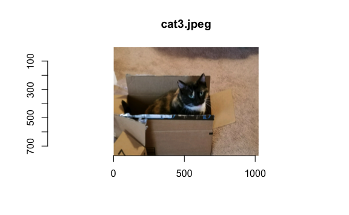
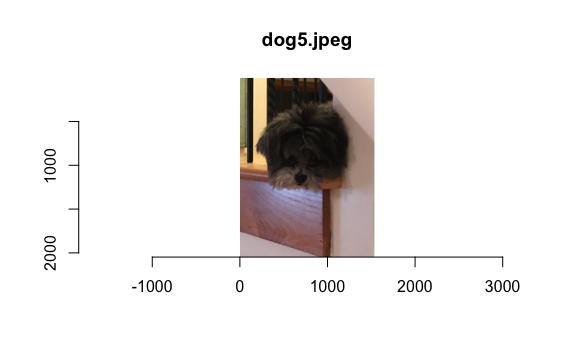

Lab 10 Deep Learning Exercises
================
Evan Woods
2024-01-01

## Applied

### Question 6:

Consider the simple function R(β) = sin(β) + β/10

- **Question 6-a**: Draw a graph of this funciton over the range β ∈
  \[-6, 6\]
  - **Answer**:
    
- **Question 6-b**: What is the derivative of this function?
  - **Answer**:

<!-- -->

    The derivative of the funciton R(β) = sin(β) + β/10 is δR(β) = cos(β).

- **Question 6-c**:
  - **Answer**:

<!-- -->

    [1] -0.5337573

- **Question 6-d**:
  - **Answer**:

<!-- -->

    [1] -1.15708

### Question 7:

Fit a neural network to the Default data. Use a single hidden layer with
10 units, and dropout regularization. Have a look at Labs 10.9.1-10.9.2
for guidance. Compare the classification performance of your model with
that of linear logistic regression.

    Model: "sequential"
    ________________________________________________________________________________
     Layer (type)                       Output Shape                    Param #     
    ================================================================================
     dense_1 (Dense)                    (None, 10)                      50          
     dropout (Dropout)                  (None, 10)                      0           
     dense (Dense)                      (None, 1)                       11          
    ================================================================================
    Total params: 61 (244.00 Byte)
    Trainable params: 61 (244.00 Byte)
    Non-trainable params: 0 (0.00 Byte)
    ________________________________________________________________________________

    105/105 - 0s - 176ms/epoch - 2ms/step

    The accuracy of the neural network model is 96.610%.

              truth
    prediction    0    1
             0 3218  112
             1    1    2

    The accuracy of the logistic regression model is 97.420%.

         prediction
    truth    0    1
        0 3209   10
        1   76   38

### Question 8:

From your collection of personal photographs, pick 10 images of animals
(such as dogs, cats, birds, farm animals, etc.). If the subject does not
occupy a reasonable part of the image, then crop the image. Now use a
pretrained image classification CNN as in Lab 10.9.4 to predict the
class of each of your images, and report the probabilities for the top
five predicted classes for each image.

    Model: "sequential"
    ________________________________________________________________________________
     Layer (type)                       Output Shape                    Param #     
    ================================================================================
     dense_1 (Dense)                    (None, 10)                      50          
     dropout (Dropout)                  (None, 10)                      0           
     dense (Dense)                      (None, 1)                       11          
    ================================================================================
    Total params: 61 (244.00 Byte)
    Trainable params: 61 (244.00 Byte)
    Non-trainable params: 0 (0.00 Byte)
    ________________________________________________________________________________

    1/1 - 1s - 846ms/epoch - 846ms/step

    The predicted classes and probabilities of the images of dogs and cats are as
    follows with respect to order of appearance:

    $birds.jpeg
      class_name class_description       score
    1  n01820546          lorikeet 0.961650610
    2  n01818515             macaw 0.009002453
    3  n01806143           peacock 0.008250927
    4  n03874599           padlock 0.005620250
    5  n02999410             chain 0.002654100

    $butterfly.jpeg
      class_name class_description      score
    1  n04423845           thimble 0.58907545
    2  n04409515       tennis_ball 0.17006825
    3  n03958227       plastic_bag 0.03801656
    4  n03871628            packet 0.01514976
    5  n01773549       barn_spider 0.01233464

    $cat1.jpeg
      class_name class_description      score
    1  n02124075      Egyptian_cat 0.20266204
    2  n04265275      space_heater 0.13892646
    3  n02105412            kelpie 0.10062172
    4  n02104365        schipperke 0.09486673
    5  n02110806           basenji 0.06643521

    $cat2.jpeg
      class_name class_description      score
    1  n03223299           doormat 0.21453752
    2  n04074963    remote_control 0.09869209
    3  n02113186          Cardigan 0.07454871
    4  n02123045             tabby 0.06722851
    5  n02123159         tiger_cat 0.06283280

    $cat3.jpeg
      class_name class_description        score
    1  n02971356            carton 0.9914653897
    2  n04004767           printer 0.0020149811
    3  n03127925             crate 0.0016998923
    4  n02916936  bulletproof_vest 0.0009906454
    5  n02105162          malinois 0.0003613399

    $dog1.jpg
      class_name class_description       score
    1  n02098413             Lhasa 0.484432071
    2  n02086240          Shih-Tzu 0.462051690
    3  n02097474   Tibetan_terrier 0.016058447
    4  n02113624        toy_poodle 0.008868926
    5  n02094433 Yorkshire_terrier 0.007705405

    $dog2.jpeg
      class_name    class_description      score
    1  n02108551      Tibetan_mastiff 0.29876935
    2  n02111277         Newfoundland 0.29656842
    3  n02106382 Bouvier_des_Flandres 0.26543206
    4  n02112137                 chow 0.07458649
    5  n02105056          groenendael 0.03799465

    $dog3.jpeg
      class_name   class_description      score
    1  n02086240            Shih-Tzu 0.88302189
    2  n02097047 miniature_schnauzer 0.04248711
    3  n02110627       affenpinscher 0.02213948
    4  n02085936         Maltese_dog 0.01723721
    5  n02098413               Lhasa 0.01470254

    $dog4.jpeg
      class_name class_description      score
    1  n02086240          Shih-Tzu 0.60574049
    2  n02098413             Lhasa 0.15268034
    3  n02110627     affenpinscher 0.07483345
    4  n02085936       Maltese_dog 0.05702168
    5  n02094433 Yorkshire_terrier 0.01930033

    $dog5.jpeg
      class_name class_description       score
    1  n02086240          Shih-Tzu 0.824865639
    2  n02098413             Lhasa 0.127952948
    3  n02110627     affenpinscher 0.024699720
    4  n02113624        toy_poodle 0.011461542
    5  n02086079          Pekinese 0.003910229

### Question 9:

Fit a lag-5 autoregressive model to the NYSE data, as described in the
text and Lab 10.9.6. Refit the model with a 12-level factor representing
the month. Does this factor improve the performance of the model?

     [1] "dayfri"            "daymon"            "daythur"          
     [4] "daytues"           "daywed"            "L1.DJ_return"     
     [7] "L1.log_volume"     "L1.log_volatility" "L2.DJ_return"     
    [10] "L2.log_volume"     "L2.log_volatility" "L3.DJ_return"     
    [13] "L3.log_volume"     "L3.log_volatility" "L4.DJ_return"     
    [16] "L4.log_volume"     "L4.log_volatility" "L5.DJ_return"     
    [19] "L5.log_volume"     "L5.log_volatility"

    56/56 - 0s - 107ms/epoch - 2ms/step

    The R-squared value of the lag-5 autoregressive model with a 5-level factor
    representing the day of the week is 0.447.

    56/56 - 0s - 112ms/epoch - 2ms/step

    The lag-5 autoregressive model refit with a 12-level factor representing the
    month has an R-squared value of 0.400.

    The inclusion of the 12-level factor representing the month reduced the fit of
    the model to the data.

### Question 10:

In Section 10.9.6, we showed how to fit a linear AR model to the NYSE
data using the lm() function. However, we also mentioned that we can
“flatten” the short sequences produced for the RNN model in order to fit
a linear AR model. Use this latter approach to fit a linear AR model to
the NYSE data. Compare the test R-squared of this linear AR model to
that of the linear AR model that we fit in the lab. What are the
advantages/disadvantages of each approach?

    [1] 6046    5    3

    56/56 - 0s - 97ms/epoch - 2ms/step

    The R-squared value of the linear autoregressive model fit in the lab is:
    0.413223. The R-squared value of the linear autoregressive model fit using
    a flattened sequences produced for the RNN model is 0.413508. These figures
    are identical to at least 5 significant digits. The advantages of using the
    lm function to create an autoregressive model is a reduction in time training
    the model. The advantage of using a neural network is the ability to add
    non-linearities to the existing model by including hidden layers in the future.

### Question 11:

Repeat the previous exercise, but now fit a nonlinear AR model by
“flattening” the short sequences produced for the RNN model.

    56/56 - 0s - 121ms/epoch - 2ms/step

    The R-squared value of the flat-input, non-linear autoregressive model is
    0.40389.

### Question 12:

Consider the RNN fit to the NYSE data in Section 10.9.6. Modify the code
to allow inclusion of the variable day_of_week, and fit the RNN. Compute
the test R-squared.

    56/56 - 0s - 480ms/epoch - 9ms/step

    The test R-squared of the RNN fit to include the day of the week is 0.4824802.

### Question 13:

Repeat the analysis of Lab 10.9.5 on the IMDb data using a similarly
structured neural network. There we used a dictionary of size 10,000.
Consider the effects of varying the dictionary size. Try the values
1000, 3000, 5000, and 10,000, and compare the results.

    The model training accuracy for dictionary size of 1000:
    Final epoch (plot to see history):
            loss: 0.3013
        accuracy: 0.8771
        val_loss: 0.3308
    val_accuracy: 0.845 

    The model test accuracy for dictionary size of 1000:
    Final epoch (plot to see history):
            loss: 0.301
        accuracy: 0.8779
        val_loss: 0.331
    val_accuracy: 0.8591 
    The model training accuracy for dictionary size of 3000:
    Final epoch (plot to see history):
            loss: 0.2024
        accuracy: 0.925
        val_loss: 0.3686
    val_accuracy: 0.87 

    The model test accuracy for dictionary size of 3000:
    Final epoch (plot to see history):
            loss: 0.201
        accuracy: 0.9264
        val_loss: 0.359
    val_accuracy: 0.8661 
    The model training accuracy for dictionary size of 5000:
    Final epoch (plot to see history):
            loss: 0.1413
        accuracy: 0.9572
        val_loss: 0.4281
    val_accuracy: 0.862 

    The model test accuracy for dictionary size of 5000:
    Final epoch (plot to see history):
            loss: 0.1408
        accuracy: 0.9518
        val_loss: 0.4652
    val_accuracy: 0.853 
    The model training accuracy for dictionary size of 10000:
    Final epoch (plot to see history):
            loss: 0.03654
        accuracy: 0.993
        val_loss: 0.7529
    val_accuracy: 0.8605 

    The model test accuracy for dictionary size of 10000:
    Final epoch (plot to see history):
            loss: 0.03655
        accuracy: 0.9915
        val_loss: 0.8344
    val_accuracy: 0.8434 

    The training accuracy of the model increased with dictionary size. The test
    validation accuracy peaked at a dictionary size of 3000. Increasing the
    dicitonary size did not necessarily increase the test validation accuracy.
