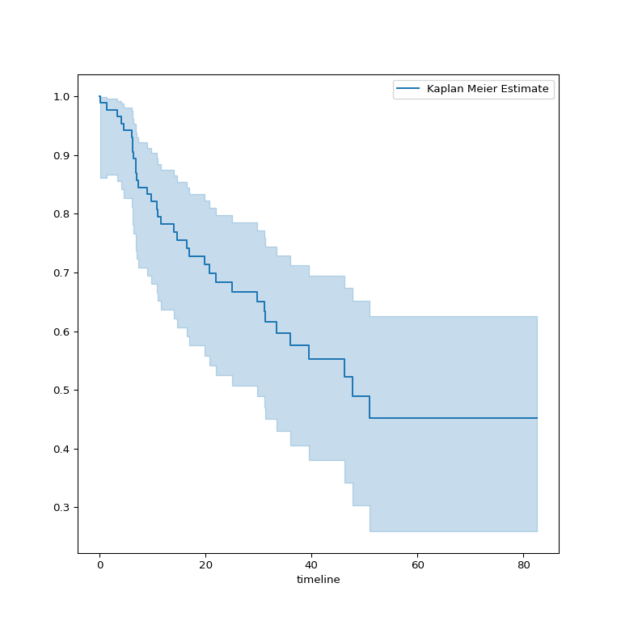
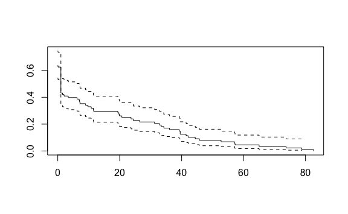
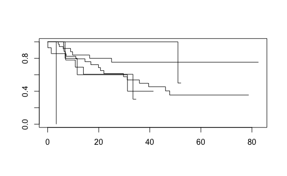

Lab 11 Survival Analysis Exercises
================
Evan Woods
2024-01-11

## Applied

### Question 10:

This exercise focuses on the brain tumor data, which is included in the
ISLR2 R library.

- **Question 10-a**: Plot the Kaplan-Meier survival curve with ±1
  standard error bands, using the survfit() function in the survival
  package.
  - **Answer (Python)**:

- **Question 10-b**: Draw a bootstrap sample of size n = 88 from the
  pairs (y, δ), and compute the resulting Kaplan-Meier survival curve.
  Repeat this process B = 200 times. Use the results to obtain an
  estimate of the standard error of the Kaplan-Meier survival curve at
  each timepoint. Compare this to the standard errors obtained in (a).
  - **Answer (R)**:

<!-- -->

    A bootstrapped sample of size 88:

- **Question 10-c**: Fit a Cox proportional hazards model that uses all
  of the predictors to predict survival. Summarize the main findings.
  - **Answer**:

<!-- -->

    Call:
    coxph(formula = Surv(time, status) ~ ., data = BrainCancer)

      n= 87, number of events= 35 
       (1 observation deleted due to missingness)

                           coef exp(coef) se(coef)      z Pr(>|z|)    
    sexMale             0.18375   1.20171  0.36036  0.510  0.61012    
    diagnosisLG glioma  0.91502   2.49683  0.63816  1.434  0.15161    
    diagnosisHG glioma  2.15457   8.62414  0.45052  4.782 1.73e-06 ***
    diagnosisOther      0.88570   2.42467  0.65787  1.346  0.17821    
    locSupratentorial   0.44119   1.55456  0.70367  0.627  0.53066    
    ki                 -0.05496   0.94653  0.01831 -3.001  0.00269 ** 
    gtv                 0.03429   1.03489  0.02233  1.536  0.12466    
    stereoSRT           0.17778   1.19456  0.60158  0.296  0.76760    
    ---
    Signif. codes:  0 '***' 0.001 '**' 0.01 '*' 0.05 '.' 0.1 ' ' 1

                       exp(coef) exp(-coef) lower .95 upper .95
    sexMale               1.2017     0.8321    0.5930    2.4352
    diagnosisLG glioma    2.4968     0.4005    0.7148    8.7215
    diagnosisHG glioma    8.6241     0.1160    3.5664   20.8546
    diagnosisOther        2.4247     0.4124    0.6678    8.8031
    locSupratentorial     1.5546     0.6433    0.3914    6.1741
    ki                    0.9465     1.0565    0.9132    0.9811
    gtv                   1.0349     0.9663    0.9906    1.0812
    stereoSRT             1.1946     0.8371    0.3674    3.8839

    Concordance= 0.794  (se = 0.04 )
    Likelihood ratio test= 41.37  on 8 df,   p=2e-06
    Wald test            = 38.7  on 8 df,   p=6e-06
    Score (logrank) test = 46.59  on 8 df,   p=2e-07

    The risk of death associated with HG glioma is more than 8 times the risk
    of death associated with meningioma. This is a statistically significant
    difference. Because the Karnofsky index is negative, there a lower risk of death
    and greater chance of life expectancy with an increased Karnofsky score.

- **Question 10-d**: Stratify the data by the value of ki.
  - **Answer**:

<!-- -->

    Call: survfit(formula = Surv(time, status) ~ ki, data = BrainCancer)

            n events median 0.95LCL 0.95UCL
    ki=40   1      1   3.38      NA      NA
    ki=60   5      3  31.25    11.6      NA
    ki=70  14      6  33.41    10.8      NA
    ki=80  36     18  35.93    22.0      NA
    ki=90  27      6     NA      NA      NA
    ki=100  5      1  51.02    51.0      NA

