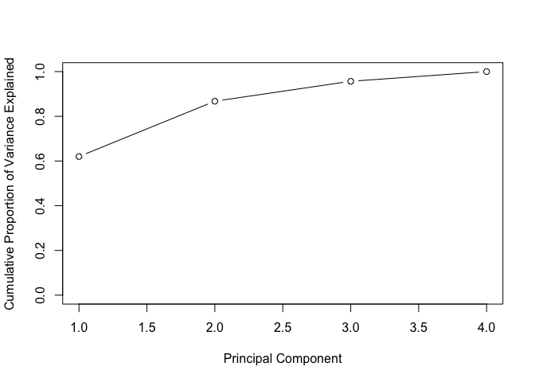

Lab 12 Unsupervised Learning
================
Evan Woods
2024-01-11

## Principal Component Analysis

    ## Mean of USArrests Categories:

    ##   Murder  Assault UrbanPop     Rape 
    ##    7.788  170.760   65.540   21.232

    ## Variance of USArrests Categories:

    ##     Murder    Assault   UrbanPop       Rape 
    ##   18.97047 6945.16571  209.51878   87.72916

    ## Standard Error of USArrests before PCA:

    ##    Murder   Assault  UrbanPop      Rape 
    ##  4.355510 83.337661 14.474763  9.366385

    ## Principal Component Loadings:

    ##                 PC1        PC2        PC3         PC4
    ## Murder   -0.5358995 -0.4181809  0.3412327  0.64922780
    ## Assault  -0.5831836 -0.1879856  0.2681484 -0.74340748
    ## UrbanPop -0.2781909  0.8728062  0.3780158  0.13387773
    ## Rape     -0.5434321  0.1673186 -0.8177779  0.08902432

<!-- -->

    ##                 PC1        PC2        PC3         PC4
    ## Murder   -0.5358995 -0.4181809  0.3412327  0.64922780
    ## Assault  -0.5831836 -0.1879856  0.2681484 -0.74340748
    ## UrbanPop -0.2781909  0.8728062  0.3780158  0.13387773
    ## Rape     -0.5434321  0.1673186 -0.8177779  0.08902432

<!-- -->

<!-- -->

<!-- -->

## Matrix Completion

    ## Importance of components:
    ##                           PC1    PC2     PC3     PC4
    ## Standard deviation     1.5749 0.9949 0.59713 0.41645
    ## Proportion of Variance 0.6201 0.2474 0.08914 0.04336
    ## Cumulative Proportion  0.6201 0.8675 0.95664 1.00000

    ## [1] "d" "u" "v"

    ##        [,1]   [,2]   [,3]   [,4]
    ## [1,] -0.536 -0.418  0.341  0.649
    ## [2,] -0.583 -0.188  0.268 -0.743
    ## [3,] -0.278  0.873  0.378  0.134
    ## [4,] -0.543  0.167 -0.818  0.089

    ##                 PC1        PC2        PC3         PC4
    ## Murder   -0.5358995 -0.4181809  0.3412327  0.64922780
    ## Assault  -0.5831836 -0.1879856  0.2681484 -0.74340748
    ## UrbanPop -0.2781909  0.8728062  0.3780158  0.13387773
    ## Rape     -0.5434321  0.1673186 -0.8177779  0.08902432

    ## Iter: 1 MSS: 0.3606412 Rel.Err: 0.6123572 
    ## Iter: 2 MSS: 0.3452951 Rel.Err: 0.01632607 
    ## Iter: 3 MSS: 0.3436434 Rel.Err: 0.001757148 
    ## Iter: 4 MSS: 0.3434442 Rel.Err: 0.0002119255 
    ## Iter: 5 MSS: 0.3434165 Rel.Err: 2.944139e-05 
    ## Iter: 6 MSS: 0.3434118 Rel.Err: 4.947942e-06 
    ## Iter: 7 MSS: 0.3434109 Rel.Err: 1.036645e-06 
    ## Iter: 8 MSS: 0.3434106 Rel.Err: 2.643686e-07 
    ## Iter: 9 MSS: 0.3434105 Rel.Err: 7.72858e-08

    ## [1] 0.6861948

## K-Means Clustering

<!-- -->

    ## K-means clustering with 3 clusters of sizes 10, 23, 17
    ## 
    ## Cluster means:
    ##         [,1]        [,2]
    ## 1  2.3001545 -2.69622023
    ## 2 -0.3820397 -0.08740753
    ## 3  3.7789567 -4.56200798
    ## 
    ## Clustering vector:
    ##  [1] 3 1 3 1 3 3 3 1 3 1 3 1 3 1 3 1 3 3 3 3 3 1 3 3 3 2 2 2 2 2 2 2 2 2 2 2 2 2
    ## [39] 2 2 2 2 2 1 2 1 2 2 2 2
    ## 
    ## Within cluster sum of squares by cluster:
    ## [1] 19.56137 52.67700 25.74089
    ##  (between_SS / total_SS =  79.3 %)
    ## 
    ## Available components:
    ## 
    ## [1] "cluster"      "centers"      "totss"        "withinss"     "tot.withinss"
    ## [6] "betweenss"    "size"         "iter"         "ifault"

<!-- -->

    ## [1] 104.3319

    ## [1] 97.97927

# Hierarchical Clustering

<!-- -->

<!-- -->

<!-- -->
\## NCI160 Data Example

    ## [1]   64 6830

    ## [1] "CNS"   "CNS"   "CNS"   "RENAL"

    ## nci.labs
    ##      BREAST         CNS       COLON K562A-repro K562B-repro    LEUKEMIA 
    ##           7           5           7           1           1           6 
    ## MCF7A-repro MCF7D-repro    MELANOMA       NSCLC     OVARIAN    PROSTATE 
    ##           1           1           8           9           6           2 
    ##       RENAL     UNKNOWN 
    ##           9           1

<!-- -->

    ## Importance of components:
    ##                            PC1      PC2      PC3      PC4      PC5      PC6
    ## Standard deviation     27.8535 21.48136 19.82046 17.03256 15.97181 15.72108
    ## Proportion of Variance  0.1136  0.06756  0.05752  0.04248  0.03735  0.03619
    ## Cumulative Proportion   0.1136  0.18115  0.23867  0.28115  0.31850  0.35468
    ##                             PC7      PC8      PC9     PC10     PC11     PC12
    ## Standard deviation     14.47145 13.54427 13.14400 12.73860 12.68672 12.15769
    ## Proportion of Variance  0.03066  0.02686  0.02529  0.02376  0.02357  0.02164
    ## Cumulative Proportion   0.38534  0.41220  0.43750  0.46126  0.48482  0.50646
    ##                            PC13     PC14     PC15     PC16     PC17     PC18
    ## Standard deviation     11.83019 11.62554 11.43779 11.00051 10.65666 10.48880
    ## Proportion of Variance  0.02049  0.01979  0.01915  0.01772  0.01663  0.01611
    ## Cumulative Proportion   0.52695  0.54674  0.56590  0.58361  0.60024  0.61635
    ##                            PC19    PC20     PC21    PC22    PC23    PC24
    ## Standard deviation     10.43518 10.3219 10.14608 10.0544 9.90265 9.64766
    ## Proportion of Variance  0.01594  0.0156  0.01507  0.0148 0.01436 0.01363
    ## Cumulative Proportion   0.63229  0.6479  0.66296  0.6778 0.69212 0.70575
    ##                           PC25    PC26    PC27   PC28    PC29    PC30    PC31
    ## Standard deviation     9.50764 9.33253 9.27320 9.0900 8.98117 8.75003 8.59962
    ## Proportion of Variance 0.01324 0.01275 0.01259 0.0121 0.01181 0.01121 0.01083
    ## Cumulative Proportion  0.71899 0.73174 0.74433 0.7564 0.76824 0.77945 0.79027
    ##                           PC32    PC33    PC34    PC35    PC36    PC37    PC38
    ## Standard deviation     8.44738 8.37305 8.21579 8.15731 7.97465 7.90446 7.82127
    ## Proportion of Variance 0.01045 0.01026 0.00988 0.00974 0.00931 0.00915 0.00896
    ## Cumulative Proportion  0.80072 0.81099 0.82087 0.83061 0.83992 0.84907 0.85803
    ##                           PC39    PC40    PC41   PC42    PC43   PC44    PC45
    ## Standard deviation     7.72156 7.58603 7.45619 7.3444 7.10449 7.0131 6.95839
    ## Proportion of Variance 0.00873 0.00843 0.00814 0.0079 0.00739 0.0072 0.00709
    ## Cumulative Proportion  0.86676 0.87518 0.88332 0.8912 0.89861 0.9058 0.91290
    ##                          PC46    PC47    PC48    PC49    PC50    PC51    PC52
    ## Standard deviation     6.8663 6.80744 6.64763 6.61607 6.40793 6.21984 6.20326
    ## Proportion of Variance 0.0069 0.00678 0.00647 0.00641 0.00601 0.00566 0.00563
    ## Cumulative Proportion  0.9198 0.92659 0.93306 0.93947 0.94548 0.95114 0.95678
    ##                           PC53    PC54    PC55    PC56    PC57   PC58    PC59
    ## Standard deviation     6.06706 5.91805 5.91233 5.73539 5.47261 5.2921 5.02117
    ## Proportion of Variance 0.00539 0.00513 0.00512 0.00482 0.00438 0.0041 0.00369
    ## Cumulative Proportion  0.96216 0.96729 0.97241 0.97723 0.98161 0.9857 0.98940
    ##                           PC60    PC61    PC62    PC63      PC64
    ## Standard deviation     4.68398 4.17567 4.08212 4.04124 1.883e-14
    ## Proportion of Variance 0.00321 0.00255 0.00244 0.00239 0.000e+00
    ## Cumulative Proportion  0.99262 0.99517 0.99761 1.00000 1.000e+00

<!-- -->

<!-- -->

<!-- -->

<!-- -->

    ##            nci.labs
    ## hc.clusters BREAST CNS COLON K562A-repro K562B-repro LEUKEMIA MCF7A-repro
    ##           1      2   3     2           0           0        0           0
    ##           2      3   2     0           0           0        0           0
    ##           3      0   0     0           1           1        6           0
    ##           4      2   0     5           0           0        0           1
    ##            nci.labs
    ## hc.clusters MCF7D-repro MELANOMA NSCLC OVARIAN PROSTATE RENAL UNKNOWN
    ##           1           0        8     8       6        2     8       1
    ##           2           0        0     1       0        0     1       0
    ##           3           0        0     0       0        0     0       0
    ##           4           1        0     0       0        0     0       0

<!-- -->

    ## 
    ## Call:
    ## hclust(d = dist(sd.data))
    ## 
    ## Cluster method   : complete 
    ## Distance         : euclidean 
    ## Number of objects: 64

    ##            hc.clusters
    ## km.clusters  1  2  3  4
    ##           1  0  0  8  0
    ##           2 11  0  0  9
    ##           3 20  7  0  0
    ##           4  9  0  0  0

<!-- -->

    ##    nci.labs
    ##     BREAST CNS COLON K562A-repro K562B-repro LEUKEMIA MCF7A-repro MCF7D-repro
    ##   1      0   2     7           0           0        2           0           0
    ##   2      5   3     0           0           0        0           0           0
    ##   3      0   0     0           1           1        4           0           0
    ##   4      2   0     0           0           0        0           1           1
    ##    nci.labs
    ##     MELANOMA NSCLC OVARIAN PROSTATE RENAL UNKNOWN
    ##   1        1     8       5        2     7       0
    ##   2        7     1       1        0     2       1
    ##   3        0     0       0        0     0       0
    ##   4        0     0       0        0     0       0

    ## Module(matplotlib.pyplot)

## Python

    ## Index(['Murder', 'Assault', 'UrbanPop', 'Rape'], dtype='object')

    ## Murder        7.788
    ## Assault     170.760
    ## UrbanPop     65.540
    ## Rape         21.232
    ## dtype: float64

    ## Murder        18.970465
    ## Assault     6945.165714
    ## UrbanPop     209.518776
    ## Rape          87.729159
    ## dtype: float64

<pre>PCA()</pre><b>In a Jupyter environment, please rerun this cell to show the HTML representation or trust the notebook.  On GitHub, the HTML representation is unable to render, please try loading this page with nbviewer.org.</b>

<input class="sk-toggleable__control sk-hidden--visually" id="sk-estimator-id-1" type="checkbox" checked><label for="sk-estimator-id-1" class="sk-toggleable__label sk-toggleable__label-arrow">PCA</label>
<pre>PCA()</pre>

