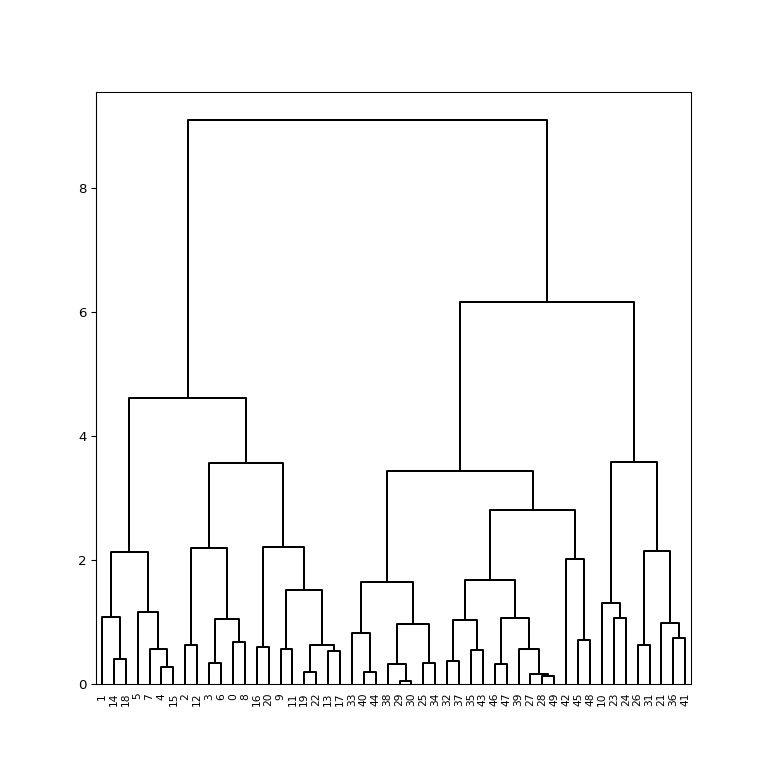
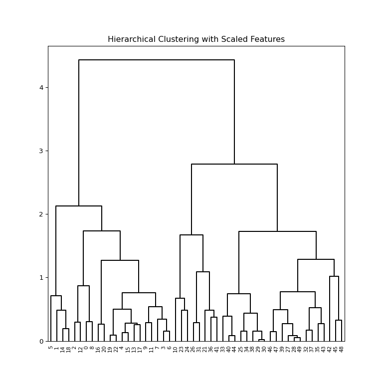

Lab 12 Unsupervised Learning (Python)
================
Evan Woods
2024-01-11

## Principal Component Analysis

    ## Index(['Murder', 'Assault', 'UrbanPop', 'Rape'], dtype='object')

    ## Murder        7.788
    ## Assault     170.760
    ## UrbanPop     65.540
    ## Rape         21.232
    ## dtype: float64

    ## Murder        18.970465
    ## Assault     6945.165714
    ## UrbanPop     209.518776
    ## Rape          87.729159
    ## dtype: float64

<pre>PCA()</pre><b>In a Jupyter environment, please rerun this cell to show the HTML representation or trust the notebook.  On GitHub, the HTML representation is unable to render, please try loading this page with nbviewer.org.</b>

<input class="sk-toggleable__control sk-hidden--visually" id="sk-estimator-id-1" type="checkbox" checked><label for="sk-estimator-id-1" class="sk-toggleable__label sk-toggleable__label-arrow">PCA</label>
<pre>PCA()</pre>

    ## array([-7.10542736e-17,  1.38777878e-16, -4.39648318e-16,  8.59312621e-16])

    ## array([1.5908673 , 1.00496987, 0.6031915 , 0.4206774 ])

    ## array([2.53085875, 1.00996444, 0.36383998, 0.17696948])

    ## array([0.62006039, 0.24744129, 0.0891408 , 0.04335752])

    ## (0.0, 1.0)

    ## (0.0, 1.0)

    ## array([ 1,  3, 11,  8])

## Matrix Completion

    ## ((50, 4), (4,), (4, 4))

    ## array([[-0.53589947, -0.58318363, -0.27819087, -0.54343209],
    ##        [-0.41818087, -0.1879856 ,  0.87280619,  0.16731864],
    ##        [ 0.34123273,  0.26814843,  0.37801579, -0.81777791],
    ##        [ 0.6492278 , -0.74340748,  0.13387773,  0.08902432]])

    ## array([[ 0.53589947,  0.58318363,  0.27819087,  0.54343209],
    ##        [-0.41818087, -0.1879856 ,  0.87280619,  0.16731864],
    ##        [-0.34123273, -0.26814843, -0.37801579,  0.81777791],
    ##        [ 0.6492278 , -0.74340748,  0.13387773,  0.08902432]])

    ## array([[-0.98556588, -1.13339238,  0.44426879,  0.15626714],
    ##        [-1.95013775, -1.07321326, -2.04000333, -0.43858344],
    ##        [-1.76316354,  0.74595678, -0.05478082, -0.83465292]])

    ## array([[ 0.98556588, -1.13339238, -0.44426879,  0.15626714],
    ##        [ 1.95013775, -1.07321326,  2.04000333, -0.43858344],
    ##        [ 1.76316354,  0.74595678,  0.05478082, -0.83465292]])

    ## Iteration: 1, MSS:0.391, Rel.Err 6.04e-01
    ## Iteration: 2, MSS:0.391, Rel.Err 0.00e+00

    ## 0.8567748296331298

    ## array([0, 0, 0, 0, 0, 0, 0, 0, 0, 0, 0, 0, 0, 0, 0, 0, 0, 0, 0, 0, 0, 1,
    ##        0, 0, 0, 1, 1, 1, 1, 1, 1, 1, 1, 1, 1, 1, 1, 1, 1, 1, 1, 1, 1, 1,
    ##        1, 1, 1, 1, 1, 1], dtype=int32)

    ## (76.85131986999252, 75.06261242745384)

<pre>AgglomerativeClustering(distance_threshold=0, linkage=&#x27;complete&#x27;,
                        n_clusters=None)</pre><b>In a Jupyter environment, please rerun this cell to show the HTML representation or trust the notebook.  On GitHub, the HTML representation is unable to render, please try loading this page with nbviewer.org.</b>

<input class="sk-toggleable__control sk-hidden--visually" id="sk-estimator-id-2" type="checkbox" checked><label for="sk-estimator-id-2" class="sk-toggleable__label sk-toggleable__label-arrow">AgglomerativeClustering</label>
<pre>AgglomerativeClustering(distance_threshold=0, linkage=&#x27;complete&#x27;,
                        n_clusters=None)</pre>

<pre>AgglomerativeClustering(distance_threshold=0, linkage=&#x27;single&#x27;,
                        metric=&#x27;precomputed&#x27;, n_clusters=None)</pre><b>In a Jupyter environment, please rerun this cell to show the HTML representation or trust the notebook.  On GitHub, the HTML representation is unable to render, please try loading this page with nbviewer.org.</b>

<input class="sk-toggleable__control sk-hidden--visually" id="sk-estimator-id-3" type="checkbox" checked><label for="sk-estimator-id-3" class="sk-toggleable__label sk-toggleable__label-arrow">AgglomerativeClustering</label>
<pre>AgglomerativeClustering(distance_threshold=0, linkage=&#x27;single&#x27;,
                        metric=&#x27;precomputed&#x27;, n_clusters=None)</pre>

    ## array([[0, 1, 0, 0, 1, 1, 0, 1, 0, 0, 2, 0, 0, 0, 1, 1, 0, 0, 1, 0, 0, 2,
    ##         0, 2, 2, 3, 2, 3, 3, 3, 3, 2, 3, 3, 3, 3, 2, 3, 3, 3, 3, 2, 3, 3,
    ##         3, 3, 3, 3, 3, 3]])

    ## array([[0],
    ##        [0],
    ##        [0],
    ##        [0],
    ##        [0],
    ##        [0],
    ##        [0],
    ##        [0],
    ##        [0],
    ##        [0],
    ##        [1],
    ##        [0],
    ##        [0],
    ##        [0],
    ##        [0],
    ##        [0],
    ##        [0],
    ##        [0],
    ##        [0],
    ##        [0],
    ##        [0],
    ##        [1],
    ##        [0],
    ##        [1],
    ##        [1],
    ##        [2],
    ##        [1],
    ##        [2],
    ##        [2],
    ##        [2],
    ##        [2],
    ##        [1],
    ##        [2],
    ##        [2],
    ##        [2],
    ##        [2],
    ##        [1],
    ##        [2],
    ##        [2],
    ##        [2],
    ##        [2],
    ##        [1],
    ##        [2],
    ##        [2],
    ##        [2],
    ##        [2],
    ##        [2],
    ##        [2],
    ##        [2],
    ##        [2]])

    ## {'icoord': [[25.0, 25.0, 35.0, 35.0], [15.0, 15.0, 30.0, 30.0], [5.0, 5.0, 22.5, 22.5], [45.0, 45.0, 55.0, 55.0], [65.0, 65.0, 75.0, 75.0], [50.0, 50.0, 70.0, 70.0], [85.0, 85.0, 95.0, 95.0], [105.0, 105.0, 115.0, 115.0], [125.0, 125.0, 135.0, 135.0], [145.0, 145.0, 155.0, 155.0], [130.0, 130.0, 150.0, 150.0], [110.0, 110.0, 140.0, 140.0], [165.0, 165.0, 175.0, 175.0], [195.0, 195.0, 205.0, 205.0], [185.0, 185.0, 200.0, 200.0], [170.0, 170.0, 192.5, 192.5], [125.0, 125.0, 181.25, 181.25], [90.0, 90.0, 153.125, 153.125], [60.0, 60.0, 121.5625, 121.5625], [13.75, 13.75, 90.78125, 90.78125], [225.0, 225.0, 235.0, 235.0], [215.0, 215.0, 230.0, 230.0], [245.0, 245.0, 255.0, 255.0], [275.0, 275.0, 285.0, 285.0], [265.0, 265.0, 280.0, 280.0], [250.0, 250.0, 272.5, 272.5], [222.5, 222.5, 261.25, 261.25], [305.0, 305.0, 315.0, 315.0], [295.0, 295.0, 310.0, 310.0], [325.0, 325.0, 335.0, 335.0], [355.0, 355.0, 365.0, 365.0], [345.0, 345.0, 360.0, 360.0], [330.0, 330.0, 352.5, 352.5], [302.5, 302.5, 341.25, 341.25], [375.0, 375.0, 385.0, 385.0], [415.0, 415.0, 425.0, 425.0], [405.0, 405.0, 420.0, 420.0], [395.0, 395.0, 412.5, 412.5], [380.0, 380.0, 403.75, 403.75], [435.0, 435.0, 445.0, 445.0], [455.0, 455.0, 465.0, 465.0], [440.0, 440.0, 460.0, 460.0], [391.875, 391.875, 450.0, 450.0], [485.0, 485.0, 495.0, 495.0], [475.0, 475.0, 490.0, 490.0], [420.9375, 420.9375, 482.5, 482.5], [321.875, 321.875, 451.71875, 451.71875], [241.875, 241.875, 386.796875, 386.796875], [52.265625, 52.265625, 314.3359375, 314.3359375]], 'dcoord': [[0.0, 0.19628069948251511, 0.19628069948251511, 0.0], [0.0, 0.48392423212193414, 0.48392423212193414, 0.19628069948251511], [0.0, 0.7135377100387716, 0.7135377100387716, 0.48392423212193414], [0.0, 0.2976541786747042, 0.2976541786747042, 0.0], [0.0, 0.30516339337670195, 0.30516339337670195, 0.0], [0.2976541786747042, 0.8723668662926758, 0.8723668662926758, 0.30516339337670195], [0.0, 0.26501932346128093, 0.26501932346128093, 0.0], [0.0, 0.08756184580278303, 0.08756184580278303, 0.0], [0.0, 0.13343817468558042, 0.13343817468558042, 0.0], [0.0, 0.2543750429319371, 0.2543750429319371, 0.0], [0.13343817468558042, 0.2791346139460614, 0.2791346139460614, 0.2543750429319371], [0.08756184580278303, 0.5009391862417484, 0.5009391862417484, 0.2791346139460614], [0.0, 0.28770697877954954, 0.28770697877954954, 0.0], [0.0, 0.15641768862400285, 0.15641768862400285, 0.0], [0.0, 0.3392416033644874, 0.3392416033644874, 0.15641768862400285], [0.28770697877954954, 0.5375870368343082, 0.5375870368343082, 0.3392416033644874], [0.5009391862417484, 0.7609576694738933, 0.7609576694738933, 0.5375870368343082], [0.26501932346128093, 1.2684619259760448, 1.2684619259760448, 0.7609576694738933], [0.8723668662926758, 1.731887439773664, 1.731887439773664, 1.2684619259760448], [0.7135377100387716, 2.1245110188312286, 2.1245110188312286, 1.731887439773664], [0.0, 0.48181670658716497, 0.48181670658716497, 0.0], [0.0, 0.6703267106537382, 0.6703267106537382, 0.48181670658716497], [0.0, 0.2901155188890738, 0.2901155188890738, 0.0], [0.0, 0.37167541842164453, 0.37167541842164453, 0.0], [0.0, 0.48380462227691073, 0.48380462227691073, 0.37167541842164453], [0.2901155188890738, 1.0921429865659618, 1.0921429865659618, 0.48380462227691073], [0.6703267106537382, 1.6744304600910098, 1.6744304600910098, 1.0921429865659618], [0.0, 0.08432808211171142, 0.08432808211171142, 0.0], [0.0, 0.3914188508534302, 0.3914188508534302, 0.08432808211171142], [0.0, 0.15053590393568544, 0.15053590393568544, 0.0], [0.0, 0.019646975321372908, 0.019646975321372908, 0.0], [0.0, 0.1554955899762721, 0.1554955899762721, 0.019646975321372908], [0.15053590393568544, 0.4338579934232876, 0.4338579934232876, 0.1554955899762721], [0.3914188508534302, 0.7405970725441149, 0.7405970725441149, 0.4338579934232876], [0.0, 0.1431657754152673, 0.1431657754152673, 0.0], [0.0, 0.05440501639366891, 0.05440501639366891, 0.0], [0.0, 0.08055770052070442, 0.08055770052070442, 0.05440501639366891], [0.0, 0.27361389420342036, 0.27361389420342036, 0.08055770052070442], [0.1431657754152673, 0.4921185004229313, 0.4921185004229313, 0.27361389420342036], [0.0, 0.17177472638472616, 0.17177472638472616, 0.0], [0.0, 0.26948507562139745, 0.26948507562139745, 0.0], [0.17177472638472616, 0.5240331380447186, 0.5240331380447186, 0.26948507562139745], [0.4921185004229313, 0.7730083694254558, 0.7730083694254558, 0.5240331380447186], [0.0, 0.3304324305832412, 0.3304324305832412, 0.0], [0.0, 1.0177467896506935, 1.0177467896506935, 0.3304324305832412], [0.7730083694254558, 1.2861762094759337, 1.2861762094759337, 1.0177467896506935], [0.7405970725441149, 1.7266113202697342, 1.7266113202697342, 1.2861762094759337], [1.6744304600910098, 2.784862362257403, 2.784862362257403, 1.7266113202697342], [2.1245110188312286, 4.430314084268388, 4.430314084268388, 2.784862362257403]], 'ivl': ['5', '1', '14', '18', '2', '12', '0', '8', '16', '20', '19', '22', '4', '15', '13', '17', '9', '11', '7', '3', '6', '10', '23', '24', '26', '31', '21', '36', '41', '33', '40', '44', '25', '34', '38', '29', '30', '46', '47', '39', '27', '28', '49', '32', '37', '35', '43', '42', '45', '48'], 'leaves': [5, 1, 14, 18, 2, 12, 0, 8, 16, 20, 19, 22, 4, 15, 13, 17, 9, 11, 7, 3, 6, 10, 23, 24, 26, 31, 21, 36, 41, 33, 40, 44, 25, 34, 38, 29, 30, 46, 47, 39, 27, 28, 49, 32, 37, 35, 43, 42, 45, 48], 'color_list': ['black', 'black', 'black', 'black', 'black', 'black', 'black', 'black', 'black', 'black', 'black', 'black', 'black', 'black', 'black', 'black', 'black', 'black', 'black', 'black', 'black', 'black', 'black', 'black', 'black', 'black', 'black', 'black', 'black', 'black', 'black', 'black', 'black', 'black', 'black', 'black', 'black', 'black', 'black', 'black', 'black', 'black', 'black', 'black', 'black', 'black', 'black', 'black', 'black'], 'leaves_color_list': ['black', 'black', 'black', 'black', 'black', 'black', 'black', 'black', 'black', 'black', 'black', 'black', 'black', 'black', 'black', 'black', 'black', 'black', 'black', 'black', 'black', 'black', 'black', 'black', 'black', 'black', 'black', 'black', 'black', 'black', 'black', 'black', 'black', 'black', 'black', 'black', 'black', 'black', 'black', 'black', 'black', 'black', 'black', 'black', 'black', 'black', 'black', 'black', 'black', 'black']}

<pre>AgglomerativeClustering(distance_threshold=0, linkage=&#x27;complete&#x27;,
                        metric=&#x27;precomputed&#x27;, n_clusters=None)</pre><b>In a Jupyter environment, please rerun this cell to show the HTML representation or trust the notebook.  On GitHub, the HTML representation is unable to render, please try loading this page with nbviewer.org.</b>

<input class="sk-toggleable__control sk-hidden--visually" id="sk-estimator-id-4" type="checkbox" checked><label for="sk-estimator-id-4" class="sk-toggleable__label sk-toggleable__label-arrow">AgglomerativeClustering</label>
<pre>AgglomerativeClustering(distance_threshold=0, linkage=&#x27;complete&#x27;,
                        metric=&#x27;precomputed&#x27;, n_clusters=None)</pre>

    ## {'icoord': [[15.0, 15.0, 25.0, 25.0], [5.0, 5.0, 20.0, 20.0], [35.0, 35.0, 45.0, 45.0], [65.0, 65.0, 75.0, 75.0], [55.0, 55.0, 70.0, 70.0], [85.0, 85.0, 95.0, 95.0], [105.0, 105.0, 115.0, 115.0], [125.0, 125.0, 135.0, 135.0], [110.0, 110.0, 130.0, 130.0], [90.0, 90.0, 120.0, 120.0], [62.5, 62.5, 105.0, 105.0], [40.0, 40.0, 83.75, 83.75], [12.5, 12.5, 61.875, 61.875], [145.0, 145.0, 155.0, 155.0], [185.0, 185.0, 195.0, 195.0], [175.0, 175.0, 190.0, 190.0], [165.0, 165.0, 182.5, 182.5], [150.0, 150.0, 173.75, 173.75], [225.0, 225.0, 235.0, 235.0], [215.0, 215.0, 230.0, 230.0], [205.0, 205.0, 222.5, 222.5], [245.0, 245.0, 255.0, 255.0], [265.0, 265.0, 275.0, 275.0], [285.0, 285.0, 295.0, 295.0], [270.0, 270.0, 290.0, 290.0], [250.0, 250.0, 280.0, 280.0], [213.75, 213.75, 265.0, 265.0], [161.875, 161.875, 239.375, 239.375], [37.1875, 37.1875, 200.625, 200.625]], 'dcoord': [[0.0, 0.007487706574961228, 0.007487706574961228, 0.0], [0.0, 0.13817222744345137, 0.13817222744345137, 0.007487706574961228], [0.0, 0.04412974864800534, 0.04412974864800534, 0.0], [0.0, 0.0017528305043742476, 0.0017528305043742476, 0.0], [0.0, 0.02052954505108673, 0.02052954505108673, 0.0017528305043742476], [0.0, 0.00060296562007911, 0.00060296562007911, 0.0], [0.0, 2.6019236852303784e-05, 2.6019236852303784e-05, 0.0], [0.0, 0.00041043450138811277, 0.00041043450138811277, 0.0], [2.6019236852303784e-05, 0.006072595919307644, 0.006072595919307644, 0.00041043450138811277], [0.00060296562007911, 0.034191307456319375, 0.034191307456319375, 0.006072595919307644], [0.02052954505108673, 0.20416221174179638, 0.20416221174179638, 0.034191307456319375], [0.04412974864800534, 0.621235068665537, 0.621235068665537, 0.20416221174179638], [0.13817222744345137, 1.4183477458671911, 1.4183477458671911, 0.621235068665537], [0.0, 0.00018923317475416646, 0.00018923317475416646, 0.0], [0.0, 0.0011507254774391074, 0.0011507254774391074, 0.0], [0.0, 0.004723989592061106, 0.004723989592061106, 0.0011507254774391074], [0.0, 0.029330366893285165, 0.029330366893285165, 0.004723989592061106], [0.00018923317475416646, 0.08182635100714686, 0.08182635100714686, 0.029330366893285165], [0.0, 0.0023998528413210485, 0.0023998528413210485, 0.0], [0.0, 0.01733748628480547, 0.01733748628480547, 0.0023998528413210485], [0.0, 0.11155349396294167, 0.11155349396294167, 0.01733748628480547], [0.0, 0.009554371337392453, 0.009554371337392453, 0.0], [0.0, 1.9788888772076518e-07, 1.9788888772076518e-07, 0.0], [0.0, 0.0019817977375063967, 0.0019817977375063967, 0.0], [1.9788888772076518e-07, 0.020485246691060777, 0.020485246691060777, 0.0019817977375063967], [0.009554371337392453, 0.19299252014155988, 0.19299252014155988, 0.020485246691060777], [0.11155349396294167, 0.9895303648490954, 0.9895303648490954, 0.19299252014155988], [0.08182635100714686, 1.9803813246896969, 1.9803813246896969, 0.9895303648490954], [1.4183477458671911, 1.9999808431199106, 1.9999808431199106, 1.9803813246896969]], 'ivl': ['14', '7', '16', '12', '15', '11', '1', '21', '18', '29', '13', '22', '2', '19', '9', '24', '28', '17', '0', '25', '5', '6', '3', '27', '8', '20', '4', '26', '10', '23'], 'leaves': [14, 7, 16, 12, 15, 11, 1, 21, 18, 29, 13, 22, 2, 19, 9, 24, 28, 17, 0, 25, 5, 6, 3, 27, 8, 20, 4, 26, 10, 23], 'color_list': ['black', 'black', 'black', 'black', 'black', 'black', 'black', 'black', 'black', 'black', 'black', 'black', 'black', 'black', 'black', 'black', 'black', 'black', 'black', 'black', 'black', 'black', 'black', 'black', 'black', 'black', 'black', 'black', 'black'], 'leaves_color_list': ['black', 'black', 'black', 'black', 'black', 'black', 'black', 'black', 'black', 'black', 'black', 'black', 'black', 'black', 'black', 'black', 'black', 'black', 'black', 'black', 'black', 'black', 'black', 'black', 'black', 'black', 'black', 'black', 'black', 'black']}

## NCI60 Data Example

    ## (64, 6830)

    ## label      
    ## NSCLC          9
    ## RENAL          9
    ## MELANOMA       8
    ## BREAST         7
    ## COLON          7
    ## LEUKEMIA       6
    ## OVARIAN        6
    ## CNS            5
    ## PROSTATE       2
    ## K562A-repro    1
    ## K562B-repro    1
    ## MCF7A-repro    1
    ## MCF7D-repro    1
    ## UNKNOWN        1
    ## dtype: int64

    ## Complete     0  1  2  3
    ## label                  
    ## BREAST       2  3  0  2
    ## CNS          3  2  0  0
    ## COLON        2  0  0  5
    ## K562A-repro  0  0  1  0
    ## K562B-repro  0  0  1  0
    ## LEUKEMIA     0  0  6  0
    ## MCF7A-repro  0  0  0  1
    ## MCF7D-repro  0  0  0  1
    ## MELANOMA     8  0  0  0
    ## NSCLC        8  1  0  0
    ## OVARIAN      6  0  0  0
    ## PROSTATE     2  0  0  0
    ## RENAL        8  1  0  0
    ## UNKNOWN      1  0  0  0

<pre>AgglomerativeClustering(distance_threshold=0, linkage=&#x27;complete&#x27;,
                        n_clusters=None)</pre><b>In a Jupyter environment, please rerun this cell to show the HTML representation or trust the notebook.  On GitHub, the HTML representation is unable to render, please try loading this page with nbviewer.org.</b>

<input class="sk-toggleable__control sk-hidden--visually" id="sk-estimator-id-5" type="checkbox" checked><label for="sk-estimator-id-5" class="sk-toggleable__label sk-toggleable__label-arrow">AgglomerativeClustering</label>
<pre>AgglomerativeClustering(distance_threshold=0, linkage=&#x27;complete&#x27;,
                        n_clusters=None)</pre>

    ## K-means  0   1   2  3
    ## HClust               
    ## 0        1  20  10  9
    ## 1        0   7   0  0
    ## 2        8   0   0  0
    ## 3        0   0   9  0

    ## {'icoord': [[15.0, 15.0, 25.0, 25.0], [5.0, 5.0, 20.0, 20.0], [45.0, 45.0, 55.0, 55.0], [35.0, 35.0, 50.0, 50.0], [85.0, 85.0, 95.0, 95.0], [75.0, 75.0, 90.0, 90.0], [65.0, 65.0, 82.5, 82.5], [42.5, 42.5, 73.75, 73.75], [12.5, 12.5, 58.125, 58.125], [115.0, 115.0, 125.0, 125.0], [105.0, 105.0, 120.0, 120.0], [145.0, 145.0, 155.0, 155.0], [135.0, 135.0, 150.0, 150.0], [175.0, 175.0, 185.0, 185.0], [195.0, 195.0, 205.0, 205.0], [215.0, 215.0, 225.0, 225.0], [200.0, 200.0, 220.0, 220.0], [180.0, 180.0, 210.0, 210.0], [165.0, 165.0, 195.0, 195.0], [142.5, 142.5, 180.0, 180.0], [245.0, 245.0, 255.0, 255.0], [235.0, 235.0, 250.0, 250.0], [265.0, 265.0, 275.0, 275.0], [285.0, 285.0, 295.0, 295.0], [270.0, 270.0, 290.0, 290.0], [242.5, 242.5, 280.0, 280.0], [325.0, 325.0, 335.0, 335.0], [315.0, 315.0, 330.0, 330.0], [305.0, 305.0, 322.5, 322.5], [261.25, 261.25, 313.75, 313.75], [161.25, 161.25, 287.5, 287.5], [112.5, 112.5, 224.375, 224.375], [35.3125, 35.3125, 168.4375, 168.4375], [355.0, 355.0, 365.0, 365.0], [345.0, 345.0, 360.0, 360.0], [385.0, 385.0, 395.0, 395.0], [375.0, 375.0, 390.0, 390.0], [352.5, 352.5, 382.5, 382.5], [415.0, 415.0, 425.0, 425.0], [405.0, 405.0, 420.0, 420.0], [367.5, 367.5, 412.5, 412.5], [435.0, 435.0, 445.0, 445.0], [465.0, 465.0, 475.0, 475.0], [455.0, 455.0, 470.0, 470.0], [495.0, 495.0, 505.0, 505.0], [525.0, 525.0, 535.0, 535.0], [515.0, 515.0, 530.0, 530.0], [500.0, 500.0, 522.5, 522.5], [485.0, 485.0, 511.25, 511.25], [462.5, 462.5, 498.125, 498.125], [440.0, 440.0, 480.3125, 480.3125], [390.0, 390.0, 460.15625, 460.15625], [101.875, 101.875, 425.078125, 425.078125], [565.0, 565.0, 575.0, 575.0], [555.0, 555.0, 570.0, 570.0], [545.0, 545.0, 562.5, 562.5], [595.0, 595.0, 605.0, 605.0], [585.0, 585.0, 600.0, 600.0], [625.0, 625.0, 635.0, 635.0], [615.0, 615.0, 630.0, 630.0], [592.5, 592.5, 622.5, 622.5], [553.75, 553.75, 607.5, 607.5], [263.4765625, 263.4765625, 580.625, 580.625]], 'dcoord': [[0.0, 9.864040629191473, 9.864040629191473, 0.0], [0.0, 23.01626234567144, 23.01626234567144, 9.864040629191473], [0.0, 16.091403088396373, 16.091403088396373, 0.0], [0.0, 29.786223204393732, 29.786223204393732, 16.091403088396373], [0.0, 10.64468144639926, 10.64468144639926, 0.0], [0.0, 20.440866596876226, 20.440866596876226, 10.64468144639926], [0.0, 30.00391721206377, 30.00391721206377, 20.440866596876226], [29.786223204393732, 38.597872230144674, 38.597872230144674, 30.00391721206377], [23.01626234567144, 47.151091316611634, 47.151091316611634, 38.597872230144674], [0.0, 25.05576795587568, 25.05576795587568, 0.0], [0.0, 40.365715895748394, 40.365715895748394, 25.05576795587568], [0.0, 10.212085978539672, 10.212085978539672, 0.0], [0.0, 21.81952747997622, 21.81952747997622, 10.212085978539672], [0.0, 17.032865026859753, 17.032865026859753, 0.0], [0.0, 12.009713880192974, 12.009713880192974, 0.0], [0.0, 19.04328796604789, 19.04328796604789, 0.0], [12.009713880192974, 25.254427145820504, 25.254427145820504, 19.04328796604789], [17.032865026859753, 31.195853079563207, 31.195853079563207, 25.254427145820504], [0.0, 33.70081526419858, 33.70081526419858, 31.195853079563207], [21.81952747997622, 37.539073999425725, 37.539073999425725, 33.70081526419858], [0.0, 8.287062422659552, 8.287062422659552, 0.0], [0.0, 12.840956588653821, 12.840956588653821, 8.287062422659552], [0.0, 13.175846429990965, 13.175846429990965, 0.0], [0.0, 16.304594688622544, 16.304594688622544, 0.0], [13.175846429990965, 19.058005581877595, 19.058005581877595, 16.304594688622544], [12.840956588653821, 25.84850434246515, 25.84850434246515, 19.058005581877595], [0.0, 9.946061977738978, 9.946061977738978, 0.0], [0.0, 18.997911002879462, 18.997911002879462, 9.946061977738978], [0.0, 31.289957065147636, 31.289957065147636, 18.997911002879462], [25.84850434246515, 40.18344935279787, 40.18344935279787, 31.289957065147636], [37.539073999425725, 50.07192375272568, 50.07192375272568, 40.18344935279787], [40.365715895748394, 70.73859285632726, 70.73859285632726, 50.07192375272568], [47.151091316611634, 79.81250516423611, 79.81250516423611, 70.73859285632726], [0.0, 13.943645644545914, 13.943645644545914, 0.0], [0.0, 14.978027058877402, 14.978027058877402, 13.943645644545914], [0.0, 7.218089212232267, 7.218089212232267, 0.0], [0.0, 20.265677755129197, 20.265677755129197, 7.218089212232267], [14.978027058877402, 28.053318516542983, 28.053318516542983, 20.265677755129197], [0.0, 12.936414411157251, 12.936414411157251, 0.0], [0.0, 36.227479089013784, 36.227479089013784, 12.936414411157251], [28.053318516542983, 51.0856180601146, 51.0856180601146, 36.227479089013784], [0.0, 41.88931785624916, 41.88931785624916, 0.0], [0.0, 7.229892967799253, 7.229892967799253, 0.0], [0.0, 22.115930867149753, 22.115930867149753, 7.229892967799253], [0.0, 16.85036741258264, 16.85036741258264, 0.0], [0.0, 14.239993424540087, 14.239993424540087, 0.0], [0.0, 22.223728914513, 22.223728914513, 14.239993424540087], [16.85036741258264, 25.198639449438716, 25.198639449438716, 22.223728914513], [0.0, 36.06544547987566, 36.06544547987566, 25.198639449438716], [22.115930867149753, 50.68665036259584, 50.68665036259584, 36.06544547987566], [41.88931785624916, 88.00348279285166, 88.00348279285166, 50.68665036259584], [51.0856180601146, 92.47829959703319, 92.47829959703319, 88.00348279285166], [79.81250516423611, 108.45100800185664, 108.45100800185664, 92.47829959703319], [0.0, 13.335868090024041, 13.335868090024041, 0.0], [0.0, 18.886166525946436, 18.886166525946436, 13.335868090024041], [0.0, 42.21085423225081, 42.21085423225081, 18.886166525946436], [0.0, 5.203219343133179, 5.203219343133179, 0.0], [0.0, 12.239230519145265, 12.239230519145265, 5.203219343133179], [0.0, 16.29286635122427, 16.29286635122427, 0.0], [0.0, 49.12355493097526, 49.12355493097526, 16.29286635122427], [12.239230519145265, 87.88023474417476, 87.88023474417476, 49.12355493097526], [42.21085423225081, 113.383059074933, 113.383059074933, 87.88023474417476], [108.45100800185664, 130.6518222751297, 130.6518222751297, 113.383059074933]], 'ivl': [array(['NSCLC'], dtype=object), array(['NSCLC'], dtype=object), array(['NSCLC'], dtype=object), array(['COLON'], dtype=object), array(['COLON'], dtype=object), array(['COLON'], dtype=object), array(['COLON'], dtype=object), array(['COLON'], dtype=object), array(['COLON'], dtype=object), array(['COLON'], dtype=object), array(['NSCLC'], dtype=object), array(['LEUKEMIA'], dtype=object), array(['LEUKEMIA'], dtype=object), array(['MELANOMA'], dtype=object), array(['PROSTATE'], dtype=object), array(['OVARIAN'], dtype=object), array(['OVARIAN'], dtype=object), array(['OVARIAN'], dtype=object), array(['NSCLC'], dtype=object), array(['OVARIAN'], dtype=object), array(['OVARIAN'], dtype=object), array(['PROSTATE'], dtype=object), array(['NSCLC'], dtype=object), array(['RENAL'], dtype=object), array(['RENAL'], dtype=object), array(['RENAL'], dtype=object), array(['RENAL'], dtype=object), array(['RENAL'], dtype=object), array(['NSCLC'], dtype=object), array(['RENAL'], dtype=object), array(['NSCLC'], dtype=object), array(['RENAL'], dtype=object), array(['CNS'], dtype=object), array(['CNS'], dtype=object), array(['UNKNOWN'], dtype=object), array(['NSCLC'], dtype=object), array(['OVARIAN'], dtype=object), array(['CNS'], dtype=object), array(['CNS'], dtype=object), array(['BREAST'], dtype=object), array(['CNS'], dtype=object), array(['BREAST'], dtype=object), array(['RENAL'], dtype=object), array(['RENAL'], dtype=object), array(['BREAST'], dtype=object), array(['MELANOMA'], dtype=object), array(['BREAST'], dtype=object), array(['BREAST'], dtype=object), array(['MELANOMA'], dtype=object), array(['MELANOMA'], dtype=object), array(['MELANOMA'], dtype=object), array(['MELANOMA'], dtype=object), array(['MELANOMA'], dtype=object), array(['MELANOMA'], dtype=object), array(['BREAST'], dtype=object), array(['BREAST'], dtype=object), array(['MCF7A-repro'], dtype=object), array(['MCF7D-repro'], dtype=object), array(['K562B-repro'], dtype=object), array(['K562A-repro'], dtype=object), array(['LEUKEMIA'], dtype=object), array(['LEUKEMIA'], dtype=object), array(['LEUKEMIA'], dtype=object), array(['LEUKEMIA'], dtype=object)], 'leaves': [52, 31, 32, 42, 41, 43, 46, 47, 44, 45, 54, 33, 40, 22, 23, 26, 27, 25, 30, 24, 28, 29, 53, 10, 13, 14, 12, 16, 9, 15, 18, 11, 0, 2, 20, 8, 21, 5, 1, 7, 6, 17, 19, 3, 4, 55, 56, 57, 58, 59, 62, 61, 60, 63, 51, 49, 48, 50, 34, 35, 36, 37, 38, 39], 'color_list': ['black', 'black', 'black', 'black', 'black', 'black', 'black', 'black', 'black', 'black', 'black', 'black', 'black', 'black', 'black', 'black', 'black', 'black', 'black', 'black', 'black', 'black', 'black', 'black', 'black', 'black', 'black', 'black', 'black', 'black', 'black', 'black', 'black', 'black', 'black', 'black', 'black', 'black', 'black', 'black', 'black', 'black', 'black', 'black', 'black', 'black', 'black', 'black', 'black', 'black', 'black', 'black', 'black', 'black', 'black', 'black', 'black', 'black', 'black', 'black', 'black', 'black', 'black'], 'leaves_color_list': ['black', 'black', 'black', 'black', 'black', 'black', 'black', 'black', 'black', 'black', 'black', 'black', 'black', 'black', 'black', 'black', 'black', 'black', 'black', 'black', 'black', 'black', 'black', 'black', 'black', 'black', 'black', 'black', 'black', 'black', 'black', 'black', 'black', 'black', 'black', 'black', 'black', 'black', 'black', 'black', 'black', 'black', 'black', 'black', 'black', 'black', 'black', 'black', 'black', 'black', 'black', 'black', 'black', 'black', 'black', 'black', 'black', 'black', 'black', 'black', 'black', 'black', 'black', 'black']}

