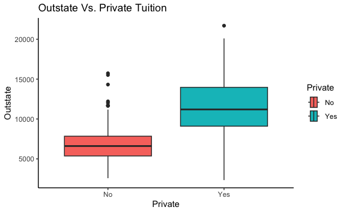
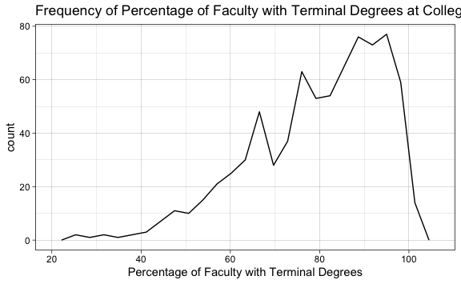

Chapter 2 Lab: Introduction to R Exercises
================
Evan Woods
2023-12-04

# Section 2.4: Exercises

## Conceptual

### Question 1:

For each of parts (a) through (d), indicate whether we would generally
expect the performance of a flexible statistical learning method to be
better or worse than an inflexible method. Justify your answer.

- **Question 1-a**: The sample size n is extremely large, and the number
  of predictors p is small.
  - **Answer**: A less flexible model would be better. With a small
    number of predictors, it is feasible to fit a linear model to the
    data. This model would have low-bias and lower variance than a
    flexible model.
- **Question 1-b**: The number of predictors p is extremely large, and
  the number of observations n is small.
  - **Answer**: A more flexible model is appropriate. A flexible model
    will accommodate a larger number of predictors than an inflexible
    model.
- **Question 1-c**: The relationship between the predictors and response
  is highly non-linear.
  - **Answer**: A flexible model is best suited for this data. An
    inflexible model will have high bias against a non-linear dataset.
- **Question 1-d**: The variance of the error terms, i.e. σ<sup>2</sup>
  = Var(ε), is extremely high.
  - **Answer**: If the variance is high, then a more rigid model is
    appropriate. Generally speaking, higher variance is remedied by
    lower model flexibility.

### Question 2:

Explain whether each scenario is a classification or regression prob-
lem, and indicate whether we are most interested in inference or pre-
diction. Finally, provide n and p.

- **Question 2-a**: We collect a set of data on the top 500 firms in the
  US. For each firm we record profit, number of employees, industry and
  the CEO salary. We are interested in understanding which factors
  affect CEO salary.
  - **Answer**: Understanding which factors affect CEO salary is a
    question of inference. The number of observations is 500. There are
    four predictors: profit, number of employees, industry, and the CEO
    salary.
- **Question 2-b**: We are considering launching a new product and wish
  to know whether it will be a success or a failure. We collect data on
  20 similar products that were previously launched. For each prod- uct
  we have recorded whether it was a success or failure, price charged
  for the product, marketing budget, competition price, and ten other
  variables.
  - **Answer**: The success or failure of a product is a question of
    prediction. The number of observations is 20. There are 14
    predictors success or failure, price charged for the product,
    marketing budget, competition price, and the other ten variables.
- **Question 2-c**: We are interested in predicting the % change in the
  USD/Euro exchange rate in relation to the weekly changes in the world
  stock markets. Hence we collect weekly data for all of 2012. For each
  week we record the % change in the USD/Euro, the % change in the US
  market, the % change in the British market, and the % change in the
  German market.
  - **Answer**: The question posed is how much does the USD/Euro
    exchange rate change in units of percent in relation to the weekly
    changes in the world stock markets. This is a question of inference.
    There are 52 observations that correspond with n. There are four
    predictors: the % change in the USD/Euro, the % change in the US
    market, the % change in the British market, and the % change in the
    German market.

### Question 3:

We now visit bias-variance decomposition.

- **Question 3-a**: Provide a sketch of typical (squared) bias,
  variance, training error, test error, and Bayes (or irreducible) error
  curves, on a single plot, as we go from less flexible statistical
  learning methods towards more flexible approches. The x-axis should
  represent the amount of flexibiity in the method, and the y-axis
  should represent the values for each curve. There should be five
  curves. Make sure to label each one.
  <!-- -->

- **Question 3-b**: Explain why each of the five curves has the shape
  displayed in part (a).

  - **Answer**: Bayes (irreducible) error curves are typically
    horizontal at the base of test error. This is because irreducible
    error is irreducible due to observations that are not transparently
    accounted for in the dataset or because there is variation that is
    irreducible. The test error will never be able to minimize beyond
    this line, so the irreducible error is located at the base of the
    test error. As flexibility increases, variance will increase as
    well. This results in an increasing exponential curve as shown in
    the figure above. As the model becomes less flexible, the bias will
    increase. This is because if the data is non-linear, then a linear
    model will never fit all the data appropriately. The training error
    will typically diminish, but the test error may increase in the
    presence of variance or bias.

### Question 4:

You will now think of real-life applications for statistical learning.

- **Question 4-a**: Describe three real-life applications in which
  *classification* might be useful. Describe the response, as well as
  the predictors. Is the goal of each applications inference or
  prediction? Explain your answer.
  - **Answer**:

  1.  Classifying a sample of brain tissue as cancerous or
      non-cancerous. The response is cancerous or non-cancerous. The
      predictors are labeled images of brain tissue. The goal of this
      application is prediction. This is useful because labeled images
      of brain tissue can then be used as a training set to detect
      cancer in sample images of brain tissue that have yet to be
      labeled. Because this is not a question of the relationship
      between any specific feature and the response, this is a question
      of prediction.
  2.  Classifying EEG signals as thoughtful commands. The response is
      the intended command. The predictors are each of the individual
      EEG time-series signals. The goal of this application is to
      predict the intent of a person’s thoughts in order to classify
      groups of signals as potential actions before executing an action
      based on what the user is thinking. This is a question of
      prediction because the topic is predicting a class of intent based
      upon an input time-series signal.
  3.  Classifying patterns of neural activity as associated with a
      particular movement. The response is the movement of a limb. The
      predictor are the EEG signals. This is a question of “What is the
      relationship between neural activity and the movement of a limb?”.
      This is a question of inference because it is seeking to
      understand the relationship between the movement of the body and
      signals from an EEG rather than make a prediction on whether or
      not a limb moved.
- **Question 4-b**: Describe three real-life applications in which
  regression might be useful. Describe the response, as well as the
  predictors. Is the goal of each application inference or prediction?
  Explain your answer.
  - **Answer**:

  1.  Regression might be useful in prediction of the price of a stock
      tomorrow. The response is the price of the stock. The predictors
      are the historical prices of the stock. The goal is a prediction
      of the stock price tomorrow.
  2.  Regression might be useful in prediction of the temperature
      tomorrow. The response is the temperature tomorrow. The predictors
      are historical temperatures. The goal of this application is
      prediction because the actual numerical value of temperature is
      being predicted.
  3.  Regression might be useful in prediction of an EEG signal. The
      response is the next data point of an EEG signal. The predictors
      are the historical data points of the EEG signal. The goal of this
      application is prediction because we are attempting to predict the
      value of the next data point within a time-series EEG signal. This
      is not a question of what is the relationship between the
      predictors and the response, and therefore it is a question of
      prediction rather than inference.
- **Question 4-c**: Describe three real-life applications in which
  *cluster* *analysis* might be useful.
  - **Answer**:

  1.  Cluster analysis might be useful when you need to cluster groups
      of customers by features.
  2.  Cluster analysis might be useful when you need to cluster samples
      of cancerous tissue given a gene expression.
  3.  Cluster analysis might be useful when identifying the geographic
      origin of a person based on their genes.

### Question 5:

What are the advantages and disadvantages of a very flexible (versus a
less flexible) approach for regression or classification? Under what
circumstances might a more flexible approach be preferred to a less
flexible approach? When might a less flexible approach be preferred?

- **Answer**: A flexible approach for regression or classification will
  allow a model to fit on data that is non-linear. If there is a
  linearity in the dataset, then fitting a linear model will result in
  bias error. however, a model that is too flexible will overfit onto
  the dataset. This results in high variance as the model is not general
  enough to handle changes in the data without generating predictions
  that are highly inaccurate. A less flexible approch is preferred when
  the data has a linear form. Fitting a flexible model to a linear
  dataset may result in higher variance than fitting a linear model to
  the same dataset.

### Question 6:

Describe the differences between a parametric and a non-parametric
statistical learning approach. What are the advantages of a parametric
approach to regression or classification (as opposed to a non-parametric
approach)? What are its disadvantages?

- **Answer**: A parametric approach estimates the coefficients of an
  assumed model. A non-parametric statistical learning approach does not
  assume a model and instead fits a spline directly to the data. Only
  the smoothness of the spline is modified in non-parametric statistical
  learning.

### Question 7:

The table below provides a training data set containing six
observations, three predictors, and one qualitative response variable.
Suppose we wish to use this data set to make a prediction ofr Y when
X<sub>1</sub> = X<sub>2</sub> = X<sub>3</sub> = 0

- **Question 7-a**: Compute the Euclidean distance between each
  observation and the test point, X<sub>1</sub> = X<sub>2</sub> =
  X<sub>3</sub> = 0.
  - **Answer**:

<!-- -->

    ## [1] 3.000000 2.000000 3.162278 2.236068 1.414214 1.732051

- **Question 7-b**: What is our prediction with K = 1? Why?
  - **Answer**: The prediction when K = 1 is “Green”. “Green” is the
    value of the closest point (observation 5) to the test point.
- **Question 7-c**: What is our prediction with K = 3? Why?
  - **Answer**: The prediction when K = 3 is “Red”. The values of the
    dependent variables of the three closest points (observations 5, 6,
    & 2 respectively) are “Green”, “Red”, “Red”. There is a 2/3
    probability that the value is “Red” given these three closest
    observations to the test point.
- **Question 7-d**: If the Bayes decision boundary in this problem is
  highly non-linear, then would we expect the *best* value for K to be
  large or small? Why?
  - **Answer**: Given a highly non-linear Bayes decision boundary, I
    expect the *best* value for K to be small. Small values of K allow
    for K to be more flexible which allow the adaptation of non-linear
    data. Larger values of K become more rigid and produce decision
    boundaries that are closer to being linear.

## Applied

### Question 8:

- **Question 8-a**: Use the read.csv() function to read the data into R.
  Call the loaded data college. Make sure that you have the directory
  set to the correct location for the data.
  - **Answer**:

``` r
college <- ISLR2::College
```

- **Question 8-b**: Look at the data using the View() function.
  - **Answer**:

``` r
View(college)
```

- **Question 8-c-i**: Use the summary() function to produce a numerical
  summary of the variables in the data set.
  - **Answer**:

``` r
summary(college)
```

    ##  Private        Apps           Accept          Enroll       Top10perc    
    ##  No :212   Min.   :   81   Min.   :   72   Min.   :  35   Min.   : 1.00  
    ##  Yes:565   1st Qu.:  776   1st Qu.:  604   1st Qu.: 242   1st Qu.:15.00  
    ##            Median : 1558   Median : 1110   Median : 434   Median :23.00  
    ##            Mean   : 3002   Mean   : 2019   Mean   : 780   Mean   :27.56  
    ##            3rd Qu.: 3624   3rd Qu.: 2424   3rd Qu.: 902   3rd Qu.:35.00  
    ##            Max.   :48094   Max.   :26330   Max.   :6392   Max.   :96.00  
    ##    Top25perc      F.Undergrad     P.Undergrad         Outstate    
    ##  Min.   :  9.0   Min.   :  139   Min.   :    1.0   Min.   : 2340  
    ##  1st Qu.: 41.0   1st Qu.:  992   1st Qu.:   95.0   1st Qu.: 7320  
    ##  Median : 54.0   Median : 1707   Median :  353.0   Median : 9990  
    ##  Mean   : 55.8   Mean   : 3700   Mean   :  855.3   Mean   :10441  
    ##  3rd Qu.: 69.0   3rd Qu.: 4005   3rd Qu.:  967.0   3rd Qu.:12925  
    ##  Max.   :100.0   Max.   :31643   Max.   :21836.0   Max.   :21700  
    ##    Room.Board       Books           Personal         PhD        
    ##  Min.   :1780   Min.   :  96.0   Min.   : 250   Min.   :  8.00  
    ##  1st Qu.:3597   1st Qu.: 470.0   1st Qu.: 850   1st Qu.: 62.00  
    ##  Median :4200   Median : 500.0   Median :1200   Median : 75.00  
    ##  Mean   :4358   Mean   : 549.4   Mean   :1341   Mean   : 72.66  
    ##  3rd Qu.:5050   3rd Qu.: 600.0   3rd Qu.:1700   3rd Qu.: 85.00  
    ##  Max.   :8124   Max.   :2340.0   Max.   :6800   Max.   :103.00  
    ##     Terminal       S.F.Ratio      perc.alumni        Expend     
    ##  Min.   : 24.0   Min.   : 2.50   Min.   : 0.00   Min.   : 3186  
    ##  1st Qu.: 71.0   1st Qu.:11.50   1st Qu.:13.00   1st Qu.: 6751  
    ##  Median : 82.0   Median :13.60   Median :21.00   Median : 8377  
    ##  Mean   : 79.7   Mean   :14.09   Mean   :22.74   Mean   : 9660  
    ##  3rd Qu.: 92.0   3rd Qu.:16.50   3rd Qu.:31.00   3rd Qu.:10830  
    ##  Max.   :100.0   Max.   :39.80   Max.   :64.00   Max.   :56233  
    ##    Grad.Rate     
    ##  Min.   : 10.00  
    ##  1st Qu.: 53.00  
    ##  Median : 65.00  
    ##  Mean   : 65.46  
    ##  3rd Qu.: 78.00  
    ##  Max.   :118.00

- **Question 8-c-ii**: Use the pair() function to produce a scatterplot
  matrix of the first ten columns or variables of the data. Recall that
  you can reference the first ten columns of a matrix A using A\[,1:10\]
  - **Answer**:

<!-- -->

- **Question 8-c-iii**: Use the plot() function to produce side-by-side
  boxplots of Outstate versus Private
  - **Answer**:

<!-- -->

- **Question 8-c-iv**:
  - **Answer**:

<!-- -->

    ##  No Yes 
    ## 699  78

- **Question 8-c-v**: Use the hist() function to produce histograms with
  differing numbers of bins for a few of the quantitative variables. You
  may find the command par(mfrow = c(2, 2)) useful: it will divide the
  print window into four regions so that four plots can be made
  simultaneously. Modifying the arguments to this function will divide
  the screen in other ways.
  - **Answer**:

<!-- --><!-- --><!-- --><!-- -->

- **Question 8-c-vi**: Continue exploring the data, and provide a brief
  summary of what you discover.
  - **Answer**: It appears that, most often, approximately 70% of
    faculty have PhD Degrees & approximately 90% of faculty have
    terminal degrees.

<!-- --><!-- -->
