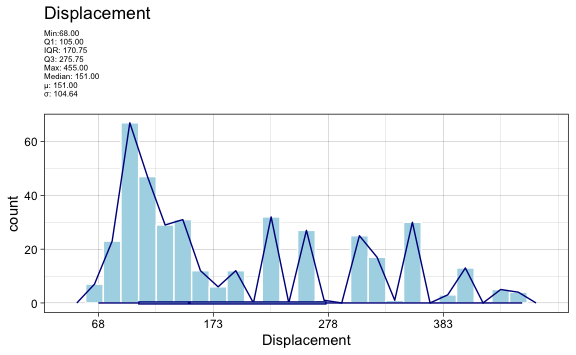

Chapter 2 Lab: Introduction to R Exercises
================
Evan Woods
2023-12-05

# Section 2.4: Exercises

## Conceptual

### Question 1:

For each of parts (a) through (d), indicate whether we would generally
expect the performance of a flexible statistical learning method to be
better or worse than an inflexible method. Justify your answer.

- **Question 1-a**: The sample size n is extremely large, and the number
  of predictors p is small.
  - **Answer**: A less flexible model would be better. With a small
    number of predictors, it is feasible to fit a linear model to the
    data. This model would have low-bias and lower variance than a
    flexible model.
- **Question 1-b**: The number of predictors p is extremely large, and
  the number of observations n is small.
  - **Answer**: A more flexible model is appropriate. A flexible model
    will accommodate a larger number of predictors than an inflexible
    model.
- **Question 1-c**: The relationship between the predictors and response
  is highly non-linear.
  - **Answer**: A flexible model is best suited for this data. An
    inflexible model will have high bias against a non-linear dataset.
- **Question 1-d**: The variance of the error terms, i.e. σ<sup>2</sup>
  = Var(ε), is extremely high.
  - **Answer**: If the variance is high, then a more rigid model is
    appropriate. Generally speaking, higher variance is remedied by
    lower model flexibility.

### Question 2:

Explain whether each scenario is a classification or regression prob-
lem, and indicate whether we are most interested in inference or pre-
diction. Finally, provide n and p.

- **Question 2-a**: We collect a set of data on the top 500 firms in the
  US. For each firm we record profit, number of employees, industry and
  the CEO salary. We are interested in understanding which factors
  affect CEO salary.
  - **Answer**: Understanding which factors affect CEO salary is a
    question of inference. The number of observations is 500. There are
    four predictors: profit, number of employees, industry, and the CEO
    salary.
- **Question 2-b**: We are considering launching a new product and wish
  to know whether it will be a success or a failure. We collect data on
  20 similar products that were previously launched. For each prod- uct
  we have recorded whether it was a success or failure, price charged
  for the product, marketing budget, competition price, and ten other
  variables.
  - **Answer**: The success or failure of a product is a question of
    prediction. The number of observations is 20. There are 14
    predictors success or failure, price charged for the product,
    marketing budget, competition price, and the other ten variables.
- **Question 2-c**: We are interested in predicting the % change in the
  USD/Euro exchange rate in relation to the weekly changes in the world
  stock markets. Hence we collect weekly data for all of 2012. For each
  week we record the % change in the USD/Euro, the % change in the US
  market, the % change in the British market, and the % change in the
  German market.
  - **Answer**: The question posed is how much does the USD/Euro
    exchange rate change in units of percent in relation to the weekly
    changes in the world stock markets. This is a question of inference.
    There are 52 observations that correspond with n. There are four
    predictors: the % change in the USD/Euro, the % change in the US
    market, the % change in the British market, and the % change in the
    German market.

### Question 3:

We now visit bias-variance decomposition.

- **Question 3-a**: Provide a sketch of typical (squared) bias,
  variance, training error, test error, and Bayes (or irreducible) error
  curves, on a single plot, as we go from less flexible statistical
  learning methods towards more flexible approches. The x-axis should
  represent the amount of flexibiity in the method, and the y-axis
  should represent the values for each curve. There should be five
  curves. Make sure to label each one.
  

- **Question 3-b**: Explain why each of the five curves has the shape
  displayed in part (a).

  - **Answer**: Bayes (irreducible) error curves are typically
    horizontal at the base of test error. This is because irreducible
    error is irreducible due to observations that are not transparently
    accounted for in the dataset or because there is variation that is
    irreducible. The test error will never be able to minimize beyond
    this line, so the irreducible error is located at the base of the
    test error. As flexibility increases, variance will increase as
    well. This results in an increasing exponential curve as shown in
    the figure above. As the model becomes less flexible, the bias will
    increase. This is because if the data is non-linear, then a linear
    model will never fit all the data appropriately. The training error
    will typically diminish, but the test error may increase in the
    presence of variance or bias.

### Question 4:

You will now think of real-life applications for statistical learning.

- **Question 4-a**: Describe three real-life applications in which
  *classification* might be useful. Describe the response, as well as
  the predictors. Is the goal of each applications inference or
  prediction? Explain your answer.
  - **Answer**:

  1.  Classifying a sample of brain tissue as cancerous or
      non-cancerous. The response is cancerous or non-cancerous. The
      predictors are labeled images of brain tissue. The goal of this
      application is prediction. This is useful because labeled images
      of brain tissue can then be used as a training set to detect
      cancer in sample images of brain tissue that have yet to be
      labeled. Because this is not a question of the relationship
      between any specific feature and the response, this is a question
      of prediction.
  2.  Classifying EEG signals as thoughtful commands. The response is
      the intended command. The predictors are each of the individual
      EEG time-series signals. The goal of this application is to
      predict the intent of a person’s thoughts in order to classify
      groups of signals as potential actions before executing an action
      based on what the user is thinking. This is a question of
      prediction because the topic is predicting a class of intent based
      upon an input time-series signal.
  3.  Classifying patterns of neural activity as associated with a
      particular movement. The response is the movement of a limb. The
      predictor are the EEG signals. This is a question of “What is the
      relationship between neural activity and the movement of a limb?”.
      This is a question of inference because it is seeking to
      understand the relationship between the movement of the body and
      signals from an EEG rather than make a prediction on whether or
      not a limb moved.
- **Question 4-b**: Describe three real-life applications in which
  regression might be useful. Describe the response, as well as the
  predictors. Is the goal of each application inference or prediction?
  Explain your answer.
  - **Answer**:

  1.  Regression might be useful in prediction of the price of a stock
      tomorrow. The response is the price of the stock. The predictors
      are the historical prices of the stock. The goal is a prediction
      of the stock price tomorrow.
  2.  Regression might be useful in prediction of the temperature
      tomorrow. The response is the temperature tomorrow. The predictors
      are historical temperatures. The goal of this application is
      prediction because the actual numerical value of temperature is
      being predicted.
  3.  Regression might be useful in prediction of an EEG signal. The
      response is the next data point of an EEG signal. The predictors
      are the historical data points of the EEG signal. The goal of this
      application is prediction because we are attempting to predict the
      value of the next data point within a time-series EEG signal. This
      is not a question of what is the relationship between the
      predictors and the response, and therefore it is a question of
      prediction rather than inference.
- **Question 4-c**: Describe three real-life applications in which
  *cluster* *analysis* might be useful.
  - **Answer**:

  1.  Cluster analysis might be useful when you need to cluster groups
      of customers by features.
  2.  Cluster analysis might be useful when you need to cluster samples
      of cancerous tissue given a gene expression.
  3.  Cluster analysis might be useful when identifying the geographic
      origin of a person based on their genes.

### Question 5:

What are the advantages and disadvantages of a very flexible (versus a
less flexible) approach for regression or classification? Under what
circumstances might a more flexible approach be preferred to a less
flexible approach? When might a less flexible approach be preferred?

- **Answer**: A flexible approach for regression or classification will
  allow a model to fit on data that is non-linear. If there is a
  linearity in the dataset, then fitting a linear model will result in
  bias error. however, a model that is too flexible will overfit onto
  the dataset. This results in high variance as the model is not general
  enough to handle changes in the data without generating predictions
  that are highly inaccurate. A less flexible approch is preferred when
  the data has a linear form. Fitting a flexible model to a linear
  dataset may result in higher variance than fitting a linear model to
  the same dataset.

### Question 6:

Describe the differences between a parametric and a non-parametric
statistical learning approach. What are the advantages of a parametric
approach to regression or classification (as opposed to a non-parametric
approach)? What are its disadvantages?

- **Answer**: A parametric approach estimates the coefficients of an
  assumed model. A non-parametric statistical learning approach does not
  assume a model and instead fits a spline directly to the data. Only
  the smoothness of the spline is modified in non-parametric statistical
  learning.

### Question 7:

The table below provides a training data set containing six
observations, three predictors, and one qualitative response variable.
Suppose we wish to use this data set to make a prediction ofr Y when
X<sub>1</sub> = X<sub>2</sub> = X<sub>3</sub> = 0

- **Question 7-a**: Compute the Euclidean distance between each
  observation and the test point, X<sub>1</sub> = X<sub>2</sub> =
  X<sub>3</sub> = 0.
  - **Answer**:

<!-- -->

    ## [1] 3.000000 2.000000 3.162278 2.236068 1.414214 1.732051

- **Question 7-b**: What is our prediction with K = 1? Why?
  - **Answer**: The prediction when K = 1 is “Green”. “Green” is the
    value of the closest point (observation 5) to the test point.
- **Question 7-c**: What is our prediction with K = 3? Why?
  - **Answer**: The prediction when K = 3 is “Red”. The values of the
    dependent variables of the three closest points (observations 5, 6,
    & 2 respectively) are “Green”, “Red”, “Red”. There is a 2/3
    probability that the value is “Red” given these three closest
    observations to the test point.
- **Question 7-d**: If the Bayes decision boundary in this problem is
  highly non-linear, then would we expect the *best* value for K to be
  large or small? Why?
  - **Answer**: Given a highly non-linear Bayes decision boundary, I
    expect the *best* value for K to be small. Small values of K allow
    for K to be more flexible which allow the adaptation of non-linear
    data. Larger values of K become more rigid and produce decision
    boundaries that are closer to being linear.

## Applied

### Question 8:

- **Question 8-a**: Use the read.csv() function to read the data into R.
  Call the loaded data college. Make sure that you have the directory
  set to the correct location for the data.
  - **Answer**:

``` r
college <- ISLR2::College
```

- **Question 8-b**: Look at the data using the View() function.
  - **Answer**:

``` r
View(college)
```

- **Question 8-c-i**: Use the summary() function to produce a numerical
  summary of the variables in the data set.
  - **Answer**:

``` r
summary(college)
```

    ##  Private        Apps           Accept          Enroll       Top10perc    
    ##  No :212   Min.   :   81   Min.   :   72   Min.   :  35   Min.   : 1.00  
    ##  Yes:565   1st Qu.:  776   1st Qu.:  604   1st Qu.: 242   1st Qu.:15.00  
    ##            Median : 1558   Median : 1110   Median : 434   Median :23.00  
    ##            Mean   : 3002   Mean   : 2019   Mean   : 780   Mean   :27.56  
    ##            3rd Qu.: 3624   3rd Qu.: 2424   3rd Qu.: 902   3rd Qu.:35.00  
    ##            Max.   :48094   Max.   :26330   Max.   :6392   Max.   :96.00  
    ##    Top25perc      F.Undergrad     P.Undergrad         Outstate    
    ##  Min.   :  9.0   Min.   :  139   Min.   :    1.0   Min.   : 2340  
    ##  1st Qu.: 41.0   1st Qu.:  992   1st Qu.:   95.0   1st Qu.: 7320  
    ##  Median : 54.0   Median : 1707   Median :  353.0   Median : 9990  
    ##  Mean   : 55.8   Mean   : 3700   Mean   :  855.3   Mean   :10441  
    ##  3rd Qu.: 69.0   3rd Qu.: 4005   3rd Qu.:  967.0   3rd Qu.:12925  
    ##  Max.   :100.0   Max.   :31643   Max.   :21836.0   Max.   :21700  
    ##    Room.Board       Books           Personal         PhD        
    ##  Min.   :1780   Min.   :  96.0   Min.   : 250   Min.   :  8.00  
    ##  1st Qu.:3597   1st Qu.: 470.0   1st Qu.: 850   1st Qu.: 62.00  
    ##  Median :4200   Median : 500.0   Median :1200   Median : 75.00  
    ##  Mean   :4358   Mean   : 549.4   Mean   :1341   Mean   : 72.66  
    ##  3rd Qu.:5050   3rd Qu.: 600.0   3rd Qu.:1700   3rd Qu.: 85.00  
    ##  Max.   :8124   Max.   :2340.0   Max.   :6800   Max.   :103.00  
    ##     Terminal       S.F.Ratio      perc.alumni        Expend     
    ##  Min.   : 24.0   Min.   : 2.50   Min.   : 0.00   Min.   : 3186  
    ##  1st Qu.: 71.0   1st Qu.:11.50   1st Qu.:13.00   1st Qu.: 6751  
    ##  Median : 82.0   Median :13.60   Median :21.00   Median : 8377  
    ##  Mean   : 79.7   Mean   :14.09   Mean   :22.74   Mean   : 9660  
    ##  3rd Qu.: 92.0   3rd Qu.:16.50   3rd Qu.:31.00   3rd Qu.:10830  
    ##  Max.   :100.0   Max.   :39.80   Max.   :64.00   Max.   :56233  
    ##    Grad.Rate     
    ##  Min.   : 10.00  
    ##  1st Qu.: 53.00  
    ##  Median : 65.00  
    ##  Mean   : 65.46  
    ##  3rd Qu.: 78.00  
    ##  Max.   :118.00

- **Question 8-c-ii**: Use the pair() function to produce a scatterplot
  matrix of the first ten columns or variables of the data. Recall that
  you can reference the first ten columns of a matrix A using A\[,1:10\]
  - **Answer**:


- **Question 8-c-iii**: Use the plot() function to produce side-by-side
  boxplots of Outstate versus Private
  - **Answer**:


- **Question 8-c-iv**:
  - **Answer**:

<!-- -->

    ##  No Yes 
    ## 699  78

- **Question 8-c-v**: Use the hist() function to produce histograms with
  differing numbers of bins for a few of the quantitative variables. You
  may find the command par(mfrow = c(2, 2)) useful: it will divide the
  print window into four regions so that four plots can be made
  simultaneously. Modifying the arguments to this function will divide
  the screen in other ways.
  - **Answer**:


- **Question 8-c-vi**: Continue exploring the data, and provide a brief
  summary of what you discover.
  - **Answer**: It appears that, most often, approximately 70% of
    faculty have PhD Degrees & approximately 90% of faculty have
    terminal degrees.


\### Question 9: This exercise involves the Auto data set studied in the
lab. Make sure that the missing values have been removed from the data.

- **Question 9-a**: Which of the predictors are quantitative, and which
  are qualitative?
  - **Answer**: Quantitative predictors include mpg, cylinders,
    displacement, horsepower, weight, acceleration, & year. Qualitative
    predictors include the origin and name.
- **Question 9-b**: What is the *range* of each quantitative predictor?
  You can answer this using the range() function.
  - **Answer**:

``` r
range_all_quant <- function(df) {
    for (i in seq_along(df)){
      current_var <- df[[i]]
      if (is.numeric(current_var)) {
        current_var_name <- names(df[i])
        cat(sprintf("%s range: \n", current_var_name))
        cat(sprintf("%0.2f", range(df[[i]])))
        cat("\n\n")
      }
    }
}

range_all_quant(Auto)
```

    ## mpg range: 
    ## 9.00 46.60
    ## 
    ## cylinders range: 
    ## 3.00 8.00
    ## 
    ## displacement range: 
    ## 68.00 455.00
    ## 
    ## horsepower range: 
    ## 46.00 230.00
    ## 
    ## weight range: 
    ## 1613.00 5140.00
    ## 
    ## acceleration range: 
    ## 8.00 24.80
    ## 
    ## year range: 
    ## 70.00 82.00
    ## 
    ## origin range: 
    ## 1.00 3.00

- **Question 9-c**: What is the mean and standard deviation of each
  predictor?
  - **Answer**:

``` r
mean_sd_quant <- function(var_name, var) {
  cat(sprintf("%s:\n", var_name))
  cat(sprintf("Mean: %0.2f\nStandard Deviation: %0.2f\n\n", mean(var), sd(var)))
}
```

``` r
for (i in seq_along(Auto)){
  current_var <- Auto[[i]]
  if (is.numeric(current_var)) {
    current_var_name <- names(Auto[i])
    mean_sd_quant(current_var_name, current_var)
  }
}
```

    ## mpg:
    ## Mean: 23.45
    ## Standard Deviation: 7.81
    ## 
    ## cylinders:
    ## Mean: 5.47
    ## Standard Deviation: 1.71
    ## 
    ## displacement:
    ## Mean: 194.41
    ## Standard Deviation: 104.64
    ## 
    ## horsepower:
    ## Mean: 104.47
    ## Standard Deviation: 38.49
    ## 
    ## weight:
    ## Mean: 2977.58
    ## Standard Deviation: 849.40
    ## 
    ## acceleration:
    ## Mean: 15.54
    ## Standard Deviation: 2.76
    ## 
    ## year:
    ## Mean: 75.98
    ## Standard Deviation: 3.68
    ## 
    ## origin:
    ## Mean: 1.58
    ## Standard Deviation: 0.81

- **Question 9-d**: Now remove the 10th through 85th observations. What
  is the range, mean, and standard deviation of each predictor in the
  subset of the data that remains?
  - **Answer**:

``` r
  auto_small <- Auto[-c(10:85),]
```

``` r
range_mean_sd_all_quant <- function(df) {
    for (i in seq_along(df)){
      current_var <- df[[i]]
      if (is.numeric(current_var)) {
        current_var_name <- names(df[i])
        cat(sprintf("%s range: \n", current_var_name))
        cat(sprintf("%0.2f", range(df[[i]])))
        
        cat("\n\n")
        cat(sprintf("%s mean: \n", current_var_name))
        cat(sprintf("%0.2f", mean(df[[i]])))
        
        cat("\n\n")
        cat(sprintf("%s sd: \n", current_var_name))
        cat(sprintf("%0.2f", sd(df[[i]])))
        cat("\n\n")
      }
    }
}
range_mean_sd_all_quant(auto_small)
```

    ## mpg range: 
    ## 11.00 46.60
    ## 
    ## mpg mean: 
    ## 24.40
    ## 
    ## mpg sd: 
    ## 7.87
    ## 
    ## cylinders range: 
    ## 3.00 8.00
    ## 
    ## cylinders mean: 
    ## 5.37
    ## 
    ## cylinders sd: 
    ## 1.65
    ## 
    ## displacement range: 
    ## 68.00 455.00
    ## 
    ## displacement mean: 
    ## 187.24
    ## 
    ## displacement sd: 
    ## 99.68
    ## 
    ## horsepower range: 
    ## 46.00 230.00
    ## 
    ## horsepower mean: 
    ## 100.72
    ## 
    ## horsepower sd: 
    ## 35.71
    ## 
    ## weight range: 
    ## 1649.00 4997.00
    ## 
    ## weight mean: 
    ## 2935.97
    ## 
    ## weight sd: 
    ## 811.30
    ## 
    ## acceleration range: 
    ## 8.50 24.80
    ## 
    ## acceleration mean: 
    ## 15.73
    ## 
    ## acceleration sd: 
    ## 2.69
    ## 
    ## year range: 
    ## 70.00 82.00
    ## 
    ## year mean: 
    ## 77.15
    ## 
    ## year sd: 
    ## 3.11
    ## 
    ## origin range: 
    ## 1.00 3.00
    ## 
    ## origin mean: 
    ## 1.60
    ## 
    ## origin sd: 
    ## 0.82

- **Question 9-e**: Using the full data set, investigate the predictors
  graphically, using scatterplots or other tools of your choice. Create
  plots highlighting the relationships among the predictors. Comment on
  your findings.
  - **Answer**:

The mean mpg of cars in the auto dataset is 23.45 mpg. The max mpg in
this dataset is approximately 49 mpg. The minimum mpg is 9 mpg. The
greatest number of vehicles have a mpg of approximately 35 mpg.

The most common number of cylinders is 4. The most common is also the
least number of cylinders. The most number of cylinders is 8.

The most common engine displacement is approximately 105 cubic inches.
The largest engine has a displacement of 455 cubic inches. The smallest
engine size is 64 cubic inches. The average engine size is 151 cubic
inches.

The most common horsepower is 84hp. The greatest horsepower is 230hp.
The smallest horsepower is 46hp. The average horsepower is 93.5hp.

The most common vehicle weight is 2306.75 lbs. The lightest vehicle is
1613 lbs. The heaviest vehicle is 5140 lbs. The average vehicle weight
is 2803.5 lbs.

The fastest 0 - 60 acceleration is 8 seconds. The slowest 0 - 60
acceleration is 24.8 seconds. The average 0 - 60 acceleration is 15.5
seconds. The most frequent 0 - 60 acceleration is approximately 14.75.

The newest car is from 1982. The oldest car is from 1970. The average
year of a car is 1976. The most frequent year is 1973.

There is a negative correlation between the response miles per gallon
and the predictors cylinders, engine displacement, vehicle weight, and
horspower. There is a positive correlation between the response variable
miles per gallon and the predictors acceleration and year. The strongest
absolute value of a correlation is between weight and miles per gallon.
The weakest absolute value correlation is between miles per gallon and
acceleration.

``` r
plot_quantitative_summary_hist_freq_box <- function(df, titles, x_axis_titles) {
  for (i in seq_along(df)) {
    # print(i)
    current_var_name <- names(df[i])
    current_var <- df[[i]]
    if(is.numeric(current_var)) {
      summary_plot <- ggplot(df) + 
        geom_histogram(aes(current_var), color = "white", fill = "lightblue", bins = 25) + 
        geom_freqpoly(aes(current_var), color = "darkblue", bins = 25) + 
        theme_linedraw() + 
        geom_boxplot(aes(current_var), color = "darkblue", fill = "lightblue") + 
        labs(
          title = titles[[i]], 
          x = x_axis_titles[[i]], 
          subtitle = sprintf("Min:%0.2f\nQ1: %0.2f\nIQR: %0.2f\nQ3: %0.2f\nMax: %0.2f\nMedian: %0.2f\nμ: %0.2f\nσ: %0.2f\n", 
                             summary(current_var)["Min."], 
                             summary(current_var)["1st Qu."], 
                             IQR(current_var),
                             summary(current_var)["3rd Qu."], 
                             summary(current_var)["Max."],
                             median(current_var),
                             median(current_var),
                             sd(current_var)
                             )) +
        scale_x_continuous(breaks = seq(min(current_var), max(current_var), by = round(sd(current_var)))) + 
        theme(plot.subtitle = element_text(size = 6))
      print(summary_plot)
    }
  }
}
titles = c("Miles Per Gallon", "Cylinders", "Displacement", "Horsepower", "Weight", "Acceleration", "Year")
x_axis_titles = c("Miles Per Gallon", "Number of Cylinders", "Displacement", "Horsepower", "Weight", "Acceleration", "Year")
plot_quantitative_summary_hist_freq_box(Auto[,1:7], titles, x_axis_titles)
```



``` r
plot_quantitative_correlation_point <- function(df, titles, x_axis_titles, y_axis_titles, dependent_var) {
  dependent_var_data <- df[[dependent_var]]
  dependent_var_name <- names(df[dependent_var])
  for (i in seq_along(df)) {
    current_var_name <- names(df[i])
    if (identical(current_var_name, dependent_var)){
      next
    }
    current_var <- df[[i]]
    if(is.numeric(current_var)) {
      current_correlation <- correlate(current_var, dependent_var_data)
      summary_plot <- ggplot(df) + 
        geom_point(aes(current_var, dependent_var_data)) +
        geom_smooth(aes(current_var, dependent_var_data), color = "darkblue", se = FALSE) + 
        theme_linedraw() + 
        labs(
          title = titles[[i]], 
          x = x_axis_titles[[i]], 
          y = y_axis_title,
          subtitle = sprintf("Correlation: %0.2f", current_correlation$x)) +
        # scale_x_continuous(breaks = seq(min(current_var), max(current_var))) + 
        theme(plot.subtitle = element_text(size = 8))
      
      print(summary_plot)
    }
  }
}
titles = c("", "Cylinders", "Displacement", "Horsepower", "Weight", "Acceleration", "Year")
x_axis_titles = c("", "Number of Cylinders", "Displacement", "Horsepower", "Weight", "Acceleration", "Year")
y_axis_title = c("Miles Per Gallon")
plot_quantitative_correlation_point(Auto[,1:7], titles, x_axis_titles, y_axis_title, "mpg")
```


- **Question 9-f**: Suppose that you wish to predict gase mileage (mpg)
  on the basis of the other variables. Do your plots suggest that any of
  the other variables might be useful in predicting mpg? Justify your
  answer.
  - **Answer**: There is a strong negative correlation between the
    predictors weight and displacement and the response variable miles
    per gallon. There is a positive correlation between miles per gallon
    and year. These plots suggest that the engines may be more efficient
    over time or the weight of the cars may be lighter over time which
    have an effect on the miles per gallon. Furthermore, the engines may
    be less powerful (i.e. have less cylinders and less horsepower) over
    the years and therefore have less displacement and weight. This may
    yield more efficient engines that have higher efficiencies with
    respect to miles per gallon.

### Question 10: This exercise involve the Boston housing data set.

- **Question 10-a**: To begin, load in the Boston data set. The Boston
  data set is part of the ISLR2 *library*. How many rows are in this
  data set? How many columns? What do the rows and columns represent?
  - **Answer**: There are 506 rows and 13 columns in the dataset. Each
    row represents one house. The columns include per capita crime rate
    by town, proportion of residential land zoned for lots over 25,000
    sq.ft., the proportion of non-business acres per town, an indicator
    variable if ‘tract’ bounds the Charles River, the parts per 10
    million of nitrogen oxides concentration, the average number of
    rooms per dwelling, the proportion of owner occupied units built
    prior to 1940. The weighted mean distances to five Boston employment
    centers, the index of accessibility to radial highways, the
    full-value property tax rate per \$10,000, the pupil-teacher ratio
    by town, the percent of the lower status of the population, and the
    median value of owner-occupied homes in the \$1000s.

``` r
library(ISLR2)
Boston
?Boston
```

``` r
print(sprintf("Number of rows: %0.0f" , nrow(Boston)))
```

    ## [1] "Number of rows: 506"

``` r
print(sprintf("Number of columns: %0.0f" , ncol(Boston)))
```

    ## [1] "Number of columns: 13"

- **Question 10-b**: Make pairwise scatterplots of the predictors
  (columns) in this data set. Describe your findings.
  - **Answer**:

``` r
titles = c("", "Crime Rate Vs. Proportion of Non-Retail Business Acres Per Town", "Crime Rate Vs. Nitrogen Oxide Concentration", "Crime Rate Vs. Average Number of Rooms Per Dwelling", "Crime Rate Vs. Proportion of Owner-Occupied Units Built Before 1940", "Crime Rate Vs. Weighted Mean Distance to Employment Centers", "Crime Rate Vs. Full-Value Property Tax Rate Per $10,000", "Crime Rate Vs. Pupil-Teacher Ratio by Town", "Crime Rate Vs. Percent of Lower Status of the Population", "Crime Rate Vs. Median Value of Owner-Occupied Homes in $1000s")
x_axis_titles = c("", "Proportion of Non-Retail Business Acres Per Town", "Nitrogen Oxide Concentration", "Average Number of Rooms Per Dwelling", "Proportion of Owner-Occupied Units Built Before 1940", "Weighted Mean Distance to Employment Centers", "Full-Value Property Tax Rate Per $10,000", "Pupil-Teacher Ratio by Town", "Percent of Lower Status of the Population", "Median Value of Owner-Occupied Homes in $1000s")
y_axis_title = c("Per Capita Crime Rate By Town")
plot_quantitative_correlation_point(boston_sm_formatted, titles, x_axis_titles, y_axis_title, "crim")
```


