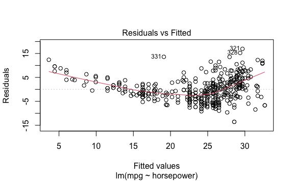
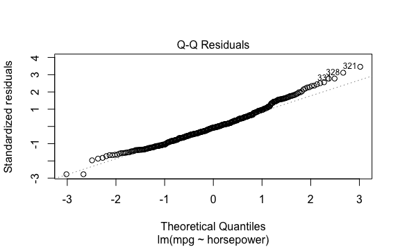
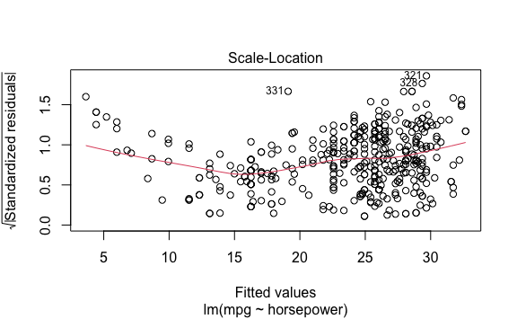
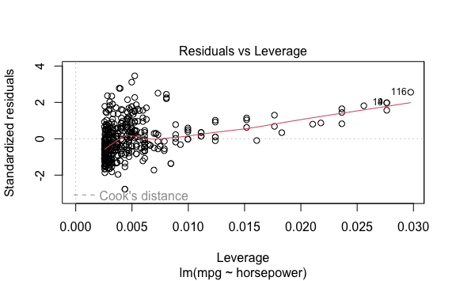
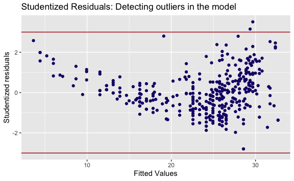

Lab 3 Linear Regression Exercises
================
Evan Woods
2023-12-06

# §3.7 Exercises

## Applied

### Question 8:

This question involves the use of simple linear regression on the Auto
data set.

- **Question 8-a**:

  1.  Is there a relationship between the predictor and the response?
  2.  How strong is the relationship between the predictor and the
      response?
  3.  Is the relationship between the predictor and the response
      positive or negative?
  4.  What is the predicted mpg associated with a horsepower of 98? What
      are the associated 95% confidence and prediction intervals?

- **Answer**:

  1.  There is a relationship between the predictor and the response.
      The F-statistic is very high which indicates that at least one
      variable is a predictor of the response, and there is only one
      predictor.
  2.  The Residual Standard Error is 4.906. The mean value of the
      response, mpg, is 23.45. This indicates that the percentage of
      error of this model is high: 20.9%. The Adjusted R<sup>2</sup> is
      60.49. This indicatest that 60.49% of the variability present in
      the data is captured by the model. This is a weak model.
  3.  There is a negative relationship between the predictor and the
      response. This is observable from the negative coefficient of
      horsepower.
  4.  The predicted mpg associated with a horsepower of 98 is 24.47 mpg.
      The confidence interval is 23.97 to 24.96. The prediction interval
      is 14.8 to 34.12.

``` r
lm.fit <- lm(mpg ~ horsepower)
mean_value_of_response <- mean(mpg)
mean_value_of_response
```

    ## [1] 23.44592

``` r
RSE <- summary.lm(lm.fit)$sigma

percentage_of_error <- (RSE / mean(mpg)) * 100
percentage_of_error
```

    ## [1] 20.92371

``` r
summary.lm(lm.fit)
```

    ## 
    ## Call:
    ## lm(formula = mpg ~ horsepower)
    ## 
    ## Residuals:
    ##      Min       1Q   Median       3Q      Max 
    ## -13.5710  -3.2592  -0.3435   2.7630  16.9240 
    ## 
    ## Coefficients:
    ##              Estimate Std. Error t value Pr(>|t|)    
    ## (Intercept) 39.935861   0.717499   55.66   <2e-16 ***
    ## horsepower  -0.157845   0.006446  -24.49   <2e-16 ***
    ## ---
    ## Signif. codes:  0 '***' 0.001 '**' 0.01 '*' 0.05 '.' 0.1 ' ' 1
    ## 
    ## Residual standard error: 4.906 on 390 degrees of freedom
    ## Multiple R-squared:  0.6059, Adjusted R-squared:  0.6049 
    ## F-statistic: 599.7 on 1 and 390 DF,  p-value: < 2.2e-16

``` r
predict(lm.fit, data.frame(horsepower = c(98)), interval = "prediction")
```

    ##        fit     lwr      upr
    ## 1 24.46708 14.8094 34.12476

``` r
predict(lm.fit, data.frame(horsepower = c(98)), interval = "confidence")
```

    ##        fit      lwr      upr
    ## 1 24.46708 23.97308 24.96108

- **Question 8-b**: Plot the response and the predictor. Use the
  abline() funciton to display the least squares regression line.
  - **Answer**:
- **Question 8-c**: Use the plot() function to produce diagnostic plots
  of the least squares regression fit.
  - **Answer**: There are two or more points with high leverage. There
    is heteroskedasticity in the residuals. There appears to be a
    non-linearity in the data after observing the Residuals vs Fitted
    plot. There are two ouliers in the dataset.


