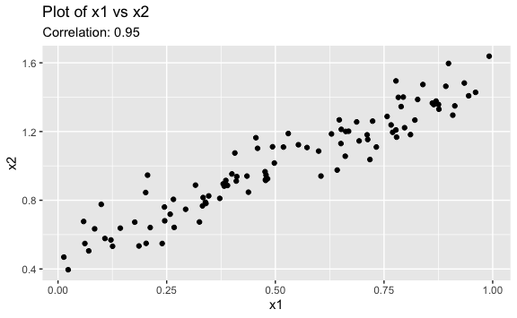

Lab 3 Linear Regression Exercises
================
Evan Woods
2023-12-07

# §3.7 Exercises

<!-- ## Conceptual -->
<!-- ### Question 7: -->
<!-- ## Getting started with equations -->
<!-- We can write fractions: $\frac{2}{3}$. We can also handle things like estimated population growth rate, e.g., $\hat{\lambda}=1.02$. And, $\sqrt{4}=2$. -->
<!-- $$\alpha, \beta,  \gamma, \Gamma$$ -->
<!-- $$a \pm b$$ -->
<!-- $$x \ge 15$$ -->
<!-- $$a_i \ge 0~~~\forall i$$ -->
<!-- ## Matrix -->
<!-- $$A_{m,n} = -->
<!--  \begin{pmatrix} -->
<!--   a_{1,1} & a_{1,2} & \cdots & a_{1,n} \\ -->
<!--   a_{2,1} & a_{2,2} & \cdots & a_{2,n} \\ -->
<!--   \vdots  & \vdots  & \ddots & \vdots  \\ -->
<!--   a_{m,1} & a_{m,2} & \cdots & a_{m,n} -->
<!--  \end{pmatrix}$$ -->

## Applied

### Question 8:

This question involves the use of simple linear regression on the Auto
data set.

- **Question 8-a**:

  1.  Is there a relationship between the predictor and the response?
  2.  How strong is the relationship between the predictor and the
      response?
  3.  Is the relationship between the predictor and the response
      positive or negative?
  4.  What is the predicted mpg associated with a horsepower of 98? What
      are the associated 95% confidence and prediction intervals?

- **Answer**:

  1.  There is a relationship between the predictor and the response.
      The F-statistic is very high which indicates that at least one
      variable is a predictor of the response, and there is only one
      predictor.
  2.  The Residual Standard Error is 4.906. The mean value of the
      response, mpg, is 23.45. This indicates that the percentage of
      error of this model is high: 20.9%. The Adjusted R<sup>2</sup> is
      60.49. This indicatest that 60.49% of the variability present in
      the data is captured by the model. This is a weak model.
  3.  There is a negative relationship between the predictor and the
      response. This is observable from the negative coefficient of
      horsepower.
  4.  The predicted mpg associated with a horsepower of 98 is 24.47 mpg.
      The confidence interval is 23.97 to 24.96. The prediction interval
      is 14.8 to 34.12.

``` r
lm.fit <- lm(mpg ~ horsepower)

# Calculating Percentage of Error from Residual Standard Error
mean_value_of_response <- mean(mpg)
mean_value_of_response
```

    [1] 23.44592

``` r
RSE <- summary.lm(lm.fit)$sigma

percentage_of_error <- (RSE / mean(mpg)) * 100
percentage_of_error
```

    [1] 20.92371

``` r
# Summary Statistics
summary.lm(lm.fit)
```


    Call:
    lm(formula = mpg ~ horsepower)

    Residuals:
         Min       1Q   Median       3Q      Max 
    -13.5710  -3.2592  -0.3435   2.7630  16.9240 

    Coefficients:
                 Estimate Std. Error t value Pr(>|t|)    
    (Intercept) 39.935861   0.717499   55.66   <2e-16 ***
    horsepower  -0.157845   0.006446  -24.49   <2e-16 ***
    ---
    Signif. codes:  0 '***' 0.001 '**' 0.01 '*' 0.05 '.' 0.1 ' ' 1

    Residual standard error: 4.906 on 390 degrees of freedom
    Multiple R-squared:  0.6059,    Adjusted R-squared:  0.6049 
    F-statistic: 599.7 on 1 and 390 DF,  p-value: < 2.2e-16

``` r
# Prediction & Confidence Intervals
predict(lm.fit, data.frame(horsepower = c(98)), interval = "prediction")
```

           fit     lwr      upr
    1 24.46708 14.8094 34.12476

``` r
predict(lm.fit, data.frame(horsepower = c(98)), interval = "confidence")
```

           fit      lwr      upr
    1 24.46708 23.97308 24.96108

- **Question 8-b**: Plot the response and the predictor. Use the
  abline() function to display the least squares regression line.
  - **Answer**:


- **Question 8-c**: Use the plot() function to produce diagnostic plots
  of the least squares regression fit.
  - **Answer**: There are two or more points with high leverage. There
    is heteroskedasticity in the residuals. There appears to be a
    non-linearity in the data after observing the Residuals vs Fitted
    plot. There are multiple outliers in the dataset.


    There appears to be a non-linearity in the data shown from the following plot:
    Residuals vs Fitted.

    There is heteroskedasticity in the residuals shown by the Residuals vs. Fitted
    plot. The non-constant Variance is also visible be the Q-Q Reisdual plot where
    points 331, 328, & 321 do not have constant variance.


**Detecting outliers**:

``` r
# Detecting Outliers
lm.fit$model <- lm.fit$model %>% mutate(row_n = row_number()) 
outliers <- subset(lm.fit$model, rstudent(lm.fit) > 3 | rstudent(lm.fit) < -3)
```

    There are 2 outliers. They are observations 321 and 328.

**Identifying the high-leverage point**:

``` r
# Identifying high-leverage point
p <- ncol(lm.fit$model)
n <- nrow(lm.fit$model)

# High-Leverage: value > 3 * (p number of parameters) / (n number of observations)
high_leverage_cutoff <- (3*p/n)

# Identifying high-leverage values
lm.hatvalues <- hatvalues(lm.fit)
high_leverage_values <- lm.hatvalues[lm.hatvalues > high_leverage_cutoff]
```

    The cutoff value for high-leverage is 0.023 given 3 predictors and 392
    observations.

    There are 8 values with high-leverage with respect to the cutoff value of 0.023.
    Observations 14, 9, and 116 are displayed as high-leverage on the following
    plot: Residuals Vs. Leverage. Their values are as follows:

             7          8          9         14         26         94         95 
    0.02559171 0.02364053 0.02762920 0.02762920 0.02364053 0.02364053 0.02762920 
           116 
    0.02975300 

**Model Summary Statistics After Removing the High-Leverage
Observation**:


    Call:
    lm(formula = auto_no_high_leverage$mpg ~ auto_no_high_leverage$horsepower)

    Residuals:
         Min       1Q   Median       3Q      Max 
    -13.6282  -3.2206  -0.2221   2.6869  16.8475 

    Coefficients:
                                      Estimate Std. Error t value Pr(>|t|)    
    (Intercept)                      40.191925   0.719252   55.88   <2e-16 ***
    auto_no_high_leverage$horsepower -0.160607   0.006488  -24.75   <2e-16 ***
    ---
    Signif. codes:  0 '***' 0.001 '**' 0.01 '*' 0.05 '.' 0.1 ' ' 1

    Residual standard error: 4.871 on 389 degrees of freedom
    Multiple R-squared:  0.6117,    Adjusted R-squared:  0.6107 
    F-statistic: 612.7 on 1 and 389 DF,  p-value: < 2.2e-16

    The R-squared value increased from 0.6059 to 0.6117 after removing the high
    leverage value! This indicates a model that captures more of the variability in
    the data.

### Question 9:

This question involves the use of multiple linear regression on the Auto
data set.

- **Question 9-a**: Produce a scatterplot matrix which includes all of
  the variables of the data set.
  - **Answer**:

Variables in Auto

    [1] "mpg"          "cylinders"    "displacement" "horsepower"   "weight"      
    [6] "acceleration" "year"         "origin"       "name"        


- **Question 9-b**: Compute the matrix of correlations between the
  variables using the function cor(). You will need to exclude the name
  variable, which is qualitative.
  - **Answer**:

<!-- -->

                        mpg  cylinders displacement horsepower     weight
    mpg           1.0000000 -0.7776175   -0.8051269 -0.7784268 -0.8322442
    cylinders    -0.7776175  1.0000000    0.9508233  0.8429834  0.8975273
    displacement -0.8051269  0.9508233    1.0000000  0.8972570  0.9329944
    horsepower   -0.7784268  0.8429834    0.8972570  1.0000000  0.8645377
    weight       -0.8322442  0.8975273    0.9329944  0.8645377  1.0000000
    acceleration  0.4233285 -0.5046834   -0.5438005 -0.6891955 -0.4168392
    year          0.5805410 -0.3456474   -0.3698552 -0.4163615 -0.3091199
    origin        0.5652088 -0.5689316   -0.6145351 -0.4551715 -0.5850054
                 acceleration       year     origin
    mpg             0.4233285  0.5805410  0.5652088
    cylinders      -0.5046834 -0.3456474 -0.5689316
    displacement   -0.5438005 -0.3698552 -0.6145351
    horsepower     -0.6891955 -0.4163615 -0.4551715
    weight         -0.4168392 -0.3091199 -0.5850054
    acceleration    1.0000000  0.2903161  0.2127458
    year            0.2903161  1.0000000  0.1815277
    origin          0.2127458  0.1815277  1.0000000

- **Question 9-c**: Use the lm() function to perform a multiple linear
  regression with mpg as the response and all other variables except
  name as the predictors. Use the summary() function to print the
  results. Comment on the output.

1.  Is there a relationship between the predictors and the response?
2.  Which predictors appear to have a statistically significant
    relationship to the response?
3.  What does the coefficient for the year variable suggest?

- **Answer**:

<!-- -->


    Call:
    lm(formula = mpg ~ ., data = auto_no_name_col)

    Residuals:
        Min      1Q  Median      3Q     Max 
    -9.5903 -2.1565 -0.1169  1.8690 13.0604 

    Coefficients:
                   Estimate Std. Error t value Pr(>|t|)    
    (Intercept)  -17.218435   4.644294  -3.707  0.00024 ***
    cylinders     -0.493376   0.323282  -1.526  0.12780    
    displacement   0.019896   0.007515   2.647  0.00844 ** 
    horsepower    -0.016951   0.013787  -1.230  0.21963    
    weight        -0.006474   0.000652  -9.929  < 2e-16 ***
    acceleration   0.080576   0.098845   0.815  0.41548    
    year           0.750773   0.050973  14.729  < 2e-16 ***
    origin         1.426141   0.278136   5.127 4.67e-07 ***
    ---
    Signif. codes:  0 '***' 0.001 '**' 0.01 '*' 0.05 '.' 0.1 ' ' 1

    Residual standard error: 3.328 on 384 degrees of freedom
    Multiple R-squared:  0.8215,    Adjusted R-squared:  0.8182 
    F-statistic: 252.4 on 7 and 384 DF,  p-value: < 2.2e-16

    There is a relationship between the predictors and the response as indicated by
    the F-statistic of 252.4.

    Displacement, Weight, Year, and Origin all appear to have a statistically
    significant relationship to the response.

    The coefficient of the year variable suggests that for every year, miles per
    gallon increases by 0.750773.

- **Question 9-d**: Use the plot() function to produce diagnostic plots
  of the linear regression fit. Comment on any problems you see with the
  fit. Do the residual plots suggest any unusually large outliers? Does
  the leverage plot identify any observations with unusually high
  leverage?
  - **Answer**:


    There are two outliers in this data as observed in the following plot:
    Studentized Residuals Vs. Fitted Values. There is heteroskedasticity as seen
    in the Residuals vs Fitted plot and the Q-Q plot. There is a high-leverage
    observation observable in the plot Residuals vs Leverage. There is a
    non-linearity observable in the Residuals vs Fitted plot.

- **Question 9-e**: User the \* and : symbols to fit linear models with
  interaction effects. Do any interactions appear to be statistically
  significant?
  - **Answer**:

<!-- -->

    The following interactions have significant relationships with respect to mpg:
    year and weight, horsepower and cylinders, and horsepower and displacement.


    Call:
    lm(formula = mpg ~ horsepower * displacement, data = auto)

    Residuals:
         Min       1Q   Median       3Q      Max 
    -10.9391  -2.3373  -0.5816   2.1698  17.5771 

    Coefficients:
                              Estimate Std. Error t value Pr(>|t|)    
    (Intercept)              5.305e+01  1.526e+00   34.77   <2e-16 ***
    horsepower              -2.343e-01  1.959e-02  -11.96   <2e-16 ***
    displacement            -9.805e-02  6.682e-03  -14.67   <2e-16 ***
    horsepower:displacement  5.828e-04  5.193e-05   11.22   <2e-16 ***
    ---
    Signif. codes:  0 '***' 0.001 '**' 0.01 '*' 0.05 '.' 0.1 ' ' 1

    Residual standard error: 3.944 on 388 degrees of freedom
    Multiple R-squared:  0.7466,    Adjusted R-squared:  0.7446 
    F-statistic:   381 on 3 and 388 DF,  p-value: < 2.2e-16


    Call:
    lm(formula = mpg ~ weight * year, data = auto)

    Residuals:
        Min      1Q  Median      3Q     Max 
    -8.0397 -1.9956 -0.0983  1.6525 12.9896 

    Coefficients:
                  Estimate Std. Error t value Pr(>|t|)    
    (Intercept) -1.105e+02  1.295e+01  -8.531 3.30e-16 ***
    weight       2.755e-02  4.413e-03   6.242 1.14e-09 ***
    year         2.040e+00  1.718e-01  11.876  < 2e-16 ***
    weight:year -4.579e-04  5.907e-05  -7.752 8.02e-14 ***
    ---
    Signif. codes:  0 '***' 0.001 '**' 0.01 '*' 0.05 '.' 0.1 ' ' 1

    Residual standard error: 3.193 on 388 degrees of freedom
    Multiple R-squared:  0.8339,    Adjusted R-squared:  0.8326 
    F-statistic: 649.3 on 3 and 388 DF,  p-value: < 2.2e-16


    Call:
    lm(formula = mpg ~ cylinders * horsepower, data = auto)

    Residuals:
         Min       1Q   Median       3Q      Max 
    -11.5862  -2.1945  -0.5617   1.9541  16.3329 

    Coefficients:
                          Estimate Std. Error t value Pr(>|t|)    
    (Intercept)          72.815097   3.071314  23.708   <2e-16 ***
    cylinders            -6.492462   0.510560 -12.716   <2e-16 ***
    horsepower           -0.416007   0.034521 -12.051   <2e-16 ***
    cylinders:horsepower  0.047247   0.004732   9.984   <2e-16 ***
    ---
    Signif. codes:  0 '***' 0.001 '**' 0.01 '*' 0.05 '.' 0.1 ' ' 1

    Residual standard error: 4.094 on 388 degrees of freedom
    Multiple R-squared:  0.727, Adjusted R-squared:  0.7249 
    F-statistic: 344.4 on 3 and 388 DF,  p-value: < 2.2e-16

- **Question 9-f**: Try a few different combinations of the variables
  such as log(X), √(X), X<sup>2</sup>. Comment on your findings.
  - **Answer**:

<!-- -->

    Three transformations were performed on weight: the log, square root, and the
    square of weight. These transformations yielded R-squared values that were
    highest with the log transformation of the weight. The log transformation model
    furthmore exhibited improved values with respect to F-statistics and Residual
    Standard Error. The transformed weight is a significant indicator of mpg in all
    three transformed linear models.


    Call:
    lm(formula = mpg ~ log(weight), data = auto)

    Residuals:
         Min       1Q   Median       3Q      Max 
    -12.4315  -2.6752  -0.2888   1.9429  16.0136 

    Coefficients:
                Estimate Std. Error t value Pr(>|t|)    
    (Intercept) 209.9433     6.0002   34.99   <2e-16 ***
    log(weight) -23.4317     0.7534  -31.10   <2e-16 ***
    ---
    Signif. codes:  0 '***' 0.001 '**' 0.01 '*' 0.05 '.' 0.1 ' ' 1

    Residual standard error: 4.189 on 390 degrees of freedom
    Multiple R-squared:  0.7127,    Adjusted R-squared:  0.7119 
    F-statistic: 967.3 on 1 and 390 DF,  p-value: < 2.2e-16


    Call:
    lm(formula = mpg ~ sqrt(weight), data = auto)

    Residuals:
         Min       1Q   Median       3Q      Max 
    -12.2402  -2.9005  -0.3708   2.0791  16.2296 

    Coefficients:
                 Estimate Std. Error t value Pr(>|t|)    
    (Intercept)  69.67218    1.52649   45.64   <2e-16 ***
    sqrt(weight) -0.85560    0.02797  -30.59   <2e-16 ***
    ---
    Signif. codes:  0 '***' 0.001 '**' 0.01 '*' 0.05 '.' 0.1 ' ' 1

    Residual standard error: 4.239 on 390 degrees of freedom
    Multiple R-squared:  0.7058,    Adjusted R-squared:  0.705 
    F-statistic: 935.4 on 1 and 390 DF,  p-value: < 2.2e-16


    Call:
    lm(formula = mpg ~ I(weight^2), data = auto)

    Residuals:
         Min       1Q   Median       3Q      Max 
    -11.2813  -3.1744  -0.4708   2.2708  17.2506 

    Coefficients:
                  Estimate Std. Error t value Pr(>|t|)    
    (Intercept)  3.447e+01  4.708e-01   73.22   <2e-16 ***
    I(weight^2) -1.150e-06  4.266e-08  -26.96   <2e-16 ***
    ---
    Signif. codes:  0 '***' 0.001 '**' 0.01 '*' 0.05 '.' 0.1 ' ' 1

    Residual standard error: 4.619 on 390 degrees of freedom
    Multiple R-squared:  0.6507,    Adjusted R-squared:  0.6498 
    F-statistic: 726.6 on 1 and 390 DF,  p-value: < 2.2e-16

### Question 10:

This question should be answered using the Carseats data set.

- **Question 10-a**: Fit a multiple regression model to fit Sales using
  Price, Urban, and US.
  - **Answer**:

<!-- -->


    Call:
    lm(formula = Sales ~ Price + Urban + US, data = Carseats)

    Coefficients:
    (Intercept)        Price     UrbanYes        USYes  
       13.04347     -0.05446     -0.02192      1.20057  

- **Question 10-b**: Provide an interpretation of each coefficient in
  the model. Be careful - some of the variables in the model are
  qualitative!
  - **Answer**:

``` r
f_print(sprintf("Every 1 unit of increase in price will decrease sales by 54.46 units. Stocking carseats in an Urban location decreases sales by 21.92 units. Stocking carseats in US stores increase sales by 1200 units."))
```

    Every 1 unit of increase in price will decrease sales by 54.46 units. Stocking
    carseats in an Urban location decreases sales by 21.92 units. Stocking carseats
    in US stores increase sales by 1200 units.

- **Question 10-c**: Write out the model in equation form, being careful
  to handle the qualitative variables properly.
  - **Answer**:

``` r
# If the Carseat is stocked in an Urban And US store:
# Sales ≈ β_0 + β_1 * Price + β_2 + β_3

# If the Carseat is stocked in an Urban store only:
# Sales ≈ β_0 + β_1 * Price + β_2

# If the Carseat is stocked in a US store only:
# Sales ≈ β_0 + β_1 * Price + β_3
```

- **Question 10-d**: For which of the predictors can you reject the null
  hypothesis H<sub>0</sub> : β<sub>j</sub> = 0?
  - **Answer**:

<!-- -->

    The following are significant predictors of sales: Price & US.


    Call:
    lm(formula = Sales ~ Price + Urban + US, data = Carseats)

    Residuals:
        Min      1Q  Median      3Q     Max 
    -6.9206 -1.6220 -0.0564  1.5786  7.0581 

    Coefficients:
                 Estimate Std. Error t value Pr(>|t|)    
    (Intercept) 13.043469   0.651012  20.036  < 2e-16 ***
    Price       -0.054459   0.005242 -10.389  < 2e-16 ***
    UrbanYes    -0.021916   0.271650  -0.081    0.936    
    USYes        1.200573   0.259042   4.635 4.86e-06 ***
    ---
    Signif. codes:  0 '***' 0.001 '**' 0.01 '*' 0.05 '.' 0.1 ' ' 1

    Residual standard error: 2.472 on 396 degrees of freedom
    Multiple R-squared:  0.2393,    Adjusted R-squared:  0.2335 
    F-statistic: 41.52 on 3 and 396 DF,  p-value: < 2.2e-16

- **Question 10-e**: On the basis of your response to the previous
  question, fit a smaller model that only uses the predictors for which
  there is evidence of association with the outcome.
  - **Answer**:

<!-- -->


    Call:
    lm(formula = Sales ~ Price + US)

    Coefficients:
    (Intercept)        Price        USYes  
       13.03079     -0.05448      1.19964  

- **Question 10-f**: How well do the models fit the data?
  - **Answer**:

<!-- -->

    The model composed of US, Urban, & Price captures 23.9275% of the variablility
    of the data with 32.98 percent error with respect to the response, sales.

    The model exclusively composed of US & Price captures 23.9263% of the
    variablility of the data with 32.94 percent error with respect to the response,
    sales.

    The US & Price model captures less variability in the data but accomodates this
    with less response error.

- **Question 10-g**: Using the model from (e), obtain 95 % confidence
  intervals for the coefficient(s).
  - **Answer**:

<!-- -->

                      2.5 %      97.5 %
    (Intercept) 11.79032020 14.27126531
    Price       -0.06475984 -0.04419543
    USYes        0.69151957  1.70776632

- **Question 10-h**: Is there evidence of outliers or high leverage
  observations in the model from (e)?
  - **Answer**:

Observations with High Leverage

        Sales Price  US
    43  10.43    24  No
    126  9.34    49  No
    166  0.37   191 Yes
    175  0.00   185  No
    314  9.33    54  No
    368 14.37    53  No

Detecting Outliers

    [1] Sales Price US   
    <0 rows> (or 0-length row.names)

    There is evidence of 6 observations with high leverage given a cutoff value
    of 0.022. This is observable in the plot Residuals vs Leverage. There are no
    outliers.


### Question 11:

In this problem, we will investigate the t-statistic for the null
hypothesis H<sub>0</sub>: β = 0 in simple linear regression without an
intercept. To begin, we generate a predictor x and a response y as
follows.

``` r
set.seed(1)
x <- rnorm(100)
y <- 2*x + rnorm(100)
```

- **Question 11-a**: Perform a simple linear regression of y onto x,
  without an in- tercept. Report the coefficient estimate ˆβ, the
  standard error of this coefficient estimate, and the t-statistic and
  p-value associ- ated with the null hypothesis H0 : β = 0. Comment on
  these results. (You can perform regression without an intercept using
  the command lm(y∼x+0).)

  - **Answer**:

<!-- -->

      Estimate Std. Error  t value     Pr(>|t|)
    x 1.993876  0.1064767 18.72593 2.642197e-34

    The estimate indicates that for every unit value in x, y changes by 1.993876.
    The standard error indicates the size of the standard deviation of the error
    of the estimate of y regressed onto x. In this case, its value is 0.1064767.
    The t value is a measure of the number of standard deviations the x coefficient
    is away from 0. The p-value indicates x is a significant predictor of y. The
    p-value is the probability of observing any number equal to the absolute value
    of t or larger assuming y is not regressed onto x.

- **Question 11-b**: Now perform a simple linear regression of x onto y
  without an intercept, and report the coefficient estimate, its
  standard error, and the corresponding t-statistic and p-values
  associated with the null hypothesis H0 : β = 0. Comment on these
  results.
  - **Answer**:

<!-- -->

       Estimate Std. Error  t value     Pr(>|t|)
    y 0.3911145 0.02088625 18.72593 2.642197e-34

    For every 1 unit increase in 1, there is an increase of x of 0.3911145. The
    size of the standard deviation of the error of y regressed onto x is 0.02088625.
    The y coefficient is 18.72593 standard deviations away from 0. The p value
    is significant at 2.642197e-34 and indicates the probability of observing any
    number equal to the absolute value of t or larger given x is not regressed onto
    y.

- **Question 11-c**:
  - **Answer**:

<!-- -->

    Both regressions share the same intercept (0), t-values, and p-values. They are
    both positive in slope.


    Call:
    lm(formula = y ~ x)

    Coefficients:
    (Intercept)            x  
       -0.03769      1.99894  


### Question 14:

This problem focuses on the *collinearity* problem.

- **Question 14-a**: Perform the following commands in R then write out
  the form of the linear model. What are the regression coefficients?
  - **Answer**:

``` r
set.seed(1)
x1 <- runif(100)
x2 <- 0.5 + x1 + rnorm(100) / 10
y <- 2 + 2 * x1 + 0.3 * x2 + rnorm(100)
```

    The correlation between x1 and x2 is: 0.947.

    The form of the linear model is Y ≈ β_0 + β_1 * x1 + β_2 * x2 + ε

- **Question 14-b**: What is the correlation between x1 and x2? Create a
  scatterplot displaying the relationship between the variables.
  - **Answer**:

<!-- -->

    The correlation between x1 & x2 is 0.95.



- **Question 14-c**: Using this data, fit a least squares regression to
  predict y using x1 and x2. Describe the results obtained. What are
  ˆβ0, ˆβ1, and ˆβ2? How do these relate to the true β0, β1, and β2? Can
  you reject the null hypothesis H0 : β1 = 0? How about the null
  hypothesis H0 : β2 = 0?
  - **Answer**:

<!-- -->


    Call:
    lm(formula = y ~ x1 + x2)

    Residuals:
        Min      1Q  Median      3Q     Max 
    -2.8311 -0.7273 -0.0537  0.6338  2.3359 

    Coefficients:
                Estimate Std. Error t value Pr(>|t|)   
    (Intercept)   1.7757     0.5933   2.993  0.00351 **
    x1            1.0847     1.2346   0.879  0.38179   
    x2            1.0097     1.1337   0.891  0.37536   
    ---
    Signif. codes:  0 '***' 0.001 '**' 0.01 '*' 0.05 '.' 0.1 ' ' 1

    Residual standard error: 1.056 on 97 degrees of freedom
    Multiple R-squared:  0.2333,    Adjusted R-squared:  0.2175 
    F-statistic: 14.76 on 2 and 97 DF,  p-value: 2.54e-06

    The predicted coefficients are all underestimations of the coefficients of
    the true function representing y regressed onto x. I cannot reject the null
    hypothesis with respect to β1 nor β2 due to high p-values and vif scores greater
    than 5 for x1 and x2 respectively. The vif scores for x1 and x2 respectively are
    9.69 and 9.69.

    ˆβ0: 1.7757 ˆβ1: 1.0847 ˆβ2: 1.0097

    β0: 2 β1: 2 β2: 0.3

- **Question 14-d**: Now fit a least squares regression to predict y
  using only x1. Comment on your results. Can you reject the null
  hypothesis H0 : β1 = 0?
  - **Answer**:

<!-- -->


    Call:
    lm(formula = y ~ x1)

    Residuals:
         Min       1Q   Median       3Q      Max 
    -2.89495 -0.66874 -0.07785  0.59221  2.45560 

    Coefficients:
                Estimate Std. Error t value Pr(>|t|)    
    (Intercept)   2.2624     0.2307   9.805 3.21e-16 ***
    x1            2.1259     0.3963   5.365 5.42e-07 ***
    ---
    Signif. codes:  0 '***' 0.001 '**' 0.01 '*' 0.05 '.' 0.1 ' ' 1

    Residual standard error: 1.055 on 98 degrees of freedom
    Multiple R-squared:  0.227, Adjusted R-squared:  0.2191 
    F-statistic: 28.78 on 1 and 98 DF,  p-value: 5.42e-07

    The x1 is a significant predictor of y. The p-value is 5.42e-07.

- **Question 14-e**: Now fit a least squares regression to predict y
  using only x2. Comment on your results. Can you reject the null
  hypothesis H0 : β1 = 0?
  - **Answer**:

<!-- -->


    Call:
    lm(formula = y ~ x2)

    Residuals:
         Min       1Q   Median       3Q      Max 
    -2.74970 -0.68815 -0.03074  0.66090  2.34837 

    Coefficients:
                Estimate Std. Error t value Pr(>|t|)    
    (Intercept)   1.3789     0.3845   3.587 0.000525 ***
    x2            1.9529     0.3639   5.367 5.36e-07 ***
    ---
    Signif. codes:  0 '***' 0.001 '**' 0.01 '*' 0.05 '.' 0.1 ' ' 1

    Residual standard error: 1.055 on 98 degrees of freedom
    Multiple R-squared:  0.2272,    Adjusted R-squared:  0.2193 
    F-statistic: 28.81 on 1 and 98 DF,  p-value: 5.361e-07

    x2 is also a significant predictor of y. I reject the null using the p-value of
    5.361e-07

- **Question 14-f**: Do the results obtained contradict each other?
  Explain your answer.
  - **Answer**: The results do not contradict each other. Each variable
    separately is a significant indicator of the response. Because the
    two variables are highly correlated, it is ambiguous as to which is
    the significant predictor with respect to the response. An
    intermediate variable is potentially available as a solution by
    using the standardized versions of x1 and x2 if such a standard were
    to exist. Another remedy is to use either variable exclusively as
    predictors of the response.
- **Question 14-g**: Now suppose we obtain one additional observation,
  which was unfortunately mismeasured. Re-fit the linear models using
  this new data. What effect does this new observation have on each of
  the models? In each model, is this observation an outlier? A
  high-leverage point? Both? Explain your answers.
  - **Answer**:

<!-- -->


    Call:
    lm(formula = y ~ x1 + x2)

    Residuals:
         Min       1Q   Median       3Q      Max 
    -2.77906 -0.72031 -0.05796  0.62800  3.04112 

    Coefficients:
                Estimate Std. Error t value Pr(>|t|)  
    (Intercept)   1.5360     0.6115   2.512   0.0136 *
    x1            0.1292     1.2407   0.104   0.9173  
    x2            1.7624     1.1500   1.532   0.1286  
    ---
    Signif. codes:  0 '***' 0.001 '**' 0.01 '*' 0.05 '.' 0.1 ' ' 1

    Residual standard error: 1.099 on 98 degrees of freedom
    Multiple R-squared:  0.201, Adjusted R-squared:  0.1847 
    F-statistic: 12.32 on 2 and 98 DF,  p-value: 1.682e-05

          x1       x2 
    9.263105 9.263105 


    Call:
    lm(formula = y ~ x1)

    Residuals:
        Min      1Q  Median      3Q     Max 
    -2.8899 -0.6553 -0.0917  0.5679  3.4070 

    Coefficients:
                Estimate Std. Error t value Pr(>|t|)    
    (Intercept)   2.4005     0.2378   10.09  < 2e-16 ***
    x1            1.9251     0.4104    4.69 8.74e-06 ***
    ---
    Signif. codes:  0 '***' 0.001 '**' 0.01 '*' 0.05 '.' 0.1 ' ' 1

    Residual standard error: 1.106 on 99 degrees of freedom
    Multiple R-squared:  0.1818,    Adjusted R-squared:  0.1736 
    F-statistic:    22 on 1 and 99 DF,  p-value: 8.744e-06


    Call:
    lm(formula = y ~ x2)

    Residuals:
         Min       1Q   Median       3Q      Max 
    -2.76917 -0.70920 -0.04555  0.64028  3.01186 

    Coefficients:
                Estimate Std. Error t value Pr(>|t|)    
    (Intercept)   1.4877     0.3964   3.753 0.000295 ***
    x2            1.8755     0.3760   4.989  2.6e-06 ***
    ---
    Signif. codes:  0 '***' 0.001 '**' 0.01 '*' 0.05 '.' 0.1 ' ' 1

    Residual standard error: 1.093 on 99 degrees of freedom
    Multiple R-squared:  0.2009,    Adjusted R-squared:  0.1928 
    F-statistic: 24.89 on 1 and 99 DF,  p-value: 2.601e-06

    y regressed onto x1 and x2 now shows that x2 is a significant predictor of the
    response given a p-value of .00391. The vif scores indicate that x1 and x2 are
    collinear, albeit less so, with values of 9.26 and 9.26 respectively. x1 and x2
    individually are still both significant predictors of the response, y.

### Question 15:

This problem involves the Boston data set, which we saw in the lab for
this chapter. We will now try to predict per capita crime rate using the
other variables in this data set. In other words, per capita crime rate
is the response, and the other variables are the predictors.

- **Question 15-a**: For each predictor, fit a simple linear regression
  model to predict the response. Describe your results. In which of the
  models is there a statistically significant association between the
  predictor and the response? Create some plots to back up your
  assertions.
  - **Answer**:

<!-- -->

    There are statistically significant results in the models where per capita crime
    rate regressed onto the following predictors: zn, indus, nox, rm, age, dis,
    rad, tax, ptratio, lstat, medv. There is a slope associated with the response
    regressed exclusively onto each predictor observable in each plot as well as
    shapes of the data which suggest a relationship between the response and each
    predictor that has been determined to have a significant relationship.


    Call:
    lm(formula = crim ~ zn)

    Residuals:
       Min     1Q Median     3Q    Max 
    -4.429 -4.222 -2.620  1.250 84.523 

    Coefficients:
                Estimate Std. Error t value Pr(>|t|)    
    (Intercept)  4.45369    0.41722  10.675  < 2e-16 ***
    zn          -0.07393    0.01609  -4.594 5.51e-06 ***
    ---
    Signif. codes:  0 '***' 0.001 '**' 0.01 '*' 0.05 '.' 0.1 ' ' 1

    Residual standard error: 8.435 on 504 degrees of freedom
    Multiple R-squared:  0.04019,   Adjusted R-squared:  0.03828 
    F-statistic:  21.1 on 1 and 504 DF,  p-value: 5.506e-06


    Call:
    lm(formula = crim ~ indus)

    Residuals:
        Min      1Q  Median      3Q     Max 
    -11.972  -2.698  -0.736   0.712  81.813 

    Coefficients:
                Estimate Std. Error t value Pr(>|t|)    
    (Intercept) -2.06374    0.66723  -3.093  0.00209 ** 
    indus        0.50978    0.05102   9.991  < 2e-16 ***
    ---
    Signif. codes:  0 '***' 0.001 '**' 0.01 '*' 0.05 '.' 0.1 ' ' 1

    Residual standard error: 7.866 on 504 degrees of freedom
    Multiple R-squared:  0.1653,    Adjusted R-squared:  0.1637 
    F-statistic: 99.82 on 1 and 504 DF,  p-value: < 2.2e-16


    Call:
    lm(formula = crim ~ chas)

    Residuals:
       Min     1Q Median     3Q    Max 
    -3.738 -3.661 -3.435  0.018 85.232 

    Coefficients:
                Estimate Std. Error t value Pr(>|t|)    
    (Intercept)   3.7444     0.3961   9.453   <2e-16 ***
    chas         -1.8928     1.5061  -1.257    0.209    
    ---
    Signif. codes:  0 '***' 0.001 '**' 0.01 '*' 0.05 '.' 0.1 ' ' 1

    Residual standard error: 8.597 on 504 degrees of freedom
    Multiple R-squared:  0.003124,  Adjusted R-squared:  0.001146 
    F-statistic: 1.579 on 1 and 504 DF,  p-value: 0.2094


    Call:
    lm(formula = crim ~ nox)

    Residuals:
        Min      1Q  Median      3Q     Max 
    -12.371  -2.738  -0.974   0.559  81.728 

    Coefficients:
                Estimate Std. Error t value Pr(>|t|)    
    (Intercept)  -13.720      1.699  -8.073 5.08e-15 ***
    nox           31.249      2.999  10.419  < 2e-16 ***
    ---
    Signif. codes:  0 '***' 0.001 '**' 0.01 '*' 0.05 '.' 0.1 ' ' 1

    Residual standard error: 7.81 on 504 degrees of freedom
    Multiple R-squared:  0.1772,    Adjusted R-squared:  0.1756 
    F-statistic: 108.6 on 1 and 504 DF,  p-value: < 2.2e-16


    Call:
    lm(formula = crim ~ rm)

    Residuals:
       Min     1Q Median     3Q    Max 
    -6.604 -3.952 -2.654  0.989 87.197 

    Coefficients:
                Estimate Std. Error t value Pr(>|t|)    
    (Intercept)   20.482      3.365   6.088 2.27e-09 ***
    rm            -2.684      0.532  -5.045 6.35e-07 ***
    ---
    Signif. codes:  0 '***' 0.001 '**' 0.01 '*' 0.05 '.' 0.1 ' ' 1

    Residual standard error: 8.401 on 504 degrees of freedom
    Multiple R-squared:  0.04807,   Adjusted R-squared:  0.04618 
    F-statistic: 25.45 on 1 and 504 DF,  p-value: 6.347e-07


    Call:
    lm(formula = crim ~ age)

    Residuals:
       Min     1Q Median     3Q    Max 
    -6.789 -4.257 -1.230  1.527 82.849 

    Coefficients:
                Estimate Std. Error t value Pr(>|t|)    
    (Intercept) -3.77791    0.94398  -4.002 7.22e-05 ***
    age          0.10779    0.01274   8.463 2.85e-16 ***
    ---
    Signif. codes:  0 '***' 0.001 '**' 0.01 '*' 0.05 '.' 0.1 ' ' 1

    Residual standard error: 8.057 on 504 degrees of freedom
    Multiple R-squared:  0.1244,    Adjusted R-squared:  0.1227 
    F-statistic: 71.62 on 1 and 504 DF,  p-value: 2.855e-16


    Call:
    lm(formula = crim ~ dis)

    Residuals:
       Min     1Q Median     3Q    Max 
    -6.708 -4.134 -1.527  1.516 81.674 

    Coefficients:
                Estimate Std. Error t value Pr(>|t|)    
    (Intercept)   9.4993     0.7304  13.006   <2e-16 ***
    dis          -1.5509     0.1683  -9.213   <2e-16 ***
    ---
    Signif. codes:  0 '***' 0.001 '**' 0.01 '*' 0.05 '.' 0.1 ' ' 1

    Residual standard error: 7.965 on 504 degrees of freedom
    Multiple R-squared:  0.1441,    Adjusted R-squared:  0.1425 
    F-statistic: 84.89 on 1 and 504 DF,  p-value: < 2.2e-16


    Call:
    lm(formula = crim ~ rad)

    Residuals:
        Min      1Q  Median      3Q     Max 
    -10.164  -1.381  -0.141   0.660  76.433 

    Coefficients:
                Estimate Std. Error t value Pr(>|t|)    
    (Intercept) -2.28716    0.44348  -5.157 3.61e-07 ***
    rad          0.61791    0.03433  17.998  < 2e-16 ***
    ---
    Signif. codes:  0 '***' 0.001 '**' 0.01 '*' 0.05 '.' 0.1 ' ' 1

    Residual standard error: 6.718 on 504 degrees of freedom
    Multiple R-squared:  0.3913,    Adjusted R-squared:   0.39 
    F-statistic: 323.9 on 1 and 504 DF,  p-value: < 2.2e-16


    Call:
    lm(formula = crim ~ tax)

    Residuals:
        Min      1Q  Median      3Q     Max 
    -12.513  -2.738  -0.194   1.065  77.696 

    Coefficients:
                 Estimate Std. Error t value Pr(>|t|)    
    (Intercept) -8.528369   0.815809  -10.45   <2e-16 ***
    tax          0.029742   0.001847   16.10   <2e-16 ***
    ---
    Signif. codes:  0 '***' 0.001 '**' 0.01 '*' 0.05 '.' 0.1 ' ' 1

    Residual standard error: 6.997 on 504 degrees of freedom
    Multiple R-squared:  0.3396,    Adjusted R-squared:  0.3383 
    F-statistic: 259.2 on 1 and 504 DF,  p-value: < 2.2e-16


    Call:
    lm(formula = crim ~ ptratio)

    Residuals:
       Min     1Q Median     3Q    Max 
    -7.654 -3.985 -1.912  1.825 83.353 

    Coefficients:
                Estimate Std. Error t value Pr(>|t|)    
    (Intercept) -17.6469     3.1473  -5.607 3.40e-08 ***
    ptratio       1.1520     0.1694   6.801 2.94e-11 ***
    ---
    Signif. codes:  0 '***' 0.001 '**' 0.01 '*' 0.05 '.' 0.1 ' ' 1

    Residual standard error: 8.24 on 504 degrees of freedom
    Multiple R-squared:  0.08407,   Adjusted R-squared:  0.08225 
    F-statistic: 46.26 on 1 and 504 DF,  p-value: 2.943e-11


    Call:
    lm(formula = crim ~ lstat)

    Residuals:
        Min      1Q  Median      3Q     Max 
    -13.925  -2.822  -0.664   1.079  82.862 

    Coefficients:
                Estimate Std. Error t value Pr(>|t|)    
    (Intercept) -3.33054    0.69376  -4.801 2.09e-06 ***
    lstat        0.54880    0.04776  11.491  < 2e-16 ***
    ---
    Signif. codes:  0 '***' 0.001 '**' 0.01 '*' 0.05 '.' 0.1 ' ' 1

    Residual standard error: 7.664 on 504 degrees of freedom
    Multiple R-squared:  0.2076,    Adjusted R-squared:  0.206 
    F-statistic:   132 on 1 and 504 DF,  p-value: < 2.2e-16


    Call:
    lm(formula = crim ~ medv)

    Residuals:
       Min     1Q Median     3Q    Max 
    -9.071 -4.022 -2.343  1.298 80.957 

    Coefficients:
                Estimate Std. Error t value Pr(>|t|)    
    (Intercept) 11.79654    0.93419   12.63   <2e-16 ***
    medv        -0.36316    0.03839   -9.46   <2e-16 ***
    ---
    Signif. codes:  0 '***' 0.001 '**' 0.01 '*' 0.05 '.' 0.1 ' ' 1

    Residual standard error: 7.934 on 504 degrees of freedom
    Multiple R-squared:  0.1508,    Adjusted R-squared:  0.1491 
    F-statistic: 89.49 on 1 and 504 DF,  p-value: < 2.2e-16


- **Question 15-b**: Fit a multiple regression model to predict the
  response using all of the predictors. Describe your results. For which
  predictors can we reject the null hypothesis H<sub>0</sub>
  β<sub>j</sub> = 0?
  - **Answer**:

<!-- -->

    It is appropriate to reject the null hypothesis in the multiple regression model
    for the following predictors: zn, dis, rad, & medv. The F-statistic is low yet
    still indicates that one or more of the predictors are significant indicators of
    the response.


    Call:
    lm(formula = crim ~ ., data = boston)

    Residuals:
       Min     1Q Median     3Q    Max 
    -8.534 -2.248 -0.348  1.087 73.923 

    Coefficients:
                  Estimate Std. Error t value Pr(>|t|)    
    (Intercept) 13.7783938  7.0818258   1.946 0.052271 .  
    zn           0.0457100  0.0187903   2.433 0.015344 *  
    indus       -0.0583501  0.0836351  -0.698 0.485709    
    chas        -0.8253776  1.1833963  -0.697 0.485841    
    nox         -9.9575865  5.2898242  -1.882 0.060370 .  
    rm           0.6289107  0.6070924   1.036 0.300738    
    age         -0.0008483  0.0179482  -0.047 0.962323    
    dis         -1.0122467  0.2824676  -3.584 0.000373 ***
    rad          0.6124653  0.0875358   6.997 8.59e-12 ***
    tax         -0.0037756  0.0051723  -0.730 0.465757    
    ptratio     -0.3040728  0.1863598  -1.632 0.103393    
    lstat        0.1388006  0.0757213   1.833 0.067398 .  
    medv        -0.2200564  0.0598240  -3.678 0.000261 ***
    ---
    Signif. codes:  0 '***' 0.001 '**' 0.01 '*' 0.05 '.' 0.1 ' ' 1

    Residual standard error: 6.46 on 493 degrees of freedom
    Multiple R-squared:  0.4493,    Adjusted R-squared:  0.4359 
    F-statistic: 33.52 on 12 and 493 DF,  p-value: < 2.2e-16

- **Question 15-c**: How do your results from (a) compare to your
  results from (b)? Create a plot displaying the univariate regression
  coefficients from (a) on the x-axis, and the multiple regression
  coefficients from (b) on the y-axis. That is, each predictor is
  displayed as a single point in the plot. Its coefficient in a simple
  linear regres- sion model is shown on the x-axis, and its coefficient
  estimate in the multiple linear regression model is shown on the
  y-axis.
  - **Answer**:


    There are more significant predictors in the models where the response is
    regressed exclusively by a single predictor versus the multiple regression
    model.

- **Question 15-d**: Is there evidence of non-linear association between
  any of the predictors and the response? To answer this question, for
  each predictor X, fit a model of the form: Y = β<sub>0</sub> +
  β<sub>1</sub>X + β<sub>2</sub>X<sup>2</sup> +
  β<sub>3</sub>X<sup>3</sup> + ε
  - **Answer**:

<!-- -->

    There is evidence of a non-linear association of the response regressed onto
    the following predictors as determined by significant p-values: indus, nox, age,
    dis, ptratio, & medv.


    Call:
    lm(formula = crim ~ zn + I(zn^2) + I(zn^3))

    Residuals:
       Min     1Q Median     3Q    Max 
    -4.821 -4.614 -1.294  0.473 84.130 

    Coefficients:
                  Estimate Std. Error t value Pr(>|t|)    
    (Intercept)  4.846e+00  4.330e-01  11.192  < 2e-16 ***
    zn          -3.322e-01  1.098e-01  -3.025  0.00261 ** 
    I(zn^2)      6.483e-03  3.861e-03   1.679  0.09375 .  
    I(zn^3)     -3.776e-05  3.139e-05  -1.203  0.22954    
    ---
    Signif. codes:  0 '***' 0.001 '**' 0.01 '*' 0.05 '.' 0.1 ' ' 1

    Residual standard error: 8.372 on 502 degrees of freedom
    Multiple R-squared:  0.05824,   Adjusted R-squared:  0.05261 
    F-statistic: 10.35 on 3 and 502 DF,  p-value: 1.281e-06


    Call:
    lm(formula = crim ~ indus + I(indus^2) + I(indus^3))

    Residuals:
       Min     1Q Median     3Q    Max 
    -8.278 -2.514  0.054  0.764 79.713 

    Coefficients:
                  Estimate Std. Error t value Pr(>|t|)    
    (Intercept)  3.6625683  1.5739833   2.327   0.0204 *  
    indus       -1.9652129  0.4819901  -4.077 5.30e-05 ***
    I(indus^2)   0.2519373  0.0393221   6.407 3.42e-10 ***
    I(indus^3)  -0.0069760  0.0009567  -7.292 1.20e-12 ***
    ---
    Signif. codes:  0 '***' 0.001 '**' 0.01 '*' 0.05 '.' 0.1 ' ' 1

    Residual standard error: 7.423 on 502 degrees of freedom
    Multiple R-squared:  0.2597,    Adjusted R-squared:  0.2552 
    F-statistic: 58.69 on 3 and 502 DF,  p-value: < 2.2e-16


    Call:
    lm(formula = crim ~ chas + I(chas^2) + I(chas^3))

    Residuals:
       Min     1Q Median     3Q    Max 
    -3.738 -3.661 -3.435  0.018 85.232 

    Coefficients: (2 not defined because of singularities)
                Estimate Std. Error t value Pr(>|t|)    
    (Intercept)   3.7444     0.3961   9.453   <2e-16 ***
    chas         -1.8928     1.5061  -1.257    0.209    
    I(chas^2)         NA         NA      NA       NA    
    I(chas^3)         NA         NA      NA       NA    
    ---
    Signif. codes:  0 '***' 0.001 '**' 0.01 '*' 0.05 '.' 0.1 ' ' 1

    Residual standard error: 8.597 on 504 degrees of freedom
    Multiple R-squared:  0.003124,  Adjusted R-squared:  0.001146 
    F-statistic: 1.579 on 1 and 504 DF,  p-value: 0.2094


    Call:
    lm(formula = crim ~ nox + I(nox^2) + I(nox^3))

    Residuals:
       Min     1Q Median     3Q    Max 
    -9.110 -2.068 -0.255  0.739 78.302 

    Coefficients:
                Estimate Std. Error t value Pr(>|t|)    
    (Intercept)   233.09      33.64   6.928 1.31e-11 ***
    nox         -1279.37     170.40  -7.508 2.76e-13 ***
    I(nox^2)     2248.54     279.90   8.033 6.81e-15 ***
    I(nox^3)    -1245.70     149.28  -8.345 6.96e-16 ***
    ---
    Signif. codes:  0 '***' 0.001 '**' 0.01 '*' 0.05 '.' 0.1 ' ' 1

    Residual standard error: 7.234 on 502 degrees of freedom
    Multiple R-squared:  0.297, Adjusted R-squared:  0.2928 
    F-statistic: 70.69 on 3 and 502 DF,  p-value: < 2.2e-16


    Call:
    lm(formula = crim ~ rm + I(rm^2) + I(rm^3))

    Residuals:
        Min      1Q  Median      3Q     Max 
    -18.485  -3.468  -2.221  -0.015  87.219 

    Coefficients:
                Estimate Std. Error t value Pr(>|t|)  
    (Intercept) 112.6246    64.5172   1.746   0.0815 .
    rm          -39.1501    31.3115  -1.250   0.2118  
    I(rm^2)       4.5509     5.0099   0.908   0.3641  
    I(rm^3)      -0.1745     0.2637  -0.662   0.5086  
    ---
    Signif. codes:  0 '***' 0.001 '**' 0.01 '*' 0.05 '.' 0.1 ' ' 1

    Residual standard error: 8.33 on 502 degrees of freedom
    Multiple R-squared:  0.06779,   Adjusted R-squared:  0.06222 
    F-statistic: 12.17 on 3 and 502 DF,  p-value: 1.067e-07


    Call:
    lm(formula = crim ~ age + I(age^2) + I(age^3))

    Residuals:
       Min     1Q Median     3Q    Max 
    -9.762 -2.673 -0.516  0.019 82.842 

    Coefficients:
                  Estimate Std. Error t value Pr(>|t|)   
    (Intercept) -2.549e+00  2.769e+00  -0.920  0.35780   
    age          2.737e-01  1.864e-01   1.468  0.14266   
    I(age^2)    -7.230e-03  3.637e-03  -1.988  0.04738 * 
    I(age^3)     5.745e-05  2.109e-05   2.724  0.00668 **
    ---
    Signif. codes:  0 '***' 0.001 '**' 0.01 '*' 0.05 '.' 0.1 ' ' 1

    Residual standard error: 7.84 on 502 degrees of freedom
    Multiple R-squared:  0.1742,    Adjusted R-squared:  0.1693 
    F-statistic: 35.31 on 3 and 502 DF,  p-value: < 2.2e-16


    Call:
    lm(formula = crim ~ dis + I(dis^2) + I(dis^3))

    Residuals:
        Min      1Q  Median      3Q     Max 
    -10.757  -2.588   0.031   1.267  76.378 

    Coefficients:
                Estimate Std. Error t value Pr(>|t|)    
    (Intercept)  30.0476     2.4459  12.285  < 2e-16 ***
    dis         -15.5543     1.7360  -8.960  < 2e-16 ***
    I(dis^2)      2.4521     0.3464   7.078 4.94e-12 ***
    I(dis^3)     -0.1186     0.0204  -5.814 1.09e-08 ***
    ---
    Signif. codes:  0 '***' 0.001 '**' 0.01 '*' 0.05 '.' 0.1 ' ' 1

    Residual standard error: 7.331 on 502 degrees of freedom
    Multiple R-squared:  0.2778,    Adjusted R-squared:  0.2735 
    F-statistic: 64.37 on 3 and 502 DF,  p-value: < 2.2e-16


    Call:
    lm(formula = crim ~ rad + I(rad^2) + I(rad^3))

    Residuals:
        Min      1Q  Median      3Q     Max 
    -10.381  -0.412  -0.269   0.179  76.217 

    Coefficients:
                 Estimate Std. Error t value Pr(>|t|)
    (Intercept) -0.605545   2.050108  -0.295    0.768
    rad          0.512736   1.043597   0.491    0.623
    I(rad^2)    -0.075177   0.148543  -0.506    0.613
    I(rad^3)     0.003209   0.004564   0.703    0.482

    Residual standard error: 6.682 on 502 degrees of freedom
    Multiple R-squared:    0.4, Adjusted R-squared:  0.3965 
    F-statistic: 111.6 on 3 and 502 DF,  p-value: < 2.2e-16


    Call:
    lm(formula = crim ~ tax + I(tax^2) + I(tax^3))

    Residuals:
        Min      1Q  Median      3Q     Max 
    -13.273  -1.389   0.046   0.536  76.950 

    Coefficients:
                  Estimate Std. Error t value Pr(>|t|)
    (Intercept)  1.918e+01  1.180e+01   1.626    0.105
    tax         -1.533e-01  9.568e-02  -1.602    0.110
    I(tax^2)     3.608e-04  2.425e-04   1.488    0.137
    I(tax^3)    -2.204e-07  1.889e-07  -1.167    0.244

    Residual standard error: 6.854 on 502 degrees of freedom
    Multiple R-squared:  0.3689,    Adjusted R-squared:  0.3651 
    F-statistic:  97.8 on 3 and 502 DF,  p-value: < 2.2e-16


    Call:
    lm(formula = crim ~ ptratio + I(ptratio^2) + I(ptratio^3))

    Residuals:
       Min     1Q Median     3Q    Max 
    -6.833 -4.146 -1.655  1.408 82.697 

    Coefficients:
                  Estimate Std. Error t value Pr(>|t|)   
    (Intercept)  477.18405  156.79498   3.043  0.00246 **
    ptratio      -82.36054   27.64394  -2.979  0.00303 **
    I(ptratio^2)   4.63535    1.60832   2.882  0.00412 **
    I(ptratio^3)  -0.08476    0.03090  -2.743  0.00630 **
    ---
    Signif. codes:  0 '***' 0.001 '**' 0.01 '*' 0.05 '.' 0.1 ' ' 1

    Residual standard error: 8.122 on 502 degrees of freedom
    Multiple R-squared:  0.1138,    Adjusted R-squared:  0.1085 
    F-statistic: 21.48 on 3 and 502 DF,  p-value: 4.171e-13


    Call:
    lm(formula = crim ~ lstat + I(lstat^2) + I(lstat^3))

    Residuals:
        Min      1Q  Median      3Q     Max 
    -15.234  -2.151  -0.486   0.066  83.353 

    Coefficients:
                  Estimate Std. Error t value Pr(>|t|)  
    (Intercept)  1.2009656  2.0286452   0.592   0.5541  
    lstat       -0.4490656  0.4648911  -0.966   0.3345  
    I(lstat^2)   0.0557794  0.0301156   1.852   0.0646 .
    I(lstat^3)  -0.0008574  0.0005652  -1.517   0.1299  
    ---
    Signif. codes:  0 '***' 0.001 '**' 0.01 '*' 0.05 '.' 0.1 ' ' 1

    Residual standard error: 7.629 on 502 degrees of freedom
    Multiple R-squared:  0.2179,    Adjusted R-squared:  0.2133 
    F-statistic: 46.63 on 3 and 502 DF,  p-value: < 2.2e-16


    Call:
    lm(formula = crim ~ medv + I(medv^2) + I(medv^3))

    Residuals:
        Min      1Q  Median      3Q     Max 
    -24.427  -1.976  -0.437   0.439  73.655 

    Coefficients:
                  Estimate Std. Error t value Pr(>|t|)    
    (Intercept) 53.1655381  3.3563105  15.840  < 2e-16 ***
    medv        -5.0948305  0.4338321 -11.744  < 2e-16 ***
    I(medv^2)    0.1554965  0.0171904   9.046  < 2e-16 ***
    I(medv^3)   -0.0014901  0.0002038  -7.312 1.05e-12 ***
    ---
    Signif. codes:  0 '***' 0.001 '**' 0.01 '*' 0.05 '.' 0.1 ' ' 1

    Residual standard error: 6.569 on 502 degrees of freedom
    Multiple R-squared:  0.4202,    Adjusted R-squared:  0.4167 
    F-statistic: 121.3 on 3 and 502 DF,  p-value: < 2.2e-16
