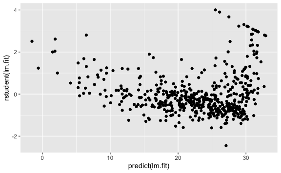

Lab 3 Linear Regression
================
Evan Woods
2023-12-06

# Lab: Linear Regression

## F-Statistic: Is at least one predictor a significant indicator of the response in a model?

``` r
lm.fit <- lm(medv ~ lstat)
summary(lm.fit)
```

    ## 
    ## Call:
    ## lm(formula = medv ~ lstat)
    ## 
    ## Residuals:
    ##     Min      1Q  Median      3Q     Max 
    ## -15.168  -3.990  -1.318   2.034  24.500 
    ## 
    ## Coefficients:
    ##             Estimate Std. Error t value Pr(>|t|)    
    ## (Intercept) 34.55384    0.56263   61.41   <2e-16 ***
    ## lstat       -0.95005    0.03873  -24.53   <2e-16 ***
    ## ---
    ## Signif. codes:  0 '***' 0.001 '**' 0.01 '*' 0.05 '.' 0.1 ' ' 1
    ## 
    ## Residual standard error: 6.216 on 504 degrees of freedom
    ## Multiple R-squared:  0.5441, Adjusted R-squared:  0.5432 
    ## F-statistic: 601.6 on 1 and 504 DF,  p-value: < 2.2e-16

## Calculate Confidence Interval: Provides a measure of confidence over all predictors

``` r
predict(lm.fit, data.frame(lstat = (c(5, 10, 15))), interval = "confidence")
```

    ##        fit      lwr      upr
    ## 1 29.80359 29.00741 30.59978
    ## 2 25.05335 24.47413 25.63256
    ## 3 20.30310 19.73159 20.87461

## Prediction Interval: Provide a measure of confidence given a particular observation in the larger dataset.

``` r
predict(lm.fit, data.frame(lstat = (c(5, 10, 15))), interval = "prediction")
```

    ##        fit       lwr      upr
    ## 1 29.80359 17.565675 42.04151
    ## 2 25.05335 12.827626 37.27907
    ## 3 20.30310  8.077742 32.52846

## Studentized Residuals: Identify outliers if values are greater than 3 or less than -3.

``` r
# Studentized residuals: Identify outliers if values are outside -3 to 3.
ggplot() + 
  geom_point(aes(
    predict(lm.fit), rstudent(lm.fit)
  ))
```



## Calculate leverage statistics

``` r
# Calculate leverage statistics
plot(hatvalues(lm.fit))
```


``` r
which.max(hatvalues(lm.fit)) # Identify the largest values of a vector. 
```

    ## 375 
    ## 375

## Use all predictors

## R<sup>2</sup> Value

``` r
# What is the R squared value?
summary.lm(lm.fit)$r.squared
```

    ## [1] 0.734307

## RSE

``` r
# What is the RSE?
summary.lm(lm.fit)$sigma
```

    ## [1] 4.798034

## Variance Inflation Factor: Identify collinearity

``` r
vif(lm.fit)
```

    ##     crim       zn    indus     chas      nox       rm      age      dis 
    ## 1.767486 2.298459 3.987181 1.071168 4.369093 1.912532 3.088232 3.954037 
    ##      rad      tax  ptratio    lstat 
    ## 7.445301 9.002158 1.797060 2.870777

## Include all predictors except a particular predictor

``` r
# All predictors except age:
lm.fit1 <- lm(medv ~ . - age, data = Boston)
summary(lm.fit1)
```

    ## 
    ## Call:
    ## lm(formula = medv ~ . - age, data = Boston)
    ## 
    ## Residuals:
    ##      Min       1Q   Median       3Q      Max 
    ## -15.1851  -2.7330  -0.6116   1.8555  26.3838 
    ## 
    ## Coefficients:
    ##               Estimate Std. Error t value Pr(>|t|)    
    ## (Intercept)  41.525128   4.919684   8.441 3.52e-16 ***
    ## crim         -0.121426   0.032969  -3.683 0.000256 ***
    ## zn            0.046512   0.013766   3.379 0.000785 ***
    ## indus         0.013451   0.062086   0.217 0.828577    
    ## chas          2.852773   0.867912   3.287 0.001085 ** 
    ## nox         -18.485070   3.713714  -4.978 8.91e-07 ***
    ## rm            3.681070   0.411230   8.951  < 2e-16 ***
    ## dis          -1.506777   0.192570  -7.825 3.12e-14 ***
    ## rad           0.287940   0.066627   4.322 1.87e-05 ***
    ## tax          -0.012653   0.003796  -3.333 0.000923 ***
    ## ptratio      -0.934649   0.131653  -7.099 4.39e-12 ***
    ## lstat        -0.547409   0.047669 -11.483  < 2e-16 ***
    ## ---
    ## Signif. codes:  0 '***' 0.001 '**' 0.01 '*' 0.05 '.' 0.1 ' ' 1
    ## 
    ## Residual standard error: 4.794 on 494 degrees of freedom
    ## Multiple R-squared:  0.7343, Adjusted R-squared:  0.7284 
    ## F-statistic: 124.1 on 11 and 494 DF,  p-value: < 2.2e-16

## Interaction Terms

``` r
# lstat:age includes the interaction. lstat * age is shorthand that includes the product and individual predictors. 
summary(lm(medv ~ lstat * age, data = Boston))
```

    ## 
    ## Call:
    ## lm(formula = medv ~ lstat * age, data = Boston)
    ## 
    ## Residuals:
    ##     Min      1Q  Median      3Q     Max 
    ## -15.806  -4.045  -1.333   2.085  27.552 
    ## 
    ## Coefficients:
    ##               Estimate Std. Error t value Pr(>|t|)    
    ## (Intercept) 36.0885359  1.4698355  24.553  < 2e-16 ***
    ## lstat       -1.3921168  0.1674555  -8.313 8.78e-16 ***
    ## age         -0.0007209  0.0198792  -0.036   0.9711    
    ## lstat:age    0.0041560  0.0018518   2.244   0.0252 *  
    ## ---
    ## Signif. codes:  0 '***' 0.001 '**' 0.01 '*' 0.05 '.' 0.1 ' ' 1
    ## 
    ## Residual standard error: 6.149 on 502 degrees of freedom
    ## Multiple R-squared:  0.5557, Adjusted R-squared:  0.5531 
    ## F-statistic: 209.3 on 3 and 502 DF,  p-value: < 2.2e-16

## Non-linear Transformations of the predictors

### Higher degree predictors (x<sup>2</sup>)

``` r
# Create X^2 using I(X^2)

# Perform a regression of medv onto lstat & lstat^2
lm.fit2 <- lm(medv ~ lstat + I(lstat^2))
summary(lm.fit2)
```

    ## 
    ## Call:
    ## lm(formula = medv ~ lstat + I(lstat^2))
    ## 
    ## Residuals:
    ##      Min       1Q   Median       3Q      Max 
    ## -15.2834  -3.8313  -0.5295   2.3095  25.4148 
    ## 
    ## Coefficients:
    ##              Estimate Std. Error t value Pr(>|t|)    
    ## (Intercept) 42.862007   0.872084   49.15   <2e-16 ***
    ## lstat       -2.332821   0.123803  -18.84   <2e-16 ***
    ## I(lstat^2)   0.043547   0.003745   11.63   <2e-16 ***
    ## ---
    ## Signif. codes:  0 '***' 0.001 '**' 0.01 '*' 0.05 '.' 0.1 ' ' 1
    ## 
    ## Residual standard error: 5.524 on 503 degrees of freedom
    ## Multiple R-squared:  0.6407, Adjusted R-squared:  0.6393 
    ## F-statistic: 448.5 on 2 and 503 DF,  p-value: < 2.2e-16

### Anova Function: H<sub>0</sub>: Both models fit the data equally well; H<sub>a</sub>: model 2 is a superior fit

## Qualitative Predictors

### Identify the coding of factor variables

``` r
contrasts(Carseats$ShelveLoc)
```

    ##        Good Medium
    ## Bad       0      0
    ## Good      1      0
    ## Medium    0      1
