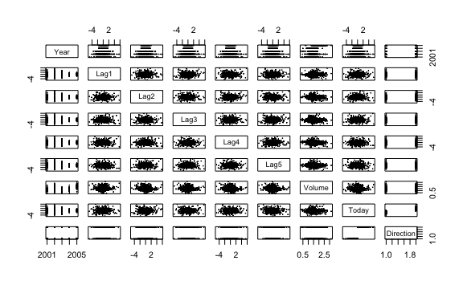
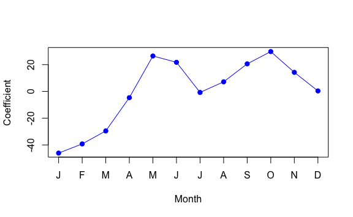
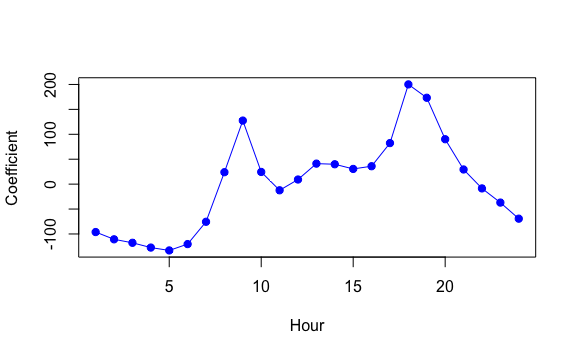
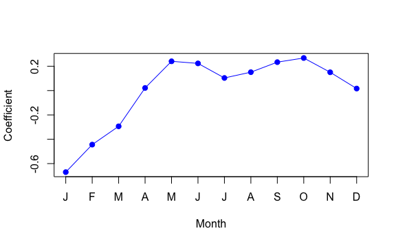
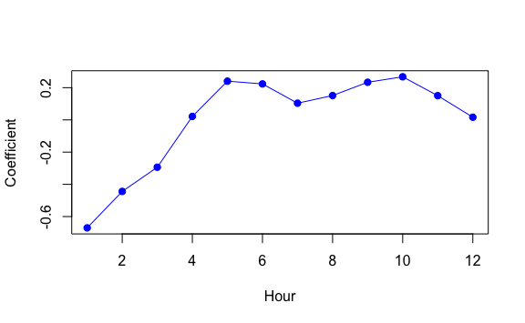
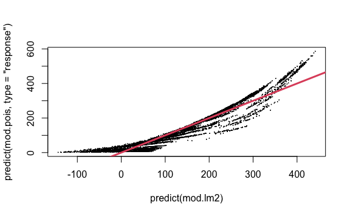

Lab 4 Classification
================
Evan Woods
2023-12-10

# Lab 4: Classification Methods

``` r
attach(Smarket)
```

``` r
names(Smarket)
```

    [1] "Year"      "Lag1"      "Lag2"      "Lag3"      "Lag4"      "Lag5"     
    [7] "Volume"    "Today"     "Direction"

``` r
summary(Smarket)
```

          Year           Lag1                Lag2                Lag3          
     Min.   :2001   Min.   :-4.922000   Min.   :-4.922000   Min.   :-4.922000  
     1st Qu.:2002   1st Qu.:-0.639500   1st Qu.:-0.639500   1st Qu.:-0.640000  
     Median :2003   Median : 0.039000   Median : 0.039000   Median : 0.038500  
     Mean   :2003   Mean   : 0.003834   Mean   : 0.003919   Mean   : 0.001716  
     3rd Qu.:2004   3rd Qu.: 0.596750   3rd Qu.: 0.596750   3rd Qu.: 0.596750  
     Max.   :2005   Max.   : 5.733000   Max.   : 5.733000   Max.   : 5.733000  
          Lag4                Lag5              Volume           Today          
     Min.   :-4.922000   Min.   :-4.92200   Min.   :0.3561   Min.   :-4.922000  
     1st Qu.:-0.640000   1st Qu.:-0.64000   1st Qu.:1.2574   1st Qu.:-0.639500  
     Median : 0.038500   Median : 0.03850   Median :1.4229   Median : 0.038500  
     Mean   : 0.001636   Mean   : 0.00561   Mean   :1.4783   Mean   : 0.003138  
     3rd Qu.: 0.596750   3rd Qu.: 0.59700   3rd Qu.:1.6417   3rd Qu.: 0.596750  
     Max.   : 5.733000   Max.   : 5.73300   Max.   :3.1525   Max.   : 5.733000  
     Direction 
     Down:602  
     Up  :648  
               
               
               
               

``` r
dim(Smarket)
```

    [1] 1250    9

``` r
pairs(Smarket, cex = .1, pch = 20)
```



``` r
smarket_quant <- Smarket %>% select(everything(), -Direction)
```

``` r
cor(smarket_quant)
```

                 Year         Lag1         Lag2         Lag3         Lag4
    Year   1.00000000  0.029699649  0.030596422  0.033194581  0.035688718
    Lag1   0.02969965  1.000000000 -0.026294328 -0.010803402 -0.002985911
    Lag2   0.03059642 -0.026294328  1.000000000 -0.025896670 -0.010853533
    Lag3   0.03319458 -0.010803402 -0.025896670  1.000000000 -0.024051036
    Lag4   0.03568872 -0.002985911 -0.010853533 -0.024051036  1.000000000
    Lag5   0.02978799 -0.005674606 -0.003557949 -0.018808338 -0.027083641
    Volume 0.53900647  0.040909908 -0.043383215 -0.041823686 -0.048414246
    Today  0.03009523 -0.026155045 -0.010250033 -0.002447647 -0.006899527
                   Lag5      Volume        Today
    Year    0.029787995  0.53900647  0.030095229
    Lag1   -0.005674606  0.04090991 -0.026155045
    Lag2   -0.003557949 -0.04338321 -0.010250033
    Lag3   -0.018808338 -0.04182369 -0.002447647
    Lag4   -0.027083641 -0.04841425 -0.006899527
    Lag5    1.000000000 -0.02200231 -0.034860083
    Volume -0.022002315  1.00000000  0.014591823
    Today  -0.034860083  0.01459182  1.000000000

``` r
names(Smarket)
```

    [1] "Year"      "Lag1"      "Lag2"      "Lag3"      "Lag4"      "Lag5"     
    [7] "Volume"    "Today"     "Direction"

## Logistic Regression

``` r
glm.fit <- glm(Direction ~ . -Year -Today -Direction, data = Smarket, family = binomial)
summary(glm.fit)$coefficients
```

                    Estimate Std. Error    z value  Pr(>|z|)
    (Intercept) -0.126000257 0.24073574 -0.5233966 0.6006983
    Lag1        -0.073073746 0.05016739 -1.4565986 0.1452272
    Lag2        -0.042301344 0.05008605 -0.8445733 0.3983491
    Lag3         0.011085108 0.04993854  0.2219750 0.8243333
    Lag4         0.009358938 0.04997413  0.1872757 0.8514445
    Lag5         0.010313068 0.04951146  0.2082966 0.8349974
    Volume       0.135440659 0.15835970  0.8552723 0.3924004

``` r
glm.probs <- predict(glm.fit, type = "response")
glm.probs[1:10]
```

            1         2         3         4         5         6         7         8 
    0.5070841 0.4814679 0.4811388 0.5152224 0.5107812 0.5069565 0.4926509 0.5092292 
            9        10 
    0.5176135 0.4888378 

``` r
contrasts(Direction)
```

         Up
    Down  0
    Up    1

``` r
glm.pred <- rep("Down", 1250)
```

``` r
glm.pred[glm.probs > .5] = "Up"
```

``` r
table(glm.pred, Direction)
```

            Direction
    glm.pred Down  Up
        Down  145 141
        Up    457 507

``` r
mean(glm.pred == Direction)
```

    [1] 0.5216

``` r
train <- (Year < 2005) # The training set; used to train the model
Smarket.2005 <- Smarket[!train, ] # The test set; used to create test predictions
dim(Smarket)
```

    [1] 1250    9

``` r
Direction.2005 <- Direction[!train] # The true values of the test set's response; Used to compare against the test set's predictions. 
```

``` r
names(Smarket)
```

    [1] "Year"      "Lag1"      "Lag2"      "Lag3"      "Lag4"      "Lag5"     
    [7] "Volume"    "Today"     "Direction"

``` r
# Fit the model using the training subset
glm.fits <- glm(Direction ~ . -Today -Direction -Year, data = Smarket, subset = train, family = binomial)
summary(glm.fits)
```


    Call:
    glm(formula = Direction ~ . - Today - Direction - Year, family = binomial, 
        data = Smarket, subset = train)

    Coefficients:
                 Estimate Std. Error z value Pr(>|z|)
    (Intercept)  0.191213   0.333690   0.573    0.567
    Lag1        -0.054178   0.051785  -1.046    0.295
    Lag2        -0.045805   0.051797  -0.884    0.377
    Lag3         0.007200   0.051644   0.139    0.889
    Lag4         0.006441   0.051706   0.125    0.901
    Lag5        -0.004223   0.051138  -0.083    0.934
    Volume      -0.116257   0.239618  -0.485    0.628

    (Dispersion parameter for binomial family taken to be 1)

        Null deviance: 1383.3  on 997  degrees of freedom
    Residual deviance: 1381.1  on 991  degrees of freedom
    AIC: 1395.1

    Number of Fisher Scoring iterations: 3

``` r
# Creating test predictions using the test set
glm.probs <- predict(glm.fits, Smarket.2005, type = "response")
glm.probs
```

          999      1000      1001      1002      1003      1004      1005      1006 
    0.5282195 0.5156688 0.5226521 0.5138543 0.4983345 0.5010912 0.5027703 0.5095680 
         1007      1008      1009      1010      1011      1012      1013      1014 
    0.5040112 0.5106408 0.5101183 0.4811653 0.5052950 0.5236316 0.5168364 0.5125333 
         1015      1016      1017      1018      1019      1020      1021      1022 
    0.4982179 0.4882768 0.4960135 0.5051879 0.4910689 0.4789755 0.4912577 0.5056236 
         1023      1024      1025      1026      1027      1028      1029      1030 
    0.4889100 0.4967660 0.5084460 0.5168250 0.5073168 0.4868397 0.5007467 0.5009795 
         1031      1032      1033      1034      1035      1036      1037      1038 
    0.5012692 0.5123720 0.5113280 0.5141906 0.5120219 0.4848925 0.4804829 0.4974951 
         1039      1040      1041      1042      1043      1044      1045      1046 
    0.5001878 0.4956115 0.4997080 0.4883755 0.4893983 0.5088590 0.5195232 0.5088729 
         1047      1048      1049      1050      1051      1052      1053      1054 
    0.5109177 0.5062938 0.5075737 0.5188956 0.5089908 0.4750034 0.5019550 0.5068664 
         1055      1056      1057      1058      1059      1060      1061      1062 
    0.4920794 0.4956677 0.4938379 0.4917051 0.4771327 0.4677842 0.4953634 0.4939976 
         1063      1064      1065      1066      1067      1068      1069      1070 
    0.4815092 0.4868789 0.4838154 0.5048192 0.5139716 0.4819605 0.4958307 0.5082474 
         1071      1072      1073      1074      1075      1076      1077      1078 
    0.5024951 0.4953088 0.4707835 0.4934152 0.4724764 0.4731641 0.4924263 0.4962637 
         1079      1080      1081      1082      1083      1084      1085      1086 
    0.4884338 0.4957835 0.4744252 0.4699449 0.4806214 0.4688377 0.4783015 0.5042272 
         1087      1088      1089      1090      1091      1092      1093      1094 
    0.4880608 0.4981440 0.5023063 0.4978148 0.5002376 0.4854172 0.4691275 0.4626001 
         1095      1096      1097      1098      1099      1100      1101      1102 
    0.4817722 0.4989457 0.4971733 0.4937147 0.5015250 0.4957780 0.4980323 0.5019997 
         1103      1104      1105      1106      1107      1108      1109      1110 
    0.4915181 0.4808492 0.5083755 0.5114089 0.4909387 0.5000471 0.4910523 0.4960630 
         1111      1112      1113      1114      1115      1116      1117      1118 
    0.4997648 0.4930280 0.4878399 0.4898010 0.4675937 0.4940048 0.5026231 0.4971474 
         1119      1120      1121      1122      1123      1124      1125      1126 
    0.5022160 0.5000233 0.5053134 0.4816248 0.4876347 0.5000782 0.5073672 0.4779109 
         1127      1128      1129      1130      1131      1132      1133      1134 
    0.4937240 0.5000482 0.4736016 0.4705016 0.4848011 0.4940802 0.4838901 0.4932104 
         1135      1136      1137      1138      1139      1140      1141      1142 
    0.5083553 0.4862333 0.4726220 0.4896031 0.4992129 0.4956604 0.4929691 0.4839748 
         1143      1144      1145      1146      1147      1148      1149      1150 
    0.4759594 0.5012649 0.5069609 0.4767723 0.4788998 0.5015961 0.5116628 0.5057887 
         1151      1152      1153      1154      1155      1156      1157      1158 
    0.4839585 0.4785055 0.4854986 0.4991910 0.5056699 0.5078602 0.5050552 0.4947249 
         1159      1160      1161      1162      1163      1164      1165      1166 
    0.5008088 0.4989620 0.5015695 0.5049627 0.5061449 0.5066014 0.4998286 0.4895835 
         1167      1168      1169      1170      1171      1172      1173      1174 
    0.4692522 0.4713581 0.5035406 0.4800194 0.4686318 0.4950380 0.4862271 0.4817440 
         1175      1176      1177      1178      1179      1180      1181      1182 
    0.4989091 0.5046852 0.4881872 0.4429470 0.4858557 0.4993329 0.4953803 0.4796547 
         1183      1184      1185      1186      1187      1188      1189      1190 
    0.4832212 0.4880403 0.4916669 0.4849327 0.4714071 0.4756117 0.4898759 0.4967124 
         1191      1192      1193      1194      1195      1196      1197      1198 
    0.5042698 0.4870934 0.4815981 0.4873724 0.4935757 0.4857298 0.4854678 0.4731518 
         1199      1200      1201      1202      1203      1204      1205      1206 
    0.4737332 0.4961751 0.4624831 0.4727707 0.4918906 0.4603075 0.4609432 0.4894839 
         1207      1208      1209      1210      1211      1212      1213      1214 
    0.4994287 0.4653592 0.4424308 0.4746815 0.4664659 0.4505852 0.4835892 0.4896331 
         1215      1216      1217      1218      1219      1220      1221      1222 
    0.4925173 0.4850779 0.4650663 0.4819860 0.4923093 0.4870718 0.4875866 0.4651332 
         1223      1224      1225      1226      1227      1228      1229      1230 
    0.4596375 0.4764932 0.4704420 0.4802558 0.5212147 0.4992029 0.4919929 0.4858182 
         1231      1232      1233      1234      1235      1236      1237      1238 
    0.4611093 0.4714544 0.4842023 0.4901132 0.4906118 0.4916995 0.4898348 0.4877481 
         1239      1240      1241      1242      1243      1244      1245      1246 
    0.4707316 0.4741701 0.4823826 0.4797408 0.4946146 0.4956013 0.4832871 0.4836369 
         1247      1248      1249      1250 
    0.5060484 0.5166578 0.5161239 0.5080723 

``` r
glm.pred <- rep("Down", 252)
glm.pred[glm.probs > .5] <- "Up"
```

``` r
table(glm.pred, Direction.2005)
```

            Direction.2005
    glm.pred Down Up
        Down   77 97
        Up     34 44

``` r
mean(glm.pred == Direction.2005)
```

    [1] 0.4801587

``` r
# average number of predictions not equal to the true values of the test set. Testing Error.
mean(glm.pred != Direction.2005)
```

    [1] 0.5198413

``` r
glm.fit2 <- glm(Direction ~ Lag1 + Lag2, data = Smarket, family = binomial, subset = train)
glm.probs2 <- predict(glm.fit2, Smarket.2005, type = "response")
glm.preds2 <- rep("Down", 252)
glm.preds2[glm.probs2 > 0.5] = "Up"
table(glm.preds2, Direction.2005)
```

              Direction.2005
    glm.preds2 Down  Up
          Down   35  35
          Up     76 106

``` r
# Test Error
mean(glm.preds2 != Direction.2005)
```

    [1] 0.4404762

``` r
length(Lag2)
```

    [1] 1250

``` r
# Predictions for particular values of Lag1 & Lag2
predict(glm.fit2, 
        newdata = data.frame(Lag1 = c(1.2, 1.5), Lag2 = c(1.1, -0.8)), 
        type = "response")
```

            1         2 
    0.4791462 0.4960939 

## LDA

``` r
lda.fit <- lda(Direction ~ Lag1 + Lag2, data = Smarket, subset = train)
lda.fit
```

    Call:
    lda(Direction ~ Lag1 + Lag2, data = Smarket, subset = train)

    Prior probabilities of groups:
        Down       Up 
    0.491984 0.508016 

    Group means:
                Lag1        Lag2
    Down  0.04279022  0.03389409
    Up   -0.03954635 -0.03132544

    Coefficients of linear discriminants:
                LD1
    Lag1 -0.6420190
    Lag2 -0.5135293

``` r
lda.pred <- predict(lda.fit, Smarket.2005)
names(lda.pred)
```

    [1] "class"     "posterior" "x"        

``` r
table(lda.pred$class, Direction.2005)
```

          Direction.2005
           Down  Up
      Down   35  35
      Up     76 106

``` r
# Average Test Error
mean(lda.pred$class != Direction.2005)
```

    [1] 0.4404762

``` r
# The predicated probabilities that the market will decrease
sum(lda.pred$posterior[, 1] >= .5)
```

    [1] 70

``` r
sum(lda.pred$posterior[, 1] < .5)
```

    [1] 182

## Quadratic Discriminant Analysis

``` r
qda.fit <- qda(Direction ~ Lag1 + Lag2, data = Smarket, subset = train)
qda.fit
```

    Call:
    qda(Direction ~ Lag1 + Lag2, data = Smarket, subset = train)

    Prior probabilities of groups:
        Down       Up 
    0.491984 0.508016 

    Group means:
                Lag1        Lag2
    Down  0.04279022  0.03389409
    Up   -0.03954635 -0.03132544

``` r
qda.class <- predict(qda.fit, Smarket.2005)$class
table(qda.class, Direction.2005)
```

             Direction.2005
    qda.class Down  Up
         Down   30  20
         Up     81 121

``` r
# Test Error rate
mean(qda.class != Direction.2005)
```

    [1] 0.4007937

## Naive Bayes

``` r
nb.fit <- naiveBayes(Direction ~ Lag1 + Lag2, data = Smarket, subset = train)
nb.fit
```


    Naive Bayes Classifier for Discrete Predictors

    Call:
    naiveBayes.default(x = X, y = Y, laplace = laplace)

    A-priori probabilities:
    Y
        Down       Up 
    0.491984 0.508016 

    Conditional probabilities:
          Lag1
    Y             [,1]     [,2]
      Down  0.04279022 1.227446
      Up   -0.03954635 1.231668

          Lag2
    Y             [,1]     [,2]
      Down  0.03389409 1.239191
      Up   -0.03132544 1.220765

``` r
# Mean & Standard deviation
mean(Lag1[train][Direction[train] == "Down"])
```

    [1] 0.04279022

``` r
sd(Lag1[train][Direction[train] == "Down"])
```

    [1] 1.227446

``` r
# Prediction
nb.class <- predict(nb.fit, Smarket.2005)
table(nb.class, Direction.2005)
```

            Direction.2005
    nb.class Down  Up
        Down   28  20
        Up     83 121

``` r
mean(nb.class == Direction.2005)
```

    [1] 0.5912698

``` r
nb.preds <- predict(nb.fit, Smarket.2005, type = "raw")
nb.preds[1:5,]
```

              Down        Up
    [1,] 0.4873164 0.5126836
    [2,] 0.4762492 0.5237508
    [3,] 0.4653377 0.5346623
    [4,] 0.4748652 0.5251348
    [5,] 0.4901890 0.5098110

## K-Nearest Neighbors

``` r
train.X <- cbind(Lag1, Lag2)[train, ]
test.X <- cbind(Lag1, Lag2)[!train, ]
train.Direction <- Direction[train] # labels for the training observations
```

``` r
set.seed(1)
knn.pred <- knn(train.X, test.X, train.Direction, k = 1)
table(knn.pred, Direction.2005)
```

            Direction.2005
    knn.pred Down Up
        Down   43 58
        Up     68 83

``` r
# Test Error
mean(knn.pred != Direction.2005)
```

    [1] 0.5

``` r
knn.pred_k3 <- knn(train.X, test.X, train.Direction, k = 3)
table(knn.pred_k3, Direction.2005)
```

               Direction.2005
    knn.pred_k3 Down Up
           Down   48 54
           Up     63 87

``` r
mean(knn.pred == Direction.2005)
```

    [1] 0.5

``` r
dim(Caravan)
```

    [1] 5822   86

``` r
attach(Caravan)
names(Caravan)
```

     [1] "MOSTYPE"  "MAANTHUI" "MGEMOMV"  "MGEMLEEF" "MOSHOOFD" "MGODRK"  
     [7] "MGODPR"   "MGODOV"   "MGODGE"   "MRELGE"   "MRELSA"   "MRELOV"  
    [13] "MFALLEEN" "MFGEKIND" "MFWEKIND" "MOPLHOOG" "MOPLMIDD" "MOPLLAAG"
    [19] "MBERHOOG" "MBERZELF" "MBERBOER" "MBERMIDD" "MBERARBG" "MBERARBO"
    [25] "MSKA"     "MSKB1"    "MSKB2"    "MSKC"     "MSKD"     "MHHUUR"  
    [31] "MHKOOP"   "MAUT1"    "MAUT2"    "MAUT0"    "MZFONDS"  "MZPART"  
    [37] "MINKM30"  "MINK3045" "MINK4575" "MINK7512" "MINK123M" "MINKGEM" 
    [43] "MKOOPKLA" "PWAPART"  "PWABEDR"  "PWALAND"  "PPERSAUT" "PBESAUT" 
    [49] "PMOTSCO"  "PVRAAUT"  "PAANHANG" "PTRACTOR" "PWERKT"   "PBROM"   
    [55] "PLEVEN"   "PPERSONG" "PGEZONG"  "PWAOREG"  "PBRAND"   "PZEILPL" 
    [61] "PPLEZIER" "PFIETS"   "PINBOED"  "PBYSTAND" "AWAPART"  "AWABEDR" 
    [67] "AWALAND"  "APERSAUT" "ABESAUT"  "AMOTSCO"  "AVRAAUT"  "AAANHANG"
    [73] "ATRACTOR" "AWERKT"   "ABROM"    "ALEVEN"   "APERSONG" "AGEZONG" 
    [79] "AWAOREG"  "ABRAND"   "AZEILPL"  "APLEZIER" "AFIETS"   "AINBOED" 
    [85] "ABYSTAND" "Purchase"

``` r
summary(Purchase)
```

      No  Yes 
    5474  348 

``` r
length(Purchase)
```

    [1] 5822

``` r
# Give variables a mean of zero and a standard deviation of one: scale()
standardized.X <- scale(Caravan[, -86])
var(Caravan[, 1])
```

    [1] 165.0378

``` r
var(Caravan[, 2])
```

    [1] 0.1647078

``` r
var(standardized.X[, 1])
```

    [1] 1

``` r
var(standardized.X[, 2])
```

    [1] 1

``` r
test <- 1:1000

train.X <- standardized.X[-test, ]
test.X <- standardized.X[test, ]
train.Y <- Purchase[-test]
test.Y <- Purchase[test]
```

``` r
dim(train.X)
```

    [1] 4822   85

``` r
dim(test.X)
```

    [1] 1000   85

``` r
length(train.Y)
```

    [1] 4822

``` r
set.seed(1)
knn.pred_standardized <- knn(train.X, test.X, train.Y, k = 1)

mean(test.Y != knn.pred_standardized)
```

    [1] 0.118

``` r
mean(test.Y != "No")
```

    [1] 0.059

``` r
table(knn.pred_standardized, test.Y)
```

                         test.Y
    knn.pred_standardized  No Yes
                      No  873  50
                      Yes  68   9

``` r
knn.pred_standardized_k3 <- knn(train.X, test.X, train.Y, k = 3)
table(knn.pred_standardized_k3, test.Y)
```

                            test.Y
    knn.pred_standardized_k3  No Yes
                         No  920  54
                         Yes  21   5

``` r
5/(19+5)
```

    [1] 0.2083333

``` r
knn.pred_standardized_k5 <- knn(train.X, test.X, train.Y, k = 5)
table(knn.pred_standardized_k5, test.Y)
```

                            test.Y
    knn.pred_standardized_k5  No Yes
                         No  930  55
                         Yes  11   4

``` r
glm.fits <- glm(Purchase ~ ., data = Caravan, family = binomial, subset = -test)
```

    Warning: glm.fit: fitted probabilities numerically 0 or 1 occurred

``` r
glm.probs <- predict(glm.fits, Caravan[test, ], type = "response")
glm.pred <- rep("No", 1000)
glm.pred[glm.probs > .5] <- "Yes"
table(glm.pred, test.Y)
```

            test.Y
    glm.pred  No Yes
         No  934  59
         Yes   7   0

``` r
glm.pred <- rep("No", 1000)
glm.pred[glm.probs > .25] <- "Yes"
table(glm.pred, test.Y)
```

            test.Y
    glm.pred  No Yes
         No  919  48
         Yes  22  11

## Poisson Regression

``` r
attach(Bikeshare)
dim(Bikeshare)
```

    [1] 8645   15

``` r
names(Bikeshare)
```

     [1] "season"     "mnth"       "day"        "hr"         "holiday"   
     [6] "weekday"    "workingday" "weathersit" "temp"       "atemp"     
    [11] "hum"        "windspeed"  "casual"     "registered" "bikers"    

``` r
mod.lm <- lm(
  bikers ~ mnth + hr + workingday + temp + weathersit, data = Bikeshare
)
summary(mod.lm)
```


    Call:
    lm(formula = bikers ~ mnth + hr + workingday + temp + weathersit, 
        data = Bikeshare)

    Residuals:
        Min      1Q  Median      3Q     Max 
    -299.00  -45.70   -6.23   41.08  425.29 

    Coefficients:
                              Estimate Std. Error t value Pr(>|t|)    
    (Intercept)                -68.632      5.307 -12.932  < 2e-16 ***
    mnthFeb                      6.845      4.287   1.597 0.110398    
    mnthMarch                   16.551      4.301   3.848 0.000120 ***
    mnthApril                   41.425      4.972   8.331  < 2e-16 ***
    mnthMay                     72.557      5.641  12.862  < 2e-16 ***
    mnthJune                    67.819      6.544  10.364  < 2e-16 ***
    mnthJuly                    45.324      7.081   6.401 1.63e-10 ***
    mnthAug                     53.243      6.640   8.019 1.21e-15 ***
    mnthSept                    66.678      5.925  11.254  < 2e-16 ***
    mnthOct                     75.834      4.950  15.319  < 2e-16 ***
    mnthNov                     60.310      4.610  13.083  < 2e-16 ***
    mnthDec                     46.458      4.271  10.878  < 2e-16 ***
    hr1                        -14.579      5.699  -2.558 0.010536 *  
    hr2                        -21.579      5.733  -3.764 0.000168 ***
    hr3                        -31.141      5.778  -5.389 7.26e-08 ***
    hr4                        -36.908      5.802  -6.361 2.11e-10 ***
    hr5                        -24.135      5.737  -4.207 2.61e-05 ***
    hr6                         20.600      5.704   3.612 0.000306 ***
    hr7                        120.093      5.693  21.095  < 2e-16 ***
    hr8                        223.662      5.690  39.310  < 2e-16 ***
    hr9                        120.582      5.693  21.182  < 2e-16 ***
    hr10                        83.801      5.705  14.689  < 2e-16 ***
    hr11                       105.423      5.722  18.424  < 2e-16 ***
    hr12                       137.284      5.740  23.916  < 2e-16 ***
    hr13                       136.036      5.760  23.617  < 2e-16 ***
    hr14                       126.636      5.776  21.923  < 2e-16 ***
    hr15                       132.087      5.780  22.852  < 2e-16 ***
    hr16                       178.521      5.772  30.927  < 2e-16 ***
    hr17                       296.267      5.749  51.537  < 2e-16 ***
    hr18                       269.441      5.736  46.976  < 2e-16 ***
    hr19                       186.256      5.714  32.596  < 2e-16 ***
    hr20                       125.549      5.704  22.012  < 2e-16 ***
    hr21                        87.554      5.693  15.378  < 2e-16 ***
    hr22                        59.123      5.689  10.392  < 2e-16 ***
    hr23                        26.838      5.688   4.719 2.41e-06 ***
    workingday                   1.270      1.784   0.711 0.476810    
    temp                       157.209     10.261  15.321  < 2e-16 ***
    weathersitcloudy/misty     -12.890      1.964  -6.562 5.60e-11 ***
    weathersitlight rain/snow  -66.494      2.965 -22.425  < 2e-16 ***
    weathersitheavy rain/snow -109.745     76.667  -1.431 0.152341    
    ---
    Signif. codes:  0 '***' 0.001 '**' 0.01 '*' 0.05 '.' 0.1 ' ' 1

    Residual standard error: 76.5 on 8605 degrees of freedom
    Multiple R-squared:  0.6745,    Adjusted R-squared:  0.6731 
    F-statistic: 457.3 on 39 and 8605 DF,  p-value: < 2.2e-16

``` r
contrasts(Bikeshare$hr) = contr.sum(24)
contrasts(Bikeshare$mnth) = contr.sum(12)
```

``` r
mod.lm2 <- lm(
  bikers ~ mnth + hr + workingday + temp + weathersit, data = Bikeshare
)
summary(mod.lm2)
```


    Call:
    lm(formula = bikers ~ mnth + hr + workingday + temp + weathersit, 
        data = Bikeshare)

    Residuals:
        Min      1Q  Median      3Q     Max 
    -299.00  -45.70   -6.23   41.08  425.29 

    Coefficients:
                               Estimate Std. Error t value Pr(>|t|)    
    (Intercept)                 73.5974     5.1322  14.340  < 2e-16 ***
    mnth1                      -46.0871     4.0855 -11.281  < 2e-16 ***
    mnth2                      -39.2419     3.5391 -11.088  < 2e-16 ***
    mnth3                      -29.5357     3.1552  -9.361  < 2e-16 ***
    mnth4                       -4.6622     2.7406  -1.701  0.08895 .  
    mnth5                       26.4700     2.8508   9.285  < 2e-16 ***
    mnth6                       21.7317     3.4651   6.272 3.75e-10 ***
    mnth7                       -0.7626     3.9084  -0.195  0.84530    
    mnth8                        7.1560     3.5347   2.024  0.04295 *  
    mnth9                       20.5912     3.0456   6.761 1.46e-11 ***
    mnth10                      29.7472     2.6995  11.019  < 2e-16 ***
    mnth11                      14.2229     2.8604   4.972 6.74e-07 ***
    hr1                        -96.1420     3.9554 -24.307  < 2e-16 ***
    hr2                       -110.7213     3.9662 -27.916  < 2e-16 ***
    hr3                       -117.7212     4.0165 -29.310  < 2e-16 ***
    hr4                       -127.2828     4.0808 -31.191  < 2e-16 ***
    hr5                       -133.0495     4.1168 -32.319  < 2e-16 ***
    hr6                       -120.2775     4.0370 -29.794  < 2e-16 ***
    hr7                        -75.5424     3.9916 -18.925  < 2e-16 ***
    hr8                         23.9511     3.9686   6.035 1.65e-09 ***
    hr9                        127.5199     3.9500  32.284  < 2e-16 ***
    hr10                        24.4399     3.9360   6.209 5.57e-10 ***
    hr11                       -12.3407     3.9361  -3.135  0.00172 ** 
    hr12                         9.2814     3.9447   2.353  0.01865 *  
    hr13                        41.1417     3.9571  10.397  < 2e-16 ***
    hr14                        39.8939     3.9750  10.036  < 2e-16 ***
    hr15                        30.4940     3.9910   7.641 2.39e-14 ***
    hr16                        35.9445     3.9949   8.998  < 2e-16 ***
    hr17                        82.3786     3.9883  20.655  < 2e-16 ***
    hr18                       200.1249     3.9638  50.488  < 2e-16 ***
    hr19                       173.2989     3.9561  43.806  < 2e-16 ***
    hr20                        90.1138     3.9400  22.872  < 2e-16 ***
    hr21                        29.4071     3.9362   7.471 8.74e-14 ***
    hr22                        -8.5883     3.9332  -2.184  0.02902 *  
    hr23                       -37.0194     3.9344  -9.409  < 2e-16 ***
    workingday                   1.2696     1.7845   0.711  0.47681    
    temp                       157.2094    10.2612  15.321  < 2e-16 ***
    weathersitcloudy/misty     -12.8903     1.9643  -6.562 5.60e-11 ***
    weathersitlight rain/snow  -66.4944     2.9652 -22.425  < 2e-16 ***
    weathersitheavy rain/snow -109.7446    76.6674  -1.431  0.15234    
    ---
    Signif. codes:  0 '***' 0.001 '**' 0.01 '*' 0.05 '.' 0.1 ' ' 1

    Residual standard error: 76.5 on 8605 degrees of freedom
    Multiple R-squared:  0.6745,    Adjusted R-squared:  0.6731 
    F-statistic: 457.3 on 39 and 8605 DF,  p-value: < 2.2e-16

``` r
near(sum(predict(mod.lm) - predict(mod.lm2))^2, 0)
```

    [1] TRUE

``` r
all.equal(predict(mod.lm), predict(mod.lm2))
```

    [1] TRUE

``` r
coef.months <- c(coef(mod.lm2)[2:12], -sum(coef(mod.lm2)[2:12]))
plot(coef.months, xlab = "Month", ylab = "Coefficient", xaxt = "n", col = "blue", pch = 19, type = "o")
axis(side = 1, at =  1:12, labels = c("J", "F", "M", "A", "M", "J", "J", "A", "S", "O", "N", "D"))
```



``` r
coef.hours <- c(coef(mod.lm2)[13:35], -sum(coef(mod.lm2)[13:35]))
plot(coef.hours, xlab = "Hour", ylab = "Coefficient", col = "blue", pch = 19, type = "o")
```



``` r
mod.pois <- glm(
  bikers ~ mnth + hr + workingday + temp + weathersit, 
  data = Bikeshare, family = poisson
)
summary(mod.pois)
```


    Call:
    glm(formula = bikers ~ mnth + hr + workingday + temp + weathersit, 
        family = poisson, data = Bikeshare)

    Coefficients:
                               Estimate Std. Error  z value Pr(>|z|)    
    (Intercept)                4.118245   0.006021  683.964  < 2e-16 ***
    mnth1                     -0.670170   0.005907 -113.445  < 2e-16 ***
    mnth2                     -0.444124   0.004860  -91.379  < 2e-16 ***
    mnth3                     -0.293733   0.004144  -70.886  < 2e-16 ***
    mnth4                      0.021523   0.003125    6.888 5.66e-12 ***
    mnth5                      0.240471   0.002916   82.462  < 2e-16 ***
    mnth6                      0.223235   0.003554   62.818  < 2e-16 ***
    mnth7                      0.103617   0.004125   25.121  < 2e-16 ***
    mnth8                      0.151171   0.003662   41.281  < 2e-16 ***
    mnth9                      0.233493   0.003102   75.281  < 2e-16 ***
    mnth10                     0.267573   0.002785   96.091  < 2e-16 ***
    mnth11                     0.150264   0.003180   47.248  < 2e-16 ***
    hr1                       -0.754386   0.007879  -95.744  < 2e-16 ***
    hr2                       -1.225979   0.009953 -123.173  < 2e-16 ***
    hr3                       -1.563147   0.011869 -131.702  < 2e-16 ***
    hr4                       -2.198304   0.016424 -133.846  < 2e-16 ***
    hr5                       -2.830484   0.022538 -125.586  < 2e-16 ***
    hr6                       -1.814657   0.013464 -134.775  < 2e-16 ***
    hr7                       -0.429888   0.006896  -62.341  < 2e-16 ***
    hr8                        0.575181   0.004406  130.544  < 2e-16 ***
    hr9                        1.076927   0.003563  302.220  < 2e-16 ***
    hr10                       0.581769   0.004286  135.727  < 2e-16 ***
    hr11                       0.336852   0.004720   71.372  < 2e-16 ***
    hr12                       0.494121   0.004392  112.494  < 2e-16 ***
    hr13                       0.679642   0.004069  167.040  < 2e-16 ***
    hr14                       0.673565   0.004089  164.722  < 2e-16 ***
    hr15                       0.624910   0.004178  149.570  < 2e-16 ***
    hr16                       0.653763   0.004132  158.205  < 2e-16 ***
    hr17                       0.874301   0.003784  231.040  < 2e-16 ***
    hr18                       1.294635   0.003254  397.848  < 2e-16 ***
    hr19                       1.212281   0.003321  365.084  < 2e-16 ***
    hr20                       0.914022   0.003700  247.065  < 2e-16 ***
    hr21                       0.616201   0.004191  147.045  < 2e-16 ***
    hr22                       0.364181   0.004659   78.173  < 2e-16 ***
    hr23                       0.117493   0.005225   22.488  < 2e-16 ***
    workingday                 0.014665   0.001955    7.502 6.27e-14 ***
    temp                       0.785292   0.011475   68.434  < 2e-16 ***
    weathersitcloudy/misty    -0.075231   0.002179  -34.528  < 2e-16 ***
    weathersitlight rain/snow -0.575800   0.004058 -141.905  < 2e-16 ***
    weathersitheavy rain/snow -0.926287   0.166782   -5.554 2.79e-08 ***
    ---
    Signif. codes:  0 '***' 0.001 '**' 0.01 '*' 0.05 '.' 0.1 ' ' 1

    (Dispersion parameter for poisson family taken to be 1)

        Null deviance: 1052921  on 8644  degrees of freedom
    Residual deviance:  228041  on 8605  degrees of freedom
    AIC: 281159

    Number of Fisher Scoring iterations: 5

``` r
coef.mnth <- c(coef(mod.pois)[2:12], -sum(coef(mod.pois)[2:12]))
plot(coef.mnth, xlab = "Month", ylab = "Coefficient", xaxt = "n", col = "blue", pch = 19, type = "o")
axis(side = 1, at = 1:12, labels = c("J", "F", "M", "A", "M", "J", "J", "A", "S", "O", "N", "D"))
```



``` r
coef.hours <- c(coef(mod.pois)[13:35], -sum(coef(mod.pois)[13:35]))
plot(coef.mnth, xlab = "Hour", ylab = "Coefficient", col = "blue", pch = 19, type = "o")
```



``` r
plot(predict(mod.lm2), predict(mod.pois, type = "response"), cex = .1, pch = 20)
abline(0, 1, col = 2, lwd = 3)
```



## Classifiers

### Linear Discriminant Analysis

The mean is different in each class. The covariance matrix is assumed to
the constant among each class. Linear decision boundary is assumed.

### Quadratic Discriminant Analysis

Each class has its own covariance matrix. A non-linear decision boundary
is assumed. Works well with a larger number of predictors.

### Naive Bayes

Assumes that the predictors are independent. That is, each class has its
own covariance matrix and that class-specific matrix is encoded as a
vector along the diagonal. Works well with a small number of predictors.

### K-Nearest Neighbors

KNN is a non-parametric approach. The function of the data is not
assumed. Rather the data itself is used to make predictions without the
inclusion of coefficients.  
The training observations that are closest to X are identified. Then the
greatest number of classes that are closest to X assign X to that class.

## General Linear Models

A distribution of the data is assumed. The mean is transformed so that
the transformed mean is a linear function of the predictors using a link
function. In the case of a linear regression, the mean is not
transformed, i.e. $η(μ) = μ$. Logistic functions use a link function of
$η(μ) = log(μ/(1-μ))$ whereas Poisson regressions use a link function of
$η(μ) = log(μ)$.

### Linear Regression

The variance is constant.

### Logistic Regression

Assumes a linear decision boundary of the true function of f. Useful for
qualitative classification. There exists multiple logistic regression
(binary response & multiple predictors), & multinomial logistic
regression (multiple responses: i.e. more than two possible outcome
classes).

### Poisson Regression

The mean is equal to the variance. The variance is not constant. Best
used when a log transformation of a linear model is not adequate due to
non-constant variance.
