Lab 4 Classification Exercises
================
Evan Woods
2023-12-11

## Applied

### Question 13:

This question should be answered using the weekly data set, which is
part of the ISLR2 package. This data is similar in nature to the Smarket
data from this chapter’s lab, except that it contains 1,089 weekly
returns for 21 years, from the beginning of 1990 to the end of 2010.

- **Question 13-a**: Produce some numerical and graphical summaries of
  the Weekly data. Do there appear to be any patterns?
  - **Answer**:


    There appears to be a logrithmic relationship between Year & Volume. The data
    appears otherwise to have no discernable patterns.

- **Question 13-b**: Use the full data set to perform a logistic
  regression with Direction as the response and the five lag variables
  plus Volume as predictors. Use the summary function to print the
  results. Do any of the predictors appear to be statistically
  significant? If so, which ones?
  - **Answer**:

<!-- -->


    Call:
    glm(formula = Direction ~ Lag1 + Lag2 + Lag3 + Lag4 + Lag5 + 
        Volume, family = binomial, data = weekly)

    Coefficients:
                Estimate Std. Error z value Pr(>|z|)   
    (Intercept)  0.26686    0.08593   3.106   0.0019 **
    Lag1        -0.04127    0.02641  -1.563   0.1181   
    Lag2         0.05844    0.02686   2.175   0.0296 * 
    Lag3        -0.01606    0.02666  -0.602   0.5469   
    Lag4        -0.02779    0.02646  -1.050   0.2937   
    Lag5        -0.01447    0.02638  -0.549   0.5833   
    Volume      -0.02274    0.03690  -0.616   0.5377   
    ---
    Signif. codes:  0 '***' 0.001 '**' 0.01 '*' 0.05 '.' 0.1 ' ' 1

    (Dispersion parameter for binomial family taken to be 1)

        Null deviance: 1496.2  on 1088  degrees of freedom
    Residual deviance: 1486.4  on 1082  degrees of freedom
    AIC: 1500.4

    Number of Fisher Scoring iterations: 4

    Only Lag2 appears to be statistically significant given a p-value of 0.0296.

- **Question 13-c**: Compute the confusion matrix and overall fraction
  of correct predictions. Explain what the confusion matrix is telling
  you about the types of mistakes made by logistic regression.
  - **Answer**:

<!-- -->

            Direction
    glm.pred Down  Up
        Down   54  48
        Up    430 557

    Among the training set, there is an average training error of 43.89%. The model
    gave correct responses on average 56.11% of the time. The model predicted made
    false positive predictions of an Upwards direction when the true direction
    was Down 430 times. The model made false negative predictions of the Downwards
    direction when the true direction was Up 48 times.

- **Question 13-d**: Now fit the logistic regression model using a
  training data period from 1990 to 2008 with Lag2 as the only
  predictor. Compute the confusion matrix and the overall fraction of
  correct predictions for the held out data (that is, the data from 2009
  and 2010).
  - **Answer**:

<!-- -->

                     test.Y
    glm.fit_2008_pred Down Up
                 Down    9  5
                 Up     34 56

    The overall fraction of correct predictions for the test set is 62.50%.

- **Question 13-e**: Now fit a model using linear discriminant analysis
  and a training data period from 1990 to 2008 with Lag2 as the only
  predictor. Compute the confusion matrix and the overall fraction of
  correct predictions for the held out data (that is, the data from 2009
  and 2010).
  - **Answer**:

<!-- -->

          test.Y
           Down Up
      Down    9  5
      Up     34 56

    The overall fraction of correct predictions for the test set is 62.50%.

- **Question 13-f**: Now fit a model using quadratic discriminant
  analysis and a training data period from 1990 to 2008 with Lag2 as the
  only predictor. Compute the confusion matrix and the overall fraction
  of correct predictions for the held out data (that is, the data from
  2009 and 2010).
  - **Answer**:

<!-- -->

          test.Y
           Down Up
      Down    0  0
      Up     43 61
    The overall fraction of correct predictions for the test set is 58.65%.

- **Question 13-g**: Now fit a model using knn and a training data
  period from 1990 to 2008 with Lag2 as the only predictor. Compute the
  confusion matrix and the overall fraction of correct predictions for
  the held out data (that is, the data from 2009 and 2010).
  - **Answer**:

<!-- -->

           
    knn.fit Down Up
       Down   21 30
       Up     22 31

    The overall fraction of correct predictions for the test set is 0.50%.

- **Question 13-h**: Now fit a model using naive bayes and a training
  data period from 1990 to 2008 with Lag2 as the only predictor. Compute
  the confusion matrix and the overall fraction of correct predictions
  for the held out data (that is, the data from 2009 and 2010).
  - **Answer**:

<!-- -->

           test.Y
    nb.pred Down Up
       Down    0  0
       Up     43 61

- **Question 13-i**: Which of these methods appears to provide the best
  results on this data?
- **Answer**:

<!-- -->

    The linear discriminant analysis and the logistic model both provide the best
    results on this data. Their accuracies are highest amongst all the methods at
    62.5%.

- **Question 13-j**: Experiment with different combinations of
  predictors, includ- ing possible transformations and interactions, for
  each of the methods. Report the variables, method, and associated
  confu- sion matrix that appears to provide the best results on the
  held out data. Note that you should also experiment with values for K
  in the KNN classifier.

  - **Answer**:

<!-- -->

    The model with the highest accuracy was KNN Model 3 where k = 3. This model
    has 100% accuracy and is composed of Direction regressed onto Today. This
    is not a useful model however. Today is the percentage return for this week,
    and Direction is a factor indicating whether the market had a positive or
    negative return for the week. The response Direction and the predictor Today
    are semantically the same. The model with the highest accuracy that was not
    composed of Today in any inclusion or interaction was LDA Model 6. LDA Model 6
    consumed a formula of Direction regressed onto Lag2 and yielded 62.5% accuracy.
    Furthermore, it is interesting to note that the log transformation of Volume
    increased the model performance by 10% in models where Direction was regressed
    onto Volume exclusively. However, models which implement interactions with all
    predictors, include all predictors individualy, and include a log transformation
    of Volume perform much worse at 39.42%.

Quadratic Discriminant Analysis

    QDA Model 1:

    Formula:
    Direction ~ Year + Lag1 + Lag3 + Lag5 + Year * Lag1 + Lag1 * 
        Lag3 + Lag3 * Lag5
    <environment: 0x1658e1628>


    Call:
    qda(formula_master_list[[i]], data = weekly, subset = train)

    Prior probabilities of groups:
         Down        Up 
    0.4477157 0.5522843 

    Group means:
             Year         Lag1       Lag3       Lag5 Year:Lag1    Lag1:Lag3
    Down 1999.295  0.289444444 0.17080045 0.21409297 578.19599 -0.006554329
    Up   1998.853 -0.009213235 0.08404044 0.04548897 -19.47546  0.687742739
         Lag3:Lag5
    Down 0.4913572
    Up   0.3137873

    Confusion Matrix:
          test.Y
           Down Up
      Down   27 39
      Up     16 22
    The overall fraction of correct predictions for the test set is 47.12%.


    QDA Model 2:

    Formula:
    Direction ~ Year + Lag2 + Lag4 + Year * Lag2 + Lag2 * Lag4
    <environment: 0x1328dafd0>


    Call:
    qda(formula_master_list[[i]], data = weekly, subset = train)

    Prior probabilities of groups:
         Down        Up 
    0.4477157 0.5522843 

    Group means:
             Year        Lag2       Lag4 Year:Lag2  Lag2:Lag4
    Down 1999.295 -0.03568254 0.15925624 -72.78371 0.78824608
    Up   1998.853  0.26036581 0.09220956 520.28269 0.04407141

    Confusion Matrix:
          test.Y
           Down Up
      Down   24 32
      Up     19 29
    The overall fraction of correct predictions for the test set is 50.96%.


    QDA Model 3:

    Formula:
    Direction ~ Lag1 + Volume + Lag2 + Lag3 + Lag4 + Lag5 + Lag1 * 
        Volume + Lag2 * Volume + Lag3 * Volume + Lag4 * Volume + 
        Lag5 * Volume
    <environment: 0x131bd28e0>


    Call:
    qda(formula_master_list[[i]], data = weekly, subset = train)

    Prior probabilities of groups:
         Down        Up 
    0.4477157 0.5522843 

    Group means:
                 Lag1   Volume        Lag2       Lag3       Lag4       Lag5
    Down  0.289444444 1.266966 -0.03568254 0.17080045 0.15925624 0.21409297
    Up   -0.009213235 1.156529  0.26036581 0.08404044 0.09220956 0.04548897
         Lag1:Volume Volume:Lag2 Volume:Lag3 Volume:Lag4 Volume:Lag5
    Down   0.3362336 -0.70124208  -0.1417243  -0.2257271  -0.2323645
    Up    -0.6187543  0.06257301  -0.2956207  -0.1677342  -0.1401411

    Confusion Matrix:
          test.Y
           Down Up
      Down   31 46
      Up     12 15
    The overall fraction of correct predictions for the test set is 44.23%.


    QDA Model 4:

    Formula:
    Direction ~ Year
    <environment: 0x16116e6a0>


    Call:
    qda(formula_master_list[[i]], data = weekly, subset = train)

    Prior probabilities of groups:
         Down        Up 
    0.4477157 0.5522843 

    Group means:
             Year
    Down 1999.295
    Up   1998.853

    Confusion Matrix:
          test.Y
           Down Up
      Down   20 32
      Up     23 29
    The overall fraction of correct predictions for the test set is 47.12%.


    QDA Model 5:

    Formula:
    Direction ~ Lag1
    <environment: 0x1611bce80>


    Call:
    qda(formula_master_list[[i]], data = weekly, subset = train)

    Prior probabilities of groups:
         Down        Up 
    0.4477157 0.5522843 

    Group means:
                 Lag1
    Down  0.289444444
    Up   -0.009213235

    Confusion Matrix:
          test.Y
           Down Up
      Down    0  0
      Up     43 61
    The overall fraction of correct predictions for the test set is 58.65%.


    QDA Model 6:

    Formula:
    Direction ~ Lag2
    <environment: 0x1611d7d28>


    Call:
    qda(formula_master_list[[i]], data = weekly, subset = train)

    Prior probabilities of groups:
         Down        Up 
    0.4477157 0.5522843 

    Group means:
                Lag2
    Down -0.03568254
    Up    0.26036581

    Confusion Matrix:
          test.Y
           Down Up
      Down    0  0
      Up     43 61
    The overall fraction of correct predictions for the test set is 58.65%.


    QDA Model 7:

    Formula:
    Direction ~ Lag3
    <environment: 0x1611f0cc0>


    Call:
    qda(formula_master_list[[i]], data = weekly, subset = train)

    Prior probabilities of groups:
         Down        Up 
    0.4477157 0.5522843 

    Group means:
               Lag3
    Down 0.17080045
    Up   0.08404044

    Confusion Matrix:
          test.Y
           Down Up
      Down    0  0
      Up     43 61
    The overall fraction of correct predictions for the test set is 58.65%.


    QDA Model 8:

    Formula:
    Direction ~ Lag4
    <environment: 0x161211ba0>


    Call:
    qda(formula_master_list[[i]], data = weekly, subset = train)

    Prior probabilities of groups:
         Down        Up 
    0.4477157 0.5522843 

    Group means:
               Lag4
    Down 0.15925624
    Up   0.09220956

    Confusion Matrix:
          test.Y
           Down Up
      Down    7 12
      Up     36 49
    The overall fraction of correct predictions for the test set is 53.85%.


    QDA Model 9:

    Formula:
    Direction ~ Lag5
    <environment: 0x161228b38>


    Call:
    qda(formula_master_list[[i]], data = weekly, subset = train)

    Prior probabilities of groups:
         Down        Up 
    0.4477157 0.5522843 

    Group means:
               Lag5
    Down 0.21409297
    Up   0.04548897

    Confusion Matrix:
          test.Y
           Down Up
      Down    2 13
      Up     41 48
    The overall fraction of correct predictions for the test set is 48.08%.


    QDA Model 10:

    Formula:
    Direction ~ Volume
    <environment: 0x1612439e0>


    Call:
    qda(formula_master_list[[i]], data = weekly, subset = train)

    Prior probabilities of groups:
         Down        Up 
    0.4477157 0.5522843 

    Group means:
           Volume
    Down 1.266966
    Up   1.156529

    Confusion Matrix:
          test.Y
           Down Up
      Down   43 59
      Up      0  2
    The overall fraction of correct predictions for the test set is 43.27%.


    QDA Model 11:

    Formula:
    Direction ~ Today
    <environment: 0x16125c9b0>


    Call:
    qda(formula_master_list[[i]], data = weekly, subset = train)

    Prior probabilities of groups:
         Down        Up 
    0.4477157 0.5522843 

    Group means:
             Today
    Down -1.687018
    Up    1.603956

    Confusion Matrix:
          test.Y
           Down Up
      Down   41  0
      Up      2 61
    The overall fraction of correct predictions for the test set is 98.08%.


    QDA Model 12:

    Formula:
    Direction ~ Year + Lag1 + Lag2 + Lag3 + Lag4 + Lag5 + Volume + 
        Today + Year * Lag1 + Year * Lag2 + Year * Lag3 + Year * 
        Lag4 + Year * Lag5 + Year * Volume + Year * Today + Lag1 * 
        Lag2 + Lag1 * Lag3 + Lag1 * Lag4 + Lag1 * Lag5 + Lag1 * Volume + 
        Lag1 * Today + Lag2 * Lag3 + Lag2 * Lag4 + Lag2 * Lag5 + 
        Lag2 * Volume + Lag2 * Today + Lag3 * Lag4 + Lag3 * Lag5 + 
        Lag3 * Volume + Lag3 * Today + Lag4 * Lag5 + Lag4 * Volume + 
        Lag4 * Today + Lag5 * Volume + Lag5 * Today + Volume * Today
    <environment: 0x1366fa860>


    Call:
    qda(formula_master_list[[i]], data = weekly, subset = train)

    Prior probabilities of groups:
         Down        Up 
    0.4477157 0.5522843 

    Group means:
             Year         Lag1        Lag2       Lag3       Lag4       Lag5
    Down 1999.295  0.289444444 -0.03568254 0.17080045 0.15925624 0.21409297
    Up   1998.853 -0.009213235  0.26036581 0.08404044 0.09220956 0.04548897
           Volume     Today Year:Lag1 Year:Lag2 Year:Lag3 Year:Lag4 Year:Lag5
    Down 1.266966 -1.687018 578.19599 -72.78371  340.8003  317.5336 426.84087
    Up   1.156529  1.603956 -19.47546 520.28269  167.2162  183.6835  90.64494
         Year:Volume Year:Today  Lag1:Lag2    Lag1:Lag3  Lag1:Lag4  Lag1:Lag5
    Down    2538.931  -3374.497 -0.8014495 -0.006554329 -0.4724269  0.3615693
    Up      2317.141   3206.778 -0.1393632  0.687742739 -0.2036205 -0.1833118
         Lag1:Volume Lag1:Today  Lag2:Lag3  Lag2:Lag4  Lag2:Lag5 Lag2:Volume
    Down   0.3362336  0.1738497 -0.1937158 0.78824608 -0.3132494 -0.70124208
    Up    -0.6187543 -0.9534591 -0.6405132 0.04407141 -0.3497535  0.06257301
         Lag2:Today    Lag3:Lag4 Lag3:Lag5 Lag3:Volume  Lag3:Today  Lag4:Lag5
    Down 0.74587625 -0.991496916 0.4913572  -0.1417243 -0.05941946 -0.3686248
    Up   0.09518695  0.007162822 0.3137873  -0.2956207 -0.53289209 -0.4945795
         Lag4:Volume Lag4:Today Lag5:Volume Lag5:Today Volume:Today
    Down  -0.2257271 0.06281807  -0.2323645  0.2487265    -2.759432
    Up    -0.1677342 0.03612840  -0.1401411 -0.2397730     2.126023

    Confusion Matrix:
          test.Y
           Down Up
      Down   42  9
      Up      1 52
    The overall fraction of correct predictions for the test set is 90.38%.


    QDA Model 13:

    Formula:
    Direction ~ Year + Lag1 + Lag2 + Lag3 + Lag4 + Lag5 + Volume + 
        Today
    <environment: 0x16315faa8>


    Call:
    qda(formula_master_list[[i]], data = weekly, subset = train)

    Prior probabilities of groups:
         Down        Up 
    0.4477157 0.5522843 

    Group means:
             Year         Lag1        Lag2       Lag3       Lag4       Lag5
    Down 1999.295  0.289444444 -0.03568254 0.17080045 0.15925624 0.21409297
    Up   1998.853 -0.009213235  0.26036581 0.08404044 0.09220956 0.04548897
           Volume     Today
    Down 1.266966 -1.687018
    Up   1.156529  1.603956

    Confusion Matrix:
          test.Y
           Down Up
      Down   43 12
      Up      0 49
    The overall fraction of correct predictions for the test set is 88.46%.

    QDA Model Log Transformation on Volume alone:

    Formula:

    Call:
    qda(Direction ~ log(Volume), data = weekly, subset = train)

    Prior probabilities of groups:
         Down        Up 
    0.4477157 0.5522843 

    Group means:
         log(Volume)
    Down  -0.2386605
    Up    -0.3281402

    Confusion Matrix:

          test.Y
           Down Up
      Down   16 21
      Up     27 40

    The overall fraction of correct predictions for the test set is 53.85%.

    QDA Model Log Transformation on Volume with Lag1 through Lag5:

    Formula:

    Call:
    qda(Direction ~ log(Volume) + Lag1 + Lag2 + Lag3 + Lag4 + Lag5, 
        data = weekly, subset = train)

    Prior probabilities of groups:
         Down        Up 
    0.4477157 0.5522843 

    Group means:
         log(Volume)         Lag1        Lag2       Lag3       Lag4       Lag5
    Down  -0.2386605  0.289444444 -0.03568254 0.17080045 0.15925624 0.21409297
    Up    -0.3281402 -0.009213235  0.26036581 0.08404044 0.09220956 0.04548897

    Confusion Matrix:

          test.Y
           Down Up
      Down   18 25
      Up     25 36

    The overall fraction of correct predictions for the test set is 51.92%.

    QDA Model Log Transformation on Volume with interactions:

    Formula:

    Call:
    qda(Direction ~ log(Volume) * Lag1 * Lag2 * Lag3 * Lag4 * Lag5, 
        data = weekly, subset = train)

    Prior probabilities of groups:
         Down        Up 
    0.4477157 0.5522843 

    Group means:
         log(Volume)         Lag1        Lag2       Lag3       Lag4       Lag5
    Down  -0.2386605  0.289444444 -0.03568254 0.17080045 0.15925624 0.21409297
    Up    -0.3281402 -0.009213235  0.26036581 0.08404044 0.09220956 0.04548897
         log(Volume):Lag1 log(Volume):Lag2  Lag1:Lag2 log(Volume):Lag3    Lag1:Lag3
    Down       -0.1419234       -0.3439834 -0.8014495       -0.1960383 -0.006554329
    Up         -0.2510587       -0.1747805 -0.1393632       -0.2254085  0.687742739
          Lag2:Lag3 log(Volume):Lag4  Lag1:Lag4  Lag2:Lag4    Lag3:Lag4
    Down -0.1937158        -0.232498 -0.4724269 0.78824608 -0.991496916
    Up   -0.6405132        -0.188478 -0.2036205 0.04407141  0.007162822
         log(Volume):Lag5  Lag1:Lag5  Lag2:Lag5 Lag3:Lag5  Lag4:Lag5
    Down      -0.31408328  0.3615693 -0.3132494 0.4913572 -0.3686248
    Up        -0.09759327 -0.1833118 -0.3497535 0.3137873 -0.4945795
         log(Volume):Lag1:Lag2 log(Volume):Lag1:Lag3 log(Volume):Lag2:Lag3
    Down            -1.1260566            -0.6141979             0.4987940
    Up               0.8850746             0.8878345            -0.4137243
         Lag1:Lag2:Lag3 log(Volume):Lag1:Lag4 log(Volume):Lag2:Lag4 Lag1:Lag2:Lag4
    Down      3.8074837            -0.9509487             1.1537393       4.236787
    Up       -0.8172255            -0.1740245            -0.5696375       3.114838
         log(Volume):Lag3:Lag4 Lag1:Lag3:Lag4 Lag2:Lag3:Lag4 log(Volume):Lag1:Lag5
    Down            -0.5181156     0.04642292      -1.283072             0.1993040
    Up               0.2911131    -1.61754733       3.313306             0.1377705
         log(Volume):Lag2:Lag5 Lag1:Lag2:Lag5 log(Volume):Lag3:Lag5 Lag1:Lag3:Lag5
    Down           -0.95346215      0.9730653            0.28519579      -4.001915
    Up             -0.01278474     -1.6776368            0.03225806      -1.581575
         Lag2:Lag3:Lag5 log(Volume):Lag4:Lag5 Lag1:Lag4:Lag5 Lag2:Lag4:Lag5
    Down       4.655332            -0.5347677      4.8242312      -3.198052
    Up         2.808660             0.2836911      0.7394158       1.011993
         Lag3:Lag4:Lag5 log(Volume):Lag1:Lag2:Lag3 log(Volume):Lag1:Lag2:Lag4
    Down      3.5038182                  6.9693126                   6.652397
    Up       -0.5714136                 -0.9170187                   4.353989
         log(Volume):Lag1:Lag3:Lag4 log(Volume):Lag2:Lag3:Lag4 Lag1:Lag2:Lag3:Lag4
    Down                  0.2126928                  -1.258063           -0.895937
    Up                   -2.6221925                   6.194980          -17.736294
         log(Volume):Lag1:Lag2:Lag5 log(Volume):Lag1:Lag3:Lag5
    Down                  0.8976374                  -7.896364
    Up                   -0.8798938                  -1.890189
         log(Volume):Lag2:Lag3:Lag5 Lag1:Lag2:Lag3:Lag5 log(Volume):Lag1:Lag4:Lag5
    Down                   7.445545          13.6140337                   7.465009
    Up                     2.588485           0.7934935                   1.738937
         log(Volume):Lag2:Lag4:Lag5 Lag1:Lag2:Lag4:Lag5 log(Volume):Lag3:Lag4:Lag5
    Down                  -6.699311          -11.317712                  6.1909225
    Up                     3.132327           -7.500406                  0.1557924
         Lag1:Lag3:Lag4:Lag5 Lag2:Lag3:Lag4:Lag5 log(Volume):Lag1:Lag2:Lag3:Lag4
    Down           28.037893            1.201301                       0.8769175
    Up              3.654567          -19.448239                     -32.1414428
         log(Volume):Lag1:Lag2:Lag3:Lag5 log(Volume):Lag1:Lag2:Lag4:Lag5
    Down                       25.253997                       -25.25206
    Up                         -2.335075                       -17.07163
         log(Volume):Lag1:Lag3:Lag4:Lag5 log(Volume):Lag2:Lag3:Lag4:Lag5
    Down                       47.685444                       -2.854376
    Up                          6.029353                      -30.414678
         Lag1:Lag2:Lag3:Lag4:Lag5 log(Volume):Lag1:Lag2:Lag3:Lag4:Lag5
    Down               -252.06230                            -460.3953
    Up                   60.54167                             123.0539

    Confusion Matrix:

          test.Y
           Down Up
      Down   17 37
      Up     26 24

    The overall fraction of correct predictions for the test set is 39.42%.

    QDA Model Log Transformation on Volume with interaction of Lag1:

    Formula:

    Call:
    qda(Direction ~ log(Volume) * Lag1, data = weekly, subset = train)

    Prior probabilities of groups:
         Down        Up 
    0.4477157 0.5522843 

    Group means:
         log(Volume)         Lag1 log(Volume):Lag1
    Down  -0.2386605  0.289444444       -0.1419234
    Up    -0.3281402 -0.009213235       -0.2510587

    Confusion Matrix:

          test.Y
           Down Up
      Down   26 43
      Up     17 18

    The overall fraction of correct predictions for the test set is 42.31%.

    QDA Model Log Transformation on Volume with interactions:

    Formula:

    Call:
    qda(Direction ~ log(Volume) + Lag1, data = weekly, subset = train)

    Prior probabilities of groups:
         Down        Up 
    0.4477157 0.5522843 

    Group means:
         log(Volume)         Lag1
    Down  -0.2386605  0.289444444
    Up    -0.3281402 -0.009213235

    Confusion Matrix:

          test.Y
           Down Up
      Down   26 39
      Up     17 22

    The overall fraction of correct predictions for the test set is 46.15%.

    QDA Model Log Transformation on Volume with Year predictor:

    Formula:

    Call:
    qda(Direction ~ log(Volume) + Year, data = weekly, subset = train)

    Prior probabilities of groups:
         Down        Up 
    0.4477157 0.5522843 

    Group means:
         log(Volume)     Year
    Down  -0.2386605 1999.295
    Up    -0.3281402 1998.853

    Confusion Matrix:

          test.Y
           Down Up
      Down    6  8
      Up     37 53

    The overall fraction of correct predictions for the test set is 56.73%.

    QDA Model Log Transformation on Volume with interaction with Year:

    Formula:

    Call:
    qda(Direction ~ log(Volume) * Year, data = weekly, subset = train)

    Prior probabilities of groups:
         Down        Up 
    0.4477157 0.5522843 

    Group means:
         log(Volume)     Year log(Volume):Year
    Down  -0.2386605 1999.295        -471.7261
    Up    -0.3281402 1998.853        -650.6346

    Confusion Matrix:

          test.Y
           Down Up
      Down   42 57
      Up      1  4

    The overall fraction of correct predictions for the test set is 44.23%.

Linear Discriminant Analysis

    LDA Model 1:

    Formula:
    Direction ~ Year + Lag1 + Lag3 + Lag5 + Year * Lag1 + Lag1 * 
        Lag3 + Lag3 * Lag5
    <environment: 0x1658e1628>


    Call:
    lda(formula_master_list[[i]], data = weekly, subset = train)

    Prior probabilities of groups:
         Down        Up 
    0.4477157 0.5522843 

    Group means:
             Year         Lag1       Lag3       Lag5 Year:Lag1    Lag1:Lag3
    Down 1999.295  0.289444444 0.17080045 0.21409297 578.19599 -0.006554329
    Up   1998.853 -0.009213235 0.08404044 0.04548897 -19.47546  0.687742739
         Lag3:Lag5
    Down 0.4913572
    Up   0.3137873

    Coefficients of linear discriminants:
                       LD1
    Year      -0.090302969
    Lag1      -4.486462577
    Lag3      -0.096724673
    Lag5      -0.151300870
    Year:Lag1  0.002095242
    Lag1:Lag3  0.039219082
    Lag3:Lag5 -0.037399055

    Confusion Matrix:
          test.Y
           Down Up
      Down   23 32
      Up     20 29
    The overall fraction of correct predictions for the test set is 50.00%.


    LDA Model 2:

    Formula:
    Direction ~ Year + Lag2 + Lag4 + Year * Lag2 + Lag2 * Lag4
    <environment: 0x1328dafd0>


    Call:
    lda(formula_master_list[[i]], data = weekly, subset = train)

    Prior probabilities of groups:
         Down        Up 
    0.4477157 0.5522843 

    Group means:
             Year        Lag2       Lag4 Year:Lag2  Lag2:Lag4
    Down 1999.295 -0.03568254 0.15925624 -72.78371 0.78824608
    Up   1998.853  0.26036581 0.09220956 520.28269 0.04407141

    Coefficients of linear discriminants:
                       LD1
    Year       -0.08030473
    Lag2      -43.27816571
    Lag4       -0.10977091
    Year:Lag2   0.02177283
    Lag2:Lag4  -0.04328845

    Confusion Matrix:
          test.Y
           Down Up
      Down   14 19
      Up     29 42
    The overall fraction of correct predictions for the test set is 53.85%.


    LDA Model 3:

    Formula:
    Direction ~ Lag1 + Volume + Lag2 + Lag3 + Lag4 + Lag5 + Lag1 * 
        Volume + Lag2 * Volume + Lag3 * Volume + Lag4 * Volume + 
        Lag5 * Volume
    <environment: 0x131bd28e0>


    Call:
    lda(formula_master_list[[i]], data = weekly, subset = train)

    Prior probabilities of groups:
         Down        Up 
    0.4477157 0.5522843 

    Group means:
                 Lag1   Volume        Lag2       Lag3       Lag4       Lag5
    Down  0.289444444 1.266966 -0.03568254 0.17080045 0.15925624 0.21409297
    Up   -0.009213235 1.156529  0.26036581 0.08404044 0.09220956 0.04548897
         Lag1:Volume Volume:Lag2 Volume:Lag3 Volume:Lag4 Volume:Lag5
    Down   0.3362336 -0.70124208  -0.1417243  -0.2257271  -0.2323645
    Up    -0.6187543  0.06257301  -0.2956207  -0.1677342  -0.1401411

    Coefficients of linear discriminants:
                          LD1
    Lag1        -0.1250730830
    Volume      -0.3123774076
    Lag2         0.1554788538
    Lag3        -0.0455803757
    Lag4        -0.1329490349
    Lag5        -0.3242142619
    Lag1:Volume -0.0530357709
    Volume:Lag2  0.0162774763
    Volume:Lag3 -0.0068937391
    Volume:Lag4  0.0007600716
    Volume:Lag5  0.0992936153

    Confusion Matrix:
          test.Y
           Down Up
      Down   28 38
      Up     15 23
    The overall fraction of correct predictions for the test set is 49.04%.


    LDA Model 4:

    Formula:
    Direction ~ Year
    <environment: 0x16116e6a0>


    Call:
    lda(formula_master_list[[i]], data = weekly, subset = train)

    Prior probabilities of groups:
         Down        Up 
    0.4477157 0.5522843 

    Group means:
             Year
    Down 1999.295
    Up   1998.853

    Coefficients of linear discriminants:
               LD1
    Year 0.1832969

    Confusion Matrix:
          test.Y
           Down Up
      Down    0  0
      Up     43 61
    The overall fraction of correct predictions for the test set is 58.65%.


    LDA Model 5:

    Formula:
    Direction ~ Lag1
    <environment: 0x1611bce80>


    Call:
    lda(formula_master_list[[i]], data = weekly, subset = train)

    Prior probabilities of groups:
         Down        Up 
    0.4477157 0.5522843 

    Group means:
                 Lag1
    Down  0.289444444
    Up   -0.009213235

    Coefficients of linear discriminants:
               LD1
    Lag1 0.4413786

    Confusion Matrix:
          test.Y
           Down Up
      Down    4  6
      Up     39 55
    The overall fraction of correct predictions for the test set is 56.73%.


    LDA Model 6:

    Formula:
    Direction ~ Lag2
    <environment: 0x1611d7d28>


    Call:
    lda(formula_master_list[[i]], data = weekly, subset = train)

    Prior probabilities of groups:
         Down        Up 
    0.4477157 0.5522843 

    Group means:
                Lag2
    Down -0.03568254
    Up    0.26036581

    Coefficients of linear discriminants:
               LD1
    Lag2 0.4414162

    Confusion Matrix:
          test.Y
           Down Up
      Down    9  5
      Up     34 56
    The overall fraction of correct predictions for the test set is 62.50%.


    LDA Model 7:

    Formula:
    Direction ~ Lag3
    <environment: 0x1611f0cc0>


    Call:
    lda(formula_master_list[[i]], data = weekly, subset = train)

    Prior probabilities of groups:
         Down        Up 
    0.4477157 0.5522843 

    Group means:
               Lag3
    Down 0.17080045
    Up   0.08404044

    Coefficients of linear discriminants:
               LD1
    Lag3 0.4398771

    Confusion Matrix:
          test.Y
           Down Up
      Down    0  0
      Up     43 61
    The overall fraction of correct predictions for the test set is 58.65%.


    LDA Model 8:

    Formula:
    Direction ~ Lag4
    <environment: 0x161211ba0>


    Call:
    lda(formula_master_list[[i]], data = weekly, subset = train)

    Prior probabilities of groups:
         Down        Up 
    0.4477157 0.5522843 

    Group means:
               Lag4
    Down 0.15925624
    Up   0.09220956

    Coefficients of linear discriminants:
               LD1
    Lag4 0.4398435

    Confusion Matrix:
          test.Y
           Down Up
      Down    0  0
      Up     43 61
    The overall fraction of correct predictions for the test set is 58.65%.


    LDA Model 9:

    Formula:
    Direction ~ Lag5
    <environment: 0x161228b38>


    Call:
    lda(formula_master_list[[i]], data = weekly, subset = train)

    Prior probabilities of groups:
         Down        Up 
    0.4477157 0.5522843 

    Group means:
               Lag5
    Down 0.21409297
    Up   0.04548897

    Coefficients of linear discriminants:
               LD1
    Lag5 0.4397768

    Confusion Matrix:
          test.Y
           Down Up
      Down    0  3
      Up     43 58
    The overall fraction of correct predictions for the test set is 55.77%.


    LDA Model 10:

    Formula:
    Direction ~ Volume
    <environment: 0x1612439e0>


    Call:
    lda(formula_master_list[[i]], data = weekly, subset = train)

    Prior probabilities of groups:
         Down        Up 
    0.4477157 0.5522843 

    Group means:
           Volume
    Down 1.266966
    Up   1.156529

    Coefficients of linear discriminants:
                 LD1
    Volume 0.7951384

    Confusion Matrix:
          test.Y
           Down Up
      Down   33 47
      Up     10 14
    The overall fraction of correct predictions for the test set is 45.19%.


    LDA Model 11:

    Formula:
    Direction ~ Today
    <environment: 0x16125c9b0>


    Call:
    lda(formula_master_list[[i]], data = weekly, subset = train)

    Prior probabilities of groups:
         Down        Up 
    0.4477157 0.5522843 

    Group means:
             Today
    Down -1.687018
    Up    1.603956

    Coefficients of linear discriminants:
                LD1
    Today 0.6304449

    Confusion Matrix:
          test.Y
           Down Up
      Down   40  0
      Up      3 61
    The overall fraction of correct predictions for the test set is 97.12%.


    LDA Model 12:

    Formula:
    Direction ~ Year + Lag1 + Lag2 + Lag3 + Lag4 + Lag5 + Volume + 
        Today + Year * Lag1 + Year * Lag2 + Year * Lag3 + Year * 
        Lag4 + Year * Lag5 + Year * Volume + Year * Today + Lag1 * 
        Lag2 + Lag1 * Lag3 + Lag1 * Lag4 + Lag1 * Lag5 + Lag1 * Volume + 
        Lag1 * Today + Lag2 * Lag3 + Lag2 * Lag4 + Lag2 * Lag5 + 
        Lag2 * Volume + Lag2 * Today + Lag3 * Lag4 + Lag3 * Lag5 + 
        Lag3 * Volume + Lag3 * Today + Lag4 * Lag5 + Lag4 * Volume + 
        Lag4 * Today + Lag5 * Volume + Lag5 * Today + Volume * Today
    <environment: 0x1366fa860>


    Call:
    lda(formula_master_list[[i]], data = weekly, subset = train)

    Prior probabilities of groups:
         Down        Up 
    0.4477157 0.5522843 

    Group means:
             Year         Lag1        Lag2       Lag3       Lag4       Lag5
    Down 1999.295  0.289444444 -0.03568254 0.17080045 0.15925624 0.21409297
    Up   1998.853 -0.009213235  0.26036581 0.08404044 0.09220956 0.04548897
           Volume     Today Year:Lag1 Year:Lag2 Year:Lag3 Year:Lag4 Year:Lag5
    Down 1.266966 -1.687018 578.19599 -72.78371  340.8003  317.5336 426.84087
    Up   1.156529  1.603956 -19.47546 520.28269  167.2162  183.6835  90.64494
         Year:Volume Year:Today  Lag1:Lag2    Lag1:Lag3  Lag1:Lag4  Lag1:Lag5
    Down    2538.931  -3374.497 -0.8014495 -0.006554329 -0.4724269  0.3615693
    Up      2317.141   3206.778 -0.1393632  0.687742739 -0.2036205 -0.1833118
         Lag1:Volume Lag1:Today  Lag2:Lag3  Lag2:Lag4  Lag2:Lag5 Lag2:Volume
    Down   0.3362336  0.1738497 -0.1937158 0.78824608 -0.3132494 -0.70124208
    Up    -0.6187543 -0.9534591 -0.6405132 0.04407141 -0.3497535  0.06257301
         Lag2:Today    Lag3:Lag4 Lag3:Lag5 Lag3:Volume  Lag3:Today  Lag4:Lag5
    Down 0.74587625 -0.991496916 0.4913572  -0.1417243 -0.05941946 -0.3686248
    Up   0.09518695  0.007162822 0.3137873  -0.2956207 -0.53289209 -0.4945795
         Lag4:Volume Lag4:Today Lag5:Volume Lag5:Today Volume:Today
    Down  -0.2257271 0.06281807  -0.2323645  0.2487265    -2.759432
    Up    -0.1677342 0.03612840  -0.1401411 -0.2397730     2.126023

    Coefficients of linear discriminants:
                           LD1
    Year          -0.017511733
    Lag1         -35.907312902
    Lag2         -13.366720066
    Lag3          -5.262242386
    Lag4         -24.014415134
    Lag5          11.387921821
    Volume         4.262892302
    Today         39.772496810
    Year:Lag1      0.017999986
    Year:Lag2      0.006679114
    Year:Lag3      0.002624861
    Year:Lag4      0.012022371
    Year:Lag5     -0.005715962
    Year:Volume   -0.002074270
    Year:Today    -0.019518083
    Lag1:Lag2      0.003510271
    Lag1:Lag3     -0.012967075
    Lag1:Lag4      0.004827092
    Lag1:Lag5      0.009432674
    Lag1:Volume   -0.061064028
    Lag1:Today     0.034081986
    Lag2:Lag3      0.005121715
    Lag2:Lag4      0.010533665
    Lag2:Lag5     -0.003431343
    Lag2:Volume    0.013178028
    Lag2:Today     0.040273938
    Lag3:Lag4      0.007729026
    Lag3:Lag5     -0.001612136
    Lag3:Volume    0.014212182
    Lag3:Today     0.012090902
    Lag4:Lag5      0.007295234
    Lag4:Volume   -0.028998515
    Lag4:Today     0.022181810
    Lag5:Volume    0.010609783
    Lag5:Today     0.024798919
    Volume:Today   0.026069194

    Confusion Matrix:
          test.Y
           Down Up
      Down   34  1
      Up      9 60
    The overall fraction of correct predictions for the test set is 90.38%.


    LDA Model 13:

    Formula:
    Direction ~ Year + Lag1 + Lag2 + Lag3 + Lag4 + Lag5 + Volume + 
        Today
    <environment: 0x16315faa8>


    Call:
    lda(formula_master_list[[i]], data = weekly, subset = train)

    Prior probabilities of groups:
         Down        Up 
    0.4477157 0.5522843 

    Group means:
             Year         Lag1        Lag2       Lag3       Lag4       Lag5
    Down 1999.295  0.289444444 -0.03568254 0.17080045 0.15925624 0.21409297
    Up   1998.853 -0.009213235  0.26036581 0.08404044 0.09220956 0.04548897
           Volume     Today
    Down 1.266966 -1.687018
    Up   1.156529  1.603956

    Coefficients of linear discriminants:
                     LD1
    Year   -0.0106936942
    Lag1    0.0003606345
    Lag2    0.0169738374
    Lag3    0.0295058746
    Lag4   -0.0155046298
    Lag5   -0.0279798179
    Volume  0.0587137582
    Today   0.6322256639

    Confusion Matrix:
          test.Y
           Down Up
      Down   36  0
      Up      7 61
    The overall fraction of correct predictions for the test set is 93.27%.

Naive Bayes

    Naive Bayes Model 1:

    Formula:
    Direction ~ Year
    <environment: 0x16116e6a0>

    Naive Bayes Classifier for Discrete Predictors

    Call:
    naiveBayes.default(x = X, y = Y, laplace = laplace)

    A-priori probabilities:
    Y
         Down        Up 
    0.4477157 0.5522843 

    Conditional probabilities:
          Year
    Y          [,1]     [,2]
      Down 1999.295 5.505303
      Up   1998.853 5.415045


    Confusion Matrix:
              test.Y
    model.pred Down Up
          Down   20 32
          Up     23 29
    The overall fraction of correct predictions for the test set is 47.12%.


    Naive Bayes Model 2:

    Formula:
    Direction ~ Lag1
    <environment: 0x1611bce80>

    Naive Bayes Classifier for Discrete Predictors

    Call:
    naiveBayes.default(x = X, y = Y, laplace = laplace)

    A-priori probabilities:
    Y
         Down        Up 
    0.4477157 0.5522843 

    Conditional probabilities:
          Lag1
    Y              [,1]     [,2]
      Down  0.289444444 2.211721
      Up   -0.009213235 2.308387


    Confusion Matrix:
              test.Y
    model.pred Down Up
          Down    0  0
          Up     43 61
    The overall fraction of correct predictions for the test set is 58.65%.


    Naive Bayes Model 3:

    Formula:
    Direction ~ Lag2
    <environment: 0x1611d7d28>

    Naive Bayes Classifier for Discrete Predictors

    Call:
    naiveBayes.default(x = X, y = Y, laplace = laplace)

    A-priori probabilities:
    Y
         Down        Up 
    0.4477157 0.5522843 

    Conditional probabilities:
          Lag2
    Y             [,1]     [,2]
      Down -0.03568254 2.199504
      Up    0.26036581 2.317485


    Confusion Matrix:
              test.Y
    model.pred Down Up
          Down    0  0
          Up     43 61
    The overall fraction of correct predictions for the test set is 58.65%.


    Naive Bayes Model 4:

    Formula:
    Direction ~ Lag3
    <environment: 0x1611f0cc0>

    Naive Bayes Classifier for Discrete Predictors

    Call:
    naiveBayes.default(x = X, y = Y, laplace = laplace)

    A-priori probabilities:
    Y
         Down        Up 
    0.4477157 0.5522843 

    Conditional probabilities:
          Lag3
    Y            [,1]     [,2]
      Down 0.17080045 2.228462
      Up   0.08404044 2.309105


    Confusion Matrix:
              test.Y
    model.pred Down Up
          Down    0  0
          Up     43 61
    The overall fraction of correct predictions for the test set is 58.65%.


    Naive Bayes Model 5:

    Formula:
    Direction ~ Lag4
    <environment: 0x161211ba0>

    Naive Bayes Classifier for Discrete Predictors

    Call:
    naiveBayes.default(x = X, y = Y, laplace = laplace)

    A-priori probabilities:
    Y
         Down        Up 
    0.4477157 0.5522843 

    Conditional probabilities:
          Lag4
    Y            [,1]     [,2]
      Down 0.15925624 2.400042
      Up   0.09220956 2.165612


    Confusion Matrix:
              test.Y
    model.pred Down Up
          Down    7 12
          Up     36 49
    The overall fraction of correct predictions for the test set is 53.85%.


    Naive Bayes Model 6:

    Formula:
    Direction ~ Lag5
    <environment: 0x161228b38>

    Naive Bayes Classifier for Discrete Predictors

    Call:
    naiveBayes.default(x = X, y = Y, laplace = laplace)

    A-priori probabilities:
    Y
         Down        Up 
    0.4477157 0.5522843 

    Conditional probabilities:
          Lag5
    Y            [,1]     [,2]
      Down 0.21409297 2.368626
      Up   0.04548897 2.194109


    Confusion Matrix:
              test.Y
    model.pred Down Up
          Down    2 13
          Up     41 48
    The overall fraction of correct predictions for the test set is 48.08%.


    Naive Bayes Model 7:

    Formula:
    Direction ~ Volume
    <environment: 0x1612439e0>

    Naive Bayes Classifier for Discrete Predictors

    Call:
    naiveBayes.default(x = X, y = Y, laplace = laplace)

    A-priori probabilities:
    Y
         Down        Up 
    0.4477157 0.5522843 

    Conditional probabilities:
          Volume
    Y          [,1]     [,2]
      Down 1.266966 1.320152
      Up   1.156529 1.204614


    Confusion Matrix:
              test.Y
    model.pred Down Up
          Down   43 59
          Up      0  2
    The overall fraction of correct predictions for the test set is 43.27%.


    Naive Bayes Model 8:

    Formula:
    Direction ~ Today
    <environment: 0x16125c9b0>

    Naive Bayes Classifier for Discrete Predictors

    Call:
    naiveBayes.default(x = X, y = Y, laplace = laplace)

    A-priori probabilities:
    Y
         Down        Up 
    0.4477157 0.5522843 

    Conditional probabilities:
          Today
    Y           [,1]     [,2]
      Down -1.687018 1.726355
      Up    1.603956 1.462778


    Confusion Matrix:
              test.Y
    model.pred Down Up
          Down   41  0
          Up      2 61
    The overall fraction of correct predictions for the test set is 98.08%.

KNN:

k = 1

    KNN Model 1: k = 1


           
    knn.fit Down Up
       Down   43 61
       Up      0  0
    Direction regressed onto predictor Year:
    The overall fraction of correct predictions for the test set is 0.41%.
           
    knn.fit Down Up
       Down   17 31
       Up     26 30
    Direction regressed onto predictor Lag1:
    The overall fraction of correct predictions for the test set is 0.45%.
           
    knn.fit Down Up
       Down   21 30
       Up     22 31
    Direction regressed onto predictor Lag2:
    The overall fraction of correct predictions for the test set is 0.50%.
           
    knn.fit Down Up
       Down   20 27
       Up     23 34
    Direction regressed onto predictor Lag3:
    The overall fraction of correct predictions for the test set is 0.52%.
           
    knn.fit Down Up
       Down   18 25
       Up     25 36
    Direction regressed onto predictor Lag4:
    The overall fraction of correct predictions for the test set is 0.52%.
           
    knn.fit Down Up
       Down   18 22
       Up     25 39
    Direction regressed onto predictor Lag5:
    The overall fraction of correct predictions for the test set is 0.55%.
           
    knn.fit Down Up
       Down   16 29
       Up     27 32
    Direction regressed onto predictor Volume:
    The overall fraction of correct predictions for the test set is 0.46%.
           
    knn.fit Down Up
       Down   43  0
       Up      0 61
    Direction regressed onto predictor Today:
    The overall fraction of correct predictions for the test set is 1.00%.

k = 2

    KNN Model 2: k = 2


           
    knn.fit Down Up
       Down   43 61
       Up      0  0
    Direction regressed onto predictor Year:
    The overall fraction of correct predictions for the test set is 0.41%.
           
    knn.fit Down Up
       Down   12 34
       Up     31 27
    Direction regressed onto predictor Lag1:
    The overall fraction of correct predictions for the test set is 0.38%.
           
    knn.fit Down Up
       Down   21 27
       Up     22 34
    Direction regressed onto predictor Lag2:
    The overall fraction of correct predictions for the test set is 0.53%.
           
    knn.fit Down Up
       Down   19 29
       Up     24 32
    Direction regressed onto predictor Lag3:
    The overall fraction of correct predictions for the test set is 0.49%.
           
    knn.fit Down Up
       Down   20 22
       Up     23 39
    Direction regressed onto predictor Lag4:
    The overall fraction of correct predictions for the test set is 0.57%.
           
    knn.fit Down Up
       Down   18 23
       Up     25 38
    Direction regressed onto predictor Lag5:
    The overall fraction of correct predictions for the test set is 0.54%.
           
    knn.fit Down Up
       Down   19 28
       Up     24 33
    Direction regressed onto predictor Volume:
    The overall fraction of correct predictions for the test set is 0.50%.
           
    knn.fit Down Up
       Down   43  0
       Up      0 61
    Direction regressed onto predictor Today:
    The overall fraction of correct predictions for the test set is 1.00%.

k = 3

    KNN Model 3: k = 3


           
    knn.fit Down Up
       Down   43 61
       Up      0  0
    Direction regressed onto predictor Year:
    The overall fraction of correct predictions for the test set is 0.41%.
           
    knn.fit Down Up
       Down   15 27
       Up     28 34
    Direction regressed onto predictor Lag1:
    The overall fraction of correct predictions for the test set is 0.47%.
           
    knn.fit Down Up
       Down   15 19
       Up     28 42
    Direction regressed onto predictor Lag2:
    The overall fraction of correct predictions for the test set is 0.55%.
           
    knn.fit Down Up
       Down   17 31
       Up     26 30
    Direction regressed onto predictor Lag3:
    The overall fraction of correct predictions for the test set is 0.45%.
           
    knn.fit Down Up
       Down   15 23
       Up     28 38
    Direction regressed onto predictor Lag4:
    The overall fraction of correct predictions for the test set is 0.51%.
           
    knn.fit Down Up
       Down   21 26
       Up     22 35
    Direction regressed onto predictor Lag5:
    The overall fraction of correct predictions for the test set is 0.54%.
           
    knn.fit Down Up
       Down   23 34
       Up     20 27
    Direction regressed onto predictor Volume:
    The overall fraction of correct predictions for the test set is 0.48%.
           
    knn.fit Down Up
       Down   43  0
       Up      0 61
    Direction regressed onto predictor Today:
    The overall fraction of correct predictions for the test set is 1.00%.

k = 4

    KNN Model 4: k = 4


           
    knn.fit Down Up
       Down   43 61
       Up      0  0
    Direction regressed onto predictor Year:
    The overall fraction of correct predictions for the test set is 0.41%.
           
    knn.fit Down Up
       Down   17 25
       Up     26 36
    Direction regressed onto predictor Lag1:
    The overall fraction of correct predictions for the test set is 0.51%.
           
    knn.fit Down Up
       Down   22 21
       Up     21 40
    Direction regressed onto predictor Lag2:
    The overall fraction of correct predictions for the test set is 0.60%.
           
    knn.fit Down Up
       Down   20 28
       Up     23 33
    Direction regressed onto predictor Lag3:
    The overall fraction of correct predictions for the test set is 0.51%.
           
    knn.fit Down Up
       Down   19 26
       Up     24 35
    Direction regressed onto predictor Lag4:
    The overall fraction of correct predictions for the test set is 0.52%.
           
    knn.fit Down Up
       Down   18 18
       Up     25 43
    Direction regressed onto predictor Lag5:
    The overall fraction of correct predictions for the test set is 0.59%.
           
    knn.fit Down Up
       Down   20 32
       Up     23 29
    Direction regressed onto predictor Volume:
    The overall fraction of correct predictions for the test set is 0.47%.
           
    knn.fit Down Up
       Down   43  1
       Up      0 60
    Direction regressed onto predictor Today:
    The overall fraction of correct predictions for the test set is 0.99%.

k = 5

    KNN Model 5: k = 5


           
    knn.fit Down Up
       Down   43 61
       Up      0  0
    Direction regressed onto predictor Year:
    The overall fraction of correct predictions for the test set is 0.41%.
           
    knn.fit Down Up
       Down   15 26
       Up     28 35
    Direction regressed onto predictor Lag1:
    The overall fraction of correct predictions for the test set is 0.48%.
           
    knn.fit Down Up
       Down   16 20
       Up     27 41
    Direction regressed onto predictor Lag2:
    The overall fraction of correct predictions for the test set is 0.55%.
           
    knn.fit Down Up
       Down   19 31
       Up     24 30
    Direction regressed onto predictor Lag3:
    The overall fraction of correct predictions for the test set is 0.47%.
           
    knn.fit Down Up
       Down   19 18
       Up     24 43
    Direction regressed onto predictor Lag4:
    The overall fraction of correct predictions for the test set is 0.60%.
           
    knn.fit Down Up
       Down   20 25
       Up     23 36
    Direction regressed onto predictor Lag5:
    The overall fraction of correct predictions for the test set is 0.54%.
           
    knn.fit Down Up
       Down   25 40
       Up     18 21
    Direction regressed onto predictor Volume:
    The overall fraction of correct predictions for the test set is 0.44%.
           
    knn.fit Down Up
       Down   43  1
       Up      0 60
    Direction regressed onto predictor Today:
    The overall fraction of correct predictions for the test set is 0.99%.

### Question 14:

In this problem, you will develop a model to predict whether a given car
gets high or low gas mileage based on the Auto data set.

- **Question 14-a**: Create a binary variable, mpg01, that contains a 1
  if mpg contains a value above its median, and a 0 if mpg contains a
  value below its median. You can compute the median using the median()
  function. Note you may find it helpful to use the data.frame()
  function to create a single data set containing both mpg01 and the
  other Auto variables.
  - **Answer**:

<!-- -->

      mpg01 mpg cylinders displacement horsepower weight acceleration year origin
    1     1  24         4          113         95   2372         15.0   70      3
    2     1  27         4           97         88   2130         14.5   70      3
    3     1  26         4           97         46   1835         20.5   70      2
    4     1  25         4          110         87   2672         17.5   70      2
    5     1  24         4          107         90   2430         14.5   70      2
    6     1  25         4          104         95   2375         17.5   70      2
                              name
    1        toyota corona mark ii
    2                 datsun pl510
    3 volkswagen 1131 deluxe sedan
    4                  peugeot 504
    5                  audi 100 ls
    6                     saab 99e

- **Question 14-b**: Explore the data graphically in order to
  investigate the associ- ation between mpg01 and the other features.
  Which of the other features seem most likely to be useful in
  predicting mpg01? Scat- terplots and boxplots may be useful tools to
  answer this ques- tion. Describe your findings.
  - **Answer**:

<!-- -->

    The features that seem most likely to be useful in predicting mpg01 appear to
    be the following predictors: mpg, cylinders, displacement, & weight. Cylinders,
    displacement, & weight each have interquartile ranges for the 0 and 1 categories
    of mpg01 that do not overlap. Furthermore, the density of observations in
    the 0 category of mpg01 that do overlap with the interquartile range of the 1
    category of mpg01 are slender in comparison to the density of observations at
    the same level in the 0 category of mpg01 or the density of the observations
    at the median within the same category. This indicates that given a particular
    predictor, the proportion of observations may be sufficiently biforcated such
    that ambiguity between the categories of mpg01 is insignificant when determining
    a prediction. These observations are clearly depicted in boxplots where mpg01 is
    the dependent variable and the independent variables are one of the following:
    mpg, cylinders, displacement, & weight.


- **Question 14-c**: Split the data into a training set and a test set.
  - **Answer**:

``` r
auto$train <- sample.split(auto$mpg01, SplitRatio = 0.8)
auto_train_x <- auto %>% select(train, everything()) %>% filter(train == TRUE) %>% select(everything(), -train)
auto_train_y <- auto %>% select(train, mpg01) %>% filter(train == TRUE) %>% select(everything(), -train)
auto_test_x <- auto %>% select(train, everything()) %>% filter(train == FALSE) %>% select(everything(), -train)
auto_test_y <- auto %>% select(train, mpg01) %>% filter(train == FALSE) %>% select(everything(), -train)
```

- **Question 14-d**: Perform LDA on the training data in order to
  predict mpg01 using the variables that seemed most associated with
  mpg01 in the previous question. What is the test error of the model
  obtained?
  - **Answer**:

<!-- -->

    Confusion Matrix of mpg01

    Confusion Matrix and Statistics

              Reference
    Prediction  0  1
             0 38  2
             1  1 37
                                             
                   Accuracy : 0.9615         
                     95% CI : (0.8917, 0.992)
        No Information Rate : 0.5            
        P-Value [Acc > NIR] : <2e-16         
                                             
                      Kappa : 0.9231         
                                             
     Mcnemar's Test P-Value : 1              
                                             
                Sensitivity : 0.9744         
                Specificity : 0.9487         
             Pos Pred Value : 0.9500         
             Neg Pred Value : 0.9737         
                 Prevalence : 0.5000         
             Detection Rate : 0.4872         
       Detection Prevalence : 0.5128         
          Balanced Accuracy : 0.9615         
                                             
           'Positive' Class : 0              
                                             

    [1] 0.9615385

    The test error of the model obtained is: 3.846%.

- **Question 14-e**: Perform QDA on the training data in order to
  predict mpg01 using the variables that seemed most associated with
  mpg01 in the previous question. What is the test error of the model
  obtained?
  - **Answer**:

<!-- -->

    The test error of the model obtained is: 2.564%.

- **Question 14-f**: Perform logistic regression on the training data in
  order to pre- dict mpg01 using the variables that seemed most
  associated with mpg01 in the previous question. What is the test error
  of the model obtained?
  - **Answer**:

<!-- -->

                                      
    glm.fit_mpg01_mpg_cyl_dis_wei_pred  0  1
                                     0 39  0
                                     1  0 39

    The test error of the logistic model is: 0.000%

- **Question 14-g**: Perform naive Bayes on the training data in order
  to predict mpg01 using the variables that seemed most associated with
  mpg01 in the previous question. What is the test error of the model
  obtained?
  - **Answer**:

<!-- -->

    The test error of the naiveBayes model is: 3.846%

- **Question 14-h**: Perform KNN on the training data, with several
  values of K, in order to predict mpg01. Use only the variables that
  seemed most associated with mpg01 in the previous question. What test
  errors do you obtain? Which value of K seems to perform the best on
  this data set?
- **Answer**:

<!-- -->

    The value of k that seemed to performed best on this dataset is: 7.

    The test error of the knn model where k is 1 is: 15.385%.

    The test error of the knn model where k is 3 is: 12.821%.

    The test error of the knn model where k is 5 is: 10.256%.

    The test error of the knn model where k is 7 is: 6.410%.

    The test error of the knn model where k is 9 is: 7.692%.

### Quesiton 15:

This problem involves writing functions.

- **Question 15-a**: Write a function, Power(), that prints out the
  result of raising 2 to the 3rd power. In other words, your function
  should compute 2<sup>3</sup> and print out the results. Hint: Recall
  that x^a raises x to the power a. Use the print() function to output
  the result.
  - **Answer**:

``` r
Power <- function() {
  print(2^3)
}
Power()
```

    [1] 8

- **Question 15-b**:Create a new function, Power2(), that allows you to
  pass any two numbers, x and a, and prints out the value of x^a. You
  can do this by beginning your function with the line: “Power2 \<-
  function(x, a) {” You should be able to call your function by
  entering, for instance, “Power2(3, 8)” on the command line. This
  should output the value of 38, namely, 6,561.
  - **Answer**:

``` r
Power2 <- function(x, a) {
  print(x^a)
}

Power2(3, 8)
```

    [1] 6561

- **Question 15-c**:Using the Power2() function that you just wrote,
  compute 10<sup>3</sup>, 8<sup>17</sup>, and 131<sup>3</sup>.
  - **Answer**:

``` r
Power2(10, 3)
```

    [1] 1000

``` r
Power2(8, 17)
```

    [1] 2.2518e+15

``` r
Power2(131, 3)
```

    [1] 2248091

- **Question 15-d**: Now create a new function, Power3(), that actually
  returns the result x^a as an R object, rather than simply printing it
  to the screen. That is, if you store the value x^a in an object called
  result within your function, then you can simply return() this result,
  using the following line: return(result) The line above should be the
  last line in your function, before the } symbol.
  - **Answer**:

``` r
Power3 <- function(x, a) {
  return(x^a)
}
```

- **Question 15-e**:Now using the Power3() function, create a plot of
  f(x) = x<sup>2</sup>. The x-axis should display a range of integers
  from 1 to 10, and the y-axis should display x<sup>2</sup>. Label the
  axes appropriately, and use an appropriate title for the figure.
  Consider displaying either the x-axis, the y-axis, or both on the
  log-scale. You can do this by using log = “x”, log = “y”, or log =
  “xy” as arguments to the plot() function.
  - **Answer**:

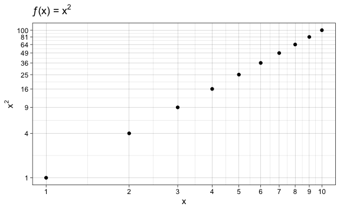

- **Question 15-f**: Create a function, PlotPower(), that allows you to
  create a plot of x against x<sup>a</sup> for a fixed a and for a range
  of values of x. For instance, if you call: “PlotPower(1:10, 3)” then a
  plot should be created with an x-axis taking on values 1, 2, . . . ,
  10, and a y-axis taking on values 1<sup>3</sup>, 2<sup>3</sup>, . . .
  , 10<sup>3</sup>.
  - **Answer**:

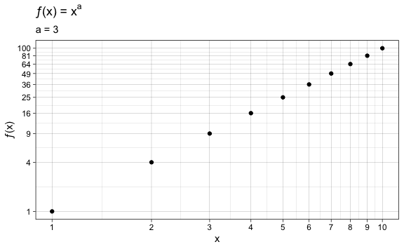

### Question 16:

Using the Boston data set, fit classification models in order to predict
whether a given census tract has a crime rate above or below the me-
dian. Explore logistic regression, LDA, naive Bayes, and KNN models
using various subsets of the predictors. Describe your findings.

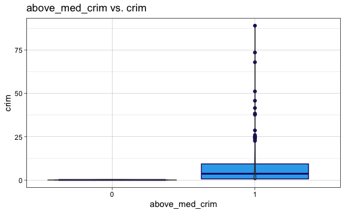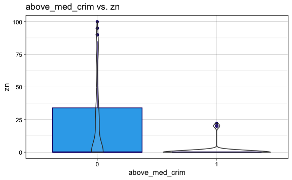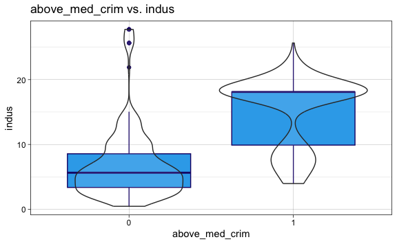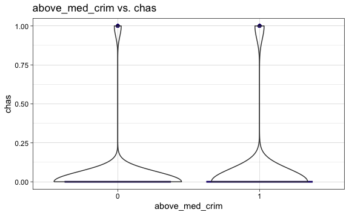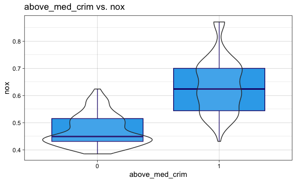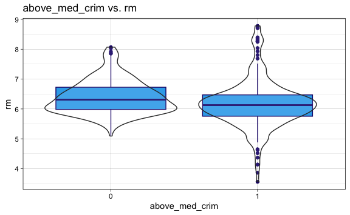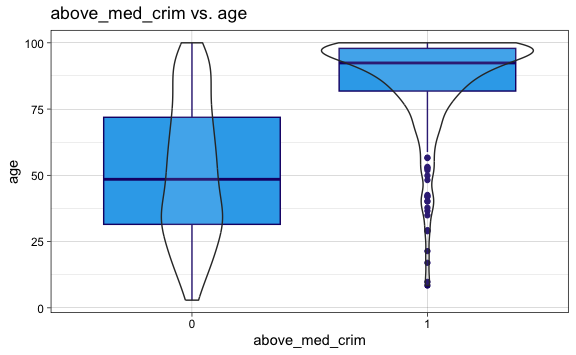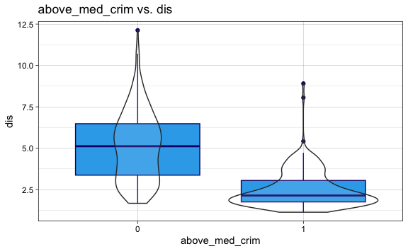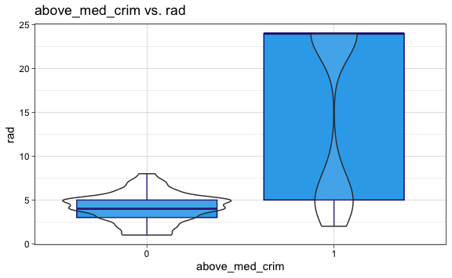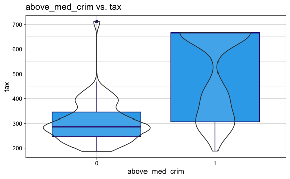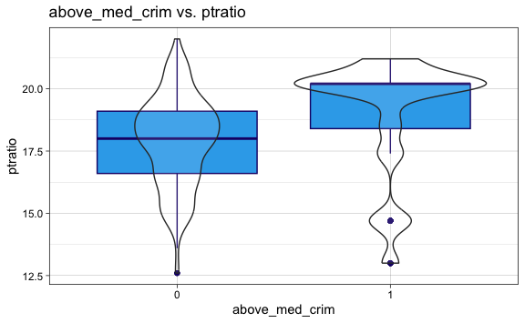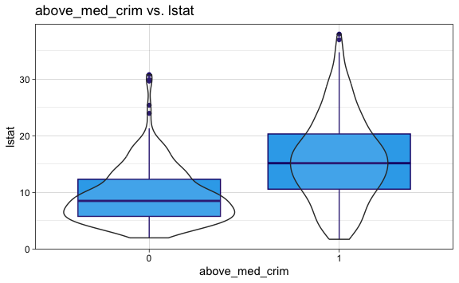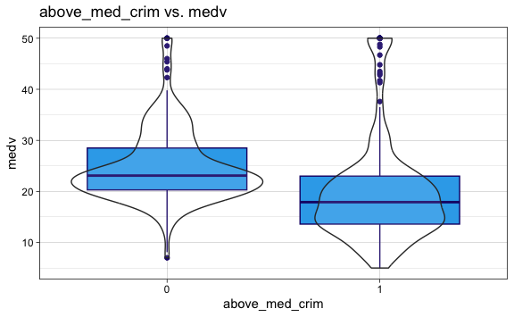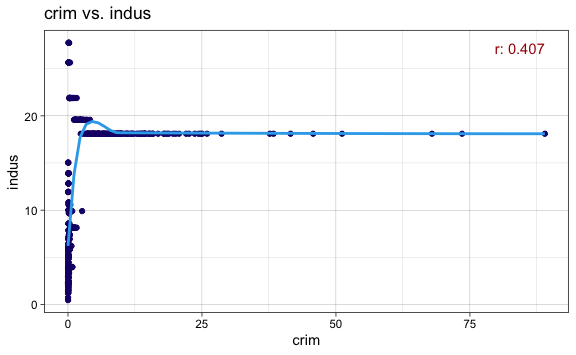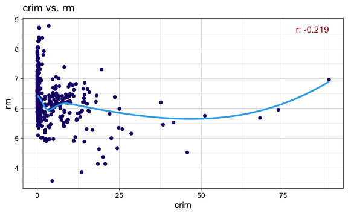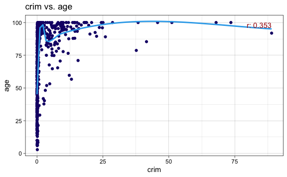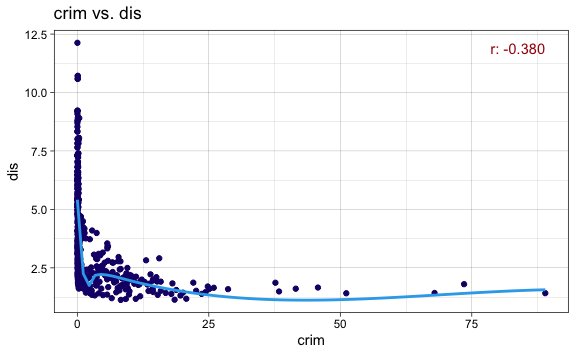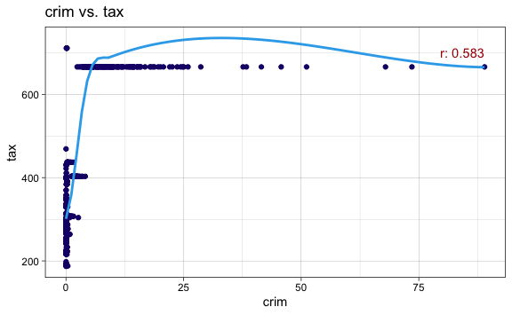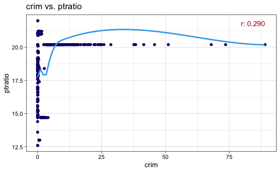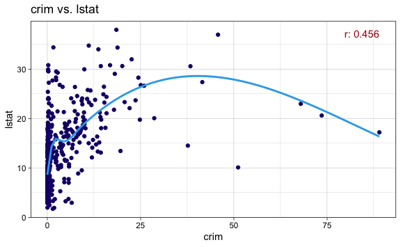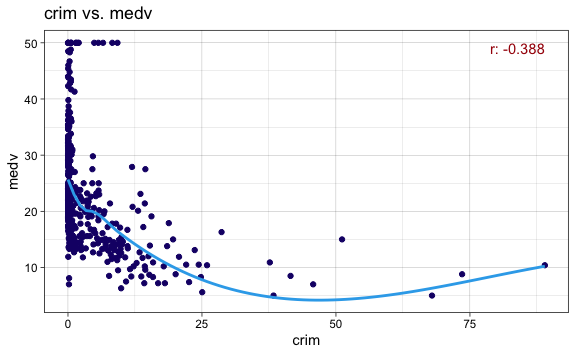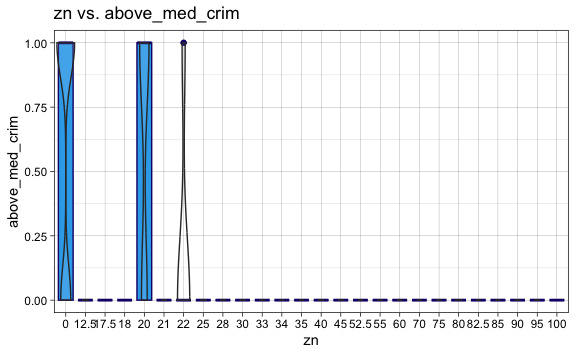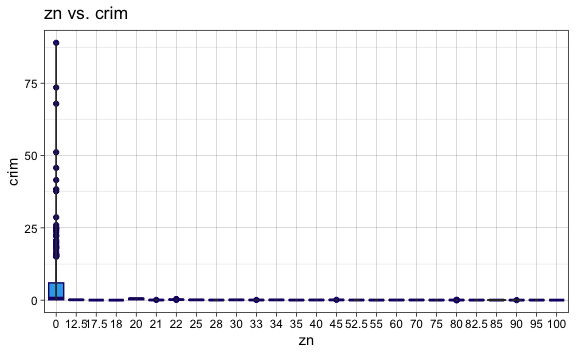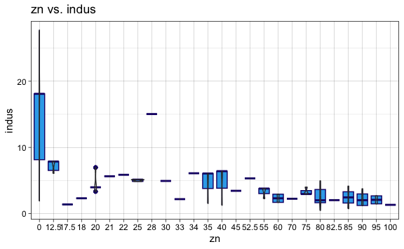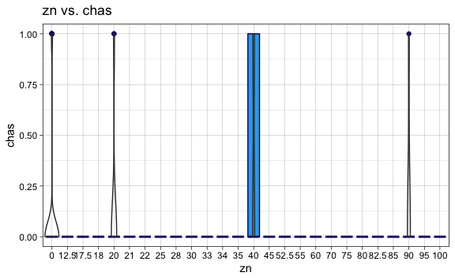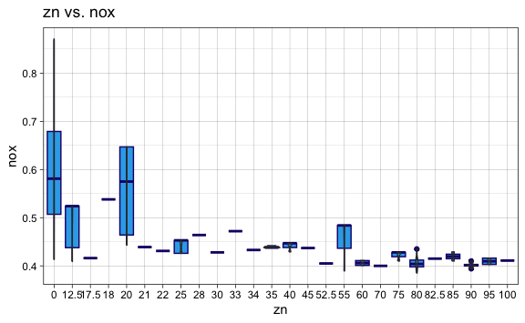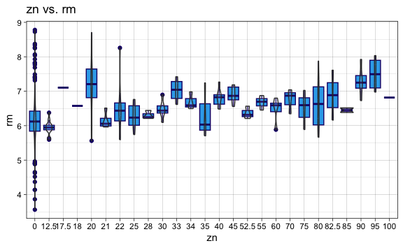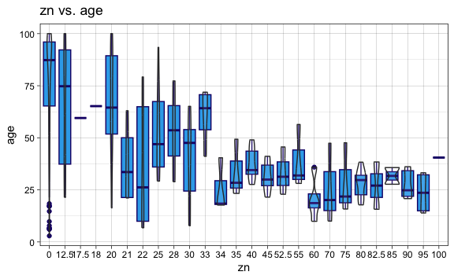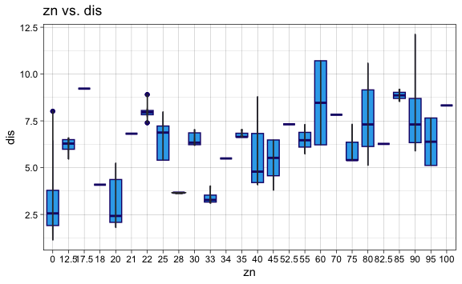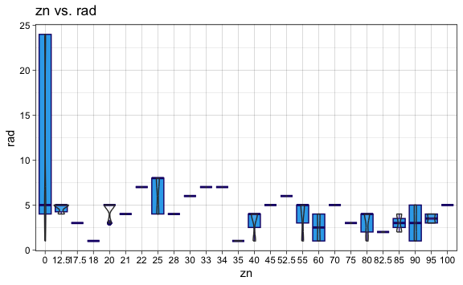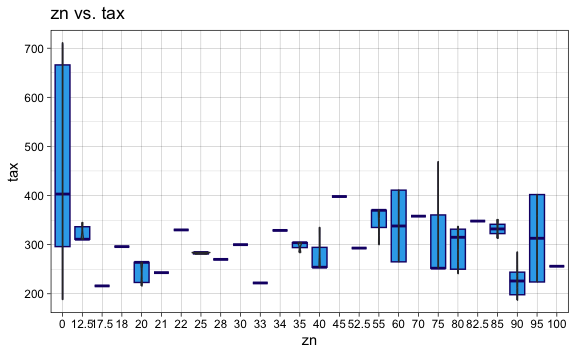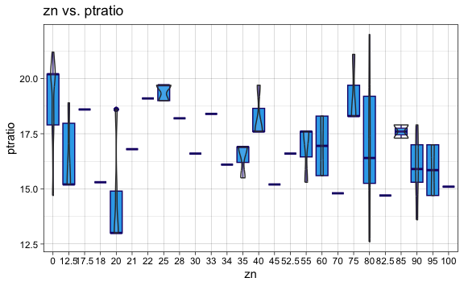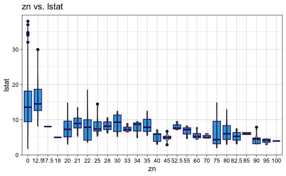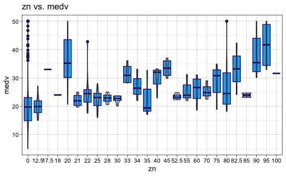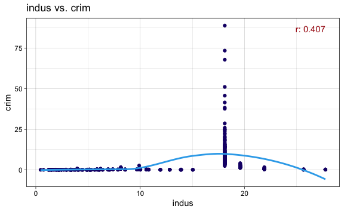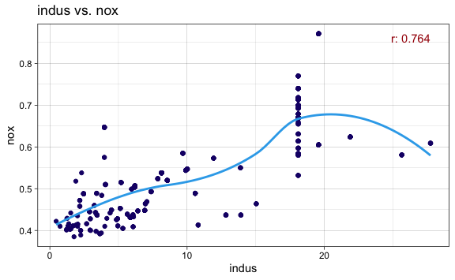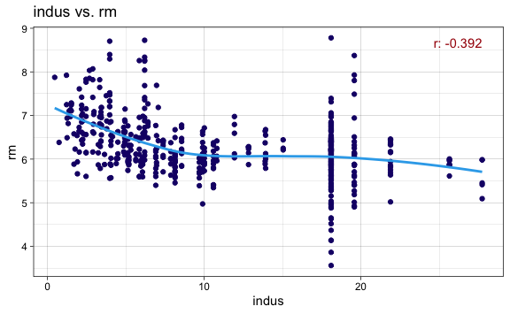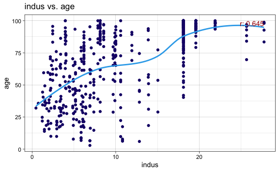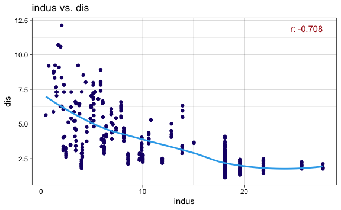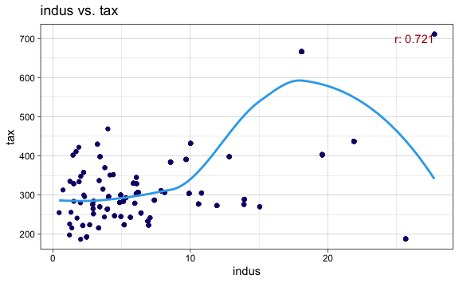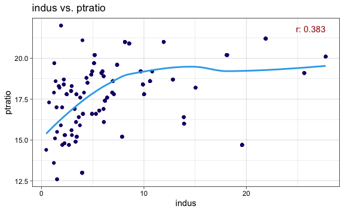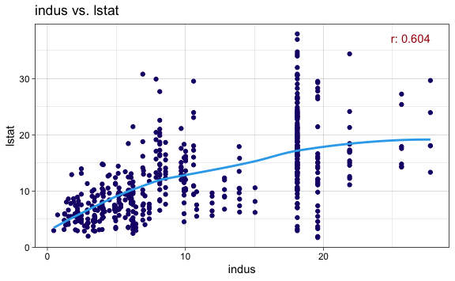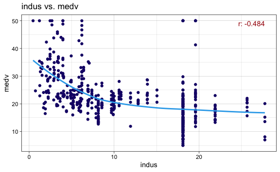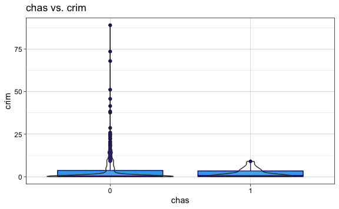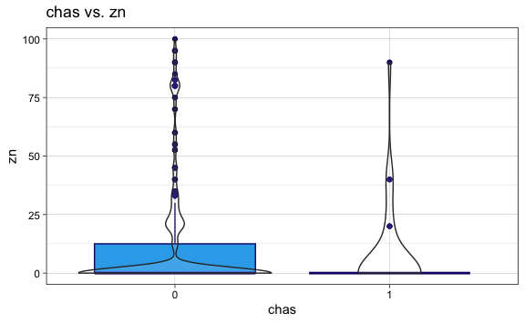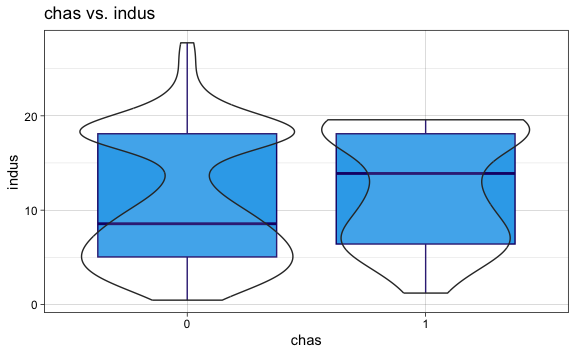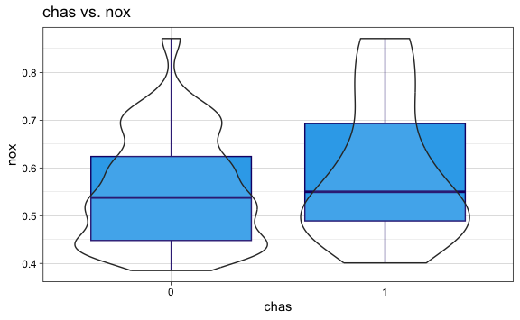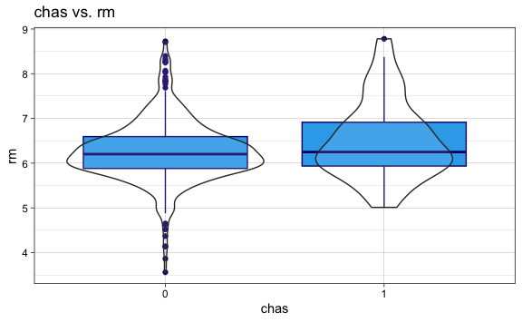

Logistic Regression

    Warning: glm.fit: algorithm did not converge

    Warning: glm.fit: fitted probabilities numerically 0 or 1 occurred

    Confusion Matrix and Statistics

              Reference
    Prediction  0  1
             0 51  0
             1  0 51
                                         
                   Accuracy : 1          
                     95% CI : (0.9645, 1)
        No Information Rate : 0.5        
        P-Value [Acc > NIR] : < 2.2e-16  
                                         
                      Kappa : 1          
                                         
     Mcnemar's Test P-Value : NA         
                                         
                Sensitivity : 1.0        
                Specificity : 1.0        
             Pos Pred Value : 1.0        
             Neg Pred Value : 1.0        
                 Prevalence : 0.5        
             Detection Rate : 0.5        
       Detection Prevalence : 0.5        
          Balanced Accuracy : 1.0        
                                         
           'Positive' Class : 0          
                                         

    The logistic regression model test error is: 0.000%.

LDA

    Confusion Matrix and Statistics

              Reference
    Prediction  0  1
             0 49 16
             1  2 35
                                              
                   Accuracy : 0.8235          
                     95% CI : (0.7355, 0.8919)
        No Information Rate : 0.5             
        P-Value [Acc > NIR] : 1.128e-11       
                                              
                      Kappa : 0.6471          
                                              
     Mcnemar's Test P-Value : 0.002183        
                                              
                Sensitivity : 0.9608          
                Specificity : 0.6863          
             Pos Pred Value : 0.7538          
             Neg Pred Value : 0.9459          
                 Prevalence : 0.5000          
             Detection Rate : 0.4804          
       Detection Prevalence : 0.6373          
          Balanced Accuracy : 0.8235          
                                              
           'Positive' Class : 0               
                                              

    The LDA model test error is: 17.647%.

Naive Bayes

    Confusion Matrix and Statistics

              Reference
    Prediction  0  1
             0 49  4
             1  2 47
                                              
                   Accuracy : 0.9412          
                     95% CI : (0.8764, 0.9781)
        No Information Rate : 0.5             
        P-Value [Acc > NIR] : <2e-16          
                                              
                      Kappa : 0.8824          
                                              
     Mcnemar's Test P-Value : 0.6831          
                                              
                Sensitivity : 0.9608          
                Specificity : 0.9216          
             Pos Pred Value : 0.9245          
             Neg Pred Value : 0.9592          
                 Prevalence : 0.5000          
             Detection Rate : 0.4804          
       Detection Prevalence : 0.5196          
          Balanced Accuracy : 0.9412          
                                              
           'Positive' Class : 0               
                                              

    The naive bayes model test error is: 5.882%.

KNN

    Confusion Matrix and Statistics

              Reference
    Prediction  0  1
             0 42  1
             1  9 50
                                             
                   Accuracy : 0.902          
                     95% CI : (0.8271, 0.952)
        No Information Rate : 0.5            
        P-Value [Acc > NIR] : < 2e-16        
                                             
                      Kappa : 0.8039         
                                             
     Mcnemar's Test P-Value : 0.02686        
                                             
                Sensitivity : 0.8235         
                Specificity : 0.9804         
             Pos Pred Value : 0.9767         
             Neg Pred Value : 0.8475         
                 Prevalence : 0.5000         
             Detection Rate : 0.4118         
       Detection Prevalence : 0.4216         
          Balanced Accuracy : 0.9020         
                                             
           'Positive' Class : 0              
                                             

    The KNN model test error for k = 1 is: 9.804%.

    Confusion Matrix and Statistics

              Reference
    Prediction  0  1
             0 47  2
             1  4 49
                                              
                   Accuracy : 0.9412          
                     95% CI : (0.8764, 0.9781)
        No Information Rate : 0.5             
        P-Value [Acc > NIR] : <2e-16          
                                              
                      Kappa : 0.8824          
                                              
     Mcnemar's Test P-Value : 0.6831          
                                              
                Sensitivity : 0.9216          
                Specificity : 0.9608          
             Pos Pred Value : 0.9592          
             Neg Pred Value : 0.9245          
                 Prevalence : 0.5000          
             Detection Rate : 0.4608          
       Detection Prevalence : 0.4804          
          Balanced Accuracy : 0.9412          
                                              
           'Positive' Class : 0               
                                              

    The KNN model test error for k = 3 is: 5.882%.

    Confusion Matrix and Statistics

              Reference
    Prediction  0  1
             0 47  3
             1  4 48
                                             
                   Accuracy : 0.9314         
                     95% CI : (0.8637, 0.972)
        No Information Rate : 0.5            
        P-Value [Acc > NIR] : <2e-16         
                                             
                      Kappa : 0.8627         
                                             
     Mcnemar's Test P-Value : 1              
                                             
                Sensitivity : 0.9216         
                Specificity : 0.9412         
             Pos Pred Value : 0.9400         
             Neg Pred Value : 0.9231         
                 Prevalence : 0.5000         
             Detection Rate : 0.4608         
       Detection Prevalence : 0.4902         
          Balanced Accuracy : 0.9314         
                                             
           'Positive' Class : 0              
                                             

    The KNN model test error for k = 5 is: 6.863%.

    Confusion Matrix and Statistics

              Reference
    Prediction  0  1
             0 48  4
             1  3 47
                                             
                   Accuracy : 0.9314         
                     95% CI : (0.8637, 0.972)
        No Information Rate : 0.5            
        P-Value [Acc > NIR] : <2e-16         
                                             
                      Kappa : 0.8627         
                                             
     Mcnemar's Test P-Value : 1              
                                             
                Sensitivity : 0.9412         
                Specificity : 0.9216         
             Pos Pred Value : 0.9231         
             Neg Pred Value : 0.9400         
                 Prevalence : 0.5000         
             Detection Rate : 0.4706         
       Detection Prevalence : 0.5098         
          Balanced Accuracy : 0.9314         
                                             
           'Positive' Class : 0              
                                             

    The KNN model test error for k = 7 is: 6.863%.

    Confusion Matrix and Statistics

              Reference
    Prediction  0  1
             0 47  5
             1  4 46
                                              
                   Accuracy : 0.9118          
                     95% CI : (0.8391, 0.9589)
        No Information Rate : 0.5             
        P-Value [Acc > NIR] : <2e-16          
                                              
                      Kappa : 0.8235          
                                              
     Mcnemar's Test P-Value : 1               
                                              
                Sensitivity : 0.9216          
                Specificity : 0.9020          
             Pos Pred Value : 0.9038          
             Neg Pred Value : 0.9200          
                 Prevalence : 0.5000          
             Detection Rate : 0.4608          
       Detection Prevalence : 0.5098          
          Balanced Accuracy : 0.9118          
                                              
           'Positive' Class : 0               
                                              

    The KNN model test error for k = 9 is: 8.824%.

    Confusion Matrix and Statistics

              Reference
    Prediction  0  1
             0 45  7
             1  6 44
                                              
                   Accuracy : 0.8725          
                     95% CI : (0.7919, 0.9304)
        No Information Rate : 0.5             
        P-Value [Acc > NIR] : 2.151e-15       
                                              
                      Kappa : 0.7451          
                                              
     Mcnemar's Test P-Value : 1               
                                              
                Sensitivity : 0.8824          
                Specificity : 0.8627          
             Pos Pred Value : 0.8654          
             Neg Pred Value : 0.8800          
                 Prevalence : 0.5000          
             Detection Rate : 0.4412          
       Detection Prevalence : 0.5098          
          Balanced Accuracy : 0.8725          
                                              
           'Positive' Class : 0               
                                              

    The KNN model test error for k = 10 is: 12.745%.

    Confusion Matrix and Statistics

              Reference
    Prediction  0  1
             0 45  7
             1  6 44
                                              
                   Accuracy : 0.8725          
                     95% CI : (0.7919, 0.9304)
        No Information Rate : 0.5             
        P-Value [Acc > NIR] : 2.151e-15       
                                              
                      Kappa : 0.7451          
                                              
     Mcnemar's Test P-Value : 1               
                                              
                Sensitivity : 0.8824          
                Specificity : 0.8627          
             Pos Pred Value : 0.8654          
             Neg Pred Value : 0.8800          
                 Prevalence : 0.5000          
             Detection Rate : 0.4412          
       Detection Prevalence : 0.5098          
          Balanced Accuracy : 0.8725          
                                              
           'Positive' Class : 0               
                                              

    The KNN model test error for k = 11 is: 12.745%.

    Confusion Matrix and Statistics

              Reference
    Prediction  0  1
             0 45  5
             1  6 46
                                              
                   Accuracy : 0.8922          
                     95% CI : (0.8152, 0.9449)
        No Information Rate : 0.5             
        P-Value [Acc > NIR] : <2e-16          
                                              
                      Kappa : 0.7843          
                                              
     Mcnemar's Test P-Value : 1               
                                              
                Sensitivity : 0.8824          
                Specificity : 0.9020          
             Pos Pred Value : 0.9000          
             Neg Pred Value : 0.8846          
                 Prevalence : 0.5000          
             Detection Rate : 0.4412          
       Detection Prevalence : 0.4902          
          Balanced Accuracy : 0.8922          
                                              
           'Positive' Class : 0               
                                              

    The KNN model test error for k = 12 is: 10.784%.

    Confusion Matrix and Statistics

              Reference
    Prediction  0  1
             0 44  8
             1  7 43
                                              
                   Accuracy : 0.8529          
                     95% CI : (0.7691, 0.9153)
        No Information Rate : 0.5             
        P-Value [Acc > NIR] : 8.267e-14       
                                              
                      Kappa : 0.7059          
                                              
     Mcnemar's Test P-Value : 1               
                                              
                Sensitivity : 0.8627          
                Specificity : 0.8431          
             Pos Pred Value : 0.8462          
             Neg Pred Value : 0.8600          
                 Prevalence : 0.5000          
             Detection Rate : 0.4314          
       Detection Prevalence : 0.5098          
          Balanced Accuracy : 0.8529          
                                              
           'Positive' Class : 0               
                                              

    The KNN model test error for k = 13 is: 14.706%.

    Formula: Direction ~

    nox indus age dis rad tax

    Logistic Regression Model:


    Confusion Matrix and Statistics

              Reference
    Prediction  0  1
             0 45  9
             1  6 42
                                              
                   Accuracy : 0.8529          
                     95% CI : (0.7691, 0.9153)
        No Information Rate : 0.5             
        P-Value [Acc > NIR] : 8.267e-14       
                                              
                      Kappa : 0.7059          
                                              
     Mcnemar's Test P-Value : 0.6056          
                                              
                Sensitivity : 0.8824          
                Specificity : 0.8235          
             Pos Pred Value : 0.8333          
             Neg Pred Value : 0.8750          
                 Prevalence : 0.5000          
             Detection Rate : 0.4412          
       Detection Prevalence : 0.5294          
          Balanced Accuracy : 0.8529          
                                              
           'Positive' Class : 0               
                                              
    The logistic regression model test error is: 14.706%.


    Linear Discriminant Analysis Model:


    Confusion Matrix and Statistics

              Reference
    Prediction  0  1
             0 49 16
             1  2 35
                                              
                   Accuracy : 0.8235          
                     95% CI : (0.7355, 0.8919)
        No Information Rate : 0.5             
        P-Value [Acc > NIR] : 1.128e-11       
                                              
                      Kappa : 0.6471          
                                              
     Mcnemar's Test P-Value : 0.002183        
                                              
                Sensitivity : 0.9608          
                Specificity : 0.6863          
             Pos Pred Value : 0.7538          
             Neg Pred Value : 0.9459          
                 Prevalence : 0.5000          
             Detection Rate : 0.4804          
       Detection Prevalence : 0.6373          
          Balanced Accuracy : 0.8235          
                                              
           'Positive' Class : 0               
                                              
    The LDA model test error is: 17.647%.


    Naive Bayes Model:


    Confusion Matrix and Statistics

              Reference
    Prediction  0  1
             0 49  4
             1  2 47
                                              
                   Accuracy : 0.9412          
                     95% CI : (0.8764, 0.9781)
        No Information Rate : 0.5             
        P-Value [Acc > NIR] : <2e-16          
                                              
                      Kappa : 0.8824          
                                              
     Mcnemar's Test P-Value : 0.6831          
                                              
                Sensitivity : 0.9608          
                Specificity : 0.9216          
             Pos Pred Value : 0.9245          
             Neg Pred Value : 0.9592          
                 Prevalence : 0.5000          
             Detection Rate : 0.4804          
       Detection Prevalence : 0.5196          
          Balanced Accuracy : 0.9412          
                                              
           'Positive' Class : 0               
                                              
    The naive bayes model test error is: 5.882%.


    K-Nearest Neighbors Model:


    Confusion Matrix and Statistics

              Reference
    Prediction  0  1
             0 45  2
             1  6 49
                                              
                   Accuracy : 0.9216          
                     95% CI : (0.8513, 0.9655)
        No Information Rate : 0.5             
        P-Value [Acc > NIR] : <2e-16          
                                              
                      Kappa : 0.8431          
                                              
     Mcnemar's Test P-Value : 0.2888          
                                              
                Sensitivity : 0.8824          
                Specificity : 0.9608          
             Pos Pred Value : 0.9574          
             Neg Pred Value : 0.8909          
                 Prevalence : 0.5000          
             Detection Rate : 0.4412          
       Detection Prevalence : 0.4608          
          Balanced Accuracy : 0.9216          
                                              
           'Positive' Class : 0               
                                              
    The KNN model's minimum test error for which k = 3 is: 5.882%.


    Quadratic Discriminant Analysis Model:


    Confusion Matrix and Statistics

              Reference
    Prediction  0  1
             0 49  9
             1  2 42
                                              
                   Accuracy : 0.8922          
                     95% CI : (0.8152, 0.9449)
        No Information Rate : 0.5             
        P-Value [Acc > NIR] : < 2e-16         
                                              
                      Kappa : 0.7843          
                                              
     Mcnemar's Test P-Value : 0.07044         
                                              
                Sensitivity : 0.9608          
                Specificity : 0.8235          
             Pos Pred Value : 0.8448          
             Neg Pred Value : 0.9545          
                 Prevalence : 0.5000          
             Detection Rate : 0.4804          
       Detection Prevalence : 0.5686          
          Balanced Accuracy : 0.8922          
                                              
           'Positive' Class : 0               
                                              
    The QDA model test error is: 10.784%.
