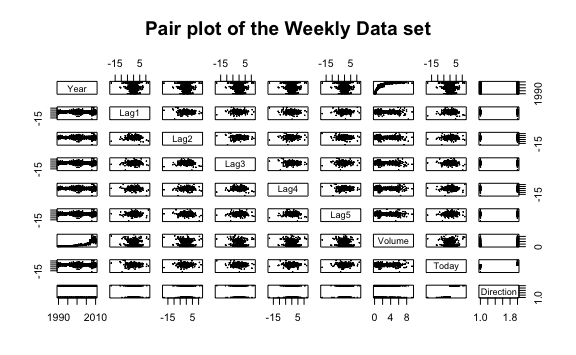

Lab 4 Classification Exercises
================
Evan Woods
2023-12-09

# Lab 4 Classification Exercises

## Applied

### Question 13:

This question should be answered using the weekly data set, which is
part of the ISLR2 package. This data is similar in nature to the Smarket
data from this chapter’s lab, except that it contains 1,089 weekly
returns for 21 years, from the beginning of 1990 to the end of 2010.

- **Question 13-a**: Produce some numerical and graphical summaries of
  the Weekly data. Do there appear to be any patterns?
  - **Answer**:

    There appears to be a logrithmic relationship between Year & Volume. The data
    appears otherwise to have no discernable patterns.

- **Question 13-b**: Use the full data set to perform a logistic
  regression with Direction as the response and the five lag variables
  plus Volume as predictors. Use the summary function to print the
  results. Do any of the predictors appear to be statistically
  significant? If so, which ones?
  - **Answer**:

<!-- -->

    Call:
    glm(formula = Direction ~ Lag1 + Lag2 + Lag3 + Lag4 + Lag5 + 
        Volume, family = binomial, data = weekly)

    Coefficients:
                Estimate Std. Error z value Pr(>|z|)   
    (Intercept)  0.26686    0.08593   3.106   0.0019 **
    Lag1        -0.04127    0.02641  -1.563   0.1181   
    Lag2         0.05844    0.02686   2.175   0.0296 * 
    Lag3        -0.01606    0.02666  -0.602   0.5469   
    Lag4        -0.02779    0.02646  -1.050   0.2937   
    Lag5        -0.01447    0.02638  -0.549   0.5833   
    Volume      -0.02274    0.03690  -0.616   0.5377   
    ---
    Signif. codes:  0 '***' 0.001 '**' 0.01 '*' 0.05 '.' 0.1 ' ' 1

    (Dispersion parameter for binomial family taken to be 1)

        Null deviance: 1496.2  on 1088  degrees of freedom
    Residual deviance: 1486.4  on 1082  degrees of freedom
    AIC: 1500.4

    Number of Fisher Scoring iterations: 4

    Only Lag2 appears to be statistically significant given a p-value of 0.0296.

- **Question 13-c**: Compute the confusion matrix and overall fraction
  of correct predictions. Explain what the confusion matrix is telling
  you about the types of mistakes made by logistic regression.
  - **Answer**:

<!-- -->

            Direction
    glm.pred Down  Up
        Down   54  48
        Up    430 557

    Among the training set, there is an average training error of 43.89%. The model
    gave correct responses on average 56.11% of the time. The model predicted made
    false positive predictions of an Upwards direction when the true direction
    was Down 430 times. The model made false negative predictions of the Downwards
    direction when the true direction was Up 48 times.

- **Question 13-d**: Now fit the logistic regression model using a
  training data period from 1990 to 2008 with Lag2 as the only
  predictor. Compute the confusion matrix and the overall fraction of
  correct predictions for the held out data (that is, the data from 2009
  and 2010).
  - **Answer**:

<!-- -->

                     test.Y
    glm.fit_2008_pred Down Up
                 Down    9  5
                 Up     34 56

    The overall fraction of correct predictions for the held out data is 62.50%.
