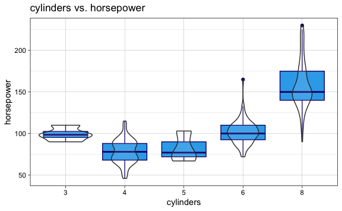
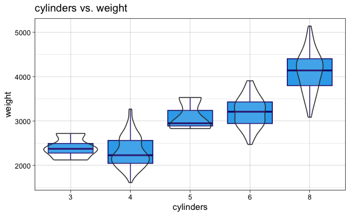
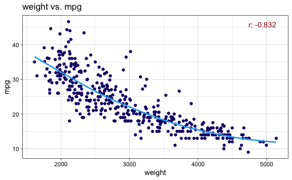

Lab 4 Classification Exercises
================
Evan Woods
2023-12-11

``` r
# Purpose: This method will accept a list of methods to be run, a formula to use consistently across the methods, training & testing data, and will output confusion matrices along with the minimum test error for each type of function. This function anticipates a response that is either 0 or 1. It anticipates that the data has already been split into training and test sets.
# Inputs: 
# enable_knn: Enables the knn method. The response and predictors are required for this method to create training and testing data for the knn function.
# predictors: This is a collection of predictors that are used when creating knn training sets.
# response: This is the response to be selected from the data when creating knn test sets.
# Output: This function will output confusion matrices and test error for each method specified. 

create_categorical_models <- function(methods_c, formula, train_x=NULL, test_x=NULL, train_y=NULL, test_y=NULL, enable_knn=NULL, response=NULL, predictors=NULL) {
  min_error <- c()
  error_func <- c()
  for (i in seq_along(methods_c)){
    if (identical(methods_c[[i]], "glm")){
      f_print(sprintf("Logistic Regression Model:"))
      cat("\n\n\n")
      glm.fit <- glm(formula, data = train_x, family = "binomial")
      glm.fit_prob <- predict(glm.fit, test_x, type = "response")
      glm.fit_pred <- rep(0, length(glm.fit_prob))
      glm.fit_pred[glm.fit_prob > .5] <- 1
      print(confusionMatrix(as.factor(glm.fit_pred), as.factor(test_y[[1]])))
      f_print(sprintf("The logistic regression model test error is: %0.3f%%.",(mean(glm.fit_pred != test_y[[1]]) * 100)))
      cat("\n\n\n")
      min_error<- append(min_error,mean(glm.fit_pred != test_y[[1]]))
      error_func <- append(error_func, "glm")
    } 
    if(identical(methods_c[[i]], "lda")) {
      f_print(sprintf("Linear Discriminant Analysis Model:"))
      cat("\n\n\n")
        lda.fit <- lda(formula, data = train_x)
        lda.fit_pred <- predict(lda.fit, test_x)
        print(confusionMatrix(lda.fit_pred$class, as.factor(test_y[[1]])))
        f_print(sprintf("The LDA model test error is: %0.3f%%.",(mean(lda.fit_pred$class != test_y[[1]]) * 100)))
        cat("\n\n\n")
    }
    if(identical(methods_c[[i]], "qda")) {
      f_print(sprintf("Quadratic Discriminant Analysis Model:"))
      cat("\n\n\n")
        qda.fit <- qda(formula, data = train_x)
        qda.fit_pred <- predict(qda.fit, test_x)
        print(confusionMatrix(qda.fit_pred$class, as.factor(test_y[[1]])))
        f_print(sprintf("The QDA model test error is: %0.3f%%.",(mean(qda.fit_pred$class != test_y[[1]]) * 100)))
        cat("\n\n\n")
    }
    if(identical(methods_c[[i]], "nb")) {
      f_print(sprintf("Naive Bayes Model:"))
      cat("\n\n\n")
      nb.fit <- naiveBayes(above_med_crim ~ crim + nox + indus + age + dis + rad + tax, data = train_x)
      nb.fit_pred <- predict(nb.fit, test_x)
      print(confusionMatrix(nb.fit_pred, as.factor(test_y[[1]])))
      f_print(sprintf("The naive bayes model test error is: %0.3f%%.",(mean(nb.fit_pred != test_y[[1]]) * 100)))
      cat("\n\n\n")
    }
    if(identical(methods_c[[i]], "knn")) {
      set.seed(42)
      f_print(sprintf("K-Nearest Neighbors Model:"))
      cat("\n\n\n")
      knn_train_x <- train_x %>% select(predictors)
      knn_test_x <- test_x %>% select(predictors)
      knn_train_y <- train_y %>% select(response)
      knn_test_y <- test_y %>% select(response)
      
      k_val <- 1
      
      knn.fit <- knn(knn_train_x, knn_test_x, knn_train_y[[1]], k = k_val)
      penultimate_mean_test_error <- mean(knn.fit != knn_test_y[[1]])
      ultimate_mean_test_error <- 0
      
      if(!near(penultimate_mean_test_error - ultimate_mean_test_error, 0)){
        while (TRUE){
          k_val <- k_val + 1
          knn.fit <- knn(knn_train_x, knn_test_x, knn_train_y[[1]], k = k_val)
          ultimate_mean_test_error <- mean(knn.fit != knn_test_y[[1]])
          print(sprintf("pen: %0.3f", penultimate_mean_test_error))
          print(sprintf("ult: %0.3f", ultimate_mean_test_error))
          if (ultimate_mean_test_error < penultimate_mean_test_error) {
            penultimate_mean_test_error <- ultimate_mean_test_error
          } else {
            break
          }
          penultimate_mean_test_error <- mean(knn.fit != knn_test_y[[1]])
        }   
      }
      
      print(confusionMatrix(knn.fit, as.factor(knn_test_y[[1]])))
      f_print(sprintf("The KNN model's minimum test error for which k = %s is: %0.3f%%.", k_val-1, penultimate_mean_test_error * 100))
      cat("\n\n\n")
    }
  }
}
```

## Applied

### Question 13:

This question should be answered using the weekly data set, which is
part of the ISLR2 package. This data is similar in nature to the Smarket
data from this chapter’s lab, except that it contains 1,089 weekly
returns for 21 years, from the beginning of 1990 to the end of 2010.

- **Question 13-a**: Produce some numerical and graphical summaries of
  the Weekly data. Do there appear to be any patterns?
  - **Answer**:


    There appears to be a logrithmic relationship between Year & Volume. The data
    appears otherwise to have no discernable patterns.

- **Question 13-b**: Use the full data set to perform a logistic
  regression with Direction as the response and the five lag variables
  plus Volume as predictors. Use the summary function to print the
  results. Do any of the predictors appear to be statistically
  significant? If so, which ones?
  - **Answer**:

<!-- -->


    Call:
    glm(formula = Direction ~ Lag1 + Lag2 + Lag3 + Lag4 + Lag5 + 
        Volume, family = binomial, data = weekly)

    Coefficients:
                Estimate Std. Error z value Pr(>|z|)   
    (Intercept)  0.26686    0.08593   3.106   0.0019 **
    Lag1        -0.04127    0.02641  -1.563   0.1181   
    Lag2         0.05844    0.02686   2.175   0.0296 * 
    Lag3        -0.01606    0.02666  -0.602   0.5469   
    Lag4        -0.02779    0.02646  -1.050   0.2937   
    Lag5        -0.01447    0.02638  -0.549   0.5833   
    Volume      -0.02274    0.03690  -0.616   0.5377   
    ---
    Signif. codes:  0 '***' 0.001 '**' 0.01 '*' 0.05 '.' 0.1 ' ' 1

    (Dispersion parameter for binomial family taken to be 1)

        Null deviance: 1496.2  on 1088  degrees of freedom
    Residual deviance: 1486.4  on 1082  degrees of freedom
    AIC: 1500.4

    Number of Fisher Scoring iterations: 4

    Only Lag2 appears to be statistically significant given a p-value of 0.0296.

- **Question 13-c**: Compute the confusion matrix and overall fraction
  of correct predictions. Explain what the confusion matrix is telling
  you about the types of mistakes made by logistic regression.
  - **Answer**:

<!-- -->

            Direction
    glm.pred Down  Up
        Down   54  48
        Up    430 557

    Among the training set, there is an average training error of 43.89%. The model
    gave correct responses on average 56.11% of the time. The model predicted made
    false positive predictions of an Upwards direction when the true direction
    was Down 430 times. The model made false negative predictions of the Downwards
    direction when the true direction was Up 48 times.

- **Question 13-d**: Now fit the logistic regression model using a
  training data period from 1990 to 2008 with Lag2 as the only
  predictor. Compute the confusion matrix and the overall fraction of
  correct predictions for the held out data (that is, the data from 2009
  and 2010).
  - **Answer**:

<!-- -->

                     test.Y
    glm.fit_2008_pred Down Up
                 Down    9  5
                 Up     34 56

    The overall fraction of correct predictions for the test set is 62.50%.

- **Question 13-e**: Now fit a model using linear discriminant analysis
  and a training data period from 1990 to 2008 with Lag2 as the only
  predictor. Compute the confusion matrix and the overall fraction of
  correct predictions for the held out data (that is, the data from 2009
  and 2010).
  - **Answer**:

<!-- -->

          test.Y
           Down Up
      Down    9  5
      Up     34 56

    The overall fraction of correct predictions for the test set is 62.50%.

- **Question 13-f**: Now fit a model using quadratic discriminant
  analysis and a training data period from 1990 to 2008 with Lag2 as the
  only predictor. Compute the confusion matrix and the overall fraction
  of correct predictions for the held out data (that is, the data from
  2009 and 2010).
  - **Answer**:

<!-- -->

          test.Y
           Down Up
      Down    0  0
      Up     43 61
    The overall fraction of correct predictions for the test set is 58.65%.

- **Question 13-g**: Now fit a model using knn and a training data
  period from 1990 to 2008 with Lag2 as the only predictor. Compute the
  confusion matrix and the overall fraction of correct predictions for
  the held out data (that is, the data from 2009 and 2010).
  - **Answer**:

<!-- -->

           
    knn.fit Down Up
       Down   21 30
       Up     22 31

    The overall fraction of correct predictions for the test set is 0.50%.

- **Question 13-h**: Now fit a model using naive bayes and a training
  data period from 1990 to 2008 with Lag2 as the only predictor. Compute
  the confusion matrix and the overall fraction of correct predictions
  for the held out data (that is, the data from 2009 and 2010).
  - **Answer**:

<!-- -->

           test.Y
    nb.pred Down Up
       Down    0  0
       Up     43 61

- **Question 13-i**: Which of these methods appears to provide the best
  results on this data?
- **Answer**:

<!-- -->

    The linear discriminant analysis and the logistic model both provide the best
    results on this data. Their accuracies are highest amongst all the methods at
    62.5%.

- **Question 13-j**: Experiment with different combinations of
  predictors, includ- ing possible transformations and interactions, for
  each of the methods. Report the variables, method, and associated
  confu- sion matrix that appears to provide the best results on the
  held out data. Note that you should also experiment with values for K
  in the KNN classifier.

  - **Answer**:

<!-- -->

    The model with the highest accuracy was KNN Model 3 where k = 3. This model
    has 100% accuracy and is composed of Direction regressed onto Today. This
    is not a useful model however. Today is the percentage return for this week,
    and Direction is a factor indicating whether the market had a positive or
    negative return for the week. The response Direction and the predictor Today
    are semantically the same. The model with the highest accuracy that was not
    composed of Today in any inclusion or interaction was LDA Model 6. LDA Model 6
    consumed a formula of Direction regressed onto Lag2 and yielded 62.5% accuracy.
    Furthermore, it is interesting to note that the log transformation of Volume
    increased the model performance by 10% in models where Direction was regressed
    onto Volume exclusively. However, models which implement interactions with all
    predictors, include all predictors individualy, and include a log transformation
    of Volume perform much worse at 39.42%.

Quadratic Discriminant Analysis

    QDA Model 1:

    Formula:
    Direction ~ Year + Lag1 + Lag3 + Lag5 + Year * Lag1 + Lag1 * 
        Lag3 + Lag3 * Lag5
    <environment: 0x1639225c0>


    Call:
    qda(formula_master_list[[i]], data = weekly, subset = train)

    Prior probabilities of groups:
         Down        Up 
    0.4477157 0.5522843 

    Group means:
             Year         Lag1       Lag3       Lag5 Year:Lag1    Lag1:Lag3
    Down 1999.295  0.289444444 0.17080045 0.21409297 578.19599 -0.006554329
    Up   1998.853 -0.009213235 0.08404044 0.04548897 -19.47546  0.687742739
         Lag3:Lag5
    Down 0.4913572
    Up   0.3137873

    Confusion Matrix:
          test.Y
           Down Up
      Down   27 39
      Up     16 22
    The overall fraction of correct predictions for the test set is 47.12%.


    QDA Model 2:

    Formula:
    Direction ~ Year + Lag2 + Lag4 + Year * Lag2 + Lag2 * Lag4
    <environment: 0x12fcf4940>


    Call:
    qda(formula_master_list[[i]], data = weekly, subset = train)

    Prior probabilities of groups:
         Down        Up 
    0.4477157 0.5522843 

    Group means:
             Year        Lag2       Lag4 Year:Lag2  Lag2:Lag4
    Down 1999.295 -0.03568254 0.15925624 -72.78371 0.78824608
    Up   1998.853  0.26036581 0.09220956 520.28269 0.04407141

    Confusion Matrix:
          test.Y
           Down Up
      Down   24 32
      Up     19 29
    The overall fraction of correct predictions for the test set is 50.96%.


    QDA Model 3:

    Formula:
    Direction ~ Lag1 + Volume + Lag2 + Lag3 + Lag4 + Lag5 + Lag1 * 
        Volume + Lag2 * Volume + Lag3 * Volume + Lag4 * Volume + 
        Lag5 * Volume
    <environment: 0x12f353600>


    Call:
    qda(formula_master_list[[i]], data = weekly, subset = train)

    Prior probabilities of groups:
         Down        Up 
    0.4477157 0.5522843 

    Group means:
                 Lag1   Volume        Lag2       Lag3       Lag4       Lag5
    Down  0.289444444 1.266966 -0.03568254 0.17080045 0.15925624 0.21409297
    Up   -0.009213235 1.156529  0.26036581 0.08404044 0.09220956 0.04548897
         Lag1:Volume Volume:Lag2 Volume:Lag3 Volume:Lag4 Volume:Lag5
    Down   0.3362336 -0.70124208  -0.1417243  -0.2257271  -0.2323645
    Up    -0.6187543  0.06257301  -0.2956207  -0.1677342  -0.1401411

    Confusion Matrix:
          test.Y
           Down Up
      Down   31 46
      Up     12 15
    The overall fraction of correct predictions for the test set is 44.23%.


    QDA Model 4:

    Formula:
    Direction ~ Year
    <environment: 0x14ce9abf0>


    Call:
    qda(formula_master_list[[i]], data = weekly, subset = train)

    Prior probabilities of groups:
         Down        Up 
    0.4477157 0.5522843 

    Group means:
             Year
    Down 1999.295
    Up   1998.853

    Confusion Matrix:
          test.Y
           Down Up
      Down   20 32
      Up     23 29
    The overall fraction of correct predictions for the test set is 47.12%.


    QDA Model 5:

    Formula:
    Direction ~ Lag1
    <environment: 0x14cee73d0>


    Call:
    qda(formula_master_list[[i]], data = weekly, subset = train)

    Prior probabilities of groups:
         Down        Up 
    0.4477157 0.5522843 

    Group means:
                 Lag1
    Down  0.289444444
    Up   -0.009213235

    Confusion Matrix:
          test.Y
           Down Up
      Down    0  0
      Up     43 61
    The overall fraction of correct predictions for the test set is 58.65%.


    QDA Model 6:

    Formula:
    Direction ~ Lag2
    <environment: 0x14cefe368>


    Call:
    qda(formula_master_list[[i]], data = weekly, subset = train)

    Prior probabilities of groups:
         Down        Up 
    0.4477157 0.5522843 

    Group means:
                Lag2
    Down -0.03568254
    Up    0.26036581

    Confusion Matrix:
          test.Y
           Down Up
      Down    0  0
      Up     43 61
    The overall fraction of correct predictions for the test set is 58.65%.


    QDA Model 7:

    Formula:
    Direction ~ Lag3
    <environment: 0x14cf1b210>


    Call:
    qda(formula_master_list[[i]], data = weekly, subset = train)

    Prior probabilities of groups:
         Down        Up 
    0.4477157 0.5522843 

    Group means:
               Lag3
    Down 0.17080045
    Up   0.08404044

    Confusion Matrix:
          test.Y
           Down Up
      Down    0  0
      Up     43 61
    The overall fraction of correct predictions for the test set is 58.65%.


    QDA Model 8:

    Formula:
    Direction ~ Lag4
    <environment: 0x14cf381e0>


    Call:
    qda(formula_master_list[[i]], data = weekly, subset = train)

    Prior probabilities of groups:
         Down        Up 
    0.4477157 0.5522843 

    Group means:
               Lag4
    Down 0.15925624
    Up   0.09220956

    Confusion Matrix:
          test.Y
           Down Up
      Down    7 12
      Up     36 49
    The overall fraction of correct predictions for the test set is 53.85%.


    QDA Model 9:

    Formula:
    Direction ~ Lag5
    <environment: 0x14cf53088>


    Call:
    qda(formula_master_list[[i]], data = weekly, subset = train)

    Prior probabilities of groups:
         Down        Up 
    0.4477157 0.5522843 

    Group means:
               Lag5
    Down 0.21409297
    Up   0.04548897

    Confusion Matrix:
          test.Y
           Down Up
      Down    2 13
      Up     41 48
    The overall fraction of correct predictions for the test set is 48.08%.


    QDA Model 10:

    Formula:
    Direction ~ Volume
    <environment: 0x14cf6c020>


    Call:
    qda(formula_master_list[[i]], data = weekly, subset = train)

    Prior probabilities of groups:
         Down        Up 
    0.4477157 0.5522843 

    Group means:
           Volume
    Down 1.266966
    Up   1.156529

    Confusion Matrix:
          test.Y
           Down Up
      Down   43 59
      Up      0  2
    The overall fraction of correct predictions for the test set is 43.27%.


    QDA Model 11:

    Formula:
    Direction ~ Today
    <environment: 0x14cf88f00>


    Call:
    qda(formula_master_list[[i]], data = weekly, subset = train)

    Prior probabilities of groups:
         Down        Up 
    0.4477157 0.5522843 

    Group means:
             Today
    Down -1.687018
    Up    1.603956

    Confusion Matrix:
          test.Y
           Down Up
      Down   41  0
      Up      2 61
    The overall fraction of correct predictions for the test set is 98.08%.


    QDA Model 12:

    Formula:
    Direction ~ Year + Lag1 + Lag2 + Lag3 + Lag4 + Lag5 + Volume + 
        Today + Year * Lag1 + Year * Lag2 + Year * Lag3 + Year * 
        Lag4 + Year * Lag5 + Year * Volume + Year * Today + Lag1 * 
        Lag2 + Lag1 * Lag3 + Lag1 * Lag4 + Lag1 * Lag5 + Lag1 * Volume + 
        Lag1 * Today + Lag2 * Lag3 + Lag2 * Lag4 + Lag2 * Lag5 + 
        Lag2 * Volume + Lag2 * Today + Lag3 * Lag4 + Lag3 * Lag5 + 
        Lag3 * Volume + Lag3 * Today + Lag4 * Lag5 + Lag4 * Volume + 
        Lag4 * Today + Lag5 * Volume + Lag5 * Today + Volume * Today
    <environment: 0x14d451ca0>


    Call:
    qda(formula_master_list[[i]], data = weekly, subset = train)

    Prior probabilities of groups:
         Down        Up 
    0.4477157 0.5522843 

    Group means:
             Year         Lag1        Lag2       Lag3       Lag4       Lag5
    Down 1999.295  0.289444444 -0.03568254 0.17080045 0.15925624 0.21409297
    Up   1998.853 -0.009213235  0.26036581 0.08404044 0.09220956 0.04548897
           Volume     Today Year:Lag1 Year:Lag2 Year:Lag3 Year:Lag4 Year:Lag5
    Down 1.266966 -1.687018 578.19599 -72.78371  340.8003  317.5336 426.84087
    Up   1.156529  1.603956 -19.47546 520.28269  167.2162  183.6835  90.64494
         Year:Volume Year:Today  Lag1:Lag2    Lag1:Lag3  Lag1:Lag4  Lag1:Lag5
    Down    2538.931  -3374.497 -0.8014495 -0.006554329 -0.4724269  0.3615693
    Up      2317.141   3206.778 -0.1393632  0.687742739 -0.2036205 -0.1833118
         Lag1:Volume Lag1:Today  Lag2:Lag3  Lag2:Lag4  Lag2:Lag5 Lag2:Volume
    Down   0.3362336  0.1738497 -0.1937158 0.78824608 -0.3132494 -0.70124208
    Up    -0.6187543 -0.9534591 -0.6405132 0.04407141 -0.3497535  0.06257301
         Lag2:Today    Lag3:Lag4 Lag3:Lag5 Lag3:Volume  Lag3:Today  Lag4:Lag5
    Down 0.74587625 -0.991496916 0.4913572  -0.1417243 -0.05941946 -0.3686248
    Up   0.09518695  0.007162822 0.3137873  -0.2956207 -0.53289209 -0.4945795
         Lag4:Volume Lag4:Today Lag5:Volume Lag5:Today Volume:Today
    Down  -0.2257271 0.06281807  -0.2323645  0.2487265    -2.759432
    Up    -0.1677342 0.03612840  -0.1401411 -0.2397730     2.126023

    Confusion Matrix:
          test.Y
           Down Up
      Down   42  9
      Up      1 52
    The overall fraction of correct predictions for the test set is 90.38%.


    QDA Model 13:

    Formula:
    Direction ~ Year + Lag1 + Lag2 + Lag3 + Lag4 + Lag5 + Volume + 
        Today
    <environment: 0x160583168>


    Call:
    qda(formula_master_list[[i]], data = weekly, subset = train)

    Prior probabilities of groups:
         Down        Up 
    0.4477157 0.5522843 

    Group means:
             Year         Lag1        Lag2       Lag3       Lag4       Lag5
    Down 1999.295  0.289444444 -0.03568254 0.17080045 0.15925624 0.21409297
    Up   1998.853 -0.009213235  0.26036581 0.08404044 0.09220956 0.04548897
           Volume     Today
    Down 1.266966 -1.687018
    Up   1.156529  1.603956

    Confusion Matrix:
          test.Y
           Down Up
      Down   43 12
      Up      0 49
    The overall fraction of correct predictions for the test set is 88.46%.

    QDA Model Log Transformation on Volume alone:

    Formula:

    Call:
    qda(Direction ~ log(Volume), data = weekly, subset = train)

    Prior probabilities of groups:
         Down        Up 
    0.4477157 0.5522843 

    Group means:
         log(Volume)
    Down  -0.2386605
    Up    -0.3281402

    Confusion Matrix:

          test.Y
           Down Up
      Down   16 21
      Up     27 40

    The overall fraction of correct predictions for the test set is 53.85%.

    QDA Model Log Transformation on Volume with Lag1 through Lag5:

    Formula:

    Call:
    qda(Direction ~ log(Volume) + Lag1 + Lag2 + Lag3 + Lag4 + Lag5, 
        data = weekly, subset = train)

    Prior probabilities of groups:
         Down        Up 
    0.4477157 0.5522843 

    Group means:
         log(Volume)         Lag1        Lag2       Lag3       Lag4       Lag5
    Down  -0.2386605  0.289444444 -0.03568254 0.17080045 0.15925624 0.21409297
    Up    -0.3281402 -0.009213235  0.26036581 0.08404044 0.09220956 0.04548897

    Confusion Matrix:

          test.Y
           Down Up
      Down   18 25
      Up     25 36

    The overall fraction of correct predictions for the test set is 51.92%.

    QDA Model Log Transformation on Volume with interactions:

    Formula:

    Call:
    qda(Direction ~ log(Volume) * Lag1 * Lag2 * Lag3 * Lag4 * Lag5, 
        data = weekly, subset = train)

    Prior probabilities of groups:
         Down        Up 
    0.4477157 0.5522843 

    Group means:
         log(Volume)         Lag1        Lag2       Lag3       Lag4       Lag5
    Down  -0.2386605  0.289444444 -0.03568254 0.17080045 0.15925624 0.21409297
    Up    -0.3281402 -0.009213235  0.26036581 0.08404044 0.09220956 0.04548897
         log(Volume):Lag1 log(Volume):Lag2  Lag1:Lag2 log(Volume):Lag3    Lag1:Lag3
    Down       -0.1419234       -0.3439834 -0.8014495       -0.1960383 -0.006554329
    Up         -0.2510587       -0.1747805 -0.1393632       -0.2254085  0.687742739
          Lag2:Lag3 log(Volume):Lag4  Lag1:Lag4  Lag2:Lag4    Lag3:Lag4
    Down -0.1937158        -0.232498 -0.4724269 0.78824608 -0.991496916
    Up   -0.6405132        -0.188478 -0.2036205 0.04407141  0.007162822
         log(Volume):Lag5  Lag1:Lag5  Lag2:Lag5 Lag3:Lag5  Lag4:Lag5
    Down      -0.31408328  0.3615693 -0.3132494 0.4913572 -0.3686248
    Up        -0.09759327 -0.1833118 -0.3497535 0.3137873 -0.4945795
         log(Volume):Lag1:Lag2 log(Volume):Lag1:Lag3 log(Volume):Lag2:Lag3
    Down            -1.1260566            -0.6141979             0.4987940
    Up               0.8850746             0.8878345            -0.4137243
         Lag1:Lag2:Lag3 log(Volume):Lag1:Lag4 log(Volume):Lag2:Lag4 Lag1:Lag2:Lag4
    Down      3.8074837            -0.9509487             1.1537393       4.236787
    Up       -0.8172255            -0.1740245            -0.5696375       3.114838
         log(Volume):Lag3:Lag4 Lag1:Lag3:Lag4 Lag2:Lag3:Lag4 log(Volume):Lag1:Lag5
    Down            -0.5181156     0.04642292      -1.283072             0.1993040
    Up               0.2911131    -1.61754733       3.313306             0.1377705
         log(Volume):Lag2:Lag5 Lag1:Lag2:Lag5 log(Volume):Lag3:Lag5 Lag1:Lag3:Lag5
    Down           -0.95346215      0.9730653            0.28519579      -4.001915
    Up             -0.01278474     -1.6776368            0.03225806      -1.581575
         Lag2:Lag3:Lag5 log(Volume):Lag4:Lag5 Lag1:Lag4:Lag5 Lag2:Lag4:Lag5
    Down       4.655332            -0.5347677      4.8242312      -3.198052
    Up         2.808660             0.2836911      0.7394158       1.011993
         Lag3:Lag4:Lag5 log(Volume):Lag1:Lag2:Lag3 log(Volume):Lag1:Lag2:Lag4
    Down      3.5038182                  6.9693126                   6.652397
    Up       -0.5714136                 -0.9170187                   4.353989
         log(Volume):Lag1:Lag3:Lag4 log(Volume):Lag2:Lag3:Lag4 Lag1:Lag2:Lag3:Lag4
    Down                  0.2126928                  -1.258063           -0.895937
    Up                   -2.6221925                   6.194980          -17.736294
         log(Volume):Lag1:Lag2:Lag5 log(Volume):Lag1:Lag3:Lag5
    Down                  0.8976374                  -7.896364
    Up                   -0.8798938                  -1.890189
         log(Volume):Lag2:Lag3:Lag5 Lag1:Lag2:Lag3:Lag5 log(Volume):Lag1:Lag4:Lag5
    Down                   7.445545          13.6140337                   7.465009
    Up                     2.588485           0.7934935                   1.738937
         log(Volume):Lag2:Lag4:Lag5 Lag1:Lag2:Lag4:Lag5 log(Volume):Lag3:Lag4:Lag5
    Down                  -6.699311          -11.317712                  6.1909225
    Up                     3.132327           -7.500406                  0.1557924
         Lag1:Lag3:Lag4:Lag5 Lag2:Lag3:Lag4:Lag5 log(Volume):Lag1:Lag2:Lag3:Lag4
    Down           28.037893            1.201301                       0.8769175
    Up              3.654567          -19.448239                     -32.1414428
         log(Volume):Lag1:Lag2:Lag3:Lag5 log(Volume):Lag1:Lag2:Lag4:Lag5
    Down                       25.253997                       -25.25206
    Up                         -2.335075                       -17.07163
         log(Volume):Lag1:Lag3:Lag4:Lag5 log(Volume):Lag2:Lag3:Lag4:Lag5
    Down                       47.685444                       -2.854376
    Up                          6.029353                      -30.414678
         Lag1:Lag2:Lag3:Lag4:Lag5 log(Volume):Lag1:Lag2:Lag3:Lag4:Lag5
    Down               -252.06230                            -460.3953
    Up                   60.54167                             123.0539

    Confusion Matrix:

          test.Y
           Down Up
      Down   17 37
      Up     26 24

    The overall fraction of correct predictions for the test set is 39.42%.

    QDA Model Log Transformation on Volume with interaction of Lag1:

    Formula:

    Call:
    qda(Direction ~ log(Volume) * Lag1, data = weekly, subset = train)

    Prior probabilities of groups:
         Down        Up 
    0.4477157 0.5522843 

    Group means:
         log(Volume)         Lag1 log(Volume):Lag1
    Down  -0.2386605  0.289444444       -0.1419234
    Up    -0.3281402 -0.009213235       -0.2510587

    Confusion Matrix:

          test.Y
           Down Up
      Down   26 43
      Up     17 18

    The overall fraction of correct predictions for the test set is 42.31%.

    QDA Model Log Transformation on Volume with interactions:

    Formula:

    Call:
    qda(Direction ~ log(Volume) + Lag1, data = weekly, subset = train)

    Prior probabilities of groups:
         Down        Up 
    0.4477157 0.5522843 

    Group means:
         log(Volume)         Lag1
    Down  -0.2386605  0.289444444
    Up    -0.3281402 -0.009213235

    Confusion Matrix:

          test.Y
           Down Up
      Down   26 39
      Up     17 22

    The overall fraction of correct predictions for the test set is 46.15%.

    QDA Model Log Transformation on Volume with Year predictor:

    Formula:

    Call:
    qda(Direction ~ log(Volume) + Year, data = weekly, subset = train)

    Prior probabilities of groups:
         Down        Up 
    0.4477157 0.5522843 

    Group means:
         log(Volume)     Year
    Down  -0.2386605 1999.295
    Up    -0.3281402 1998.853

    Confusion Matrix:

          test.Y
           Down Up
      Down    6  8
      Up     37 53

    The overall fraction of correct predictions for the test set is 56.73%.

    QDA Model Log Transformation on Volume with interaction with Year:

    Formula:

    Call:
    qda(Direction ~ log(Volume) * Year, data = weekly, subset = train)

    Prior probabilities of groups:
         Down        Up 
    0.4477157 0.5522843 

    Group means:
         log(Volume)     Year log(Volume):Year
    Down  -0.2386605 1999.295        -471.7261
    Up    -0.3281402 1998.853        -650.6346

    Confusion Matrix:

          test.Y
           Down Up
      Down   42 57
      Up      1  4

    The overall fraction of correct predictions for the test set is 44.23%.

Linear Discriminant Analysis

    LDA Model 1:

    Formula:
    Direction ~ Year + Lag1 + Lag3 + Lag5 + Year * Lag1 + Lag1 * 
        Lag3 + Lag3 * Lag5
    <environment: 0x1639225c0>


    Call:
    lda(formula_master_list[[i]], data = weekly, subset = train)

    Prior probabilities of groups:
         Down        Up 
    0.4477157 0.5522843 

    Group means:
             Year         Lag1       Lag3       Lag5 Year:Lag1    Lag1:Lag3
    Down 1999.295  0.289444444 0.17080045 0.21409297 578.19599 -0.006554329
    Up   1998.853 -0.009213235 0.08404044 0.04548897 -19.47546  0.687742739
         Lag3:Lag5
    Down 0.4913572
    Up   0.3137873

    Coefficients of linear discriminants:
                       LD1
    Year      -0.090302969
    Lag1      -4.486462577
    Lag3      -0.096724673
    Lag5      -0.151300870
    Year:Lag1  0.002095242
    Lag1:Lag3  0.039219082
    Lag3:Lag5 -0.037399055

    Confusion Matrix:
          test.Y
           Down Up
      Down   23 32
      Up     20 29
    The overall fraction of correct predictions for the test set is 50.00%.


    LDA Model 2:

    Formula:
    Direction ~ Year + Lag2 + Lag4 + Year * Lag2 + Lag2 * Lag4
    <environment: 0x12fcf4940>


    Call:
    lda(formula_master_list[[i]], data = weekly, subset = train)

    Prior probabilities of groups:
         Down        Up 
    0.4477157 0.5522843 

    Group means:
             Year        Lag2       Lag4 Year:Lag2  Lag2:Lag4
    Down 1999.295 -0.03568254 0.15925624 -72.78371 0.78824608
    Up   1998.853  0.26036581 0.09220956 520.28269 0.04407141

    Coefficients of linear discriminants:
                       LD1
    Year       -0.08030473
    Lag2      -43.27816571
    Lag4       -0.10977091
    Year:Lag2   0.02177283
    Lag2:Lag4  -0.04328845

    Confusion Matrix:
          test.Y
           Down Up
      Down   14 19
      Up     29 42
    The overall fraction of correct predictions for the test set is 53.85%.


    LDA Model 3:

    Formula:
    Direction ~ Lag1 + Volume + Lag2 + Lag3 + Lag4 + Lag5 + Lag1 * 
        Volume + Lag2 * Volume + Lag3 * Volume + Lag4 * Volume + 
        Lag5 * Volume
    <environment: 0x12f353600>


    Call:
    lda(formula_master_list[[i]], data = weekly, subset = train)

    Prior probabilities of groups:
         Down        Up 
    0.4477157 0.5522843 

    Group means:
                 Lag1   Volume        Lag2       Lag3       Lag4       Lag5
    Down  0.289444444 1.266966 -0.03568254 0.17080045 0.15925624 0.21409297
    Up   -0.009213235 1.156529  0.26036581 0.08404044 0.09220956 0.04548897
         Lag1:Volume Volume:Lag2 Volume:Lag3 Volume:Lag4 Volume:Lag5
    Down   0.3362336 -0.70124208  -0.1417243  -0.2257271  -0.2323645
    Up    -0.6187543  0.06257301  -0.2956207  -0.1677342  -0.1401411

    Coefficients of linear discriminants:
                          LD1
    Lag1        -0.1250730830
    Volume      -0.3123774076
    Lag2         0.1554788538
    Lag3        -0.0455803757
    Lag4        -0.1329490349
    Lag5        -0.3242142619
    Lag1:Volume -0.0530357709
    Volume:Lag2  0.0162774763
    Volume:Lag3 -0.0068937391
    Volume:Lag4  0.0007600716
    Volume:Lag5  0.0992936153

    Confusion Matrix:
          test.Y
           Down Up
      Down   28 38
      Up     15 23
    The overall fraction of correct predictions for the test set is 49.04%.


    LDA Model 4:

    Formula:
    Direction ~ Year
    <environment: 0x14ce9abf0>


    Call:
    lda(formula_master_list[[i]], data = weekly, subset = train)

    Prior probabilities of groups:
         Down        Up 
    0.4477157 0.5522843 

    Group means:
             Year
    Down 1999.295
    Up   1998.853

    Coefficients of linear discriminants:
               LD1
    Year 0.1832969

    Confusion Matrix:
          test.Y
           Down Up
      Down    0  0
      Up     43 61
    The overall fraction of correct predictions for the test set is 58.65%.


    LDA Model 5:

    Formula:
    Direction ~ Lag1
    <environment: 0x14cee73d0>


    Call:
    lda(formula_master_list[[i]], data = weekly, subset = train)

    Prior probabilities of groups:
         Down        Up 
    0.4477157 0.5522843 

    Group means:
                 Lag1
    Down  0.289444444
    Up   -0.009213235

    Coefficients of linear discriminants:
               LD1
    Lag1 0.4413786

    Confusion Matrix:
          test.Y
           Down Up
      Down    4  6
      Up     39 55
    The overall fraction of correct predictions for the test set is 56.73%.


    LDA Model 6:

    Formula:
    Direction ~ Lag2
    <environment: 0x14cefe368>


    Call:
    lda(formula_master_list[[i]], data = weekly, subset = train)

    Prior probabilities of groups:
         Down        Up 
    0.4477157 0.5522843 

    Group means:
                Lag2
    Down -0.03568254
    Up    0.26036581

    Coefficients of linear discriminants:
               LD1
    Lag2 0.4414162

    Confusion Matrix:
          test.Y
           Down Up
      Down    9  5
      Up     34 56
    The overall fraction of correct predictions for the test set is 62.50%.


    LDA Model 7:

    Formula:
    Direction ~ Lag3
    <environment: 0x14cf1b210>


    Call:
    lda(formula_master_list[[i]], data = weekly, subset = train)

    Prior probabilities of groups:
         Down        Up 
    0.4477157 0.5522843 

    Group means:
               Lag3
    Down 0.17080045
    Up   0.08404044

    Coefficients of linear discriminants:
               LD1
    Lag3 0.4398771

    Confusion Matrix:
          test.Y
           Down Up
      Down    0  0
      Up     43 61
    The overall fraction of correct predictions for the test set is 58.65%.


    LDA Model 8:

    Formula:
    Direction ~ Lag4
    <environment: 0x14cf381e0>


    Call:
    lda(formula_master_list[[i]], data = weekly, subset = train)

    Prior probabilities of groups:
         Down        Up 
    0.4477157 0.5522843 

    Group means:
               Lag4
    Down 0.15925624
    Up   0.09220956

    Coefficients of linear discriminants:
               LD1
    Lag4 0.4398435

    Confusion Matrix:
          test.Y
           Down Up
      Down    0  0
      Up     43 61
    The overall fraction of correct predictions for the test set is 58.65%.


    LDA Model 9:

    Formula:
    Direction ~ Lag5
    <environment: 0x14cf53088>


    Call:
    lda(formula_master_list[[i]], data = weekly, subset = train)

    Prior probabilities of groups:
         Down        Up 
    0.4477157 0.5522843 

    Group means:
               Lag5
    Down 0.21409297
    Up   0.04548897

    Coefficients of linear discriminants:
               LD1
    Lag5 0.4397768

    Confusion Matrix:
          test.Y
           Down Up
      Down    0  3
      Up     43 58
    The overall fraction of correct predictions for the test set is 55.77%.


    LDA Model 10:

    Formula:
    Direction ~ Volume
    <environment: 0x14cf6c020>


    Call:
    lda(formula_master_list[[i]], data = weekly, subset = train)

    Prior probabilities of groups:
         Down        Up 
    0.4477157 0.5522843 

    Group means:
           Volume
    Down 1.266966
    Up   1.156529

    Coefficients of linear discriminants:
                 LD1
    Volume 0.7951384

    Confusion Matrix:
          test.Y
           Down Up
      Down   33 47
      Up     10 14
    The overall fraction of correct predictions for the test set is 45.19%.


    LDA Model 11:

    Formula:
    Direction ~ Today
    <environment: 0x14cf88f00>


    Call:
    lda(formula_master_list[[i]], data = weekly, subset = train)

    Prior probabilities of groups:
         Down        Up 
    0.4477157 0.5522843 

    Group means:
             Today
    Down -1.687018
    Up    1.603956

    Coefficients of linear discriminants:
                LD1
    Today 0.6304449

    Confusion Matrix:
          test.Y
           Down Up
      Down   40  0
      Up      3 61
    The overall fraction of correct predictions for the test set is 97.12%.


    LDA Model 12:

    Formula:
    Direction ~ Year + Lag1 + Lag2 + Lag3 + Lag4 + Lag5 + Volume + 
        Today + Year * Lag1 + Year * Lag2 + Year * Lag3 + Year * 
        Lag4 + Year * Lag5 + Year * Volume + Year * Today + Lag1 * 
        Lag2 + Lag1 * Lag3 + Lag1 * Lag4 + Lag1 * Lag5 + Lag1 * Volume + 
        Lag1 * Today + Lag2 * Lag3 + Lag2 * Lag4 + Lag2 * Lag5 + 
        Lag2 * Volume + Lag2 * Today + Lag3 * Lag4 + Lag3 * Lag5 + 
        Lag3 * Volume + Lag3 * Today + Lag4 * Lag5 + Lag4 * Volume + 
        Lag4 * Today + Lag5 * Volume + Lag5 * Today + Volume * Today
    <environment: 0x14d451ca0>


    Call:
    lda(formula_master_list[[i]], data = weekly, subset = train)

    Prior probabilities of groups:
         Down        Up 
    0.4477157 0.5522843 

    Group means:
             Year         Lag1        Lag2       Lag3       Lag4       Lag5
    Down 1999.295  0.289444444 -0.03568254 0.17080045 0.15925624 0.21409297
    Up   1998.853 -0.009213235  0.26036581 0.08404044 0.09220956 0.04548897
           Volume     Today Year:Lag1 Year:Lag2 Year:Lag3 Year:Lag4 Year:Lag5
    Down 1.266966 -1.687018 578.19599 -72.78371  340.8003  317.5336 426.84087
    Up   1.156529  1.603956 -19.47546 520.28269  167.2162  183.6835  90.64494
         Year:Volume Year:Today  Lag1:Lag2    Lag1:Lag3  Lag1:Lag4  Lag1:Lag5
    Down    2538.931  -3374.497 -0.8014495 -0.006554329 -0.4724269  0.3615693
    Up      2317.141   3206.778 -0.1393632  0.687742739 -0.2036205 -0.1833118
         Lag1:Volume Lag1:Today  Lag2:Lag3  Lag2:Lag4  Lag2:Lag5 Lag2:Volume
    Down   0.3362336  0.1738497 -0.1937158 0.78824608 -0.3132494 -0.70124208
    Up    -0.6187543 -0.9534591 -0.6405132 0.04407141 -0.3497535  0.06257301
         Lag2:Today    Lag3:Lag4 Lag3:Lag5 Lag3:Volume  Lag3:Today  Lag4:Lag5
    Down 0.74587625 -0.991496916 0.4913572  -0.1417243 -0.05941946 -0.3686248
    Up   0.09518695  0.007162822 0.3137873  -0.2956207 -0.53289209 -0.4945795
         Lag4:Volume Lag4:Today Lag5:Volume Lag5:Today Volume:Today
    Down  -0.2257271 0.06281807  -0.2323645  0.2487265    -2.759432
    Up    -0.1677342 0.03612840  -0.1401411 -0.2397730     2.126023

    Coefficients of linear discriminants:
                           LD1
    Year          -0.017511733
    Lag1         -35.907312902
    Lag2         -13.366720066
    Lag3          -5.262242386
    Lag4         -24.014415134
    Lag5          11.387921821
    Volume         4.262892302
    Today         39.772496810
    Year:Lag1      0.017999986
    Year:Lag2      0.006679114
    Year:Lag3      0.002624861
    Year:Lag4      0.012022371
    Year:Lag5     -0.005715962
    Year:Volume   -0.002074270
    Year:Today    -0.019518083
    Lag1:Lag2      0.003510271
    Lag1:Lag3     -0.012967075
    Lag1:Lag4      0.004827092
    Lag1:Lag5      0.009432674
    Lag1:Volume   -0.061064028
    Lag1:Today     0.034081986
    Lag2:Lag3      0.005121715
    Lag2:Lag4      0.010533665
    Lag2:Lag5     -0.003431343
    Lag2:Volume    0.013178028
    Lag2:Today     0.040273938
    Lag3:Lag4      0.007729026
    Lag3:Lag5     -0.001612136
    Lag3:Volume    0.014212182
    Lag3:Today     0.012090902
    Lag4:Lag5      0.007295234
    Lag4:Volume   -0.028998515
    Lag4:Today     0.022181810
    Lag5:Volume    0.010609783
    Lag5:Today     0.024798919
    Volume:Today   0.026069194

    Confusion Matrix:
          test.Y
           Down Up
      Down   34  1
      Up      9 60
    The overall fraction of correct predictions for the test set is 90.38%.


    LDA Model 13:

    Formula:
    Direction ~ Year + Lag1 + Lag2 + Lag3 + Lag4 + Lag5 + Volume + 
        Today
    <environment: 0x160583168>


    Call:
    lda(formula_master_list[[i]], data = weekly, subset = train)

    Prior probabilities of groups:
         Down        Up 
    0.4477157 0.5522843 

    Group means:
             Year         Lag1        Lag2       Lag3       Lag4       Lag5
    Down 1999.295  0.289444444 -0.03568254 0.17080045 0.15925624 0.21409297
    Up   1998.853 -0.009213235  0.26036581 0.08404044 0.09220956 0.04548897
           Volume     Today
    Down 1.266966 -1.687018
    Up   1.156529  1.603956

    Coefficients of linear discriminants:
                     LD1
    Year   -0.0106936942
    Lag1    0.0003606345
    Lag2    0.0169738374
    Lag3    0.0295058746
    Lag4   -0.0155046298
    Lag5   -0.0279798179
    Volume  0.0587137582
    Today   0.6322256639

    Confusion Matrix:
          test.Y
           Down Up
      Down   36  0
      Up      7 61
    The overall fraction of correct predictions for the test set is 93.27%.

Naive Bayes

    Naive Bayes Model 1:

    Formula:
    Direction ~ Year
    <environment: 0x14ce9abf0>

    Naive Bayes Classifier for Discrete Predictors

    Call:
    naiveBayes.default(x = X, y = Y, laplace = laplace)

    A-priori probabilities:
    Y
         Down        Up 
    0.4477157 0.5522843 

    Conditional probabilities:
          Year
    Y          [,1]     [,2]
      Down 1999.295 5.505303
      Up   1998.853 5.415045


    Confusion Matrix:
              test.Y
    model.pred Down Up
          Down   20 32
          Up     23 29
    The overall fraction of correct predictions for the test set is 47.12%.


    Naive Bayes Model 2:

    Formula:
    Direction ~ Lag1
    <environment: 0x14cee73d0>

    Naive Bayes Classifier for Discrete Predictors

    Call:
    naiveBayes.default(x = X, y = Y, laplace = laplace)

    A-priori probabilities:
    Y
         Down        Up 
    0.4477157 0.5522843 

    Conditional probabilities:
          Lag1
    Y              [,1]     [,2]
      Down  0.289444444 2.211721
      Up   -0.009213235 2.308387


    Confusion Matrix:
              test.Y
    model.pred Down Up
          Down    0  0
          Up     43 61
    The overall fraction of correct predictions for the test set is 58.65%.


    Naive Bayes Model 3:

    Formula:
    Direction ~ Lag2
    <environment: 0x14cefe368>

    Naive Bayes Classifier for Discrete Predictors

    Call:
    naiveBayes.default(x = X, y = Y, laplace = laplace)

    A-priori probabilities:
    Y
         Down        Up 
    0.4477157 0.5522843 

    Conditional probabilities:
          Lag2
    Y             [,1]     [,2]
      Down -0.03568254 2.199504
      Up    0.26036581 2.317485


    Confusion Matrix:
              test.Y
    model.pred Down Up
          Down    0  0
          Up     43 61
    The overall fraction of correct predictions for the test set is 58.65%.


    Naive Bayes Model 4:

    Formula:
    Direction ~ Lag3
    <environment: 0x14cf1b210>

    Naive Bayes Classifier for Discrete Predictors

    Call:
    naiveBayes.default(x = X, y = Y, laplace = laplace)

    A-priori probabilities:
    Y
         Down        Up 
    0.4477157 0.5522843 

    Conditional probabilities:
          Lag3
    Y            [,1]     [,2]
      Down 0.17080045 2.228462
      Up   0.08404044 2.309105


    Confusion Matrix:
              test.Y
    model.pred Down Up
          Down    0  0
          Up     43 61
    The overall fraction of correct predictions for the test set is 58.65%.


    Naive Bayes Model 5:

    Formula:
    Direction ~ Lag4
    <environment: 0x14cf381e0>

    Naive Bayes Classifier for Discrete Predictors

    Call:
    naiveBayes.default(x = X, y = Y, laplace = laplace)

    A-priori probabilities:
    Y
         Down        Up 
    0.4477157 0.5522843 

    Conditional probabilities:
          Lag4
    Y            [,1]     [,2]
      Down 0.15925624 2.400042
      Up   0.09220956 2.165612


    Confusion Matrix:
              test.Y
    model.pred Down Up
          Down    7 12
          Up     36 49
    The overall fraction of correct predictions for the test set is 53.85%.


    Naive Bayes Model 6:

    Formula:
    Direction ~ Lag5
    <environment: 0x14cf53088>

    Naive Bayes Classifier for Discrete Predictors

    Call:
    naiveBayes.default(x = X, y = Y, laplace = laplace)

    A-priori probabilities:
    Y
         Down        Up 
    0.4477157 0.5522843 

    Conditional probabilities:
          Lag5
    Y            [,1]     [,2]
      Down 0.21409297 2.368626
      Up   0.04548897 2.194109


    Confusion Matrix:
              test.Y
    model.pred Down Up
          Down    2 13
          Up     41 48
    The overall fraction of correct predictions for the test set is 48.08%.


    Naive Bayes Model 7:

    Formula:
    Direction ~ Volume
    <environment: 0x14cf6c020>

    Naive Bayes Classifier for Discrete Predictors

    Call:
    naiveBayes.default(x = X, y = Y, laplace = laplace)

    A-priori probabilities:
    Y
         Down        Up 
    0.4477157 0.5522843 

    Conditional probabilities:
          Volume
    Y          [,1]     [,2]
      Down 1.266966 1.320152
      Up   1.156529 1.204614


    Confusion Matrix:
              test.Y
    model.pred Down Up
          Down   43 59
          Up      0  2
    The overall fraction of correct predictions for the test set is 43.27%.


    Naive Bayes Model 8:

    Formula:
    Direction ~ Today
    <environment: 0x14cf88f00>

    Naive Bayes Classifier for Discrete Predictors

    Call:
    naiveBayes.default(x = X, y = Y, laplace = laplace)

    A-priori probabilities:
    Y
         Down        Up 
    0.4477157 0.5522843 

    Conditional probabilities:
          Today
    Y           [,1]     [,2]
      Down -1.687018 1.726355
      Up    1.603956 1.462778


    Confusion Matrix:
              test.Y
    model.pred Down Up
          Down   41  0
          Up      2 61
    The overall fraction of correct predictions for the test set is 98.08%.

KNN:

k = 1

    KNN Model 1: k = 1


           
    knn.fit Down Up
       Down   43 61
       Up      0  0
    Direction regressed onto predictor Year:
    The overall fraction of correct predictions for the test set is 0.41%.
           
    knn.fit Down Up
       Down   17 31
       Up     26 30
    Direction regressed onto predictor Lag1:
    The overall fraction of correct predictions for the test set is 0.45%.
           
    knn.fit Down Up
       Down   21 30
       Up     22 31
    Direction regressed onto predictor Lag2:
    The overall fraction of correct predictions for the test set is 0.50%.
           
    knn.fit Down Up
       Down   20 27
       Up     23 34
    Direction regressed onto predictor Lag3:
    The overall fraction of correct predictions for the test set is 0.52%.
           
    knn.fit Down Up
       Down   18 25
       Up     25 36
    Direction regressed onto predictor Lag4:
    The overall fraction of correct predictions for the test set is 0.52%.
           
    knn.fit Down Up
       Down   18 22
       Up     25 39
    Direction regressed onto predictor Lag5:
    The overall fraction of correct predictions for the test set is 0.55%.
           
    knn.fit Down Up
       Down   16 29
       Up     27 32
    Direction regressed onto predictor Volume:
    The overall fraction of correct predictions for the test set is 0.46%.
           
    knn.fit Down Up
       Down   43  0
       Up      0 61
    Direction regressed onto predictor Today:
    The overall fraction of correct predictions for the test set is 1.00%.

k = 2

    KNN Model 2: k = 2


           
    knn.fit Down Up
       Down   43 61
       Up      0  0
    Direction regressed onto predictor Year:
    The overall fraction of correct predictions for the test set is 0.41%.
           
    knn.fit Down Up
       Down   12 34
       Up     31 27
    Direction regressed onto predictor Lag1:
    The overall fraction of correct predictions for the test set is 0.38%.
           
    knn.fit Down Up
       Down   21 27
       Up     22 34
    Direction regressed onto predictor Lag2:
    The overall fraction of correct predictions for the test set is 0.53%.
           
    knn.fit Down Up
       Down   19 29
       Up     24 32
    Direction regressed onto predictor Lag3:
    The overall fraction of correct predictions for the test set is 0.49%.
           
    knn.fit Down Up
       Down   20 22
       Up     23 39
    Direction regressed onto predictor Lag4:
    The overall fraction of correct predictions for the test set is 0.57%.
           
    knn.fit Down Up
       Down   18 23
       Up     25 38
    Direction regressed onto predictor Lag5:
    The overall fraction of correct predictions for the test set is 0.54%.
           
    knn.fit Down Up
       Down   19 28
       Up     24 33
    Direction regressed onto predictor Volume:
    The overall fraction of correct predictions for the test set is 0.50%.
           
    knn.fit Down Up
       Down   43  0
       Up      0 61
    Direction regressed onto predictor Today:
    The overall fraction of correct predictions for the test set is 1.00%.

k = 3

    KNN Model 3: k = 3


           
    knn.fit Down Up
       Down   43 61
       Up      0  0
    Direction regressed onto predictor Year:
    The overall fraction of correct predictions for the test set is 0.41%.
           
    knn.fit Down Up
       Down   15 27
       Up     28 34
    Direction regressed onto predictor Lag1:
    The overall fraction of correct predictions for the test set is 0.47%.
           
    knn.fit Down Up
       Down   15 19
       Up     28 42
    Direction regressed onto predictor Lag2:
    The overall fraction of correct predictions for the test set is 0.55%.
           
    knn.fit Down Up
       Down   17 31
       Up     26 30
    Direction regressed onto predictor Lag3:
    The overall fraction of correct predictions for the test set is 0.45%.
           
    knn.fit Down Up
       Down   15 23
       Up     28 38
    Direction regressed onto predictor Lag4:
    The overall fraction of correct predictions for the test set is 0.51%.
           
    knn.fit Down Up
       Down   21 26
       Up     22 35
    Direction regressed onto predictor Lag5:
    The overall fraction of correct predictions for the test set is 0.54%.
           
    knn.fit Down Up
       Down   23 34
       Up     20 27
    Direction regressed onto predictor Volume:
    The overall fraction of correct predictions for the test set is 0.48%.
           
    knn.fit Down Up
       Down   43  0
       Up      0 61
    Direction regressed onto predictor Today:
    The overall fraction of correct predictions for the test set is 1.00%.

k = 4

    KNN Model 4: k = 4


           
    knn.fit Down Up
       Down   43 61
       Up      0  0
    Direction regressed onto predictor Year:
    The overall fraction of correct predictions for the test set is 0.41%.
           
    knn.fit Down Up
       Down   17 25
       Up     26 36
    Direction regressed onto predictor Lag1:
    The overall fraction of correct predictions for the test set is 0.51%.
           
    knn.fit Down Up
       Down   22 21
       Up     21 40
    Direction regressed onto predictor Lag2:
    The overall fraction of correct predictions for the test set is 0.60%.
           
    knn.fit Down Up
       Down   20 28
       Up     23 33
    Direction regressed onto predictor Lag3:
    The overall fraction of correct predictions for the test set is 0.51%.
           
    knn.fit Down Up
       Down   19 26
       Up     24 35
    Direction regressed onto predictor Lag4:
    The overall fraction of correct predictions for the test set is 0.52%.
           
    knn.fit Down Up
       Down   18 18
       Up     25 43
    Direction regressed onto predictor Lag5:
    The overall fraction of correct predictions for the test set is 0.59%.
           
    knn.fit Down Up
       Down   20 32
       Up     23 29
    Direction regressed onto predictor Volume:
    The overall fraction of correct predictions for the test set is 0.47%.
           
    knn.fit Down Up
       Down   43  1
       Up      0 60
    Direction regressed onto predictor Today:
    The overall fraction of correct predictions for the test set is 0.99%.

k = 5

    KNN Model 5: k = 5


           
    knn.fit Down Up
       Down   43 61
       Up      0  0
    Direction regressed onto predictor Year:
    The overall fraction of correct predictions for the test set is 0.41%.
           
    knn.fit Down Up
       Down   15 26
       Up     28 35
    Direction regressed onto predictor Lag1:
    The overall fraction of correct predictions for the test set is 0.48%.
           
    knn.fit Down Up
       Down   16 20
       Up     27 41
    Direction regressed onto predictor Lag2:
    The overall fraction of correct predictions for the test set is 0.55%.
           
    knn.fit Down Up
       Down   19 31
       Up     24 30
    Direction regressed onto predictor Lag3:
    The overall fraction of correct predictions for the test set is 0.47%.
           
    knn.fit Down Up
       Down   19 18
       Up     24 43
    Direction regressed onto predictor Lag4:
    The overall fraction of correct predictions for the test set is 0.60%.
           
    knn.fit Down Up
       Down   20 25
       Up     23 36
    Direction regressed onto predictor Lag5:
    The overall fraction of correct predictions for the test set is 0.54%.
           
    knn.fit Down Up
       Down   25 40
       Up     18 21
    Direction regressed onto predictor Volume:
    The overall fraction of correct predictions for the test set is 0.44%.
           
    knn.fit Down Up
       Down   43  1
       Up      0 60
    Direction regressed onto predictor Today:
    The overall fraction of correct predictions for the test set is 0.99%.

### Question 14:

In this problem, you will develop a model to predict whether a given car
gets high or low gas mileage based on the Auto data set.

- **Question 14-a**: Create a binary variable, mpg01, that contains a 1
  if mpg contains a value above its median, and a 0 if mpg contains a
  value below its median. You can compute the median using the median()
  function. Note you may find it helpful to use the data.frame()
  function to create a single data set containing both mpg01 and the
  other Auto variables.
  - **Answer**:

<!-- -->

      mpg01 mpg cylinders displacement horsepower weight acceleration year origin
    1     1  24         4          113         95   2372         15.0   70      3
    2     1  27         4           97         88   2130         14.5   70      3
    3     1  26         4           97         46   1835         20.5   70      2
    4     1  25         4          110         87   2672         17.5   70      2
    5     1  24         4          107         90   2430         14.5   70      2
    6     1  25         4          104         95   2375         17.5   70      2
                              name
    1        toyota corona mark ii
    2                 datsun pl510
    3 volkswagen 1131 deluxe sedan
    4                  peugeot 504
    5                  audi 100 ls
    6                     saab 99e

- **Question 14-b**: Explore the data graphically in order to
  investigate the associ- ation between mpg01 and the other features.
  Which of the other features seem most likely to be useful in
  predicting mpg01? Scat- terplots and boxplots may be useful tools to
  answer this ques- tion. Describe your findings.
  - **Answer**:

<!-- -->

    The features that seem most likely to be useful in predicting mpg01 appear to
    be the following predictors: mpg, cylinders, displacement, & weight. Cylinders,
    displacement, & weight each have interquartile ranges for the 0 and 1 categories
    of mpg01 that do not overlap. Furthermore, the density of observations in
    the 0 category of mpg01 that do overlap with the interquartile range of the 1
    category of mpg01 are slender in comparison to the density of observations at
    the same level in the 0 category of mpg01 or the density of the observations
    at the median within the same category. This indicates that given a particular
    predictor, the proportion of observations may be sufficiently biforcated such
    that ambiguity between the categories of mpg01 is insignificant when determining
    a prediction. These observations are clearly depicted in boxplots where mpg01 is
    the dependent variable and the independent variables are one of the following:
    mpg, cylinders, displacement, & weight.




- **Question 14-c**: Split the data into a training set and a test set.
  - **Answer**:

``` r
auto$train <- sample.split(auto$mpg01, SplitRatio = 0.8)
auto_train_x <- auto %>% select(train, everything()) %>% filter(train == TRUE) %>% select(everything(), -train)
auto_train_y <- auto %>% select(train, mpg01) %>% filter(train == TRUE) %>% select(everything(), -train)
auto_test_x <- auto %>% select(train, everything()) %>% filter(train == FALSE) %>% select(everything(), -train)
auto_test_y <- auto %>% select(train, mpg01) %>% filter(train == FALSE) %>% select(everything(), -train)
```

- **Question 14-d**: Perform LDA on the training data in order to
  predict mpg01 using the variables that seemed most associated with
  mpg01 in the previous question. What is the test error of the model
  obtained?
  - **Answer**:

<!-- -->

    Confusion Matrix of mpg01

    Confusion Matrix and Statistics

              Reference
    Prediction  0  1
             0 38  2
             1  1 37
                                             
                   Accuracy : 0.9615         
                     95% CI : (0.8917, 0.992)
        No Information Rate : 0.5            
        P-Value [Acc > NIR] : <2e-16         
                                             
                      Kappa : 0.9231         
                                             
     Mcnemar's Test P-Value : 1              
                                             
                Sensitivity : 0.9744         
                Specificity : 0.9487         
             Pos Pred Value : 0.9500         
             Neg Pred Value : 0.9737         
                 Prevalence : 0.5000         
             Detection Rate : 0.4872         
       Detection Prevalence : 0.5128         
          Balanced Accuracy : 0.9615         
                                             
           'Positive' Class : 0              
                                             

    [1] 0.9615385

    The test error of the model obtained is: 3.846%.

- **Question 14-e**: Perform QDA on the training data in order to
  predict mpg01 using the variables that seemed most associated with
  mpg01 in the previous question. What is the test error of the model
  obtained?
  - **Answer**:

<!-- -->

    The test error of the model obtained is: 2.564%.

- **Question 14-f**: Perform logistic regression on the training data in
  order to pre- dict mpg01 using the variables that seemed most
  associated with mpg01 in the previous question. What is the test error
  of the model obtained?
  - **Answer**:

<!-- -->

                                      
    glm.fit_mpg01_mpg_cyl_dis_wei_pred  0  1
                                     0 39  0
                                     1  0 39

    The test error of the logistic model is: 0.000%

- **Question 14-g**: Perform naive Bayes on the training data in order
  to predict mpg01 using the variables that seemed most associated with
  mpg01 in the previous question. What is the test error of the model
  obtained?
  - **Answer**:

<!-- -->

    The test error of the naiveBayes model is: 3.846%

- **Question 14-h**: Perform KNN on the training data, with several
  values of K, in order to predict mpg01. Use only the variables that
  seemed most associated with mpg01 in the previous question. What test
  errors do you obtain? Which value of K seems to perform the best on
  this data set?
- **Answer**:

<!-- -->

    The value of k that seemed to performed best on this dataset is: 7.

    The test error of the knn model where k is 1 is: 15.385%

    The test error of the knn model where k is 3 is: 12.821%

    The test error of the knn model where k is 5 is: 10.256%

    The test error of the knn model where k is 7 is: 6.410%

    The test error of the knn model where k is 9 is: 7.692%

### Quesiton 15:

This problem involves writing functions.

- **Question 15-a**: Write a function, Power(), that prints out the
  result of raising 2 to the 3rd power. In other words, your function
  should compute 2<sup>3</sup> and print out the results. Hint: Recall
  that x^a raises x to the power a. Use the print() function to output
  the result.
  - **Answer**:

``` r
Power <- function() {
  print(2^3)
}
Power()
```

    [1] 8

- **Question 15-b**:Create a new function, Power2(), that allows you to
  pass any two numbers, x and a, and prints out the value of x^a. You
  can do this by beginning your function with the line: “Power2 \<-
  function(x, a) {” You should be able to call your function by
  entering, for instance, “Power2(3, 8)” on the command line. This
  should output the value of 38, namely, 6,561.
  - **Answer**:

``` r
Power2 <- function(x, a) {
  print(x^a)
}

Power2(3, 8)
```

    [1] 6561

- **Question 15-c**:Using the Power2() function that you just wrote,
  compute 10<sup>3</sup>, 8<sup>17</sup>, and 131<sup>3</sup>.
  - **Answer**:

``` r
Power2(10, 3)
```

    [1] 1000

``` r
Power2(8, 17)
```

    [1] 2.2518e+15

``` r
Power2(131, 3)
```

    [1] 2248091

- **Question 15-d**: Now create a new function, Power3(), that actually
  returns the result x^a as an R object, rather than simply printing it
  to the screen. That is, if you store the value x^a in an object called
  result within your function, then you can simply return() this result,
  using the following line: return(result) The line above should be the
  last line in your function, before the } symbol.
  - **Answer**:

``` r
Power3 <- function(x, a) {
  return(x^a)
}
```

- **Question 15-e**:Now using the Power3() function, create a plot of
  f(x) = x<sup>2</sup>. The x-axis should display a range of integers
  from 1 to 10, and the y-axis should display x<sup>2</sup>. Label the
  axes appropriately, and use an appropriate title for the figure.
  Consider displaying either the x-axis, the y-axis, or both on the
  log-scale. You can do this by using log = “x”, log = “y”, or log =
  “xy” as arguments to the plot() function.
  - **Answer**:


- **Question 15-f**: Create a function, PlotPower(), that allows you to
  create a plot of x against x<sup>a</sup> for a fixed a and for a range
  of values of x. For instance, if you call: “PlotPower(1:10, 3)” then a
  plot should be created with an x-axis taking on values 1, 2, . . . ,
  10, and a y-axis taking on values 1<sup>3</sup>, 2<sup>3</sup>, . . .
  , 10<sup>3</sup>.
  - **Answer**:


### Question 16:

Using the Boston data set, fit classification models in order to predict
whether a given census tract has a crime rate above or below the me-
dian. Explore logistic regression, LDA, naive Bayes, and KNN models
using various subsets of the predictors. Describe your findings.

``` r
boston <- na.omit(Boston)
boston <- boston %>% mutate(above_med_crim = crim > median(crim)) %>% select(above_med_crim, everything())
boston_false <- boston %>% filter(above_med_crim == FALSE) %>% mutate(above_med_crim = 0)
boston_true <- boston %>% filter(above_med_crim == TRUE) %>% mutate(above_med_crim = 1)
boston <- add_row(boston_false, boston_true) 
boston
```

        above_med_crim     crim    zn indus chas    nox    rm   age     dis rad tax
    1                0  0.00632  18.0  2.31    0 0.5380 6.575  65.2  4.0900   1 296
    2                0  0.02731   0.0  7.07    0 0.4690 6.421  78.9  4.9671   2 242
    3                0  0.02729   0.0  7.07    0 0.4690 7.185  61.1  4.9671   2 242
    4                0  0.03237   0.0  2.18    0 0.4580 6.998  45.8  6.0622   3 222
    5                0  0.06905   0.0  2.18    0 0.4580 7.147  54.2  6.0622   3 222
    6                0  0.02985   0.0  2.18    0 0.4580 6.430  58.7  6.0622   3 222
    7                0  0.08829  12.5  7.87    0 0.5240 6.012  66.6  5.5605   5 311
    8                0  0.14455  12.5  7.87    0 0.5240 6.172  96.1  5.9505   5 311
    9                0  0.21124  12.5  7.87    0 0.5240 5.631 100.0  6.0821   5 311
    10               0  0.17004  12.5  7.87    0 0.5240 6.004  85.9  6.5921   5 311
    11               0  0.22489  12.5  7.87    0 0.5240 6.377  94.3  6.3467   5 311
    12               0  0.11747  12.5  7.87    0 0.5240 6.009  82.9  6.2267   5 311
    13               0  0.09378  12.5  7.87    0 0.5240 5.889  39.0  5.4509   5 311
    14               0  0.06417   0.0  5.96    0 0.4990 5.933  68.2  3.3603   5 279
    15               0  0.09744   0.0  5.96    0 0.4990 5.841  61.4  3.3779   5 279
    16               0  0.08014   0.0  5.96    0 0.4990 5.850  41.5  3.9342   5 279
    17               0  0.17505   0.0  5.96    0 0.4990 5.966  30.2  3.8473   5 279
    18               0  0.02763  75.0  2.95    0 0.4280 6.595  21.8  5.4011   3 252
    19               0  0.03359  75.0  2.95    0 0.4280 7.024  15.8  5.4011   3 252
    20               0  0.12744   0.0  6.91    0 0.4480 6.770   2.9  5.7209   3 233
    21               0  0.14150   0.0  6.91    0 0.4480 6.169   6.6  5.7209   3 233
    22               0  0.15936   0.0  6.91    0 0.4480 6.211   6.5  5.7209   3 233
    23               0  0.12269   0.0  6.91    0 0.4480 6.069  40.0  5.7209   3 233
    24               0  0.17142   0.0  6.91    0 0.4480 5.682  33.8  5.1004   3 233
    25               0  0.18836   0.0  6.91    0 0.4480 5.786  33.3  5.1004   3 233
    26               0  0.22927   0.0  6.91    0 0.4480 6.030  85.5  5.6894   3 233
    27               0  0.25387   0.0  6.91    0 0.4480 5.399  95.3  5.8700   3 233
    28               0  0.21977   0.0  6.91    0 0.4480 5.602  62.0  6.0877   3 233
    29               0  0.08873  21.0  5.64    0 0.4390 5.963  45.7  6.8147   4 243
    30               0  0.04337  21.0  5.64    0 0.4390 6.115  63.0  6.8147   4 243
    31               0  0.05360  21.0  5.64    0 0.4390 6.511  21.1  6.8147   4 243
    32               0  0.04981  21.0  5.64    0 0.4390 5.998  21.4  6.8147   4 243
    33               0  0.01360  75.0  4.00    0 0.4100 5.888  47.6  7.3197   3 469
    34               0  0.01311  90.0  1.22    0 0.4030 7.249  21.9  8.6966   5 226
    35               0  0.02055  85.0  0.74    0 0.4100 6.383  35.7  9.1876   2 313
    36               0  0.01432 100.0  1.32    0 0.4110 6.816  40.5  8.3248   5 256
    37               0  0.15445  25.0  5.13    0 0.4530 6.145  29.2  7.8148   8 284
    38               0  0.10328  25.0  5.13    0 0.4530 5.927  47.2  6.9320   8 284
    39               0  0.14932  25.0  5.13    0 0.4530 5.741  66.2  7.2254   8 284
    40               0  0.17171  25.0  5.13    0 0.4530 5.966  93.4  6.8185   8 284
    41               0  0.11027  25.0  5.13    0 0.4530 6.456  67.8  7.2255   8 284
    42               0  0.12650  25.0  5.13    0 0.4530 6.762  43.4  7.9809   8 284
    43               0  0.01951  17.5  1.38    0 0.4161 7.104  59.5  9.2229   3 216
    44               0  0.03584  80.0  3.37    0 0.3980 6.290  17.8  6.6115   4 337
    45               0  0.04379  80.0  3.37    0 0.3980 5.787  31.1  6.6115   4 337
    46               0  0.05789  12.5  6.07    0 0.4090 5.878  21.4  6.4980   4 345
    47               0  0.13554  12.5  6.07    0 0.4090 5.594  36.8  6.4980   4 345
    48               0  0.12816  12.5  6.07    0 0.4090 5.885  33.0  6.4980   4 345
    49               0  0.08826   0.0 10.81    0 0.4130 6.417   6.6  5.2873   4 305
    50               0  0.15876   0.0 10.81    0 0.4130 5.961  17.5  5.2873   4 305
    51               0  0.09164   0.0 10.81    0 0.4130 6.065   7.8  5.2873   4 305
    52               0  0.19539   0.0 10.81    0 0.4130 6.245   6.2  5.2873   4 305
    53               0  0.07896   0.0 12.83    0 0.4370 6.273   6.0  4.2515   5 398
    54               0  0.09512   0.0 12.83    0 0.4370 6.286  45.0  4.5026   5 398
    55               0  0.10153   0.0 12.83    0 0.4370 6.279  74.5  4.0522   5 398
    56               0  0.08707   0.0 12.83    0 0.4370 6.140  45.8  4.0905   5 398
    57               0  0.05646   0.0 12.83    0 0.4370 6.232  53.7  5.0141   5 398
    58               0  0.08387   0.0 12.83    0 0.4370 5.874  36.6  4.5026   5 398
    59               0  0.04113  25.0  4.86    0 0.4260 6.727  33.5  5.4007   4 281
    60               0  0.04462  25.0  4.86    0 0.4260 6.619  70.4  5.4007   4 281
    61               0  0.03659  25.0  4.86    0 0.4260 6.302  32.2  5.4007   4 281
    62               0  0.03551  25.0  4.86    0 0.4260 6.167  46.7  5.4007   4 281
    63               0  0.05059   0.0  4.49    0 0.4490 6.389  48.0  4.7794   3 247
    64               0  0.05735   0.0  4.49    0 0.4490 6.630  56.1  4.4377   3 247
    65               0  0.05188   0.0  4.49    0 0.4490 6.015  45.1  4.4272   3 247
    66               0  0.07151   0.0  4.49    0 0.4490 6.121  56.8  3.7476   3 247
    67               0  0.05660   0.0  3.41    0 0.4890 7.007  86.3  3.4217   2 270
    68               0  0.05302   0.0  3.41    0 0.4890 7.079  63.1  3.4145   2 270
    69               0  0.04684   0.0  3.41    0 0.4890 6.417  66.1  3.0923   2 270
    70               0  0.03932   0.0  3.41    0 0.4890 6.405  73.9  3.0921   2 270
    71               0  0.04203  28.0 15.04    0 0.4640 6.442  53.6  3.6659   4 270
    72               0  0.02875  28.0 15.04    0 0.4640 6.211  28.9  3.6659   4 270
    73               0  0.04294  28.0 15.04    0 0.4640 6.249  77.3  3.6150   4 270
    74               0  0.12204   0.0  2.89    0 0.4450 6.625  57.8  3.4952   2 276
    75               0  0.11504   0.0  2.89    0 0.4450 6.163  69.6  3.4952   2 276
    76               0  0.12083   0.0  2.89    0 0.4450 8.069  76.0  3.4952   2 276
    77               0  0.08187   0.0  2.89    0 0.4450 7.820  36.9  3.4952   2 276
    78               0  0.06860   0.0  2.89    0 0.4450 7.416  62.5  3.4952   2 276
    79               0  0.14866   0.0  8.56    0 0.5200 6.727  79.9  2.7778   5 384
    80               0  0.11432   0.0  8.56    0 0.5200 6.781  71.3  2.8561   5 384
    81               0  0.22876   0.0  8.56    0 0.5200 6.405  85.4  2.7147   5 384
    82               0  0.21161   0.0  8.56    0 0.5200 6.137  87.4  2.7147   5 384
    83               0  0.13960   0.0  8.56    0 0.5200 6.167  90.0  2.4210   5 384
    84               0  0.13262   0.0  8.56    0 0.5200 5.851  96.7  2.1069   5 384
    85               0  0.17120   0.0  8.56    0 0.5200 5.836  91.9  2.2110   5 384
    86               0  0.13117   0.0  8.56    0 0.5200 6.127  85.2  2.1224   5 384
    87               0  0.12802   0.0  8.56    0 0.5200 6.474  97.1  2.4329   5 384
    88               0  0.10793   0.0  8.56    0 0.5200 6.195  54.4  2.7778   5 384
    89               0  0.10084   0.0 10.01    0 0.5470 6.715  81.6  2.6775   6 432
    90               0  0.12329   0.0 10.01    0 0.5470 5.913  92.9  2.3534   6 432
    91               0  0.22212   0.0 10.01    0 0.5470 6.092  95.4  2.5480   6 432
    92               0  0.14231   0.0 10.01    0 0.5470 6.254  84.2  2.2565   6 432
    93               0  0.17134   0.0 10.01    0 0.5470 5.928  88.2  2.4631   6 432
    94               0  0.13158   0.0 10.01    0 0.5470 6.176  72.5  2.7301   6 432
    95               0  0.15098   0.0 10.01    0 0.5470 6.021  82.6  2.7474   6 432
    96               0  0.13058   0.0 10.01    0 0.5470 5.872  73.1  2.4775   6 432
    97               0  0.14476   0.0 10.01    0 0.5470 5.731  65.2  2.7592   6 432
    98               0  0.06899   0.0 25.65    0 0.5810 5.870  69.7  2.2577   2 188
    99               0  0.07165   0.0 25.65    0 0.5810 6.004  84.1  2.1974   2 188
    100              0  0.09299   0.0 25.65    0 0.5810 5.961  92.9  2.0869   2 188
    101              0  0.15038   0.0 25.65    0 0.5810 5.856  97.0  1.9444   2 188
    102              0  0.09849   0.0 25.65    0 0.5810 5.879  95.8  2.0063   2 188
    103              0  0.16902   0.0 25.65    0 0.5810 5.986  88.4  1.9929   2 188
    104              0  0.24980   0.0 21.89    0 0.6240 5.857  98.2  1.6686   4 437
    105              0  0.13914   0.0  4.05    0 0.5100 5.572  88.5  2.5961   5 296
    106              0  0.09178   0.0  4.05    0 0.5100 6.416  84.1  2.6463   5 296
    107              0  0.08447   0.0  4.05    0 0.5100 5.859  68.7  2.7019   5 296
    108              0  0.06664   0.0  4.05    0 0.5100 6.546  33.1  3.1323   5 296
    109              0  0.07022   0.0  4.05    0 0.5100 6.020  47.2  3.5549   5 296
    110              0  0.05425   0.0  4.05    0 0.5100 6.315  73.4  3.3175   5 296
    111              0  0.06642   0.0  4.05    0 0.5100 6.860  74.4  2.9153   5 296
    112              0  0.05780   0.0  2.46    0 0.4880 6.980  58.4  2.8290   3 193
    113              0  0.06588   0.0  2.46    0 0.4880 7.765  83.3  2.7410   3 193
    114              0  0.06888   0.0  2.46    0 0.4880 6.144  62.2  2.5979   3 193
    115              0  0.09103   0.0  2.46    0 0.4880 7.155  92.2  2.7006   3 193
    116              0  0.10008   0.0  2.46    0 0.4880 6.563  95.6  2.8470   3 193
    117              0  0.08308   0.0  2.46    0 0.4880 5.604  89.8  2.9879   3 193
    118              0  0.06047   0.0  2.46    0 0.4880 6.153  68.8  3.2797   3 193
    119              0  0.05602   0.0  2.46    0 0.4880 7.831  53.6  3.1992   3 193
    120              0  0.07875  45.0  3.44    0 0.4370 6.782  41.1  3.7886   5 398
    121              0  0.12579  45.0  3.44    0 0.4370 6.556  29.1  4.5667   5 398
    122              0  0.08370  45.0  3.44    0 0.4370 7.185  38.9  4.5667   5 398
    123              0  0.09068  45.0  3.44    0 0.4370 6.951  21.5  6.4798   5 398
    124              0  0.06911  45.0  3.44    0 0.4370 6.739  30.8  6.4798   5 398
    125              0  0.08664  45.0  3.44    0 0.4370 7.178  26.3  6.4798   5 398
    126              0  0.02187  60.0  2.93    0 0.4010 6.800   9.9  6.2196   1 265
    127              0  0.01439  60.0  2.93    0 0.4010 6.604  18.8  6.2196   1 265
    128              0  0.01381  80.0  0.46    0 0.4220 7.875  32.0  5.6484   4 255
    129              0  0.04011  80.0  1.52    0 0.4040 7.287  34.1  7.3090   2 329
    130              0  0.04666  80.0  1.52    0 0.4040 7.107  36.6  7.3090   2 329
    131              0  0.03768  80.0  1.52    0 0.4040 7.274  38.3  7.3090   2 329
    132              0  0.03150  95.0  1.47    0 0.4030 6.975  15.3  7.6534   3 402
    133              0  0.01778  95.0  1.47    0 0.4030 7.135  13.9  7.6534   3 402
    134              0  0.03445  82.5  2.03    0 0.4150 6.162  38.4  6.2700   2 348
    135              0  0.02177  82.5  2.03    0 0.4150 7.610  15.7  6.2700   2 348
    136              0  0.03510  95.0  2.68    0 0.4161 7.853  33.2  5.1180   4 224
    137              0  0.02009  95.0  2.68    0 0.4161 8.034  31.9  5.1180   4 224
    138              0  0.13642   0.0 10.59    0 0.4890 5.891  22.3  3.9454   4 277
    139              0  0.22969   0.0 10.59    0 0.4890 6.326  52.5  4.3549   4 277
    140              0  0.25199   0.0 10.59    0 0.4890 5.783  72.7  4.3549   4 277
    141              0  0.13587   0.0 10.59    1 0.4890 6.064  59.1  4.2392   4 277
    142              0  0.17446   0.0 10.59    1 0.4890 5.960  92.1  3.8771   4 277
    143              0  0.21719   0.0 10.59    1 0.4890 5.807  53.8  3.6526   4 277
    144              0  0.14052   0.0 10.59    0 0.4890 6.375  32.3  3.9454   4 277
    145              0  0.19802   0.0 10.59    0 0.4890 6.182  42.4  3.9454   4 277
    146              0  0.04560   0.0 13.89    1 0.5500 5.888  56.0  3.1121   5 276
    147              0  0.07013   0.0 13.89    0 0.5500 6.642  85.1  3.4211   5 276
    148              0  0.11069   0.0 13.89    1 0.5500 5.951  93.8  2.8893   5 276
    149              0  0.11425   0.0 13.89    1 0.5500 6.373  92.4  3.3633   5 276
    150              0  0.08244  30.0  4.93    0 0.4280 6.481  18.5  6.1899   6 300
    151              0  0.09252  30.0  4.93    0 0.4280 6.606  42.2  6.1899   6 300
    152              0  0.11329  30.0  4.93    0 0.4280 6.897  54.3  6.3361   6 300
    153              0  0.10612  30.0  4.93    0 0.4280 6.095  65.1  6.3361   6 300
    154              0  0.10290  30.0  4.93    0 0.4280 6.358  52.9  7.0355   6 300
    155              0  0.12757  30.0  4.93    0 0.4280 6.393   7.8  7.0355   6 300
    156              0  0.20608  22.0  5.86    0 0.4310 5.593  76.5  7.9549   7 330
    157              0  0.19133  22.0  5.86    0 0.4310 5.605  70.2  7.9549   7 330
    158              0  0.19657  22.0  5.86    0 0.4310 6.226  79.2  8.0555   7 330
    159              0  0.16439  22.0  5.86    0 0.4310 6.433  49.1  7.8265   7 330
    160              0  0.19073  22.0  5.86    0 0.4310 6.718  17.5  7.8265   7 330
    161              0  0.14030  22.0  5.86    0 0.4310 6.487  13.0  7.3967   7 330
    162              0  0.21409  22.0  5.86    0 0.4310 6.438   8.9  7.3967   7 330
    163              0  0.08221  22.0  5.86    0 0.4310 6.957   6.8  8.9067   7 330
    164              0  0.04819  80.0  3.64    0 0.3920 6.108  32.0  9.2203   1 315
    165              0  0.03548  80.0  3.64    0 0.3920 5.876  19.1  9.2203   1 315
    166              0  0.01538  90.0  3.75    0 0.3940 7.454  34.2  6.3361   3 244
    167              0  0.09065  20.0  6.96    1 0.4640 5.920  61.5  3.9175   3 223
    168              0  0.16211  20.0  6.96    0 0.4640 6.240  16.3  4.4290   3 223
    169              0  0.11460  20.0  6.96    0 0.4640 6.538  58.7  3.9175   3 223
    170              0  0.22188  20.0  6.96    1 0.4640 7.691  51.8  4.3665   3 223
    171              0  0.05644  40.0  6.41    1 0.4470 6.758  32.9  4.0776   4 254
    172              0  0.09604  40.0  6.41    0 0.4470 6.854  42.8  4.2673   4 254
    173              0  0.10469  40.0  6.41    1 0.4470 7.267  49.0  4.7872   4 254
    174              0  0.06127  40.0  6.41    1 0.4470 6.826  27.6  4.8628   4 254
    175              0  0.07978  40.0  6.41    0 0.4470 6.482  32.1  4.1403   4 254
    176              0  0.21038  20.0  3.33    0 0.4429 6.812  32.2  4.1007   5 216
    177              0  0.03578  20.0  3.33    0 0.4429 7.820  64.5  4.6947   5 216
    178              0  0.03705  20.0  3.33    0 0.4429 6.968  37.2  5.2447   5 216
    179              0  0.06129  20.0  3.33    1 0.4429 7.645  49.7  5.2119   5 216
    180              0  0.01501  90.0  1.21    1 0.4010 7.923  24.8  5.8850   1 198
    181              0  0.00906  90.0  2.97    0 0.4000 7.088  20.8  7.3073   1 285
    182              0  0.01096  55.0  2.25    0 0.3890 6.453  31.9  7.3073   1 300
    183              0  0.01965  80.0  1.76    0 0.3850 6.230  31.5  9.0892   1 241
    184              0  0.03871  52.5  5.32    0 0.4050 6.209  31.3  7.3172   6 293
    185              0  0.04590  52.5  5.32    0 0.4050 6.315  45.6  7.3172   6 293
    186              0  0.04297  52.5  5.32    0 0.4050 6.565  22.9  7.3172   6 293
    187              0  0.03502  80.0  4.95    0 0.4110 6.861  27.9  5.1167   4 245
    188              0  0.07886  80.0  4.95    0 0.4110 7.148  27.7  5.1167   4 245
    189              0  0.03615  80.0  4.95    0 0.4110 6.630  23.4  5.1167   4 245
    190              0  0.08265   0.0 13.92    0 0.4370 6.127  18.4  5.5027   4 289
    191              0  0.08199   0.0 13.92    0 0.4370 6.009  42.3  5.5027   4 289
    192              0  0.12932   0.0 13.92    0 0.4370 6.678  31.1  5.9604   4 289
    193              0  0.05372   0.0 13.92    0 0.4370 6.549  51.0  5.9604   4 289
    194              0  0.14103   0.0 13.92    0 0.4370 5.790  58.0  6.3200   4 289
    195              0  0.06466  70.0  2.24    0 0.4000 6.345  20.1  7.8278   5 358
    196              0  0.05561  70.0  2.24    0 0.4000 7.041  10.0  7.8278   5 358
    197              0  0.04417  70.0  2.24    0 0.4000 6.871  47.4  7.8278   5 358
    198              0  0.03537  34.0  6.09    0 0.4330 6.590  40.4  5.4917   7 329
    199              0  0.09266  34.0  6.09    0 0.4330 6.495  18.4  5.4917   7 329
    200              0  0.10000  34.0  6.09    0 0.4330 6.982  17.7  5.4917   7 329
    201              0  0.05515  33.0  2.18    0 0.4720 7.236  41.1  4.0220   7 222
    202              0  0.05479  33.0  2.18    0 0.4720 6.616  58.1  3.3700   7 222
    203              0  0.07503  33.0  2.18    0 0.4720 7.420  71.9  3.0992   7 222
    204              0  0.04932  33.0  2.18    0 0.4720 6.849  70.3  3.1827   7 222
    205              0  0.25356   0.0  9.90    0 0.5440 5.705  77.7  3.9450   4 304
    206              0  0.24522   0.0  9.90    0 0.5440 5.782  71.7  4.0317   4 304
    207              0  0.16760   0.0  7.38    0 0.4930 6.426  52.3  4.5404   5 287
    208              0  0.18159   0.0  7.38    0 0.4930 6.376  54.3  4.5404   5 287
    209              0  0.19186   0.0  7.38    0 0.4930 6.431  14.7  5.4159   5 287
    210              0  0.24103   0.0  7.38    0 0.4930 6.083  43.7  5.4159   5 287
    211              0  0.06617   0.0  3.24    0 0.4600 5.868  25.8  5.2146   4 430
    212              0  0.06724   0.0  3.24    0 0.4600 6.333  17.2  5.2146   4 430
    213              0  0.04544   0.0  3.24    0 0.4600 6.144  32.2  5.8736   4 430
    214              0  0.05023  35.0  6.06    0 0.4379 5.706  28.4  6.6407   1 304
    215              0  0.03466  35.0  6.06    0 0.4379 6.031  23.3  6.6407   1 304
    216              0  0.05083   0.0  5.19    0 0.5150 6.316  38.1  6.4584   5 224
    217              0  0.03738   0.0  5.19    0 0.5150 6.310  38.5  6.4584   5 224
    218              0  0.03961   0.0  5.19    0 0.5150 6.037  34.5  5.9853   5 224
    219              0  0.03427   0.0  5.19    0 0.5150 5.869  46.3  5.2311   5 224
    220              0  0.03041   0.0  5.19    0 0.5150 5.895  59.6  5.6150   5 224
    221              0  0.03306   0.0  5.19    0 0.5150 6.059  37.3  4.8122   5 224
    222              0  0.05497   0.0  5.19    0 0.5150 5.985  45.4  4.8122   5 224
    223              0  0.06151   0.0  5.19    0 0.5150 5.968  58.5  4.8122   5 224
    224              0  0.01301  35.0  1.52    0 0.4420 7.241  49.3  7.0379   1 284
    225              0  0.02498   0.0  1.89    0 0.5180 6.540  59.7  6.2669   1 422
    226              0  0.02543  55.0  3.78    0 0.4840 6.696  56.4  5.7321   5 370
    227              0  0.03049  55.0  3.78    0 0.4840 6.874  28.1  6.4654   5 370
    228              0  0.03113   0.0  4.39    0 0.4420 6.014  48.5  8.0136   3 352
    229              0  0.06162   0.0  4.39    0 0.4420 5.898  52.3  8.0136   3 352
    230              0  0.01870  85.0  4.15    0 0.4290 6.516  27.7  8.5353   4 351
    231              0  0.01501  80.0  2.01    0 0.4350 6.635  29.7  8.3440   4 280
    232              0  0.02899  40.0  1.25    0 0.4290 6.939  34.5  8.7921   1 335
    233              0  0.06211  40.0  1.25    0 0.4290 6.490  44.4  8.7921   1 335
    234              0  0.07950  60.0  1.69    0 0.4110 6.579  35.9 10.7103   4 411
    235              0  0.07244  60.0  1.69    0 0.4110 5.884  18.5 10.7103   4 411
    236              0  0.01709  90.0  2.02    0 0.4100 6.728  36.1 12.1265   5 187
    237              0  0.04301  80.0  1.91    0 0.4130 5.663  21.9 10.5857   4 334
    238              0  0.10659  80.0  1.91    0 0.4130 5.936  19.5 10.5857   4 334
    239              0  0.15086   0.0 27.74    0 0.6090 5.454  92.7  1.8209   4 711
    240              0  0.18337   0.0 27.74    0 0.6090 5.414  98.3  1.7554   4 711
    241              0  0.20746   0.0 27.74    0 0.6090 5.093  98.0  1.8226   4 711
    242              0  0.10574   0.0 27.74    0 0.6090 5.983  98.8  1.8681   4 711
    243              0  0.11132   0.0 27.74    0 0.6090 5.983  83.5  2.1099   4 711
    244              0  0.17331   0.0  9.69    0 0.5850 5.707  54.0  2.3817   6 391
    245              0  0.17899   0.0  9.69    0 0.5850 5.670  28.8  2.7986   6 391
    246              0  0.23912   0.0  9.69    0 0.5850 6.019  65.3  2.4091   6 391
    247              0  0.17783   0.0  9.69    0 0.5850 5.569  73.5  2.3999   6 391
    248              0  0.22438   0.0  9.69    0 0.5850 6.027  79.7  2.4982   6 391
    249              0  0.06263   0.0 11.93    0 0.5730 6.593  69.1  2.4786   1 273
    250              0  0.04527   0.0 11.93    0 0.5730 6.120  76.7  2.2875   1 273
    251              0  0.06076   0.0 11.93    0 0.5730 6.976  91.0  2.1675   1 273
    252              0  0.10959   0.0 11.93    0 0.5730 6.794  89.3  2.3889   1 273
    253              0  0.04741   0.0 11.93    0 0.5730 6.030  80.8  2.5050   1 273
    254              1  0.62976   0.0  8.14    0 0.5380 5.949  61.8  4.7075   4 307
    255              1  0.63796   0.0  8.14    0 0.5380 6.096  84.5  4.4619   4 307
    256              1  0.62739   0.0  8.14    0 0.5380 5.834  56.5  4.4986   4 307
    257              1  1.05393   0.0  8.14    0 0.5380 5.935  29.3  4.4986   4 307
    258              1  0.78420   0.0  8.14    0 0.5380 5.990  81.7  4.2579   4 307
    259              1  0.80271   0.0  8.14    0 0.5380 5.456  36.6  3.7965   4 307
    260              1  0.72580   0.0  8.14    0 0.5380 5.727  69.5  3.7965   4 307
    261              1  1.25179   0.0  8.14    0 0.5380 5.570  98.1  3.7979   4 307
    262              1  0.85204   0.0  8.14    0 0.5380 5.965  89.2  4.0123   4 307
    263              1  1.23247   0.0  8.14    0 0.5380 6.142  91.7  3.9769   4 307
    264              1  0.98843   0.0  8.14    0 0.5380 5.813 100.0  4.0952   4 307
    265              1  0.75026   0.0  8.14    0 0.5380 5.924  94.1  4.3996   4 307
    266              1  0.84054   0.0  8.14    0 0.5380 5.599  85.7  4.4546   4 307
    267              1  0.67191   0.0  8.14    0 0.5380 5.813  90.3  4.6820   4 307
    268              1  0.95577   0.0  8.14    0 0.5380 6.047  88.8  4.4534   4 307
    269              1  0.77299   0.0  8.14    0 0.5380 6.495  94.4  4.4547   4 307
    270              1  1.00245   0.0  8.14    0 0.5380 6.674  87.3  4.2390   4 307
    271              1  1.13081   0.0  8.14    0 0.5380 5.713  94.1  4.2330   4 307
    272              1  1.35472   0.0  8.14    0 0.5380 6.072 100.0  4.1750   4 307
    273              1  1.38799   0.0  8.14    0 0.5380 5.950  82.0  3.9900   4 307
    274              1  1.15172   0.0  8.14    0 0.5380 5.701  95.0  3.7872   4 307
    275              1  1.61282   0.0  8.14    0 0.5380 6.096  96.9  3.7598   4 307
    276              1  0.26363   0.0  8.56    0 0.5200 6.229  91.2  2.5451   5 384
    277              1  0.38735   0.0 25.65    0 0.5810 5.613  95.6  1.7572   2 188
    278              1  0.25915   0.0 21.89    0 0.6240 5.693  96.0  1.7883   4 437
    279              1  0.32543   0.0 21.89    0 0.6240 6.431  98.8  1.8125   4 437
    280              1  0.88125   0.0 21.89    0 0.6240 5.637  94.7  1.9799   4 437
    281              1  0.34006   0.0 21.89    0 0.6240 6.458  98.9  2.1185   4 437
    282              1  1.19294   0.0 21.89    0 0.6240 6.326  97.7  2.2710   4 437
    283              1  0.59005   0.0 21.89    0 0.6240 6.372  97.9  2.3274   4 437
    284              1  0.32982   0.0 21.89    0 0.6240 5.822  95.4  2.4699   4 437
    285              1  0.97617   0.0 21.89    0 0.6240 5.757  98.4  2.3460   4 437
    286              1  0.55778   0.0 21.89    0 0.6240 6.335  98.2  2.1107   4 437
    287              1  0.32264   0.0 21.89    0 0.6240 5.942  93.5  1.9669   4 437
    288              1  0.35233   0.0 21.89    0 0.6240 6.454  98.4  1.8498   4 437
    289              1  0.54452   0.0 21.89    0 0.6240 6.151  97.9  1.6687   4 437
    290              1  0.29090   0.0 21.89    0 0.6240 6.174  93.6  1.6119   4 437
    291              1  1.62864   0.0 21.89    0 0.6240 5.019 100.0  1.4394   4 437
    292              1  3.32105   0.0 19.58    1 0.8710 5.403 100.0  1.3216   5 403
    293              1  4.09740   0.0 19.58    0 0.8710 5.468 100.0  1.4118   5 403
    294              1  2.77974   0.0 19.58    0 0.8710 4.903  97.8  1.3459   5 403
    295              1  2.37934   0.0 19.58    0 0.8710 6.130 100.0  1.4191   5 403
    296              1  2.15505   0.0 19.58    0 0.8710 5.628 100.0  1.5166   5 403
    297              1  2.36862   0.0 19.58    0 0.8710 4.926  95.7  1.4608   5 403
    298              1  2.33099   0.0 19.58    0 0.8710 5.186  93.8  1.5296   5 403
    299              1  2.73397   0.0 19.58    0 0.8710 5.597  94.9  1.5257   5 403
    300              1  1.65660   0.0 19.58    0 0.8710 6.122  97.3  1.6180   5 403
    301              1  1.49632   0.0 19.58    0 0.8710 5.404 100.0  1.5916   5 403
    302              1  1.12658   0.0 19.58    1 0.8710 5.012  88.0  1.6102   5 403
    303              1  2.14918   0.0 19.58    0 0.8710 5.709  98.5  1.6232   5 403
    304              1  1.41385   0.0 19.58    1 0.8710 6.129  96.0  1.7494   5 403
    305              1  3.53501   0.0 19.58    1 0.8710 6.152  82.6  1.7455   5 403
    306              1  2.44668   0.0 19.58    0 0.8710 5.272  94.0  1.7364   5 403
    307              1  1.22358   0.0 19.58    0 0.6050 6.943  97.4  1.8773   5 403
    308              1  1.34284   0.0 19.58    0 0.6050 6.066 100.0  1.7573   5 403
    309              1  1.42502   0.0 19.58    0 0.8710 6.510 100.0  1.7659   5 403
    310              1  1.27346   0.0 19.58    1 0.6050 6.250  92.6  1.7984   5 403
    311              1  1.46336   0.0 19.58    0 0.6050 7.489  90.8  1.9709   5 403
    312              1  1.83377   0.0 19.58    1 0.6050 7.802  98.2  2.0407   5 403
    313              1  1.51902   0.0 19.58    1 0.6050 8.375  93.9  2.1620   5 403
    314              1  2.24236   0.0 19.58    0 0.6050 5.854  91.8  2.4220   5 403
    315              1  2.92400   0.0 19.58    0 0.6050 6.101  93.0  2.2834   5 403
    316              1  2.01019   0.0 19.58    0 0.6050 7.929  96.2  2.0459   5 403
    317              1  1.80028   0.0 19.58    0 0.6050 5.877  79.2  2.4259   5 403
    318              1  2.30040   0.0 19.58    0 0.6050 6.319  96.1  2.1000   5 403
    319              1  2.44953   0.0 19.58    0 0.6050 6.402  95.2  2.2625   5 403
    320              1  1.20742   0.0 19.58    0 0.6050 5.875  94.6  2.4259   5 403
    321              1  2.31390   0.0 19.58    0 0.6050 5.880  97.3  2.3887   5 403
    322              1  0.43571   0.0 10.59    1 0.4890 5.344 100.0  3.8750   4 277
    323              1  0.37578   0.0 10.59    1 0.4890 5.404  88.6  3.6650   4 277
    324              1  0.28955   0.0 10.59    0 0.4890 5.412   9.8  3.5875   4 277
    325              1  0.35809   0.0  6.20    1 0.5070 6.951  88.5  2.8617   8 307
    326              1  0.40771   0.0  6.20    1 0.5070 6.164  91.3  3.0480   8 307
    327              1  0.62356   0.0  6.20    1 0.5070 6.879  77.7  3.2721   8 307
    328              1  0.61470   0.0  6.20    0 0.5070 6.618  80.8  3.2721   8 307
    329              1  0.31533   0.0  6.20    0 0.5040 8.266  78.3  2.8944   8 307
    330              1  0.52693   0.0  6.20    0 0.5040 8.725  83.0  2.8944   8 307
    331              1  0.38214   0.0  6.20    0 0.5040 8.040  86.5  3.2157   8 307
    332              1  0.41238   0.0  6.20    0 0.5040 7.163  79.9  3.2157   8 307
    333              1  0.29819   0.0  6.20    0 0.5040 7.686  17.0  3.3751   8 307
    334              1  0.44178   0.0  6.20    0 0.5040 6.552  21.4  3.3751   8 307
    335              1  0.53700   0.0  6.20    0 0.5040 5.981  68.1  3.6715   8 307
    336              1  0.46296   0.0  6.20    0 0.5040 7.412  76.9  3.6715   8 307
    337              1  0.57529   0.0  6.20    0 0.5070 8.337  73.3  3.8384   8 307
    338              1  0.33147   0.0  6.20    0 0.5070 8.247  70.4  3.6519   8 307
    339              1  0.44791   0.0  6.20    1 0.5070 6.726  66.5  3.6519   8 307
    340              1  0.33045   0.0  6.20    0 0.5070 6.086  61.5  3.6519   8 307
    341              1  0.52058   0.0  6.20    1 0.5070 6.631  76.5  4.1480   8 307
    342              1  0.51183   0.0  6.20    0 0.5070 7.358  71.6  4.1480   8 307
    343              1  0.33983  22.0  5.86    0 0.4310 6.108  34.9  8.0555   7 330
    344              1  0.36894  22.0  5.86    0 0.4310 8.259   8.4  8.9067   7 330
    345              1  0.61154  20.0  3.97    0 0.6470 8.704  86.9  1.8010   5 264
    346              1  0.66351  20.0  3.97    0 0.6470 7.333 100.0  1.8946   5 264
    347              1  0.65665  20.0  3.97    0 0.6470 6.842 100.0  2.0107   5 264
    348              1  0.54011  20.0  3.97    0 0.6470 7.203  81.8  2.1121   5 264
    349              1  0.53412  20.0  3.97    0 0.6470 7.520  89.4  2.1398   5 264
    350              1  0.52014  20.0  3.97    0 0.6470 8.398  91.5  2.2885   5 264
    351              1  0.82526  20.0  3.97    0 0.6470 7.327  94.5  2.0788   5 264
    352              1  0.55007  20.0  3.97    0 0.6470 7.206  91.6  1.9301   5 264
    353              1  0.76162  20.0  3.97    0 0.6470 5.560  62.8  1.9865   5 264
    354              1  0.78570  20.0  3.97    0 0.6470 7.014  84.6  2.1329   5 264
    355              1  0.57834  20.0  3.97    0 0.5750 8.297  67.0  2.4216   5 264
    356              1  0.54050  20.0  3.97    0 0.5750 7.470  52.6  2.8720   5 264
    357              1  0.29916  20.0  6.96    0 0.4640 5.856  42.1  4.4290   3 223
    358              1  0.49298   0.0  9.90    0 0.5440 6.635  82.5  3.3175   4 304
    359              1  0.34940   0.0  9.90    0 0.5440 5.972  76.7  3.1025   4 304
    360              1  2.63548   0.0  9.90    0 0.5440 4.973  37.8  2.5194   4 304
    361              1  0.79041   0.0  9.90    0 0.5440 6.122  52.8  2.6403   4 304
    362              1  0.26169   0.0  9.90    0 0.5440 6.023  90.4  2.8340   4 304
    363              1  0.26938   0.0  9.90    0 0.5440 6.266  82.8  3.2628   4 304
    364              1  0.36920   0.0  9.90    0 0.5440 6.567  87.3  3.6023   4 304
    365              1  0.31827   0.0  9.90    0 0.5440 5.914  83.2  3.9986   4 304
    366              1  0.40202   0.0  9.90    0 0.5440 6.382  67.2  3.5325   4 304
    367              1  0.47547   0.0  9.90    0 0.5440 6.113  58.8  4.0019   4 304
    368              1  0.35114   0.0  7.38    0 0.4930 6.041  49.9  4.7211   5 287
    369              1  0.28392   0.0  7.38    0 0.4930 5.708  74.3  4.7211   5 287
    370              1  0.34109   0.0  7.38    0 0.4930 6.415  40.1  4.7211   5 287
    371              1  0.30347   0.0  7.38    0 0.4930 6.312  28.9  5.4159   5 287
    372              1  8.98296   0.0 18.10    1 0.7700 6.212  97.4  2.1222  24 666
    373              1  3.84970   0.0 18.10    1 0.7700 6.395  91.0  2.5052  24 666
    374              1  5.20177   0.0 18.10    1 0.7700 6.127  83.4  2.7227  24 666
    375              1  4.26131   0.0 18.10    0 0.7700 6.112  81.3  2.5091  24 666
    376              1  4.54192   0.0 18.10    0 0.7700 6.398  88.0  2.5182  24 666
    377              1  3.83684   0.0 18.10    0 0.7700 6.251  91.1  2.2955  24 666
    378              1  3.67822   0.0 18.10    0 0.7700 5.362  96.2  2.1036  24 666
    379              1  4.22239   0.0 18.10    1 0.7700 5.803  89.0  1.9047  24 666
    380              1  3.47428   0.0 18.10    1 0.7180 8.780  82.9  1.9047  24 666
    381              1  4.55587   0.0 18.10    0 0.7180 3.561  87.9  1.6132  24 666
    382              1  3.69695   0.0 18.10    0 0.7180 4.963  91.4  1.7523  24 666
    383              1 13.52220   0.0 18.10    0 0.6310 3.863 100.0  1.5106  24 666
    384              1  4.89822   0.0 18.10    0 0.6310 4.970 100.0  1.3325  24 666
    385              1  5.66998   0.0 18.10    1 0.6310 6.683  96.8  1.3567  24 666
    386              1  6.53876   0.0 18.10    1 0.6310 7.016  97.5  1.2024  24 666
    387              1  9.23230   0.0 18.10    0 0.6310 6.216 100.0  1.1691  24 666
    388              1  8.26725   0.0 18.10    1 0.6680 5.875  89.6  1.1296  24 666
    389              1 11.10810   0.0 18.10    0 0.6680 4.906 100.0  1.1742  24 666
    390              1 18.49820   0.0 18.10    0 0.6680 4.138 100.0  1.1370  24 666
    391              1 19.60910   0.0 18.10    0 0.6710 7.313  97.9  1.3163  24 666
    392              1 15.28800   0.0 18.10    0 0.6710 6.649  93.3  1.3449  24 666
    393              1  9.82349   0.0 18.10    0 0.6710 6.794  98.8  1.3580  24 666
    394              1 23.64820   0.0 18.10    0 0.6710 6.380  96.2  1.3861  24 666
    395              1 17.86670   0.0 18.10    0 0.6710 6.223 100.0  1.3861  24 666
    396              1 88.97620   0.0 18.10    0 0.6710 6.968  91.9  1.4165  24 666
    397              1 15.87440   0.0 18.10    0 0.6710 6.545  99.1  1.5192  24 666
    398              1  9.18702   0.0 18.10    0 0.7000 5.536 100.0  1.5804  24 666
    399              1  7.99248   0.0 18.10    0 0.7000 5.520 100.0  1.5331  24 666
    400              1 20.08490   0.0 18.10    0 0.7000 4.368  91.2  1.4395  24 666
    401              1 16.81180   0.0 18.10    0 0.7000 5.277  98.1  1.4261  24 666
    402              1 24.39380   0.0 18.10    0 0.7000 4.652 100.0  1.4672  24 666
    403              1 22.59710   0.0 18.10    0 0.7000 5.000  89.5  1.5184  24 666
    404              1 14.33370   0.0 18.10    0 0.7000 4.880 100.0  1.5895  24 666
    405              1  8.15174   0.0 18.10    0 0.7000 5.390  98.9  1.7281  24 666
    406              1  6.96215   0.0 18.10    0 0.7000 5.713  97.0  1.9265  24 666
    407              1  5.29305   0.0 18.10    0 0.7000 6.051  82.5  2.1678  24 666
    408              1 11.57790   0.0 18.10    0 0.7000 5.036  97.0  1.7700  24 666
    409              1  8.64476   0.0 18.10    0 0.6930 6.193  92.6  1.7912  24 666
    410              1 13.35980   0.0 18.10    0 0.6930 5.887  94.7  1.7821  24 666
    411              1  8.71675   0.0 18.10    0 0.6930 6.471  98.8  1.7257  24 666
    412              1  5.87205   0.0 18.10    0 0.6930 6.405  96.0  1.6768  24 666
    413              1  7.67202   0.0 18.10    0 0.6930 5.747  98.9  1.6334  24 666
    414              1 38.35180   0.0 18.10    0 0.6930 5.453 100.0  1.4896  24 666
    415              1  9.91655   0.0 18.10    0 0.6930 5.852  77.8  1.5004  24 666
    416              1 25.04610   0.0 18.10    0 0.6930 5.987 100.0  1.5888  24 666
    417              1 14.23620   0.0 18.10    0 0.6930 6.343 100.0  1.5741  24 666
    418              1  9.59571   0.0 18.10    0 0.6930 6.404 100.0  1.6390  24 666
    419              1 24.80170   0.0 18.10    0 0.6930 5.349  96.0  1.7028  24 666
    420              1 41.52920   0.0 18.10    0 0.6930 5.531  85.4  1.6074  24 666
    421              1 67.92080   0.0 18.10    0 0.6930 5.683 100.0  1.4254  24 666
    422              1 20.71620   0.0 18.10    0 0.6590 4.138 100.0  1.1781  24 666
    423              1 11.95110   0.0 18.10    0 0.6590 5.608 100.0  1.2852  24 666
    424              1  7.40389   0.0 18.10    0 0.5970 5.617  97.9  1.4547  24 666
    425              1 14.43830   0.0 18.10    0 0.5970 6.852 100.0  1.4655  24 666
    426              1 51.13580   0.0 18.10    0 0.5970 5.757 100.0  1.4130  24 666
    427              1 14.05070   0.0 18.10    0 0.5970 6.657 100.0  1.5275  24 666
    428              1 18.81100   0.0 18.10    0 0.5970 4.628 100.0  1.5539  24 666
    429              1 28.65580   0.0 18.10    0 0.5970 5.155 100.0  1.5894  24 666
    430              1 45.74610   0.0 18.10    0 0.6930 4.519 100.0  1.6582  24 666
    431              1 18.08460   0.0 18.10    0 0.6790 6.434 100.0  1.8347  24 666
    432              1 10.83420   0.0 18.10    0 0.6790 6.782  90.8  1.8195  24 666
    433              1 25.94060   0.0 18.10    0 0.6790 5.304  89.1  1.6475  24 666
    434              1 73.53410   0.0 18.10    0 0.6790 5.957 100.0  1.8026  24 666
    435              1 11.81230   0.0 18.10    0 0.7180 6.824  76.5  1.7940  24 666
    436              1 11.08740   0.0 18.10    0 0.7180 6.411 100.0  1.8589  24 666
    437              1  7.02259   0.0 18.10    0 0.7180 6.006  95.3  1.8746  24 666
    438              1 12.04820   0.0 18.10    0 0.6140 5.648  87.6  1.9512  24 666
    439              1  7.05042   0.0 18.10    0 0.6140 6.103  85.1  2.0218  24 666
    440              1  8.79212   0.0 18.10    0 0.5840 5.565  70.6  2.0635  24 666
    441              1 15.86030   0.0 18.10    0 0.6790 5.896  95.4  1.9096  24 666
    442              1 12.24720   0.0 18.10    0 0.5840 5.837  59.7  1.9976  24 666
    443              1 37.66190   0.0 18.10    0 0.6790 6.202  78.7  1.8629  24 666
    444              1  7.36711   0.0 18.10    0 0.6790 6.193  78.1  1.9356  24 666
    445              1  9.33889   0.0 18.10    0 0.6790 6.380  95.6  1.9682  24 666
    446              1  8.49213   0.0 18.10    0 0.5840 6.348  86.1  2.0527  24 666
    447              1 10.06230   0.0 18.10    0 0.5840 6.833  94.3  2.0882  24 666
    448              1  6.44405   0.0 18.10    0 0.5840 6.425  74.8  2.2004  24 666
    449              1  5.58107   0.0 18.10    0 0.7130 6.436  87.9  2.3158  24 666
    450              1 13.91340   0.0 18.10    0 0.7130 6.208  95.0  2.2222  24 666
    451              1 11.16040   0.0 18.10    0 0.7400 6.629  94.6  2.1247  24 666
    452              1 14.42080   0.0 18.10    0 0.7400 6.461  93.3  2.0026  24 666
    453              1 15.17720   0.0 18.10    0 0.7400 6.152 100.0  1.9142  24 666
    454              1 13.67810   0.0 18.10    0 0.7400 5.935  87.9  1.8206  24 666
    455              1  9.39063   0.0 18.10    0 0.7400 5.627  93.9  1.8172  24 666
    456              1 22.05110   0.0 18.10    0 0.7400 5.818  92.4  1.8662  24 666
    457              1  9.72418   0.0 18.10    0 0.7400 6.406  97.2  2.0651  24 666
    458              1  5.66637   0.0 18.10    0 0.7400 6.219 100.0  2.0048  24 666
    459              1  9.96654   0.0 18.10    0 0.7400 6.485 100.0  1.9784  24 666
    460              1 12.80230   0.0 18.10    0 0.7400 5.854  96.6  1.8956  24 666
    461              1 10.67180   0.0 18.10    0 0.7400 6.459  94.8  1.9879  24 666
    462              1  6.28807   0.0 18.10    0 0.7400 6.341  96.4  2.0720  24 666
    463              1  9.92485   0.0 18.10    0 0.7400 6.251  96.6  2.1980  24 666
    464              1  9.32909   0.0 18.10    0 0.7130 6.185  98.7  2.2616  24 666
    465              1  7.52601   0.0 18.10    0 0.7130 6.417  98.3  2.1850  24 666
    466              1  6.71772   0.0 18.10    0 0.7130 6.749  92.6  2.3236  24 666
    467              1  5.44114   0.0 18.10    0 0.7130 6.655  98.2  2.3552  24 666
    468              1  5.09017   0.0 18.10    0 0.7130 6.297  91.8  2.3682  24 666
    469              1  8.24809   0.0 18.10    0 0.7130 7.393  99.3  2.4527  24 666
    470              1  9.51363   0.0 18.10    0 0.7130 6.728  94.1  2.4961  24 666
    471              1  4.75237   0.0 18.10    0 0.7130 6.525  86.5  2.4358  24 666
    472              1  4.66883   0.0 18.10    0 0.7130 5.976  87.9  2.5806  24 666
    473              1  8.20058   0.0 18.10    0 0.7130 5.936  80.3  2.7792  24 666
    474              1  7.75223   0.0 18.10    0 0.7130 6.301  83.7  2.7831  24 666
    475              1  6.80117   0.0 18.10    0 0.7130 6.081  84.4  2.7175  24 666
    476              1  4.81213   0.0 18.10    0 0.7130 6.701  90.0  2.5975  24 666
    477              1  3.69311   0.0 18.10    0 0.7130 6.376  88.4  2.5671  24 666
    478              1  6.65492   0.0 18.10    0 0.7130 6.317  83.0  2.7344  24 666
    479              1  5.82115   0.0 18.10    0 0.7130 6.513  89.9  2.8016  24 666
    480              1  7.83932   0.0 18.10    0 0.6550 6.209  65.4  2.9634  24 666
    481              1  3.16360   0.0 18.10    0 0.6550 5.759  48.2  3.0665  24 666
    482              1  3.77498   0.0 18.10    0 0.6550 5.952  84.7  2.8715  24 666
    483              1  4.42228   0.0 18.10    0 0.5840 6.003  94.5  2.5403  24 666
    484              1 15.57570   0.0 18.10    0 0.5800 5.926  71.0  2.9084  24 666
    485              1 13.07510   0.0 18.10    0 0.5800 5.713  56.7  2.8237  24 666
    486              1  4.34879   0.0 18.10    0 0.5800 6.167  84.0  3.0334  24 666
    487              1  4.03841   0.0 18.10    0 0.5320 6.229  90.7  3.0993  24 666
    488              1  3.56868   0.0 18.10    0 0.5800 6.437  75.0  2.8965  24 666
    489              1  4.64689   0.0 18.10    0 0.6140 6.980  67.6  2.5329  24 666
    490              1  8.05579   0.0 18.10    0 0.5840 5.427  95.4  2.4298  24 666
    491              1  6.39312   0.0 18.10    0 0.5840 6.162  97.4  2.2060  24 666
    492              1  4.87141   0.0 18.10    0 0.6140 6.484  93.6  2.3053  24 666
    493              1 15.02340   0.0 18.10    0 0.6140 5.304  97.3  2.1007  24 666
    494              1 10.23300   0.0 18.10    0 0.6140 6.185  96.7  2.1705  24 666
    495              1 14.33370   0.0 18.10    0 0.6140 6.229  88.0  1.9512  24 666
    496              1  5.82401   0.0 18.10    0 0.5320 6.242  64.7  3.4242  24 666
    497              1  5.70818   0.0 18.10    0 0.5320 6.750  74.9  3.3317  24 666
    498              1  5.73116   0.0 18.10    0 0.5320 7.061  77.0  3.4106  24 666
    499              1  2.81838   0.0 18.10    0 0.5320 5.762  40.3  4.0983  24 666
    500              1  2.37857   0.0 18.10    0 0.5830 5.871  41.9  3.7240  24 666
    501              1  3.67367   0.0 18.10    0 0.5830 6.312  51.9  3.9917  24 666
    502              1  5.69175   0.0 18.10    0 0.5830 6.114  79.8  3.5459  24 666
    503              1  4.83567   0.0 18.10    0 0.5830 5.905  53.2  3.1523  24 666
    504              1  0.27957   0.0  9.69    0 0.5850 5.926  42.6  2.3817   6 391
    505              1  0.28960   0.0  9.69    0 0.5850 5.390  72.9  2.7986   6 391
    506              1  0.26838   0.0  9.69    0 0.5850 5.794  70.6  2.8927   6 391
        ptratio lstat medv
    1      15.3  4.98 24.0
    2      17.8  9.14 21.6
    3      17.8  4.03 34.7
    4      18.7  2.94 33.4
    5      18.7  5.33 36.2
    6      18.7  5.21 28.7
    7      15.2 12.43 22.9
    8      15.2 19.15 27.1
    9      15.2 29.93 16.5
    10     15.2 17.10 18.9
    11     15.2 20.45 15.0
    12     15.2 13.27 18.9
    13     15.2 15.71 21.7
    14     19.2  9.68 18.9
    15     19.2 11.41 20.0
    16     19.2  8.77 21.0
    17     19.2 10.13 24.7
    18     18.3  4.32 30.8
    19     18.3  1.98 34.9
    20     17.9  4.84 26.6
    21     17.9  5.81 25.3
    22     17.9  7.44 24.7
    23     17.9  9.55 21.2
    24     17.9 10.21 19.3
    25     17.9 14.15 20.0
    26     17.9 18.80 16.6
    27     17.9 30.81 14.4
    28     17.9 16.20 19.4
    29     16.8 13.45 19.7
    30     16.8  9.43 20.5
    31     16.8  5.28 25.0
    32     16.8  8.43 23.4
    33     21.1 14.80 18.9
    34     17.9  4.81 35.4
    35     17.3  5.77 24.7
    36     15.1  3.95 31.6
    37     19.7  6.86 23.3
    38     19.7  9.22 19.6
    39     19.7 13.15 18.7
    40     19.7 14.44 16.0
    41     19.7  6.73 22.2
    42     19.7  9.50 25.0
    43     18.6  8.05 33.0
    44     16.1  4.67 23.5
    45     16.1 10.24 19.4
    46     18.9  8.10 22.0
    47     18.9 13.09 17.4
    48     18.9  8.79 20.9
    49     19.2  6.72 24.2
    50     19.2  9.88 21.7
    51     19.2  5.52 22.8
    52     19.2  7.54 23.4
    53     18.7  6.78 24.1
    54     18.7  8.94 21.4
    55     18.7 11.97 20.0
    56     18.7 10.27 20.8
    57     18.7 12.34 21.2
    58     18.7  9.10 20.3
    59     19.0  5.29 28.0
    60     19.0  7.22 23.9
    61     19.0  6.72 24.8
    62     19.0  7.51 22.9
    63     18.5  9.62 23.9
    64     18.5  6.53 26.6
    65     18.5 12.86 22.5
    66     18.5  8.44 22.2
    67     17.8  5.50 23.6
    68     17.8  5.70 28.7
    69     17.8  8.81 22.6
    70     17.8  8.20 22.0
    71     18.2  8.16 22.9
    72     18.2  6.21 25.0
    73     18.2 10.59 20.6
    74     18.0  6.65 28.4
    75     18.0 11.34 21.4
    76     18.0  4.21 38.7
    77     18.0  3.57 43.8
    78     18.0  6.19 33.2
    79     20.9  9.42 27.5
    80     20.9  7.67 26.5
    81     20.9 10.63 18.6
    82     20.9 13.44 19.3
    83     20.9 12.33 20.1
    84     20.9 16.47 19.5
    85     20.9 18.66 19.5
    86     20.9 14.09 20.4
    87     20.9 12.27 19.8
    88     20.9 13.00 21.7
    89     17.8 10.16 22.8
    90     17.8 16.21 18.8
    91     17.8 17.09 18.7
    92     17.8 10.45 18.5
    93     17.8 15.76 18.3
    94     17.8 12.04 21.2
    95     17.8 10.30 19.2
    96     17.8 15.37 20.4
    97     17.8 13.61 19.3
    98     19.1 14.37 22.0
    99     19.1 14.27 20.3
    100    19.1 17.93 20.5
    101    19.1 25.41 17.3
    102    19.1 17.58 18.8
    103    19.1 14.81 21.4
    104    21.2 21.32 13.3
    105    16.6 14.69 23.1
    106    16.6  9.04 23.6
    107    16.6  9.64 22.6
    108    16.6  5.33 29.4
    109    16.6 10.11 23.2
    110    16.6  6.29 24.6
    111    16.6  6.92 29.9
    112    17.8  5.04 37.2
    113    17.8  7.56 39.8
    114    17.8  9.45 36.2
    115    17.8  4.82 37.9
    116    17.8  5.68 32.5
    117    17.8 13.98 26.4
    118    17.8 13.15 29.6
    119    17.8  4.45 50.0
    120    15.2  6.68 32.0
    121    15.2  4.56 29.8
    122    15.2  5.39 34.9
    123    15.2  5.10 37.0
    124    15.2  4.69 30.5
    125    15.2  2.87 36.4
    126    15.6  5.03 31.1
    127    15.6  4.38 29.1
    128    14.4  2.97 50.0
    129    12.6  4.08 33.3
    130    12.6  8.61 30.3
    131    12.6  6.62 34.6
    132    17.0  4.56 34.9
    133    17.0  4.45 32.9
    134    14.7  7.43 24.1
    135    14.7  3.11 42.3
    136    14.7  3.81 48.5
    137    14.7  2.88 50.0
    138    18.6 10.87 22.6
    139    18.6 10.97 24.4
    140    18.6 18.06 22.5
    141    18.6 14.66 24.4
    142    18.6 17.27 21.7
    143    18.6 16.03 22.4
    144    18.6  9.38 28.1
    145    18.6  9.47 25.0
    146    16.4 13.51 23.3
    147    16.4  9.69 28.7
    148    16.4 17.92 21.5
    149    16.4 10.50 23.0
    150    16.6  6.36 23.7
    151    16.6  7.37 23.3
    152    16.6 11.38 22.0
    153    16.6 12.40 20.1
    154    16.6 11.22 22.2
    155    16.6  5.19 23.7
    156    19.1 12.50 17.6
    157    19.1 18.46 18.5
    158    19.1 10.15 20.5
    159    19.1  9.52 24.5
    160    19.1  6.56 26.2
    161    19.1  5.90 24.4
    162    19.1  3.59 24.8
    163    19.1  3.53 29.6
    164    16.4  6.57 21.9
    165    16.4  9.25 20.9
    166    15.9  3.11 44.0
    167    18.6 13.65 20.7
    168    18.6  6.59 25.2
    169    18.6  7.73 24.4
    170    18.6  6.58 35.2
    171    17.6  3.53 32.4
    172    17.6  2.98 32.0
    173    17.6  6.05 33.2
    174    17.6  4.16 33.1
    175    17.6  7.19 29.1
    176    14.9  4.85 35.1
    177    14.9  3.76 45.4
    178    14.9  4.59 35.4
    179    14.9  3.01 46.0
    180    13.6  3.16 50.0
    181    15.3  7.85 32.2
    182    15.3  8.23 22.0
    183    18.2 12.93 20.1
    184    16.6  7.14 23.2
    185    16.6  7.60 22.3
    186    16.6  9.51 24.8
    187    19.2  3.33 28.5
    188    19.2  3.56 37.3
    189    19.2  4.70 27.9
    190    16.0  8.58 23.9
    191    16.0 10.40 21.7
    192    16.0  6.27 28.6
    193    16.0  7.39 27.1
    194    16.0 15.84 20.3
    195    14.8  4.97 22.5
    196    14.8  4.74 29.0
    197    14.8  6.07 24.8
    198    16.1  9.50 22.0
    199    16.1  8.67 26.4
    200    16.1  4.86 33.1
    201    18.4  6.93 36.1
    202    18.4  8.93 28.4
    203    18.4  6.47 33.4
    204    18.4  7.53 28.2
    205    18.4 11.50 16.2
    206    18.4 15.94 19.8
    207    19.6  7.20 23.8
    208    19.6  6.87 23.1
    209    19.6  5.08 24.6
    210    19.6 12.79 22.2
    211    16.9  9.97 19.3
    212    16.9  7.34 22.6
    213    16.9  9.09 19.8
    214    16.9 12.43 17.1
    215    16.9  7.83 19.4
    216    20.2  5.68 22.2
    217    20.2  6.75 20.7
    218    20.2  8.01 21.1
    219    20.2  9.80 19.5
    220    20.2 10.56 18.5
    221    20.2  8.51 20.6
    222    20.2  9.74 19.0
    223    20.2  9.29 18.7
    224    15.5  5.49 32.7
    225    15.9  8.65 16.5
    226    17.6  7.18 23.9
    227    17.6  4.61 31.2
    228    18.8 10.53 17.5
    229    18.8 12.67 17.2
    230    17.9  6.36 23.1
    231    17.0  5.99 24.5
    232    19.7  5.89 26.6
    233    19.7  5.98 22.9
    234    18.3  5.49 24.1
    235    18.3  7.79 18.6
    236    17.0  4.50 30.1
    237    22.0  8.05 18.2
    238    22.0  5.57 20.6
    239    20.1 18.06 15.2
    240    20.1 23.97  7.0
    241    20.1 29.68  8.1
    242    20.1 18.07 13.6
    243    20.1 13.35 20.1
    244    19.2 12.01 21.8
    245    19.2 17.60 23.1
    246    19.2 12.92 21.2
    247    19.2 15.10 17.5
    248    19.2 14.33 16.8
    249    21.0  9.67 22.4
    250    21.0  9.08 20.6
    251    21.0  5.64 23.9
    252    21.0  6.48 22.0
    253    21.0  7.88 11.9
    254    21.0  8.26 20.4
    255    21.0 10.26 18.2
    256    21.0  8.47 19.9
    257    21.0  6.58 23.1
    258    21.0 14.67 17.5
    259    21.0 11.69 20.2
    260    21.0 11.28 18.2
    261    21.0 21.02 13.6
    262    21.0 13.83 19.6
    263    21.0 18.72 15.2
    264    21.0 19.88 14.5
    265    21.0 16.30 15.6
    266    21.0 16.51 13.9
    267    21.0 14.81 16.6
    268    21.0 17.28 14.8
    269    21.0 12.80 18.4
    270    21.0 11.98 21.0
    271    21.0 22.60 12.7
    272    21.0 13.04 14.5
    273    21.0 27.71 13.2
    274    21.0 18.35 13.1
    275    21.0 20.34 13.5
    276    20.9 15.55 19.4
    277    19.1 27.26 15.7
    278    21.2 17.19 16.2
    279    21.2 15.39 18.0
    280    21.2 18.34 14.3
    281    21.2 12.60 19.2
    282    21.2 12.26 19.6
    283    21.2 11.12 23.0
    284    21.2 15.03 18.4
    285    21.2 17.31 15.6
    286    21.2 16.96 18.1
    287    21.2 16.90 17.4
    288    21.2 14.59 17.1
    289    21.2 18.46 17.8
    290    21.2 24.16 14.0
    291    21.2 34.41 14.4
    292    14.7 26.82 13.4
    293    14.7 26.42 15.6
    294    14.7 29.29 11.8
    295    14.7 27.80 13.8
    296    14.7 16.65 15.6
    297    14.7 29.53 14.6
    298    14.7 28.32 17.8
    299    14.7 21.45 15.4
    300    14.7 14.10 21.5
    301    14.7 13.28 19.6
    302    14.7 12.12 15.3
    303    14.7 15.79 19.4
    304    14.7 15.12 17.0
    305    14.7 15.02 15.6
    306    14.7 16.14 13.1
    307    14.7  4.59 41.3
    308    14.7  6.43 24.3
    309    14.7  7.39 23.3
    310    14.7  5.50 27.0
    311    14.7  1.73 50.0
    312    14.7  1.92 50.0
    313    14.7  3.32 50.0
    314    14.7 11.64 22.7
    315    14.7  9.81 25.0
    316    14.7  3.70 50.0
    317    14.7 12.14 23.8
    318    14.7 11.10 23.8
    319    14.7 11.32 22.3
    320    14.7 14.43 17.4
    321    14.7 12.03 19.1
    322    18.6 23.09 20.0
    323    18.6 23.98 19.3
    324    18.6 29.55 23.7
    325    17.4  9.71 26.7
    326    17.4 21.46 21.7
    327    17.4  9.93 27.5
    328    17.4  7.60 30.1
    329    17.4  4.14 44.8
    330    17.4  4.63 50.0
    331    17.4  3.13 37.6
    332    17.4  6.36 31.6
    333    17.4  3.92 46.7
    334    17.4  3.76 31.5
    335    17.4 11.65 24.3
    336    17.4  5.25 31.7
    337    17.4  2.47 41.7
    338    17.4  3.95 48.3
    339    17.4  8.05 29.0
    340    17.4 10.88 24.0
    341    17.4  9.54 25.1
    342    17.4  4.73 31.5
    343    19.1  9.16 24.3
    344    19.1  3.54 42.8
    345    13.0  5.12 50.0
    346    13.0  7.79 36.0
    347    13.0  6.90 30.1
    348    13.0  9.59 33.8
    349    13.0  7.26 43.1
    350    13.0  5.91 48.8
    351    13.0 11.25 31.0
    352    13.0  8.10 36.5
    353    13.0 10.45 22.8
    354    13.0 14.79 30.7
    355    13.0  7.44 50.0
    356    13.0  3.16 43.5
    357    18.6 13.00 21.1
    358    18.4  4.54 22.8
    359    18.4  9.97 20.3
    360    18.4 12.64 16.1
    361    18.4  5.98 22.1
    362    18.4 11.72 19.4
    363    18.4  7.90 21.6
    364    18.4  9.28 23.8
    365    18.4 18.33 17.8
    366    18.4 10.36 23.1
    367    18.4 12.73 21.0
    368    19.6  7.70 20.4
    369    19.6 11.74 18.5
    370    19.6  6.12 25.0
    371    19.6  6.15 23.0
    372    20.2 17.60 17.8
    373    20.2 13.27 21.7
    374    20.2 11.48 22.7
    375    20.2 12.67 22.6
    376    20.2  7.79 25.0
    377    20.2 14.19 19.9
    378    20.2 10.19 20.8
    379    20.2 14.64 16.8
    380    20.2  5.29 21.9
    381    20.2  7.12 27.5
    382    20.2 14.00 21.9
    383    20.2 13.33 23.1
    384    20.2  3.26 50.0
    385    20.2  3.73 50.0
    386    20.2  2.96 50.0
    387    20.2  9.53 50.0
    388    20.2  8.88 50.0
    389    20.2 34.77 13.8
    390    20.2 37.97 13.8
    391    20.2 13.44 15.0
    392    20.2 23.24 13.9
    393    20.2 21.24 13.3
    394    20.2 23.69 13.1
    395    20.2 21.78 10.2
    396    20.2 17.21 10.4
    397    20.2 21.08 10.9
    398    20.2 23.60 11.3
    399    20.2 24.56 12.3
    400    20.2 30.63  8.8
    401    20.2 30.81  7.2
    402    20.2 28.28 10.5
    403    20.2 31.99  7.4
    404    20.2 30.62 10.2
    405    20.2 20.85 11.5
    406    20.2 17.11 15.1
    407    20.2 18.76 23.2
    408    20.2 25.68  9.7
    409    20.2 15.17 13.8
    410    20.2 16.35 12.7
    411    20.2 17.12 13.1
    412    20.2 19.37 12.5
    413    20.2 19.92  8.5
    414    20.2 30.59  5.0
    415    20.2 29.97  6.3
    416    20.2 26.77  5.6
    417    20.2 20.32  7.2
    418    20.2 20.31 12.1
    419    20.2 19.77  8.3
    420    20.2 27.38  8.5
    421    20.2 22.98  5.0
    422    20.2 23.34 11.9
    423    20.2 12.13 27.9
    424    20.2 26.40 17.2
    425    20.2 19.78 27.5
    426    20.2 10.11 15.0
    427    20.2 21.22 17.2
    428    20.2 34.37 17.9
    429    20.2 20.08 16.3
    430    20.2 36.98  7.0
    431    20.2 29.05  7.2
    432    20.2 25.79  7.5
    433    20.2 26.64 10.4
    434    20.2 20.62  8.8
    435    20.2 22.74  8.4
    436    20.2 15.02 16.7
    437    20.2 15.70 14.2
    438    20.2 14.10 20.8
    439    20.2 23.29 13.4
    440    20.2 17.16 11.7
    441    20.2 24.39  8.3
    442    20.2 15.69 10.2
    443    20.2 14.52 10.9
    444    20.2 21.52 11.0
    445    20.2 24.08  9.5
    446    20.2 17.64 14.5
    447    20.2 19.69 14.1
    448    20.2 12.03 16.1
    449    20.2 16.22 14.3
    450    20.2 15.17 11.7
    451    20.2 23.27 13.4
    452    20.2 18.05  9.6
    453    20.2 26.45  8.7
    454    20.2 34.02  8.4
    455    20.2 22.88 12.8
    456    20.2 22.11 10.5
    457    20.2 19.52 17.1
    458    20.2 16.59 18.4
    459    20.2 18.85 15.4
    460    20.2 23.79 10.8
    461    20.2 23.98 11.8
    462    20.2 17.79 14.9
    463    20.2 16.44 12.6
    464    20.2 18.13 14.1
    465    20.2 19.31 13.0
    466    20.2 17.44 13.4
    467    20.2 17.73 15.2
    468    20.2 17.27 16.1
    469    20.2 16.74 17.8
    470    20.2 18.71 14.9
    471    20.2 18.13 14.1
    472    20.2 19.01 12.7
    473    20.2 16.94 13.5
    474    20.2 16.23 14.9
    475    20.2 14.70 20.0
    476    20.2 16.42 16.4
    477    20.2 14.65 17.7
    478    20.2 13.99 19.5
    479    20.2 10.29 20.2
    480    20.2 13.22 21.4
    481    20.2 14.13 19.9
    482    20.2 17.15 19.0
    483    20.2 21.32 19.1
    484    20.2 18.13 19.1
    485    20.2 14.76 20.1
    486    20.2 16.29 19.9
    487    20.2 12.87 19.6
    488    20.2 14.36 23.2
    489    20.2 11.66 29.8
    490    20.2 18.14 13.8
    491    20.2 24.10 13.3
    492    20.2 18.68 16.7
    493    20.2 24.91 12.0
    494    20.2 18.03 14.6
    495    20.2 13.11 21.4
    496    20.2 10.74 23.0
    497    20.2  7.74 23.7
    498    20.2  7.01 25.0
    499    20.2 10.42 21.8
    500    20.2 13.34 20.6
    501    20.2 10.58 21.2
    502    20.2 14.98 19.1
    503    20.2 11.45 20.6
    504    19.2 13.59 24.5
    505    19.2 21.14 19.7
    506    19.2 14.10 18.3

``` r
boston$train <- sample.split(boston$above_med_crim, SplitRatio = .8)
boston_train_x <- boston %>% select(train, everything()) %>% filter(train == TRUE) %>% select(everything(), -train)
boston_test_x <- boston %>% select(train, everything()) %>% filter(train == FALSE) %>% select(everything(), -train)
boston_train_y <- boston %>% select(train, above_med_crim) %>% filter(train == TRUE) %>% select(everything(), -train)
boston_test_y <- boston %>% select(train, above_med_crim) %>% filter(train == FALSE) %>% select(everything(), -train)
```

``` r
names(boston)
```

     [1] "above_med_crim" "crim"           "zn"             "indus"         
     [5] "chas"           "nox"            "rm"             "age"           
     [9] "dis"            "rad"            "tax"            "ptratio"       
    [13] "lstat"          "medv"           "train"         

``` r
head(boston)
```

      above_med_crim    crim zn indus chas   nox    rm  age    dis rad tax ptratio
    1              0 0.00632 18  2.31    0 0.538 6.575 65.2 4.0900   1 296    15.3
    2              0 0.02731  0  7.07    0 0.469 6.421 78.9 4.9671   2 242    17.8
    3              0 0.02729  0  7.07    0 0.469 7.185 61.1 4.9671   2 242    17.8
    4              0 0.03237  0  2.18    0 0.458 6.998 45.8 6.0622   3 222    18.7
    5              0 0.06905  0  2.18    0 0.458 7.147 54.2 6.0622   3 222    18.7
    6              0 0.02985  0  2.18    0 0.458 6.430 58.7 6.0622   3 222    18.7
      lstat medv train
    1  4.98 24.0  TRUE
    2  9.14 21.6 FALSE
    3  4.03 34.7  TRUE
    4  2.94 33.4  TRUE
    5  5.33 36.2  TRUE
    6  5.21 28.7  TRUE

``` r
?boston
```

    No documentation for 'boston' in specified packages and libraries:
    you could try '??boston'

``` r
boston_formatted_plot <- boston %>% select(everything(), -train)
attr(boston_formatted_plot, "plot_types_when_on_x_axis") <- c("box", "point", "box", "point", "box", "point", "point", "point", "point", "box", "point", "point", "point", "point")
length(attributes(boston_formatted_plot)$plot_types_when_on_x_axis)
```

    [1] 14

``` r
length(boston_formatted_plot)
```

    [1] 14

``` r
create_all_custom_box_scatter_plots(boston_formatted_plot, plot_types = TRUE)
```


``` r
vect <- c("crim", "nox", "indus", "age", "dis", "rad", "tax")
boston %>% select(vect)
```

    Warning: Using an external vector in selections was deprecated in tidyselect 1.1.0.
    ℹ Please use `all_of()` or `any_of()` instead.
      # Was:
      data %>% select(vect)

      # Now:
      data %>% select(all_of(vect))

    See <https://tidyselect.r-lib.org/reference/faq-external-vector.html>.
    This warning is displayed once every 8 hours.
    Call `lifecycle::last_lifecycle_warnings()` to see where this warning was
    generated.

            crim    nox indus   age     dis rad tax
    1    0.00632 0.5380  2.31  65.2  4.0900   1 296
    2    0.02731 0.4690  7.07  78.9  4.9671   2 242
    3    0.02729 0.4690  7.07  61.1  4.9671   2 242
    4    0.03237 0.4580  2.18  45.8  6.0622   3 222
    5    0.06905 0.4580  2.18  54.2  6.0622   3 222
    6    0.02985 0.4580  2.18  58.7  6.0622   3 222
    7    0.08829 0.5240  7.87  66.6  5.5605   5 311
    8    0.14455 0.5240  7.87  96.1  5.9505   5 311
    9    0.21124 0.5240  7.87 100.0  6.0821   5 311
    10   0.17004 0.5240  7.87  85.9  6.5921   5 311
    11   0.22489 0.5240  7.87  94.3  6.3467   5 311
    12   0.11747 0.5240  7.87  82.9  6.2267   5 311
    13   0.09378 0.5240  7.87  39.0  5.4509   5 311
    14   0.06417 0.4990  5.96  68.2  3.3603   5 279
    15   0.09744 0.4990  5.96  61.4  3.3779   5 279
    16   0.08014 0.4990  5.96  41.5  3.9342   5 279
    17   0.17505 0.4990  5.96  30.2  3.8473   5 279
    18   0.02763 0.4280  2.95  21.8  5.4011   3 252
    19   0.03359 0.4280  2.95  15.8  5.4011   3 252
    20   0.12744 0.4480  6.91   2.9  5.7209   3 233
    21   0.14150 0.4480  6.91   6.6  5.7209   3 233
    22   0.15936 0.4480  6.91   6.5  5.7209   3 233
    23   0.12269 0.4480  6.91  40.0  5.7209   3 233
    24   0.17142 0.4480  6.91  33.8  5.1004   3 233
    25   0.18836 0.4480  6.91  33.3  5.1004   3 233
    26   0.22927 0.4480  6.91  85.5  5.6894   3 233
    27   0.25387 0.4480  6.91  95.3  5.8700   3 233
    28   0.21977 0.4480  6.91  62.0  6.0877   3 233
    29   0.08873 0.4390  5.64  45.7  6.8147   4 243
    30   0.04337 0.4390  5.64  63.0  6.8147   4 243
    31   0.05360 0.4390  5.64  21.1  6.8147   4 243
    32   0.04981 0.4390  5.64  21.4  6.8147   4 243
    33   0.01360 0.4100  4.00  47.6  7.3197   3 469
    34   0.01311 0.4030  1.22  21.9  8.6966   5 226
    35   0.02055 0.4100  0.74  35.7  9.1876   2 313
    36   0.01432 0.4110  1.32  40.5  8.3248   5 256
    37   0.15445 0.4530  5.13  29.2  7.8148   8 284
    38   0.10328 0.4530  5.13  47.2  6.9320   8 284
    39   0.14932 0.4530  5.13  66.2  7.2254   8 284
    40   0.17171 0.4530  5.13  93.4  6.8185   8 284
    41   0.11027 0.4530  5.13  67.8  7.2255   8 284
    42   0.12650 0.4530  5.13  43.4  7.9809   8 284
    43   0.01951 0.4161  1.38  59.5  9.2229   3 216
    44   0.03584 0.3980  3.37  17.8  6.6115   4 337
    45   0.04379 0.3980  3.37  31.1  6.6115   4 337
    46   0.05789 0.4090  6.07  21.4  6.4980   4 345
    47   0.13554 0.4090  6.07  36.8  6.4980   4 345
    48   0.12816 0.4090  6.07  33.0  6.4980   4 345
    49   0.08826 0.4130 10.81   6.6  5.2873   4 305
    50   0.15876 0.4130 10.81  17.5  5.2873   4 305
    51   0.09164 0.4130 10.81   7.8  5.2873   4 305
    52   0.19539 0.4130 10.81   6.2  5.2873   4 305
    53   0.07896 0.4370 12.83   6.0  4.2515   5 398
    54   0.09512 0.4370 12.83  45.0  4.5026   5 398
    55   0.10153 0.4370 12.83  74.5  4.0522   5 398
    56   0.08707 0.4370 12.83  45.8  4.0905   5 398
    57   0.05646 0.4370 12.83  53.7  5.0141   5 398
    58   0.08387 0.4370 12.83  36.6  4.5026   5 398
    59   0.04113 0.4260  4.86  33.5  5.4007   4 281
    60   0.04462 0.4260  4.86  70.4  5.4007   4 281
    61   0.03659 0.4260  4.86  32.2  5.4007   4 281
    62   0.03551 0.4260  4.86  46.7  5.4007   4 281
    63   0.05059 0.4490  4.49  48.0  4.7794   3 247
    64   0.05735 0.4490  4.49  56.1  4.4377   3 247
    65   0.05188 0.4490  4.49  45.1  4.4272   3 247
    66   0.07151 0.4490  4.49  56.8  3.7476   3 247
    67   0.05660 0.4890  3.41  86.3  3.4217   2 270
    68   0.05302 0.4890  3.41  63.1  3.4145   2 270
    69   0.04684 0.4890  3.41  66.1  3.0923   2 270
    70   0.03932 0.4890  3.41  73.9  3.0921   2 270
    71   0.04203 0.4640 15.04  53.6  3.6659   4 270
    72   0.02875 0.4640 15.04  28.9  3.6659   4 270
    73   0.04294 0.4640 15.04  77.3  3.6150   4 270
    74   0.12204 0.4450  2.89  57.8  3.4952   2 276
    75   0.11504 0.4450  2.89  69.6  3.4952   2 276
    76   0.12083 0.4450  2.89  76.0  3.4952   2 276
    77   0.08187 0.4450  2.89  36.9  3.4952   2 276
    78   0.06860 0.4450  2.89  62.5  3.4952   2 276
    79   0.14866 0.5200  8.56  79.9  2.7778   5 384
    80   0.11432 0.5200  8.56  71.3  2.8561   5 384
    81   0.22876 0.5200  8.56  85.4  2.7147   5 384
    82   0.21161 0.5200  8.56  87.4  2.7147   5 384
    83   0.13960 0.5200  8.56  90.0  2.4210   5 384
    84   0.13262 0.5200  8.56  96.7  2.1069   5 384
    85   0.17120 0.5200  8.56  91.9  2.2110   5 384
    86   0.13117 0.5200  8.56  85.2  2.1224   5 384
    87   0.12802 0.5200  8.56  97.1  2.4329   5 384
    88   0.10793 0.5200  8.56  54.4  2.7778   5 384
    89   0.10084 0.5470 10.01  81.6  2.6775   6 432
    90   0.12329 0.5470 10.01  92.9  2.3534   6 432
    91   0.22212 0.5470 10.01  95.4  2.5480   6 432
    92   0.14231 0.5470 10.01  84.2  2.2565   6 432
    93   0.17134 0.5470 10.01  88.2  2.4631   6 432
    94   0.13158 0.5470 10.01  72.5  2.7301   6 432
    95   0.15098 0.5470 10.01  82.6  2.7474   6 432
    96   0.13058 0.5470 10.01  73.1  2.4775   6 432
    97   0.14476 0.5470 10.01  65.2  2.7592   6 432
    98   0.06899 0.5810 25.65  69.7  2.2577   2 188
    99   0.07165 0.5810 25.65  84.1  2.1974   2 188
    100  0.09299 0.5810 25.65  92.9  2.0869   2 188
    101  0.15038 0.5810 25.65  97.0  1.9444   2 188
    102  0.09849 0.5810 25.65  95.8  2.0063   2 188
    103  0.16902 0.5810 25.65  88.4  1.9929   2 188
    104  0.24980 0.6240 21.89  98.2  1.6686   4 437
    105  0.13914 0.5100  4.05  88.5  2.5961   5 296
    106  0.09178 0.5100  4.05  84.1  2.6463   5 296
    107  0.08447 0.5100  4.05  68.7  2.7019   5 296
    108  0.06664 0.5100  4.05  33.1  3.1323   5 296
    109  0.07022 0.5100  4.05  47.2  3.5549   5 296
    110  0.05425 0.5100  4.05  73.4  3.3175   5 296
    111  0.06642 0.5100  4.05  74.4  2.9153   5 296
    112  0.05780 0.4880  2.46  58.4  2.8290   3 193
    113  0.06588 0.4880  2.46  83.3  2.7410   3 193
    114  0.06888 0.4880  2.46  62.2  2.5979   3 193
    115  0.09103 0.4880  2.46  92.2  2.7006   3 193
    116  0.10008 0.4880  2.46  95.6  2.8470   3 193
    117  0.08308 0.4880  2.46  89.8  2.9879   3 193
    118  0.06047 0.4880  2.46  68.8  3.2797   3 193
    119  0.05602 0.4880  2.46  53.6  3.1992   3 193
    120  0.07875 0.4370  3.44  41.1  3.7886   5 398
    121  0.12579 0.4370  3.44  29.1  4.5667   5 398
    122  0.08370 0.4370  3.44  38.9  4.5667   5 398
    123  0.09068 0.4370  3.44  21.5  6.4798   5 398
    124  0.06911 0.4370  3.44  30.8  6.4798   5 398
    125  0.08664 0.4370  3.44  26.3  6.4798   5 398
    126  0.02187 0.4010  2.93   9.9  6.2196   1 265
    127  0.01439 0.4010  2.93  18.8  6.2196   1 265
    128  0.01381 0.4220  0.46  32.0  5.6484   4 255
    129  0.04011 0.4040  1.52  34.1  7.3090   2 329
    130  0.04666 0.4040  1.52  36.6  7.3090   2 329
    131  0.03768 0.4040  1.52  38.3  7.3090   2 329
    132  0.03150 0.4030  1.47  15.3  7.6534   3 402
    133  0.01778 0.4030  1.47  13.9  7.6534   3 402
    134  0.03445 0.4150  2.03  38.4  6.2700   2 348
    135  0.02177 0.4150  2.03  15.7  6.2700   2 348
    136  0.03510 0.4161  2.68  33.2  5.1180   4 224
    137  0.02009 0.4161  2.68  31.9  5.1180   4 224
    138  0.13642 0.4890 10.59  22.3  3.9454   4 277
    139  0.22969 0.4890 10.59  52.5  4.3549   4 277
    140  0.25199 0.4890 10.59  72.7  4.3549   4 277
    141  0.13587 0.4890 10.59  59.1  4.2392   4 277
    142  0.17446 0.4890 10.59  92.1  3.8771   4 277
    143  0.21719 0.4890 10.59  53.8  3.6526   4 277
    144  0.14052 0.4890 10.59  32.3  3.9454   4 277
    145  0.19802 0.4890 10.59  42.4  3.9454   4 277
    146  0.04560 0.5500 13.89  56.0  3.1121   5 276
    147  0.07013 0.5500 13.89  85.1  3.4211   5 276
    148  0.11069 0.5500 13.89  93.8  2.8893   5 276
    149  0.11425 0.5500 13.89  92.4  3.3633   5 276
    150  0.08244 0.4280  4.93  18.5  6.1899   6 300
    151  0.09252 0.4280  4.93  42.2  6.1899   6 300
    152  0.11329 0.4280  4.93  54.3  6.3361   6 300
    153  0.10612 0.4280  4.93  65.1  6.3361   6 300
    154  0.10290 0.4280  4.93  52.9  7.0355   6 300
    155  0.12757 0.4280  4.93   7.8  7.0355   6 300
    156  0.20608 0.4310  5.86  76.5  7.9549   7 330
    157  0.19133 0.4310  5.86  70.2  7.9549   7 330
    158  0.19657 0.4310  5.86  79.2  8.0555   7 330
    159  0.16439 0.4310  5.86  49.1  7.8265   7 330
    160  0.19073 0.4310  5.86  17.5  7.8265   7 330
    161  0.14030 0.4310  5.86  13.0  7.3967   7 330
    162  0.21409 0.4310  5.86   8.9  7.3967   7 330
    163  0.08221 0.4310  5.86   6.8  8.9067   7 330
    164  0.04819 0.3920  3.64  32.0  9.2203   1 315
    165  0.03548 0.3920  3.64  19.1  9.2203   1 315
    166  0.01538 0.3940  3.75  34.2  6.3361   3 244
    167  0.09065 0.4640  6.96  61.5  3.9175   3 223
    168  0.16211 0.4640  6.96  16.3  4.4290   3 223
    169  0.11460 0.4640  6.96  58.7  3.9175   3 223
    170  0.22188 0.4640  6.96  51.8  4.3665   3 223
    171  0.05644 0.4470  6.41  32.9  4.0776   4 254
    172  0.09604 0.4470  6.41  42.8  4.2673   4 254
    173  0.10469 0.4470  6.41  49.0  4.7872   4 254
    174  0.06127 0.4470  6.41  27.6  4.8628   4 254
    175  0.07978 0.4470  6.41  32.1  4.1403   4 254
    176  0.21038 0.4429  3.33  32.2  4.1007   5 216
    177  0.03578 0.4429  3.33  64.5  4.6947   5 216
    178  0.03705 0.4429  3.33  37.2  5.2447   5 216
    179  0.06129 0.4429  3.33  49.7  5.2119   5 216
    180  0.01501 0.4010  1.21  24.8  5.8850   1 198
    181  0.00906 0.4000  2.97  20.8  7.3073   1 285
    182  0.01096 0.3890  2.25  31.9  7.3073   1 300
    183  0.01965 0.3850  1.76  31.5  9.0892   1 241
    184  0.03871 0.4050  5.32  31.3  7.3172   6 293
    185  0.04590 0.4050  5.32  45.6  7.3172   6 293
    186  0.04297 0.4050  5.32  22.9  7.3172   6 293
    187  0.03502 0.4110  4.95  27.9  5.1167   4 245
    188  0.07886 0.4110  4.95  27.7  5.1167   4 245
    189  0.03615 0.4110  4.95  23.4  5.1167   4 245
    190  0.08265 0.4370 13.92  18.4  5.5027   4 289
    191  0.08199 0.4370 13.92  42.3  5.5027   4 289
    192  0.12932 0.4370 13.92  31.1  5.9604   4 289
    193  0.05372 0.4370 13.92  51.0  5.9604   4 289
    194  0.14103 0.4370 13.92  58.0  6.3200   4 289
    195  0.06466 0.4000  2.24  20.1  7.8278   5 358
    196  0.05561 0.4000  2.24  10.0  7.8278   5 358
    197  0.04417 0.4000  2.24  47.4  7.8278   5 358
    198  0.03537 0.4330  6.09  40.4  5.4917   7 329
    199  0.09266 0.4330  6.09  18.4  5.4917   7 329
    200  0.10000 0.4330  6.09  17.7  5.4917   7 329
    201  0.05515 0.4720  2.18  41.1  4.0220   7 222
    202  0.05479 0.4720  2.18  58.1  3.3700   7 222
    203  0.07503 0.4720  2.18  71.9  3.0992   7 222
    204  0.04932 0.4720  2.18  70.3  3.1827   7 222
    205  0.25356 0.5440  9.90  77.7  3.9450   4 304
    206  0.24522 0.5440  9.90  71.7  4.0317   4 304
    207  0.16760 0.4930  7.38  52.3  4.5404   5 287
    208  0.18159 0.4930  7.38  54.3  4.5404   5 287
    209  0.19186 0.4930  7.38  14.7  5.4159   5 287
    210  0.24103 0.4930  7.38  43.7  5.4159   5 287
    211  0.06617 0.4600  3.24  25.8  5.2146   4 430
    212  0.06724 0.4600  3.24  17.2  5.2146   4 430
    213  0.04544 0.4600  3.24  32.2  5.8736   4 430
    214  0.05023 0.4379  6.06  28.4  6.6407   1 304
    215  0.03466 0.4379  6.06  23.3  6.6407   1 304
    216  0.05083 0.5150  5.19  38.1  6.4584   5 224
    217  0.03738 0.5150  5.19  38.5  6.4584   5 224
    218  0.03961 0.5150  5.19  34.5  5.9853   5 224
    219  0.03427 0.5150  5.19  46.3  5.2311   5 224
    220  0.03041 0.5150  5.19  59.6  5.6150   5 224
    221  0.03306 0.5150  5.19  37.3  4.8122   5 224
    222  0.05497 0.5150  5.19  45.4  4.8122   5 224
    223  0.06151 0.5150  5.19  58.5  4.8122   5 224
    224  0.01301 0.4420  1.52  49.3  7.0379   1 284
    225  0.02498 0.5180  1.89  59.7  6.2669   1 422
    226  0.02543 0.4840  3.78  56.4  5.7321   5 370
    227  0.03049 0.4840  3.78  28.1  6.4654   5 370
    228  0.03113 0.4420  4.39  48.5  8.0136   3 352
    229  0.06162 0.4420  4.39  52.3  8.0136   3 352
    230  0.01870 0.4290  4.15  27.7  8.5353   4 351
    231  0.01501 0.4350  2.01  29.7  8.3440   4 280
    232  0.02899 0.4290  1.25  34.5  8.7921   1 335
    233  0.06211 0.4290  1.25  44.4  8.7921   1 335
    234  0.07950 0.4110  1.69  35.9 10.7103   4 411
    235  0.07244 0.4110  1.69  18.5 10.7103   4 411
    236  0.01709 0.4100  2.02  36.1 12.1265   5 187
    237  0.04301 0.4130  1.91  21.9 10.5857   4 334
    238  0.10659 0.4130  1.91  19.5 10.5857   4 334
    239  0.15086 0.6090 27.74  92.7  1.8209   4 711
    240  0.18337 0.6090 27.74  98.3  1.7554   4 711
    241  0.20746 0.6090 27.74  98.0  1.8226   4 711
    242  0.10574 0.6090 27.74  98.8  1.8681   4 711
    243  0.11132 0.6090 27.74  83.5  2.1099   4 711
    244  0.17331 0.5850  9.69  54.0  2.3817   6 391
    245  0.17899 0.5850  9.69  28.8  2.7986   6 391
    246  0.23912 0.5850  9.69  65.3  2.4091   6 391
    247  0.17783 0.5850  9.69  73.5  2.3999   6 391
    248  0.22438 0.5850  9.69  79.7  2.4982   6 391
    249  0.06263 0.5730 11.93  69.1  2.4786   1 273
    250  0.04527 0.5730 11.93  76.7  2.2875   1 273
    251  0.06076 0.5730 11.93  91.0  2.1675   1 273
    252  0.10959 0.5730 11.93  89.3  2.3889   1 273
    253  0.04741 0.5730 11.93  80.8  2.5050   1 273
    254  0.62976 0.5380  8.14  61.8  4.7075   4 307
    255  0.63796 0.5380  8.14  84.5  4.4619   4 307
    256  0.62739 0.5380  8.14  56.5  4.4986   4 307
    257  1.05393 0.5380  8.14  29.3  4.4986   4 307
    258  0.78420 0.5380  8.14  81.7  4.2579   4 307
    259  0.80271 0.5380  8.14  36.6  3.7965   4 307
    260  0.72580 0.5380  8.14  69.5  3.7965   4 307
    261  1.25179 0.5380  8.14  98.1  3.7979   4 307
    262  0.85204 0.5380  8.14  89.2  4.0123   4 307
    263  1.23247 0.5380  8.14  91.7  3.9769   4 307
    264  0.98843 0.5380  8.14 100.0  4.0952   4 307
    265  0.75026 0.5380  8.14  94.1  4.3996   4 307
    266  0.84054 0.5380  8.14  85.7  4.4546   4 307
    267  0.67191 0.5380  8.14  90.3  4.6820   4 307
    268  0.95577 0.5380  8.14  88.8  4.4534   4 307
    269  0.77299 0.5380  8.14  94.4  4.4547   4 307
    270  1.00245 0.5380  8.14  87.3  4.2390   4 307
    271  1.13081 0.5380  8.14  94.1  4.2330   4 307
    272  1.35472 0.5380  8.14 100.0  4.1750   4 307
    273  1.38799 0.5380  8.14  82.0  3.9900   4 307
    274  1.15172 0.5380  8.14  95.0  3.7872   4 307
    275  1.61282 0.5380  8.14  96.9  3.7598   4 307
    276  0.26363 0.5200  8.56  91.2  2.5451   5 384
    277  0.38735 0.5810 25.65  95.6  1.7572   2 188
    278  0.25915 0.6240 21.89  96.0  1.7883   4 437
    279  0.32543 0.6240 21.89  98.8  1.8125   4 437
    280  0.88125 0.6240 21.89  94.7  1.9799   4 437
    281  0.34006 0.6240 21.89  98.9  2.1185   4 437
    282  1.19294 0.6240 21.89  97.7  2.2710   4 437
    283  0.59005 0.6240 21.89  97.9  2.3274   4 437
    284  0.32982 0.6240 21.89  95.4  2.4699   4 437
    285  0.97617 0.6240 21.89  98.4  2.3460   4 437
    286  0.55778 0.6240 21.89  98.2  2.1107   4 437
    287  0.32264 0.6240 21.89  93.5  1.9669   4 437
    288  0.35233 0.6240 21.89  98.4  1.8498   4 437
    289  0.54452 0.6240 21.89  97.9  1.6687   4 437
    290  0.29090 0.6240 21.89  93.6  1.6119   4 437
    291  1.62864 0.6240 21.89 100.0  1.4394   4 437
    292  3.32105 0.8710 19.58 100.0  1.3216   5 403
    293  4.09740 0.8710 19.58 100.0  1.4118   5 403
    294  2.77974 0.8710 19.58  97.8  1.3459   5 403
    295  2.37934 0.8710 19.58 100.0  1.4191   5 403
    296  2.15505 0.8710 19.58 100.0  1.5166   5 403
    297  2.36862 0.8710 19.58  95.7  1.4608   5 403
    298  2.33099 0.8710 19.58  93.8  1.5296   5 403
    299  2.73397 0.8710 19.58  94.9  1.5257   5 403
    300  1.65660 0.8710 19.58  97.3  1.6180   5 403
    301  1.49632 0.8710 19.58 100.0  1.5916   5 403
    302  1.12658 0.8710 19.58  88.0  1.6102   5 403
    303  2.14918 0.8710 19.58  98.5  1.6232   5 403
    304  1.41385 0.8710 19.58  96.0  1.7494   5 403
    305  3.53501 0.8710 19.58  82.6  1.7455   5 403
    306  2.44668 0.8710 19.58  94.0  1.7364   5 403
    307  1.22358 0.6050 19.58  97.4  1.8773   5 403
    308  1.34284 0.6050 19.58 100.0  1.7573   5 403
    309  1.42502 0.8710 19.58 100.0  1.7659   5 403
    310  1.27346 0.6050 19.58  92.6  1.7984   5 403
    311  1.46336 0.6050 19.58  90.8  1.9709   5 403
    312  1.83377 0.6050 19.58  98.2  2.0407   5 403
    313  1.51902 0.6050 19.58  93.9  2.1620   5 403
    314  2.24236 0.6050 19.58  91.8  2.4220   5 403
    315  2.92400 0.6050 19.58  93.0  2.2834   5 403
    316  2.01019 0.6050 19.58  96.2  2.0459   5 403
    317  1.80028 0.6050 19.58  79.2  2.4259   5 403
    318  2.30040 0.6050 19.58  96.1  2.1000   5 403
    319  2.44953 0.6050 19.58  95.2  2.2625   5 403
    320  1.20742 0.6050 19.58  94.6  2.4259   5 403
    321  2.31390 0.6050 19.58  97.3  2.3887   5 403
    322  0.43571 0.4890 10.59 100.0  3.8750   4 277
    323  0.37578 0.4890 10.59  88.6  3.6650   4 277
    324  0.28955 0.4890 10.59   9.8  3.5875   4 277
    325  0.35809 0.5070  6.20  88.5  2.8617   8 307
    326  0.40771 0.5070  6.20  91.3  3.0480   8 307
    327  0.62356 0.5070  6.20  77.7  3.2721   8 307
    328  0.61470 0.5070  6.20  80.8  3.2721   8 307
    329  0.31533 0.5040  6.20  78.3  2.8944   8 307
    330  0.52693 0.5040  6.20  83.0  2.8944   8 307
    331  0.38214 0.5040  6.20  86.5  3.2157   8 307
    332  0.41238 0.5040  6.20  79.9  3.2157   8 307
    333  0.29819 0.5040  6.20  17.0  3.3751   8 307
    334  0.44178 0.5040  6.20  21.4  3.3751   8 307
    335  0.53700 0.5040  6.20  68.1  3.6715   8 307
    336  0.46296 0.5040  6.20  76.9  3.6715   8 307
    337  0.57529 0.5070  6.20  73.3  3.8384   8 307
    338  0.33147 0.5070  6.20  70.4  3.6519   8 307
    339  0.44791 0.5070  6.20  66.5  3.6519   8 307
    340  0.33045 0.5070  6.20  61.5  3.6519   8 307
    341  0.52058 0.5070  6.20  76.5  4.1480   8 307
    342  0.51183 0.5070  6.20  71.6  4.1480   8 307
    343  0.33983 0.4310  5.86  34.9  8.0555   7 330
    344  0.36894 0.4310  5.86   8.4  8.9067   7 330
    345  0.61154 0.6470  3.97  86.9  1.8010   5 264
    346  0.66351 0.6470  3.97 100.0  1.8946   5 264
    347  0.65665 0.6470  3.97 100.0  2.0107   5 264
    348  0.54011 0.6470  3.97  81.8  2.1121   5 264
    349  0.53412 0.6470  3.97  89.4  2.1398   5 264
    350  0.52014 0.6470  3.97  91.5  2.2885   5 264
    351  0.82526 0.6470  3.97  94.5  2.0788   5 264
    352  0.55007 0.6470  3.97  91.6  1.9301   5 264
    353  0.76162 0.6470  3.97  62.8  1.9865   5 264
    354  0.78570 0.6470  3.97  84.6  2.1329   5 264
    355  0.57834 0.5750  3.97  67.0  2.4216   5 264
    356  0.54050 0.5750  3.97  52.6  2.8720   5 264
    357  0.29916 0.4640  6.96  42.1  4.4290   3 223
    358  0.49298 0.5440  9.90  82.5  3.3175   4 304
    359  0.34940 0.5440  9.90  76.7  3.1025   4 304
    360  2.63548 0.5440  9.90  37.8  2.5194   4 304
    361  0.79041 0.5440  9.90  52.8  2.6403   4 304
    362  0.26169 0.5440  9.90  90.4  2.8340   4 304
    363  0.26938 0.5440  9.90  82.8  3.2628   4 304
    364  0.36920 0.5440  9.90  87.3  3.6023   4 304
    365  0.31827 0.5440  9.90  83.2  3.9986   4 304
    366  0.40202 0.5440  9.90  67.2  3.5325   4 304
    367  0.47547 0.5440  9.90  58.8  4.0019   4 304
    368  0.35114 0.4930  7.38  49.9  4.7211   5 287
    369  0.28392 0.4930  7.38  74.3  4.7211   5 287
    370  0.34109 0.4930  7.38  40.1  4.7211   5 287
    371  0.30347 0.4930  7.38  28.9  5.4159   5 287
    372  8.98296 0.7700 18.10  97.4  2.1222  24 666
    373  3.84970 0.7700 18.10  91.0  2.5052  24 666
    374  5.20177 0.7700 18.10  83.4  2.7227  24 666
    375  4.26131 0.7700 18.10  81.3  2.5091  24 666
    376  4.54192 0.7700 18.10  88.0  2.5182  24 666
    377  3.83684 0.7700 18.10  91.1  2.2955  24 666
    378  3.67822 0.7700 18.10  96.2  2.1036  24 666
    379  4.22239 0.7700 18.10  89.0  1.9047  24 666
    380  3.47428 0.7180 18.10  82.9  1.9047  24 666
    381  4.55587 0.7180 18.10  87.9  1.6132  24 666
    382  3.69695 0.7180 18.10  91.4  1.7523  24 666
    383 13.52220 0.6310 18.10 100.0  1.5106  24 666
    384  4.89822 0.6310 18.10 100.0  1.3325  24 666
    385  5.66998 0.6310 18.10  96.8  1.3567  24 666
    386  6.53876 0.6310 18.10  97.5  1.2024  24 666
    387  9.23230 0.6310 18.10 100.0  1.1691  24 666
    388  8.26725 0.6680 18.10  89.6  1.1296  24 666
    389 11.10810 0.6680 18.10 100.0  1.1742  24 666
    390 18.49820 0.6680 18.10 100.0  1.1370  24 666
    391 19.60910 0.6710 18.10  97.9  1.3163  24 666
    392 15.28800 0.6710 18.10  93.3  1.3449  24 666
    393  9.82349 0.6710 18.10  98.8  1.3580  24 666
    394 23.64820 0.6710 18.10  96.2  1.3861  24 666
    395 17.86670 0.6710 18.10 100.0  1.3861  24 666
    396 88.97620 0.6710 18.10  91.9  1.4165  24 666
    397 15.87440 0.6710 18.10  99.1  1.5192  24 666
    398  9.18702 0.7000 18.10 100.0  1.5804  24 666
    399  7.99248 0.7000 18.10 100.0  1.5331  24 666
    400 20.08490 0.7000 18.10  91.2  1.4395  24 666
    401 16.81180 0.7000 18.10  98.1  1.4261  24 666
    402 24.39380 0.7000 18.10 100.0  1.4672  24 666
    403 22.59710 0.7000 18.10  89.5  1.5184  24 666
    404 14.33370 0.7000 18.10 100.0  1.5895  24 666
    405  8.15174 0.7000 18.10  98.9  1.7281  24 666
    406  6.96215 0.7000 18.10  97.0  1.9265  24 666
    407  5.29305 0.7000 18.10  82.5  2.1678  24 666
    408 11.57790 0.7000 18.10  97.0  1.7700  24 666
    409  8.64476 0.6930 18.10  92.6  1.7912  24 666
    410 13.35980 0.6930 18.10  94.7  1.7821  24 666
    411  8.71675 0.6930 18.10  98.8  1.7257  24 666
    412  5.87205 0.6930 18.10  96.0  1.6768  24 666
    413  7.67202 0.6930 18.10  98.9  1.6334  24 666
    414 38.35180 0.6930 18.10 100.0  1.4896  24 666
    415  9.91655 0.6930 18.10  77.8  1.5004  24 666
    416 25.04610 0.6930 18.10 100.0  1.5888  24 666
    417 14.23620 0.6930 18.10 100.0  1.5741  24 666
    418  9.59571 0.6930 18.10 100.0  1.6390  24 666
    419 24.80170 0.6930 18.10  96.0  1.7028  24 666
    420 41.52920 0.6930 18.10  85.4  1.6074  24 666
    421 67.92080 0.6930 18.10 100.0  1.4254  24 666
    422 20.71620 0.6590 18.10 100.0  1.1781  24 666
    423 11.95110 0.6590 18.10 100.0  1.2852  24 666
    424  7.40389 0.5970 18.10  97.9  1.4547  24 666
    425 14.43830 0.5970 18.10 100.0  1.4655  24 666
    426 51.13580 0.5970 18.10 100.0  1.4130  24 666
    427 14.05070 0.5970 18.10 100.0  1.5275  24 666
    428 18.81100 0.5970 18.10 100.0  1.5539  24 666
    429 28.65580 0.5970 18.10 100.0  1.5894  24 666
    430 45.74610 0.6930 18.10 100.0  1.6582  24 666
    431 18.08460 0.6790 18.10 100.0  1.8347  24 666
    432 10.83420 0.6790 18.10  90.8  1.8195  24 666
    433 25.94060 0.6790 18.10  89.1  1.6475  24 666
    434 73.53410 0.6790 18.10 100.0  1.8026  24 666
    435 11.81230 0.7180 18.10  76.5  1.7940  24 666
    436 11.08740 0.7180 18.10 100.0  1.8589  24 666
    437  7.02259 0.7180 18.10  95.3  1.8746  24 666
    438 12.04820 0.6140 18.10  87.6  1.9512  24 666
    439  7.05042 0.6140 18.10  85.1  2.0218  24 666
    440  8.79212 0.5840 18.10  70.6  2.0635  24 666
    441 15.86030 0.6790 18.10  95.4  1.9096  24 666
    442 12.24720 0.5840 18.10  59.7  1.9976  24 666
    443 37.66190 0.6790 18.10  78.7  1.8629  24 666
    444  7.36711 0.6790 18.10  78.1  1.9356  24 666
    445  9.33889 0.6790 18.10  95.6  1.9682  24 666
    446  8.49213 0.5840 18.10  86.1  2.0527  24 666
    447 10.06230 0.5840 18.10  94.3  2.0882  24 666
    448  6.44405 0.5840 18.10  74.8  2.2004  24 666
    449  5.58107 0.7130 18.10  87.9  2.3158  24 666
    450 13.91340 0.7130 18.10  95.0  2.2222  24 666
    451 11.16040 0.7400 18.10  94.6  2.1247  24 666
    452 14.42080 0.7400 18.10  93.3  2.0026  24 666
    453 15.17720 0.7400 18.10 100.0  1.9142  24 666
    454 13.67810 0.7400 18.10  87.9  1.8206  24 666
    455  9.39063 0.7400 18.10  93.9  1.8172  24 666
    456 22.05110 0.7400 18.10  92.4  1.8662  24 666
    457  9.72418 0.7400 18.10  97.2  2.0651  24 666
    458  5.66637 0.7400 18.10 100.0  2.0048  24 666
    459  9.96654 0.7400 18.10 100.0  1.9784  24 666
    460 12.80230 0.7400 18.10  96.6  1.8956  24 666
    461 10.67180 0.7400 18.10  94.8  1.9879  24 666
    462  6.28807 0.7400 18.10  96.4  2.0720  24 666
    463  9.92485 0.7400 18.10  96.6  2.1980  24 666
    464  9.32909 0.7130 18.10  98.7  2.2616  24 666
    465  7.52601 0.7130 18.10  98.3  2.1850  24 666
    466  6.71772 0.7130 18.10  92.6  2.3236  24 666
    467  5.44114 0.7130 18.10  98.2  2.3552  24 666
    468  5.09017 0.7130 18.10  91.8  2.3682  24 666
    469  8.24809 0.7130 18.10  99.3  2.4527  24 666
    470  9.51363 0.7130 18.10  94.1  2.4961  24 666
    471  4.75237 0.7130 18.10  86.5  2.4358  24 666
    472  4.66883 0.7130 18.10  87.9  2.5806  24 666
    473  8.20058 0.7130 18.10  80.3  2.7792  24 666
    474  7.75223 0.7130 18.10  83.7  2.7831  24 666
    475  6.80117 0.7130 18.10  84.4  2.7175  24 666
    476  4.81213 0.7130 18.10  90.0  2.5975  24 666
    477  3.69311 0.7130 18.10  88.4  2.5671  24 666
    478  6.65492 0.7130 18.10  83.0  2.7344  24 666
    479  5.82115 0.7130 18.10  89.9  2.8016  24 666
    480  7.83932 0.6550 18.10  65.4  2.9634  24 666
    481  3.16360 0.6550 18.10  48.2  3.0665  24 666
    482  3.77498 0.6550 18.10  84.7  2.8715  24 666
    483  4.42228 0.5840 18.10  94.5  2.5403  24 666
    484 15.57570 0.5800 18.10  71.0  2.9084  24 666
    485 13.07510 0.5800 18.10  56.7  2.8237  24 666
    486  4.34879 0.5800 18.10  84.0  3.0334  24 666
    487  4.03841 0.5320 18.10  90.7  3.0993  24 666
    488  3.56868 0.5800 18.10  75.0  2.8965  24 666
    489  4.64689 0.6140 18.10  67.6  2.5329  24 666
    490  8.05579 0.5840 18.10  95.4  2.4298  24 666
    491  6.39312 0.5840 18.10  97.4  2.2060  24 666
    492  4.87141 0.6140 18.10  93.6  2.3053  24 666
    493 15.02340 0.6140 18.10  97.3  2.1007  24 666
    494 10.23300 0.6140 18.10  96.7  2.1705  24 666
    495 14.33370 0.6140 18.10  88.0  1.9512  24 666
    496  5.82401 0.5320 18.10  64.7  3.4242  24 666
    497  5.70818 0.5320 18.10  74.9  3.3317  24 666
    498  5.73116 0.5320 18.10  77.0  3.4106  24 666
    499  2.81838 0.5320 18.10  40.3  4.0983  24 666
    500  2.37857 0.5830 18.10  41.9  3.7240  24 666
    501  3.67367 0.5830 18.10  51.9  3.9917  24 666
    502  5.69175 0.5830 18.10  79.8  3.5459  24 666
    503  4.83567 0.5830 18.10  53.2  3.1523  24 666
    504  0.27957 0.5850  9.69  42.6  2.3817   6 391
    505  0.28960 0.5850  9.69  72.9  2.7986   6 391
    506  0.26838 0.5850  9.69  70.6  2.8927   6 391

``` r
# crim, nox, indus, age, dis, rad, tax
knn_boston_train_x_amc_cri_nox_ind_age_dis_rad_tax <- boston_train_x %>% select(crim, nox, indus, age, dis, rad, tax)
knn_boston_test_x_amc_cri_nox_ind_age_dis_rad_tax <- boston_test_x %>% select(crim, nox, indus, age, dis, rad, tax)
knn_boston_train_y_amc <- boston_train_y %>% select(above_med_crim)
knn_boston_test_y_amc <- boston_test_y %>% select(above_med_crim)
```

Logistic Regression

``` r
glm.fit_amc_cri_nox_ind_age_dis_rad_tax <- glm(above_med_crim ~ crim + nox + indus + age + dis + rad + tax, data = boston_train_x, family = "binomial")
```

    Warning: glm.fit: algorithm did not converge

    Warning: glm.fit: fitted probabilities numerically 0 or 1 occurred

``` r
glm.fit_amc_cri_nox_ind_age_dis_rad_tax_prob <- predict(glm.fit_amc_cri_nox_ind_age_dis_rad_tax, boston_test_x, type = "response")
glm.fit_amc_cri_nox_ind_age_dis_rad_tax_pred <- rep(0, length(glm.fit_amc_cri_nox_ind_age_dis_rad_tax_prob))
glm.fit_amc_cri_nox_ind_age_dis_rad_tax_pred[glm.fit_amc_cri_nox_ind_age_dis_rad_tax_prob > .5] <- 1
confusionMatrix(as.factor(glm.fit_amc_cri_nox_ind_age_dis_rad_tax_pred), as.factor(boston_test_y[[1]]))
```

    Confusion Matrix and Statistics

              Reference
    Prediction  0  1
             0 50  1
             1  1 50
                                             
                   Accuracy : 0.9804         
                     95% CI : (0.931, 0.9976)
        No Information Rate : 0.5            
        P-Value [Acc > NIR] : <2e-16         
                                             
                      Kappa : 0.9608         
                                             
     Mcnemar's Test P-Value : 1              
                                             
                Sensitivity : 0.9804         
                Specificity : 0.9804         
             Pos Pred Value : 0.9804         
             Neg Pred Value : 0.9804         
                 Prevalence : 0.5000         
             Detection Rate : 0.4902         
       Detection Prevalence : 0.5000         
          Balanced Accuracy : 0.9804         
                                             
           'Positive' Class : 0              
                                             

``` r
f_print(sprintf("The logistic regression model test error is: %0.3f%%.",(mean(glm.fit_amc_cri_nox_ind_age_dis_rad_tax_pred != boston_test_y[[1]]) * 100)))
```

    The logistic regression model test error is: 1.961%.

LDA

``` r
lda.fit_amc_cri_nox_ind_age_dis_rad_tax <- lda(above_med_crim ~ crim + nox + indus + age + dis + rad + tax, data = boston_train_x)
lda.fit_amc_cri_nox_ind_age_dis_rad_tax_pred <- predict(lda.fit_amc_cri_nox_ind_age_dis_rad_tax, boston_test_x)
confusionMatrix(lda.fit_amc_cri_nox_ind_age_dis_rad_tax_pred$class, as.factor(boston_test_y[[1]]))
```

    Confusion Matrix and Statistics

              Reference
    Prediction  0  1
             0 49 12
             1  2 39
                                              
                   Accuracy : 0.8627          
                     95% CI : (0.7804, 0.9229)
        No Information Rate : 0.5             
        P-Value [Acc > NIR] : 1.388e-14       
                                              
                      Kappa : 0.7255          
                                              
     Mcnemar's Test P-Value : 0.01616         
                                              
                Sensitivity : 0.9608          
                Specificity : 0.7647          
             Pos Pred Value : 0.8033          
             Neg Pred Value : 0.9512          
                 Prevalence : 0.5000          
             Detection Rate : 0.4804          
       Detection Prevalence : 0.5980          
          Balanced Accuracy : 0.8627          
                                              
           'Positive' Class : 0               
                                              

``` r
f_print(sprintf("The LDA model test error is: %0.3f%%.",(mean(lda.fit_amc_cri_nox_ind_age_dis_rad_tax_pred$class != boston_test_y[[1]]) * 100)))
```

    The LDA model test error is: 13.725%.

Naive Bayes

``` r
nb.fit_amc_cri_nox_ind_age_rad_tax <- naiveBayes(above_med_crim ~ crim + nox + indus + age + dis + rad + tax, data = boston_train_x)
nb.fit_amc_cri_nox_ind_age_rad_tax_pred <- predict(nb.fit_amc_cri_nox_ind_age_rad_tax, boston_test_x)
confusionMatrix(nb.fit_amc_cri_nox_ind_age_rad_tax_pred, as.factor(boston_test_y[[1]]))
```

    Confusion Matrix and Statistics

              Reference
    Prediction  0  1
             0 51  5
             1  0 46
                                              
                   Accuracy : 0.951           
                     95% CI : (0.8893, 0.9839)
        No Information Rate : 0.5             
        P-Value [Acc > NIR] : < 2e-16         
                                              
                      Kappa : 0.902           
                                              
     Mcnemar's Test P-Value : 0.07364         
                                              
                Sensitivity : 1.0000          
                Specificity : 0.9020          
             Pos Pred Value : 0.9107          
             Neg Pred Value : 1.0000          
                 Prevalence : 0.5000          
             Detection Rate : 0.5000          
       Detection Prevalence : 0.5490          
          Balanced Accuracy : 0.9510          
                                              
           'Positive' Class : 0               
                                              

``` r
f_print(sprintf("The naive bayes model test error is: %0.3f%%.",(mean(nb.fit_amc_cri_nox_ind_age_rad_tax_pred != boston_test_y[[1]]) * 100)))
```

    The naive bayes model test error is: 4.902%.

KNN

``` r
# k = 1
knn.fit_amc_cri_nox_ind_age_dis_rad_tax_k_1 <- knn(knn_boston_train_x_amc_cri_nox_ind_age_dis_rad_tax, knn_boston_test_x_amc_cri_nox_ind_age_dis_rad_tax, knn_boston_train_y_amc[[1]], k = 1)
confusionMatrix(knn.fit_amc_cri_nox_ind_age_dis_rad_tax_k_1, as.factor(knn_boston_test_y_amc[[1]]))
```

    Confusion Matrix and Statistics

              Reference
    Prediction  0  1
             0 47  6
             1  4 45
                                             
                   Accuracy : 0.902          
                     95% CI : (0.8271, 0.952)
        No Information Rate : 0.5            
        P-Value [Acc > NIR] : <2e-16         
                                             
                      Kappa : 0.8039         
                                             
     Mcnemar's Test P-Value : 0.7518         
                                             
                Sensitivity : 0.9216         
                Specificity : 0.8824         
             Pos Pred Value : 0.8868         
             Neg Pred Value : 0.9184         
                 Prevalence : 0.5000         
             Detection Rate : 0.4608         
       Detection Prevalence : 0.5196         
          Balanced Accuracy : 0.9020         
                                             
           'Positive' Class : 0              
                                             

``` r
f_print(sprintf("The KNN model test error for k = %s is: %0.3f%%.", 1, (mean(knn.fit_amc_cri_nox_ind_age_dis_rad_tax_k_1 != knn_boston_test_y_amc[[1]]) * 100)))
```

    The KNN model test error for k = 1 is: 9.804%.

``` r
# k = 3
knn.fit_amc_cri_nox_ind_age_dis_rad_tax_k_1 <- knn(knn_boston_train_x_amc_cri_nox_ind_age_dis_rad_tax, knn_boston_test_x_amc_cri_nox_ind_age_dis_rad_tax, knn_boston_train_y_amc[[1]], k = 3)
confusionMatrix(knn.fit_amc_cri_nox_ind_age_dis_rad_tax_k_1, as.factor(knn_boston_test_y_amc[[1]]))
```

    Confusion Matrix and Statistics

              Reference
    Prediction  0  1
             0 48  6
             1  3 45
                                              
                   Accuracy : 0.9118          
                     95% CI : (0.8391, 0.9589)
        No Information Rate : 0.5             
        P-Value [Acc > NIR] : <2e-16          
                                              
                      Kappa : 0.8235          
                                              
     Mcnemar's Test P-Value : 0.505           
                                              
                Sensitivity : 0.9412          
                Specificity : 0.8824          
             Pos Pred Value : 0.8889          
             Neg Pred Value : 0.9375          
                 Prevalence : 0.5000          
             Detection Rate : 0.4706          
       Detection Prevalence : 0.5294          
          Balanced Accuracy : 0.9118          
                                              
           'Positive' Class : 0               
                                              

``` r
f_print(sprintf("The KNN model test error for k = %s is: %0.3f%%.", 3, (mean(knn.fit_amc_cri_nox_ind_age_dis_rad_tax_k_1 != boston_test_y[[1]]) * 100)))
```

    The KNN model test error for k = 3 is: 8.824%.

``` r
# k = 5
knn.fit_amc_cri_nox_ind_age_dis_rad_tax_k_1 <- knn(knn_boston_train_x_amc_cri_nox_ind_age_dis_rad_tax, knn_boston_test_x_amc_cri_nox_ind_age_dis_rad_tax, knn_boston_train_y_amc[[1]], k = 5)
confusionMatrix(knn.fit_amc_cri_nox_ind_age_dis_rad_tax_k_1, as.factor(knn_boston_test_y_amc[[1]]))
```

    Confusion Matrix and Statistics

              Reference
    Prediction  0  1
             0 48  6
             1  3 45
                                              
                   Accuracy : 0.9118          
                     95% CI : (0.8391, 0.9589)
        No Information Rate : 0.5             
        P-Value [Acc > NIR] : <2e-16          
                                              
                      Kappa : 0.8235          
                                              
     Mcnemar's Test P-Value : 0.505           
                                              
                Sensitivity : 0.9412          
                Specificity : 0.8824          
             Pos Pred Value : 0.8889          
             Neg Pred Value : 0.9375          
                 Prevalence : 0.5000          
             Detection Rate : 0.4706          
       Detection Prevalence : 0.5294          
          Balanced Accuracy : 0.9118          
                                              
           'Positive' Class : 0               
                                              

``` r
f_print(sprintf("The KNN model test error for k = %s is: %0.3f%%.", 5, (mean(knn.fit_amc_cri_nox_ind_age_dis_rad_tax_k_1 != boston_test_y[[1]]) * 100)))
```

    The KNN model test error for k = 5 is: 8.824%.

``` r
# k = 7
knn.fit_amc_cri_nox_ind_age_dis_rad_tax_k_1 <- knn(knn_boston_train_x_amc_cri_nox_ind_age_dis_rad_tax, knn_boston_test_x_amc_cri_nox_ind_age_dis_rad_tax, knn_boston_train_y_amc[[1]], k = 7)
confusionMatrix(knn.fit_amc_cri_nox_ind_age_dis_rad_tax_k_1, as.factor(knn_boston_test_y_amc[[1]]))
```

    Confusion Matrix and Statistics

              Reference
    Prediction  0  1
             0 48  6
             1  3 45
                                              
                   Accuracy : 0.9118          
                     95% CI : (0.8391, 0.9589)
        No Information Rate : 0.5             
        P-Value [Acc > NIR] : <2e-16          
                                              
                      Kappa : 0.8235          
                                              
     Mcnemar's Test P-Value : 0.505           
                                              
                Sensitivity : 0.9412          
                Specificity : 0.8824          
             Pos Pred Value : 0.8889          
             Neg Pred Value : 0.9375          
                 Prevalence : 0.5000          
             Detection Rate : 0.4706          
       Detection Prevalence : 0.5294          
          Balanced Accuracy : 0.9118          
                                              
           'Positive' Class : 0               
                                              

``` r
f_print(sprintf("The KNN model test error for k = %s is: %0.3f%%.", 7, (mean(knn.fit_amc_cri_nox_ind_age_dis_rad_tax_k_1 != boston_test_y[[1]]) * 100)))
```

    The KNN model test error for k = 7 is: 8.824%.

``` r
names(boston_formatted_plot)
```

     [1] "above_med_crim" "crim"           "zn"             "indus"         
     [5] "chas"           "nox"            "rm"             "age"           
     [9] "dis"            "rad"            "tax"            "ptratio"       
    [13] "lstat"          "medv"          

``` r
predictors <- c("nox", "indus", "age", "dis", "rad", "tax")
nox_indus_age_dis_rad_tax <- create.formula(outcome.name = "above_med_crim", input.names = predictors)$formula
```

    Formula: Direction ~

    nox indus age dis rad tax

    Logistic Regression Model:


    Confusion Matrix and Statistics

              Reference
    Prediction  0  1
             0 48 12
             1  3 39
                                              
                   Accuracy : 0.8529          
                     95% CI : (0.7691, 0.9153)
        No Information Rate : 0.5             
        P-Value [Acc > NIR] : 8.267e-14       
                                              
                      Kappa : 0.7059          
                                              
     Mcnemar's Test P-Value : 0.03887         
                                              
                Sensitivity : 0.9412          
                Specificity : 0.7647          
             Pos Pred Value : 0.8000          
             Neg Pred Value : 0.9286          
                 Prevalence : 0.5000          
             Detection Rate : 0.4706          
       Detection Prevalence : 0.5882          
          Balanced Accuracy : 0.8529          
                                              
           'Positive' Class : 0               
                                              
    The logistic regression model test error is: 14.706%.


    Linear Discriminant Analysis Model:


    Confusion Matrix and Statistics

              Reference
    Prediction  0  1
             0 49 12
             1  2 39
                                              
                   Accuracy : 0.8627          
                     95% CI : (0.7804, 0.9229)
        No Information Rate : 0.5             
        P-Value [Acc > NIR] : 1.388e-14       
                                              
                      Kappa : 0.7255          
                                              
     Mcnemar's Test P-Value : 0.01616         
                                              
                Sensitivity : 0.9608          
                Specificity : 0.7647          
             Pos Pred Value : 0.8033          
             Neg Pred Value : 0.9512          
                 Prevalence : 0.5000          
             Detection Rate : 0.4804          
       Detection Prevalence : 0.5980          
          Balanced Accuracy : 0.8627          
                                              
           'Positive' Class : 0               
                                              
    The LDA model test error is: 13.725%.


    Naive Bayes Model:


    Confusion Matrix and Statistics

              Reference
    Prediction  0  1
             0 51  5
             1  0 46
                                              
                   Accuracy : 0.951           
                     95% CI : (0.8893, 0.9839)
        No Information Rate : 0.5             
        P-Value [Acc > NIR] : < 2e-16         
                                              
                      Kappa : 0.902           
                                              
     Mcnemar's Test P-Value : 0.07364         
                                              
                Sensitivity : 1.0000          
                Specificity : 0.9020          
             Pos Pred Value : 0.9107          
             Neg Pred Value : 1.0000          
                 Prevalence : 0.5000          
             Detection Rate : 0.5000          
       Detection Prevalence : 0.5490          
          Balanced Accuracy : 0.9510          
                                              
           'Positive' Class : 0               
                                              
    The naive bayes model test error is: 4.902%.


    K-Nearest Neighbors Model:

    Warning: Using an external vector in selections was deprecated in tidyselect 1.1.0.
    ℹ Please use `all_of()` or `any_of()` instead.
      # Was:
      data %>% select(predictors)

      # Now:
      data %>% select(all_of(predictors))

    See <https://tidyselect.r-lib.org/reference/faq-external-vector.html>.
    This warning is displayed once every 8 hours.
    Call `lifecycle::last_lifecycle_warnings()` to see where this warning was
    generated.

    Warning: Using an external vector in selections was deprecated in tidyselect 1.1.0.
    ℹ Please use `all_of()` or `any_of()` instead.
      # Was:
      data %>% select(response)

      # Now:
      data %>% select(all_of(response))

    See <https://tidyselect.r-lib.org/reference/faq-external-vector.html>.
    This warning is displayed once every 8 hours.
    Call `lifecycle::last_lifecycle_warnings()` to see where this warning was
    generated.

    [1] "pen: 0.098"
    [1] "ult: 0.118"
    Confusion Matrix and Statistics

              Reference
    Prediction  0  1
             0 45  6
             1  6 45
                                              
                   Accuracy : 0.8824          
                     95% CI : (0.8035, 0.9377)
        No Information Rate : 0.5             
        P-Value [Acc > NIR] : 3.063e-16       
                                              
                      Kappa : 0.7647          
                                              
     Mcnemar's Test P-Value : 1               
                                              
                Sensitivity : 0.8824          
                Specificity : 0.8824          
             Pos Pred Value : 0.8824          
             Neg Pred Value : 0.8824          
                 Prevalence : 0.5000          
             Detection Rate : 0.4412          
       Detection Prevalence : 0.5000          
          Balanced Accuracy : 0.8824          
                                              
           'Positive' Class : 0               
                                              
    The KNN model's minimum test error for which k = 1 is: 9.804%.


    Quadratic Discriminant Analysis Model:


    Confusion Matrix and Statistics

              Reference
    Prediction  0  1
             0 51 11
             1  0 40
                                              
                   Accuracy : 0.8922          
                     95% CI : (0.8152, 0.9449)
        No Information Rate : 0.5             
        P-Value [Acc > NIR] : < 2.2e-16       
                                              
                      Kappa : 0.7843          
                                              
     Mcnemar's Test P-Value : 0.002569        
                                              
                Sensitivity : 1.0000          
                Specificity : 0.7843          
             Pos Pred Value : 0.8226          
             Neg Pred Value : 1.0000          
                 Prevalence : 0.5000          
             Detection Rate : 0.5000          
       Detection Prevalence : 0.6078          
          Balanced Accuracy : 0.8922          
                                              
           'Positive' Class : 0               
                                              
    The QDA model test error is: 10.784%.
