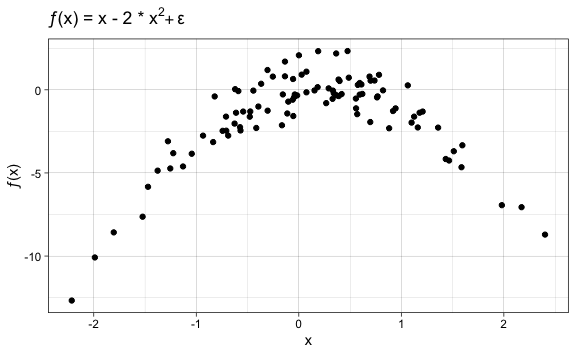

Lab 5 Cross-Validation and the Bootstrap Exercises
================
Evan Woods
2023-12-12

## Applied

### Question 5:

In Chapter 4, we used logistic regression to predict the probability of
default using income and balance on the Default data set. We will now
estimate the test error of this logistic regression model using the
validation set approach. Do not forget to set a random seed before
beginning your analysis.

- **Question-5a**: Fit a logistic regression model that uses income and
  balance to predict default.
  - **Answer**:

``` r
glm.fit <- glm(default ~ income + balance, data = Default, family = "binomial")
```

- **Question-5b**: Using the validation set approach, estimate the test
  error of this model. In order to do this, you must perform the
  following steps:
  1.  Split the sample set into a training set and a validation set.
  2.  Fit a multiple logistic regression model using only the training
      observations.
  3.  Obtain a prediction of default status for each individual in the
      validation set by computing the posterior probability of default
      for that individual, and classifying the individual to the default
      category if the posterior probability is greater than 0.5.
  4.  Compute the validation set error, which is the fraction of the
      observations in the validation set that are misclassified.

  - **Answer**:

``` r
# Split the sample set into a training set and a validation set.
train <- sample(nrow(Default), (nrow(Default) * .8))
```

``` r
# Fit a multiple logistic regression model using only the training observations.
glm.fit <- glm(default ~ income + balance, data = Default, family = "binomial", subset = train)
```

``` r
# Obtain a prediction of default status for each individual in the validation set by computing the posterior probability of default for that individual, and classifying the individual to the default category if the posterior probability is greater than 0.5. 
glm.prob <- predict(glm.fit, Default[-train, 2:4], type = "response")
glm.pred <- rep("No", length(Default$default))
glm.pred[glm.prob > .5] <- "Yes"
```

    The validation set error is: 2.550%.

- **Question 5-c**: Repeat the process in the last question three times,
  using three different splits of the observations into a training set
  and a validation set. Comment on the results obtained.
  - **Answer**:

<!-- -->

    The validation set error is: 2.700% for the split of 0.60%.
    The validation set error is: 2.270% for the split of 0.70%.
    The validation set error is: 2.600% for the split of 0.90%.

    The validation set error is greatest for the 60% split. The validation set error
    is smallest when using a 70% split.

- **Question 5-d**: Now consider a logistic regression model that
  predicts the probability of default using income, balance, and a dummy
  variable for student. Estimate the test error for this model using the
  validation set approach. Comment on whether or not including a dummy
  variable for student leads to a reduction in the test error rate.
  - **Answer**:

<!-- -->

    The test error using the validation set approach with a dummy variable is:
    2.25%.

    The test error using the validation set approach with a student variable as a
    factor is the same at: 2.25%.

    The test error using the validation set approach without a dummy student
    variable results in decreased test error observed at: 2.15%.

    The inclusion of a dummy variable for the student predictor lowers the test
    error.

### Question 6: We continue to consider the use of a logistic regression model to

predict the probability of default using income and balance on the
Default data set. In particular, we will now compute estimates for the
standard errors of the income and balance logistic regression coef-
ficients in two different ways: (1) using the bootstrap, and (2) using
the standard formula for computing the standard errors in the glm()
function. Do not forget to set a random seed before beginning your
analysis.

- **Question 6-a**: Using the summary() and the glm() functions,
  determine the standard errors for the coefficients associated with
  income and balance in a multiple logistic regression model that uses
  both predictors.
  - **Answer**:
- **Question 6-b**: Write a function, boot.fn(), that takes as input the
  Default data set as well as an index of the observations, and that
  outputs the coefficient estimates for income and balance in the
  multiple logistic regression model.
  - **Answer**:

``` r
boot.fn <- function(data, index) {
  coef(glm(default ~ income + balance, data = data, subset = index, family = "binomial"))
}
```

- **Question 6-c**: Use the boot() function together with your boot.fn()
  function to estimate the standard errors of the logistic regression
  coefficients for income and balance.
  - **Answer**:

<!-- -->


    ORDINARY NONPARAMETRIC BOOTSTRAP


    Call:
    boot(data = Default, statistic = boot.fn, R = 1000)


    Bootstrap Statistics :
             original        bias     std. error
    t1* -1.154047e+01 -2.292405e-02 4.435269e-01
    t2*  2.080898e-05  2.737444e-08 5.073444e-06
    t3*  5.647103e-03  1.176249e-05 2.299133e-04

- **Question 6-d**: Comment on the estimated standard errors obtained
  using the glm() function and using your bootstrap function.
  - **Answer**:

<!-- -->

    The standard errors obtained for the coefficients while using the summary
    function are: 5.568e-06 and 2.466e-04 respectively.

    The standard errors obtained for the coefficients while using the bootstrapped
    datasets are lower for both coefficients.

### Question 7: In Sections 5.3.2 and 5.3.3, we saw that the cv.glm() function can be

used in order to compute the LOOCV test error estimate. Alterna- tively,
one could compute those quantities using just the glm() and
predict.glm() functions, and a for loop. You will now take this ap-
proach in order to compute the LOOCV error for a simple logistic
regression model on the Weekly data set. Recall that in the context of
classification problems, the LOOCV error is given in (5.4).

- **Question 7-a**: Fit a logistic regression model that predicts
  Direction using Lag1 and Lag2.
  - **Answer**:

<!-- -->


    Call:  glm(formula = Direction ~ Lag1 + Lag2, family = "binomial", data = Direction)

    Coefficients:
    (Intercept)         Lag1         Lag2  
        0.22122     -0.03872      0.06025  

    Degrees of Freedom: 1088 Total (i.e. Null);  1086 Residual
    Null Deviance:      1496 
    Residual Deviance: 1488     AIC: 1494

- **Question 7-b**: Fit a logistic regression model that predicts
  Direction using Lag1 and Lag2 using all but the first observation.
  - **Answer**:

``` r
glm.fit_loo <- glm(Direction ~ Lag1 + Lag2, data = weekly[-1,], family = "binomial")
```

- **Question 7-c**: Use the model from the previous question to predict
  the direction of the first obser- vation. You can do this by
  predicting that the first observation will go up if P (Direction =
  “Up”\|Lag1, Lag2) \> 0.5. Was this observation correctly classified?
  - **Answer**:

<!-- -->

    The statement that this prediction was correctly classified is: FALSE

- **Question 7-d**: Write a for loop from i = 1 to i = n, where n is the
  number of observations in the data set, that performs each of the
  following steps:
  1.  Fit a logistic regression model using all but the ith obser-
      vation to predict Direction using Lag1 and Lag2.
  2.  Compute the posterior probability of the market moving up for the
      ith observation.
  3.  Use the posterior probability for the ith observation in order to
      predict whether or not the market moves up.
  4.  Determine whether or not an error was made in predicting the
      direction for the ith observation. If an error was made, then
      indicate this as a 1, and otherwise indicate it as a 0.

  - **Answer**:

``` r
loocv <- function(n) {
    truthiness <- c()
    for (i in seq(1, n)) {
      glm.fit_loo <- glm(Direction ~ Lag1 + Lag2, data = weekly[-i,], family = "binomial")      
      glm.fit_loo_pred <- rep("Down", 1)
      glm.fit_loo_prob <- predict(glm.fit_loo, weekly[i,], type = "response")
      glm.fit_loo_pred[glm.fit_loo_prob > 0.5] <- "Up"
      
      if(glm.fit_loo_pred != weekly$Direction[i]){
        truthiness <- c(truthiness, 1)
      } else {
        truthiness <- c(truthiness, 0)
      }
    }
    return(truthiness)
  }
```

- **Question 7-e**: Take the average of the n numbers obtained in (d)iv
  in order to obtain the LOOCV estimate for the test error. Comment on
  the results.
  - **Answer**:

<!-- -->

    The average error of the 1000 numbers obtained in the custom
    leave-one-out-cross-validation function is: 45.30%. This appears to be an
    appropriate level of error for this dataset.

### Question 8: We will now perform cross-validation on a simulated data set.

- **Question 8-a**: Generate the simulated data set. In this dataset,
  what is *n* and what is *p*?
  - **Answer**:

``` r
set.seed(1)
x <- rnorm(100)
y <- x - 2 * x^2 + rnorm(100)
```

    In this dataset, there are 100 observations, n, & 2 predictors, p.

- **Question 8-b**: Create a scatterplot of *X* against *Y*. Comment on
  what you find.
  - **Answer**:
    

<!-- -->

    The resulting function is a quadratic with an upside-down parabolic curve. There
    is observable noise in the scatterplot.

- **Question 8-c**: Set a random seed, and then compute the LOOCV errors
  that result from fitting the following four models using least
  squares.
  1.  Y = β<sub>0</sub> + β<sub>1</sub>X + ε
  2.  Y = β<sub>0</sub> + β<sub>1</sub>X + β<sub>2</sub>X<sup>2</sup> +
      ε
  3.  Y = β<sub>0</sub> + β<sub>1</sub>X + β<sub>2</sub>X<sup>2</sup> +
      β<sub>3</sub>X<sup>3</sup> + ε
  4.  Y = β<sub>0</sub> + β<sub>1</sub>X + β<sub>2</sub>X<sup>2</sup> +
      β<sub>3</sub>X<sup>3</sup> + β<sub>4</sub>X<sup>4</sup> + ε

  - **Answer**:

``` r
set.seed(1)
x <- rnorm(100)
y <- x - 2 * x^2 + rnorm(100)
df <- tibble(x,y)
# i.
glm.fit_i <- glm(y ~ x, data = df)
cv.error.i <- cv.glm(df, glm.fit_i)$delta[1]

# ii.
glm.fit_ii <- glm(y ~ x + I(x^2), data = df)
cv.error.ii <- cv.glm(df, glm.fit_ii)$delta[1]

# iii.
glm.fit_iii <- glm(y ~ x + I(x^2) + I(x^3), data = df)
cv.error.iii <- cv.glm(df, glm.fit_iii)$delta[1]

# iv.
glm.fit_iv <- glm(y ~ x + I(x^2) + I(x^3) + I(x^4), data = df)
cv.error.iv <- cv.glm(df, glm.fit_iv)$delta[1]
f_print(sprintf("The LOOCV errors that result from fitting the four models are as follows: %0.03f%%, %0.03f%%, %0.03f%%, %0.03f%%", cv.error.i, cv.error.ii, cv.error.iii, cv.error.iv))
```

    The LOOCV errors that result from fitting the four models are as follows:
    7.288%, 0.937%, 0.957%, 0.954%

- **Question 8-d**: Repeat the previous question using another random
  seed, and report your results. Are your results the same as what you
  got in the previous question? Why?
  - **Answer**:

``` r
set.seed(42)
x <- rnorm(100)
y <- x - 2 * x^2 + rnorm(100)
df <- tibble(x,y)
# i.
glm.fit_i <- glm(y ~ x, data = df)
cv.error.i <- cv.glm(df, glm.fit_i)

# ii.
glm.fit_ii <- glm(y ~ x + I(x^2), data = df)
cv.error.ii <- cv.glm(df, glm.fit_ii)$delta[1]

# iii.

glm.fit_iii <- glm(y ~ x + I(x^2) + I(x^3), data = df)
cv.error.iii <- cv.glm(df, glm.fit_iii)$delta[1]

# iv.
glm.fit_iv <- glm(y ~ x + I(x^2) + I(x^3) + I(x^4), data = df)
cv.error.iv <- cv.glm(df, glm.fit_iv)$delta[1]
f_print(sprintf("With a new seed, the LOOCV errors that result from fitting the four models are as follows: %0.03f%%, %0.03f%%, %0.03f%%, %0.03f%%", cv.error.i$delta[1], cv.error.ii, cv.error.iii, cv.error.iv))
```

    With a new seed, the LOOCV errors that result from fitting the four models are
    as follows: 10.966%, 0.886%, 0.909%, 0.964%

    The results differ from the previous question. With a new seed, new random
    number are generated. The variability in the error term is irreducible error
    that persists between models. It is simulated when new data is pseudo-randomly
    generated by setting a new seed, this irreducible error is observable in the
    differing values of the test errors the models exhibited.

- **Question 8-e**: Which of the models had the smallest LOOCV error? Is
  this what was expected? Explain your answer.
  - **Answer**:

<!-- -->

    The model whose formula was composed of a highest degree of 2 had the smallest
    error as expected. This predictors of this model match that of the true function
    of f which is itself comprised of predictors x and x squared as well.

- **Question 8-f**: Comment on the statistical significance of the
  coefficient esti- mates that results from fitting each of the models
  using least squares. Do these results agree with the conclusions drawn
  based on the cross-validation results?
  - **Answer**:

<!-- -->


    Call:
    glm(formula = y ~ x, data = df)

    Coefficients:
                Estimate Std. Error t value Pr(>|t|)    
    (Intercept)  -2.2655     0.3177  -7.131 1.72e-10 ***
    x             1.8837     0.3065   6.146 1.71e-08 ***
    ---
    Signif. codes:  0 '***' 0.001 '**' 0.01 '*' 0.05 '.' 0.1 ' ' 1

    (Dispersion parameter for gaussian family taken to be 10.08403)

        Null deviance: 1369.19  on 99  degrees of freedom
    Residual deviance:  988.23  on 98  degrees of freedom
    AIC: 518.86

    Number of Fisher Scoring iterations: 2


    Call:
    glm(formula = y ~ x + I(x^2), data = df)

    Coefficients:
                Estimate Std. Error t value Pr(>|t|)    
    (Intercept) -0.09625    0.11254  -0.855    0.395    
    x            1.03026    0.09183  11.220   <2e-16 ***
    I(x^2)      -1.99276    0.06039 -32.996   <2e-16 ***
    ---
    Signif. codes:  0 '***' 0.001 '**' 0.01 '*' 0.05 '.' 0.1 ' ' 1

    (Dispersion parameter for gaussian family taken to be 0.8334462)

        Null deviance: 1369.191  on 99  degrees of freedom
    Residual deviance:   80.844  on 97  degrees of freedom
    AIC: 270.52

    Number of Fisher Scoring iterations: 2


    Call:
    glm(formula = y ~ x + I(x^2) + I(x^3), data = df)

    Coefficients:
                Estimate Std. Error t value Pr(>|t|)    
    (Intercept) -0.10288    0.11527  -0.892    0.374    
    x            0.99342    0.15505   6.407  5.5e-09 ***
    I(x^2)      -1.98058    0.07333 -27.007  < 2e-16 ***
    I(x^3)       0.01237    0.04183   0.296    0.768    
    ---
    Signif. codes:  0 '***' 0.001 '**' 0.01 '*' 0.05 '.' 0.1 ' ' 1

    (Dispersion parameter for gaussian family taken to be 0.8413617)

        Null deviance: 1369.191  on 99  degrees of freedom
    Residual deviance:   80.771  on 96  degrees of freedom
    AIC: 272.43

    Number of Fisher Scoring iterations: 2


    Call:
    glm(formula = y ~ x + I(x^2) + I(x^3) + I(x^4), data = df)

    Coefficients:
                Estimate Std. Error t value Pr(>|t|)    
    (Intercept) -0.01804    0.13311  -0.136    0.892    
    x            0.91167    0.16757   5.440 4.13e-07 ***
    I(x^2)      -2.17063    0.16728 -12.976  < 2e-16 ***
    I(x^3)       0.05941    0.05591   1.063    0.291    
    I(x^4)       0.03906    0.03092   1.263    0.210    
    ---
    Signif. codes:  0 '***' 0.001 '**' 0.01 '*' 0.05 '.' 0.1 ' ' 1

    (Dispersion parameter for gaussian family taken to be 0.8361751)

        Null deviance: 1369.191  on 99  degrees of freedom
    Residual deviance:   79.437  on 95  degrees of freedom
    AIC: 272.77

    Number of Fisher Scoring iterations: 2

    In all models, when present, the predictors x and x-squared were found to be
    statistically significant predictors of the response, y. These results agree
    with the conclusions drawn based on the cross-validation results where the test
    error was least significant when these two variables were exclusively present.
    Models which included additional predictors that did not add value to the
    model increased test error. These same models were also observed to not have
    statistical significance with respect to the coefficients of the same predictors
    as shown from the model summaries.

### Question 9:

We will now consider the Boston housing dataset, from the ISLR2 library.

- **Question 9-a**: Based on this data set, provide an estimate for the
  population mean of medv. Call this estimate ˆμ.
  - **Answer**:

``` r
μ_ˆ <- mean(boston$medv)
```

    The estimate of the population mean of medv is: 22.533.

- **Question 9-b**: Provide an estimate of the standard error of ˆμ.
  Interpret this result.
  - **Answer**:

<!-- -->

    The estimated standard error, ˆμ, is: 0.409.

- **Question 9-c**: Now estimate the standard error of ˆμ using the
  bootstrap. How does this compare to your answer from the previous
  question?
  - **Answer**:

<!-- -->


    ORDINARY NONPARAMETRIC BOOTSTRAP


    Call:
    boot(data = boston$medv, statistic = boot.fn, R = 1000)


    Bootstrap Statistics :
        original     bias    std. error
    t1* 22.53281 0.02671186   0.4009216

    The standard error of 1000 bootstrapped sample means is: 0.401. The estimated
    standard error using the bootstrap is approximately the same as the estimated
    standard error with a value of: 0.409.

- **Question 9-d**: Based on your bootstrap estimate from the previous
  question, provide a 95 % con- fidence interval for the mean of medv.
  Compare it to the results obtained using t.test(Boston\$medv).
  - **Answer**:

``` r
conf_int <- c(μ_ˆ- 2*se, μ_ˆ+ 2*se)
conf_int
```

    [1] 21.73096 23.33465

``` r
t_test <- t.test(boston$medv)
t_test
```


        One Sample t-test

    data:  boston$medv
    t = 55.111, df = 505, p-value < 2.2e-16
    alternative hypothesis: true mean is not equal to 0
    95 percent confidence interval:
     21.72953 23.33608
    sample estimates:
    mean of x 
     22.53281 

    The calculated confidence interval ranges from 21.731 to 23.335. These values
    are very similar to the 95% confidence interval as calculated by the t test.

- **Question 9-e**: Based on this data set, provide an estimate, ˆμmed,
  for the median value of medv in the population.
  - **Answer**:

<!-- -->

    The estimate of the median of the population mean of the boston medv variable
    is: 21.20.

- **Question 9-f**: We now would like to estimate the standard error of
  ˆμmed. Unfor- tunately, there is no simple formula for computing the
  standard error of the median. Instead, estimate the standard error of
  the median using the bootstrap. Comment on your findings.
  - **Answer**:

<!-- -->


    ORDINARY NONPARAMETRIC BOOTSTRAP


    Call:
    boot(data = boston$medv, statistic = boot.fn, R = 1000)


    Bootstrap Statistics :
        original  bias    std. error
    t1*     21.2  0.0106   0.3661785

    The standard error of 1000 bootstrapped sample medians is: 0.366.

- **Question 9-g**: Based on this data set, provide an estimate for the
  tenth per- centile of medv in Boston census tracts. Call this quantity
  ˆμ0.1. (You can use the quantile() function.)
  - **Answer**:

<!-- -->

    The estimate for the tenth percentile of medv in Boston census tracts, ˆμ0.1,
    is: 12.75.

- **Question 9-h**:
  - **Answer**:

<!-- -->


    ORDINARY NONPARAMETRIC BOOTSTRAP


    Call:
    boot(data = boston$medv, statistic = boot.fn, R = 1000)


    Bootstrap Statistics :
        original  bias    std. error
    t1*    12.75  0.0215   0.4948966

    The bootstrapped estimate of the tenth percentile of medv in the Boston census
    tracts is identical to the estimate created using the quantile function. The
    standard error is 0.494.
