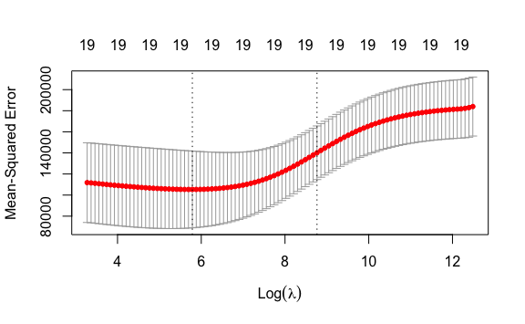
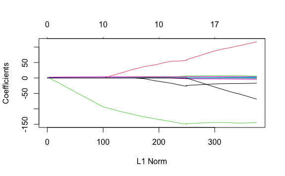
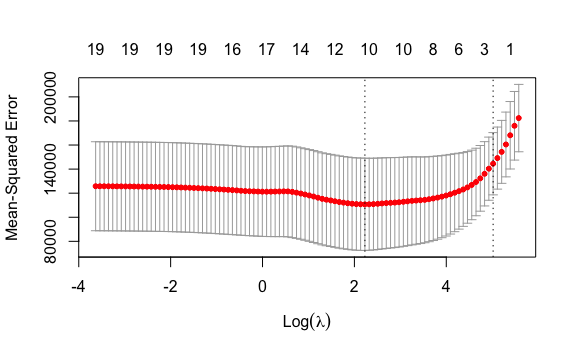
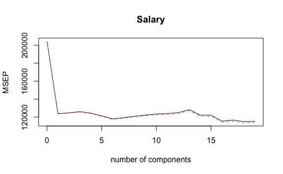
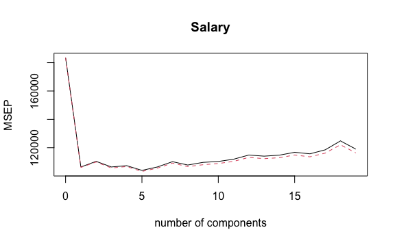
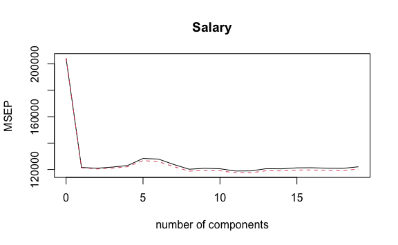

Lab 6 Linear Models and Regularization Methods
================
Evan Woods
2023-12-14

## Subset Selection Methods

### Best Subset Selection

``` r
library(leaps)
regfit.full <- regsubsets(Salary ~ ., Hitters)
summary(regfit.full)
```

    Subset selection object
    Call: regsubsets.formula(Salary ~ ., Hitters)
    19 Variables  (and intercept)
               Forced in Forced out
    AtBat          FALSE      FALSE
    Hits           FALSE      FALSE
    HmRun          FALSE      FALSE
    Runs           FALSE      FALSE
    RBI            FALSE      FALSE
    Walks          FALSE      FALSE
    Years          FALSE      FALSE
    CAtBat         FALSE      FALSE
    CHits          FALSE      FALSE
    CHmRun         FALSE      FALSE
    CRuns          FALSE      FALSE
    CRBI           FALSE      FALSE
    CWalks         FALSE      FALSE
    LeagueN        FALSE      FALSE
    DivisionW      FALSE      FALSE
    PutOuts        FALSE      FALSE
    Assists        FALSE      FALSE
    Errors         FALSE      FALSE
    NewLeagueN     FALSE      FALSE
    1 subsets of each size up to 8
    Selection Algorithm: exhaustive
             AtBat Hits HmRun Runs RBI Walks Years CAtBat CHits CHmRun CRuns CRBI
    1  ( 1 ) " "   " "  " "   " "  " " " "   " "   " "    " "   " "    " "   "*" 
    2  ( 1 ) " "   "*"  " "   " "  " " " "   " "   " "    " "   " "    " "   "*" 
    3  ( 1 ) " "   "*"  " "   " "  " " " "   " "   " "    " "   " "    " "   "*" 
    4  ( 1 ) " "   "*"  " "   " "  " " " "   " "   " "    " "   " "    " "   "*" 
    5  ( 1 ) "*"   "*"  " "   " "  " " " "   " "   " "    " "   " "    " "   "*" 
    6  ( 1 ) "*"   "*"  " "   " "  " " "*"   " "   " "    " "   " "    " "   "*" 
    7  ( 1 ) " "   "*"  " "   " "  " " "*"   " "   "*"    "*"   "*"    " "   " " 
    8  ( 1 ) "*"   "*"  " "   " "  " " "*"   " "   " "    " "   "*"    "*"   " " 
             CWalks LeagueN DivisionW PutOuts Assists Errors NewLeagueN
    1  ( 1 ) " "    " "     " "       " "     " "     " "    " "       
    2  ( 1 ) " "    " "     " "       " "     " "     " "    " "       
    3  ( 1 ) " "    " "     " "       "*"     " "     " "    " "       
    4  ( 1 ) " "    " "     "*"       "*"     " "     " "    " "       
    5  ( 1 ) " "    " "     "*"       "*"     " "     " "    " "       
    6  ( 1 ) " "    " "     "*"       "*"     " "     " "    " "       
    7  ( 1 ) " "    " "     "*"       "*"     " "     " "    " "       
    8  ( 1 ) "*"    " "     "*"       "*"     " "     " "    " "       

``` r
# length(Hitters)
regfit.full <- regsubsets(Salary ~ ., data = Hitters, nvmax = 19)
reg.summary <- summary(regfit.full)
names(reg.summary)
```

    [1] "which"  "rsq"    "rss"    "adjr2"  "cp"     "bic"    "outmat" "obj"   

``` r
reg.summary$rsq
```

     [1] 0.3214501 0.4252237 0.4514294 0.4754067 0.4908036 0.5087146 0.5141227
     [8] 0.5285569 0.5346124 0.5404950 0.5426153 0.5436302 0.5444570 0.5452164
    [15] 0.5454692 0.5457656 0.5459518 0.5460945 0.5461159

``` r
par(mfrow = c(2,2))
plot(reg.summary$rss, xlab = "Number of Variables", ylab = "RSS", type = "l")
plot(reg.summary$adjr2, xlab = "Number of Variables", ylab = "Adj. RSq", type = "l")

which.max(reg.summary$adjr2)
```

    [1] 11

``` r
points(11, reg.summary$adjr2[11], col = "red", cex = 2)
```


``` r
plot(reg.summary$cp, xlab = "Number of Variables", ylab = "Cp", type = "l")
which.min(reg.summary$cp)
```

    [1] 10

``` r
points(10, reg.summary$cp[10], col = "red", cex = 2, pch = 20)
```


``` r
which.min(reg.summary$bic)
```

    [1] 6

``` r
plot(reg.summary$bic, xlab = "Number of Variables", ylab = "BIC", type = "l")
points(6, reg.summary$bic[6], col = "red", cex = 2, pch = 20)
```


``` r
plot(regfit.full, scale = "r2")
```


``` r
plot(regfit.full, scale = "adjr2")
```


``` r
plot(regfit.full, scale = "Cp")
```


``` r
plot(regfit.full, scale = "bic")
```


### Forward and Backward Stepwise Selection

``` r
regfit.fwd <- regsubsets(Salary ~ ., data = Hitters, nvmax = 19, method = "forward")
regfit.bwd <- regsubsets(Salary ~ ., data = Hitters, method = "backward", nvmax  = 19)
summary(regfit.bwd)
```

    Subset selection object
    Call: regsubsets.formula(Salary ~ ., data = Hitters, method = "backward", 
        nvmax = 19)
    19 Variables  (and intercept)
               Forced in Forced out
    AtBat          FALSE      FALSE
    Hits           FALSE      FALSE
    HmRun          FALSE      FALSE
    Runs           FALSE      FALSE
    RBI            FALSE      FALSE
    Walks          FALSE      FALSE
    Years          FALSE      FALSE
    CAtBat         FALSE      FALSE
    CHits          FALSE      FALSE
    CHmRun         FALSE      FALSE
    CRuns          FALSE      FALSE
    CRBI           FALSE      FALSE
    CWalks         FALSE      FALSE
    LeagueN        FALSE      FALSE
    DivisionW      FALSE      FALSE
    PutOuts        FALSE      FALSE
    Assists        FALSE      FALSE
    Errors         FALSE      FALSE
    NewLeagueN     FALSE      FALSE
    1 subsets of each size up to 19
    Selection Algorithm: backward
              AtBat Hits HmRun Runs RBI Walks Years CAtBat CHits CHmRun CRuns CRBI
    1  ( 1 )  " "   " "  " "   " "  " " " "   " "   " "    " "   " "    "*"   " " 
    2  ( 1 )  " "   "*"  " "   " "  " " " "   " "   " "    " "   " "    "*"   " " 
    3  ( 1 )  " "   "*"  " "   " "  " " " "   " "   " "    " "   " "    "*"   " " 
    4  ( 1 )  "*"   "*"  " "   " "  " " " "   " "   " "    " "   " "    "*"   " " 
    5  ( 1 )  "*"   "*"  " "   " "  " " "*"   " "   " "    " "   " "    "*"   " " 
    6  ( 1 )  "*"   "*"  " "   " "  " " "*"   " "   " "    " "   " "    "*"   " " 
    7  ( 1 )  "*"   "*"  " "   " "  " " "*"   " "   " "    " "   " "    "*"   " " 
    8  ( 1 )  "*"   "*"  " "   " "  " " "*"   " "   " "    " "   " "    "*"   "*" 
    9  ( 1 )  "*"   "*"  " "   " "  " " "*"   " "   "*"    " "   " "    "*"   "*" 
    10  ( 1 ) "*"   "*"  " "   " "  " " "*"   " "   "*"    " "   " "    "*"   "*" 
    11  ( 1 ) "*"   "*"  " "   " "  " " "*"   " "   "*"    " "   " "    "*"   "*" 
    12  ( 1 ) "*"   "*"  " "   "*"  " " "*"   " "   "*"    " "   " "    "*"   "*" 
    13  ( 1 ) "*"   "*"  " "   "*"  " " "*"   " "   "*"    " "   " "    "*"   "*" 
    14  ( 1 ) "*"   "*"  "*"   "*"  " " "*"   " "   "*"    " "   " "    "*"   "*" 
    15  ( 1 ) "*"   "*"  "*"   "*"  " " "*"   " "   "*"    "*"   " "    "*"   "*" 
    16  ( 1 ) "*"   "*"  "*"   "*"  "*" "*"   " "   "*"    "*"   " "    "*"   "*" 
    17  ( 1 ) "*"   "*"  "*"   "*"  "*" "*"   " "   "*"    "*"   " "    "*"   "*" 
    18  ( 1 ) "*"   "*"  "*"   "*"  "*" "*"   "*"   "*"    "*"   " "    "*"   "*" 
    19  ( 1 ) "*"   "*"  "*"   "*"  "*" "*"   "*"   "*"    "*"   "*"    "*"   "*" 
              CWalks LeagueN DivisionW PutOuts Assists Errors NewLeagueN
    1  ( 1 )  " "    " "     " "       " "     " "     " "    " "       
    2  ( 1 )  " "    " "     " "       " "     " "     " "    " "       
    3  ( 1 )  " "    " "     " "       "*"     " "     " "    " "       
    4  ( 1 )  " "    " "     " "       "*"     " "     " "    " "       
    5  ( 1 )  " "    " "     " "       "*"     " "     " "    " "       
    6  ( 1 )  " "    " "     "*"       "*"     " "     " "    " "       
    7  ( 1 )  "*"    " "     "*"       "*"     " "     " "    " "       
    8  ( 1 )  "*"    " "     "*"       "*"     " "     " "    " "       
    9  ( 1 )  "*"    " "     "*"       "*"     " "     " "    " "       
    10  ( 1 ) "*"    " "     "*"       "*"     "*"     " "    " "       
    11  ( 1 ) "*"    "*"     "*"       "*"     "*"     " "    " "       
    12  ( 1 ) "*"    "*"     "*"       "*"     "*"     " "    " "       
    13  ( 1 ) "*"    "*"     "*"       "*"     "*"     "*"    " "       
    14  ( 1 ) "*"    "*"     "*"       "*"     "*"     "*"    " "       
    15  ( 1 ) "*"    "*"     "*"       "*"     "*"     "*"    " "       
    16  ( 1 ) "*"    "*"     "*"       "*"     "*"     "*"    " "       
    17  ( 1 ) "*"    "*"     "*"       "*"     "*"     "*"    "*"       
    18  ( 1 ) "*"    "*"     "*"       "*"     "*"     "*"    "*"       
    19  ( 1 ) "*"    "*"     "*"       "*"     "*"     "*"    "*"       

``` r
coef(regfit.full, 7)
```

     (Intercept)         Hits        Walks       CAtBat        CHits       CHmRun 
      79.4509472    1.2833513    3.2274264   -0.3752350    1.4957073    1.4420538 
       DivisionW      PutOuts 
    -129.9866432    0.2366813 

``` r
coef(regfit.fwd, 7)
```

     (Intercept)        AtBat         Hits        Walks         CRBI       CWalks 
     109.7873062   -1.9588851    7.4498772    4.9131401    0.8537622   -0.3053070 
       DivisionW      PutOuts 
    -127.1223928    0.2533404 

``` r
coef(regfit.bwd, 7)
```

     (Intercept)        AtBat         Hits        Walks        CRuns       CWalks 
     105.6487488   -1.9762838    6.7574914    6.0558691    1.1293095   -0.7163346 
       DivisionW      PutOuts 
    -116.1692169    0.3028847 

## Model Selection with Cross Validation and Validation Set

### Best Subset Selection using Validations Set

``` r
set.seed(1)
train <- sample(c(TRUE, FALSE), nrow(Hitters), replace = TRUE)
test <- (!train)
```

``` r
regfit.best <- regsubsets(Salary ~ ., data = Hitters[train,], nvmax = 19)
```

``` r
test.mat <- model.matrix(Salary ~ ., data = Hitters[test, ]) # model.matrix transforms a data.frame into a matrix
```

``` r
val.errors <- rep(NA, 19)
for (i in 1:19) {
  coefi <- coef(regfit.best, id = i)
  pred <- test.mat[, names(coefi)] %*% coefi
  val.errors[i] <- mean((Hitters$Salary[test] - pred)^2)
}

val.errors
```

     [1] 164377.3 144405.5 152175.7 145198.4 137902.1 139175.7 126849.0 136191.4
     [9] 132889.6 135434.9 136963.3 140694.9 140690.9 141951.2 141508.2 142164.4
    [17] 141767.4 142339.6 142238.2

``` r
which.min(val.errors)
```

    [1] 7

``` r
coef(regfit.best, 7)
```

     (Intercept)        AtBat         Hits        Walks        CRuns       CWalks 
      67.1085369   -2.1462987    7.0149547    8.0716640    1.2425113   -0.8337844 
       DivisionW      PutOuts 
    -118.4364998    0.2526925 

``` r
predict.regsubsets <- function(object, newdata, id, ...) {
  form <- as.formula(object$call[[2]])
  mat <- model.matrix(form, newdata)
  coefi <- coef(object, id = id)
  xvars <- names(coefi)
  mat[, xvars] %*% coefi
}
```

``` r
regfit.best <- regsubsets(Salary ~ ., data = Hitters, nvmax = 19)
coef(regfit.best, 7)
```

     (Intercept)         Hits        Walks       CAtBat        CHits       CHmRun 
      79.4509472    1.2833513    3.2274264   -0.3752350    1.4957073    1.4420538 
       DivisionW      PutOuts 
    -129.9866432    0.2366813 

K-Fold Cross-Validation Selection

``` r
k <- 10
n <- nrow(Hitters)
set.seed(1)
folds <- sample(rep(1:k, length = n)) # grouping each observation into k groups
cv.errors <- matrix(NA, k, 19, dimnames = list(NULL, paste(1:19)))
```

``` r
for (j in 1:k) {
  best.fit <- regsubsets(Salary ~ .,
                         data = Hitters[folds != j, ], nvmax = 19) # Training on all but k.
  for (i in 1:19) {
    pred <- predict(best.fit, Hitters[folds == j, ], id = i) # Predict using k. This will use the custom predict function above. Best i variable model.
    cv.errors[j, i] <-
      mean((Hitters$Salary[folds == j] - pred) ^2) # Mean Square Error of each predictor within a k fold.
  }
}
```

``` r
mean.cv.errors <- apply(cv.errors, 2, mean) # Identify the k which has the lowest mean test error
mean.cv.errors
```

           1        2        3        4        5        6        7        8 
    143439.8 126817.0 134214.2 131782.9 130765.6 120382.9 121443.1 114363.7 
           9       10       11       12       13       14       15       16 
    115163.1 109366.0 112738.5 113616.5 115557.6 115853.3 115630.6 116050.0 
          17       18       19 
    116117.0 116419.3 116299.1 

``` r
par(mfrow = c(1,1))
plot(mean.cv.errors, type = "b")
```


``` r
# Best Subset Selection of the full dataset to obtain the 10 variable model.
reg.best <- regsubsets(Salary ~ ., data = Hitters, nvmax = 19)
coef(reg.best, 10)
```

     (Intercept)        AtBat         Hits        Walks       CAtBat        CRuns 
     162.5354420   -2.1686501    6.9180175    5.7732246   -0.1300798    1.4082490 
            CRBI       CWalks    DivisionW      PutOuts      Assists 
       0.7743122   -0.8308264 -112.3800575    0.2973726    0.2831680 

## Ridge Regression and the Lasso

``` r
x <- model.matrix(Salary ~ ., data = Hitters)[, -1] # -1 removes the intercept
y <- Hitters$Salary
```

### Ridge Regression

``` r
grid <- 10^seq(10, -2, length = 100)
ridge.mod <- glmnet(x, y, alpha = 0, lambda = grid)
```

``` r
dim(coef(ridge.mod))
```

    [1]  20 100

``` r
ridge.mod$lambda[50] # Lambda = 11,498; the 50th Lambda
```

    [1] 11497.57

``` r
coef(ridge.mod)[,50] # Coefficients @ Lambda = 11,498; intercepts are rows, the columns are coefficients.
```

      (Intercept)         AtBat          Hits         HmRun          Runs 
    407.356050200   0.036957182   0.138180344   0.524629976   0.230701523 
              RBI         Walks         Years        CAtBat         CHits 
      0.239841459   0.289618741   1.107702929   0.003131815   0.011653637 
           CHmRun         CRuns          CRBI        CWalks       LeagueN 
      0.087545670   0.023379882   0.024138320   0.025015421   0.085028114 
        DivisionW       PutOuts       Assists        Errors    NewLeagueN 
     -6.215440973   0.016482577   0.002612988  -0.020502690   0.301433531 

``` r
sqrt(sum(coef(ridge.mod)[-1, 50]^2)) # L2 norm
```

    [1] 6.360612

``` r
ridge.mod$lambda[60]
```

    [1] 705.4802

``` r
coef(ridge.mod)[, 60]
```

     (Intercept)        AtBat         Hits        HmRun         Runs          RBI 
     54.32519950   0.11211115   0.65622409   1.17980910   0.93769713   0.84718546 
           Walks        Years       CAtBat        CHits       CHmRun        CRuns 
      1.31987948   2.59640425   0.01083413   0.04674557   0.33777318   0.09355528 
            CRBI       CWalks      LeagueN    DivisionW      PutOuts      Assists 
      0.09780402   0.07189612  13.68370191 -54.65877750   0.11852289   0.01606037 
          Errors   NewLeagueN 
     -0.70358655   8.61181213 

``` r
sqrt(sum(coef(ridge.mod)[-1, 60]^2))
```

    [1] 57.11001

``` r
predict(ridge.mod, s = 50, type = "coefficients")[1:20, ] # Selecting the value of lambda = 50. This is a prediction using the full dataset.
```

      (Intercept)         AtBat          Hits         HmRun          Runs 
     4.876610e+01 -3.580999e-01  1.969359e+00 -1.278248e+00  1.145892e+00 
              RBI         Walks         Years        CAtBat         CHits 
     8.038292e-01  2.716186e+00 -6.218319e+00  5.447837e-03  1.064895e-01 
           CHmRun         CRuns          CRBI        CWalks       LeagueN 
     6.244860e-01  2.214985e-01  2.186914e-01 -1.500245e-01  4.592589e+01 
        DivisionW       PutOuts       Assists        Errors    NewLeagueN 
    -1.182011e+02  2.502322e-01  1.215665e-01 -3.278600e+00 -9.496680e+00 

``` r
# Creating a ridge regression prediction using a validation set.
set.seed(1)
train <- sample(1:nrow(x), nrow(x) / 2)
test <- (-train)
y.test <- y[test]
```

``` r
ridge.mod <- glmnet(x[train, ], y[train], alpha = 0, lambda = grid, thresh = 1e-12)
ridge.pred <- predict(ridge.mod, s = 4, newx = x[test, ]) # use newx to select the test set when making predictions.
mean((ridge.pred - y.test)^2) # The intercept is included when calculating the MSE.
```

    [1] 142199.2

``` r
# Computing the test error if the model only used the intercept. (The Null Model)
mean((mean(y[train]) - y.test)^2)
```

    [1] 224669.9

``` r
# Computing the test error if the model only used the intercept by reducing the predictors in a ridge regression using a very large value of lambda.
ridge.pred <- predict(ridge.mod, s = 1e10, newx = x[test, ])
mean((ridge.pred - y.test)^2)
```

    [1] 224669.8

``` r
# Least Squares Regression: λ = 0
ridge.pred <- predict(ridge.mod, s = 0, newx = x[test, ], exact = TRUE, x = x[train, ], y = y[train])
mean((ridge.pred - y.test)^2)
```

    [1] 168588.6

``` r
# Comparing linear model least squares regression to a least squares regression using a ridge regression.
lm(y ~ x, subset = train)
```


    Call:
    lm(formula = y ~ x, subset = train)

    Coefficients:
    (Intercept)       xAtBat        xHits       xHmRun        xRuns         xRBI  
       274.0145      -0.3521      -1.6377       5.8145       1.5424       1.1243  
         xWalks       xYears      xCAtBat       xCHits      xCHmRun       xCRuns  
         3.7287     -16.3773      -0.6412       3.1632       3.4008      -0.9739  
          xCRBI      xCWalks     xLeagueN   xDivisionW     xPutOuts     xAssists  
        -0.6005       0.3379     119.1486    -144.0831       0.1976       0.6804  
        xErrors  xNewLeagueN  
        -4.7128     -71.0951  

``` r
predict(ridge.mod, s = 0, exact = TRUE, type = "coefficients", x = x[train, ], y = y[train])[1:20, ] # Exact = True: Choose precise values for the coefficients. The difference between lm and glmnet with respect to the decimal place is an estimation using glmnet.
```

     (Intercept)        AtBat         Hits        HmRun         Runs          RBI 
     274.0200994   -0.3521900   -1.6371383    5.8146692    1.5423361    1.1241837 
           Walks        Years       CAtBat        CHits       CHmRun        CRuns 
       3.7288406  -16.3795195   -0.6411235    3.1629444    3.4005281   -0.9739405 
            CRBI       CWalks      LeagueN    DivisionW      PutOuts      Assists 
      -0.6003976    0.3378422  119.1434637 -144.0853061    0.1976300    0.6804200 
          Errors   NewLeagueN 
      -4.7127879  -71.0898914 

``` r
# Using cross-validation to select the optimal value of lambda to minimize test error.
set.seed(1)
cv.out <- cv.glmnet(x[train, ], y[train], alpha = 0)
plot(cv.out)
```



``` r
min_lambda <- cv.out$lambda.min
min_lambda
```

    [1] 326.0828

``` r
# Test error using the optimal value of lambda
ridge.pred <- predict(ridge.mod, s = 326, newx = x[test, ])
mean((ridge.pred - y[test])^2)
```

    [1] 139857.6

``` r
# Fitting the entire dataset using the optimal value of lambda.
out <- glmnet(x, y, alpha = 0)
out.pred <- predict(out, s = min_lambda, type = "coefficients")[1:20, ]
out.pred
```

     (Intercept)        AtBat         Hits        HmRun         Runs          RBI 
     15.44383120   0.07715547   0.85911582   0.60103106   1.06369007   0.87936105 
           Walks        Years       CAtBat        CHits       CHmRun        CRuns 
      1.62444617   1.35254778   0.01134999   0.05746654   0.40680157   0.11456224 
            CRBI       CWalks      LeagueN    DivisionW      PutOuts      Assists 
      0.12116504   0.05299202  22.09143197 -79.04032656   0.16619903   0.02941950 
          Errors   NewLeagueN 
     -1.36092945   9.12487765 

``` r
# Create a validation set
set.seed(1)
train <- sample(1:nrow(x), nrow(x)/2)
test <- (-train)
y.test <- y[test]
```

``` r
set.seed(1)
# Cross validation 
ridge_regression_model <- cv.glmnet(x[train, ], y[train], alpha = 0)
ridge_regression_model$lambda.min
```

    [1] 326.0828

``` r
ridge_regression_model.pred <- predict(ridge_regression_model, s = ridge_regression_model$lambda.min, newx = x[test, ])
mean((ridge_regression_model.pred - y[test])^2)
```

    [1] 139863.2

``` r
ridge_regression <- glmnet(x, y, alpha = 0)
ridge_regression.pred <- predict(ridge_regression, s = ridge_regression_model$lambda.min, type = "coefficients")[1:20, ]
ridge_regression.pred
```

     (Intercept)        AtBat         Hits        HmRun         Runs          RBI 
     15.44383120   0.07715547   0.85911582   0.60103106   1.06369007   0.87936105 
           Walks        Years       CAtBat        CHits       CHmRun        CRuns 
      1.62444617   1.35254778   0.01134999   0.05746654   0.40680157   0.11456224 
            CRBI       CWalks      LeagueN    DivisionW      PutOuts      Assists 
      0.12116504   0.05299202  22.09143197 -79.04032656   0.16619903   0.02941950 
          Errors   NewLeagueN 
     -1.36092945   9.12487765 

# Lasso Regression

``` r
set.seed(1)
lasso.mod <- glmnet(x[train, ], y[train], alpha = 1, lambda = grid)
plot(lasso.mod)
```

    Warning in regularize.values(x, y, ties, missing(ties), na.rm = na.rm):
    collapsing to unique 'x' values



``` r
set.seed(1)
cv.out <- cv.glmnet(x[train, ], y[train], alpha = 1)
plot(cv.out)
```



``` r
cv.out$lambda.min
```

    [1] 9.286955

``` r
lasso.pred <- predict(lasso.mod, s = cv.out$lambda.min, newx = x[test, ])
mean((lasso.pred - y.test)^2)
```

    [1] 143673.6

``` r
 out <- glmnet(x, y, lambda = grid, alpha = 1)
lasso.coef <- predict(out, s = cv.out$lambda.min, type = "coefficients")[1:20, ]
lasso.coef
```

      (Intercept)         AtBat          Hits         HmRun          Runs 
       1.27479059   -0.05497143    2.18034583    0.00000000    0.00000000 
              RBI         Walks         Years        CAtBat         CHits 
       0.00000000    2.29192406   -0.33806109    0.00000000    0.00000000 
           CHmRun         CRuns          CRBI        CWalks       LeagueN 
       0.02825013    0.21628385    0.41712537    0.00000000   20.28615023 
        DivisionW       PutOuts       Assists        Errors    NewLeagueN 
    -116.16755870    0.23752385    0.00000000   -0.85629148    0.00000000 

## PCR & PLS Regression

### Principal Components Regression

``` r
library(pls)
set.seed(2)
```

``` r
pcr.fit <- pcr(Salary ~ ., data = Hitters, scale = TRUE, validation = "CV") # Setting scale = TRUE will standardize each predictor. validation = "CV" means using a ten-fold cross-validation for each number of principle components.
summary(pcr.fit)
```

    Data:   X dimension: 263 19 
        Y dimension: 263 1
    Fit method: svdpc
    Number of components considered: 19

    VALIDATION: RMSEP
    Cross-validated using 10 random segments.
           (Intercept)  1 comps  2 comps  3 comps  4 comps  5 comps  6 comps
    CV             452    351.9    353.2    355.0    352.8    348.4    343.6
    adjCV          452    351.6    352.7    354.4    352.1    347.6    342.7
           7 comps  8 comps  9 comps  10 comps  11 comps  12 comps  13 comps
    CV       345.5    347.7    349.6     351.4     352.1     353.5     358.2
    adjCV    344.7    346.7    348.5     350.1     350.7     352.0     356.5
           14 comps  15 comps  16 comps  17 comps  18 comps  19 comps
    CV        349.7     349.4     339.9     341.6     339.2     339.6
    adjCV     348.0     347.7     338.2     339.7     337.2     337.6

    TRAINING: % variance explained
            1 comps  2 comps  3 comps  4 comps  5 comps  6 comps  7 comps  8 comps
    X         38.31    60.16    70.84    79.03    84.29    88.63    92.26    94.96
    Salary    40.63    41.58    42.17    43.22    44.90    46.48    46.69    46.75
            9 comps  10 comps  11 comps  12 comps  13 comps  14 comps  15 comps
    X         96.28     97.26     97.98     98.65     99.15     99.47     99.75
    Salary    46.86     47.76     47.82     47.85     48.10     50.40     50.55
            16 comps  17 comps  18 comps  19 comps
    X          99.89     99.97     99.99    100.00
    Salary     53.01     53.85     54.61     54.61

``` r
# Printing the cross validation scores
validationplot(pcr.fit, val.type = "MSEP")
```



``` r
set.seed(1)
pcr.fit <- pcr(Salary ~ ., data = Hitters, subset = train, scale = TRUE, validation = "CV")
validationplot(pcr.fit, val.type = "MSEP")
```



``` r
# Calculating the means squared error after making predictions using the ideal number of components.
pcr.pred <- predict(pcr.fit, x[test, ], ncomp = 5)
mean((pcr.pred - y.test)^2)
```

    [1] 142811.8

``` r
# Fitting a Principal Component Regression to all the data
pcr.fit <- pcr(y ~ x, scale = TRUE, ncomp = 5)
summary(pcr.fit)
```

    Data:   X dimension: 263 19 
        Y dimension: 263 1
    Fit method: svdpc
    Number of components considered: 5
    TRAINING: % variance explained
       1 comps  2 comps  3 comps  4 comps  5 comps
    X    38.31    60.16    70.84    79.03    84.29
    y    40.63    41.58    42.17    43.22    44.90

### Partial Least Squares

``` r
set.seed(1)
pls.fit <- plsr(Salary ~ ., data = Hitters, validation  = "CV", scale = TRUE)
summary(pls.fit)
```

    Data:   X dimension: 263 19 
        Y dimension: 263 1
    Fit method: kernelpls
    Number of components considered: 19

    VALIDATION: RMSEP
    Cross-validated using 10 random segments.
           (Intercept)  1 comps  2 comps  3 comps  4 comps  5 comps  6 comps
    CV             452    348.7    347.8    349.0    350.7    358.3    357.6
    adjCV          452    348.3    347.0    347.9    349.4    356.0    354.9
           7 comps  8 comps  9 comps  10 comps  11 comps  12 comps  13 comps
    CV       351.8    346.7    347.7     347.2     344.7     344.9     347.3
    adjCV    349.5    344.6    345.5     345.1     342.7     342.8     345.0
           14 comps  15 comps  16 comps  17 comps  18 comps  19 comps
    CV        347.1     348.2     348.3     347.8     347.7     349.4
    adjCV     344.8     345.8     345.9     345.4     345.3     346.9

    TRAINING: % variance explained
            1 comps  2 comps  3 comps  4 comps  5 comps  6 comps  7 comps  8 comps
    X         38.08    51.03    65.98    73.93    78.63    84.26    88.17    90.12
    Salary    43.05    46.40    47.72    48.71    50.53    51.66    52.34    53.26
            9 comps  10 comps  11 comps  12 comps  13 comps  14 comps  15 comps
    X         92.92     95.00     96.68     97.68     98.22     98.55     98.98
    Salary    53.52     53.77     54.04     54.20     54.32     54.47     54.54
            16 comps  17 comps  18 comps  19 comps
    X          99.24     99.71     99.99    100.00
    Salary     54.59     54.61     54.61     54.61

``` r
validationplot(pls.fit, val.type = "MSEP")
```



``` r
pls.pred <- predict(pls.fit, x[test, ], ncomp = 1)
mean((pls.pred - y.test)^2)
```

    [1] 129122.9

``` r
plt.fit <- plsr(Salary ~ ., data = Hitters, scale = TRUE, ncomp = 1)
summary(pls.fit)
```

    Data:   X dimension: 263 19 
        Y dimension: 263 1
    Fit method: kernelpls
    Number of components considered: 19

    VALIDATION: RMSEP
    Cross-validated using 10 random segments.
           (Intercept)  1 comps  2 comps  3 comps  4 comps  5 comps  6 comps
    CV             452    348.7    347.8    349.0    350.7    358.3    357.6
    adjCV          452    348.3    347.0    347.9    349.4    356.0    354.9
           7 comps  8 comps  9 comps  10 comps  11 comps  12 comps  13 comps
    CV       351.8    346.7    347.7     347.2     344.7     344.9     347.3
    adjCV    349.5    344.6    345.5     345.1     342.7     342.8     345.0
           14 comps  15 comps  16 comps  17 comps  18 comps  19 comps
    CV        347.1     348.2     348.3     347.8     347.7     349.4
    adjCV     344.8     345.8     345.9     345.4     345.3     346.9

    TRAINING: % variance explained
            1 comps  2 comps  3 comps  4 comps  5 comps  6 comps  7 comps  8 comps
    X         38.08    51.03    65.98    73.93    78.63    84.26    88.17    90.12
    Salary    43.05    46.40    47.72    48.71    50.53    51.66    52.34    53.26
            9 comps  10 comps  11 comps  12 comps  13 comps  14 comps  15 comps
    X         92.92     95.00     96.68     97.68     98.22     98.55     98.98
    Salary    53.52     53.77     54.04     54.20     54.32     54.47     54.54
            16 comps  17 comps  18 comps  19 comps
    X          99.24     99.71     99.99    100.00
    Salary     54.59     54.61     54.61     54.61
