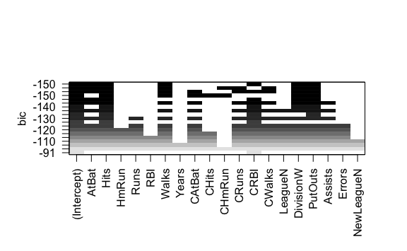

Lab 6 Linear Models and Regularization Methods
================
Evan Woods
2023-12-13

## Subset Selection Methods

### Best Subset Selection

``` r
library(leaps)
regfit.full <- regsubsets(Salary ~ ., Hitters)
summary(regfit.full)
```

    Subset selection object
    Call: regsubsets.formula(Salary ~ ., Hitters)
    19 Variables  (and intercept)
               Forced in Forced out
    AtBat          FALSE      FALSE
    Hits           FALSE      FALSE
    HmRun          FALSE      FALSE
    Runs           FALSE      FALSE
    RBI            FALSE      FALSE
    Walks          FALSE      FALSE
    Years          FALSE      FALSE
    CAtBat         FALSE      FALSE
    CHits          FALSE      FALSE
    CHmRun         FALSE      FALSE
    CRuns          FALSE      FALSE
    CRBI           FALSE      FALSE
    CWalks         FALSE      FALSE
    LeagueN        FALSE      FALSE
    DivisionW      FALSE      FALSE
    PutOuts        FALSE      FALSE
    Assists        FALSE      FALSE
    Errors         FALSE      FALSE
    NewLeagueN     FALSE      FALSE
    1 subsets of each size up to 8
    Selection Algorithm: exhaustive
             AtBat Hits HmRun Runs RBI Walks Years CAtBat CHits CHmRun CRuns CRBI
    1  ( 1 ) " "   " "  " "   " "  " " " "   " "   " "    " "   " "    " "   "*" 
    2  ( 1 ) " "   "*"  " "   " "  " " " "   " "   " "    " "   " "    " "   "*" 
    3  ( 1 ) " "   "*"  " "   " "  " " " "   " "   " "    " "   " "    " "   "*" 
    4  ( 1 ) " "   "*"  " "   " "  " " " "   " "   " "    " "   " "    " "   "*" 
    5  ( 1 ) "*"   "*"  " "   " "  " " " "   " "   " "    " "   " "    " "   "*" 
    6  ( 1 ) "*"   "*"  " "   " "  " " "*"   " "   " "    " "   " "    " "   "*" 
    7  ( 1 ) " "   "*"  " "   " "  " " "*"   " "   "*"    "*"   "*"    " "   " " 
    8  ( 1 ) "*"   "*"  " "   " "  " " "*"   " "   " "    " "   "*"    "*"   " " 
             CWalks LeagueN DivisionW PutOuts Assists Errors NewLeagueN
    1  ( 1 ) " "    " "     " "       " "     " "     " "    " "       
    2  ( 1 ) " "    " "     " "       " "     " "     " "    " "       
    3  ( 1 ) " "    " "     " "       "*"     " "     " "    " "       
    4  ( 1 ) " "    " "     "*"       "*"     " "     " "    " "       
    5  ( 1 ) " "    " "     "*"       "*"     " "     " "    " "       
    6  ( 1 ) " "    " "     "*"       "*"     " "     " "    " "       
    7  ( 1 ) " "    " "     "*"       "*"     " "     " "    " "       
    8  ( 1 ) "*"    " "     "*"       "*"     " "     " "    " "       

``` r
# length(Hitters)
regfit.full <- regsubsets(Salary ~ ., data = Hitters, nvmax = 19)
reg.summary <- summary(regfit.full)
names(reg.summary)
```

    [1] "which"  "rsq"    "rss"    "adjr2"  "cp"     "bic"    "outmat" "obj"   

``` r
reg.summary$rsq
```

     [1] 0.3214501 0.4252237 0.4514294 0.4754067 0.4908036 0.5087146 0.5141227
     [8] 0.5285569 0.5346124 0.5404950 0.5426153 0.5436302 0.5444570 0.5452164
    [15] 0.5454692 0.5457656 0.5459518 0.5460945 0.5461159

``` r
par(mfrow = c(2,2))
plot(reg.summary$rss, xlab = "Number of Variables", ylab = "RSS", type = "l")
plot(reg.summary$adjr2, xlab = "Number of Variables", ylab = "Adj. RSq", type = "l")

which.max(reg.summary$adjr2)
```

    [1] 11

``` r
points(11, reg.summary$adjr2[11], col = "red", cex = 2)
```


``` r
plot(reg.summary$cp, xlab = "Number of Variables", ylab = "Cp", type = "l")
which.min(reg.summary$cp)
```

    [1] 10

``` r
points(10, reg.summary$cp[10], col = "red", cex = 2, pch = 20)
```


``` r
which.min(reg.summary$bic)
```

    [1] 6

``` r
plot(reg.summary$bic, xlab = "Number of Variables", ylab = "BIC", type = "l")
points(6, reg.summary$bic[6], col = "red", cex = 2, pch = 20)
```


``` r
plot(regfit.full, scale = "r2")
```


``` r
plot(regfit.full, scale = "adjr2")
```


``` r
plot(regfit.full, scale = "Cp")
```


``` r
plot(regfit.full, scale = "bic")
```



### Forward and Backward Stepwise Selection

``` r
regfit.fwd <- regsubsets(Salary ~ ., data = Hitters, nvmax = 19, method = "forward")
regfit.bwd <- regsubsets(Salary ~ ., data = Hitters, method = "backward", nvmax  = 19)
summary(regfit.bwd)
```

    Subset selection object
    Call: regsubsets.formula(Salary ~ ., data = Hitters, method = "backward", 
        nvmax = 19)
    19 Variables  (and intercept)
               Forced in Forced out
    AtBat          FALSE      FALSE
    Hits           FALSE      FALSE
    HmRun          FALSE      FALSE
    Runs           FALSE      FALSE
    RBI            FALSE      FALSE
    Walks          FALSE      FALSE
    Years          FALSE      FALSE
    CAtBat         FALSE      FALSE
    CHits          FALSE      FALSE
    CHmRun         FALSE      FALSE
    CRuns          FALSE      FALSE
    CRBI           FALSE      FALSE
    CWalks         FALSE      FALSE
    LeagueN        FALSE      FALSE
    DivisionW      FALSE      FALSE
    PutOuts        FALSE      FALSE
    Assists        FALSE      FALSE
    Errors         FALSE      FALSE
    NewLeagueN     FALSE      FALSE
    1 subsets of each size up to 19
    Selection Algorithm: backward
              AtBat Hits HmRun Runs RBI Walks Years CAtBat CHits CHmRun CRuns CRBI
    1  ( 1 )  " "   " "  " "   " "  " " " "   " "   " "    " "   " "    "*"   " " 
    2  ( 1 )  " "   "*"  " "   " "  " " " "   " "   " "    " "   " "    "*"   " " 
    3  ( 1 )  " "   "*"  " "   " "  " " " "   " "   " "    " "   " "    "*"   " " 
    4  ( 1 )  "*"   "*"  " "   " "  " " " "   " "   " "    " "   " "    "*"   " " 
    5  ( 1 )  "*"   "*"  " "   " "  " " "*"   " "   " "    " "   " "    "*"   " " 
    6  ( 1 )  "*"   "*"  " "   " "  " " "*"   " "   " "    " "   " "    "*"   " " 
    7  ( 1 )  "*"   "*"  " "   " "  " " "*"   " "   " "    " "   " "    "*"   " " 
    8  ( 1 )  "*"   "*"  " "   " "  " " "*"   " "   " "    " "   " "    "*"   "*" 
    9  ( 1 )  "*"   "*"  " "   " "  " " "*"   " "   "*"    " "   " "    "*"   "*" 
    10  ( 1 ) "*"   "*"  " "   " "  " " "*"   " "   "*"    " "   " "    "*"   "*" 
    11  ( 1 ) "*"   "*"  " "   " "  " " "*"   " "   "*"    " "   " "    "*"   "*" 
    12  ( 1 ) "*"   "*"  " "   "*"  " " "*"   " "   "*"    " "   " "    "*"   "*" 
    13  ( 1 ) "*"   "*"  " "   "*"  " " "*"   " "   "*"    " "   " "    "*"   "*" 
    14  ( 1 ) "*"   "*"  "*"   "*"  " " "*"   " "   "*"    " "   " "    "*"   "*" 
    15  ( 1 ) "*"   "*"  "*"   "*"  " " "*"   " "   "*"    "*"   " "    "*"   "*" 
    16  ( 1 ) "*"   "*"  "*"   "*"  "*" "*"   " "   "*"    "*"   " "    "*"   "*" 
    17  ( 1 ) "*"   "*"  "*"   "*"  "*" "*"   " "   "*"    "*"   " "    "*"   "*" 
    18  ( 1 ) "*"   "*"  "*"   "*"  "*" "*"   "*"   "*"    "*"   " "    "*"   "*" 
    19  ( 1 ) "*"   "*"  "*"   "*"  "*" "*"   "*"   "*"    "*"   "*"    "*"   "*" 
              CWalks LeagueN DivisionW PutOuts Assists Errors NewLeagueN
    1  ( 1 )  " "    " "     " "       " "     " "     " "    " "       
    2  ( 1 )  " "    " "     " "       " "     " "     " "    " "       
    3  ( 1 )  " "    " "     " "       "*"     " "     " "    " "       
    4  ( 1 )  " "    " "     " "       "*"     " "     " "    " "       
    5  ( 1 )  " "    " "     " "       "*"     " "     " "    " "       
    6  ( 1 )  " "    " "     "*"       "*"     " "     " "    " "       
    7  ( 1 )  "*"    " "     "*"       "*"     " "     " "    " "       
    8  ( 1 )  "*"    " "     "*"       "*"     " "     " "    " "       
    9  ( 1 )  "*"    " "     "*"       "*"     " "     " "    " "       
    10  ( 1 ) "*"    " "     "*"       "*"     "*"     " "    " "       
    11  ( 1 ) "*"    "*"     "*"       "*"     "*"     " "    " "       
    12  ( 1 ) "*"    "*"     "*"       "*"     "*"     " "    " "       
    13  ( 1 ) "*"    "*"     "*"       "*"     "*"     "*"    " "       
    14  ( 1 ) "*"    "*"     "*"       "*"     "*"     "*"    " "       
    15  ( 1 ) "*"    "*"     "*"       "*"     "*"     "*"    " "       
    16  ( 1 ) "*"    "*"     "*"       "*"     "*"     "*"    " "       
    17  ( 1 ) "*"    "*"     "*"       "*"     "*"     "*"    "*"       
    18  ( 1 ) "*"    "*"     "*"       "*"     "*"     "*"    "*"       
    19  ( 1 ) "*"    "*"     "*"       "*"     "*"     "*"    "*"       

``` r
coef(regfit.full, 7)
```

     (Intercept)         Hits        Walks       CAtBat        CHits       CHmRun 
      79.4509472    1.2833513    3.2274264   -0.3752350    1.4957073    1.4420538 
       DivisionW      PutOuts 
    -129.9866432    0.2366813 

``` r
coef(regfit.fwd, 7)
```

     (Intercept)        AtBat         Hits        Walks         CRBI       CWalks 
     109.7873062   -1.9588851    7.4498772    4.9131401    0.8537622   -0.3053070 
       DivisionW      PutOuts 
    -127.1223928    0.2533404 

``` r
coef(regfit.bwd, 7)
```

     (Intercept)        AtBat         Hits        Walks        CRuns       CWalks 
     105.6487488   -1.9762838    6.7574914    6.0558691    1.1293095   -0.7163346 
       DivisionW      PutOuts 
    -116.1692169    0.3028847 

## Model Selection with Cross Validation and Validation Set

### Best Subset Selection using Validations Set

``` r
set.seed(1)
train <- sample(c(TRUE, FALSE), nrow(Hitters), replace = TRUE)
test <- (!train)
```

``` r
regfit.best <- regsubsets(Salary ~ ., data = Hitters[train,], nvmax = 19)
```

``` r
test.mat <- model.matrix(Salary ~ ., data = Hitters[test, ]) # model.matrix transforms a data.frame into a matrix
```

``` r
val.errors <- rep(NA, 19)
for (i in 1:19) {
  coefi <- coef(regfit.best, id = i)
  pred <- test.mat[, names(coefi)] %*% coefi
  val.errors[i] <- mean((Hitters$Salary[test] - pred)^2)
}

val.errors
```

     [1] 164377.3 144405.5 152175.7 145198.4 137902.1 139175.7 126849.0 136191.4
     [9] 132889.6 135434.9 136963.3 140694.9 140690.9 141951.2 141508.2 142164.4
    [17] 141767.4 142339.6 142238.2

``` r
which.min(val.errors)
```

    [1] 7

``` r
coef(regfit.best, 7)
```

     (Intercept)        AtBat         Hits        Walks        CRuns       CWalks 
      67.1085369   -2.1462987    7.0149547    8.0716640    1.2425113   -0.8337844 
       DivisionW      PutOuts 
    -118.4364998    0.2526925 

``` r
predict.regsubsets <- function(object, newdata, id, ...) {
  form <- as.formula(object$call[[2]])
  mat <- model.matrix(form, newdata)
  coefi <- coef(object, id = id)
  xvars <- names(coefi)
  mat[, xvars] %*% coefi
}
```

``` r
regfit.best <- regsubsets(Salary ~ ., data = Hitters, nvmax = 19)
coef(regfit.best, 7)
```

     (Intercept)         Hits        Walks       CAtBat        CHits       CHmRun 
      79.4509472    1.2833513    3.2274264   -0.3752350    1.4957073    1.4420538 
       DivisionW      PutOuts 
    -129.9866432    0.2366813 

K-Fold Cross-Validation Selection

``` r
k <- 10
n <- nrow(Hitters)
set.seed(1)
folds <- sample(rep(1:k, length = n)) # grouping each observation into k groups
cv.errors <- matrix(NA, k, 19, dimnames = list(NULL, paste(1:19)))
```

``` r
for (j in 1:k) {
  best.fit <- regsubsets(Salary ~ .,
                         data = Hitters[folds != j, ], nvmax = 19) # Training on all but k.
  for (i in 1:19) {
    pred <- predict(best.fit, Hitters[folds == j, ], id = i) # Predict using k. This will use the custom predict function above. Best i variable model.
    cv.errors[j, i] <-
      mean((Hitters$Salary[folds == j] - pred) ^2) # Mean Square Error of each predictor within a k fold.
  }
}
```

``` r
mean.cv.errors <- apply(cv.errors, 2, mean) # Identify the k which has the lowest mean test error
mean.cv.errors
```

           1        2        3        4        5        6        7        8 
    143439.8 126817.0 134214.2 131782.9 130765.6 120382.9 121443.1 114363.7 
           9       10       11       12       13       14       15       16 
    115163.1 109366.0 112738.5 113616.5 115557.6 115853.3 115630.6 116050.0 
          17       18       19 
    116117.0 116419.3 116299.1 

``` r
par(mfrow = c(1,1))
plot(mean.cv.errors, type = "b")
```


``` r
# Best Subset Selection of the full dataset to obtain the 10 variable model.
reg.best <- regsubsets(Salary ~ ., data = Hitters, nvmax = 19)
coef(reg.best, 10)
```

     (Intercept)        AtBat         Hits        Walks       CAtBat        CRuns 
     162.5354420   -2.1686501    6.9180175    5.7732246   -0.1300798    1.4082490 
            CRBI       CWalks    DivisionW      PutOuts      Assists 
       0.7743122   -0.8308264 -112.3800575    0.2973726    0.2831680 
