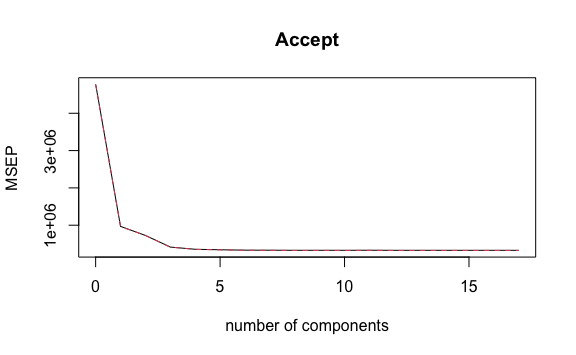
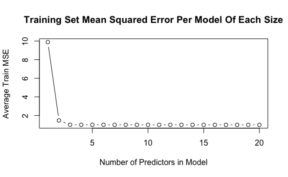
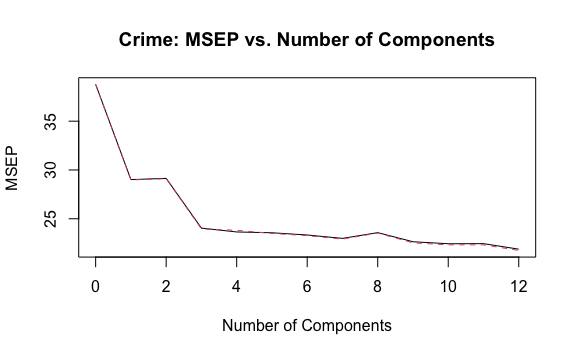

Lab 6 Linear Models and Regularization Methods Exercises
================
Evan Woods
2023-12-15

## Applied:

### Question 8:

In this exercise, we will generate simulated data, and will then use
this data to perform best subset selection.

- **Question 8-a**: Use the rnorm() function to generate a predictor X
  of length n = 100, as well as a noise vector ε of length n = 100.
  - **Answer**:

``` r
X = rnorm(100)
ε = rnorm(100)
```

- **Question 8-b**: Generate a response vector Y of length n = 100
  according to the model Y = β<sub>0</sub> + β<sub>1</sub>X +
  β<sub>2</sub>X<sup>2</sup> + β<sub>3</sub>X<sup>3</sup> + ε, where
  β<sub>0</sub>, β<sub>1</sub>, β<sub>2</sub>, and β<sub>3</sub> are
  constants of your choice.
  - **Answer**:

``` r
β_0 <- 10
β_1 <- 1
β_2 <- 2
β_3 <- 3
n = 100
Y <- β_0 + (β_1 * X) + (β_2 * X^2) + (β_3 * X^3) + ε
```

- **Question 8-c**: Use the regsubsets() function to perform best subset
  selection in order to choose the best model containing the predictors
  X, X<sup>2</sup>, …, X<sup>10</sup>. What is the best model obtained
  according to C<sub>p</sub>, BIC, and adjusted R<sup>2</sup>? Show
  plots to provide evidence for your answer, and report the coefficients
  of the best model obtained. Note you will need to use the data.frame()
  function to create a single data set containing both X and Y.
  - **Answer**:

<!-- -->

    Subset selection object
    Call: regsubsets.formula(Y ~ ., data = df, nvmax = 10)
    10 Variables  (and intercept)
           Forced in Forced out
    X          FALSE      FALSE
    `X^2`      FALSE      FALSE
    `X^3`      FALSE      FALSE
    `X^4`      FALSE      FALSE
    `X^5`      FALSE      FALSE
    `X^6`      FALSE      FALSE
    `X^7`      FALSE      FALSE
    `X^8`      FALSE      FALSE
    `X^9`      FALSE      FALSE
    `X^10`     FALSE      FALSE
    1 subsets of each size up to 10
    Selection Algorithm: exhaustive
              X   `X^2` `X^3` `X^4` `X^5` `X^6` `X^7` `X^8` `X^9` `X^10`
    1  ( 1 )  " " " "   "*"   " "   " "   " "   " "   " "   " "   " "   
    2  ( 1 )  " " "*"   "*"   " "   " "   " "   " "   " "   " "   " "   
    3  ( 1 )  "*" "*"   "*"   " "   " "   " "   " "   " "   " "   " "   
    4  ( 1 )  "*" "*"   "*"   " "   "*"   " "   " "   " "   " "   " "   
    5  ( 1 )  "*" "*"   "*"   " "   "*"   "*"   " "   " "   " "   " "   
    6  ( 1 )  "*" "*"   "*"   " "   " "   " "   "*"   "*"   "*"   " "   
    7  ( 1 )  "*" "*"   "*"   " "   "*"   "*"   " "   "*"   " "   "*"   
    8  ( 1 )  "*" "*"   "*"   "*"   " "   "*"   " "   "*"   "*"   "*"   
    9  ( 1 )  "*" "*"   "*"   "*"   "*"   "*"   " "   "*"   "*"   "*"   
    10  ( 1 ) "*" "*"   "*"   "*"   "*"   "*"   "*"   "*"   "*"   "*"   

    The best model obtained according to Mallows' Cp is model 4.

    The best model obtained according to Bayesian Information Criterion is model 3.

    The best model obtained according to Adjusted R-squared is model 4.


    The coefficients for the best model obtained:

    (Intercept)           X       `X^2`       `X^3`       `X^5` 
    10.07200775  1.38745596  1.84575641  2.55797426  0.08072292 

- **Question 8-d**: Repeat the previous question using forward stepwise
  selection and also using backwards stepwise selection. How does your
  answer compare to the results in the previous question?
  - **Answer**:

<!-- -->

    Subset selection object
    Call: regsubsets.formula(Y ~ ., data = df, nvmax = 10, method = "forward")
    10 Variables  (and intercept)
           Forced in Forced out
    X          FALSE      FALSE
    `X^2`      FALSE      FALSE
    `X^3`      FALSE      FALSE
    `X^4`      FALSE      FALSE
    `X^5`      FALSE      FALSE
    `X^6`      FALSE      FALSE
    `X^7`      FALSE      FALSE
    `X^8`      FALSE      FALSE
    `X^9`      FALSE      FALSE
    `X^10`     FALSE      FALSE
    1 subsets of each size up to 10
    Selection Algorithm: forward
              X   `X^2` `X^3` `X^4` `X^5` `X^6` `X^7` `X^8` `X^9` `X^10`
    1  ( 1 )  " " " "   "*"   " "   " "   " "   " "   " "   " "   " "   
    2  ( 1 )  " " "*"   "*"   " "   " "   " "   " "   " "   " "   " "   
    3  ( 1 )  "*" "*"   "*"   " "   " "   " "   " "   " "   " "   " "   
    4  ( 1 )  "*" "*"   "*"   " "   "*"   " "   " "   " "   " "   " "   
    5  ( 1 )  "*" "*"   "*"   " "   "*"   "*"   " "   " "   " "   " "   
    6  ( 1 )  "*" "*"   "*"   " "   "*"   "*"   " "   " "   "*"   " "   
    7  ( 1 )  "*" "*"   "*"   " "   "*"   "*"   "*"   " "   "*"   " "   
    8  ( 1 )  "*" "*"   "*"   " "   "*"   "*"   "*"   "*"   "*"   " "   
    9  ( 1 )  "*" "*"   "*"   " "   "*"   "*"   "*"   "*"   "*"   "*"   
    10  ( 1 ) "*" "*"   "*"   "*"   "*"   "*"   "*"   "*"   "*"   "*"   

    The best model obtained implementing forward stepwise selection according to
    Mallows' Cp is model 4.

    The best model obtained implementing forward stepwise selection according to
    Bayesian Information Criterion is model 3.

    The best model obtained implementing forward stepwise selection according to
    Adjusted R-squared is model 4.


    Subset selection object
    Call: regsubsets.formula(Y ~ ., data = df, nvmax = 10, method = "backward")
    10 Variables  (and intercept)
           Forced in Forced out
    X          FALSE      FALSE
    `X^2`      FALSE      FALSE
    `X^3`      FALSE      FALSE
    `X^4`      FALSE      FALSE
    `X^5`      FALSE      FALSE
    `X^6`      FALSE      FALSE
    `X^7`      FALSE      FALSE
    `X^8`      FALSE      FALSE
    `X^9`      FALSE      FALSE
    `X^10`     FALSE      FALSE
    1 subsets of each size up to 10
    Selection Algorithm: backward
              X   `X^2` `X^3` `X^4` `X^5` `X^6` `X^7` `X^8` `X^9` `X^10`
    1  ( 1 )  " " " "   "*"   " "   " "   " "   " "   " "   " "   " "   
    2  ( 1 )  " " " "   "*"   "*"   " "   " "   " "   " "   " "   " "   
    3  ( 1 )  " " " "   "*"   "*"   " "   "*"   " "   " "   " "   " "   
    4  ( 1 )  "*" " "   "*"   "*"   " "   "*"   " "   " "   " "   " "   
    5  ( 1 )  "*" " "   "*"   "*"   " "   "*"   " "   "*"   " "   " "   
    6  ( 1 )  "*" " "   "*"   "*"   " "   "*"   " "   "*"   " "   "*"   
    7  ( 1 )  "*" " "   "*"   "*"   " "   "*"   " "   "*"   "*"   "*"   
    8  ( 1 )  "*" "*"   "*"   "*"   " "   "*"   " "   "*"   "*"   "*"   
    9  ( 1 )  "*" "*"   "*"   "*"   "*"   "*"   " "   "*"   "*"   "*"   
    10  ( 1 ) "*" "*"   "*"   "*"   "*"   "*"   "*"   "*"   "*"   "*"   

    The best model obtained implementing backward stepwise selection according to
    Mallows' Cp is model 7.

    The best model obtained implementing backward stepwise selection according to
    Bayesian Information Criterion is model 5.

    The best model obtained implementing backward stepwise selection according to
    Adjusted R-squared is model 7.


    3 different rubrics (Mallows' Cp, Bayesian Information Criterion, and Adjusted
    R-squared) identified the same best models independent of whether those models
    were created using the forward stepwise selection method or the best subset
    selection method. Those models were models 4, 3, & 4 respectively. However, the
    same three metrics identified models 7, 5, & 7 as the best models when those
    models were created using backward stepwise selection.

- **Question 8-e**: Now fit a lasso model to the simulated data, again
  using X, X<sup>2</sup>, …, X<sup>10</sup> as predictors. Use
  cross-validation to select the optimal value of λ. Create plots of the
  cross-validation error as a function of λ. Report the resulting
  coefficient estimates, and discuss the results obtained.
  - **Answer**:
    

<!-- -->

    The coefficient estimates of the full model fit for the best value of lambda
    that minimizes mean square error are the following:

     (Intercept)  (Intercept)            X        `X^2`        `X^3`        `X^4` 
    10.160711222  0.000000000  1.201022091  1.648813427  2.771674080  0.040774671 
           `X^5`        `X^6`        `X^7`        `X^8`        `X^9` 
     0.020058585  0.000000000  0.003855428  0.000000000  0.000000000 

- **Question 8-f**: Now generate a response vector Y according to the
  model Y = β<sub>0</sub> + β<sub>7</sub>X<sup>7</sup> + ε and perform
  best subset selection and the lasso. Discuss the results obtained.
  - **Answer**:

<!-- -->

    Subset selection object
    Call: regsubsets.formula(Y ~ ., data = df, nvmax = 10)
    10 Variables  (and intercept)
           Forced in Forced out
    X          FALSE      FALSE
    `X^2`      FALSE      FALSE
    `X^3`      FALSE      FALSE
    `X^4`      FALSE      FALSE
    `X^5`      FALSE      FALSE
    `X^6`      FALSE      FALSE
    `X^7`      FALSE      FALSE
    `X^8`      FALSE      FALSE
    `X^9`      FALSE      FALSE
    `X^10`     FALSE      FALSE
    1 subsets of each size up to 10
    Selection Algorithm: exhaustive
              X   `X^2` `X^3` `X^4` `X^5` `X^6` `X^7` `X^8` `X^9` `X^10`
    1  ( 1 )  " " " "   " "   " "   " "   " "   "*"   " "   " "   " "   
    2  ( 1 )  " " "*"   " "   " "   " "   " "   "*"   " "   " "   " "   
    3  ( 1 )  " " "*"   " "   " "   "*"   " "   "*"   " "   " "   " "   
    4  ( 1 )  "*" "*"   "*"   " "   " "   " "   "*"   " "   " "   " "   
    5  ( 1 )  "*" "*"   "*"   "*"   " "   " "   "*"   " "   " "   " "   
    6  ( 1 )  "*" " "   "*"   " "   " "   "*"   "*"   "*"   " "   "*"   
    7  ( 1 )  "*" " "   "*"   " "   "*"   "*"   "*"   "*"   " "   "*"   
    8  ( 1 )  "*" "*"   "*"   "*"   " "   "*"   "*"   "*"   " "   "*"   
    9  ( 1 )  "*" "*"   "*"   "*"   " "   "*"   "*"   "*"   "*"   "*"   
    10  ( 1 ) "*" "*"   "*"   "*"   "*"   "*"   "*"   "*"   "*"   "*"   

    The best model obtained according to Mallows' Cp is model 2.

    The best model obtained according to Bayesian Information Criterion is model 1.

    The best model obtained according to Adjusted R-squared is model 4.


    The coefficient estimates of the full model fit for the best value of lambda
    that minimizes mean square error are the following:

    (Intercept) (Intercept)           X       `X^2`       `X^3`       `X^4` 
       10.92532     0.00000     0.00000     0.00000     0.00000     0.00000 
          `X^5`       `X^6`       `X^7`       `X^8`       `X^9` 
        0.00000     0.00000     6.77179     0.00000     0.00000 

    Using best subset selection to generate models, Mallows' Cp, Bayesian
    Information Criterion, & Adjusted R-squared all indicated distinct best models.
    BIC indicated that model 1, which was composed of a predictor of only X^7, was
    the best model. This was followed by Mallows' Cp which indicated X^7 paired
    with X^2 best modeled the true function of ƒ. Adjusted R-squared was the poorest
    indicator of the best model. Adjusted R-squared indicated that model 4 (composed
    of X, X^2, X^3, & X^7) was the best model. Lasso Regression, however, indicated
    the true function of ƒ where the selected coefficients of the model which is fit
    for the best value of lambda are the intercept and X^7. This indicates that in
    a real world scenario, it is best (if feasable) to fit muliple models to compare
    and contrast between the selected coefficients so as to determine the true
    function of ƒ. Had the true function of ƒ not been known, it would have been
    clear that X^7 and the intercept are related to the response in a significant
    way due to the fact that both lasso regression and another statistic, BIC in
    this case, identified these coefficients as pertinent to a model which predicts
    the desired response.

### Question 9:

In this exercise, we will predict the number of applications received
using the other variables in the College dataset. \* **Question 9-a**:
Split the data into a training set and a test set.

- **Question 9-b**: Fit a linear model using least squares on the
  training set, and report the test error obtained.
  - **Answer**:

<!-- -->

    The test error of the linear model is: 330681.9.

- **Question 9-c**: Fit a ridge regression model on the training set,
  with λ chosen by cross-validation. Report the test error obtained.
  - **Answer**:

<!-- -->

    The test error for the ridge regression model is 342942.031 for the chosen value
    of λ: 18.738.

- **Question 9-d**: Fit a lasso model on the training set, with λ chosen
  by cross-validation. Report the test error obtained, along with the
  number of non-zero coefficient estimates.
  - **Answer**:

<!-- -->

    The test error for the lasso model is 330281.104 for the chosen value of λ:
    4.642.

    The number of non-zero coefficient estimates is 8.

- **Question 9-e**: Fit a PCR model on the training set, with M chosen
  by cross-validation. Report the test error obtained, along with the
  value of M selected by cross-validation.
  - **Answer**:

<!-- -->

    Data:   X dimension: 388 17 
        Y dimension: 388 1
    Fit method: svdpc
    Number of components considered: 17

    VALIDATION: RMSEP
    Cross-validated using 10 random segments.
           (Intercept)  1 comps  2 comps  3 comps  4 comps  5 comps  6 comps
    CV            2185     2135     1090     1084    999.4    951.4    799.9
    adjCV         2185     2135     1087     1082    994.7    955.2    795.0
           7 comps  8 comps  9 comps  10 comps  11 comps  12 comps  13 comps
    CV       795.8    783.1    764.3     721.8     623.2     628.8     621.8
    adjCV    791.3    779.2    755.4     721.2     619.3     626.2     618.7
           14 comps  15 comps  16 comps  17 comps
    CV        623.5     623.2     593.2     584.5
    adjCV     620.8     629.5     589.9     580.9

    TRAINING: % variance explained
            1 comps  2 comps  3 comps  4 comps  5 comps  6 comps  7 comps  8 comps
    X        34.716    59.67    66.71    72.12    77.07    81.80    85.46    88.67
    Accept    5.083    76.56    77.06    81.75    83.44    88.22    88.37    88.63
            9 comps  10 comps  11 comps  12 comps  13 comps  14 comps  15 comps
    X         91.06     93.35     95.23     96.88     97.86     98.75     99.24
    Accept    89.87     90.44     92.87     92.87     93.07     93.08     93.13
            16 comps  17 comps
    X          99.72    100.00
    Accept     94.03     94.38


    The test error of the predictions generated from the pcr model is: 330681.9
    where the value of M that captures most of the variability in the response is:
    17

- **Question 9-f**: Fit a PLS model on the dataset with M chosen by
  cross-validation. Report the test error obtained, along with the value
  of M selected by cross-validation.
  - **Answer**:

<!-- -->

    Data:   X dimension: 388 17 
        Y dimension: 388 1
    Fit method: kernelpls
    Number of components considered: 17

    VALIDATION: RMSEP
    Cross-validated using 10 random segments.
           (Intercept)  1 comps  2 comps  3 comps  4 comps  5 comps  6 comps
    CV            2185    984.0    852.0    643.9    596.0    584.7    575.8
    adjCV         2185    981.8    852.3    641.5    593.7    582.7    573.5
           7 comps  8 comps  9 comps  10 comps  11 comps  12 comps  13 comps
    CV       574.8    572.5    573.0     572.4     574.3     572.2     572.4
    adjCV    571.8    569.6    569.9     569.4     571.1     569.2     569.4
           14 comps  15 comps  16 comps  17 comps
    CV        572.3     572.3     572.3     572.3
    adjCV     569.3     569.3     569.3     569.3

    TRAINING: % variance explained
            1 comps  2 comps  3 comps  4 comps  5 comps  6 comps  7 comps  8 comps
    X         25.99    53.38    64.53    68.06    73.25    76.22    79.41    82.07
    Accept    80.93    85.98    92.18    93.50    93.83    94.13    94.30    94.35
            9 comps  10 comps  11 comps  12 comps  13 comps  14 comps  15 comps
    X         84.59     87.16     90.38     92.03     94.63     96.80     97.96
    Accept    94.36     94.37     94.38     94.38     94.38     94.38     94.38
            16 comps  17 comps
    X          99.26    100.00
    Accept     94.38     94.38



    The test error of the partial least squares function is: 326736.5. The ideal
    value of M that captures the most variablility in the response with the least
    number of components is: 11

- **Question 9-g**: Comment on the results obtained. How accurately can
  we predict the number of college applications received? Is there much
  difference resulting from the test errors among these five approaches?
  - **Answer**:

<!-- -->

    Among the five methods, the mean test error is: 332265. The standard deviation
    of the test error is: 6195. There is not much difference among the test errors
    between these five approaches. The the principal component regression and the
    linear model had precisely the same test error. This is because all principal
    components were used to capture the most variability in the response, and
    using all principal components results in a model that has no dimensionality
    reduction. This means that the PCR does not differ from a least squares linear
    model fit. The ridge regression was penalized for the extra predictors, and the
    partial least squares resulted in the lowest test error. This is due to the fact
    that partial least squares required less components to capture the variability
    in the response than the principal component regression and therefore there was
    a dimensionality reduction which reduced the inclusion of predictors that did
    not contribute to predicting the response.

    # A tibble: 1 × 3
      linear_model_test_error ridge_model_test_error lasso_model_test_error
                        <dbl>                  <dbl>                  <dbl>
    1                 330682.                342942.                330281.

    # A tibble: 1 × 2
      PCR_test_error PLS_test_error
               <dbl>          <dbl>
    1        330682.        326737.

    # A tibble: 1 × 6
      set_tolerance lm_accuracy ridge_accuracy lasso_accuracy pcr_accuracy
              <dbl>       <dbl>          <dbl>          <dbl>        <dbl>
    1           0.1       0.328          0.334          0.339        0.329
    # ℹ 1 more variable: pls_accuracy <dbl>

    The model accuracies have been calculated with respect to a set tolerance of
    0.1 from the true number of accepted applications as shown above. Predictions
    greater than or less than this tolerance have been classified as inaccurate, and
    predictions within this tolerance were classified as accurate predictions. Given
    a tolerance of 0.1, the accuracies of the models range from 31.877% to 33.933%
    accurate. At this given tolerance, these models are inaccurate more often
    than not. The full spectrum of model accuracies among the five models between
    tolerances of 0 to 1 is plotted below.


### Question 10:

We have seen that as the number of features in a model increases, the
training error will necessarily decrease, but the test error may not. We
will now explore this in a simulated dataset.

- **Question 10-a**: Generate a data set with p = 20 features, n = 1,000
  observa- tions, and an associated quantitative response vector
  generated according to the model Y = Xβ + ε
  - **Answer**:

``` r
set.seed(42) 
X <- rnorm(1000)
ε <- rnorm(100)
df <- tibble(X, X^2, X^3, X^4, X^5, X^6, X^7, X^8, X^9, X^10, X^11, X^12, X^13, X^14, X^15, X^16, X^17, X^18, X^19, X^20)

β_0 <- 10
β_1 <- 1
β_2 <- 2
β_3 <- 3
n = 100
Y <- β_0 + (β_1 * X) + (β_2 * X^2) + (β_3 * X^3) + ε
```

- **Question 10-b**: Split your data into a training set containing 100
  observations and a test set containing 900 observations.
  - **Answer**:

``` r
set.seed(42) 
train <- sample(1:900)
test <- (-train)
```

- **Question 10-c**: Perform best subset selection on the training set,
  and plot the training set MSE associated with the best model of each
  size.
  - **Answer**:



- **Question 10-d**: Plot the test set MSE associated with the best
  model of each size.
  - **Answer**:


- **Question 10-e**: For which model size does the test set MSE take on
  its minimum value? Comment on your results. If it takes on its minimum
  value for a model containing only an intercept or a model containing
  all of the features, then work with the way that you are generating
  the data in question 10-a until you come up with a scenario in which
  the test set MSE is minimized for an intermediate model size.
  - **Answer**:

<!-- -->

    The test set MSE takes on its minimum value for the model with 4 predictors.

              1           2           3           4           5           6 
      10.463074    1.524774    1.018057    1.017061    1.020076    1.027204 
              7           8           9          10          11          12 
       1.023571    1.525666    7.014276   38.091228   43.928379   66.400944 
             13          14          15          16          17          18 
     503.468591 1809.442345 1117.290837 4680.150725 4720.169459 4689.997269 
             19          20 
    4678.907701 4620.821832 

- **Question 10-f**: How does the model at which the test set MSE is
  minimized compare to the true model used to generate the data? Comment
  on the coefficient values.
  - **Answer**:

<!-- -->

    The model with 4 predictors is close to the true function of ƒ which is
    comprised of 3 predictors and an intercept. The selected predictors of the model
    with the best fit from best subset selection and estimated coefficients thereof
    are included below.

      (Intercept)             X         `X^2`         `X^3`         `X^8` 
     9.889559e+00  1.023076e+00  2.015311e+00  2.991725e+00 -4.291354e-05 

- **Question 10-g**: Create a plot displaying the square root of the sum
  of squared errors for a range of values, r, where the prediction is
  the jth coefficient estimate for the best model containing r
  coefficients. Comment on what you observe. How does this compare to
  the test MSE plot?
  - **Answer**:


    The minimal value of the root of the sum of the square errors is equal to the
    true number of coefficients in the true function of ƒ. The shape of this graph
    resembles that of the graph of the Test Set Mean Squared Error Per Model of Each
    Size for models which have 3 to 15 coefficients. Furthermore, there is an upward
    trend after 15 coefficients in both plots.


### Question 11:

We will now try to predict per capita crime rate in teh Boston data set.

- **Question 11-a**: Implement regression methods explored in this
  chapter, such as best subset selection, the lasso, ridge regression,
  and PCR. Present and discuss results for the approaches that you
  consider.
  - **Answer**:


    (Intercept)          zn        chas          rm         age         dis 
    -9.37754736  0.02161796 -1.33622418  1.95039523 -0.02271595 -0.44447193 
            rad       lstat        medv 
     0.55305386  0.17820814 -0.15346984 


    (Intercept)          rm         rad       lstat        medv 
    -12.3963391   1.8933172   0.5599621   0.1619373  -0.1372887 


    (Intercept)          zn        chas         nox          rm         age 
    -2.40735587  0.01756331 -1.30564203 -4.85082509  1.87634938 -0.01799680 
            dis         rad     ptratio       lstat        medv 
    -0.52222301  0.59199312 -0.19449449  0.17236115 -0.17573730 

    Subset selection object
    Call: regsubsets.formula(crim ~ ., data = boston, subset = train, nvmax = length(boston) - 
        1)
    12 Variables  (and intercept)
            Forced in Forced out
    zn          FALSE      FALSE
    indus       FALSE      FALSE
    chas        FALSE      FALSE
    nox         FALSE      FALSE
    rm          FALSE      FALSE
    age         FALSE      FALSE
    dis         FALSE      FALSE
    rad         FALSE      FALSE
    tax         FALSE      FALSE
    ptratio     FALSE      FALSE
    lstat       FALSE      FALSE
    medv        FALSE      FALSE
    1 subsets of each size up to 12
    Selection Algorithm: exhaustive
              zn  indus chas nox rm  age dis rad tax ptratio lstat medv
    1  ( 1 )  " " " "   " "  " " " " " " " " "*" " " " "     " "   " " 
    2  ( 1 )  " " " "   " "  " " " " " " " " "*" " " " "     "*"   " " 
    3  ( 1 )  " " " "   " "  " " "*" " " " " "*" " " " "     " "   "*" 
    4  ( 1 )  " " " "   " "  " " "*" " " " " "*" " " " "     "*"   "*" 
    5  ( 1 )  " " " "   "*"  " " "*" " " " " "*" " " " "     "*"   "*" 
    6  ( 1 )  " " " "   "*"  " " "*" " " " " "*" " " "*"     "*"   "*" 
    7  ( 1 )  "*" " "   " "  " " "*" "*" "*" "*" " " " "     "*"   "*" 
    8  ( 1 )  "*" " "   "*"  " " "*" "*" "*" "*" " " " "     "*"   "*" 
    9  ( 1 )  "*" " "   "*"  " " "*" "*" "*" "*" " " "*"     "*"   "*" 
    10  ( 1 ) "*" " "   "*"  "*" "*" "*" "*" "*" " " "*"     "*"   "*" 
    11  ( 1 ) "*" "*"   "*"  "*" "*" "*" "*" "*" " " "*"     "*"   "*" 
    12  ( 1 ) "*" "*"   "*"  "*" "*" "*" "*" "*" "*" "*"     "*"   "*" 


    The model with the lowest average MSE when using k-fold cross validation
    in conjuction with best subset selection is comprised of 11 predictors. The
    predictors and their corresponding coefficients include the following:

    (Intercept)          zn       indus 
    11.01151874  0.04449184 -0.04575862 

         chas       nox        rm 
    -0.964449 -8.710625  0.717378 

             rad          tax 
     0.591774673 -0.003972659 

       ptratio      lstat       medv 
    -0.2681005  0.1455363 -0.2003351 

    13 x 1 sparse Matrix of class "dgCMatrix"
                          s1
    (Intercept)  0.733006045
    zn          -0.001242217
    indus        0.012668438
    chas        -0.013718416
    nox          0.786223751
    rm          -0.047806771
    age          0.002312381
    dis         -0.035104220
    rad          0.025420247
    tax          0.001134086
    ptratio      0.022952517
    lstat        0.013960138
    medv        -0.007505446

    The test error for the ridge regression model is 130.902 for the chosen value of
    λ: 0.163.

    The test error for the lasso model is 131.009 for the chosen value of λ: 0.010.

    13 x 1 sparse Matrix of class "dgCMatrix"
                        s1
    (Intercept) 1.35920582
    zn          .         
    indus       .         
    chas        .         
    nox         .         
    rm          .         
    age         .         
    dis         .         
    rad         0.08199204
    tax         .         
    ptratio     .         
    lstat       .         
    medv        .         

    The number of non-zero coefficient estimates is 2 including the intercept. The
    predictor is rad in the lasso model.

    Data:   X dimension: 404 12 
        Y dimension: 404 1
    Fit method: svdpc
    Number of components considered: 12

    VALIDATION: RMSEP
    Cross-validated using 10 random segments.
           (Intercept)  1 comps  2 comps  3 comps  4 comps  5 comps  6 comps
    CV           6.227    5.386    5.398    4.903    4.863    4.854    4.831
    adjCV        6.227    5.383    5.395    4.896    4.880    4.848    4.823
           7 comps  8 comps  9 comps  10 comps  11 comps  12 comps
    CV       4.795    4.856    4.759     4.737     4.738     4.678
    adjCV    4.787    4.852    4.747     4.725     4.725     4.664

    TRAINING: % variance explained
          1 comps  2 comps  3 comps  4 comps  5 comps  6 comps  7 comps  8 comps
    X       45.57    61.14    71.27    78.64    85.96    89.55    92.54    94.60
    crim    26.40    26.41    40.71    40.71    42.06    42.88    44.04    44.66
          9 comps  10 comps  11 comps  12 comps
    X       96.48     98.03     99.26    100.00
    crim    47.00     47.33     47.76     49.33



    The test error of the predictions generated from the pcr model is: 131.2 where
    the value of M that captures most of the variability in the response is: 12

    Data:   X dimension: 404 12 
        Y dimension: 404 1
    Fit method: kernelpls
    Number of components considered: 12

    VALIDATION: RMSEP
    Cross-validated using 10 random segments.
           (Intercept)  1 comps  2 comps  3 comps  4 comps  5 comps  6 comps
    CV           6.227    5.152    4.750    4.682    4.650    4.641    4.632
    adjCV        6.227    5.148    4.742    4.665    4.638    4.631    4.621
           7 comps  8 comps  9 comps  10 comps  11 comps  12 comps
    CV       4.625    4.624    4.624     4.625     4.624     4.624
    adjCV    4.614    4.613    4.613     4.614     4.614     4.614

    TRAINING: % variance explained
          1 comps  2 comps  3 comps  4 comps  5 comps  6 comps  7 comps  8 comps
    X       44.57    55.32    59.36    69.01    79.23    83.01    84.90    87.59
    crim    33.39    44.98    48.08    48.68    48.95    49.21    49.32    49.33
          9 comps  10 comps  11 comps  12 comps
    X       90.28     96.48     98.29    100.00
    crim    49.33     49.33     49.33     49.33


    The test error of the partial least squares function is: 131.0. The ideal value
    of M that captures the most variablility in the response with the least number
    of components is: 8

- **Question 11-b**: Propose a model (or set of models) that seem to
  perform well on this data set, and justify your answer. Make sure that
  you are evaluating model performance using validation set error,
  cross-validation, or some other reasonable alternative, as opposed to
  using training error.
  - **Answer**:

<!-- -->

    The mean test error of the 5 selected methods (best subset selection, ridge
    model, lasso model, PCR, and PLS) is 113.229 with a standard deviation of
    39.800. The lowest test MSE is derived from the best subset selection using
    k-fold cross validation. This best subset selection model is composed of 11
    out of 12 predictors, and has a test MSE of 42.033. The lasso, ridge, and PCR
    all share similar test errors. The principal component regression implements
    all principal components, indicating that there is a strong relationship
    between all the predictors. This supports the hypothesis that true function of
    ƒ is best described by a model with the majority of predictors in the boston
    dataset. In the partial least squares model, 8 to 12 out of 12 components
    capture the majority of variability in the response. This indicates that there
    is a strong relationship between nearly all the predictors and the response.
    The lasso regression results in nearly average test error, but supports a best
    model composed of only a single predictor: rad. Given the majority of models
    supporting many predictors, multiple models supporting 11 predictors, and the
    lowest test error being held by the best subset selection model implementing
    11 predictors, it is reasonable to conclude that the ideal model among those
    that have been created is the best subset selection model which implements 11
    predictors. The values of all 5 test errors are observable as follows:

    # A tibble: 1 × 3
      best_subset_selection_test_error ridge_model_test_error lasso_model_test_error
                                 <dbl>                  <dbl>                  <dbl>
    1                             42.0                   131.                   131.

    # A tibble: 1 × 2
      PCR_test_error PLS_test_error
               <dbl>          <dbl>
    1           131.           131.

- **Question 11-c**: Does your chosen model involve all of the features
  in the data set? Why or why not?
  - **Answer**:

<!-- -->

    The model chosen by best subset selection includes most but not all the features
    in the dataset. The ridge model, best subset selection, lasso, PLS, and PCR all
    support models with most if not all of the features in the data set. Because
    best subset selection has the lowest test error & is in consensus with the
    number of predictors in other models, the chosen model of best subset selection
    includes most, but not all predictors.
