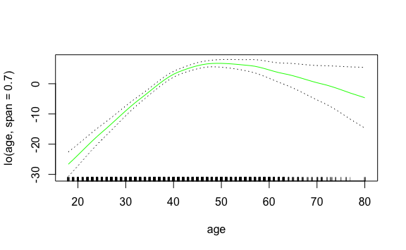
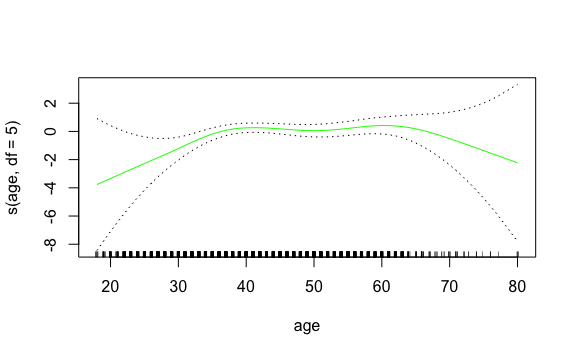

Lab 7 Non-Linear Modeling
================
Evan Woods
2023-12-18

                    Estimate Std. Error    t value     Pr(>|t|)
    (Intercept)    111.70361  0.7287409 153.283015 0.000000e+00
    poly(age, 4)1  447.06785 39.9147851  11.200558 1.484604e-28
    poly(age, 4)2 -478.31581 39.9147851 -11.983424 2.355831e-32
    poly(age, 4)3  125.52169 39.9147851   3.144742 1.678622e-03
    poly(age, 4)4  -77.91118 39.9147851  -1.951938 5.103865e-02

                                   Estimate   Std. Error   t value     Pr(>|t|)
    (Intercept)               -1.841542e+02 6.004038e+01 -3.067172 0.0021802539
    poly(age, 4, raw = TRUE)1  2.124552e+01 5.886748e+00  3.609042 0.0003123618
    poly(age, 4, raw = TRUE)2 -5.638593e-01 2.061083e-01 -2.735743 0.0062606446
    poly(age, 4, raw = TRUE)3  6.810688e-03 3.065931e-03  2.221409 0.0263977518
    poly(age, 4, raw = TRUE)4 -3.203830e-05 1.641359e-05 -1.951938 0.0510386498

      (Intercept)           age      I(age^2)      I(age^3)      I(age^4) 
    -1.841542e+02  2.124552e+01 -5.638593e-01  6.810688e-03 -3.203830e-05 

                           (Intercept) cbind(age, age^2, age^3, age^4)age 
                         -1.841542e+02                       2.124552e+01 
       cbind(age, age^2, age^3, age^4)    cbind(age, age^2, age^3, age^4) 
                         -5.638593e-01                       6.810688e-03 
       cbind(age, age^2, age^3, age^4) 
                         -3.203830e-05 

    [1] 6.88658e-11

    Analysis of Variance Table

    Model 1: wage ~ age
    Model 2: wage ~ poly(age, 2)
    Model 3: wage ~ poly(age, 3)
    Model 4: wage ~ poly(age, 4)
    Model 5: wage ~ poly(age, 5)
      Res.Df     RSS Df Sum of Sq        F    Pr(>F)    
    1   2998 5022216                                    
    2   2997 4793430  1    228786 143.5931 < 2.2e-16 ***
    3   2996 4777674  1     15756   9.8888  0.001679 ** 
    4   2995 4771604  1      6070   3.8098  0.051046 .  
    5   2994 4770322  1      1283   0.8050  0.369682    
    ---
    Signif. codes:  0 '***' 0.001 '**' 0.01 '*' 0.05 '.' 0.1 ' ' 1

                    Estimate Std. Error     t value     Pr(>|t|)
    (Intercept)    111.70361  0.7287647 153.2780243 0.000000e+00
    poly(age, 5)1  447.06785 39.9160847  11.2001930 1.491111e-28
    poly(age, 5)2 -478.31581 39.9160847 -11.9830341 2.367734e-32
    poly(age, 5)3  125.52169 39.9160847   3.1446392 1.679213e-03
    poly(age, 5)4  -77.91118 39.9160847  -1.9518743 5.104623e-02
    poly(age, 5)5  -35.81289 39.9160847  -0.8972045 3.696820e-01

    Analysis of Variance Table

    Model 1: wage ~ education + age
    Model 2: wage ~ education + poly(age, 2)
    Model 3: wage ~ education + poly(age, 3)
      Res.Df     RSS Df Sum of Sq        F Pr(>F)    
    1   2994 3867992                                 
    2   2993 3725395  1    142597 114.6969 <2e-16 ***
    3   2992 3719809  1      5587   4.4936 0.0341 *  
    ---
    Signif. codes:  0 '***' 0.001 '**' 0.01 '*' 0.05 '.' 0.1 ' ' 1

## Fitting a Step Function

    (17.9,33.5]   (33.5,49]   (49,64.5] (64.5,80.1] 
            750        1399         779          72 

                            Estimate Std. Error   t value     Pr(>|t|)
    (Intercept)            94.158392   1.476069 63.789970 0.000000e+00
    cut(age, 4)(33.5,49]   24.053491   1.829431 13.148074 1.982315e-38
    cut(age, 4)(49,64.5]   23.664559   2.067958 11.443444 1.040750e-29
    cut(age, 4)(64.5,80.1]  7.640592   4.987424  1.531972 1.256350e-01

## Splines

    [1] 3000    6

    [1] 3000    6

    [1] 33.75 42.00 51.00

    [1] 6.794596

## GAM

    Call:
    lm(formula = wage ~ ns(year, 4) + ns(age, 5) + education, data = Wage)

    Coefficients:
                    (Intercept)                 ns(year, 4)1  
                         46.949                        8.625  
                   ns(year, 4)2                 ns(year, 4)3  
                          3.762                        8.127  
                   ns(year, 4)4                  ns(age, 5)1  
                          6.806                       45.170  
                    ns(age, 5)2                  ns(age, 5)3  
                         38.450                       34.239  
                    ns(age, 5)4                  ns(age, 5)5  
                         48.678                        6.557  
            education2. HS Grad     education3. Some College  
                         10.983                       23.473  
       education4. College Grad  education5. Advanced Degree  
                         38.314                       62.554  

    Call:
    gam(formula = wage ~ s(year, 4) + s(age, 5) + education, data = Wage)

    Degrees of Freedom: 2999 total; 2986 Residual
    Residual Deviance: 3689770 

    Analysis of Deviance Table

    Model 1: wage ~ s(age, 5) + education
    Model 2: wage ~ year + s(age, 5) + education
    Model 3: wage ~ s(year, 4) + s(age, 5) + education
      Resid. Df Resid. Dev Df Deviance       F    Pr(>F)    
    1      2990    3711731                                  
    2      2989    3693842  1  17889.2 14.4771 0.0001447 ***
    3      2986    3689770  3   4071.1  1.0982 0.3485661    
    ---
    Signif. codes:  0 '***' 0.001 '**' 0.01 '*' 0.05 '.' 0.1 ' ' 1

    Call: gam(formula = wage ~ s(year, 4) + s(age, 5) + education, data = Wage)
    Deviance Residuals:
        Min      1Q  Median      3Q     Max 
    -119.43  -19.70   -3.33   14.17  213.48 

    (Dispersion Parameter for gaussian family taken to be 1235.69)

        Null Deviance: 5222086 on 2999 degrees of freedom
    Residual Deviance: 3689770 on 2986 degrees of freedom
    AIC: 29887.75 

    Number of Local Scoring Iterations: NA 

    Anova for Parametric Effects
                 Df  Sum Sq Mean Sq F value    Pr(>F)    
    s(year, 4)    1   27162   27162  21.981 2.877e-06 ***
    s(age, 5)     1  195338  195338 158.081 < 2.2e-16 ***
    education     4 1069726  267432 216.423 < 2.2e-16 ***
    Residuals  2986 3689770    1236                      
    ---
    Signif. codes:  0 '***' 0.001 '**' 0.01 '*' 0.05 '.' 0.1 ' ' 1

    Anova for Nonparametric Effects
                Npar Df Npar F  Pr(F)    
    (Intercept)                          
    s(year, 4)        3  1.086 0.3537    
    s(age, 5)         4 32.380 <2e-16 ***
    education                            
    ---
    Signif. codes:  0 '***' 0.001 '**' 0.01 '*' 0.05 '.' 0.1 ' ' 1

                        
    education            FALSE TRUE
      1. < HS Grad         268    0
      2. HS Grad           966    5
      3. Some College      643    7
      4. College Grad      663   22
      5. Advanced Degree   381   45

