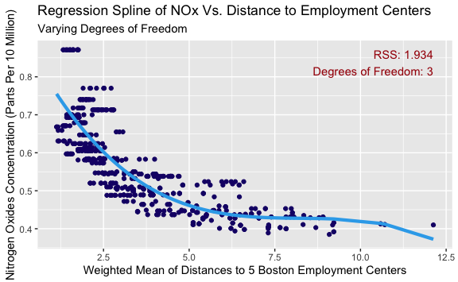
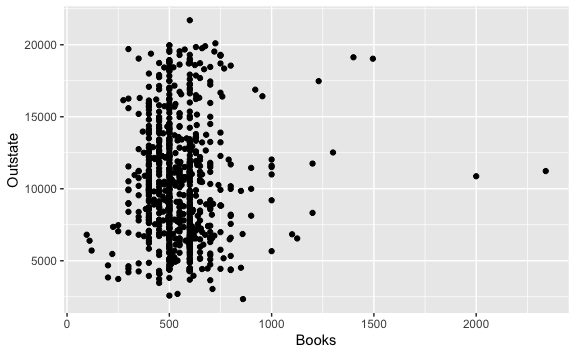

Lab 7 Non-Linear Modeling Exercises
================
Evan Woods
2023-12-21

## Applied

### Question 6:

In this exercise, you will further analyze the Wage data set considered
throughout this chapter.

- **Question 6-a**: Perform polynomial regression to predict wage using
  age. Use cross-validation to select the optimal degree *d* for the
  polynomial. What degree was chosen, and how does this compare to the
  results of hypothesis testing using ANOVA? Make a plot of the
  resulting polynomial fit to the data.
  - **Answer**:

<!-- -->

    Analysis of Variance Table

    Model  1: wage ~ poly(age, 1)
    Model  2: wage ~ poly(age, 2)
    Model  3: wage ~ poly(age, 3)
    Model  4: wage ~ poly(age, 4)
    Model  5: wage ~ poly(age, 5)
    Model  6: wage ~ poly(age, 6)
    Model  7: wage ~ poly(age, 7)
    Model  8: wage ~ poly(age, 8)
    Model  9: wage ~ poly(age, 9)
    Model 10: wage ~ poly(age, 10)
       Res.Df     RSS Df Sum of Sq        F    Pr(>F)    
    1    2998 5022216                                    
    2    2997 4793430  1    228786 143.7638 < 2.2e-16 ***
    3    2996 4777674  1     15756   9.9005  0.001669 ** 
    4    2995 4771604  1      6070   3.8143  0.050909 .  
    5    2994 4770322  1      1283   0.8059  0.369398    
    6    2993 4766389  1      3932   2.4709  0.116074    
    7    2992 4763834  1      2555   1.6057  0.205199    
    8    2991 4763707  1       127   0.0796  0.777865    
    9    2990 4756703  1      7004   4.4014  0.035994 *  
    10   2989 4756701  1         3   0.0017  0.967529    
    ---
    Signif. codes:  0 '***' 0.001 '**' 0.01 '*' 0.05 '.' 0.1 ' ' 1

    The model of degree 9 was chosen as the model with the lowest test error when
    tested using cross-validation.

    The model of degree 9 is a reasonable fit to the data when examined using the
    ANOVA test.

- **Question 6-b**: Fit a step function to predict wage using age, and
  perform cross-validation to choose the optimal number of cuts. Make a
  plot of the fit obtained.
  - **Answer**:

### Question 7:

The Wage data set contains a number of other features not explored in
this chapter, such as marital status (maritl), job class (jobclass), and
others. Explore the relationships between these other predictors and
wage, and use non-linear fitting techniques in order to fit flexible
models to the data. Create plots of the results obtained, and write a
summary of your findings.

    [1] "1. Never Married" "2. Married"       "3. Widowed"       "4. Divorced"     
    [5] "5. Separated"    

    There is a strong relationship between marital status & Information job class
    with respect to higher wages. Those that have never been married have the lowest
    wages whereas those that have been divorced or separated are associated with
    wages that are higher than those that have never been married but lower than
    those that have been married. There is a positive trend with increasing years
    with respect to wage.

### Question 8:

Fit the non-linear models investigated in this chapter to the Auto data
set. Is there evidence for non-linear relationships in this data set?
Create informative plots to justify your answer.

      mpg cylinders displacement horsepower weight acceleration year origin
    1  18         8          307        130   3504         12.0   70      1
    2  15         8          350        165   3693         11.5   70      1
    3  18         8          318        150   3436         11.0   70      1
    4  16         8          304        150   3433         12.0   70      1
    5  17         8          302        140   3449         10.5   70      1
    6  15         8          429        198   4341         10.0   70      1
                           name
    1 chevrolet chevelle malibu
    2         buick skylark 320
    3        plymouth satellite
    4             amc rebel sst
    5               ford torino
    6          ford galaxie 500

### Question 9:

This question uses the variables dis (the weighted mean of distances to
five Boston employment centers) and nox (nitrogen oxides concen- tration
in parts per 10 million) from the Boston data. We will treat dis as the
predictor and nox as the response.

- **Question 9-a**: Use the poly() function to fit a cubic polynomial
  regression to predict nox using dis. Report the regression output, and
  plot the resulting data and polynomial fits.
  - **Answer**:

<!-- -->

    Call:
    lm(formula = nox ~ poly(dis, 4))

    Residuals:
         Min       1Q   Median       3Q      Max 
    -0.12295 -0.04089 -0.01073  0.02290  0.19471 

    Coefficients:
                   Estimate Std. Error t value Pr(>|t|)    
    (Intercept)    0.554695   0.002761  200.88  < 2e-16 ***
    poly(dis, 4)1 -2.003096   0.062115  -32.25  < 2e-16 ***
    poly(dis, 4)2  0.856330   0.062115   13.79  < 2e-16 ***
    poly(dis, 4)3 -0.318049   0.062115   -5.12 4.36e-07 ***
    poly(dis, 4)4  0.033547   0.062115    0.54    0.589    
    ---
    Signif. codes:  0 '***' 0.001 '**' 0.01 '*' 0.05 '.' 0.1 ' ' 1

    Residual standard error: 0.06211 on 501 degrees of freedom
    Multiple R-squared:  0.7149,    Adjusted R-squared:  0.7127 
    F-statistic: 314.1 on 4 and 501 DF,  p-value: < 2.2e-16

- **Question 9-b**: Plot the polynomial fits for a range of different
  polynomial degrees (say, from 1 to 10), and report the associated
  residual sum of squares.
  - **Answer**:

- **Question 9-c**: Perform cross-validation or another approach to
  select the opti- mal degree for the polynomial, and explain your
  results.
  - **Answer**:

<!-- -->

    A training and testing validation set was used to identify the optimal value of
    the highest degree of the polynomial used to pred nox regressed onto weighted
    mean distance to 5 boston employment centers. The optimal value of the degree
    of polynomial which creates the lowest mse is 2 with a test mse value of 0.005.
    This is supported by the graph Polynomial of NOx Vs. Distance to Employment
    Centers where the highest degree of the polynomial is 2. It is observable in
    the remaining graphs that degrees above 2 have high variance and fit too closely
    to the data. And the resulting decrease in variance is not outweighed by the
    increase in bias gained from using the linear model of degree 1.

- **Question 9-d**:Use the bs() function to fit a regression spline to
  predict nox using dis. Report the output for the fit using four
  degrees of freedom. How did you choose the knots? Plot the resulting
  fit
  - **Answer**:

<!-- -->

    Call:
    lm(formula = nox ~ bs(dis, df = 4))

    Residuals:
          Min        1Q    Median        3Q       Max 
    -0.124622 -0.039259 -0.008514  0.020850  0.193891 

    Coefficients:
                     Estimate Std. Error t value Pr(>|t|)    
    (Intercept)       0.73447    0.01460  50.306  < 2e-16 ***
    bs(dis, df = 4)1 -0.05810    0.02186  -2.658  0.00812 ** 
    bs(dis, df = 4)2 -0.46356    0.02366 -19.596  < 2e-16 ***
    bs(dis, df = 4)3 -0.19979    0.04311  -4.634 4.58e-06 ***
    bs(dis, df = 4)4 -0.38881    0.04551  -8.544  < 2e-16 ***
    ---
    Signif. codes:  0 '***' 0.001 '**' 0.01 '*' 0.05 '.' 0.1 ' ' 1

    Residual standard error: 0.06195 on 501 degrees of freedom
    Multiple R-squared:  0.7164,    Adjusted R-squared:  0.7142 
    F-statistic: 316.5 on 4 and 501 DF,  p-value: < 2.2e-16

    The output for the fit using four degrees of freedom is observable from the
    summary above. The knots where selected automatically using the selected 4
    degrees of freedom.

- **Question 9-e**: Now fit a regression spline for a range of degrees
  of freedom, and plot the resulting fits and report the resulting RSS.
  Describe the results obtained.
  - **Answer**:
    
- **Question 9-f**: Perform cross-validation or another approach in
  order to select the best degrees of freedom for a regression spline on
  this data. Describe your results.
  - **Answer**:

<!-- -->

    The degree of freedom that promotes the minimum mean squared error for the
    created regression spline is: 3 degrees of freedom. The calculated test mse is:
    0.0056794.

### Question 10:

This question relates to the College data set.

- **Question 10-a**: Split the data into a training set and a test set.
  Using out-of-state tuition as the response and the other variables as
  the predictors, perform forward stepwise selection on the training set
  in order to identify a satisfactory model that uses just a subset of
  the predictors.

    Subset selection object
    Call: regsubsets.formula(Outstate ~ ., data = college, subset = train, 
        method = "forward", nvmax = length(college) - 1)
    17 Variables  (and intercept)
                Forced in Forced out
    PrivateYes      FALSE      FALSE
    Apps            FALSE      FALSE
    Accept          FALSE      FALSE
    Enroll          FALSE      FALSE
    Top10perc       FALSE      FALSE
    Top25perc       FALSE      FALSE
    F.Undergrad     FALSE      FALSE
    P.Undergrad     FALSE      FALSE
    Room.Board      FALSE      FALSE
    Books           FALSE      FALSE
    Personal        FALSE      FALSE
    PhD             FALSE      FALSE
    Terminal        FALSE      FALSE
    S.F.Ratio       FALSE      FALSE
    perc.alumni     FALSE      FALSE
    Expend          FALSE      FALSE
    Grad.Rate       FALSE      FALSE
    1 subsets of each size up to 17
    Selection Algorithm: forward
              PrivateYes Apps Accept Enroll Top10perc Top25perc F.Undergrad
    1  ( 1 )  " "        " "  " "    " "    " "       " "       " "        
    2  ( 1 )  "*"        " "  " "    " "    " "       " "       " "        
    3  ( 1 )  "*"        " "  " "    " "    " "       " "       " "        
    4  ( 1 )  "*"        " "  " "    " "    " "       " "       " "        
    5  ( 1 )  "*"        " "  " "    " "    " "       " "       " "        
    6  ( 1 )  "*"        " "  " "    " "    " "       " "       " "        
    7  ( 1 )  "*"        " "  " "    " "    " "       " "       " "        
    8  ( 1 )  "*"        " "  " "    " "    " "       " "       " "        
    9  ( 1 )  "*"        " "  "*"    " "    " "       " "       " "        
    10  ( 1 ) "*"        "*"  "*"    " "    " "       " "       " "        
    11  ( 1 ) "*"        "*"  "*"    "*"    " "       " "       " "        
    12  ( 1 ) "*"        "*"  "*"    "*"    "*"       " "       " "        
    13  ( 1 ) "*"        "*"  "*"    "*"    "*"       " "       " "        
    14  ( 1 ) "*"        "*"  "*"    "*"    "*"       " "       " "        
    15  ( 1 ) "*"        "*"  "*"    "*"    "*"       " "       "*"        
    16  ( 1 ) "*"        "*"  "*"    "*"    "*"       " "       "*"        
    17  ( 1 ) "*"        "*"  "*"    "*"    "*"       "*"       "*"        
              P.Undergrad Room.Board Books Personal PhD Terminal S.F.Ratio
    1  ( 1 )  " "         " "        " "   " "      " " " "      " "      
    2  ( 1 )  " "         " "        " "   " "      " " " "      " "      
    3  ( 1 )  " "         "*"        " "   " "      " " " "      " "      
    4  ( 1 )  " "         "*"        " "   " "      " " " "      " "      
    5  ( 1 )  " "         "*"        " "   " "      "*" " "      " "      
    6  ( 1 )  " "         "*"        " "   " "      "*" " "      " "      
    7  ( 1 )  " "         "*"        " "   "*"      "*" " "      " "      
    8  ( 1 )  " "         "*"        " "   "*"      "*" "*"      " "      
    9  ( 1 )  " "         "*"        " "   "*"      "*" "*"      " "      
    10  ( 1 ) " "         "*"        " "   "*"      "*" "*"      " "      
    11  ( 1 ) " "         "*"        " "   "*"      "*" "*"      " "      
    12  ( 1 ) " "         "*"        " "   "*"      "*" "*"      " "      
    13  ( 1 ) " "         "*"        "*"   "*"      "*" "*"      " "      
    14  ( 1 ) " "         "*"        "*"   "*"      "*" "*"      "*"      
    15  ( 1 ) " "         "*"        "*"   "*"      "*" "*"      "*"      
    16  ( 1 ) "*"         "*"        "*"   "*"      "*" "*"      "*"      
    17  ( 1 ) "*"         "*"        "*"   "*"      "*" "*"      "*"      
              perc.alumni Expend Grad.Rate
    1  ( 1 )  " "         "*"    " "      
    2  ( 1 )  " "         "*"    " "      
    3  ( 1 )  " "         "*"    " "      
    4  ( 1 )  "*"         "*"    " "      
    5  ( 1 )  "*"         "*"    " "      
    6  ( 1 )  "*"         "*"    "*"      
    7  ( 1 )  "*"         "*"    "*"      
    8  ( 1 )  "*"         "*"    "*"      
    9  ( 1 )  "*"         "*"    "*"      
    10  ( 1 ) "*"         "*"    "*"      
    11  ( 1 ) "*"         "*"    "*"      
    12  ( 1 ) "*"         "*"    "*"      
    13  ( 1 ) "*"         "*"    "*"      
    14  ( 1 ) "*"         "*"    "*"      
    15  ( 1 ) "*"         "*"    "*"      
    16  ( 1 ) "*"         "*"    "*"      
    17  ( 1 ) "*"         "*"    "*"      

    The model that implements forward stepping and minimizes the means squared
    error is model 16. The test mean squared error of this model is: 4037736.564.
    This model is comprised of the following predictors: Private, Apps, Accept,
    Enroll, Top10perc, F. Undergrad, P. Undergrad, Room.Board, Books, Personal, PhD
    Terminal, S.F. Ratio, perc.alumni, Expend, & Graduation Rate.

- **Question 10-b**: Fit a GAM on the training data, using out-of-state
  tuition as the response and the features selected in the previous step
  as the predictors. Plot the results, and explain your findings.
  - **Answer**:

<!-- -->

     [1] "Private"     "Apps"        "Accept"      "Enroll"      "Top10perc"  
     [6] "Top25perc"   "F.Undergrad" "P.Undergrad" "Outstate"    "Room.Board" 
    [11] "Books"       "Personal"    "PhD"         "Terminal"    "S.F.Ratio"  
    [16] "perc.alumni" "Expend"      "Grad.Rate"  

    Not only are private universities associated with higher out-of-state tuition,
    but there is also an increase in the number of applications accepted, the
    percent of students from the top 10% of the high school graduating class,
    the cost of room and board, the percent of faculty with Ph.D.'s, the percent
    of faculty with terminal degrees, the percent of alumni who donate, the
    instructional expenditure per student, the student faculty ratio, and the
    graduation rate. However, increases in out-of-state tuition fees are also
    associated with a decrease in the number of applications, the number of new
    students enrolled, the number of fulltime undergraduates, the number of part
    time undergraduates, estimated book costs, and estimated personal spending.

- **Question 10-c**: Evaluate the model obtained on the test set, and
  explain the results obtained.
  - **Answer**:

<!-- -->

    THe test mse is: 3790761.501. This value is the sum of the squares of the
    residual test observations divided by the number of observation in the test
    set. The test error is higher on the test set than for the training set. This is
    expected as the training error tends to underestimate the test error.

- **Question 10-d**: For which variables, if any, is there evidence of a
  non-linear relationship with the response?
  - **Answer**:

<!-- -->

                                 Private Apps Accept Enroll Top10perc Top25perc
    Abilene Christian University     Yes 1660   1232    721        23        52
    Adelphi University               Yes 2186   1924    512        16        29
    Adrian College                   Yes 1428   1097    336        22        50
    Agnes Scott College              Yes  417    349    137        60        89
    Alaska Pacific University        Yes  193    146     55        16        44
    Albertson College                Yes  587    479    158        38        62
                                 F.Undergrad P.Undergrad Outstate Room.Board Books
    Abilene Christian University        2885         537     7440       3300   450
    Adelphi University                  2683        1227    12280       6450   750
    Adrian College                      1036          99    11250       3750   400
    Agnes Scott College                  510          63    12960       5450   450
    Alaska Pacific University            249         869     7560       4120   800
    Albertson College                    678          41    13500       3335   500
                                 Personal PhD Terminal S.F.Ratio perc.alumni Expend
    Abilene Christian University     2200  70       78      18.1          12   7041
    Adelphi University               1500  29       30      12.2          16  10527
    Adrian College                   1165  53       66      12.9          30   8735
    Agnes Scott College               875  92       97       7.7          37  19016
    Alaska Pacific University        1500  76       72      11.9           2  10922
    Albertson College                 675  67       73       9.4          11   9727
                                 Grad.Rate
    Abilene Christian University        60
    Adelphi University                  56
    Adrian College                      54
    Agnes Scott College                 59
    Alaska Pacific University           15
    Albertson College                   55

    It appears from the plots above that there is evidence of a non-linear
    relationship between Ph.D.'s, terminal degrees, and student faculty ratio with
    respect to out-of-state tuition.

### Question 11: In Section 7.7, it was mentioned that GAMs are generally fit using

a backfitting approach. The idea behind backfitting is actually quite
simple. We will now explore backfitting in the context of multiple
linear regression. Suppose that we would like to perform multiple linear
regression, but we do not have software to do so. Instead, we only have
software to perform simple linear regression. Therefore, we take the
following iterative approach: we repeatedly hold all but one coefficient
esti- mate fixed at its current value, and update only that coefficient
estimate using a simple linear regression. The process is continued un-
til convergence—that is, until the coefficient estimates stop changing.
View the following example:

- **Question 11-a**: Generate a response Y and two predictors
  X1 and X2, with n = 100
- **Question 11-b**: Initialize βˆ1 to take on a value of your choice.
  It does not matter what value you choose.
- **Question 11-c**: Keeping ˆβ1 fixed, fit the model Y − ˆβ1X1 = β0 +
  β2X2 + ε.
- **Question 11-d**: Keeping ˆβ2 fixed, fit the model Y − ˆβ2X2 = β0 +
  β1X1 + ε.
- **Question 11-e**: Write a for loop to repeat (c) and (d) 1,000 times.
  Report the estimates of ˆβ0, ˆβ1, and ˆβ2 at each iteration of the for
  loop. Create a plot in which each of these values is displayed, with
  ˆβ0, ˆβ1, and ˆβ2 each shown in a different color.
- **Question 11-f**: Compare your answer in (e) to the results of simply
  performing multiple linear regression to predict Y using X1 and X2.
  Use the abline() function to overlay those multiple linear regression
  coefficient estimates on the plot obtained in (e).
- **Question 11-g**: On this data set, how many backfitting iterations
  were required in order to obtain a “good” approximation to the
  multiple re- gression coefficient estimates?

<!-- -->

    Iteration 1: βˆ0: 0.9917584 βˆ1: 1.8593666 βˆ2: 2.9720389

    Iteration 2: βˆ0: 1.0017565 βˆ1: 1.8562938 βˆ2: 3.0851824

    Iteration 3: βˆ0: 1.0017663 βˆ1: 1.8562908 βˆ2: 3.0852931

    Iteration 4: βˆ0: 1.0017663 βˆ1: 1.8562908 βˆ2: 3.0852932

    Coefficient Estimates β0, β1, & β2 fit to near the true value of the
    coefficients in the true value of ƒ in the first 2 iterations. This is
    observable from the value of the initial point displayed on the plot followed by
    the constant values of the estimated coefficients in the subsequent iterations.
    This is expected behavior of a model that is generated using the backfitting
    approach. The estimated coefficients generated from a mulitple linear regression
    are displayed with each backfit estimated coefficient as purple horizontal lines
    for reference.

- **Question 12**: This problem is a continuation of the previous
  exercise. In an example with p = 100, show that one can approximate
  the multiple linear regression coefficient estimates by repeatedly
  performing simple linear regression in a backfitting procedure. How
  many backfitting iterations are required in order to obtain a “good”
  approximation to the multiple regression coefficient estimates? Create
  a plot to justify your answer.
  - **Answer**: A good approximation to multiple regression coefficient
    estimates is observable after 3 iterations of the backfitting
    procedure when the number of predictors is restricted to 2 or 3.
    However, after fitting 100 predictors, the model immediately fits
    and does not subsequently change. There is significant error between
    the true value of the coefficients and the collected estimated
    coefficients. The response does apparently change, and the methods
    used are the same as when there are fewer predictors, yet the linear
    model is producing estimates that are no different even though the
    formula alters the predictors that is backfit and the same
    predictors is excluded from the dataframe. Multiple attempts have
    been made to investigate and resolve this issue including
    investigating predictors, estimated outputs, and wrangling the data.

<!-- -->

         (Intercept) predictors[, -1] 
           0.8896412        2.9720389 

         (Intercept) predictors[, -2] 
           0.9917584        1.8593666 

    [1] 0.9917584

    [1] 1.859367

    [1] 2.972039

    [1] 6.792474e-05

    [1] 0.01977774

    [1] 0.0007818241

      [1]  -0.66352470   5.10020788   3.44092230  16.78440003  -5.84570260
      [6]  -3.55701719   0.41536024  -2.77964808   1.77205614   0.45705528
     [11]  -1.34138873  13.28647698  -3.83728749  -2.03739328  -1.68065363
     [16]   0.85823770  -2.41969657   9.86332817 -10.07211763  -0.03653969
     [21]  -3.03607624  -8.19084677  -1.00590559  -3.83333348   8.30776474
     [26]  -2.66711580   1.85258778  -9.50624763  -5.22326865   5.19074234
     [31]   3.27347886   4.29733186  -2.50801626   1.43911590   6.24066874
     [36]  -7.36267863   3.08692480   1.50494530  -5.02909596  -3.38175820
     [41]  -1.78462087   2.27762205   5.78158408   3.33983068  -7.89361084
     [46]  13.68109387   3.15907351   0.79934471   5.12944553  -3.38998850
     [51]  -2.13869606  -5.85866337   3.59150875   1.35301063   4.51341141
     [56]  -5.10961610  -0.90861680  -0.20637886 -10.94826934   2.32329340
     [61]   2.38115905   0.94477417   3.70436419  -5.03127545   0.94611169
     [66]  11.91819668   3.83860090   2.29169886  -8.11839222   5.72140116
     [71]   2.14787676   3.60122065  -1.11933039   4.24303600   2.36883389
     [76]   6.25901776  -0.20552140  -2.22353856   6.33820014   5.38454612
     [81]  10.19824091  -7.96383055   0.49201639   5.57274695  -2.24720470
     [86]  -0.61084175  12.20156300  -0.37861212  -6.69759817  -0.35781741
     [91]   1.96890914   0.49468251   0.30734202   8.19889852  -4.87316948
     [96]   1.72291081  -0.27518553   3.53230444   6.73940473  -2.87856109

          (Intercept) predictors[, -1]1 predictors[, -1]2 
            0.9280591         2.8671702         4.4135268 

          (Intercept) predictors[, -1]1 predictors[, -1]2 
             1.003046          2.969859          4.090847 

          (Intercept) predictors[, -2]1 predictors[, -2]2 
             1.028075          2.059191          3.971070 

          (Intercept) predictors[, -3]1 predictors[, -3]2 
             1.031499          2.058139          3.008601 

    [1] 0.000000 0.000000 0.000000 0.000000 1.031499

    [1] 0.000000 0.000000 0.000000 0.000000 2.058139

    [1] 0.000000 0.000000 0.000000 0.000000 3.008601

    [1] 0.00000 0.00000 0.00000 0.00000 3.97107

    [1] 0.000992158

    [1] 0.003380167

    [1] 7.397013e-05

    [1] 0.0008369439

    [1] 1

    [1] 2

    [1] 3

    [1] 4

    predictors[, -3]2 
             3.008601 

    (Intercept)          X1          X2 
       1.033199    1.919823    3.090693 

          X1 
    1.919823 

    (Intercept)          X2          X3 
       1.036353    3.015470    3.947521 

    Iteration 1: βˆ0: 1.027 βˆ1: 1.491 βˆ2: 3.221

    Iteration 2: βˆ0: 1.039 βˆ1: 1.487 βˆ2: 3.347

    Iteration 3: βˆ0: 1.039 βˆ1: 1.487 βˆ2: 3.347

    Iteration 4: βˆ0: 1.039 βˆ1: 1.487 βˆ2: 3.347

    Iteration 5: βˆ0: 1.039 βˆ1: 1.487 βˆ2: 3.347

    Iteration 6: βˆ0: 1.039 βˆ1: 1.487 βˆ2: 3.347

    Iteration 7: βˆ0: 1.039 βˆ1: 1.487 βˆ2: 3.347

    Iteration 8: βˆ0: 1.039 βˆ1: 1.487 βˆ2: 3.347

    Iteration 9: βˆ0: 1.039 βˆ1: 1.487 βˆ2: 3.347

    Iteration 10: βˆ0: 1.039 βˆ1: 1.487 βˆ2: 3.347

    Iteration 11: βˆ0: 1.039 βˆ1: 1.487 βˆ2: 3.347

    Iteration 12: βˆ0: 1.039 βˆ1: 1.487 βˆ2: 3.347

    Iteration 13: βˆ0: 1.039 βˆ1: 1.487 βˆ2: 3.347

    Iteration 14: βˆ0: 1.039 βˆ1: 1.487 βˆ2: 3.347

    Iteration 15: βˆ0: 1.039 βˆ1: 1.487 βˆ2: 3.347

    Iteration 16: βˆ0: 1.039 βˆ1: 1.487 βˆ2: 3.347

    Iteration 17: βˆ0: 1.039 βˆ1: 1.487 βˆ2: 3.347

    Iteration 18: βˆ0: 1.039 βˆ1: 1.487 βˆ2: 3.347

    Iteration 19: βˆ0: 1.039 βˆ1: 1.487 βˆ2: 3.347

    Iteration 20: βˆ0: 1.039 βˆ1: 1.487 βˆ2: 3.347

    Iteration 21: βˆ0: 1.039 βˆ1: 1.487 βˆ2: 3.347

    Iteration 22: βˆ0: 1.039 βˆ1: 1.487 βˆ2: 3.347

    Iteration 23: βˆ0: 1.039 βˆ1: 1.487 βˆ2: 3.347

    Iteration 24: βˆ0: 1.039 βˆ1: 1.487 βˆ2: 3.347

    Iteration 25: βˆ0: 1.039 βˆ1: 1.487 βˆ2: 3.347

    Iteration 26: βˆ0: 1.039 βˆ1: 1.487 βˆ2: 3.347

    Iteration 27: βˆ0: 1.039 βˆ1: 1.487 βˆ2: 3.347

    Iteration 28: βˆ0: 1.039 βˆ1: 1.487 βˆ2: 3.347

    Iteration 29: βˆ0: 1.039 βˆ1: 1.487 βˆ2: 3.347

    Iteration 30: βˆ0: 1.039 βˆ1: 1.487 βˆ2: 3.347

    Iteration 31: βˆ0: 1.039 βˆ1: 1.487 βˆ2: 3.347

    Iteration 32: βˆ0: 1.039 βˆ1: 1.487 βˆ2: 3.347

    Iteration 33: βˆ0: 1.039 βˆ1: 1.487 βˆ2: 3.347

    Iteration 34: βˆ0: 1.039 βˆ1: 1.487 βˆ2: 3.347

    Iteration 35: βˆ0: 1.039 βˆ1: 1.487 βˆ2: 3.347

    Iteration 36: βˆ0: 1.039 βˆ1: 1.487 βˆ2: 3.347

    Iteration 37: βˆ0: 1.039 βˆ1: 1.487 βˆ2: 3.347

    Iteration 38: βˆ0: 1.039 βˆ1: 1.487 βˆ2: 3.347

    Iteration 39: βˆ0: 1.039 βˆ1: 1.487 βˆ2: 3.347

    Iteration 40: βˆ0: 1.039 βˆ1: 1.487 βˆ2: 3.347

    Iteration 41: βˆ0: 1.039 βˆ1: 1.487 βˆ2: 3.347

    Iteration 42: βˆ0: 1.039 βˆ1: 1.487 βˆ2: 3.347

    Iteration 43: βˆ0: 1.039 βˆ1: 1.487 βˆ2: 3.347

    Iteration 44: βˆ0: 1.039 βˆ1: 1.487 βˆ2: 3.347

    Iteration 45: βˆ0: 1.039 βˆ1: 1.487 βˆ2: 3.347

    Iteration 46: βˆ0: 1.039 βˆ1: 1.487 βˆ2: 3.347

    Iteration 47: βˆ0: 1.039 βˆ1: 1.487 βˆ2: 3.347

    Iteration 48: βˆ0: 1.039 βˆ1: 1.487 βˆ2: 3.347

    Iteration 49: βˆ0: 1.039 βˆ1: 1.487 βˆ2: 3.347

    Iteration 50: βˆ0: 1.039 βˆ1: 1.487 βˆ2: 3.347

    Iteration 51: βˆ0: 1.039 βˆ1: 1.487 βˆ2: 3.347

    Iteration 52: βˆ0: 1.039 βˆ1: 1.487 βˆ2: 3.347

    Iteration 53: βˆ0: 1.039 βˆ1: 1.487 βˆ2: 3.347

    Iteration 54: βˆ0: 1.039 βˆ1: 1.487 βˆ2: 3.347

    Iteration 55: βˆ0: 1.039 βˆ1: 1.487 βˆ2: 3.347

    Iteration 56: βˆ0: 1.039 βˆ1: 1.487 βˆ2: 3.347

    Iteration 57: βˆ0: 1.039 βˆ1: 1.487 βˆ2: 3.347

    Iteration 58: βˆ0: 1.039 βˆ1: 1.487 βˆ2: 3.347

    Iteration 59: βˆ0: 1.039 βˆ1: 1.487 βˆ2: 3.347

    Iteration 60: βˆ0: 1.039 βˆ1: 1.487 βˆ2: 3.347

    Iteration 61: βˆ0: 1.039 βˆ1: 1.487 βˆ2: 3.347

    Iteration 62: βˆ0: 1.039 βˆ1: 1.487 βˆ2: 3.347

    Iteration 63: βˆ0: 1.039 βˆ1: 1.487 βˆ2: 3.347

    Iteration 64: βˆ0: 1.039 βˆ1: 1.487 βˆ2: 3.347

    Iteration 65: βˆ0: 1.039 βˆ1: 1.487 βˆ2: 3.347

    Iteration 66: βˆ0: 1.039 βˆ1: 1.487 βˆ2: 3.347

    Iteration 67: βˆ0: 1.039 βˆ1: 1.487 βˆ2: 3.347

    Iteration 68: βˆ0: 1.039 βˆ1: 1.487 βˆ2: 3.347

    Iteration 69: βˆ0: 1.039 βˆ1: 1.487 βˆ2: 3.347

    Iteration 70: βˆ0: 1.039 βˆ1: 1.487 βˆ2: 3.347

    Iteration 71: βˆ0: 1.039 βˆ1: 1.487 βˆ2: 3.347

    Iteration 72: βˆ0: 1.039 βˆ1: 1.487 βˆ2: 3.347

    Iteration 73: βˆ0: 1.039 βˆ1: 1.487 βˆ2: 3.347

    Iteration 74: βˆ0: 1.039 βˆ1: 1.487 βˆ2: 3.347

    Iteration 75: βˆ0: 1.039 βˆ1: 1.487 βˆ2: 3.347

    Iteration 76: βˆ0: 1.039 βˆ1: 1.487 βˆ2: 3.347

    Iteration 77: βˆ0: 1.039 βˆ1: 1.487 βˆ2: 3.347

    Iteration 78: βˆ0: 1.039 βˆ1: 1.487 βˆ2: 3.347

    Iteration 79: βˆ0: 1.039 βˆ1: 1.487 βˆ2: 3.347

    Iteration 80: βˆ0: 1.039 βˆ1: 1.487 βˆ2: 3.347

    Iteration 81: βˆ0: 1.039 βˆ1: 1.487 βˆ2: 3.347

    Iteration 82: βˆ0: 1.039 βˆ1: 1.487 βˆ2: 3.347

    Iteration 83: βˆ0: 1.039 βˆ1: 1.487 βˆ2: 3.347

    Iteration 84: βˆ0: 1.039 βˆ1: 1.487 βˆ2: 3.347

    Iteration 85: βˆ0: 1.039 βˆ1: 1.487 βˆ2: 3.347

    Iteration 86: βˆ0: 1.039 βˆ1: 1.487 βˆ2: 3.347

    Iteration 87: βˆ0: 1.039 βˆ1: 1.487 βˆ2: 3.347

    Iteration 88: βˆ0: 1.039 βˆ1: 1.487 βˆ2: 3.347

    Iteration 89: βˆ0: 1.039 βˆ1: 1.487 βˆ2: 3.347

    Iteration 90: βˆ0: 1.039 βˆ1: 1.487 βˆ2: 3.347

    Iteration 91: βˆ0: 1.039 βˆ1: 1.487 βˆ2: 3.347

    Iteration 92: βˆ0: 1.039 βˆ1: 1.487 βˆ2: 3.347

    Iteration 93: βˆ0: 1.039 βˆ1: 1.487 βˆ2: 3.347

    Iteration 94: βˆ0: 1.039 βˆ1: 1.487 βˆ2: 3.347

    Iteration 95: βˆ0: 1.039 βˆ1: 1.487 βˆ2: 3.347

    Iteration 96: βˆ0: 1.039 βˆ1: 1.487 βˆ2: 3.347

    Iteration 97: βˆ0: 1.039 βˆ1: 1.487 βˆ2: 3.347

    Iteration 98: βˆ0: 1.039 βˆ1: 1.487 βˆ2: 3.347

    Iteration 99: βˆ0: 1.039 βˆ1: 1.487 βˆ2: 3.347

    Iteration 100: βˆ0: 1.039 βˆ1: 1.487 βˆ2: 3.347

    Iteration 101: βˆ0: 1.039 βˆ1: 1.487 βˆ2: 3.347

    Iteration 102: βˆ0: 1.039 βˆ1: 1.487 βˆ2: 3.347

    Iteration 103: βˆ0: 1.039 βˆ1: 1.487 βˆ2: 3.347

    Iteration 104: βˆ0: 1.039 βˆ1: 1.487 βˆ2: 3.347

    Iteration 105: βˆ0: 1.039 βˆ1: 1.487 βˆ2: 3.347

    Iteration 106: βˆ0: 1.039 βˆ1: 1.487 βˆ2: 3.347

    Iteration 107: βˆ0: 1.039 βˆ1: 1.487 βˆ2: 3.347

    Iteration 108: βˆ0: 1.039 βˆ1: 1.487 βˆ2: 3.347

    Iteration 109: βˆ0: 1.039 βˆ1: 1.487 βˆ2: 3.347

    Iteration 110: βˆ0: 1.039 βˆ1: 1.487 βˆ2: 3.347

    Iteration 111: βˆ0: 1.039 βˆ1: 1.487 βˆ2: 3.347

    Iteration 112: βˆ0: 1.039 βˆ1: 1.487 βˆ2: 3.347

    Iteration 113: βˆ0: 1.039 βˆ1: 1.487 βˆ2: 3.347

    Iteration 114: βˆ0: 1.039 βˆ1: 1.487 βˆ2: 3.347

    Iteration 115: βˆ0: 1.039 βˆ1: 1.487 βˆ2: 3.347

    Iteration 116: βˆ0: 1.039 βˆ1: 1.487 βˆ2: 3.347

    Iteration 117: βˆ0: 1.039 βˆ1: 1.487 βˆ2: 3.347

    Iteration 118: βˆ0: 1.039 βˆ1: 1.487 βˆ2: 3.347

    Iteration 119: βˆ0: 1.039 βˆ1: 1.487 βˆ2: 3.347

    Iteration 120: βˆ0: 1.039 βˆ1: 1.487 βˆ2: 3.347

    Iteration 121: βˆ0: 1.039 βˆ1: 1.487 βˆ2: 3.347

    Iteration 122: βˆ0: 1.039 βˆ1: 1.487 βˆ2: 3.347

    Iteration 123: βˆ0: 1.039 βˆ1: 1.487 βˆ2: 3.347

    Iteration 124: βˆ0: 1.039 βˆ1: 1.487 βˆ2: 3.347

    Iteration 125: βˆ0: 1.039 βˆ1: 1.487 βˆ2: 3.347

    Iteration 126: βˆ0: 1.039 βˆ1: 1.487 βˆ2: 3.347

    Iteration 127: βˆ0: 1.039 βˆ1: 1.487 βˆ2: 3.347

    Iteration 128: βˆ0: 1.039 βˆ1: 1.487 βˆ2: 3.347

    Iteration 129: βˆ0: 1.039 βˆ1: 1.487 βˆ2: 3.347

    Iteration 130: βˆ0: 1.039 βˆ1: 1.487 βˆ2: 3.347

    Iteration 131: βˆ0: 1.039 βˆ1: 1.487 βˆ2: 3.347

    Iteration 132: βˆ0: 1.039 βˆ1: 1.487 βˆ2: 3.347

    Iteration 133: βˆ0: 1.039 βˆ1: 1.487 βˆ2: 3.347

    Iteration 134: βˆ0: 1.039 βˆ1: 1.487 βˆ2: 3.347

    Iteration 135: βˆ0: 1.039 βˆ1: 1.487 βˆ2: 3.347

    Iteration 136: βˆ0: 1.039 βˆ1: 1.487 βˆ2: 3.347

    Iteration 137: βˆ0: 1.039 βˆ1: 1.487 βˆ2: 3.347

    Iteration 138: βˆ0: 1.039 βˆ1: 1.487 βˆ2: 3.347

    Iteration 139: βˆ0: 1.039 βˆ1: 1.487 βˆ2: 3.347

    Iteration 140: βˆ0: 1.039 βˆ1: 1.487 βˆ2: 3.347

    Iteration 141: βˆ0: 1.039 βˆ1: 1.487 βˆ2: 3.347

    Iteration 142: βˆ0: 1.039 βˆ1: 1.487 βˆ2: 3.347

    Iteration 143: βˆ0: 1.039 βˆ1: 1.487 βˆ2: 3.347

    Iteration 144: βˆ0: 1.039 βˆ1: 1.487 βˆ2: 3.347

    Iteration 145: βˆ0: 1.039 βˆ1: 1.487 βˆ2: 3.347

    Iteration 146: βˆ0: 1.039 βˆ1: 1.487 βˆ2: 3.347

    Iteration 147: βˆ0: 1.039 βˆ1: 1.487 βˆ2: 3.347

    Iteration 148: βˆ0: 1.039 βˆ1: 1.487 βˆ2: 3.347

    Iteration 149: βˆ0: 1.039 βˆ1: 1.487 βˆ2: 3.347

    Iteration 150: βˆ0: 1.039 βˆ1: 1.487 βˆ2: 3.347

    Iteration 151: βˆ0: 1.039 βˆ1: 1.487 βˆ2: 3.347

    Iteration 152: βˆ0: 1.039 βˆ1: 1.487 βˆ2: 3.347

    Iteration 153: βˆ0: 1.039 βˆ1: 1.487 βˆ2: 3.347

    Iteration 154: βˆ0: 1.039 βˆ1: 1.487 βˆ2: 3.347

    Iteration 155: βˆ0: 1.039 βˆ1: 1.487 βˆ2: 3.347

    Iteration 156: βˆ0: 1.039 βˆ1: 1.487 βˆ2: 3.347

    Iteration 157: βˆ0: 1.039 βˆ1: 1.487 βˆ2: 3.347

    Iteration 158: βˆ0: 1.039 βˆ1: 1.487 βˆ2: 3.347

    Iteration 159: βˆ0: 1.039 βˆ1: 1.487 βˆ2: 3.347

    Iteration 160: βˆ0: 1.039 βˆ1: 1.487 βˆ2: 3.347

    Iteration 161: βˆ0: 1.039 βˆ1: 1.487 βˆ2: 3.347

    Iteration 162: βˆ0: 1.039 βˆ1: 1.487 βˆ2: 3.347

    Iteration 163: βˆ0: 1.039 βˆ1: 1.487 βˆ2: 3.347

    Iteration 164: βˆ0: 1.039 βˆ1: 1.487 βˆ2: 3.347

    Iteration 165: βˆ0: 1.039 βˆ1: 1.487 βˆ2: 3.347

    Iteration 166: βˆ0: 1.039 βˆ1: 1.487 βˆ2: 3.347

    Iteration 167: βˆ0: 1.039 βˆ1: 1.487 βˆ2: 3.347

    Iteration 168: βˆ0: 1.039 βˆ1: 1.487 βˆ2: 3.347

    Iteration 169: βˆ0: 1.039 βˆ1: 1.487 βˆ2: 3.347

    Iteration 170: βˆ0: 1.039 βˆ1: 1.487 βˆ2: 3.347

    Iteration 171: βˆ0: 1.039 βˆ1: 1.487 βˆ2: 3.347

    Iteration 172: βˆ0: 1.039 βˆ1: 1.487 βˆ2: 3.347

    Iteration 173: βˆ0: 1.039 βˆ1: 1.487 βˆ2: 3.347

    Iteration 174: βˆ0: 1.039 βˆ1: 1.487 βˆ2: 3.347

    Iteration 175: βˆ0: 1.039 βˆ1: 1.487 βˆ2: 3.347

    Iteration 176: βˆ0: 1.039 βˆ1: 1.487 βˆ2: 3.347

    Iteration 177: βˆ0: 1.039 βˆ1: 1.487 βˆ2: 3.347

    Iteration 178: βˆ0: 1.039 βˆ1: 1.487 βˆ2: 3.347

    Iteration 179: βˆ0: 1.039 βˆ1: 1.487 βˆ2: 3.347

    Iteration 180: βˆ0: 1.039 βˆ1: 1.487 βˆ2: 3.347

    Iteration 181: βˆ0: 1.039 βˆ1: 1.487 βˆ2: 3.347

    Iteration 182: βˆ0: 1.039 βˆ1: 1.487 βˆ2: 3.347

    Iteration 183: βˆ0: 1.039 βˆ1: 1.487 βˆ2: 3.347

    Iteration 184: βˆ0: 1.039 βˆ1: 1.487 βˆ2: 3.347

    Iteration 185: βˆ0: 1.039 βˆ1: 1.487 βˆ2: 3.347

    Iteration 186: βˆ0: 1.039 βˆ1: 1.487 βˆ2: 3.347

    Iteration 187: βˆ0: 1.039 βˆ1: 1.487 βˆ2: 3.347

    Iteration 188: βˆ0: 1.039 βˆ1: 1.487 βˆ2: 3.347

    Iteration 189: βˆ0: 1.039 βˆ1: 1.487 βˆ2: 3.347

    Iteration 190: βˆ0: 1.039 βˆ1: 1.487 βˆ2: 3.347

    Iteration 191: βˆ0: 1.039 βˆ1: 1.487 βˆ2: 3.347

    Iteration 192: βˆ0: 1.039 βˆ1: 1.487 βˆ2: 3.347

    Iteration 193: βˆ0: 1.039 βˆ1: 1.487 βˆ2: 3.347

    Iteration 194: βˆ0: 1.039 βˆ1: 1.487 βˆ2: 3.347

    Iteration 195: βˆ0: 1.039 βˆ1: 1.487 βˆ2: 3.347

    Iteration 196: βˆ0: 1.039 βˆ1: 1.487 βˆ2: 3.347

    Iteration 197: βˆ0: 1.039 βˆ1: 1.487 βˆ2: 3.347

    Iteration 198: βˆ0: 1.039 βˆ1: 1.487 βˆ2: 3.347

    Iteration 199: βˆ0: 1.039 βˆ1: 1.487 βˆ2: 3.347

    Iteration 200: βˆ0: 1.039 βˆ1: 1.487 βˆ2: 3.347

    Iteration 201: βˆ0: 1.039 βˆ1: 1.487 βˆ2: 3.347

    Iteration 202: βˆ0: 1.039 βˆ1: 1.487 βˆ2: 3.347

    Iteration 203: βˆ0: 1.039 βˆ1: 1.487 βˆ2: 3.347

    Iteration 204: βˆ0: 1.039 βˆ1: 1.487 βˆ2: 3.347

    Iteration 205: βˆ0: 1.039 βˆ1: 1.487 βˆ2: 3.347

    Iteration 206: βˆ0: 1.039 βˆ1: 1.487 βˆ2: 3.347

    Iteration 207: βˆ0: 1.039 βˆ1: 1.487 βˆ2: 3.347

    Iteration 208: βˆ0: 1.039 βˆ1: 1.487 βˆ2: 3.347

    Iteration 209: βˆ0: 1.039 βˆ1: 1.487 βˆ2: 3.347

    Iteration 210: βˆ0: 1.039 βˆ1: 1.487 βˆ2: 3.347

    Iteration 211: βˆ0: 1.039 βˆ1: 1.487 βˆ2: 3.347

    Iteration 212: βˆ0: 1.039 βˆ1: 1.487 βˆ2: 3.347

    Iteration 213: βˆ0: 1.039 βˆ1: 1.487 βˆ2: 3.347

    Iteration 214: βˆ0: 1.039 βˆ1: 1.487 βˆ2: 3.347

    Iteration 215: βˆ0: 1.039 βˆ1: 1.487 βˆ2: 3.347

    Iteration 216: βˆ0: 1.039 βˆ1: 1.487 βˆ2: 3.347

    Iteration 217: βˆ0: 1.039 βˆ1: 1.487 βˆ2: 3.347

    Iteration 218: βˆ0: 1.039 βˆ1: 1.487 βˆ2: 3.347

    Iteration 219: βˆ0: 1.039 βˆ1: 1.487 βˆ2: 3.347

    Iteration 220: βˆ0: 1.039 βˆ1: 1.487 βˆ2: 3.347

    Iteration 221: βˆ0: 1.039 βˆ1: 1.487 βˆ2: 3.347

    Iteration 222: βˆ0: 1.039 βˆ1: 1.487 βˆ2: 3.347

    Iteration 223: βˆ0: 1.039 βˆ1: 1.487 βˆ2: 3.347

    Iteration 224: βˆ0: 1.039 βˆ1: 1.487 βˆ2: 3.347

    Iteration 225: βˆ0: 1.039 βˆ1: 1.487 βˆ2: 3.347

    Iteration 226: βˆ0: 1.039 βˆ1: 1.487 βˆ2: 3.347

    Iteration 227: βˆ0: 1.039 βˆ1: 1.487 βˆ2: 3.347

    Iteration 228: βˆ0: 1.039 βˆ1: 1.487 βˆ2: 3.347

    Iteration 229: βˆ0: 1.039 βˆ1: 1.487 βˆ2: 3.347

    Iteration 230: βˆ0: 1.039 βˆ1: 1.487 βˆ2: 3.347

    Iteration 231: βˆ0: 1.039 βˆ1: 1.487 βˆ2: 3.347

    Iteration 232: βˆ0: 1.039 βˆ1: 1.487 βˆ2: 3.347

    Iteration 233: βˆ0: 1.039 βˆ1: 1.487 βˆ2: 3.347

    Iteration 234: βˆ0: 1.039 βˆ1: 1.487 βˆ2: 3.347

    Iteration 235: βˆ0: 1.039 βˆ1: 1.487 βˆ2: 3.347

    Iteration 236: βˆ0: 1.039 βˆ1: 1.487 βˆ2: 3.347

    Iteration 237: βˆ0: 1.039 βˆ1: 1.487 βˆ2: 3.347

    Iteration 238: βˆ0: 1.039 βˆ1: 1.487 βˆ2: 3.347

    Iteration 239: βˆ0: 1.039 βˆ1: 1.487 βˆ2: 3.347

    Iteration 240: βˆ0: 1.039 βˆ1: 1.487 βˆ2: 3.347

    Iteration 241: βˆ0: 1.039 βˆ1: 1.487 βˆ2: 3.347

    Iteration 242: βˆ0: 1.039 βˆ1: 1.487 βˆ2: 3.347

    Iteration 243: βˆ0: 1.039 βˆ1: 1.487 βˆ2: 3.347

    Iteration 244: βˆ0: 1.039 βˆ1: 1.487 βˆ2: 3.347

    Iteration 245: βˆ0: 1.039 βˆ1: 1.487 βˆ2: 3.347

    Iteration 246: βˆ0: 1.039 βˆ1: 1.487 βˆ2: 3.347

    Iteration 247: βˆ0: 1.039 βˆ1: 1.487 βˆ2: 3.347

    Iteration 248: βˆ0: 1.039 βˆ1: 1.487 βˆ2: 3.347

    Iteration 249: βˆ0: 1.039 βˆ1: 1.487 βˆ2: 3.347

    Iteration 250: βˆ0: 1.039 βˆ1: 1.487 βˆ2: 3.347

    Iteration 251: βˆ0: 1.039 βˆ1: 1.487 βˆ2: 3.347

    Iteration 252: βˆ0: 1.039 βˆ1: 1.487 βˆ2: 3.347

    Iteration 253: βˆ0: 1.039 βˆ1: 1.487 βˆ2: 3.347

    Iteration 254: βˆ0: 1.039 βˆ1: 1.487 βˆ2: 3.347

    Iteration 255: βˆ0: 1.039 βˆ1: 1.487 βˆ2: 3.347

    Iteration 256: βˆ0: 1.039 βˆ1: 1.487 βˆ2: 3.347

    Iteration 257: βˆ0: 1.039 βˆ1: 1.487 βˆ2: 3.347

    Iteration 258: βˆ0: 1.039 βˆ1: 1.487 βˆ2: 3.347

    Iteration 259: βˆ0: 1.039 βˆ1: 1.487 βˆ2: 3.347

    Iteration 260: βˆ0: 1.039 βˆ1: 1.487 βˆ2: 3.347

    Iteration 261: βˆ0: 1.039 βˆ1: 1.487 βˆ2: 3.347

    Iteration 262: βˆ0: 1.039 βˆ1: 1.487 βˆ2: 3.347

    Iteration 263: βˆ0: 1.039 βˆ1: 1.487 βˆ2: 3.347

    Iteration 264: βˆ0: 1.039 βˆ1: 1.487 βˆ2: 3.347

    Iteration 265: βˆ0: 1.039 βˆ1: 1.487 βˆ2: 3.347

    Iteration 266: βˆ0: 1.039 βˆ1: 1.487 βˆ2: 3.347

    Iteration 267: βˆ0: 1.039 βˆ1: 1.487 βˆ2: 3.347

    Iteration 268: βˆ0: 1.039 βˆ1: 1.487 βˆ2: 3.347

    Iteration 269: βˆ0: 1.039 βˆ1: 1.487 βˆ2: 3.347

    Iteration 270: βˆ0: 1.039 βˆ1: 1.487 βˆ2: 3.347

    Iteration 271: βˆ0: 1.039 βˆ1: 1.487 βˆ2: 3.347

    Iteration 272: βˆ0: 1.039 βˆ1: 1.487 βˆ2: 3.347

    Iteration 273: βˆ0: 1.039 βˆ1: 1.487 βˆ2: 3.347

    Iteration 274: βˆ0: 1.039 βˆ1: 1.487 βˆ2: 3.347

    Iteration 275: βˆ0: 1.039 βˆ1: 1.487 βˆ2: 3.347

    Iteration 276: βˆ0: 1.039 βˆ1: 1.487 βˆ2: 3.347

    Iteration 277: βˆ0: 1.039 βˆ1: 1.487 βˆ2: 3.347

    Iteration 278: βˆ0: 1.039 βˆ1: 1.487 βˆ2: 3.347

    Iteration 279: βˆ0: 1.039 βˆ1: 1.487 βˆ2: 3.347

    Iteration 280: βˆ0: 1.039 βˆ1: 1.487 βˆ2: 3.347

    Iteration 281: βˆ0: 1.039 βˆ1: 1.487 βˆ2: 3.347

    Iteration 282: βˆ0: 1.039 βˆ1: 1.487 βˆ2: 3.347

    Iteration 283: βˆ0: 1.039 βˆ1: 1.487 βˆ2: 3.347

    Iteration 284: βˆ0: 1.039 βˆ1: 1.487 βˆ2: 3.347

    Iteration 285: βˆ0: 1.039 βˆ1: 1.487 βˆ2: 3.347

    Iteration 286: βˆ0: 1.039 βˆ1: 1.487 βˆ2: 3.347

    Iteration 287: βˆ0: 1.039 βˆ1: 1.487 βˆ2: 3.347

    Iteration 288: βˆ0: 1.039 βˆ1: 1.487 βˆ2: 3.347

    Iteration 289: βˆ0: 1.039 βˆ1: 1.487 βˆ2: 3.347

    Iteration 290: βˆ0: 1.039 βˆ1: 1.487 βˆ2: 3.347

    Iteration 291: βˆ0: 1.039 βˆ1: 1.487 βˆ2: 3.347

    Iteration 292: βˆ0: 1.039 βˆ1: 1.487 βˆ2: 3.347

    Iteration 293: βˆ0: 1.039 βˆ1: 1.487 βˆ2: 3.347

    Iteration 294: βˆ0: 1.039 βˆ1: 1.487 βˆ2: 3.347

    Iteration 295: βˆ0: 1.039 βˆ1: 1.487 βˆ2: 3.347

    Iteration 296: βˆ0: 1.039 βˆ1: 1.487 βˆ2: 3.347

    Iteration 297: βˆ0: 1.039 βˆ1: 1.487 βˆ2: 3.347

    Iteration 298: βˆ0: 1.039 βˆ1: 1.487 βˆ2: 3.347

    Iteration 299: βˆ0: 1.039 βˆ1: 1.487 βˆ2: 3.347

    Iteration 300: βˆ0: 1.039 βˆ1: 1.487 βˆ2: 3.347

    Iteration 301: βˆ0: 1.039 βˆ1: 1.487 βˆ2: 3.347

    Iteration 302: βˆ0: 1.039 βˆ1: 1.487 βˆ2: 3.347

    Iteration 303: βˆ0: 1.039 βˆ1: 1.487 βˆ2: 3.347

    Iteration 304: βˆ0: 1.039 βˆ1: 1.487 βˆ2: 3.347

    Iteration 305: βˆ0: 1.039 βˆ1: 1.487 βˆ2: 3.347

    Iteration 306: βˆ0: 1.039 βˆ1: 1.487 βˆ2: 3.347

    Iteration 307: βˆ0: 1.039 βˆ1: 1.487 βˆ2: 3.347

    Iteration 308: βˆ0: 1.039 βˆ1: 1.487 βˆ2: 3.347

    Iteration 309: βˆ0: 1.039 βˆ1: 1.487 βˆ2: 3.347

    Iteration 310: βˆ0: 1.039 βˆ1: 1.487 βˆ2: 3.347

    Iteration 311: βˆ0: 1.039 βˆ1: 1.487 βˆ2: 3.347

    Iteration 312: βˆ0: 1.039 βˆ1: 1.487 βˆ2: 3.347

    Iteration 313: βˆ0: 1.039 βˆ1: 1.487 βˆ2: 3.347

    Iteration 314: βˆ0: 1.039 βˆ1: 1.487 βˆ2: 3.347

    Iteration 315: βˆ0: 1.039 βˆ1: 1.487 βˆ2: 3.347

    Iteration 316: βˆ0: 1.039 βˆ1: 1.487 βˆ2: 3.347

    Iteration 317: βˆ0: 1.039 βˆ1: 1.487 βˆ2: 3.347

    Iteration 318: βˆ0: 1.039 βˆ1: 1.487 βˆ2: 3.347

    Iteration 319: βˆ0: 1.039 βˆ1: 1.487 βˆ2: 3.347

    Iteration 320: βˆ0: 1.039 βˆ1: 1.487 βˆ2: 3.347

    Iteration 321: βˆ0: 1.039 βˆ1: 1.487 βˆ2: 3.347

    Iteration 322: βˆ0: 1.039 βˆ1: 1.487 βˆ2: 3.347

    Iteration 323: βˆ0: 1.039 βˆ1: 1.487 βˆ2: 3.347

    Iteration 324: βˆ0: 1.039 βˆ1: 1.487 βˆ2: 3.347

    Iteration 325: βˆ0: 1.039 βˆ1: 1.487 βˆ2: 3.347

    Iteration 326: βˆ0: 1.039 βˆ1: 1.487 βˆ2: 3.347

    Iteration 327: βˆ0: 1.039 βˆ1: 1.487 βˆ2: 3.347

    Iteration 328: βˆ0: 1.039 βˆ1: 1.487 βˆ2: 3.347

    Iteration 329: βˆ0: 1.039 βˆ1: 1.487 βˆ2: 3.347

    Iteration 330: βˆ0: 1.039 βˆ1: 1.487 βˆ2: 3.347

    Iteration 331: βˆ0: 1.039 βˆ1: 1.487 βˆ2: 3.347

    Iteration 332: βˆ0: 1.039 βˆ1: 1.487 βˆ2: 3.347

    Iteration 333: βˆ0: 1.039 βˆ1: 1.487 βˆ2: 3.347

    Iteration 334: βˆ0: 1.039 βˆ1: 1.487 βˆ2: 3.347

    Iteration 335: βˆ0: 1.039 βˆ1: 1.487 βˆ2: 3.347

    Iteration 336: βˆ0: 1.039 βˆ1: 1.487 βˆ2: 3.347

    Iteration 337: βˆ0: 1.039 βˆ1: 1.487 βˆ2: 3.347

    Iteration 338: βˆ0: 1.039 βˆ1: 1.487 βˆ2: 3.347

    Iteration 339: βˆ0: 1.039 βˆ1: 1.487 βˆ2: 3.347

    Iteration 340: βˆ0: 1.039 βˆ1: 1.487 βˆ2: 3.347

    Iteration 341: βˆ0: 1.039 βˆ1: 1.487 βˆ2: 3.347

    Iteration 342: βˆ0: 1.039 βˆ1: 1.487 βˆ2: 3.347

    Iteration 343: βˆ0: 1.039 βˆ1: 1.487 βˆ2: 3.347

    Iteration 344: βˆ0: 1.039 βˆ1: 1.487 βˆ2: 3.347

    Iteration 345: βˆ0: 1.039 βˆ1: 1.487 βˆ2: 3.347

    Iteration 346: βˆ0: 1.039 βˆ1: 1.487 βˆ2: 3.347

    Iteration 347: βˆ0: 1.039 βˆ1: 1.487 βˆ2: 3.347

    Iteration 348: βˆ0: 1.039 βˆ1: 1.487 βˆ2: 3.347

    Iteration 349: βˆ0: 1.039 βˆ1: 1.487 βˆ2: 3.347

    Iteration 350: βˆ0: 1.039 βˆ1: 1.487 βˆ2: 3.347

    Iteration 351: βˆ0: 1.039 βˆ1: 1.487 βˆ2: 3.347

    Iteration 352: βˆ0: 1.039 βˆ1: 1.487 βˆ2: 3.347

    Iteration 353: βˆ0: 1.039 βˆ1: 1.487 βˆ2: 3.347

    Iteration 354: βˆ0: 1.039 βˆ1: 1.487 βˆ2: 3.347

    Iteration 355: βˆ0: 1.039 βˆ1: 1.487 βˆ2: 3.347

    Iteration 356: βˆ0: 1.039 βˆ1: 1.487 βˆ2: 3.347

    Iteration 357: βˆ0: 1.039 βˆ1: 1.487 βˆ2: 3.347

    Iteration 358: βˆ0: 1.039 βˆ1: 1.487 βˆ2: 3.347

    Iteration 359: βˆ0: 1.039 βˆ1: 1.487 βˆ2: 3.347

    Iteration 360: βˆ0: 1.039 βˆ1: 1.487 βˆ2: 3.347

    Iteration 361: βˆ0: 1.039 βˆ1: 1.487 βˆ2: 3.347

    Iteration 362: βˆ0: 1.039 βˆ1: 1.487 βˆ2: 3.347

    Iteration 363: βˆ0: 1.039 βˆ1: 1.487 βˆ2: 3.347

    Iteration 364: βˆ0: 1.039 βˆ1: 1.487 βˆ2: 3.347

    Iteration 365: βˆ0: 1.039 βˆ1: 1.487 βˆ2: 3.347

    Iteration 366: βˆ0: 1.039 βˆ1: 1.487 βˆ2: 3.347

    Iteration 367: βˆ0: 1.039 βˆ1: 1.487 βˆ2: 3.347

    Iteration 368: βˆ0: 1.039 βˆ1: 1.487 βˆ2: 3.347

    Iteration 369: βˆ0: 1.039 βˆ1: 1.487 βˆ2: 3.347

    Iteration 370: βˆ0: 1.039 βˆ1: 1.487 βˆ2: 3.347

    Iteration 371: βˆ0: 1.039 βˆ1: 1.487 βˆ2: 3.347

    Iteration 372: βˆ0: 1.039 βˆ1: 1.487 βˆ2: 3.347

    Iteration 373: βˆ0: 1.039 βˆ1: 1.487 βˆ2: 3.347

    Iteration 374: βˆ0: 1.039 βˆ1: 1.487 βˆ2: 3.347

    Iteration 375: βˆ0: 1.039 βˆ1: 1.487 βˆ2: 3.347

    Iteration 376: βˆ0: 1.039 βˆ1: 1.487 βˆ2: 3.347

    Iteration 377: βˆ0: 1.039 βˆ1: 1.487 βˆ2: 3.347

    Iteration 378: βˆ0: 1.039 βˆ1: 1.487 βˆ2: 3.347

    Iteration 379: βˆ0: 1.039 βˆ1: 1.487 βˆ2: 3.347

    Iteration 380: βˆ0: 1.039 βˆ1: 1.487 βˆ2: 3.347

    Iteration 381: βˆ0: 1.039 βˆ1: 1.487 βˆ2: 3.347

    Iteration 382: βˆ0: 1.039 βˆ1: 1.487 βˆ2: 3.347

    Iteration 383: βˆ0: 1.039 βˆ1: 1.487 βˆ2: 3.347

    Iteration 384: βˆ0: 1.039 βˆ1: 1.487 βˆ2: 3.347

    Iteration 385: βˆ0: 1.039 βˆ1: 1.487 βˆ2: 3.347

    Iteration 386: βˆ0: 1.039 βˆ1: 1.487 βˆ2: 3.347

    Iteration 387: βˆ0: 1.039 βˆ1: 1.487 βˆ2: 3.347

    Iteration 388: βˆ0: 1.039 βˆ1: 1.487 βˆ2: 3.347

    Iteration 389: βˆ0: 1.039 βˆ1: 1.487 βˆ2: 3.347

    Iteration 390: βˆ0: 1.039 βˆ1: 1.487 βˆ2: 3.347

    Iteration 391: βˆ0: 1.039 βˆ1: 1.487 βˆ2: 3.347

    Iteration 392: βˆ0: 1.039 βˆ1: 1.487 βˆ2: 3.347

    Iteration 393: βˆ0: 1.039 βˆ1: 1.487 βˆ2: 3.347

    Iteration 394: βˆ0: 1.039 βˆ1: 1.487 βˆ2: 3.347

    Iteration 395: βˆ0: 1.039 βˆ1: 1.487 βˆ2: 3.347

    Iteration 396: βˆ0: 1.039 βˆ1: 1.487 βˆ2: 3.347

    Iteration 397: βˆ0: 1.039 βˆ1: 1.487 βˆ2: 3.347

    Iteration 398: βˆ0: 1.039 βˆ1: 1.487 βˆ2: 3.347

    Iteration 399: βˆ0: 1.039 βˆ1: 1.487 βˆ2: 3.347

    Iteration 400: βˆ0: 1.039 βˆ1: 1.487 βˆ2: 3.347

    Iteration 401: βˆ0: 1.039 βˆ1: 1.487 βˆ2: 3.347

    Iteration 402: βˆ0: 1.039 βˆ1: 1.487 βˆ2: 3.347

    Iteration 403: βˆ0: 1.039 βˆ1: 1.487 βˆ2: 3.347

    Iteration 404: βˆ0: 1.039 βˆ1: 1.487 βˆ2: 3.347

    Iteration 405: βˆ0: 1.039 βˆ1: 1.487 βˆ2: 3.347

    Iteration 406: βˆ0: 1.039 βˆ1: 1.487 βˆ2: 3.347

    Iteration 407: βˆ0: 1.039 βˆ1: 1.487 βˆ2: 3.347

    Iteration 408: βˆ0: 1.039 βˆ1: 1.487 βˆ2: 3.347

    Iteration 409: βˆ0: 1.039 βˆ1: 1.487 βˆ2: 3.347

    Iteration 410: βˆ0: 1.039 βˆ1: 1.487 βˆ2: 3.347

    Iteration 411: βˆ0: 1.039 βˆ1: 1.487 βˆ2: 3.347

    Iteration 412: βˆ0: 1.039 βˆ1: 1.487 βˆ2: 3.347

    Iteration 413: βˆ0: 1.039 βˆ1: 1.487 βˆ2: 3.347

    Iteration 414: βˆ0: 1.039 βˆ1: 1.487 βˆ2: 3.347

    Iteration 415: βˆ0: 1.039 βˆ1: 1.487 βˆ2: 3.347

    Iteration 416: βˆ0: 1.039 βˆ1: 1.487 βˆ2: 3.347

    Iteration 417: βˆ0: 1.039 βˆ1: 1.487 βˆ2: 3.347

    Iteration 418: βˆ0: 1.039 βˆ1: 1.487 βˆ2: 3.347

    Iteration 419: βˆ0: 1.039 βˆ1: 1.487 βˆ2: 3.347

    Iteration 420: βˆ0: 1.039 βˆ1: 1.487 βˆ2: 3.347

    Iteration 421: βˆ0: 1.039 βˆ1: 1.487 βˆ2: 3.347

    Iteration 422: βˆ0: 1.039 βˆ1: 1.487 βˆ2: 3.347

    Iteration 423: βˆ0: 1.039 βˆ1: 1.487 βˆ2: 3.347

    Iteration 424: βˆ0: 1.039 βˆ1: 1.487 βˆ2: 3.347

    Iteration 425: βˆ0: 1.039 βˆ1: 1.487 βˆ2: 3.347

    Iteration 426: βˆ0: 1.039 βˆ1: 1.487 βˆ2: 3.347

    Iteration 427: βˆ0: 1.039 βˆ1: 1.487 βˆ2: 3.347

    Iteration 428: βˆ0: 1.039 βˆ1: 1.487 βˆ2: 3.347

    Iteration 429: βˆ0: 1.039 βˆ1: 1.487 βˆ2: 3.347

    Iteration 430: βˆ0: 1.039 βˆ1: 1.487 βˆ2: 3.347

    Iteration 431: βˆ0: 1.039 βˆ1: 1.487 βˆ2: 3.347

    Iteration 432: βˆ0: 1.039 βˆ1: 1.487 βˆ2: 3.347

    Iteration 433: βˆ0: 1.039 βˆ1: 1.487 βˆ2: 3.347

    Iteration 434: βˆ0: 1.039 βˆ1: 1.487 βˆ2: 3.347

    Iteration 435: βˆ0: 1.039 βˆ1: 1.487 βˆ2: 3.347

    Iteration 436: βˆ0: 1.039 βˆ1: 1.487 βˆ2: 3.347

    Iteration 437: βˆ0: 1.039 βˆ1: 1.487 βˆ2: 3.347

    Iteration 438: βˆ0: 1.039 βˆ1: 1.487 βˆ2: 3.347

    Iteration 439: βˆ0: 1.039 βˆ1: 1.487 βˆ2: 3.347

    Iteration 440: βˆ0: 1.039 βˆ1: 1.487 βˆ2: 3.347

    Iteration 441: βˆ0: 1.039 βˆ1: 1.487 βˆ2: 3.347

    Iteration 442: βˆ0: 1.039 βˆ1: 1.487 βˆ2: 3.347

    Iteration 443: βˆ0: 1.039 βˆ1: 1.487 βˆ2: 3.347

    Iteration 444: βˆ0: 1.039 βˆ1: 1.487 βˆ2: 3.347

    Iteration 445: βˆ0: 1.039 βˆ1: 1.487 βˆ2: 3.347

    Iteration 446: βˆ0: 1.039 βˆ1: 1.487 βˆ2: 3.347

    Iteration 447: βˆ0: 1.039 βˆ1: 1.487 βˆ2: 3.347

    Iteration 448: βˆ0: 1.039 βˆ1: 1.487 βˆ2: 3.347

    Iteration 449: βˆ0: 1.039 βˆ1: 1.487 βˆ2: 3.347

    Iteration 450: βˆ0: 1.039 βˆ1: 1.487 βˆ2: 3.347

    Iteration 451: βˆ0: 1.039 βˆ1: 1.487 βˆ2: 3.347

    Iteration 452: βˆ0: 1.039 βˆ1: 1.487 βˆ2: 3.347

    Iteration 453: βˆ0: 1.039 βˆ1: 1.487 βˆ2: 3.347

    Iteration 454: βˆ0: 1.039 βˆ1: 1.487 βˆ2: 3.347

    Iteration 455: βˆ0: 1.039 βˆ1: 1.487 βˆ2: 3.347

    Iteration 456: βˆ0: 1.039 βˆ1: 1.487 βˆ2: 3.347

    Iteration 457: βˆ0: 1.039 βˆ1: 1.487 βˆ2: 3.347

    Iteration 458: βˆ0: 1.039 βˆ1: 1.487 βˆ2: 3.347

    Iteration 459: βˆ0: 1.039 βˆ1: 1.487 βˆ2: 3.347

    Iteration 460: βˆ0: 1.039 βˆ1: 1.487 βˆ2: 3.347

    Iteration 461: βˆ0: 1.039 βˆ1: 1.487 βˆ2: 3.347

    Iteration 462: βˆ0: 1.039 βˆ1: 1.487 βˆ2: 3.347

    Iteration 463: βˆ0: 1.039 βˆ1: 1.487 βˆ2: 3.347

    Iteration 464: βˆ0: 1.039 βˆ1: 1.487 βˆ2: 3.347

    Iteration 465: βˆ0: 1.039 βˆ1: 1.487 βˆ2: 3.347

    Iteration 466: βˆ0: 1.039 βˆ1: 1.487 βˆ2: 3.347

    Iteration 467: βˆ0: 1.039 βˆ1: 1.487 βˆ2: 3.347

    Iteration 468: βˆ0: 1.039 βˆ1: 1.487 βˆ2: 3.347

    Iteration 469: βˆ0: 1.039 βˆ1: 1.487 βˆ2: 3.347

    Iteration 470: βˆ0: 1.039 βˆ1: 1.487 βˆ2: 3.347

    Iteration 471: βˆ0: 1.039 βˆ1: 1.487 βˆ2: 3.347

    Iteration 472: βˆ0: 1.039 βˆ1: 1.487 βˆ2: 3.347

    Iteration 473: βˆ0: 1.039 βˆ1: 1.487 βˆ2: 3.347

    Iteration 474: βˆ0: 1.039 βˆ1: 1.487 βˆ2: 3.347

    Iteration 475: βˆ0: 1.039 βˆ1: 1.487 βˆ2: 3.347

    Iteration 476: βˆ0: 1.039 βˆ1: 1.487 βˆ2: 3.347

    Iteration 477: βˆ0: 1.039 βˆ1: 1.487 βˆ2: 3.347

    Iteration 478: βˆ0: 1.039 βˆ1: 1.487 βˆ2: 3.347

    Iteration 479: βˆ0: 1.039 βˆ1: 1.487 βˆ2: 3.347

    Iteration 480: βˆ0: 1.039 βˆ1: 1.487 βˆ2: 3.347

    Iteration 481: βˆ0: 1.039 βˆ1: 1.487 βˆ2: 3.347

    Iteration 482: βˆ0: 1.039 βˆ1: 1.487 βˆ2: 3.347

    Iteration 483: βˆ0: 1.039 βˆ1: 1.487 βˆ2: 3.347

    Iteration 484: βˆ0: 1.039 βˆ1: 1.487 βˆ2: 3.347

    Iteration 485: βˆ0: 1.039 βˆ1: 1.487 βˆ2: 3.347

    Iteration 486: βˆ0: 1.039 βˆ1: 1.487 βˆ2: 3.347

    Iteration 487: βˆ0: 1.039 βˆ1: 1.487 βˆ2: 3.347

    Iteration 488: βˆ0: 1.039 βˆ1: 1.487 βˆ2: 3.347

    Iteration 489: βˆ0: 1.039 βˆ1: 1.487 βˆ2: 3.347

    Iteration 490: βˆ0: 1.039 βˆ1: 1.487 βˆ2: 3.347

    Iteration 491: βˆ0: 1.039 βˆ1: 1.487 βˆ2: 3.347

    Iteration 492: βˆ0: 1.039 βˆ1: 1.487 βˆ2: 3.347

    Iteration 493: βˆ0: 1.039 βˆ1: 1.487 βˆ2: 3.347

    Iteration 494: βˆ0: 1.039 βˆ1: 1.487 βˆ2: 3.347

    Iteration 495: βˆ0: 1.039 βˆ1: 1.487 βˆ2: 3.347

    Iteration 496: βˆ0: 1.039 βˆ1: 1.487 βˆ2: 3.347

    Iteration 497: βˆ0: 1.039 βˆ1: 1.487 βˆ2: 3.347

    Iteration 498: βˆ0: 1.039 βˆ1: 1.487 βˆ2: 3.347

    Iteration 499: βˆ0: 1.039 βˆ1: 1.487 βˆ2: 3.347

    Iteration 500: βˆ0: 1.039 βˆ1: 1.487 βˆ2: 3.347

    Iteration 501: βˆ0: 1.039 βˆ1: 1.487 βˆ2: 3.347

    Iteration 502: βˆ0: 1.039 βˆ1: 1.487 βˆ2: 3.347

    Iteration 503: βˆ0: 1.039 βˆ1: 1.487 βˆ2: 3.347

    Iteration 504: βˆ0: 1.039 βˆ1: 1.487 βˆ2: 3.347

    Iteration 505: βˆ0: 1.039 βˆ1: 1.487 βˆ2: 3.347

    Iteration 506: βˆ0: 1.039 βˆ1: 1.487 βˆ2: 3.347

    Iteration 507: βˆ0: 1.039 βˆ1: 1.487 βˆ2: 3.347

    Iteration 508: βˆ0: 1.039 βˆ1: 1.487 βˆ2: 3.347

    Iteration 509: βˆ0: 1.039 βˆ1: 1.487 βˆ2: 3.347

    Iteration 510: βˆ0: 1.039 βˆ1: 1.487 βˆ2: 3.347

    Iteration 511: βˆ0: 1.039 βˆ1: 1.487 βˆ2: 3.347

    Iteration 512: βˆ0: 1.039 βˆ1: 1.487 βˆ2: 3.347

    Iteration 513: βˆ0: 1.039 βˆ1: 1.487 βˆ2: 3.347

    Iteration 514: βˆ0: 1.039 βˆ1: 1.487 βˆ2: 3.347

    Iteration 515: βˆ0: 1.039 βˆ1: 1.487 βˆ2: 3.347

    Iteration 516: βˆ0: 1.039 βˆ1: 1.487 βˆ2: 3.347

    Iteration 517: βˆ0: 1.039 βˆ1: 1.487 βˆ2: 3.347

    Iteration 518: βˆ0: 1.039 βˆ1: 1.487 βˆ2: 3.347

    Iteration 519: βˆ0: 1.039 βˆ1: 1.487 βˆ2: 3.347

    Iteration 520: βˆ0: 1.039 βˆ1: 1.487 βˆ2: 3.347

    Iteration 521: βˆ0: 1.039 βˆ1: 1.487 βˆ2: 3.347

    Iteration 522: βˆ0: 1.039 βˆ1: 1.487 βˆ2: 3.347

    Iteration 523: βˆ0: 1.039 βˆ1: 1.487 βˆ2: 3.347

    Iteration 524: βˆ0: 1.039 βˆ1: 1.487 βˆ2: 3.347

    Iteration 525: βˆ0: 1.039 βˆ1: 1.487 βˆ2: 3.347

    Iteration 526: βˆ0: 1.039 βˆ1: 1.487 βˆ2: 3.347

    Iteration 527: βˆ0: 1.039 βˆ1: 1.487 βˆ2: 3.347

    Iteration 528: βˆ0: 1.039 βˆ1: 1.487 βˆ2: 3.347

    Iteration 529: βˆ0: 1.039 βˆ1: 1.487 βˆ2: 3.347

    Iteration 530: βˆ0: 1.039 βˆ1: 1.487 βˆ2: 3.347

    Iteration 531: βˆ0: 1.039 βˆ1: 1.487 βˆ2: 3.347

    Iteration 532: βˆ0: 1.039 βˆ1: 1.487 βˆ2: 3.347

    Iteration 533: βˆ0: 1.039 βˆ1: 1.487 βˆ2: 3.347

    Iteration 534: βˆ0: 1.039 βˆ1: 1.487 βˆ2: 3.347

    Iteration 535: βˆ0: 1.039 βˆ1: 1.487 βˆ2: 3.347

    Iteration 536: βˆ0: 1.039 βˆ1: 1.487 βˆ2: 3.347

    Iteration 537: βˆ0: 1.039 βˆ1: 1.487 βˆ2: 3.347

    Iteration 538: βˆ0: 1.039 βˆ1: 1.487 βˆ2: 3.347

    Iteration 539: βˆ0: 1.039 βˆ1: 1.487 βˆ2: 3.347

    Iteration 540: βˆ0: 1.039 βˆ1: 1.487 βˆ2: 3.347

    Iteration 541: βˆ0: 1.039 βˆ1: 1.487 βˆ2: 3.347

    Iteration 542: βˆ0: 1.039 βˆ1: 1.487 βˆ2: 3.347

    Iteration 543: βˆ0: 1.039 βˆ1: 1.487 βˆ2: 3.347

    Iteration 544: βˆ0: 1.039 βˆ1: 1.487 βˆ2: 3.347

    Iteration 545: βˆ0: 1.039 βˆ1: 1.487 βˆ2: 3.347

    Iteration 546: βˆ0: 1.039 βˆ1: 1.487 βˆ2: 3.347

    Iteration 547: βˆ0: 1.039 βˆ1: 1.487 βˆ2: 3.347

    Iteration 548: βˆ0: 1.039 βˆ1: 1.487 βˆ2: 3.347

    Iteration 549: βˆ0: 1.039 βˆ1: 1.487 βˆ2: 3.347

    Iteration 550: βˆ0: 1.039 βˆ1: 1.487 βˆ2: 3.347

    Iteration 551: βˆ0: 1.039 βˆ1: 1.487 βˆ2: 3.347

    Iteration 552: βˆ0: 1.039 βˆ1: 1.487 βˆ2: 3.347

    Iteration 553: βˆ0: 1.039 βˆ1: 1.487 βˆ2: 3.347

    Iteration 554: βˆ0: 1.039 βˆ1: 1.487 βˆ2: 3.347

    Iteration 555: βˆ0: 1.039 βˆ1: 1.487 βˆ2: 3.347

    Iteration 556: βˆ0: 1.039 βˆ1: 1.487 βˆ2: 3.347

    Iteration 557: βˆ0: 1.039 βˆ1: 1.487 βˆ2: 3.347

    Iteration 558: βˆ0: 1.039 βˆ1: 1.487 βˆ2: 3.347

    Iteration 559: βˆ0: 1.039 βˆ1: 1.487 βˆ2: 3.347

    Iteration 560: βˆ0: 1.039 βˆ1: 1.487 βˆ2: 3.347

    Iteration 561: βˆ0: 1.039 βˆ1: 1.487 βˆ2: 3.347

    Iteration 562: βˆ0: 1.039 βˆ1: 1.487 βˆ2: 3.347

    Iteration 563: βˆ0: 1.039 βˆ1: 1.487 βˆ2: 3.347

    Iteration 564: βˆ0: 1.039 βˆ1: 1.487 βˆ2: 3.347

    Iteration 565: βˆ0: 1.039 βˆ1: 1.487 βˆ2: 3.347

    Iteration 566: βˆ0: 1.039 βˆ1: 1.487 βˆ2: 3.347

    Iteration 567: βˆ0: 1.039 βˆ1: 1.487 βˆ2: 3.347

    Iteration 568: βˆ0: 1.039 βˆ1: 1.487 βˆ2: 3.347

    Iteration 569: βˆ0: 1.039 βˆ1: 1.487 βˆ2: 3.347

    Iteration 570: βˆ0: 1.039 βˆ1: 1.487 βˆ2: 3.347

    Iteration 571: βˆ0: 1.039 βˆ1: 1.487 βˆ2: 3.347

    Iteration 572: βˆ0: 1.039 βˆ1: 1.487 βˆ2: 3.347

    Iteration 573: βˆ0: 1.039 βˆ1: 1.487 βˆ2: 3.347

    Iteration 574: βˆ0: 1.039 βˆ1: 1.487 βˆ2: 3.347

    Iteration 575: βˆ0: 1.039 βˆ1: 1.487 βˆ2: 3.347

    Iteration 576: βˆ0: 1.039 βˆ1: 1.487 βˆ2: 3.347

    Iteration 577: βˆ0: 1.039 βˆ1: 1.487 βˆ2: 3.347

    Iteration 578: βˆ0: 1.039 βˆ1: 1.487 βˆ2: 3.347

    Iteration 579: βˆ0: 1.039 βˆ1: 1.487 βˆ2: 3.347

    Iteration 580: βˆ0: 1.039 βˆ1: 1.487 βˆ2: 3.347

    Iteration 581: βˆ0: 1.039 βˆ1: 1.487 βˆ2: 3.347

    Iteration 582: βˆ0: 1.039 βˆ1: 1.487 βˆ2: 3.347

    Iteration 583: βˆ0: 1.039 βˆ1: 1.487 βˆ2: 3.347

    Iteration 584: βˆ0: 1.039 βˆ1: 1.487 βˆ2: 3.347

    Iteration 585: βˆ0: 1.039 βˆ1: 1.487 βˆ2: 3.347

    Iteration 586: βˆ0: 1.039 βˆ1: 1.487 βˆ2: 3.347

    Iteration 587: βˆ0: 1.039 βˆ1: 1.487 βˆ2: 3.347

    Iteration 588: βˆ0: 1.039 βˆ1: 1.487 βˆ2: 3.347

    Iteration 589: βˆ0: 1.039 βˆ1: 1.487 βˆ2: 3.347

    Iteration 590: βˆ0: 1.039 βˆ1: 1.487 βˆ2: 3.347

    Iteration 591: βˆ0: 1.039 βˆ1: 1.487 βˆ2: 3.347

    Iteration 592: βˆ0: 1.039 βˆ1: 1.487 βˆ2: 3.347

    Iteration 593: βˆ0: 1.039 βˆ1: 1.487 βˆ2: 3.347

    Iteration 594: βˆ0: 1.039 βˆ1: 1.487 βˆ2: 3.347

    Iteration 595: βˆ0: 1.039 βˆ1: 1.487 βˆ2: 3.347

    Iteration 596: βˆ0: 1.039 βˆ1: 1.487 βˆ2: 3.347

    Iteration 597: βˆ0: 1.039 βˆ1: 1.487 βˆ2: 3.347

    Iteration 598: βˆ0: 1.039 βˆ1: 1.487 βˆ2: 3.347

    Iteration 599: βˆ0: 1.039 βˆ1: 1.487 βˆ2: 3.347

    Iteration 600: βˆ0: 1.039 βˆ1: 1.487 βˆ2: 3.347

    Iteration 601: βˆ0: 1.039 βˆ1: 1.487 βˆ2: 3.347

    Iteration 602: βˆ0: 1.039 βˆ1: 1.487 βˆ2: 3.347

    Iteration 603: βˆ0: 1.039 βˆ1: 1.487 βˆ2: 3.347

    Iteration 604: βˆ0: 1.039 βˆ1: 1.487 βˆ2: 3.347

    Iteration 605: βˆ0: 1.039 βˆ1: 1.487 βˆ2: 3.347

    Iteration 606: βˆ0: 1.039 βˆ1: 1.487 βˆ2: 3.347

    Iteration 607: βˆ0: 1.039 βˆ1: 1.487 βˆ2: 3.347

    Iteration 608: βˆ0: 1.039 βˆ1: 1.487 βˆ2: 3.347

    Iteration 609: βˆ0: 1.039 βˆ1: 1.487 βˆ2: 3.347

    Iteration 610: βˆ0: 1.039 βˆ1: 1.487 βˆ2: 3.347

    Iteration 611: βˆ0: 1.039 βˆ1: 1.487 βˆ2: 3.347

    Iteration 612: βˆ0: 1.039 βˆ1: 1.487 βˆ2: 3.347

    Iteration 613: βˆ0: 1.039 βˆ1: 1.487 βˆ2: 3.347

    Iteration 614: βˆ0: 1.039 βˆ1: 1.487 βˆ2: 3.347

    Iteration 615: βˆ0: 1.039 βˆ1: 1.487 βˆ2: 3.347

    Iteration 616: βˆ0: 1.039 βˆ1: 1.487 βˆ2: 3.347

    Iteration 617: βˆ0: 1.039 βˆ1: 1.487 βˆ2: 3.347

    Iteration 618: βˆ0: 1.039 βˆ1: 1.487 βˆ2: 3.347

    Iteration 619: βˆ0: 1.039 βˆ1: 1.487 βˆ2: 3.347

    Iteration 620: βˆ0: 1.039 βˆ1: 1.487 βˆ2: 3.347

    Iteration 621: βˆ0: 1.039 βˆ1: 1.487 βˆ2: 3.347

    Iteration 622: βˆ0: 1.039 βˆ1: 1.487 βˆ2: 3.347

    Iteration 623: βˆ0: 1.039 βˆ1: 1.487 βˆ2: 3.347

    Iteration 624: βˆ0: 1.039 βˆ1: 1.487 βˆ2: 3.347

    Iteration 625: βˆ0: 1.039 βˆ1: 1.487 βˆ2: 3.347

    Iteration 626: βˆ0: 1.039 βˆ1: 1.487 βˆ2: 3.347

    Iteration 627: βˆ0: 1.039 βˆ1: 1.487 βˆ2: 3.347

    Iteration 628: βˆ0: 1.039 βˆ1: 1.487 βˆ2: 3.347

    Iteration 629: βˆ0: 1.039 βˆ1: 1.487 βˆ2: 3.347

    Iteration 630: βˆ0: 1.039 βˆ1: 1.487 βˆ2: 3.347

    Iteration 631: βˆ0: 1.039 βˆ1: 1.487 βˆ2: 3.347

    Iteration 632: βˆ0: 1.039 βˆ1: 1.487 βˆ2: 3.347

    Iteration 633: βˆ0: 1.039 βˆ1: 1.487 βˆ2: 3.347

    Iteration 634: βˆ0: 1.039 βˆ1: 1.487 βˆ2: 3.347

    Iteration 635: βˆ0: 1.039 βˆ1: 1.487 βˆ2: 3.347

    Iteration 636: βˆ0: 1.039 βˆ1: 1.487 βˆ2: 3.347

    Iteration 637: βˆ0: 1.039 βˆ1: 1.487 βˆ2: 3.347

    Iteration 638: βˆ0: 1.039 βˆ1: 1.487 βˆ2: 3.347

    Iteration 639: βˆ0: 1.039 βˆ1: 1.487 βˆ2: 3.347

    Iteration 640: βˆ0: 1.039 βˆ1: 1.487 βˆ2: 3.347

    Iteration 641: βˆ0: 1.039 βˆ1: 1.487 βˆ2: 3.347

    Iteration 642: βˆ0: 1.039 βˆ1: 1.487 βˆ2: 3.347

    Iteration 643: βˆ0: 1.039 βˆ1: 1.487 βˆ2: 3.347

    Iteration 644: βˆ0: 1.039 βˆ1: 1.487 βˆ2: 3.347

    Iteration 645: βˆ0: 1.039 βˆ1: 1.487 βˆ2: 3.347

    Iteration 646: βˆ0: 1.039 βˆ1: 1.487 βˆ2: 3.347

    Iteration 647: βˆ0: 1.039 βˆ1: 1.487 βˆ2: 3.347

    Iteration 648: βˆ0: 1.039 βˆ1: 1.487 βˆ2: 3.347

    Iteration 649: βˆ0: 1.039 βˆ1: 1.487 βˆ2: 3.347

    Iteration 650: βˆ0: 1.039 βˆ1: 1.487 βˆ2: 3.347

    Iteration 651: βˆ0: 1.039 βˆ1: 1.487 βˆ2: 3.347

    Iteration 652: βˆ0: 1.039 βˆ1: 1.487 βˆ2: 3.347

    Iteration 653: βˆ0: 1.039 βˆ1: 1.487 βˆ2: 3.347

    Iteration 654: βˆ0: 1.039 βˆ1: 1.487 βˆ2: 3.347

    Iteration 655: βˆ0: 1.039 βˆ1: 1.487 βˆ2: 3.347

    Iteration 656: βˆ0: 1.039 βˆ1: 1.487 βˆ2: 3.347

    Iteration 657: βˆ0: 1.039 βˆ1: 1.487 βˆ2: 3.347

    Iteration 658: βˆ0: 1.039 βˆ1: 1.487 βˆ2: 3.347

    Iteration 659: βˆ0: 1.039 βˆ1: 1.487 βˆ2: 3.347

    Iteration 660: βˆ0: 1.039 βˆ1: 1.487 βˆ2: 3.347

    Iteration 661: βˆ0: 1.039 βˆ1: 1.487 βˆ2: 3.347

    Iteration 662: βˆ0: 1.039 βˆ1: 1.487 βˆ2: 3.347

    Iteration 663: βˆ0: 1.039 βˆ1: 1.487 βˆ2: 3.347

    Iteration 664: βˆ0: 1.039 βˆ1: 1.487 βˆ2: 3.347

    Iteration 665: βˆ0: 1.039 βˆ1: 1.487 βˆ2: 3.347

    Iteration 666: βˆ0: 1.039 βˆ1: 1.487 βˆ2: 3.347

    Iteration 667: βˆ0: 1.039 βˆ1: 1.487 βˆ2: 3.347

    Iteration 668: βˆ0: 1.039 βˆ1: 1.487 βˆ2: 3.347

    Iteration 669: βˆ0: 1.039 βˆ1: 1.487 βˆ2: 3.347

    Iteration 670: βˆ0: 1.039 βˆ1: 1.487 βˆ2: 3.347

    Iteration 671: βˆ0: 1.039 βˆ1: 1.487 βˆ2: 3.347

    Iteration 672: βˆ0: 1.039 βˆ1: 1.487 βˆ2: 3.347

    Iteration 673: βˆ0: 1.039 βˆ1: 1.487 βˆ2: 3.347

    Iteration 674: βˆ0: 1.039 βˆ1: 1.487 βˆ2: 3.347

    Iteration 675: βˆ0: 1.039 βˆ1: 1.487 βˆ2: 3.347

    Iteration 676: βˆ0: 1.039 βˆ1: 1.487 βˆ2: 3.347

    Iteration 677: βˆ0: 1.039 βˆ1: 1.487 βˆ2: 3.347

    Iteration 678: βˆ0: 1.039 βˆ1: 1.487 βˆ2: 3.347

    Iteration 679: βˆ0: 1.039 βˆ1: 1.487 βˆ2: 3.347

    Iteration 680: βˆ0: 1.039 βˆ1: 1.487 βˆ2: 3.347

    Iteration 681: βˆ0: 1.039 βˆ1: 1.487 βˆ2: 3.347

    Iteration 682: βˆ0: 1.039 βˆ1: 1.487 βˆ2: 3.347

    Iteration 683: βˆ0: 1.039 βˆ1: 1.487 βˆ2: 3.347

    Iteration 684: βˆ0: 1.039 βˆ1: 1.487 βˆ2: 3.347

    Iteration 685: βˆ0: 1.039 βˆ1: 1.487 βˆ2: 3.347

    Iteration 686: βˆ0: 1.039 βˆ1: 1.487 βˆ2: 3.347

    Iteration 687: βˆ0: 1.039 βˆ1: 1.487 βˆ2: 3.347

    Iteration 688: βˆ0: 1.039 βˆ1: 1.487 βˆ2: 3.347

    Iteration 689: βˆ0: 1.039 βˆ1: 1.487 βˆ2: 3.347

    Iteration 690: βˆ0: 1.039 βˆ1: 1.487 βˆ2: 3.347

    Iteration 691: βˆ0: 1.039 βˆ1: 1.487 βˆ2: 3.347

    Iteration 692: βˆ0: 1.039 βˆ1: 1.487 βˆ2: 3.347

    Iteration 693: βˆ0: 1.039 βˆ1: 1.487 βˆ2: 3.347

    Iteration 694: βˆ0: 1.039 βˆ1: 1.487 βˆ2: 3.347

    Iteration 695: βˆ0: 1.039 βˆ1: 1.487 βˆ2: 3.347

    Iteration 696: βˆ0: 1.039 βˆ1: 1.487 βˆ2: 3.347

    Iteration 697: βˆ0: 1.039 βˆ1: 1.487 βˆ2: 3.347

    Iteration 698: βˆ0: 1.039 βˆ1: 1.487 βˆ2: 3.347

    Iteration 699: βˆ0: 1.039 βˆ1: 1.487 βˆ2: 3.347

    Iteration 700: βˆ0: 1.039 βˆ1: 1.487 βˆ2: 3.347

    Iteration 701: βˆ0: 1.039 βˆ1: 1.487 βˆ2: 3.347

    Iteration 702: βˆ0: 1.039 βˆ1: 1.487 βˆ2: 3.347

    Iteration 703: βˆ0: 1.039 βˆ1: 1.487 βˆ2: 3.347

    Iteration 704: βˆ0: 1.039 βˆ1: 1.487 βˆ2: 3.347

    Iteration 705: βˆ0: 1.039 βˆ1: 1.487 βˆ2: 3.347

    Iteration 706: βˆ0: 1.039 βˆ1: 1.487 βˆ2: 3.347

    Iteration 707: βˆ0: 1.039 βˆ1: 1.487 βˆ2: 3.347

    Iteration 708: βˆ0: 1.039 βˆ1: 1.487 βˆ2: 3.347

    Iteration 709: βˆ0: 1.039 βˆ1: 1.487 βˆ2: 3.347

    Iteration 710: βˆ0: 1.039 βˆ1: 1.487 βˆ2: 3.347

    Iteration 711: βˆ0: 1.039 βˆ1: 1.487 βˆ2: 3.347

    Iteration 712: βˆ0: 1.039 βˆ1: 1.487 βˆ2: 3.347

    Iteration 713: βˆ0: 1.039 βˆ1: 1.487 βˆ2: 3.347

    Iteration 714: βˆ0: 1.039 βˆ1: 1.487 βˆ2: 3.347

    Iteration 715: βˆ0: 1.039 βˆ1: 1.487 βˆ2: 3.347

    Iteration 716: βˆ0: 1.039 βˆ1: 1.487 βˆ2: 3.347

    Iteration 717: βˆ0: 1.039 βˆ1: 1.487 βˆ2: 3.347

    Iteration 718: βˆ0: 1.039 βˆ1: 1.487 βˆ2: 3.347

    Iteration 719: βˆ0: 1.039 βˆ1: 1.487 βˆ2: 3.347

    Iteration 720: βˆ0: 1.039 βˆ1: 1.487 βˆ2: 3.347

    Iteration 721: βˆ0: 1.039 βˆ1: 1.487 βˆ2: 3.347

    Iteration 722: βˆ0: 1.039 βˆ1: 1.487 βˆ2: 3.347

    Iteration 723: βˆ0: 1.039 βˆ1: 1.487 βˆ2: 3.347

    Iteration 724: βˆ0: 1.039 βˆ1: 1.487 βˆ2: 3.347

    Iteration 725: βˆ0: 1.039 βˆ1: 1.487 βˆ2: 3.347

    Iteration 726: βˆ0: 1.039 βˆ1: 1.487 βˆ2: 3.347

    Iteration 727: βˆ0: 1.039 βˆ1: 1.487 βˆ2: 3.347

    Iteration 728: βˆ0: 1.039 βˆ1: 1.487 βˆ2: 3.347

    Iteration 729: βˆ0: 1.039 βˆ1: 1.487 βˆ2: 3.347

    Iteration 730: βˆ0: 1.039 βˆ1: 1.487 βˆ2: 3.347

    Iteration 731: βˆ0: 1.039 βˆ1: 1.487 βˆ2: 3.347

    Iteration 732: βˆ0: 1.039 βˆ1: 1.487 βˆ2: 3.347

    Iteration 733: βˆ0: 1.039 βˆ1: 1.487 βˆ2: 3.347

    Iteration 734: βˆ0: 1.039 βˆ1: 1.487 βˆ2: 3.347

    Iteration 735: βˆ0: 1.039 βˆ1: 1.487 βˆ2: 3.347

    Iteration 736: βˆ0: 1.039 βˆ1: 1.487 βˆ2: 3.347

    Iteration 737: βˆ0: 1.039 βˆ1: 1.487 βˆ2: 3.347

    Iteration 738: βˆ0: 1.039 βˆ1: 1.487 βˆ2: 3.347

    Iteration 739: βˆ0: 1.039 βˆ1: 1.487 βˆ2: 3.347

    Iteration 740: βˆ0: 1.039 βˆ1: 1.487 βˆ2: 3.347

    Iteration 741: βˆ0: 1.039 βˆ1: 1.487 βˆ2: 3.347

    Iteration 742: βˆ0: 1.039 βˆ1: 1.487 βˆ2: 3.347

    Iteration 743: βˆ0: 1.039 βˆ1: 1.487 βˆ2: 3.347

    Iteration 744: βˆ0: 1.039 βˆ1: 1.487 βˆ2: 3.347

    Iteration 745: βˆ0: 1.039 βˆ1: 1.487 βˆ2: 3.347

    Iteration 746: βˆ0: 1.039 βˆ1: 1.487 βˆ2: 3.347

    Iteration 747: βˆ0: 1.039 βˆ1: 1.487 βˆ2: 3.347

    Iteration 748: βˆ0: 1.039 βˆ1: 1.487 βˆ2: 3.347

    Iteration 749: βˆ0: 1.039 βˆ1: 1.487 βˆ2: 3.347

    Iteration 750: βˆ0: 1.039 βˆ1: 1.487 βˆ2: 3.347

    Iteration 751: βˆ0: 1.039 βˆ1: 1.487 βˆ2: 3.347

    Iteration 752: βˆ0: 1.039 βˆ1: 1.487 βˆ2: 3.347

    Iteration 753: βˆ0: 1.039 βˆ1: 1.487 βˆ2: 3.347

    Iteration 754: βˆ0: 1.039 βˆ1: 1.487 βˆ2: 3.347

    Iteration 755: βˆ0: 1.039 βˆ1: 1.487 βˆ2: 3.347

    Iteration 756: βˆ0: 1.039 βˆ1: 1.487 βˆ2: 3.347

    Iteration 757: βˆ0: 1.039 βˆ1: 1.487 βˆ2: 3.347

    Iteration 758: βˆ0: 1.039 βˆ1: 1.487 βˆ2: 3.347

    Iteration 759: βˆ0: 1.039 βˆ1: 1.487 βˆ2: 3.347

    Iteration 760: βˆ0: 1.039 βˆ1: 1.487 βˆ2: 3.347

    Iteration 761: βˆ0: 1.039 βˆ1: 1.487 βˆ2: 3.347

    Iteration 762: βˆ0: 1.039 βˆ1: 1.487 βˆ2: 3.347

    Iteration 763: βˆ0: 1.039 βˆ1: 1.487 βˆ2: 3.347

    Iteration 764: βˆ0: 1.039 βˆ1: 1.487 βˆ2: 3.347

    Iteration 765: βˆ0: 1.039 βˆ1: 1.487 βˆ2: 3.347

    Iteration 766: βˆ0: 1.039 βˆ1: 1.487 βˆ2: 3.347

    Iteration 767: βˆ0: 1.039 βˆ1: 1.487 βˆ2: 3.347

    Iteration 768: βˆ0: 1.039 βˆ1: 1.487 βˆ2: 3.347

    Iteration 769: βˆ0: 1.039 βˆ1: 1.487 βˆ2: 3.347

    Iteration 770: βˆ0: 1.039 βˆ1: 1.487 βˆ2: 3.347

    Iteration 771: βˆ0: 1.039 βˆ1: 1.487 βˆ2: 3.347

    Iteration 772: βˆ0: 1.039 βˆ1: 1.487 βˆ2: 3.347

    Iteration 773: βˆ0: 1.039 βˆ1: 1.487 βˆ2: 3.347

    Iteration 774: βˆ0: 1.039 βˆ1: 1.487 βˆ2: 3.347

    Iteration 775: βˆ0: 1.039 βˆ1: 1.487 βˆ2: 3.347

    Iteration 776: βˆ0: 1.039 βˆ1: 1.487 βˆ2: 3.347

    Iteration 777: βˆ0: 1.039 βˆ1: 1.487 βˆ2: 3.347

    Iteration 778: βˆ0: 1.039 βˆ1: 1.487 βˆ2: 3.347

    Iteration 779: βˆ0: 1.039 βˆ1: 1.487 βˆ2: 3.347

    Iteration 780: βˆ0: 1.039 βˆ1: 1.487 βˆ2: 3.347

    Iteration 781: βˆ0: 1.039 βˆ1: 1.487 βˆ2: 3.347

    Iteration 782: βˆ0: 1.039 βˆ1: 1.487 βˆ2: 3.347

    Iteration 783: βˆ0: 1.039 βˆ1: 1.487 βˆ2: 3.347

    Iteration 784: βˆ0: 1.039 βˆ1: 1.487 βˆ2: 3.347

    Iteration 785: βˆ0: 1.039 βˆ1: 1.487 βˆ2: 3.347

    Iteration 786: βˆ0: 1.039 βˆ1: 1.487 βˆ2: 3.347

    Iteration 787: βˆ0: 1.039 βˆ1: 1.487 βˆ2: 3.347

    Iteration 788: βˆ0: 1.039 βˆ1: 1.487 βˆ2: 3.347

    Iteration 789: βˆ0: 1.039 βˆ1: 1.487 βˆ2: 3.347

    Iteration 790: βˆ0: 1.039 βˆ1: 1.487 βˆ2: 3.347

    Iteration 791: βˆ0: 1.039 βˆ1: 1.487 βˆ2: 3.347

    Iteration 792: βˆ0: 1.039 βˆ1: 1.487 βˆ2: 3.347

    Iteration 793: βˆ0: 1.039 βˆ1: 1.487 βˆ2: 3.347

    Iteration 794: βˆ0: 1.039 βˆ1: 1.487 βˆ2: 3.347

    Iteration 795: βˆ0: 1.039 βˆ1: 1.487 βˆ2: 3.347

    Iteration 796: βˆ0: 1.039 βˆ1: 1.487 βˆ2: 3.347

    Iteration 797: βˆ0: 1.039 βˆ1: 1.487 βˆ2: 3.347

    Iteration 798: βˆ0: 1.039 βˆ1: 1.487 βˆ2: 3.347

    Iteration 799: βˆ0: 1.039 βˆ1: 1.487 βˆ2: 3.347

    Iteration 800: βˆ0: 1.039 βˆ1: 1.487 βˆ2: 3.347

    Iteration 801: βˆ0: 1.039 βˆ1: 1.487 βˆ2: 3.347

    Iteration 802: βˆ0: 1.039 βˆ1: 1.487 βˆ2: 3.347

    Iteration 803: βˆ0: 1.039 βˆ1: 1.487 βˆ2: 3.347

    Iteration 804: βˆ0: 1.039 βˆ1: 1.487 βˆ2: 3.347

    Iteration 805: βˆ0: 1.039 βˆ1: 1.487 βˆ2: 3.347

    Iteration 806: βˆ0: 1.039 βˆ1: 1.487 βˆ2: 3.347

    Iteration 807: βˆ0: 1.039 βˆ1: 1.487 βˆ2: 3.347

    Iteration 808: βˆ0: 1.039 βˆ1: 1.487 βˆ2: 3.347

    Iteration 809: βˆ0: 1.039 βˆ1: 1.487 βˆ2: 3.347

    Iteration 810: βˆ0: 1.039 βˆ1: 1.487 βˆ2: 3.347

    Iteration 811: βˆ0: 1.039 βˆ1: 1.487 βˆ2: 3.347

    Iteration 812: βˆ0: 1.039 βˆ1: 1.487 βˆ2: 3.347

    Iteration 813: βˆ0: 1.039 βˆ1: 1.487 βˆ2: 3.347

    Iteration 814: βˆ0: 1.039 βˆ1: 1.487 βˆ2: 3.347

    Iteration 815: βˆ0: 1.039 βˆ1: 1.487 βˆ2: 3.347

    Iteration 816: βˆ0: 1.039 βˆ1: 1.487 βˆ2: 3.347

    Iteration 817: βˆ0: 1.039 βˆ1: 1.487 βˆ2: 3.347

    Iteration 818: βˆ0: 1.039 βˆ1: 1.487 βˆ2: 3.347

    Iteration 819: βˆ0: 1.039 βˆ1: 1.487 βˆ2: 3.347

    Iteration 820: βˆ0: 1.039 βˆ1: 1.487 βˆ2: 3.347

    Iteration 821: βˆ0: 1.039 βˆ1: 1.487 βˆ2: 3.347

    Iteration 822: βˆ0: 1.039 βˆ1: 1.487 βˆ2: 3.347

    Iteration 823: βˆ0: 1.039 βˆ1: 1.487 βˆ2: 3.347

    Iteration 824: βˆ0: 1.039 βˆ1: 1.487 βˆ2: 3.347

    Iteration 825: βˆ0: 1.039 βˆ1: 1.487 βˆ2: 3.347

    Iteration 826: βˆ0: 1.039 βˆ1: 1.487 βˆ2: 3.347

    Iteration 827: βˆ0: 1.039 βˆ1: 1.487 βˆ2: 3.347

    Iteration 828: βˆ0: 1.039 βˆ1: 1.487 βˆ2: 3.347

    Iteration 829: βˆ0: 1.039 βˆ1: 1.487 βˆ2: 3.347

    Iteration 830: βˆ0: 1.039 βˆ1: 1.487 βˆ2: 3.347

    Iteration 831: βˆ0: 1.039 βˆ1: 1.487 βˆ2: 3.347

    Iteration 832: βˆ0: 1.039 βˆ1: 1.487 βˆ2: 3.347

    Iteration 833: βˆ0: 1.039 βˆ1: 1.487 βˆ2: 3.347

    Iteration 834: βˆ0: 1.039 βˆ1: 1.487 βˆ2: 3.347

    Iteration 835: βˆ0: 1.039 βˆ1: 1.487 βˆ2: 3.347

    Iteration 836: βˆ0: 1.039 βˆ1: 1.487 βˆ2: 3.347

    Iteration 837: βˆ0: 1.039 βˆ1: 1.487 βˆ2: 3.347

    Iteration 838: βˆ0: 1.039 βˆ1: 1.487 βˆ2: 3.347

    Iteration 839: βˆ0: 1.039 βˆ1: 1.487 βˆ2: 3.347

    Iteration 840: βˆ0: 1.039 βˆ1: 1.487 βˆ2: 3.347

    Iteration 841: βˆ0: 1.039 βˆ1: 1.487 βˆ2: 3.347

    Iteration 842: βˆ0: 1.039 βˆ1: 1.487 βˆ2: 3.347

    Iteration 843: βˆ0: 1.039 βˆ1: 1.487 βˆ2: 3.347

    Iteration 844: βˆ0: 1.039 βˆ1: 1.487 βˆ2: 3.347

    Iteration 845: βˆ0: 1.039 βˆ1: 1.487 βˆ2: 3.347

    Iteration 846: βˆ0: 1.039 βˆ1: 1.487 βˆ2: 3.347

    Iteration 847: βˆ0: 1.039 βˆ1: 1.487 βˆ2: 3.347

    Iteration 848: βˆ0: 1.039 βˆ1: 1.487 βˆ2: 3.347

    Iteration 849: βˆ0: 1.039 βˆ1: 1.487 βˆ2: 3.347

    Iteration 850: βˆ0: 1.039 βˆ1: 1.487 βˆ2: 3.347

    Iteration 851: βˆ0: 1.039 βˆ1: 1.487 βˆ2: 3.347

    Iteration 852: βˆ0: 1.039 βˆ1: 1.487 βˆ2: 3.347

    Iteration 853: βˆ0: 1.039 βˆ1: 1.487 βˆ2: 3.347

    Iteration 854: βˆ0: 1.039 βˆ1: 1.487 βˆ2: 3.347

    Iteration 855: βˆ0: 1.039 βˆ1: 1.487 βˆ2: 3.347

    Iteration 856: βˆ0: 1.039 βˆ1: 1.487 βˆ2: 3.347

    Iteration 857: βˆ0: 1.039 βˆ1: 1.487 βˆ2: 3.347

    Iteration 858: βˆ0: 1.039 βˆ1: 1.487 βˆ2: 3.347

    Iteration 859: βˆ0: 1.039 βˆ1: 1.487 βˆ2: 3.347

    Iteration 860: βˆ0: 1.039 βˆ1: 1.487 βˆ2: 3.347

    Iteration 861: βˆ0: 1.039 βˆ1: 1.487 βˆ2: 3.347

    Iteration 862: βˆ0: 1.039 βˆ1: 1.487 βˆ2: 3.347

    Iteration 863: βˆ0: 1.039 βˆ1: 1.487 βˆ2: 3.347

    Iteration 864: βˆ0: 1.039 βˆ1: 1.487 βˆ2: 3.347

    Iteration 865: βˆ0: 1.039 βˆ1: 1.487 βˆ2: 3.347

    Iteration 866: βˆ0: 1.039 βˆ1: 1.487 βˆ2: 3.347

    Iteration 867: βˆ0: 1.039 βˆ1: 1.487 βˆ2: 3.347

    Iteration 868: βˆ0: 1.039 βˆ1: 1.487 βˆ2: 3.347

    Iteration 869: βˆ0: 1.039 βˆ1: 1.487 βˆ2: 3.347

    Iteration 870: βˆ0: 1.039 βˆ1: 1.487 βˆ2: 3.347

    Iteration 871: βˆ0: 1.039 βˆ1: 1.487 βˆ2: 3.347

    Iteration 872: βˆ0: 1.039 βˆ1: 1.487 βˆ2: 3.347

    Iteration 873: βˆ0: 1.039 βˆ1: 1.487 βˆ2: 3.347

    Iteration 874: βˆ0: 1.039 βˆ1: 1.487 βˆ2: 3.347

    Iteration 875: βˆ0: 1.039 βˆ1: 1.487 βˆ2: 3.347

    Iteration 876: βˆ0: 1.039 βˆ1: 1.487 βˆ2: 3.347

    Iteration 877: βˆ0: 1.039 βˆ1: 1.487 βˆ2: 3.347

    Iteration 878: βˆ0: 1.039 βˆ1: 1.487 βˆ2: 3.347

    Iteration 879: βˆ0: 1.039 βˆ1: 1.487 βˆ2: 3.347

    Iteration 880: βˆ0: 1.039 βˆ1: 1.487 βˆ2: 3.347

    Iteration 881: βˆ0: 1.039 βˆ1: 1.487 βˆ2: 3.347

    Iteration 882: βˆ0: 1.039 βˆ1: 1.487 βˆ2: 3.347

    Iteration 883: βˆ0: 1.039 βˆ1: 1.487 βˆ2: 3.347

    Iteration 884: βˆ0: 1.039 βˆ1: 1.487 βˆ2: 3.347

    Iteration 885: βˆ0: 1.039 βˆ1: 1.487 βˆ2: 3.347

    Iteration 886: βˆ0: 1.039 βˆ1: 1.487 βˆ2: 3.347

    Iteration 887: βˆ0: 1.039 βˆ1: 1.487 βˆ2: 3.347

    Iteration 888: βˆ0: 1.039 βˆ1: 1.487 βˆ2: 3.347

    Iteration 889: βˆ0: 1.039 βˆ1: 1.487 βˆ2: 3.347

    Iteration 890: βˆ0: 1.039 βˆ1: 1.487 βˆ2: 3.347

    Iteration 891: βˆ0: 1.039 βˆ1: 1.487 βˆ2: 3.347

    Iteration 892: βˆ0: 1.039 βˆ1: 1.487 βˆ2: 3.347

    Iteration 893: βˆ0: 1.039 βˆ1: 1.487 βˆ2: 3.347

    Iteration 894: βˆ0: 1.039 βˆ1: 1.487 βˆ2: 3.347

    Iteration 895: βˆ0: 1.039 βˆ1: 1.487 βˆ2: 3.347

    Iteration 896: βˆ0: 1.039 βˆ1: 1.487 βˆ2: 3.347

    Iteration 897: βˆ0: 1.039 βˆ1: 1.487 βˆ2: 3.347

    Iteration 898: βˆ0: 1.039 βˆ1: 1.487 βˆ2: 3.347

    Iteration 899: βˆ0: 1.039 βˆ1: 1.487 βˆ2: 3.347

    Iteration 900: βˆ0: 1.039 βˆ1: 1.487 βˆ2: 3.347

    Iteration 901: βˆ0: 1.039 βˆ1: 1.487 βˆ2: 3.347

    Iteration 902: βˆ0: 1.039 βˆ1: 1.487 βˆ2: 3.347

    Iteration 903: βˆ0: 1.039 βˆ1: 1.487 βˆ2: 3.347

    Iteration 904: βˆ0: 1.039 βˆ1: 1.487 βˆ2: 3.347

    Iteration 905: βˆ0: 1.039 βˆ1: 1.487 βˆ2: 3.347

    Iteration 906: βˆ0: 1.039 βˆ1: 1.487 βˆ2: 3.347

    Iteration 907: βˆ0: 1.039 βˆ1: 1.487 βˆ2: 3.347

    Iteration 908: βˆ0: 1.039 βˆ1: 1.487 βˆ2: 3.347

    Iteration 909: βˆ0: 1.039 βˆ1: 1.487 βˆ2: 3.347

    Iteration 910: βˆ0: 1.039 βˆ1: 1.487 βˆ2: 3.347

    Iteration 911: βˆ0: 1.039 βˆ1: 1.487 βˆ2: 3.347

    Iteration 912: βˆ0: 1.039 βˆ1: 1.487 βˆ2: 3.347

    Iteration 913: βˆ0: 1.039 βˆ1: 1.487 βˆ2: 3.347

    Iteration 914: βˆ0: 1.039 βˆ1: 1.487 βˆ2: 3.347

    Iteration 915: βˆ0: 1.039 βˆ1: 1.487 βˆ2: 3.347

    Iteration 916: βˆ0: 1.039 βˆ1: 1.487 βˆ2: 3.347

    Iteration 917: βˆ0: 1.039 βˆ1: 1.487 βˆ2: 3.347

    Iteration 918: βˆ0: 1.039 βˆ1: 1.487 βˆ2: 3.347

    Iteration 919: βˆ0: 1.039 βˆ1: 1.487 βˆ2: 3.347

    Iteration 920: βˆ0: 1.039 βˆ1: 1.487 βˆ2: 3.347

    Iteration 921: βˆ0: 1.039 βˆ1: 1.487 βˆ2: 3.347

    Iteration 922: βˆ0: 1.039 βˆ1: 1.487 βˆ2: 3.347

    Iteration 923: βˆ0: 1.039 βˆ1: 1.487 βˆ2: 3.347

    Iteration 924: βˆ0: 1.039 βˆ1: 1.487 βˆ2: 3.347

    Iteration 925: βˆ0: 1.039 βˆ1: 1.487 βˆ2: 3.347

    Iteration 926: βˆ0: 1.039 βˆ1: 1.487 βˆ2: 3.347

    Iteration 927: βˆ0: 1.039 βˆ1: 1.487 βˆ2: 3.347

    Iteration 928: βˆ0: 1.039 βˆ1: 1.487 βˆ2: 3.347

    Iteration 929: βˆ0: 1.039 βˆ1: 1.487 βˆ2: 3.347

    Iteration 930: βˆ0: 1.039 βˆ1: 1.487 βˆ2: 3.347

    Iteration 931: βˆ0: 1.039 βˆ1: 1.487 βˆ2: 3.347

    Iteration 932: βˆ0: 1.039 βˆ1: 1.487 βˆ2: 3.347

    Iteration 933: βˆ0: 1.039 βˆ1: 1.487 βˆ2: 3.347

    Iteration 934: βˆ0: 1.039 βˆ1: 1.487 βˆ2: 3.347

    Iteration 935: βˆ0: 1.039 βˆ1: 1.487 βˆ2: 3.347

    Iteration 936: βˆ0: 1.039 βˆ1: 1.487 βˆ2: 3.347

    Iteration 937: βˆ0: 1.039 βˆ1: 1.487 βˆ2: 3.347

    Iteration 938: βˆ0: 1.039 βˆ1: 1.487 βˆ2: 3.347

    Iteration 939: βˆ0: 1.039 βˆ1: 1.487 βˆ2: 3.347

    Iteration 940: βˆ0: 1.039 βˆ1: 1.487 βˆ2: 3.347

    Iteration 941: βˆ0: 1.039 βˆ1: 1.487 βˆ2: 3.347

    Iteration 942: βˆ0: 1.039 βˆ1: 1.487 βˆ2: 3.347

    Iteration 943: βˆ0: 1.039 βˆ1: 1.487 βˆ2: 3.347

    Iteration 944: βˆ0: 1.039 βˆ1: 1.487 βˆ2: 3.347

    Iteration 945: βˆ0: 1.039 βˆ1: 1.487 βˆ2: 3.347

    Iteration 946: βˆ0: 1.039 βˆ1: 1.487 βˆ2: 3.347

    Iteration 947: βˆ0: 1.039 βˆ1: 1.487 βˆ2: 3.347

    Iteration 948: βˆ0: 1.039 βˆ1: 1.487 βˆ2: 3.347

    Iteration 949: βˆ0: 1.039 βˆ1: 1.487 βˆ2: 3.347

    Iteration 950: βˆ0: 1.039 βˆ1: 1.487 βˆ2: 3.347

    Iteration 951: βˆ0: 1.039 βˆ1: 1.487 βˆ2: 3.347

    Iteration 952: βˆ0: 1.039 βˆ1: 1.487 βˆ2: 3.347

    Iteration 953: βˆ0: 1.039 βˆ1: 1.487 βˆ2: 3.347

    Iteration 954: βˆ0: 1.039 βˆ1: 1.487 βˆ2: 3.347

    Iteration 955: βˆ0: 1.039 βˆ1: 1.487 βˆ2: 3.347

    Iteration 956: βˆ0: 1.039 βˆ1: 1.487 βˆ2: 3.347

    Iteration 957: βˆ0: 1.039 βˆ1: 1.487 βˆ2: 3.347

    Iteration 958: βˆ0: 1.039 βˆ1: 1.487 βˆ2: 3.347

    Iteration 959: βˆ0: 1.039 βˆ1: 1.487 βˆ2: 3.347

    Iteration 960: βˆ0: 1.039 βˆ1: 1.487 βˆ2: 3.347

    Iteration 961: βˆ0: 1.039 βˆ1: 1.487 βˆ2: 3.347

    Iteration 962: βˆ0: 1.039 βˆ1: 1.487 βˆ2: 3.347

    Iteration 963: βˆ0: 1.039 βˆ1: 1.487 βˆ2: 3.347

    Iteration 964: βˆ0: 1.039 βˆ1: 1.487 βˆ2: 3.347

    Iteration 965: βˆ0: 1.039 βˆ1: 1.487 βˆ2: 3.347

    Iteration 966: βˆ0: 1.039 βˆ1: 1.487 βˆ2: 3.347

    Iteration 967: βˆ0: 1.039 βˆ1: 1.487 βˆ2: 3.347

    Iteration 968: βˆ0: 1.039 βˆ1: 1.487 βˆ2: 3.347

    Iteration 969: βˆ0: 1.039 βˆ1: 1.487 βˆ2: 3.347

    Iteration 970: βˆ0: 1.039 βˆ1: 1.487 βˆ2: 3.347

    Iteration 971: βˆ0: 1.039 βˆ1: 1.487 βˆ2: 3.347

    Iteration 972: βˆ0: 1.039 βˆ1: 1.487 βˆ2: 3.347

    Iteration 973: βˆ0: 1.039 βˆ1: 1.487 βˆ2: 3.347

    Iteration 974: βˆ0: 1.039 βˆ1: 1.487 βˆ2: 3.347

    Iteration 975: βˆ0: 1.039 βˆ1: 1.487 βˆ2: 3.347

    Iteration 976: βˆ0: 1.039 βˆ1: 1.487 βˆ2: 3.347

    Iteration 977: βˆ0: 1.039 βˆ1: 1.487 βˆ2: 3.347

    Iteration 978: βˆ0: 1.039 βˆ1: 1.487 βˆ2: 3.347

    Iteration 979: βˆ0: 1.039 βˆ1: 1.487 βˆ2: 3.347

    Iteration 980: βˆ0: 1.039 βˆ1: 1.487 βˆ2: 3.347

    Iteration 981: βˆ0: 1.039 βˆ1: 1.487 βˆ2: 3.347

    Iteration 982: βˆ0: 1.039 βˆ1: 1.487 βˆ2: 3.347

    Iteration 983: βˆ0: 1.039 βˆ1: 1.487 βˆ2: 3.347

    Iteration 984: βˆ0: 1.039 βˆ1: 1.487 βˆ2: 3.347

    Iteration 985: βˆ0: 1.039 βˆ1: 1.487 βˆ2: 3.347

    Iteration 986: βˆ0: 1.039 βˆ1: 1.487 βˆ2: 3.347

    Iteration 987: βˆ0: 1.039 βˆ1: 1.487 βˆ2: 3.347

    Iteration 988: βˆ0: 1.039 βˆ1: 1.487 βˆ2: 3.347

    Iteration 989: βˆ0: 1.039 βˆ1: 1.487 βˆ2: 3.347

    Iteration 990: βˆ0: 1.039 βˆ1: 1.487 βˆ2: 3.347

    Iteration 991: βˆ0: 1.039 βˆ1: 1.487 βˆ2: 3.347

    Iteration 992: βˆ0: 1.039 βˆ1: 1.487 βˆ2: 3.347

    Iteration 993: βˆ0: 1.039 βˆ1: 1.487 βˆ2: 3.347

    Iteration 994: βˆ0: 1.039 βˆ1: 1.487 βˆ2: 3.347

    Iteration 995: βˆ0: 1.039 βˆ1: 1.487 βˆ2: 3.347

    Iteration 996: βˆ0: 1.039 βˆ1: 1.487 βˆ2: 3.347

    Iteration 997: βˆ0: 1.039 βˆ1: 1.487 βˆ2: 3.347

    Iteration 998: βˆ0: 1.039 βˆ1: 1.487 βˆ2: 3.347

    Iteration 999: βˆ0: 1.039 βˆ1: 1.487 βˆ2: 3.347

    Iteration 1000: βˆ0: 1.039 βˆ1: 1.487 βˆ2: 3.347

    Warning in true_coefficients * predictors: longer object length is not a
    multiple of shorter object length

    (Intercept)          x1        ...2        ...3        ...4        ...5 
     117.030820 -109.343702    5.000000  -73.245138  218.257458    2.918980 
           ...6        ...7        ...8        ...9       ...10       ...11 
    -219.590635   98.035791 -234.811465 -211.892329  -31.254689  316.038436 
          ...12       ...13       ...14       ...15       ...16       ...17 
      94.367056  -85.605073 -251.606552  -48.167403   84.854982  106.046676 
          ...18       ...19       ...20       ...21       ...22       ...23 
      79.053985   41.135588    9.107195  -64.766296   76.060799  291.293554 
          ...24       ...25       ...26       ...27       ...28       ...29 
     251.338763  -93.265485  241.632159 -453.391932  -56.408891 -131.474938 
          ...30       ...31       ...32       ...33       ...34       ...35 
    -187.316375  302.716553   73.989011  255.852234 -210.447584  -59.228680 
          ...36       ...37       ...38       ...39       ...40       ...41 
      58.153474 -279.578688 -277.772129  -83.229486  222.652906   79.653923 
          ...42       ...43       ...44       ...45       ...46       ...47 
     186.043925  -49.344240 -228.625522  143.856755   64.284070   45.705739 
          ...48       ...49       ...50       ...51       ...52       ...53 
      17.223153 -124.407104 -182.041056  198.076829   13.991672 -105.287734 
          ...54       ...55       ...56       ...57       ...58       ...59 
      94.886953 -194.421585  262.594601  235.170994 -119.188057   -4.482580 
          ...60       ...61       ...62       ...63       ...64       ...65 
      40.964455  -26.520877 -146.131075  148.963454  100.647279  -22.774838 
          ...66       ...67       ...68       ...69       ...70       ...71 
      48.819414  762.338561  228.417543  199.615875  165.703015   46.660100 
          ...72       ...73       ...74       ...75       ...76       ...77 
      98.734704  298.169635 -131.634441 -213.044325   15.198742  169.794576 
          ...78       ...79       ...80       ...81       ...82       ...83 
      31.286190  -36.432356  203.458710   34.348361  459.731249  251.668142 
          ...84       ...85       ...86       ...87       ...88       ...89 
     106.628359  -95.861149  -30.055277   96.081396  413.511999   54.872673 
          ...90       ...91       ...92       ...93       ...94       ...95 
      77.345221  -71.421706   71.891894  362.410216  366.608095  334.077022 
          ...96       ...97       ...98       ...99 
     117.366008  114.315748  -37.742242   91.467519 

      [1] -109.343702    1.894524  -73.245138  218.257458    2.918980 -219.590635
      [7]   98.035791 -234.811465 -211.892329  -31.254689  316.038436   94.367056
     [13]  -85.605073 -251.606552  -48.167403   84.854982  106.046676   79.053985
     [19]   41.135588    9.107195  -64.766296   76.060799  291.293554  251.338763
     [25]  -93.265485  241.632159 -453.391932  -56.408891 -131.474938 -187.316375
     [31]  302.716553   73.989011  255.852234 -210.447584  -59.228680   58.153474
     [37] -279.578688 -277.772129  -83.229486  222.652906   79.653923  186.043925
     [43]  -49.344240 -228.625522  143.856755   64.284070   45.705739   17.223153
     [49] -124.407104 -182.041056  198.076829   13.991672 -105.287734   94.886953
     [55] -194.421585  262.594601  235.170994 -119.188057   -4.482580   40.964455
     [61]  -26.520877 -146.131075  148.963454  100.647279  -22.774838   48.819414
     [67]  762.338561  228.417543  199.615875  165.703015   46.660100   98.734704
     [73]  298.169635 -131.634441 -213.044325   15.198742  169.794576   31.286190
     [79]  -36.432356  203.458710   34.348361  459.731249  251.668142  106.628359
     [85]  -95.861149  -30.055277   96.081396  413.511999   54.872673   77.345221
     [91]  -71.421706   71.891894  362.410216  366.608095  334.077022  117.366008
     [97]  114.315748  -37.742242   91.467519   34.834737

    (Intercept)        ...2        ...3        ...4        ...5        ...6 
     117.030820    5.000000  -73.245138  218.257458    2.918980 -219.590635 
           ...7        ...8        ...9       ...10       ...11       ...12 
      98.035791 -234.811465 -211.892329  -31.254689  316.038436   94.367056 
          ...13       ...14       ...15       ...16       ...17       ...18 
     -85.605073 -251.606552  -48.167403   84.854982  106.046676   79.053985 
          ...19       ...20       ...21       ...22       ...23       ...24 
      41.135588    9.107195  -64.766296   76.060799  291.293554  251.338763 
          ...25       ...26       ...27       ...28       ...29       ...30 
     -93.265485  241.632159 -453.391932  -56.408891 -131.474938 -187.316375 
          ...31       ...32       ...33       ...34       ...35       ...36 
     302.716553   73.989011  255.852234 -210.447584  -59.228680   58.153474 
          ...37       ...38       ...39       ...40       ...41       ...42 
    -279.578688 -277.772129  -83.229486  222.652906   79.653923  186.043925 
          ...43       ...44       ...45       ...46       ...47       ...48 
     -49.344240 -228.625522  143.856755   64.284070   45.705739   17.223153 
          ...49       ...50       ...51       ...52       ...53       ...54 
    -124.407104 -182.041056  198.076829   13.991672 -105.287734   94.886953 
          ...55       ...56       ...57       ...58       ...59       ...60 
    -194.421585  262.594601  235.170994 -119.188057   -4.482580   40.964455 
          ...61       ...62       ...63       ...64       ...65       ...66 
     -26.520877 -146.131075  148.963454  100.647279  -22.774838   48.819414 
          ...67       ...68       ...69       ...70       ...71       ...72 
     762.338561  228.417543  199.615875  165.703015   46.660100   98.734704 
          ...73       ...74       ...75       ...76       ...77       ...78 
     298.169635 -131.634441 -213.044325   15.198742  169.794576   31.286190 
          ...79       ...80       ...81       ...82       ...83       ...84 
     -36.432356  203.458710   34.348361  459.731249  251.668142  106.628359 
          ...85       ...86       ...87       ...88       ...89       ...90 
     -95.861149  -30.055277   96.081396  413.511999   54.872673   77.345221 
          ...91       ...92       ...93       ...94       ...95       ...96 
     -71.421706   71.891894  362.410216  366.608095  334.077022  117.366008 
          ...97       ...98       ...99      ...100 
     114.315748  -37.742242   91.467519   34.834737 

      [1] -109.343702    5.000000  -73.245138  218.257458    2.918980 -219.590635
      [7]   98.035791 -234.811465 -211.892329  -31.254689  316.038436   94.367056
     [13]  -85.605073 -251.606552  -48.167403   84.854982  106.046676   79.053985
     [19]   41.135588    9.107195  -64.766296   76.060799  291.293554  251.338763
     [25]  -93.265485  241.632159 -453.391932  -56.408891 -131.474938 -187.316375
     [31]  302.716553   73.989011  255.852234 -210.447584  -59.228680   58.153474
     [37] -279.578688 -277.772129  -83.229486  222.652906   79.653923  186.043925
     [43]  -49.344240 -228.625522  143.856755   64.284070   45.705739   17.223153
     [49] -124.407104 -182.041056  198.076829   13.991672 -105.287734   94.886953
     [55] -194.421585  262.594601  235.170994 -119.188057   -4.482580   40.964455
     [61]  -26.520877 -146.131075  148.963454  100.647279  -22.774838   48.819414
     [67]  762.338561  228.417543  199.615875  165.703015   46.660100   98.734704
     [73]  298.169635 -131.634441 -213.044325   15.198742  169.794576   31.286190
     [79]  -36.432356  203.458710   34.348361  459.731249  251.668142  106.628359
     [85]  -95.861149  -30.055277   96.081396  413.511999   54.872673   77.345221
     [91]  -71.421706   71.891894  362.410216  366.608095  334.077022  117.366008
     [97]  114.315748  -37.742242   91.467519   34.834737
