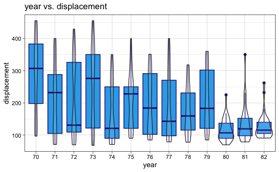
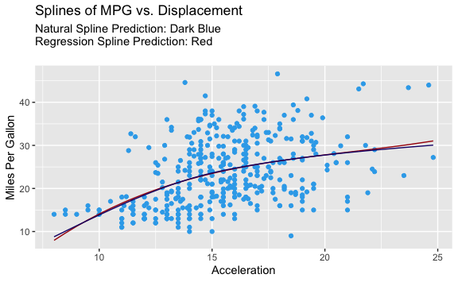
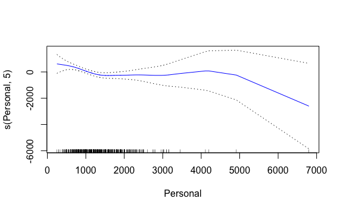

Lab 7 Non-Linear Modeling Exercises
================
Evan Woods
2023-12-20

## Applied

### Question 6:

In this exercise, you will further analyze the Wage data set considered
throughout this chapter.

- **Question 6-a**: Perform polynomial regression to predict wage using
  age. Use cross-validation to select the optimal degree *d* for the
  polynomial. What degree was chosen, and how does this compare to the
  results of hypothesis testing using ANOVA? Make a plot of the
  resulting polynomial fit to the data.
  - **Answer**:

<!-- -->

    Analysis of Variance Table

    Model  1: wage ~ poly(age, 1)
    Model  2: wage ~ poly(age, 2)
    Model  3: wage ~ poly(age, 3)
    Model  4: wage ~ poly(age, 4)
    Model  5: wage ~ poly(age, 5)
    Model  6: wage ~ poly(age, 6)
    Model  7: wage ~ poly(age, 7)
    Model  8: wage ~ poly(age, 8)
    Model  9: wage ~ poly(age, 9)
    Model 10: wage ~ poly(age, 10)
       Res.Df     RSS Df Sum of Sq        F    Pr(>F)    
    1    2998 5022216                                    
    2    2997 4793430  1    228786 143.7638 < 2.2e-16 ***
    3    2996 4777674  1     15756   9.9005  0.001669 ** 
    4    2995 4771604  1      6070   3.8143  0.050909 .  
    5    2994 4770322  1      1283   0.8059  0.369398    
    6    2993 4766389  1      3932   2.4709  0.116074    
    7    2992 4763834  1      2555   1.6057  0.205199    
    8    2991 4763707  1       127   0.0796  0.777865    
    9    2990 4756703  1      7004   4.4014  0.035994 *  
    10   2989 4756701  1         3   0.0017  0.967529    
    ---
    Signif. codes:  0 '***' 0.001 '**' 0.01 '*' 0.05 '.' 0.1 ' ' 1

    The model of degree 9 was chosen as the model with the lowest test error when
    tested using cross-validation.

    The model of degree 9 is a reasonable fit to the data when examined using the
    ANOVA test.

- **Question 6-b**: Fit a step function to predict wage using age, and
  perform cross-validation to choose the optimal number of cuts. Make a
  plot of the fit obtained.
  - **Answer**:

### Question 7:

The Wage data set contains a number of other features not explored in
this chapter, such as marital status (maritl), job class (jobclass), and
others. Explore the relationships between these other predictors and
wage, and use non-linear fitting techniques in order to fit flexible
models to the data. Create plots of the results obtained, and write a
summary of your findings.

    [1] "1. Never Married" "2. Married"       "3. Widowed"       "4. Divorced"     
    [5] "5. Separated"    

    There is a strong relationship between marital status & Information job class
    with respect to higher wages. Those that have never been married have the lowest
    wages whereas those that have been divorced or separated are associated with
    wages that are higher than those that have never been married but lower than
    those that have been married. There is a positive trend with increasing years
    with respect to wage.

### Question 8:

Fit the non-linear models investigated in this chapter to the Auto data
set. Is there evidence for non-linear relationships in this data set?
Create informative plots to justify your answer.

      mpg cylinders displacement horsepower weight acceleration year origin
    1  18         8          307        130   3504         12.0   70      1
    2  15         8          350        165   3693         11.5   70      1
    3  18         8          318        150   3436         11.0   70      1
    4  16         8          304        150   3433         12.0   70      1
    5  17         8          302        140   3449         10.5   70      1
    6  15         8          429        198   4341         10.0   70      1
                           name
    1 chevrolet chevelle malibu
    2         buick skylark 320
    3        plymouth satellite
    4             amc rebel sst
    5               ford torino
    6          ford galaxie 500

### Question 9:

This question uses the variables dis (the weighted mean of distances to
five Boston employment centers) and nox (nitrogen oxides concen- tration
in parts per 10 million) from the Boston data. We will treat dis as the
predictor and nox as the response.

- **Question 9-a**: Use the poly() function to fit a cubic polynomial
  regression to predict nox using dis. Report the regression output, and
  plot the resulting data and polynomial fits.
  - **Answer**:

<!-- -->

    Call:
    lm(formula = nox ~ poly(dis, 4))

    Residuals:
         Min       1Q   Median       3Q      Max 
    -0.12295 -0.04089 -0.01073  0.02290  0.19471 

    Coefficients:
                   Estimate Std. Error t value Pr(>|t|)    
    (Intercept)    0.554695   0.002761  200.88  < 2e-16 ***
    poly(dis, 4)1 -2.003096   0.062115  -32.25  < 2e-16 ***
    poly(dis, 4)2  0.856330   0.062115   13.79  < 2e-16 ***
    poly(dis, 4)3 -0.318049   0.062115   -5.12 4.36e-07 ***
    poly(dis, 4)4  0.033547   0.062115    0.54    0.589    
    ---
    Signif. codes:  0 '***' 0.001 '**' 0.01 '*' 0.05 '.' 0.1 ' ' 1

    Residual standard error: 0.06211 on 501 degrees of freedom
    Multiple R-squared:  0.7149,    Adjusted R-squared:  0.7127 
    F-statistic: 314.1 on 4 and 501 DF,  p-value: < 2.2e-16

- **Question 9-b**: Plot the polynomial fits for a range of different
  polynomial degrees (say, from 1 to 10), and report the associated
  residual sum of squares.
  - **Answer**:

- **Question 9-c**: Perform cross-validation or another approach to
  select the opti- mal degree for the polynomial, and explain your
  results.
  - **Answer**:

<!-- -->

    A training and testing validation set was used to identify the optimal value of
    the highest degree of the polynomial used to pred nox regressed onto weighted
    mean distance to 5 boston employment centers. The optimal value of the degree
    of polynomial which creates the lowest mse is 2 with a test mse value of 0.005.
    This is supported by the graph Polynomial of NOx Vs. Distance to Employment
    Centers where the highest degree of the polynomial is 2. It is observable in
    the remaining graphs that degrees above 2 have high variance and fit too closely
    to the data. And the resulting decrease in variance is not outweighed by the
    increase in bias gained from using the linear model of degree 1.

- **Question 9-d**:Use the bs() function to fit a regression spline to
  predict nox using dis. Report the output for the fit using four
  degrees of freedom. How did you choose the knots? Plot the resulting
  fit
  - **Answer**:

<!-- -->

    Call:
    lm(formula = nox ~ bs(dis, df = 4))

    Residuals:
          Min        1Q    Median        3Q       Max 
    -0.124622 -0.039259 -0.008514  0.020850  0.193891 

    Coefficients:
                     Estimate Std. Error t value Pr(>|t|)    
    (Intercept)       0.73447    0.01460  50.306  < 2e-16 ***
    bs(dis, df = 4)1 -0.05810    0.02186  -2.658  0.00812 ** 
    bs(dis, df = 4)2 -0.46356    0.02366 -19.596  < 2e-16 ***
    bs(dis, df = 4)3 -0.19979    0.04311  -4.634 4.58e-06 ***
    bs(dis, df = 4)4 -0.38881    0.04551  -8.544  < 2e-16 ***
    ---
    Signif. codes:  0 '***' 0.001 '**' 0.01 '*' 0.05 '.' 0.1 ' ' 1

    Residual standard error: 0.06195 on 501 degrees of freedom
    Multiple R-squared:  0.7164,    Adjusted R-squared:  0.7142 
    F-statistic: 316.5 on 4 and 501 DF,  p-value: < 2.2e-16

    The output for the fit using four degrees of freedom is observable from the
    summary above. The knots where selected automatically using the selected 4
    degrees of freedom.

- **Question 9-e**: Now fit a regression spline for a range of degrees
  of freedom, and plot the resulting fits and report the resulting RSS.
  Describe the results obtained.
  - **Answer**:
    
- **Question 9-f**: Perform cross-validation or another approach in
  order to select the best degrees of freedom for a regression spline on
  this data. Describe your results.
  - **Answer**:

<!-- -->

    The degree of freedom that promotes the minimum mean squared error for the
    created regression spline is: 3 degrees of freedom. The calculated test mse is:
    0.0056794.

### Question 10:

This question relates to the College data set.

- **Question 10-a**: Split the data into a training set and a test set.
  Using out-of-state tuition as the response and the other variables as
  the predictors, perform forward stepwise selection on the training set
  in order to identify a satisfactory model that uses just a subset of
  the predictors.

    Subset selection object
    Call: regsubsets.formula(Outstate ~ ., data = college, subset = train, 
        method = "forward", nvmax = length(college) - 1)
    17 Variables  (and intercept)
                Forced in Forced out
    PrivateYes      FALSE      FALSE
    Apps            FALSE      FALSE
    Accept          FALSE      FALSE
    Enroll          FALSE      FALSE
    Top10perc       FALSE      FALSE
    Top25perc       FALSE      FALSE
    F.Undergrad     FALSE      FALSE
    P.Undergrad     FALSE      FALSE
    Room.Board      FALSE      FALSE
    Books           FALSE      FALSE
    Personal        FALSE      FALSE
    PhD             FALSE      FALSE
    Terminal        FALSE      FALSE
    S.F.Ratio       FALSE      FALSE
    perc.alumni     FALSE      FALSE
    Expend          FALSE      FALSE
    Grad.Rate       FALSE      FALSE
    1 subsets of each size up to 17
    Selection Algorithm: forward
              PrivateYes Apps Accept Enroll Top10perc Top25perc F.Undergrad
    1  ( 1 )  " "        " "  " "    " "    " "       " "       " "        
    2  ( 1 )  "*"        " "  " "    " "    " "       " "       " "        
    3  ( 1 )  "*"        " "  " "    " "    " "       " "       " "        
    4  ( 1 )  "*"        " "  " "    " "    " "       " "       " "        
    5  ( 1 )  "*"        " "  " "    " "    " "       " "       " "        
    6  ( 1 )  "*"        " "  " "    " "    " "       " "       " "        
    7  ( 1 )  "*"        " "  " "    " "    " "       " "       " "        
    8  ( 1 )  "*"        " "  " "    " "    " "       " "       " "        
    9  ( 1 )  "*"        " "  "*"    " "    " "       " "       " "        
    10  ( 1 ) "*"        "*"  "*"    " "    " "       " "       " "        
    11  ( 1 ) "*"        "*"  "*"    "*"    " "       " "       " "        
    12  ( 1 ) "*"        "*"  "*"    "*"    "*"       " "       " "        
    13  ( 1 ) "*"        "*"  "*"    "*"    "*"       " "       " "        
    14  ( 1 ) "*"        "*"  "*"    "*"    "*"       " "       " "        
    15  ( 1 ) "*"        "*"  "*"    "*"    "*"       " "       "*"        
    16  ( 1 ) "*"        "*"  "*"    "*"    "*"       " "       "*"        
    17  ( 1 ) "*"        "*"  "*"    "*"    "*"       "*"       "*"        
              P.Undergrad Room.Board Books Personal PhD Terminal S.F.Ratio
    1  ( 1 )  " "         " "        " "   " "      " " " "      " "      
    2  ( 1 )  " "         " "        " "   " "      " " " "      " "      
    3  ( 1 )  " "         "*"        " "   " "      " " " "      " "      
    4  ( 1 )  " "         "*"        " "   " "      " " " "      " "      
    5  ( 1 )  " "         "*"        " "   " "      "*" " "      " "      
    6  ( 1 )  " "         "*"        " "   " "      "*" " "      " "      
    7  ( 1 )  " "         "*"        " "   "*"      "*" " "      " "      
    8  ( 1 )  " "         "*"        " "   "*"      "*" "*"      " "      
    9  ( 1 )  " "         "*"        " "   "*"      "*" "*"      " "      
    10  ( 1 ) " "         "*"        " "   "*"      "*" "*"      " "      
    11  ( 1 ) " "         "*"        " "   "*"      "*" "*"      " "      
    12  ( 1 ) " "         "*"        " "   "*"      "*" "*"      " "      
    13  ( 1 ) " "         "*"        "*"   "*"      "*" "*"      " "      
    14  ( 1 ) " "         "*"        "*"   "*"      "*" "*"      "*"      
    15  ( 1 ) " "         "*"        "*"   "*"      "*" "*"      "*"      
    16  ( 1 ) "*"         "*"        "*"   "*"      "*" "*"      "*"      
    17  ( 1 ) "*"         "*"        "*"   "*"      "*" "*"      "*"      
              perc.alumni Expend Grad.Rate
    1  ( 1 )  " "         "*"    " "      
    2  ( 1 )  " "         "*"    " "      
    3  ( 1 )  " "         "*"    " "      
    4  ( 1 )  "*"         "*"    " "      
    5  ( 1 )  "*"         "*"    " "      
    6  ( 1 )  "*"         "*"    "*"      
    7  ( 1 )  "*"         "*"    "*"      
    8  ( 1 )  "*"         "*"    "*"      
    9  ( 1 )  "*"         "*"    "*"      
    10  ( 1 ) "*"         "*"    "*"      
    11  ( 1 ) "*"         "*"    "*"      
    12  ( 1 ) "*"         "*"    "*"      
    13  ( 1 ) "*"         "*"    "*"      
    14  ( 1 ) "*"         "*"    "*"      
    15  ( 1 ) "*"         "*"    "*"      
    16  ( 1 ) "*"         "*"    "*"      
    17  ( 1 ) "*"         "*"    "*"      

    The model that implements forward stepping and minimizes the means squared
    error is model 16. The test mean squared error of this model is: 4037736.564.
    This model is comprised of the following predictors: Private, Apps, Accept,
    Enroll, Top10perc, F. Undergrad, P. Undergrad, Room.Board, Books, Personal, PhD
    Terminal, S.F. Ratio, perc.alumni, Expend, & Graduation Rate.

- **Question 10-b**: Fit a GAM on the training data, using out-of-state
  tuition as the response and the features selected in the previous step
  as the predictors. Plot the results, and explain your findings.
  - **Answer**:

<!-- -->

     [1] "Private"     "Apps"        "Accept"      "Enroll"      "Top10perc"  
     [6] "Top25perc"   "F.Undergrad" "P.Undergrad" "Outstate"    "Room.Board" 
    [11] "Books"       "Personal"    "PhD"         "Terminal"    "S.F.Ratio"  
    [16] "perc.alumni" "Expend"      "Grad.Rate"  

    Not only are private universities associated with higher out-of-state tuition,
    but there is also an increase in the number of applications accepted, the
    percent of students from the top 10% of the high school graduating class,
    the cost of room and board, the percent of faculty with Ph.D.'s, the percent
    of faculty with terminal degrees, the percent of alumni who donate, the
    instructional expenditure per student, the student faculty ratio, and the
    graduation rate. However, increases in out-of-state tuition fees are also
    associated with a decrease in the number of applications, the number of new
    students enrolled, the number of fulltime undergraduates, the number of part
    time undergraduates, estimated book costs, and estimated personal spending.

- **Question 10-c**: Evaluate the model obtained on the test set, and
  explain the results obtained.
  - **Answer**:

<!-- -->

    THe test mse is: 3790761.501. This value is the sum of the squares of the
    residual test observations divided by the number of observation in the test
    set. The test error is higher on the test set than for the training set. This is
    expected as the training error tends to underestimate the test error.

- **Question 10-d**: For which variables, if any, is there evidence of a
  non-linear relationship with the response?
  - **Answer**:

<!-- -->

                                 Private Apps Accept Enroll Top10perc Top25perc
    Abilene Christian University     Yes 1660   1232    721        23        52
    Adelphi University               Yes 2186   1924    512        16        29
    Adrian College                   Yes 1428   1097    336        22        50
    Agnes Scott College              Yes  417    349    137        60        89
    Alaska Pacific University        Yes  193    146     55        16        44
    Albertson College                Yes  587    479    158        38        62
                                 F.Undergrad P.Undergrad Outstate Room.Board Books
    Abilene Christian University        2885         537     7440       3300   450
    Adelphi University                  2683        1227    12280       6450   750
    Adrian College                      1036          99    11250       3750   400
    Agnes Scott College                  510          63    12960       5450   450
    Alaska Pacific University            249         869     7560       4120   800
    Albertson College                    678          41    13500       3335   500
                                 Personal PhD Terminal S.F.Ratio perc.alumni Expend
    Abilene Christian University     2200  70       78      18.1          12   7041
    Adelphi University               1500  29       30      12.2          16  10527
    Adrian College                   1165  53       66      12.9          30   8735
    Agnes Scott College               875  92       97       7.7          37  19016
    Alaska Pacific University        1500  76       72      11.9           2  10922
    Albertson College                 675  67       73       9.4          11   9727
                                 Grad.Rate
    Abilene Christian University        60
    Adelphi University                  56
    Adrian College                      54
    Agnes Scott College                 59
    Alaska Pacific University           15
    Albertson College                   55

    It appears from the plots above that there is evidence of a non-linear
    relationship between Ph.D.'s, terminal degrees, and student faculty ratio with
    respect to out-of-state tuition.
