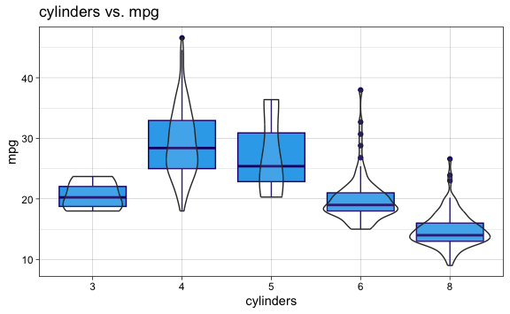
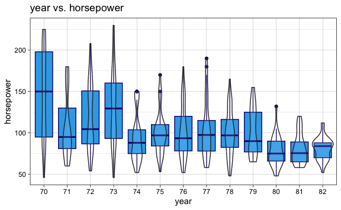

Lab 7 Non-Linear Modeling Exercises
================
Evan Woods
2023-12-18

## Applied

### Question 6:

In this exercise, you will further analyze the Wage data set considered
throughout this chapter.

- **Question 6-a**: Perform polynomial regression to predict wage using
  age. Use cross-validation to select the optimal degree *d* for the
  polynomial. What degree was chosen, and how does this compare to the
  results of hypothesis testing using ANOVA? Make a plot of the
  resulting polynomial fit to the data.
  - **Answer**:

<!-- -->

    Analysis of Variance Table

    Model  1: wage ~ poly(age, 1)
    Model  2: wage ~ poly(age, 2)
    Model  3: wage ~ poly(age, 3)
    Model  4: wage ~ poly(age, 4)
    Model  5: wage ~ poly(age, 5)
    Model  6: wage ~ poly(age, 6)
    Model  7: wage ~ poly(age, 7)
    Model  8: wage ~ poly(age, 8)
    Model  9: wage ~ poly(age, 9)
    Model 10: wage ~ poly(age, 10)
       Res.Df     RSS Df Sum of Sq        F    Pr(>F)    
    1    2998 5022216                                    
    2    2997 4793430  1    228786 143.7638 < 2.2e-16 ***
    3    2996 4777674  1     15756   9.9005  0.001669 ** 
    4    2995 4771604  1      6070   3.8143  0.050909 .  
    5    2994 4770322  1      1283   0.8059  0.369398    
    6    2993 4766389  1      3932   2.4709  0.116074    
    7    2992 4763834  1      2555   1.6057  0.205199    
    8    2991 4763707  1       127   0.0796  0.777865    
    9    2990 4756703  1      7004   4.4014  0.035994 *  
    10   2989 4756701  1         3   0.0017  0.967529    
    ---
    Signif. codes:  0 '***' 0.001 '**' 0.01 '*' 0.05 '.' 0.1 ' ' 1

    The model of degree 9 was chosen as the model with the lowest test error when
    tested using cross-validation.

    The model of degree 9 is a reasonable fit to the data when examined using the
    ANOVA test.

- **Question 6-b**: Fit a step function to predict wage using age, and
  perform cross-validation to choose the optimal number of cuts. Make a
  plot of the fit obtained.
  - **Answer**:

### Question 7:

The Wage data set contains a number of other features not explored in
this chapter, such as marital status (maritl), job class (jobclass), and
others. Explore the relationships between these other predictors and
wage, and use non-linear fitting techniques in order to fit flexible
models to the data. Create plots of the results obtained, and write a
summary of your findings.

    [1] "1. Never Married" "2. Married"       "3. Widowed"       "4. Divorced"     
    [5] "5. Separated"    

    There is a strong relationship between marital status & Information job class
    with respect to higher wages. Those that have never been married have the lowest
    wages whereas those that have been divorced or separated are associated with
    wages that are higher than those that have never been married but lower than
    those that have been married. There is a positive trend with increasing years
    with respect to wage.

### Question 8:

Fit the non-linear models investigated in this chapter to the Auto data
set. Is there evidence for non-linear relationships in this data set?
Create informative plots to justify your answer.

      mpg cylinders displacement horsepower weight acceleration year origin
    1  18         8          307        130   3504         12.0   70      1
    2  15         8          350        165   3693         11.5   70      1
    3  18         8          318        150   3436         11.0   70      1
    4  16         8          304        150   3433         12.0   70      1
    5  17         8          302        140   3449         10.5   70      1
    6  15         8          429        198   4341         10.0   70      1
                           name
    1 chevrolet chevelle malibu
    2         buick skylark 320
    3        plymouth satellite
    4             amc rebel sst
    5               ford torino
    6          ford galaxie 500

### Question 9:

This question uses the variables dis (the weighted mean of distances to
five Boston employment centers) and nox (nitrogen oxides concen- tration
in parts per 10 million) from the Boston data. We will treat dis as the
predictor and nox as the response.

- **Question 9-a**: Use the poly() function to fit a cubic polynomial
  regression to predict nox using dis. Report the regression output, and
  plot the resulting data and polynomial fits.
  - **Answer**:

<!-- -->

    Call:
    lm(formula = nox ~ poly(dis, 4))

    Residuals:
         Min       1Q   Median       3Q      Max 
    -0.12295 -0.04089 -0.01073  0.02290  0.19471 

    Coefficients:
                   Estimate Std. Error t value Pr(>|t|)    
    (Intercept)    0.554695   0.002761  200.88  < 2e-16 ***
    poly(dis, 4)1 -2.003096   0.062115  -32.25  < 2e-16 ***
    poly(dis, 4)2  0.856330   0.062115   13.79  < 2e-16 ***
    poly(dis, 4)3 -0.318049   0.062115   -5.12 4.36e-07 ***
    poly(dis, 4)4  0.033547   0.062115    0.54    0.589    
    ---
    Signif. codes:  0 '***' 0.001 '**' 0.01 '*' 0.05 '.' 0.1 ' ' 1

    Residual standard error: 0.06211 on 501 degrees of freedom
    Multiple R-squared:  0.7149,    Adjusted R-squared:  0.7127 
    F-statistic: 314.1 on 4 and 501 DF,  p-value: < 2.2e-16

- **Question 9-b**: Plot the polynomial fits for a range of different
  polynomial degrees (say, from 1 to 10), and report the associated
  residual sum of squares.
  - **Answer**:
    
- **Question 9-c**: Perform cross-validation or another approach to
  select the opti- mal degree for the polynomial, and explain your
  results.
  - **Answer**:

<!-- -->

    A training and testing validation set was used to identify the optimal value of
    the highest degree of the polynomial used to pred nox regressed onto weighted
    mean distance to 5 boston employment centers. The optimal value of the degree
    of polynomial which creates the lowest mse is 2 with a test mse value of 0.005.
    This is supported by the graph Polynomial of NOx Vs. Distance to Employment
    Centers where the highest degree of the polynomial is 2. It is observable in
    the remaining graphs that degrees above 2 have high variance and fit too closely
    to the data. And the resulting decrease in variance is not outweighed by the
    increase in bias gained from using the linear model of degree 1.
