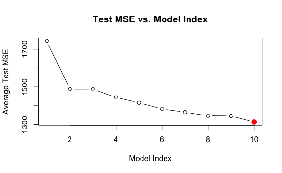

Lab 7 Non-Linear Modeling Exercises
================
Evan Woods
2023-12-17

## Applied

### Question 6:

In this exercise, you will further analyze the Wage data set considered
throughout this chapter.

- **Question 6-a**: Perform polynomial regression to predict wage using
  age. Use cross-validation to select the optimal degree *d* for the
  polynomial. What degree was chosen, and how does this compare to the
  results of hypothesis testing using ANOVA? Make a plot of the
  resulting polynomial fit to the data.
  - **Answer**:

<!-- -->

    Analysis of Variance Table

    Model  1: wage ~ poly(age, 1)
    Model  2: wage ~ poly(age, 2)
    Model  3: wage ~ poly(age, 3)
    Model  4: wage ~ poly(age, 4)
    Model  5: wage ~ poly(age, 5)
    Model  6: wage ~ poly(age, 6)
    Model  7: wage ~ poly(age, 7)
    Model  8: wage ~ poly(age, 8)
    Model  9: wage ~ poly(age, 9)
    Model 10: wage ~ poly(age, 10)
       Res.Df     RSS Df Sum of Sq        F    Pr(>F)    
    1    2998 5022216                                    
    2    2997 4793430  1    228786 143.7638 < 2.2e-16 ***
    3    2996 4777674  1     15756   9.9005  0.001669 ** 
    4    2995 4771604  1      6070   3.8143  0.050909 .  
    5    2994 4770322  1      1283   0.8059  0.369398    
    6    2993 4766389  1      3932   2.4709  0.116074    
    7    2992 4763834  1      2555   1.6057  0.205199    
    8    2991 4763707  1       127   0.0796  0.777865    
    9    2990 4756703  1      7004   4.4014  0.035994 *  
    10   2989 4756701  1         3   0.0017  0.967529    
    ---
    Signif. codes:  0 '***' 0.001 '**' 0.01 '*' 0.05 '.' 0.1 ' ' 1

    The model of degree 9 was chosen as the model with the lowest test error when
    tested using cross-validation.

    The model of degree 9 is a reasonable fit to the data when examined using the
    ANOVA test.

- **Question 6-b**: Fit a step function to predict wage using age, and
  perform cross-validation to choose the optimal number of cuts. Make a
  plot of the fit obtained.
  - **Answer**:

### Question 7:

The Wage data set contains a number of other features not explored in
this chapter, such as marital status (maritl), job class (jobclass), and
others. Explore the relationships between these other predictors and
wage, and use non-linear fitting techniques in order to fit flexible
models to the data. Create plots of the results obtained, and write a
summary of your findings.

    Warning in leaps.setup(x, y, wt = wt, nbest = nbest, nvmax = nvmax, force.in =
    force.in, : 8 linear dependencies found

    Reordering variables and trying again:

    [1] 11

           year age           maritl     race       education             region
    231655 2006  18 1. Never Married 1. White    1. < HS Grad 2. Middle Atlantic
    86582  2004  24 1. Never Married 1. White 4. College Grad 2. Middle Atlantic
    161300 2003  45       2. Married 1. White 3. Some College 2. Middle Atlantic
    155159 2003  43       2. Married 3. Asian 4. College Grad 2. Middle Atlantic
    11443  2005  50      4. Divorced 1. White      2. HS Grad 2. Middle Atlantic
    376662 2008  54       2. Married 1. White 4. College Grad 2. Middle Atlantic
                 jobclass         health health_ins  logwage      wage
    231655  1. Industrial      1. <=Good      2. No 4.318063  75.04315
    86582  2. Information 2. >=Very Good      2. No 4.255273  70.47602
    161300  1. Industrial      1. <=Good     1. Yes 4.875061 130.98218
    155159 2. Information 2. >=Very Good     1. Yes 5.041393 154.68529
    11443  2. Information      1. <=Good     1. Yes 4.318063  75.04315
    376662 2. Information 2. >=Very Good     1. Yes 4.845098 127.11574

    Warning in leaps.setup(x, y, wt = wt, nbest = nbest, nvmax = nvmax, force.in =
    force.in, : 8 linear dependencies found

    Reordering variables and trying again:

    Warning in leaps.setup(x, y, wt = wt, nbest = nbest, nvmax = nvmax, force.in =
    force.in, : 8 linear dependencies found

    Reordering variables and trying again:

    Warning in leaps.setup(x, y, wt = wt, nbest = nbest, nvmax = nvmax, force.in =
    force.in, : 8 linear dependencies found

    Reordering variables and trying again:

    Warning in leaps.setup(x, y, wt = wt, nbest = nbest, nvmax = nvmax, force.in =
    force.in, : 8 linear dependencies found

    Reordering variables and trying again:

    Warning in leaps.setup(x, y, wt = wt, nbest = nbest, nvmax = nvmax, force.in =
    force.in, : 8 linear dependencies found

    Reordering variables and trying again:

    Warning in leaps.setup(x, y, wt = wt, nbest = nbest, nvmax = nvmax, force.in =
    force.in, : 8 linear dependencies found

    Reordering variables and trying again:

    Warning in leaps.setup(x, y, wt = wt, nbest = nbest, nvmax = nvmax, force.in =
    force.in, : 8 linear dependencies found

    Reordering variables and trying again:

    Warning in leaps.setup(x, y, wt = wt, nbest = nbest, nvmax = nvmax, force.in =
    force.in, : 8 linear dependencies found

    Reordering variables and trying again:

    Warning in leaps.setup(x, y, wt = wt, nbest = nbest, nvmax = nvmax, force.in =
    force.in, : 8 linear dependencies found

    Reordering variables and trying again:

    Warning in leaps.setup(x, y, wt = wt, nbest = nbest, nvmax = nvmax, force.in =
    force.in, : 8 linear dependencies found

    Reordering variables and trying again:

