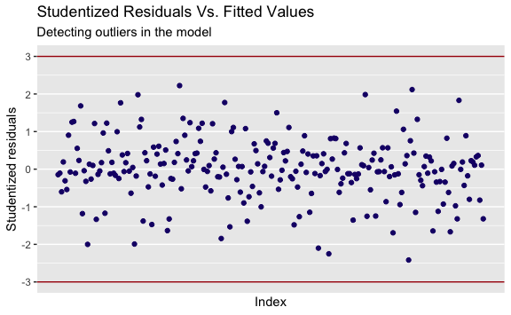

Decoding EEG During Action Observation, Motor Imagery, & Motor Execution
================
Evan Woods
2024-01-05

## Support Vector Classifier Results

### Motor Imagery While Sitting: Detection of Resting vs Action Observation

    Subject 1:
         pred
    truth  0  1
        0 10  2
        1  0 10
    Accuracy: 90.909%

    Subject 2:
         pred
    truth  0  1
        0  7  1
        1  3 11
    Accuracy: 81.818%

    Subject 3:
         pred
    truth  0  1
        0 11  1
        1  1  9
    Accuracy: 90.909%

    Subject 4:
         pred
    truth  0  1
        0 11  0
        1  1 10
    Accuracy: 95.455%

    Subject 5:
         pred
    truth  0  1
        0 13  1
        1  0  8
    Accuracy: 95.455%

    Subject 6:
         pred
    truth 0 1
        0 9 3
        1 2 8
    Accuracy: 77.273%

    Subject 7:
         pred
    truth  0  1
        0 10  0
        1  3  9
    Accuracy: 86.364%

    Subject 8:
         pred
    truth  0  1
        0 11  2
        1  3  6
    Accuracy: 77.273%

    Mean Accuracy: 86.932%.
    Standard Error: ±7.464%.

### Motor Imagery While Sitting: Detection of Action Observation vs Motor Imagery

    Subject 1:
         pred
    truth  0  1
        0 13  0
        1  0  9
    Accuracy: 100.000%

    Subject 2:
         pred
    truth  0  1
        0 11  0
        1  2  9
    Accuracy: 90.909%

    Subject 3:
         pred
    truth  0  1
        0 11  1
        1  2  8
    Accuracy: 86.364%

    Subject 4:
         pred
    truth  0  1
        0 13  0
        1  0  9
    Accuracy: 100.000%

    Subject 5:
         pred
    truth  0  1
        0 14  0
        1  1  7
    Accuracy: 95.455%

    Subject 6:
         pred
    truth  0  1
        0 14  0
        1  0  8
    Accuracy: 100.000%

    Subject 7:
         pred
    truth  0  1
        0  9  1
        1  0 12
    Accuracy: 95.455%

    Subject 8:
         pred
    truth  0  1
        0 15  0
        1  0  7
    Accuracy: 100.000%

    Mean Accuracy: 96.023%.
    Standard Error: ±5.118%.

### Motor Imagery While Standing: Detection of Resting vs Action Observation

    Subject 1:
         pred
    truth  0  1
        0 13  0
        1  0  9
    Accuracy: 100.000%

    Subject 2:
         pred
    truth  0  1
        0  8  1
        1  0 13
    Accuracy: 95.455%

    Subject 3:
         pred
    truth  0  1
        0 13  1
        1  0  8
    Accuracy: 95.455%

    Subject 4:
         pred
    truth  0  1
        0 11  1
        1  0 10
    Accuracy: 95.455%

    Subject 5:
         pred
    truth  0  1
        0 13  1
        1  2  6
    Accuracy: 86.364%

    Subject 6:
         pred
    truth  0  1
        0 11  0
        1  0 11
    Accuracy: 100.000%

    Subject 7:
         pred
    truth  0  1
        0 10  0
        1  1 11
    Accuracy: 95.455%

    Subject 8:
         pred
    truth  0  1
        0 11  0
        1  0 11
    Accuracy: 100.000%

    Mean Accuracy: 96.023%.
    Standard Error: ±4.505%.

### Motor Imagery While Standing: Detection of Action Observation vs Motor Imagery

    Subject 1:
         pred
    truth  0  1
        0 13  0
        1  0  9
    Accuracy: 100.000%

    Subject 2:
         pred
    truth  0  1
        0  8  1
        1  0 13
    Accuracy: 95.455%

    Subject 3:
         pred
    truth  0  1
        0 13  1
        1  0  8
    Accuracy: 95.455%

    Subject 4:
         pred
    truth  0  1
        0 11  1
        1  0 10
    Accuracy: 95.455%

    Subject 5:
         pred
    truth  0  1
        0 13  1
        1  1  7
    Accuracy: 90.909%

    Subject 6:
         pred
    truth  0  1
        0 11  0
        1  0 11
    Accuracy: 100.000%

    Subject 7:
         pred
    truth  0  1
        0 10  0
        1  1 11
    Accuracy: 95.455%

    Subject 8:
         pred
    truth  0  1
        0 11  0
        1  0 11
    Accuracy: 100.000%

    Mean Accuracy: 96.591%.
    Standard Error: ±3.214%.

### Comparision Against Results of Prior Research

    The highest mean accuracy of the classifiers in the prior research is: 82.73%
    with a standard error of ±2.54.

    The lowest mean accuracy of the classifiers is: 86.932% with a standard error of
    7.464%.

    The highest mean accuracy of the classifiers is: 96.591% with a standard error
    of 3.214%.

    [[1]]

    Parameter tuning of 'svm':

    - sampling method: 10-fold cross validation 

    - best parameters:
     cost
      100

    - best performance: 0.02591398 

    The action observation versus motor imagery classifier during the stand to sit
    transition has the model with the highest accuracy.

    [[1]]

    Parameter tuning of 'svm':

    - sampling method: 10-fold cross validation 

    - best parameters:
     cost
        1

    - best performance: 0 

## Increasing a Subject’s Model Accuracy

    The lowest performing model of the Resting vs. Action Observation
    classifications is the model for subject #6. The accuracy of subject #6's model
    is: 77.273.

## Explore the subject with the lowest performing model’s data and find outliers, high-leverage, or non-linearities.

## Logistic Regression: Training & Validation

              truth
    prediction  0  1
             0 21  3
             1  3 25

    Validation Accuracy of Logistic Regression: 88.462%.

### Detecting Outliers

    There are no detected outliers in the logistic regression fit on the subject
    with the lowest performing model's data.

### Detecting and Removing High-Leverage Values

    There are 7 high-leverage values:

          215       186       126       266        92       302       145 
    0.1728326 0.1405117 0.1618833 0.1350949 0.1246591 0.1239995 0.1327332 

### Refitting a Logistic Regression Model

              truth
    prediction  0  1
             0 21  2
             1  3 26

    Validation Accuracy of Logistic Regression with no high leverage: 90.385%.

              truth
    prediction 0 1
             0 9 3
             1 3 7

    Accuracy of Logistic Regression on the subject with the lowest performing
    model's Test Data after removing high-leverage: 72.727%. The previous accuracy
    on test data with an SVM was: 77.273%.

### Refitting the Lowest Performing Support Vector Classifier Model

              truth
    prediction 0 1
             0 8 3
             1 4 7

    [1] 68.18182

### Results

    The validation accuracy of the logistic regression model on the subject with
    the lowest performing model's data increased model performance from 88.462% to
    90.385% after removing high-leverage values detected in the subject's training
    data.
