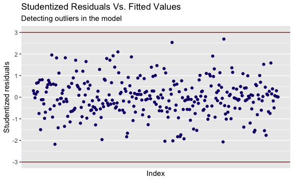

Decoding EEG During Action Observation, Motor Imagery, & Motor Execution
================
Evan Woods
2024-01-04

## Function Definitions

## Imports

# Motor Imagery & Motor Execution

## Create data structure to hold pre-processed data

## Preprocessing: Collect, Filter, Downsample, Remove Artifacts & Extract Phases

## Sliding window size of 2s

## Define Dependent and Independent Variables & MI classes

## Create Training & Test Sets & Complete Processing using FBCSP

### DataFrame of dependent and independent variables

### Fit the data to models (logistic, SVM, DeepNN)

### Validation data

### SVM

    Call:
    best.tune(METHOD = svm, train.x = y ~ ., data = train_list[[i]], 
        ranges = list(cost = c(0.001, 0.01, 0.1, 1, 10, 25, 50, 100, 
            1000)), kernel = "linear")

    Parameters:
       SVM-Type:  C-classification 
     SVM-Kernel:  linear 
           cost:  0.01 

    Number of Support Vectors:  64

### Evaluate results

    Motor Imagery While Sitting: Detection of Resting vs Action Observation:

    Subject 1:
         pred
    truth  0  1
        0 11  1
        1  0 10
    Accuracy: 95.455%

    Subject 2:
         pred
    truth  0  1
        0  7  1
        1  4 10
    Accuracy: 77.273%

    Subject 3:
         pred
    truth  0  1
        0 12  0
        1  3  7
    Accuracy: 86.364%

    Subject 4:
         pred
    truth  0  1
        0 11  0
        1  1 10
    Accuracy: 95.455%

    Subject 5:
         pred
    truth  0  1
        0 11  3
        1  0  8
    Accuracy: 86.364%

    Subject 6:
         pred
    truth 0 1
        0 9 3
        1 2 8
    Accuracy: 77.273%

    Subject 7:
         pred
    truth  0  1
        0 10  0
        1  2 10
    Accuracy: 90.909%

    Subject 8:
         pred
    truth  0  1
        0 12  1
        1  3  6
    Accuracy: 81.818%

    Mean Accuracy: 86.364%.
    Standard Error: ±7.289%.

    Motor Imagery While Sitting: Detection of Action Observation vs Motor Imagery:

    Subject 1:
         pred
    truth  0  1
        0 13  0
        1  0  9
    Accuracy: 100.000%

    Subject 2:
         pred
    truth  0  1
        0 11  0
        1  2  9
    Accuracy: 90.909%

    Subject 3:
         pred
    truth  0  1
        0 11  1
        1  1  9
    Accuracy: 90.909%

    Subject 4:
         pred
    truth  0  1
        0 13  0
        1  0  9
    Accuracy: 100.000%

    Subject 5:
         pred
    truth  0  1
        0 13  1
        1  0  8
    Accuracy: 95.455%

    Subject 6:
         pred
    truth  0  1
        0 14  0
        1  0  8
    Accuracy: 100.000%

    Subject 7:
         pred
    truth  0  1
        0 10  0
        1  1 11
    Accuracy: 95.455%

    Subject 8:
         pred
    truth  0  1
        0 14  1
        1  0  7
    Accuracy: 95.455%

    Mean Accuracy: 96.023%.
    Standard Error: ±3.793%.

    Motor Imagery While Standing: Detection of Resting vs Action Observation:

    Subject 1:
         pred
    truth  0  1
        0 13  0
        1  0  9
    Accuracy: 100.000%

    Subject 2:
         pred
    truth  0  1
        0  9  0
        1  1 12
    Accuracy: 95.455%

    Subject 3:
         pred
    truth  0  1
        0 13  1
        1  0  8
    Accuracy: 95.455%

    Subject 4:
         pred
    truth  0  1
        0 12  0
        1  0 10
    Accuracy: 100.000%

    Subject 5:
         pred
    truth  0  1
        0 14  0
        1  1  7
    Accuracy: 95.455%

    Subject 6:
         pred
    truth  0  1
        0 11  0
        1  0 11
    Accuracy: 100.000%

    Subject 7:
         pred
    truth  0  1
        0 10  0
        1  0 12
    Accuracy: 100.000%

    Subject 8:
         pred
    truth  0  1
        0 11  0
        1  0 11
    Accuracy: 100.000%

    Mean Accuracy: 98.295%.
    Standard Error: ±2.352%.

    Motor Imagery While Standing: Detection of Action Observation vs Motor Imagery:

    Subject 1:
         pred
    truth  0  1
        0 13  0
        1  0  9
    Accuracy: 100.000%

    Subject 2:
         pred
    truth  0  1
        0  9  0
        1  1 12
    Accuracy: 95.455%

    Subject 3:
         pred
    truth  0  1
        0 13  1
        1  0  8
    Accuracy: 95.455%

    Subject 4:
         pred
    truth  0  1
        0 11  1
        1  0 10
    Accuracy: 95.455%

    Subject 5:
         pred
    truth  0  1
        0 13  1
        1  1  7
    Accuracy: 90.909%

    Subject 6:
         pred
    truth  0  1
        0 11  0
        1  0 11
    Accuracy: 100.000%

    Subject 7:
         pred
    truth  0  1
        0 10  0
        1  0 12
    Accuracy: 100.000%

    Subject 8:
         pred
    truth  0  1
        0 11  0
        1  0 11
    Accuracy: 100.000%

    Mean Accuracy: 97.159%.
    Standard Error: ±3.382%.

# Increasing Model Accuracy of Subject 2

### Fitting a logistic regression GAM to Subject 2’s data

d# Step 2: Explore Subject 2’s data and find outliers, high-leverage, or
non-linearities.

    [1] 52

    [1] 52

              truth
    prediction  0  1
             0 17  5
             1  5 25

    Model Accuracy: 80.769%.

## Logistic Regression: Training & Validation

              truth
    prediction  0  1
             0 17  5
             1  5 25

    Accuracy of Logistic Regression: 80.769%.

### Detecting Outliers

    There are no detected outliers in the logistic regression fit on Subject 2's
    data.

### Detecting and Removing High-Leverage Values

    There are multiple high-leverage values:

             7         75         87        179        190        213        232 
    0.13597485 0.19192475 0.12922979 0.10087557 0.13980156 0.10932341 0.14608973 
           255        277        291        293 
    0.10006597 0.14695569 0.09848664 0.10111898 

### Refitting a Logistic Regression Model

              truth
    prediction  0  1
             0 18  6
             1  4 24

    Validation Accuracy of Logistic Regression with no high leverage: 80.769%.

              truth
    prediction  0  1
             0  5  4
             1  3 10

    Accuracy of Logistic Regression: 68.182%.

### Refitting Subject 2’s SVM model

                                       
    subject_2_svm_no_high_leverage.pred  0  1
                                      0  6  3
                                      1  2 11

    [1] 80.76923

### Results

    The validation accuracy of the logistic regression model on Subject 2's data
    increased model performance from the test-set accuracy of 77.273% to 80.769%
    after removing high-leverage values detected in Subject 2's training data. After
    refitting the svm without the high leverage observations, the accuracy of the
    svm predictions driven by the test set increased by 3.497% to 80.769%.
