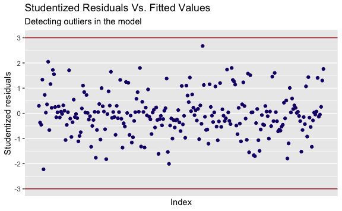

Decoding EEG During Action Observation, Motor Imagery, & Motor Execution
================
Evan Woods
2024-01-15

## Support Vector Classifier Results

### Motor Imagery While Sitting: Detection of Resting vs Action Observation

    Subject 1:
         pred
    truth  0  1
        0 10  2
        1  0 10
    Accuracy: 90.909%

    Subject 2:
         pred
    truth  0  1
        0  6  2
        1  3 11
    Accuracy: 77.273%

    Subject 3:
         pred
    truth  0  1
        0 12  0
        1  4  6
    Accuracy: 81.818%

    Subject 4:
         pred
    truth  0  1
        0 11  0
        1  1 10
    Accuracy: 95.455%

    Subject 5:
         pred
    truth  0  1
        0 10  4
        1  0  8
    Accuracy: 81.818%

    Subject 6:
         pred
    truth 0 1
        0 7 5
        1 2 8
    Accuracy: 68.182%

    Subject 7:
         pred
    truth  0  1
        0 10  0
        1  2 10
    Accuracy: 90.909%

    Subject 8:
         pred
    truth  0  1
        0 12  1
        1  1  8
    Accuracy: 90.909%

    Mean Accuracy: 84.659%.
    Standard Error: ±9.071%.

### Motor Imagery While Sitting: Detection of Action Observation vs Motor Imagery

    Subject 1:
         pred
    truth  0  1
        0 13  0
        1  0  9
    Accuracy: 100.000%

    Subject 2:
         pred
    truth  0  1
        0 11  0
        1  1 10
    Accuracy: 95.455%

    Subject 3:
         pred
    truth  0  1
        0 11  1
        1  2  8
    Accuracy: 86.364%

    Subject 4:
         pred
    truth  0  1
        0 13  0
        1  0  9
    Accuracy: 100.000%

    Subject 5:
         pred
    truth  0  1
        0 14  0
        1  0  8
    Accuracy: 100.000%

    Subject 6:
         pred
    truth  0  1
        0 12  2
        1  0  8
    Accuracy: 90.909%

    Subject 7:
         pred
    truth  0  1
        0  9  1
        1  0 12
    Accuracy: 95.455%

    Subject 8:
         pred
    truth  0  1
        0 15  0
        1  0  7
    Accuracy: 100.000%

    Mean Accuracy: 96.023%.
    Standard Error: ±5.118%.

### Motor Imagery While Standing: Detection of Resting vs Action Observation

    Subject 1:
         pred
    truth  0  1
        0 13  0
        1  0  9
    Accuracy: 100.000%

    Subject 2:
         pred
    truth  0  1
        0  8  1
        1  0 13
    Accuracy: 95.455%

    Subject 3:
         pred
    truth  0  1
        0 13  1
        1  0  8
    Accuracy: 95.455%

    Subject 4:
         pred
    truth  0  1
        0 11  1
        1  1  9
    Accuracy: 90.909%

    Subject 5:
         pred
    truth  0  1
        0 14  0
        1  1  7
    Accuracy: 95.455%

    Subject 6:
         pred
    truth  0  1
        0 10  1
        1  0 11
    Accuracy: 95.455%

    Subject 7:
         pred
    truth  0  1
        0 10  0
        1  0 12
    Accuracy: 100.000%

    Subject 8:
         pred
    truth  0  1
        0 11  0
        1  0 11
    Accuracy: 100.000%

    Mean Accuracy: 96.591%.
    Standard Error: ±3.214%.

### Motor Imagery While Standing: Detection of Action Observation vs Motor Imagery

    Subject 1:
         pred
    truth  0  1
        0 13  0
        1  0  9
    Accuracy: 100.000%

    Subject 2:
         pred
    truth  0  1
        0  9  0
        1  0 13
    Accuracy: 100.000%

    Subject 3:
         pred
    truth  0  1
        0 13  1
        1  0  8
    Accuracy: 95.455%

    Subject 4:
         pred
    truth  0  1
        0 11  1
        1  1  9
    Accuracy: 90.909%

    Subject 5:
         pred
    truth  0  1
        0 14  0
        1  1  7
    Accuracy: 95.455%

    Subject 6:
         pred
    truth  0  1
        0 10  1
        1  0 11
    Accuracy: 95.455%

    Subject 7:
         pred
    truth  0  1
        0 10  0
        1  0 12
    Accuracy: 100.000%

    Subject 8:
         pred
    truth  0  1
        0 11  0
        1  0 11
    Accuracy: 100.000%

    Mean Accuracy: 97.159%.
    Standard Error: ±3.382%.

### Comparision Against Results of Prior Research

    The highest mean accuracy of the classifiers in the prior research is: 82.73%
    with a standard error of ±2.54.

    The lowest mean accuracy of the classifiers is: 84.659% with a standard error of
    9.071%.

    The highest mean accuracy of the classifiers is: 97.159% with a standard error
    of 3.382%.

    [[1]]

    Parameter tuning of 'svm':

    - sampling method: 10-fold cross validation 

    - best parameters:
     cost
       25

    - best performance: 0.03225806 

    The action observation versus motor imagery classifier during the stand to sit
    transition has the model with the highest accuracy.

    [[1]]

    Parameter tuning of 'svm':

    - sampling method: 10-fold cross validation 

    - best parameters:
     cost
      0.1

    - best performance: 0 

## Increasing a Subject’s Model Accuracy

    The lowest performing model of the Resting vs. Action Observation
    classifications is the model for subject #6. The accuracy of subject #6's model
    is: 68.182.

## Explore the subject with the lowest performing model’s data and find outliers, high-leverage, or non-linearities.

## Logistic Regression: Training & Validation

              truth
    prediction  0  1
             0 21  2
             1  3 26

    Validation Accuracy of Logistic Regression: 90.385%.

### Detecting Outliers

    There are no detected outliers in the logistic regression fit on the subject
    with the lowest performing model's data.

### Detecting and Removing High-Leverage Values

    There are 10 high-leverage values:

          212       215        83       126       206       175        92       276 
    0.1495866 0.1693433 0.1589537 0.1369203 0.1450208 0.1595593 0.1223955 0.1531931 
          288       282 
    0.1362522 0.1349776 

### Refitting a Logistic Regression Model

              truth
    prediction  0  1
             0 21  2
             1  3 26

    Validation Accuracy of Logistic Regression with no high leverage: 90.385%.

              truth
    prediction 0 1
             0 6 3
             1 6 7

    Accuracy of Logistic Regression on the subject with the lowest performing
    model's Test Data after removing high-leverage: 59.091%. The previous accuracy
    on test data with an SVM was: 68.182%.

### Refitting the Lowest Performing Support Vector Classifier Model

              truth
    prediction 0 1
             0 6 2
             1 6 8

    [1] 63.63636

### Results

    The validation accuracy of the logistic regression model on the subject with
    the lowest performing model's data increased model performance from 90.385% to
    90.385% after removing high-leverage values detected in the subject's training
    data.

### Deep Learning Neural Network

                   [,1]         [,2]         [,3]        [,4]        [,5]
      [1,] -3.189760023 -1.362676941 -1.314139845 -0.62988868 -1.03139516
      [2,] -2.590359718 -1.694597397 -1.976582169 -1.67064366 -0.60258371
      [3,] -0.202235397  0.181803673 -0.241941089 -0.34767111 -0.35974043
      [4,] -2.799408570 -2.080192432 -1.520915564 -1.59394791 -0.85088686
      [5,]  0.571588239 -0.309798580 -0.025775525 -0.75643051  0.16983924
      [6,] -2.127411474 -1.326123450 -0.792831173 -1.08534668 -1.29617436
      [7,] -0.234917751  0.097008123 -0.089464304 -0.48521869 -0.60120321
      [8,]  0.733308500 -0.236091587  0.107211202  0.59598749 -0.21278965
      [9,] -2.937712602 -1.757011014 -1.733999896 -1.55687043 -1.09252002
     [10,]  0.217669649  0.126395760  0.023829181 -0.98068227 -0.23526863
     [11,] -3.154892330 -1.961647091 -1.332428125 -2.21130008 -1.56909198
     [12,] -0.380960825 -0.351795180  0.251107169 -0.72478914 -0.79897385
     [13,] -1.791579321 -2.083230991 -0.303531466 -0.85997736 -0.85765845
     [14,] -2.702098547 -1.014493069 -1.182991671 -0.45982103 -0.61357700
     [15,] -3.514865977 -1.965860128 -1.955709744 -0.94061417 -1.61350316
     [16,] -3.279072119 -0.946176890 -1.303609167 -1.02184762 -0.87213609
     [17,] -1.942835126 -1.302248538 -0.690157878 -0.66871690 -1.21831963
     [18,] -1.986542720 -1.112701377 -1.160234352 -1.29298443 -0.96299926
     [19,] -1.100530264 -0.210989645 -1.379688653 -1.06478870 -0.82547348
     [20,] -2.467859359 -1.717753374 -1.502369025 -1.10121877 -1.46005703
     [21,] -0.043000629  0.158189959 -0.322246098 -0.04795301 -0.57157184
     [22,] -0.910550245 -0.053972287 -0.700141844 -0.86264465 -0.88411667
     [23,] -1.603965435 -0.760775138 -1.368216125 -0.77573826 -0.40640444
     [24,] -3.229661862 -1.307928985 -1.592647200 -0.80471615 -1.04835880
     [25,] -3.692940522 -2.396441390 -2.098268886 -1.42412033 -1.43172717
     [26,] -2.504057371 -1.560996047 -1.610107262 -1.65303933 -1.44904741
     [27,]  0.611304658  0.803939947  0.796706677  0.83973544  0.59585122
     [28,] -2.567358614 -0.884704706 -1.638550419 -0.27718246 -0.79704709
     [29,]  0.601397146  0.270074360  0.118751913  0.15983665 -0.93937478
     [30,] -2.578826259 -0.859914549 -1.824060318 -0.32176807 -0.54878088
     [31,] -2.891083366 -1.229757939 -1.715997905 -1.02009382 -0.85625890
     [32,] -0.918712659 -1.410167494 -0.894055301 -1.03152145 -0.82998074
     [33,]  0.731883699  0.271200034  0.179791937 -0.15397398 -0.99489121
     [34,] -1.791221438 -1.250832796 -0.582753838 -0.92441557 -0.71304521
     [35,] -1.275126936 -1.672095080 -0.540574640 -0.50111809 -0.21650444
     [36,] -1.970346845 -1.155343953 -1.802061265 -1.00491723 -1.10589533
     [37,]  0.563092998 -0.345841204  0.257783186 -0.59415756 -0.12758001
     [38,] -2.102376842 -1.127696262 -0.787885166 -0.72457540 -0.65964477
     [39,] -3.143585883 -1.808074339 -1.482097616 -0.94763701 -0.91969672
     [40,] -0.245904248 -0.725633146 -0.174162435 -0.75553902 -0.57267133
     [41,] -3.514539163 -1.699437005 -2.167499921 -0.98626777 -1.55449408
     [42,]  0.177191274  0.091646315  0.039364213 -1.20444637 -0.40419945
     [43,] -1.006101534 -0.507302408 -0.266357483 -0.41276244 -0.36361375
     [44,] -3.537512193 -1.179356715 -1.401987427 -0.62801368 -1.26784027
     [45,] -0.081845871 -0.330832546  0.354624829 -0.54519439 -1.01771356
     [46,] -1.635503733 -0.733578298 -1.188845671 -1.19805573 -1.25259188
     [47,] -1.840218353 -0.574410715 -1.226310672 -0.85062544 -1.04999010
     [48,] -2.637559541 -2.087072177 -1.543505833 -1.74665096 -0.76672781
     [49,]  0.007784042 -0.324869519 -0.505655008 -0.43685484  0.22545140
     [50,] -2.240214388 -1.021393724 -1.123574790 -0.71345570 -0.54062743
     [51,] -2.273595408 -1.971729017 -1.095720094 -1.28287208 -0.76170359
     [52,] -2.095798503 -0.008811854 -1.828742181 -1.37155658 -2.03297266
     [53,] -3.079862584 -1.027794569 -1.088643061 -1.24745822 -1.07900595
     [54,] -0.582727587 -0.735576886  0.081075439 -0.32912003  0.02648369
     [55,] -1.627133204 -0.963427392 -1.060228155 -1.81676970 -1.81758806
     [56,] -1.491313307 -1.940899148 -0.990355650 -0.45539691 -1.19103467
     [57,] -1.525825901 -1.045499022 -1.437104208 -0.90556835 -1.18376908
     [58,]  0.036561769  0.139746005 -2.034033667  0.27024836 -0.21848765
     [59,]  0.127865704 -0.597013149 -0.272027330  0.04740634 -1.07041425
     [60,] -2.290753733 -0.598746389 -1.668019287 -0.79349932 -0.94609256
     [61,] -3.129325241 -1.037592314 -0.872209549 -1.03083977 -0.80447342
     [62,] -0.941872284 -1.470419816 -0.097343485 -1.32462411 -0.90814077
     [63,]  0.028815912 -0.284078046 -0.148968420  0.17403593 -1.01236408
     [64,] -1.550647839 -1.009077159 -1.195231273 -0.95137405 -1.11961362
     [65,] -0.198514403 -0.646082353 -1.079241760 -0.74580881 -0.08598108
     [66,] -2.623358560 -1.633715399 -1.157405950 -1.75260234 -0.95149859
     [67,] -1.842663270 -1.917157456 -1.254237472 -0.81082555 -1.12966529
     [68,] -0.073214846 -0.287497945 -0.735760507 -0.48020116  0.16644166
     [69,] -1.464358433 -1.060631428 -1.247452555 -1.28788881 -1.44939835
     [70,]  0.668986240 -0.315330019 -0.347697773  0.56392262 -0.88875156
     [71,] -3.934611452 -1.984141953 -2.877422639 -1.35178899 -1.12554293
     [72,] -0.344741708 -0.168884753 -0.605426655 -1.29679809 -0.80901608
     [73,] -1.396489729 -1.374049667 -0.588129993 -0.62414946 -0.40410657
     [74,] -1.243995286 -0.296475534 -0.600519008 -1.43749958 -0.50158857
     [75,] -2.550731529 -0.754693545 -1.480991989 -0.75286503 -0.38769431
     [76,] -1.962349591 -1.558358846 -1.877461095 -1.62791839 -1.42621705
     [77,] -1.488064727 -1.121442627 -1.395289679 -1.19116866 -1.32618481
     [78,] -2.793459231 -1.565341454 -0.739179227 -1.26376199 -1.20357959
     [79,] -2.739930683 -1.804601526 -2.094124593 -1.51444007 -0.77207045
     [80,] -2.379784904 -1.442869624 -1.635637997 -1.63005841 -1.31924751
     [81,] -2.779744032 -1.762464424 -1.682695791 -1.39039133 -0.97143256
     [82,] -1.434261448 -0.694670911 -0.592843136 -0.76123905 -1.35364790
     [83,]  0.070965483 -0.794059689 -0.123418441  0.11516812 -1.19349237
     [84,] -0.496581235  0.265708592 -0.391461696 -1.34063764 -0.43720814
     [85,] -2.524325964 -1.478723622 -1.943653451 -1.11912052 -0.70521128
     [86,] -2.105491843 -1.148565012 -1.297507359 -0.65724452 -0.62640655
     [87,]  0.066035593  0.038626902 -0.694722904 -0.41398464  0.28726803
     [88,] -3.148745478 -1.089628294 -0.960425571 -1.18588988 -1.22486069
     [89,] -3.231351420 -1.723491498 -2.018917076 -0.63052778 -1.02389970
     [90,] -2.113846733 -1.199311573 -0.432753312 -1.02795087 -0.69435112
     [91,] -2.483850697 -1.824200964 -1.110094322 -1.08324545 -1.47723746
     [92,] -2.940140792 -1.292664894 -2.397137959 -2.05817451 -2.31916036
     [93,] -2.120276297 -1.799436158 -0.952697090 -1.42470295 -1.37082428
     [94,]  0.347498840  0.118711142 -0.847271133  0.41493600 -0.25265454
     [95,] -1.109651103 -0.668930328 -0.362794458 -0.57241673 -1.10109223
     [96,]  0.253526362 -0.253608416  0.417925650 -0.68291471 -0.19465136
     [97,] -1.478328785 -1.170509644 -1.141423342 -1.12205517 -0.59107876
     [98,] -0.153109821  0.079882701  0.071289062 -0.79997512 -0.78005291
     [99,] -3.206271530 -1.182185314 -0.649712117 -0.73417566 -0.62541602
    [100,]  0.356553945 -1.350061175 -0.238363507 -1.05156314 -0.03343580
    [101,] -3.483670667 -2.209356600 -2.630163345 -1.47580692 -1.91281869
    [102,]  0.672613178  0.346443317  0.187830754 -0.07061123 -1.21444683
    [103,] -3.071180200 -1.995221796 -1.670521363 -2.03029951 -1.56975392
    [104,] -3.361519066 -1.915182138 -2.174311759 -0.93242654 -1.54129578
    [105,]  0.761652898  0.032650564 -0.637469807 -0.90669183 -1.16790658
    [106,] -0.609332930  0.077797255  0.149297505 -1.06553002 -0.71458302
    [107,]  1.013374297  0.169636415 -0.233891948 -0.59669723 -0.11637999
    [108,] -1.955988073 -1.535844174 -1.789367152 -1.56527338 -1.27245858
    [109,]  0.160511724  0.223310646 -0.081951831  0.21840686 -0.56682212
    [110,] -2.456683086 -1.758277686 -1.588733300 -1.41373611 -1.29951586
    [111,] -2.800114256 -1.839421243 -1.710968622 -1.51105063 -1.05050231
    [112,]  0.492642661  0.732807356  0.737529385  0.80003124  0.45909349
    [113,]  0.072739987 -0.245505679  0.246483037 -0.83589449 -0.23360125
    [114,] -2.519951068 -1.426344060 -1.018696152 -1.09400867 -1.02405949
    [115,] -2.457927275 -0.846687682 -1.518259711 -0.52491004 -0.41211137
    [116,]  0.913668686  0.028065768 -0.576390941 -0.77487988 -1.11116358
    [117,]  0.145960901  0.267131496 -0.065529082  0.07075228 -0.59027813
    [118,] -2.823798830 -0.970221907 -1.536910143 -1.03707626 -1.30457512
    [119,] -1.908772406 -0.363496491 -0.669520109 -1.13913770 -0.60143987
    [120,] -0.946015196 -1.373568264 -0.985164622 -1.26135985 -0.88179576
    [121,] -3.353835131 -2.072919766 -2.159218925 -0.45583509 -1.16755920
    [122,] -1.089541495 -0.121374810 -0.913318613 -0.94882156 -0.87685122
    [123,] -2.687051169 -1.086163911 -2.376155867 -2.07493678 -1.97953856
    [124,] -0.740211994 -1.592901684 -0.069981753 -1.38874797 -0.34716067
    [125,] -2.697861384 -1.403347287 -1.175007880 -0.77048631 -0.80393188
    [126,] -1.070901965 -0.535589657 -0.148038333 -0.38859897 -0.31197487
    [127,] -3.011043178 -1.782072988 -1.931814154 -1.52106628 -1.14425266
    [128,]  0.470453696 -0.110462747 -0.758468149  0.41956563 -0.26238072
    [129,] -0.382601370 -0.345719380 -0.695768705 -0.52427139 -0.24239157
    [130,] -2.532993747 -2.298616199 -1.376511279 -1.48368697 -0.76442535
    [131,] -0.012424794 -0.100963485  0.352014843 -0.92411703 -0.31576866
    [132,]  0.875914016  0.035062113 -0.064786534 -0.64700116 -0.10194768
    [133,] -0.571040590 -0.392516834 -0.656379861 -0.51589153 -0.34045125
    [134,] -1.061336961 -2.013378875 -0.740631901 -0.47517997 -1.11288457
    [135,] -1.564667908 -1.209835788 -1.811409141 -0.98763125 -0.97632349
    [136,] -1.099238719 -1.395648877 -0.883319283 -1.15104201 -0.92456724
    [137,]  0.625003044 -0.416987806  0.107756325 -0.43870262 -0.07634793
    [138,] -3.180731213 -1.065324472 -0.707144950 -0.68917354 -0.65573662
    [139,] -1.885014795 -1.946287992 -1.668658963 -1.26657698 -1.48750192
    [140,] -2.549137544 -1.029011544 -1.451741570 -0.81858078 -0.67472954
    [141,] -3.142695191 -1.694167853 -1.840012561 -1.88753649 -1.63741926
    [142,] -3.554712246 -1.101216851 -1.605300001 -1.10893181 -1.21977307
    [143,]  0.133609151  0.045659671 -1.348311995 -0.92581026  0.69650876
    [144,] -2.527650680 -1.755126794 -1.555245457 -1.78074473 -1.21383372
    [145,] -3.192106298 -1.312369821 -1.737976632 -0.67900750 -1.42246126
    [146,] -3.099733836 -0.895467321 -0.652390721 -0.84969713 -0.72836542
    [147,]  0.180044969 -0.877493081 -0.685371603 -0.51730265 -0.69234648
    [148,] -2.959700461 -2.118510668 -2.042038682 -0.51134693 -1.13825158
    [149,] -0.347884782 -0.883369758 -0.406771379 -0.32647762 -1.11031154
    [150,] -1.721701479 -1.439129882 -0.901877749 -1.59410659 -1.24065161
    [151,] -3.434967203 -2.361259503 -2.823276132 -1.41321285 -1.80494512
    [152,] -0.269552416 -0.645482391 -1.174065589 -0.65800858 -0.10210081
    [153,]  0.956710774  0.040947620 -0.292580805 -0.57279565 -0.11456240
    [154,]  0.653260958 -0.192553654  0.131989900  0.68627665 -0.16990377
    [155,] -3.011772284 -1.564540874 -2.632924965 -1.41909390 -1.57917969
    [156,] -3.557361444 -2.255981492 -2.218685177 -1.61683858 -1.45622673
    [157,] -1.519033745 -0.365600480 -0.576521270 -1.33425285 -0.47697996
    [158,] -2.480557364 -1.654724853 -1.376853152 -1.81489616 -1.41593264
    [159,] -2.644313588 -2.180119887 -1.485042134 -1.87357254 -0.74614278
    [160,]  0.403922015  0.199235567  0.003245811  0.08331887 -0.66560071
    [161,]  0.485439158 -1.185059233 -0.093367139 -1.18284884  0.17950016
    [162,]  0.102803473 -1.064323289 -0.616794436 -0.59059819 -0.20839968
    [163,] -3.211188013 -2.025556846 -2.079356838 -0.48807022 -1.42811772
    [164,] -2.585037771 -1.781565105 -1.216091781 -1.14358959 -1.24099474
    [165,]  0.273436019  0.151156527  0.158569814 -0.45414380 -0.69193466
    [166,] -0.760742140 -0.013109361 -0.569021049 -1.00361096 -0.67762588
    [167,]  0.775232985  0.146858926  0.164670071 -0.22237669 -0.71280288
    [168,] -2.087346521 -1.445147399 -1.146829702 -1.46583821 -1.02908992
    [169,]  0.820256760  0.038663413 -0.064142310 -0.77574991 -0.11837697
    [170,] -0.694184630 -1.329250970 -0.889334045 -0.98124317 -0.71913071
    [171,] -1.789926713 -1.254435106 -0.484229100 -1.02346152 -0.58767616
    [172,]  0.164175145  0.140827399 -0.825423598 -0.58899717  0.33106088
    [173,] -0.631705046 -1.293917397 -0.891261671 -1.07174513 -0.70969481
    [174,] -1.599644302 -0.925048353 -0.535004199 -1.05651462 -1.05272545
    [175,]  0.528766952 -0.687993871  0.130191690 -1.10007544  0.27693051
    [176,] -3.148128981 -2.282270691 -1.687140067 -1.23227905 -1.16404754
    [177,] -2.779465223 -1.731265717 -1.495554090 -1.63839097 -1.04553929
    [178,] -3.134378586 -2.128415831 -2.108667978 -0.68332980 -0.87523629
    [179,] -2.503055322 -2.186285189 -0.719985378 -0.58159115 -0.70107776
    [180,] -0.348602181 -1.244729900 -0.841656475 -0.37774994 -0.15714877
    [181,] -2.852614780 -1.554315291 -2.042895496 -1.40610976 -1.39605504
    [182,] -0.061728820 -0.022488613 -1.392763942 -0.29283841 -0.13498219
    [183,] -2.394618759 -1.447833537 -1.594949711 -1.37152318 -1.45568494
    [184,] -2.346530887 -1.633537818 -1.669687116 -0.82787371 -0.80931281
    [185,] -3.289820714 -1.475611126 -1.409400091 -0.61592228 -0.86664906
    [186,] -2.133025688 -0.090007882 -1.823072277 -1.53353195 -2.10158758
    [187,] -3.019414634 -2.157973978 -1.714778519 -1.15518594 -1.11853035
    [188,] -2.702111145 -1.412340873 -2.442903040 -1.66363106 -1.38713887
    [189,] -1.217388365 -1.599409919 -0.193283445 -1.49493960 -0.85542495
    [190,] -0.205574203 -0.642848526 -1.022977376 -0.62401341 -0.07595067
    [191,] -3.655085349 -1.938011897 -2.260642830 -1.76535162 -0.95501435
    [192,] -1.476315607 -1.755318582 -0.253187259 -1.65593519 -1.08761032
    [193,] -1.744798526 -1.816198396 -0.618580706 -0.55570667 -0.91809685
    [194,] -1.912910498 -1.421585588 -1.672052313 -2.24284061 -1.22428773
    [195,] -0.652608629  0.170010628 -0.057625076 -1.01311290 -0.77795248
    [196,] -1.690699448 -1.525502341 -0.600610121 -1.46173520 -0.88059945
    [197,]  0.903103499  0.065375053 -0.023069407 -0.54586740 -0.19636025
    [198,] -0.574792265 -0.767142714 -0.315431247 -0.64964275 -0.89183702
    [199,] -3.184464331 -2.346147719 -1.813593781 -0.96701760 -0.91769168
    [200,] -1.941968134 -1.441736094 -1.376117761 -1.64904177 -1.45129190
    [201,] -3.029956828 -1.712840857 -1.865026884 -1.80756283 -1.57952251
    [202,] -1.205331436 -1.357009263 -1.118129000 -1.30788972 -0.90117414
    [203,]  0.515676321 -0.142922016 -0.458462707  0.18434176 -1.18630204
    [204,] -3.611364384 -1.679718516 -2.460934233 -1.37451828 -1.17186654
    [205,] -2.084011246 -1.729900548 -1.813349338 -1.25316640 -1.43491458
    [206,] -1.935583866 -0.490196652 -1.456278688 -0.48834155 -0.83965829
    [207,] -2.479040518 -1.571149579 -1.052312120 -1.60115226 -1.38663824
    [208,] -2.986299563 -1.791659051 -1.680101349 -1.62864718 -1.08007099
    [209,] -2.696555928 -1.121104326 -1.386194528 -0.81439725 -0.49811820
    [210,]  0.500111248  0.833599745  0.798018861  0.82349253  0.56458908
    [211,] -3.449382659 -0.888257206 -0.920710403 -0.94236523 -0.85217206
    [212,] -2.910204186 -1.877059675 -2.277934606 -1.85570046 -2.51425423
    [213,] -3.029067442 -1.740193814 -1.525790178 -1.62060069 -0.65358221
    [214,] -3.191276066 -1.980617243 -2.107943033 -0.44337814 -1.35498006
    [215,] -0.976150891 -1.618311705 -0.977317395 -0.43915059 -1.29826478
    [216,] -3.295738646 -1.464502062 -1.499668171 -0.64305360 -0.77353447
    [217,]  0.065305669 -0.780990175 -0.280566290 -0.07649204 -1.16933549
    [218,] -2.340475702 -0.934441756 -1.599345391 -0.76953599 -0.66600040
    [219,]  0.710023642  0.053945201 -0.595822274 -0.77631073 -0.89042798
    [220,] -3.199911312 -1.835753295 -1.821675379 -0.66788052 -0.94036718
    [221,]  0.220982811  0.170168083  0.013812830 -0.92267813 -0.42840856
    [222,]  0.575094812  0.394596391  0.642539943  0.77445705  0.18387218
    [223,] -1.154151389 -0.899298882 -0.375739514 -0.60076982 -0.85524624
    [224,] -2.543864540 -1.308080195 -1.958655863 -1.05834259 -0.77817600
    [225,] -2.490502473 -0.476479412 -1.739939934 -1.04214033 -1.73001749
    [226,] -1.427060935 -1.341051250 -1.215315577 -1.28649697 -1.41474871
    [227,] -0.047023078  0.142528076 -1.706053859 -0.16768538 -0.09235726
    [228,] -3.163587586 -1.917328975 -2.178311419 -0.47394494 -0.96032166
    [229,] -2.904655374 -1.556683862 -1.353270444 -1.79319830 -1.54873149
    [230,]  0.204064023  0.037433817 -1.314543886 -1.03461007  0.68509534
    [231,] -2.719914038 -1.193458083 -1.571381028 -0.56951969 -1.01022069
    [232,] -2.496280476 -1.505989352 -1.743549282 -1.63103140 -1.34809733
    [233,] -0.092513969 -0.074443900 -0.374235003 -0.08454042 -0.57717348
    [234,] -1.821405213 -1.003757449 -1.704820040 -2.16547036 -1.84017201
    [235,] -2.976474625 -1.885641725 -1.588440454 -1.40710168 -1.21888740
    [236,] -2.604418317 -0.884750866 -1.513505569 -0.36906957 -0.74113234
    [237,] -3.122089108 -1.202746509 -1.154034590 -0.84633680 -1.19099760
    [238,] -1.482012591 -1.461735760 -1.342631718 -1.42748475 -1.12835187
    [239,] -3.660338016 -1.882060504 -2.009712382 -1.92059454 -0.82408695
    [240,] -2.588362049 -1.436522142 -1.811027251 -1.09459879 -1.66609254
    [241,] -2.108111268 -1.315151442 -0.473794154 -1.18094655 -0.88085950
    [242,] -2.700957284 -1.536531575 -1.995891203 -1.43918076 -1.41443390
    [243,] -0.334199405  0.288230959 -0.093558316 -1.38170578 -0.39570460
    [244,]  0.510136533  0.988297589  1.100308481  0.93959348  0.58780708
    [245,] -1.344191670 -1.417609863 -0.156136836 -0.69875707 -0.17566119
    [246,] -2.934223780 -2.325088818 -0.839277193 -0.59623802 -0.67746903
    [247,] -1.711508496 -1.107467028 -1.262357683 -0.71722924 -0.60525198
    [248,] -1.031433419 -1.135690732 -0.083278797 -0.47563585 -0.13566282
    [249,] -2.875503927 -1.570298457 -2.328269279 -2.25518071 -2.20798594
    [250,] -3.670589563 -1.892783773 -2.913097527 -1.42026515 -1.21078779
    [251,] -1.151421867 -1.365076944 -1.479926226 -1.28780227 -1.11159564
    [252,] -0.540182131 -1.337095697 -0.926788219 -0.25178723 -0.82579955
    [253,] -0.328911275 -0.918319817 -0.317147194 -0.35832444 -1.24577255
    [254,] -0.176280038 -0.160299233  0.362328251 -0.46553366 -0.96333107
    [255,] -2.765449523 -1.540542145 -0.683333888 -0.86695798 -1.06030183
    [256,] -2.818887445 -1.817459836 -1.713719492 -1.33896849 -1.08175887
    [257,] -2.428398228 -0.574352659 -0.771639899 -1.08241877 -0.53853058
    [258,]  0.207056829  0.124363791 -0.920043978 -1.01002524  0.60118540
    [259,] -1.351498489 -1.415219581 -1.093896456 -1.30545966 -0.75213503
    [260,] -2.904680207 -1.062712745 -1.592585607 -0.84191995 -0.64291188
    [261,]  0.809063031 -0.151850503  0.003437286 -0.64964268 -0.04604969
    [262,]  0.323635360 -0.265116994  0.368570103 -0.80445495 -0.14897171
    [263,] -0.006028240 -0.209690681  0.433763186 -0.51900037 -1.00948359
    [264,] -2.626338711 -1.605323477 -2.188747803 -1.91618002 -1.44148518
    [265,] -3.519015610 -1.468199291 -1.419182291 -0.67787975 -1.08407663
    [266,] -1.874609915 -0.045223405 -1.588294812 -1.43001423 -1.97221979
    [267,] -2.779816034 -1.068866882 -1.597859021 -0.50844348 -0.78411851
    [268,] -3.427395557 -2.323314775 -2.145382977 -1.46564417 -1.49566400
    [269,] -2.911340854 -1.774488435 -0.761458822 -1.30079435 -1.15892241
    [270,] -1.187786396 -0.885447679 -0.661947583 -0.67991093 -0.71094454
    [271,]  0.578524522 -0.243433583 -0.517651192  0.08689930 -1.08589165
    [272,] -3.107294254 -2.383878707 -2.568158067 -1.55283178 -1.77459446
    [273,] -2.384521782 -0.743906669 -1.535815249 -1.30874333 -1.21893240
    [274,] -1.624569631 -1.127244993 -0.842241550 -0.68811230 -0.63257977
    [275,] -1.851442644 -2.078983678 -1.269526953 -1.16481706 -1.29665482
    [276,] -2.468659662 -0.109722802 -1.722624029 -1.17295786 -1.68283791
    [277,] -2.444670877 -1.739364182 -1.687061016 -1.06091814 -1.47815197
    [278,] -2.385821374 -1.736485923 -1.634905499 -0.84103968 -1.13032541
    [279,] -1.523784084 -1.125158934 -1.526106322 -0.98261797 -1.10775813
    [280,] -0.524686400 -0.151192608  0.171243323 -0.87231638 -1.05556492
    [281,] -1.276237353 -1.017371958 -0.362277499 -0.91092925 -1.42835796
    [282,] -2.115803214 -0.095125102 -1.942830664 -1.11079431 -1.84714220
    [283,] -1.090981403 -0.895080986 -0.359461620 -0.85649129 -1.40278723
    [284,] -1.472949576 -0.963394367 -1.411680848 -1.27710829 -1.38428636
    [285,]  0.180966276  0.204340527 -0.032976190  0.12415249 -0.56235845
    [286,] -1.527058818 -0.992965832 -0.792973521 -1.41726464 -1.75638672
    [287,]  0.635566705 -0.168334119  0.111996927 -0.60879700 -0.08148269
    [288,] -1.393758646 -1.411025622 -1.001448175 -1.58026490 -0.94025527
    [289,]  0.463768120 -0.051613528  0.219249247 -0.62728324 -0.77023621
    [290,] -2.450114535 -1.536825289 -1.897287991 -1.18511354 -0.66273116
    [291,]  0.190547859  0.080119513 -1.389068827  0.47133066 -0.18014421
    [292,] -2.448768338 -1.671132371 -1.234820178 -1.19165096 -1.32959020
    [293,]  0.167274632  0.124210866 -0.976700255 -0.96353869  0.55544960
    [294,]  0.084695604  0.231059560 -0.732508377 -0.55222722  0.33666370
    [295,] -0.802728586 -0.490009974 -0.138964132 -0.39476144 -0.40745533
    [296,] -0.212882837 -0.798342476 -0.745277908 -0.58180486 -0.11890756
    [297,]  0.036278433 -0.619850591 -0.153596907  0.09982249 -1.12305150
    [298,] -3.052921907 -1.267037081 -2.659257576 -1.33717534 -1.80561054
    [299,] -1.387930334 -0.914259135 -0.483252574 -0.83170098 -1.05333762
    [300,] -0.055764324 -0.536788953 -1.218057108 -0.22570080 -0.41843393
    [301,]  0.075507878 -0.664455153 -0.038323902  0.13446306 -1.18526030
    [302,] -1.515744784 -2.344124534 -0.648147756 -0.52028728 -0.71487056
    [303,]  0.458551502  1.014844529  1.415852299  0.77806158  0.68702203
    [304,] -2.598912460 -1.273203218 -1.317970657 -0.95339100 -1.29873763
    [305,] -3.228871515 -2.144601653 -2.020858474 -0.50839550 -1.11889878
    [306,] -3.095251599 -1.948188648 -1.976308553 -0.45960017 -1.24689263
    [307,] -1.337372885 -0.836746501 -0.608077286 -0.71240368 -1.00036791
    [308,] -0.766834038 -0.679714195 -0.290192260 -0.74820356 -1.00019975
                  [,6]        [,7]        [,8]         [,9]
      [1,] -1.89797122 -0.81754056 -1.13020789 -0.928304168
      [2,] -1.31730654 -1.23434812 -1.22741347 -1.500435602
      [3,] -0.43301577 -0.35435680 -0.34355243 -0.865730206
      [4,] -1.08336350 -0.99560677 -0.77119185 -1.109261403
      [5,]  0.06972291 -0.21137919 -1.43238067 -0.626113202
      [6,] -1.18544637 -1.69606734 -0.36502976 -0.966714147
      [7,] -0.24584132 -0.59049960 -0.64457651 -0.834359863
      [8,]  0.23699571 -0.08373916  0.32366292 -0.690894806
      [9,] -1.07066403 -0.56690179 -1.33631859 -0.637858983
     [10,] -0.34494570 -0.84395394 -0.33820709 -0.376500008
     [11,] -1.22130848 -2.03767766 -1.02577538 -0.624170066
     [12,] -0.81230597 -0.96213050 -0.37964053 -1.103482457
     [13,] -0.54396654 -0.99296344 -0.96452306 -0.743062092
     [14,] -1.08768060 -1.37192437 -0.23452698 -0.731430969
     [15,] -1.36191518 -0.75331102 -1.39170855 -0.922548419
     [16,] -1.35821897 -1.20833341 -0.70367958 -0.424873480
     [17,] -1.14392805 -2.16055820 -0.22645146 -0.860255796
     [18,] -0.48550135 -0.27868852 -0.57332278 -1.097183480
     [19,] -0.84922999 -0.87985654 -1.02225550 -0.730396196
     [20,] -0.98515659 -1.48089648  0.13594675 -0.813741598
     [21,] -0.39296625 -0.33420066 -0.34446154 -0.399171943
     [22,] -1.16104382 -1.17733361 -1.07548496 -0.750197660
     [23,] -0.50819489 -0.66948221 -0.37702381 -0.441592849
     [24,] -1.55847770 -0.86391151 -1.18870255 -0.612941874
     [25,] -1.21181143 -0.50330534 -1.45359155 -0.907410376
     [26,] -1.38720355 -1.63311476 -1.10837500 -1.215299502
     [27,]  0.33252681  0.39053378  0.65360546 -0.279785749
     [28,] -1.00481786 -1.49563848 -0.61074418 -0.621764979
     [29,] -0.71465572 -0.50435526 -0.66572360 -0.221469627
     [30,] -0.91787150 -1.54904472 -0.75831156 -0.574916564
     [31,] -1.20427909 -0.73063569 -0.95702561 -0.426461687
     [32,] -0.32462004 -0.86733632 -0.72762113 -0.492705131
     [33,] -0.56071913 -0.73077183 -1.62299997 -0.124703646
     [34,] -1.01639090 -1.21050981 -1.19310073 -0.918340022
     [35,] -0.68870311 -1.77920667 -0.01897900 -0.880802090
     [36,] -1.46076719 -1.56502154 -0.76121634 -1.345508918
     [37,] -0.28601342 -0.38705640 -0.20764347 -0.182371728
     [38,] -0.73052243 -1.10610529 -1.30148603 -1.012791981
     [39,] -1.03386621 -1.07754582 -0.99527347 -0.528470098
     [40,] -0.51532992 -0.84211187 -0.68246029 -0.306464746
     [41,] -1.37460916 -0.67013374 -1.36109823 -1.139771940
     [42,] -0.59699567 -0.75218076 -0.26909625 -0.393127108
     [43,] -0.97469670 -0.34806480 -0.53736306 -1.225289679
     [44,] -1.47884983 -1.30363156 -0.90452481 -0.851744137
     [45,] -0.46118739 -0.78383967 -0.36940751 -0.914246819
     [46,] -0.64015964 -1.01867139 -0.91637747 -0.371794968
     [47,] -1.10723993 -0.90904411 -1.17957874 -1.795615991
     [48,] -0.94643266 -1.05443454 -0.78882021 -1.407005765
     [49,] -0.73319303 -0.32543463 -0.84645712 -0.181262345
     [50,] -0.74223535 -0.48869841 -0.50129903 -0.752380607
     [51,] -0.54279230 -0.95517415 -0.95137871 -0.847573948
     [52,] -0.48053313 -1.32118391 -1.81436903 -1.192147209
     [53,] -1.23069199 -0.49510238 -0.76785325 -0.468513576
     [54,] -0.49910933 -0.96131219 -0.94437458 -0.650515135
     [55,] -1.43100641 -0.82598997 -1.95343307 -0.664137456
     [56,] -1.37303158 -0.85139116 -0.69944614 -1.075644184
     [57,] -1.13898968 -1.11974368 -1.26616907 -1.243471996
     [58,] -0.51318047 -0.50620623 -0.02813991 -0.518743870
     [59,]  0.27593645 -0.50582140 -1.00990079 -0.184917067
     [60,] -1.05774584 -0.50880660 -0.99577892 -1.847352699
     [61,] -1.17723167 -0.53488429 -0.68903998 -0.448455392
     [62,] -0.47260099 -0.62937762 -0.98810660 -1.474894236
     [63,]  0.20237624 -0.74851702 -1.23777011 -1.080499621
     [64,] -1.18135968 -1.17601950 -1.19942494 -1.246081729
     [65,] -0.22103325  0.13096399 -1.27253266 -0.879023117
     [66,] -1.33202420 -1.15581211 -0.32570556 -0.734847299
     [67,] -1.26245710 -1.22477199 -1.24513112 -1.351990917
     [68,] -0.71873919 -0.17969462 -0.86387349 -0.177174826
     [69,] -1.23189149 -0.79991483 -1.05907202 -1.161825154
     [70,]  0.20657665 -0.10099583  0.20931370 -0.750334446
     [71,] -0.86425927 -1.56661777 -1.28631007 -1.615901164
     [72,] -0.06665196 -0.52371996 -0.83488952 -0.227071727
     [73,] -0.73694823 -1.94188856 -0.13655125 -0.901539385
     [74,] -0.51376986 -0.58036666 -0.56544747 -0.782728864
     [75,] -0.96883040 -0.76901838 -0.99099536 -0.206298344
     [76,] -0.77258886 -1.72329019 -0.84763001 -1.419508510
     [77,] -1.11949255 -0.74136490 -1.20315398 -1.036573432
     [78,] -1.60702491 -0.95609112 -0.76031951 -1.051267681
     [79,] -1.23009494 -1.55260269 -1.16458451 -1.277723878
     [80,] -0.70607986 -0.53927375 -0.74914729 -1.073941290
     [81,] -1.13037648 -0.37654943 -1.45198961 -0.567305204
     [82,] -1.07485146 -0.79592086 -1.25891147 -1.952146873
     [83,]  0.02892391 -0.78732696 -1.15277087 -0.948401434
     [84,] -0.01659926 -0.40505194 -0.88618083 -0.029546191
     [85,] -0.89649999 -0.99415403 -1.28323340 -1.280800505
     [86,] -0.96407335 -0.48507680 -0.44674376 -0.567010187
     [87,] -0.53929355 -0.28966674 -0.65811898 -0.113443031
     [88,] -1.23054023 -0.84219525 -0.71216288 -0.727012619
     [89,] -1.14500532 -0.80011326 -1.03560011 -0.510892897
     [90,] -1.01514986 -1.10477221 -1.07187338 -0.759459649
     [91,] -1.00458788 -1.40808603  0.10962499 -1.067157482
     [92,] -1.30796359 -0.63413777 -1.49566799 -0.280046844
     [93,] -1.72606566 -1.22304464 -0.70932317 -0.742688618
     [94,] -0.72973660 -0.75118809 -0.23148869 -0.471984712
     [95,] -0.70860700 -1.40627157 -1.19619616 -0.913091149
     [96,]  0.01468185 -0.77254823 -0.33119120 -0.005289411
     [97,] -0.10297766 -0.48682759 -0.59287070 -1.307933559
     [98,] -0.08668916 -0.57782079 -0.46980285 -0.827939628
     [99,] -1.67506688 -0.14014635 -0.80009463 -0.494100152
    [100,] -0.24399519 -0.85109648 -0.86750282 -1.082405874
    [101,] -1.27496235 -0.70011439 -1.81533004 -1.300568650
    [102,] -0.84661175 -0.42129245 -1.40888521 -0.255896037
    [103,] -1.19341528 -1.92358903 -1.21786274 -0.616174851
    [104,] -1.32972289 -0.60619956 -1.25111537 -1.191582916
    [105,] -0.52361898 -0.44440786 -0.44111037 -0.234963748
    [106,] -1.18757141 -1.11161001 -0.56678999 -0.985357650
    [107,] -0.19689610  0.04210295 -0.45188516 -0.070452761
    [108,] -0.81180545 -1.51244257 -0.80882225 -1.331834699
    [109,] -0.28455063 -0.44607636 -0.31426313 -0.167170199
    [110,] -1.46091445 -1.07356586 -1.42655156 -0.884401108
    [111,] -1.05578232 -0.40795459 -1.45938929 -0.722066861
    [112,]  0.18391420  0.48036833  0.85977323 -0.208868379
    [113,] -0.04238830 -0.73582150 -0.25792427 -0.034346286
    [114,] -1.31261989 -1.15512675 -0.44042515 -0.798881029
    [115,] -0.91023583 -0.69739703 -0.84600395 -0.397787890
    [116,] -0.42418616 -0.54923947 -0.37863790 -0.454705452
    [117,] -0.35546436 -0.50444157 -0.58043613 -0.196331147
    [118,] -1.11513379 -1.14192372 -0.64253412 -0.732676461
    [119,] -0.57368168 -0.89505100 -0.77755522 -0.937744364
    [120,] -0.88448635 -0.93206005 -0.59146757 -0.572282979
    [121,] -0.57821036 -1.60319102 -0.97628460 -0.818042491
    [122,] -1.02195803 -1.57948695 -1.15215686 -0.744086459
    [123,] -1.27995299 -0.63495183 -1.54012262 -0.298889389
    [124,] -0.35753378 -0.56602690 -0.88989669 -1.229194820
    [125,] -0.93208936 -0.27007889 -0.52900050 -1.023159720
    [126,] -0.80954485 -0.42788578 -0.75940892 -1.736366799
    [127,] -1.08465212 -0.78290744 -1.42537505 -0.644255597
    [128,] -0.46502522 -0.76451465 -0.25390544 -0.457449496
    [129,] -0.92923781 -0.19217658 -0.63290383 -0.232814882
    [130,] -0.75844500 -0.99505606 -0.77049611 -1.002064090
    [131,] -0.06470994 -0.66797064 -0.26189660 -0.109354818
    [132,] -0.13911546 -0.12033504 -0.65320960  0.097718913
    [133,] -0.98905500 -0.10598198 -0.67830214 -0.344068192
    [134,] -1.21496862 -0.75519875 -0.44515321 -0.566836612
    [135,] -1.31941631 -1.40485754 -0.80679042 -1.374504424
    [136,] -1.25109640 -1.09833500 -0.63590262 -0.530691495
    [137,] -0.15695517 -0.33011052 -0.32825561 -0.469392007
    [138,] -1.58894701 -0.14141494 -0.75390288 -0.436469744
    [139,] -0.96192232 -1.63168273 -0.83637052 -1.854536458
    [140,] -0.71219253 -0.88124806 -0.47883344 -1.065110545
    [141,] -1.09468193 -1.91358912 -1.56254843 -0.524733458
    [142,] -1.13070435 -1.19135355 -0.26915291 -0.687262691
    [143,]  0.10808651 -0.42331587  0.06273789 -0.120375135
    [144,] -1.46124916 -1.60203523 -1.28135220 -1.211426201
    [145,] -0.55396226 -1.49749187 -0.88775275 -0.817188279
    [146,] -1.63650349 -0.21330300 -0.70140601 -0.467363125
    [147,] -0.84454441 -0.74007234 -1.01168592 -0.976187184
    [148,] -0.48801745 -1.66426149 -0.90174782 -0.866957095
    [149,]  0.05159532 -0.54690013 -0.92549162 -0.306228410
    [150,] -1.72294675 -1.09688963 -0.68688951 -0.493349446
    [151,] -1.47900141 -0.70271471 -1.60621886 -1.200768217
    [152,] -0.12476324  0.26604041 -1.10918333 -0.866075825
    [153,] -0.22039838 -0.11255872 -0.30977070 -0.414026760
    [154,]  0.23229645  0.22814176  0.57643269 -0.543036408
    [155,] -1.46430511 -0.53382825 -1.02040947 -0.997139079
    [156,] -1.35411015 -0.55953066 -1.61755524 -1.318807125
    [157,] -0.38552931 -0.77750740 -0.63262592 -0.820536988
    [158,] -0.92281940 -1.12030928 -1.22601811 -1.223077331
    [159,] -0.95853448 -1.03500982 -0.85176133 -1.334829197
    [160,] -0.40246815 -0.46027147 -0.70239784 -0.405876931
    [161,] -0.22204912 -0.57276599 -1.27272546 -1.226897978
    [162,] -0.91978929 -0.65745521 -1.15398702 -1.086898768
    [163,] -0.53949249 -1.28679180 -0.93934387 -1.014618202
    [164,] -1.08035735 -1.23664541  0.06617562 -1.179727764
    [165,] -0.12473865 -0.46602916 -0.62606148 -0.724350364
    [166,] -1.02966685 -1.45149356 -0.95386952 -0.757253487
    [167,] -0.79610345 -1.18002071 -1.83879148 -0.198963725
    [168,] -0.99402218 -1.05128023 -1.26481370 -1.079047964
    [169,] -0.26372146 -0.17404140 -0.69653147  0.101857332
    [170,] -0.42777112 -0.72921047 -0.82428271 -0.508000761
    [171,] -0.97686354 -0.96631563 -1.21774472 -0.905732668
    [172,] -0.37914402 -0.16100411 -0.21396958 -0.081759711
    [173,] -0.47542766 -0.57957701 -0.76729240 -0.501572156
    [174,] -1.93501972 -0.69579076 -0.88727211 -0.722656049
    [175,] -0.24387768 -0.23792140 -1.43560665 -0.883586236
    [176,] -1.74026369 -0.86612056 -1.36617966 -0.521852444
    [177,] -1.08935893 -0.61765775 -1.35855223 -0.586750900
    [178,] -1.14155942 -1.33727120 -0.78950943 -1.682524479
    [179,] -1.60970072 -0.44529604 -0.96863499 -0.805590772
    [180,] -0.22984917  0.22737359 -1.13497595 -0.862872456
    [181,] -1.51417417 -1.29133571 -2.01272061 -0.938353604
    [182,] -0.45397454 -0.64583596 -0.13395860 -0.582068404
    [183,] -0.58678717 -0.45941575 -0.73011915 -0.956210775
    [184,] -1.21847407 -0.88020610 -1.42650053 -0.546787593
    [185,] -1.57427840 -1.01704068 -1.12715625 -1.006720008
    [186,] -0.66546727 -1.19467415 -1.93887374 -1.179843745
    [187,] -1.32598325 -0.84817429 -1.31267446 -0.519655029
    [188,] -1.68213021 -1.24855671 -2.05591345 -0.725687173
    [189,] -0.75832105 -0.83200176 -1.18080151 -1.458006262
    [190,] -0.21389000  0.15556801 -1.11640666 -0.855321444
    [191,] -1.42438579 -1.26999892 -1.11620988 -1.654462207
    [192,] -0.67667483 -0.88665081 -1.32659502 -1.345960672
    [193,] -1.12169288 -2.06031182 -0.21268827 -0.899046713
    [194,] -0.75000426 -1.13455642 -0.74543233 -1.115194466
    [195,] -1.25661221 -1.21507300 -0.71085393 -0.888818081
    [196,] -1.00733917 -0.94494299 -1.37717540 -1.287668475
    [197,] -0.17710238  0.01308684 -0.50681488  0.047495276
    [198,] -0.73162465 -0.88798968 -0.60527444 -0.515232758
    [199,] -1.11520287 -1.33491777 -0.95385739 -1.581340704
    [200,] -0.98360206 -1.76101043 -0.94884051 -0.888759499
    [201,] -0.94041503 -1.78630899 -1.40261339 -0.628712911
    [202,] -0.67193905 -1.29256151 -0.86602028 -0.477734007
    [203,]  0.07073402 -0.06937371  0.15123408 -0.733077693
    [204,] -1.46028539 -1.39653818 -1.22612072 -1.568099043
    [205,] -1.13589615 -1.63990798 -0.81913877 -1.558557564
    [206,] -0.81720262 -0.42782088 -0.84590647 -1.943432926
    [207,] -1.64146441 -1.51615834 -1.06290405 -0.885027411
    [208,] -1.12193668 -0.55960446 -1.33108011 -0.485959573
    [209,] -1.00447984 -0.84051964 -0.37839533 -1.358555416
    [210,]  0.29846787  0.43950441  0.73740912 -0.177107173
    [211,] -0.83621912 -1.01851623 -0.76254397 -0.725965072
    [212,] -1.22960981 -0.66335833 -1.05215169 -0.291843807
    [213,] -0.99582653 -1.11075207 -0.79873225 -1.107698952
    [214,] -0.60056128 -1.21418270 -0.94095248 -1.479889969
    [215,] -1.28843940  0.06930036 -1.01823034 -0.911342966
    [216,] -1.75143717 -0.75589685 -1.66741230 -0.940808678
    [217,]  0.22607086 -0.55586946 -0.87019755 -0.264189387
    [218,] -0.63599900 -0.66304289 -0.38324349 -0.966641696
    [219,] -0.86949282 -0.40555150 -0.33483861 -0.184656006
    [220,] -1.04870596 -1.12301565 -0.95061725 -0.414750356
    [221,] -0.16465004 -1.03319337 -0.46899684 -0.324238595
    [222,]  0.18872508  0.40818092  0.84743761 -0.147062293
    [223,] -0.77077802 -1.21034615 -1.19219083 -0.879398564
    [224,] -1.21452212 -1.07589738 -1.17621767 -1.485279235
    [225,] -1.03136735 -1.15930421 -2.31268570 -0.847457840
    [226,] -1.15400466 -0.62936972 -1.03806458 -0.812126786
    [227,] -0.55574153 -0.62630359 -0.05405098 -0.575148502
    [228,] -0.62024132 -1.23722534 -0.70107771 -1.688814138
    [229,] -1.10049876 -2.03781062 -0.93181790 -0.829830290
    [230,] -0.06100948 -0.43928956 -0.10618776 -0.068845538
    [231,] -1.40600631 -1.13267361 -0.02626512 -0.814903245
    [232,] -1.35706696 -1.58542359 -1.23977529 -1.290358528
    [233,] -0.49997363 -0.46942774 -0.30152518 -0.131120934
    [234,] -1.37718389 -0.64758913 -1.70010255 -0.339305958
    [235,] -1.26401534 -0.76480259 -1.28442223 -0.724879444
    [236,] -1.10496124 -1.20414441 -0.68311490 -0.680993707
    [237,] -1.00090952 -1.29344402 -0.37897089 -0.837859175
    [238,] -0.96722616 -1.28030944 -0.90591285 -0.883285902
    [239,] -1.26511551 -1.58610431 -1.06243376 -1.728695436
    [240,] -1.05029467 -0.97443031 -2.26238073 -0.810746717
    [241,] -1.10283359 -0.98336181 -1.15851359 -0.815246963
    [242,] -1.68573095 -1.29411826 -2.06735699 -0.751391348
    [243,]  0.30154720 -0.30671096 -0.87615975 -0.011091404
    [244,]  0.48445965  0.39975189  0.73520029 -0.317231404
    [245,] -0.50553574 -0.75504220 -1.13472541 -0.812656450
    [246,] -1.32306730 -0.61599071 -0.71414334 -1.122696885
    [247,] -0.73697365 -0.44043424 -0.41207249 -0.485466417
    [248,] -0.45487209 -0.79491659 -0.89956591 -0.890037015
    [249,] -1.50511579 -0.47272532 -1.25805432 -0.239964638
    [250,] -1.31044033 -1.17214781 -1.12540590 -1.571822987
    [251,] -1.40959773 -0.68257014 -1.24272024 -0.867057840
    [252,] -0.72292697  0.25857198 -1.16940519 -0.980132425
    [253,]  0.05460194 -0.57604327 -0.87851080 -0.236077562
    [254,] -0.48200041 -0.87734899 -0.37824379 -0.994608289
    [255,] -1.61564568 -1.22089152 -0.72670124 -1.096837209
    [256,] -1.08603889 -0.35219233 -1.48533671 -0.708455975
    [257,] -0.69598729 -1.02954069 -0.77175307 -0.800909561
    [258,] -0.03254285 -0.35870433 -0.18824690 -0.112343429
    [259,] -1.21576496 -1.00987838 -0.54419481 -1.262586261
    [260,] -1.06042885 -0.70746696 -0.86746339 -0.225663071
    [261,] -0.11861630 -0.15569763 -0.59751196  0.021636506
    [262,] -0.05619520 -0.53677893 -0.30685883 -0.135662133
    [263,] -0.49471891 -0.81768659 -0.42463097 -1.070634434
    [264,] -1.59554579 -1.34186408 -1.96036879 -1.058200007
    [265,] -1.54892472 -1.07040494 -1.08680521 -1.272080794
    [266,] -0.57049017 -1.27677939 -2.07187039 -1.103426939
    [267,] -1.15277526 -1.17425256 -0.11310112 -0.731655876
    [268,] -1.31549845 -0.48405876 -1.84948077 -1.203968807
    [269,] -1.85446833 -1.15291291 -0.39831438 -0.774996914
    [270,] -1.65497104 -0.54279364 -0.74705682 -0.948041627
    [271,] -0.25253713 -0.25298702  0.23465903 -0.839557767
    [272,] -1.46163920 -0.55263456 -1.16479211 -1.074636217
    [273,] -0.73850770 -1.05812390 -0.91706313 -0.472122106
    [274,] -0.76867519 -1.16376323 -1.29934499 -0.638941448
    [275,] -1.29639597 -1.71004762 -1.00065511 -1.665600319
    [276,] -0.82427904 -0.78195467 -2.32116635 -0.713158231
    [277,] -1.15417638 -0.98503310 -2.05151142 -0.851971461
    [278,] -1.01202636 -0.79835785 -1.67969192 -0.806161130
    [279,] -1.28326159 -1.25727655 -0.85644981 -1.252022952
    [280,] -0.75777808 -1.21248299 -0.60636083 -0.871882389
    [281,] -0.84346906 -1.26471978 -1.45783481 -0.681917246
    [282,] -0.66969123 -1.18611548 -2.21038857 -0.847482900
    [283,] -0.82658357 -1.29282925 -1.28057318 -0.782723664
    [284,] -1.15863891 -0.70811756 -1.08439447 -0.985882059
    [285,] -0.33702242 -0.47681697 -0.62696305 -0.305544747
    [286,] -1.47158651 -1.04169561 -1.54503180 -0.516617095
    [287,]  0.24561337 -0.20615964 -1.09622827 -0.432996764
    [288,] -1.80399096 -1.08381087 -0.64029069 -0.473164693
    [289,] -0.11003690 -0.17694009 -0.64066452 -0.591044358
    [290,] -0.87738463 -1.12242257 -1.47215461 -1.158789382
    [291,] -0.90277573 -0.58387553 -0.11896050 -0.526648012
    [292,] -0.93580183 -1.28433342 -0.29563691 -0.675190749
    [293,] -0.36942975 -0.25311779 -0.31609291  0.011335887
    [294,] -0.33558550 -0.02193126 -0.52941553 -0.129050067
    [295,] -0.20079856 -0.29209469 -0.54089879 -1.121199813
    [296,] -0.26233942  0.27484187 -0.83462015 -0.851005850
    [297,]  0.23521245 -0.51782044 -0.90786199 -0.337288306
    [298,] -1.34112362 -0.69638257 -0.76150701 -0.804755721
    [299,] -1.64921086 -0.83399620 -0.78277730 -0.742637245
    [300,] -0.83516070 -0.96929454 -0.13716795 -0.211025283
    [301,]  0.16296920 -0.72329853 -1.06490329 -0.598436080
    [302,] -1.19588408 -0.11944349 -0.99832138 -0.805282365
    [303,]  0.17755732  0.71723690  0.84715228 -0.278203780
    [304,] -1.36576684 -1.50819052 -0.31030880 -0.952666297
    [305,] -0.60640489 -1.75642235 -0.81179854 -0.783137463
    [306,] -0.59210769 -1.23233362 -0.90363650 -1.687790777
    [307,] -1.88379085 -0.53862529 -0.78326706 -0.845500719
    [308,] -0.64466383 -1.12452252 -0.76532695 -0.768235082

    Epoch 1/7
    8/8 - 1s - loss: 0.2323 - accuracy: 0.6179 - val_loss: 0.2446 - val_accuracy: 0.5806 - 723ms/epoch - 90ms/step
    Epoch 2/7
    8/8 - 0s - loss: 0.2241 - accuracy: 0.6463 - val_loss: 0.2383 - val_accuracy: 0.5968 - 86ms/epoch - 11ms/step
    Epoch 3/7
    8/8 - 0s - loss: 0.2192 - accuracy: 0.6463 - val_loss: 0.2343 - val_accuracy: 0.5968 - 77ms/epoch - 10ms/step
    Epoch 4/7
    8/8 - 0s - loss: 0.2148 - accuracy: 0.6382 - val_loss: 0.2308 - val_accuracy: 0.6290 - 75ms/epoch - 9ms/step
    Epoch 5/7
    8/8 - 0s - loss: 0.2110 - accuracy: 0.6423 - val_loss: 0.2275 - val_accuracy: 0.6452 - 76ms/epoch - 10ms/step
    Epoch 6/7
    8/8 - 0s - loss: 0.2072 - accuracy: 0.6585 - val_loss: 0.2247 - val_accuracy: 0.6452 - 73ms/epoch - 9ms/step
    Epoch 7/7
    8/8 - 0s - loss: 0.2034 - accuracy: 0.6911 - val_loss: 0.2211 - val_accuracy: 0.6452 - 73ms/epoch - 9ms/step

    2/2 - 0s - 50ms/epoch - 25ms/step

    1/1 - 0s - 13ms/epoch - 13ms/step

    [1] 18.18182
