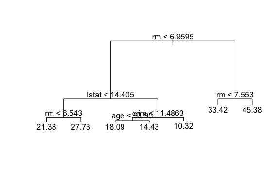

Lab 8 Decision Trees
================
Evan Woods
2023-12-23

## Fitting Classification Trees

    Classification tree:
    tree(formula = High ~ . - Sales, data = carseats)
    Variables actually used in tree construction:
    [1] "ShelveLoc"   "Price"       "Income"      "CompPrice"   "Population" 
    [6] "Advertising" "Age"         "US"         
    Number of terminal nodes:  27 
    Residual mean deviance:  0.4575 = 170.7 / 373 
    Misclassification error rate: 0.09 = 36 / 400 

             High.test
    tree.pred No Yes
          No  79  18
          Yes 41  62

    The test accuracy of predicted carseats sales greater than 8 using the fitted
    classification tree is: 70.500%.

    [1] "size"   "dev"    "k"      "method"

    $size
    [1] 19 13 10  8  7  3  2  1

    $dev
    [1] 61 61 54 52 59 59 66 86

    $k
    [1]      -Inf  0.000000  1.333333  1.500000  4.000000  4.250000 10.000000
    [8] 26.000000

    $method
    [1] "misclass"

    attr(,"class")
    [1] "prune"         "tree.sequence"

             High.test
    tree.pred No Yes
          No  86  23
          Yes 34  57

    Accuracy of the best 9 terminal node tree: 71.500%.

             High.test
    tree.pred No Yes
          No  77  18
          Yes 43  62

    Accuracy of the best 14 terminal node tree: 69.500%

## Fitting Regression Trees

    Regression tree:
    tree(formula = medv ~ ., data = Boston, subset = train)
    Variables actually used in tree construction:
    [1] "rm"    "lstat" "crim"  "age"  
    Number of terminal nodes:  7 
    Residual mean deviance:  10.38 = 2555 / 246 
    Distribution of residuals:
        Min.  1st Qu.   Median     Mean  3rd Qu.     Max. 
    -10.1800  -1.7770  -0.1775   0.0000   1.9230  16.5800 

    Test MSE: 35.287.

## Bagging and Random Forest

    The test MSE of the bagging model is: 23.419.

    The test MSE of the random forest is: 20.066.

              %IncMSE IncNodePurity
    crim    19.435587    1070.42307
    zn       3.091630      82.19257
    indus    6.140529     590.09536
    chas     1.370310      36.70356
    nox     13.263466     859.97091
    rm      35.094741    8270.33906
    age     15.144821     634.31220
    dis      9.163776     684.87953
    rad      4.793720      83.18719
    tax      4.410714     292.20949
    ptratio  8.612780     902.20190
    lstat   28.725343    5813.04833

## Boosting

                var     rel.inf
    rm           rm 44.48249588
    lstat     lstat 32.70281223
    crim       crim  4.85109954
    dis         dis  4.48693083
    nox         nox  3.75222394
    age         age  3.19769210
    ptratio ptratio  2.81354826
    tax         tax  1.54417603
    indus     indus  1.03384666
    rad         rad  0.87625748
    zn           zn  0.16220479
    chas       chas  0.09671228

    The test MSE of the boosted regression tree is: 18.391.

    The test MSE of the boosted tree where the increased value of λ = 0.2 is:
    16.548.

## Bayesian Additive Regression Trees

    *****Calling gbart: type=1
    *****Data:
    data:n,p,np: 253, 12, 253
    y1,yn: 0.213439, -5.486561
    x1,x[n*p]: 0.109590, 20.080000
    xp1,xp[np*p]: 0.027310, 7.880000
    *****Number of Trees: 200
    *****Number of Cut Points: 100 ... 100
    *****burn,nd,thin: 100,1000,1
    *****Prior:beta,alpha,tau,nu,lambda,offset: 2,0.95,0.795495,3,3.71636,21.7866
    *****sigma: 4.367914
    *****w (weights): 1.000000 ... 1.000000
    *****Dirichlet:sparse,theta,omega,a,b,rho,augment: 0,0,1,0.5,1,12,0
    *****printevery: 100

    MCMC
    done 0 (out of 1100)
    done 100 (out of 1100)
    done 200 (out of 1100)
    done 300 (out of 1100)
    done 400 (out of 1100)
    done 500 (out of 1100)
    done 600 (out of 1100)
    done 700 (out of 1100)
    done 800 (out of 1100)
    done 900 (out of 1100)
    done 1000 (out of 1100)
    time: 2s
    trcnt,tecnt: 1000,1000

    The test MSE of the BART model is: 15.919.

        nox   lstat     rad      rm     tax ptratio    chas     age   indus      zn 
     22.973  21.653  21.638  20.725  20.021  19.615  19.283  19.278  19.073  15.576 
        dis    crim 
     13.800  11.607 
