Lab 8 Decision Trees Exercises
================
Evan Woods
2023-12-26

## Applied

### Question 7:

In the lab, we applied random forests to the Boston data using mtry = 6
and using ntree = 25 and ntree = 500. Create a plot displaying the test
error resulting from random forests on this data set for a more
comprehensive range of values for mtry and ntree. You can model your
plot after Figure 8.10. Describe the results obtained.

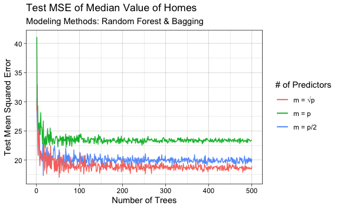

    Of the three modeling methods, the bagged model had the highest mean squared
    error whereas the random forest model with the number of predictors equal to the
    square root of the total number of predictors had the lowest test mean squared
    error. This is owing to the fact that choosing a lower number of predictors per
    split of each internal node allows for a greater variety between trees. This
    leads to a decorrelation of the predictions between trees which reduces model
    variance and lowers the test mean squared error.

### Question 8:

In the lab, a classification tree was applied to the Carseats data set
after converting Sales into a qualitative response variable. Now we will
seek to predict Sales using regression trees and related approaches,
treating the response as a quantitative variable.

- **Question 8-a**: Split the data into a training set and test set.
  - **Answer**:
- **Question 8-b**: Fit a regression tree to the training set. Plot the
  tree, and interpret the results. What test MSE do you obtain?
  - **Answer**:

<!-- -->

    The test MSE of the regression tree to predict carseat sales is: 5.664.

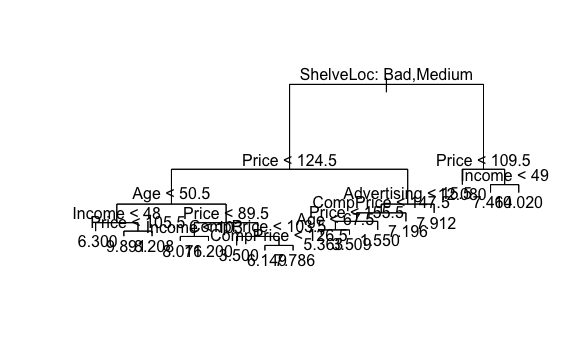

- **Question 8-c**: Use cross-validation in order to determine the
  optimal level of tree complexity. Does pruning the tree improve the
  test MSE?
  - **Answer**:
    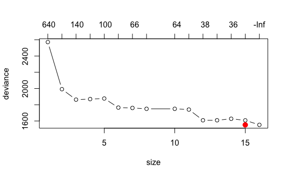

<!-- -->

    The optimal level of tree complexity is: 15 with a deviation of 1552.473.

    The test MSE of the full tree is: 5.664.

    The test MSE of the pruned tree is: 4.842.

    Pruning the tree does not reduce the test mean squared error because the optimal
    level of complexity of the tree is greater than the pruned tree complexity.

- **Question 8-d**: Use the bagging approach in order to analyze this
  data. What test MSE do you obtain? Use the importance() function to
  determine which variables are most important.
  - **Answer**:

<!-- -->

    The test MSE of the bagged model of carseat sales is: 2.507.

                  %IncMSE IncNodePurity
    CompPrice   32.827670    273.259246
    Income      14.120456    162.686618
    Advertising 28.682849    200.035791
    Population   1.303597     90.116933
    Price       73.829441    714.126467
    ShelveLoc   77.853383    750.311364
    Age         21.098569    221.309924
    Education    1.737959     63.207341
    Urban       -2.679030     13.104488
    US           3.189269      8.486129

- **Question 8-e**: Use random forests to analyze this data. What test
  MSE do you obtain? Use the importance() function to determine which
  variables are most important. Describe the effect of *m*, the number
  of variables considered at each split, on the error rate obtained.
  - **Answer**:

<!-- -->

    The test MSE of the bagged model of carseat sales is: 2.455.

                      %IncMSE IncNodePurity
    CompPrice   23.6589824403     248.44416
    Income       8.0550200926     169.59277
    Advertising 22.5745527767     216.64321
    Population  -0.0001122698     123.79587
    Price       61.8208910867     669.90896
    ShelveLoc   63.7369025051     687.41070
    Age         17.1172136783     250.50909
    Education   -0.4477895537      79.45842
    Urban       -0.9847140417      16.17411
    US           2.4371096560      18.43772

    Reducing the number of of variables considered at each split by half increased
    the test MSE by 0.03.

- **Question 8-f**: Now analyze the data using BART, and report your
  results.
  - **Answer**:

<!-- -->

    *****Calling gbart: type=1
    *****Data:
    data:n,p,np: 320, 14, 80
    y1,yn: 3.344281, 5.234281
    x1,x[n*p]: 111.000000, 1.000000
    xp1,xp[np*p]: 136.000000, 1.000000
    *****Number of Trees: 200
    *****Number of Cut Points: 70 ... 1
    *****burn,nd,thin: 100,1000,1
    *****Prior:beta,alpha,tau,nu,lambda,offset: 2,0.95,0.276302,3,0.189278,7.42572
    *****sigma: 0.985746
    *****w (weights): 1.000000 ... 1.000000
    *****Dirichlet:sparse,theta,omega,a,b,rho,augment: 0,0,1,0.5,1,14,0
    *****printevery: 100

    MCMC
    done 0 (out of 1100)
    done 100 (out of 1100)
    done 200 (out of 1100)
    done 300 (out of 1100)
    done 400 (out of 1100)
    done 500 (out of 1100)
    done 600 (out of 1100)
    done 700 (out of 1100)
    done 800 (out of 1100)
    done 900 (out of 1100)
    done 1000 (out of 1100)
    time: 2s
    trcnt,tecnt: 1000,1000

    The test MSE of the BART model is: 1.415.

### Question 9: This problem involves the OJ data set which is part of the ISLR2 package.

- **Question 9-a**: Create a training set containing a random sample of
  800 observations, and a test set containing the remaining
  observations.
  - **Answer**:
- **Question 9-b**: Fit a tree to the training data, with Purchase as
  the response and the other variables as predictors. Use the summary()
  function to produce summary statistics about the tree, and describe
  the results obtained. What is the training error rate. How many
  terminal nodes does the tree have?
  - **Answer**:

<!-- -->

    Classification tree:
    tree(formula = Purchase ~ ., data = OJ, subset = train)
    Variables actually used in tree construction:
    [1] "LoyalCH"   "PriceDiff"
    Number of terminal nodes:  7 
    Residual mean deviance:  0.7183 = 609.8 / 849 
    Misclassification error rate: 0.1612 = 138 / 856 

    The residual mean deviance is 0.7183. This indicates a poor fit to the training
    data of the resulting tree. The tree has 7 terminal nodes.

- **Question 9-c**: Type in the name of the tree object in order to get
  a detailed text output. Pick one of the terminal nodes, and interpret
  the information displayed.
  - **Answer**:

<!-- -->

    node), split, n, deviance, yval, (yprob)
          * denotes terminal node

     1) root 856 1131.00 CH ( 0.62734 0.37266 )  
       2) LoyalCH < 0.5036 369  438.90 MM ( 0.28184 0.71816 )  
         4) LoyalCH < 0.276142 174  124.10 MM ( 0.11494 0.88506 )  
           8) LoyalCH < 0.035047 62    0.00 MM ( 0.00000 1.00000 ) *
           9) LoyalCH > 0.035047 112  105.10 MM ( 0.17857 0.82143 ) *
         5) LoyalCH > 0.276142 195  266.60 MM ( 0.43077 0.56923 )  
          10) PriceDiff < 0.05 79   79.61 MM ( 0.20253 0.79747 ) *
          11) PriceDiff > 0.05 116  157.30 CH ( 0.58621 0.41379 ) *
       3) LoyalCH > 0.5036 487  339.30 CH ( 0.88912 0.11088 )  
         6) LoyalCH < 0.753545 178  194.50 CH ( 0.76404 0.23596 )  
          12) PriceDiff < 0.145 69   94.94 CH ( 0.55072 0.44928 ) *
          13) PriceDiff > 0.145 109   71.31 CH ( 0.89908 0.10092 ) *
         7) LoyalCH > 0.753545 309  101.50 CH ( 0.96117 0.03883 ) *

    Terminal node 9 represents purchases orange juice where Citris Hill Orange juice
    was on special and the loyalty of the customer to Citris Hill orange juice is
    between 0.276142 and 0.035047. There are 112 observations at this node. The
    deviance is 105.10. The dominant prediction is Minute Maid Orange Juice. The
    mean probability that an observed purchase at this node is a purchase of Minute
    Maid orange juice is 0.82143. Conversely, the mean probability that an observed
    purchase was a purchase of Citris Hill orange juice given that Citris Hill
    orange juice was on special and the customer loyalty to Citris Hill orange juice
    is between 0.276142 and 0.035047 was 0.17857.

- **Question 9-d**:
  - **Answer**:
    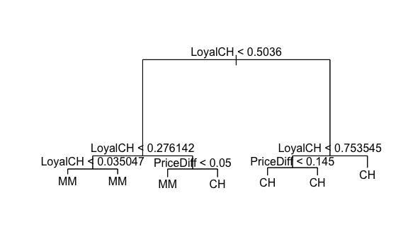

<!-- -->

    The plot shows purchases of orange juice given various levels of customer
    loyalty to Citris Hill and price differences between Citris Hill and Minute Maid
    orange juice.

- **Question 9-e**: Predict the response on the test data, and produce a
  confusion matrix comparing the test labels to the predicted test
  labels. What is the test error rate?
  - **Answer**:

<!-- -->

             tree.truth
    tree.pred  CH  MM
           CH 103  40
           MM  13  58

    The test MSE is 0.247663551.

- **Question 9-f**: Apply the cv.tree() function to the training set in
  order to determine the optimal tree size.
  - **Answer**:

<!-- -->

    The optimal tree size is: 6.

- **Question 9-g**: Produce a plot with tree size on the x-axis and
  cross-validated classification error rate on the y-axis.
  - **Answer**:
    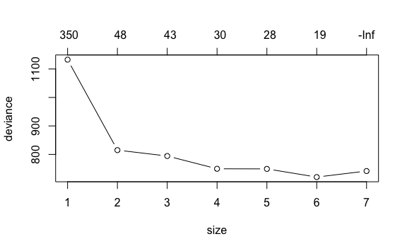
- **Question 9-h**: Which tree size corresponds to the lowest
  cross-validated classification error rate?
  - **Answer**:

<!-- -->

    The lowest cross-validated classification error rate is of tree size: 6.

- **Question 9-i**: Produce a pruned tree corresponding to the optimal
  tree size obtained using cross-validation. If cross-validation does
  not lead to selection of a pruned tree, then create a pruned tree with
  five terminal nodes.
  - **Answer**:
- **Question 9-j**: Compare the training error rates between the pruned
  and unpruned trees. Which is higher?
  - **Answer**:

<!-- -->

    The train MSE of the pruned & unpruned trees are identical. The best 6 terminal
    nodes was chosen for the pruned tree.

    The train MSE of the pruned tree is: 0.161214953.

    The train MSE of the unpruned tree is: 0.161214953.

- **Question 9-k**: Compare the test error rate between the pruned and
  unpruned trees. Which is higher?
  - **Answer**:

<!-- -->

    The test MSE of the pruned & unpruned trees are identical. The best 5 terminal
    nodes was chosen for the pruned tree, where the unpruned tree optimally contains
    7 terminal nodes.

    The test MSE of the pruned tree is: 0.428738318.

    The test MSE of the unpruned tree is: 0.428738318.

### Question 10:

We now use boosting to predict Salary in the Hitters dataset.

- **Question 10-a**: Remove the observations for whom the salary
  information is unknown, and then log-transform the salaries.
  - **Answer**:
- **Question 10-b**: Create a training set consisting of 200
  observations, and a test set consisting of the remaining observations.
  - **Answer**:
- **Question 10-c**: Perform boosting on the training set with 1000
  trees for a range of values of the shrinkage parameter λ. Produce a
  plot with different shrinkage values on the x-axis and the
  corresponding training set MSE on the y-axis.
  - **Answer**:

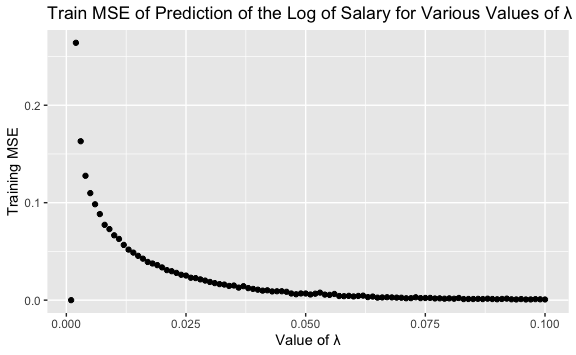

- **Question 10-d**: Produce a plot with different shrinkage values on
  the x-axis and the corresponding test MSE on the y-axis.
  - **Answer**:

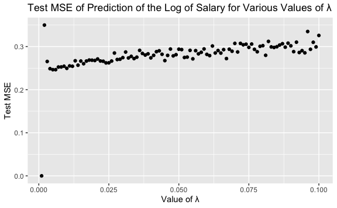

- **Question 10-e**: Compare the test MSE of boosting to the test MSE
  that results from applying two of the regression approaches seen in
  Chapters 3 and 6.
  - **Answer**:

<!-- -->

    The mean test MSE of the boosted tree is: 0.281

    The test MSE of the linear model is: 0.543

    The test MSE of the ridge regression is: 0.504

    The test MSE of the boosted model is the lowest between the three models. The
    ridge regression obtained the largest test MSE whereas the linear model's test
    MSE was middling.

- **Question 10-f**: Which variables appear to be the most important
  predictors in the boosted model?
  - **Answer**:
    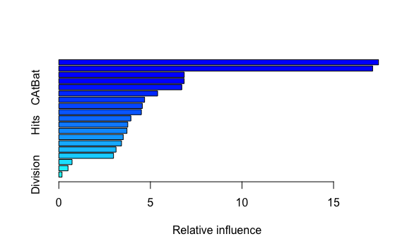

<!-- -->

                    var    rel.inf
    CRuns         CRuns 17.4537395
    CHits         CHits 17.1318948
    PutOuts     PutOuts  6.8477748
    CWalks       CWalks  6.8431774
    CAtBat       CAtBat  6.7140100
    AtBat         AtBat  5.3932646
    Walks         Walks  4.6831472
    RBI             RBI  4.5577225
    CRBI           CRBI  4.5070752
    Years         Years  3.9355414
    Hits           Hits  3.7648397
    HmRun         HmRun  3.7207882
    Runs           Runs  3.5159656
    Assists     Assists  3.4221641
    Errors       Errors  3.1238003
    CHmRun       CHmRun  2.9861846
    NewLeague NewLeague  0.7229865
    League       League  0.5016458
    Division   Division  0.1742780

    The most important predictors in the boosted model are: CRBI, RBI, & Division.

- **Question 10-g**: Now apply bagging to the training set. What is the
  test set MSE for this approach?
  - **Answer**:

<!-- -->

    The test MSE for the bagged approach is: 0.260. This is the lowest testing error
    between the 4 approaches: bagging, linear model, ridge regression, & boosting.

### Question 11:

This question uses the Caravan dataset.

- **Question 11-a**: Create a training set consisting of the first 1000
  observations, and a test set of the remaining observations.
  - **Answer**:
- **Question 11-b**: Fit a boosting model to the training set with
  Purchase as the response and the other variables as predictors. Use
  1000 trees, and a shrinkage value of 0.01. Which predictors appear to
  be the most important?
  - **Answer**:

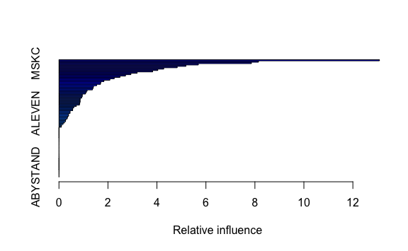

                  var     rel.inf
    PPERSAUT PPERSAUT 13.08470526
    PBRAND     PBRAND  8.14673040
    MSKC         MSKC  7.85810138
    APERSAUT APERSAUT  5.69114919
    MINKM30   MINKM30  5.18318326
    MOSTYPE   MOSTYPE  4.82746577
    MOPLHOOG MOPLHOOG  4.27735449
    MBERMIDD MBERMIDD  4.03603960
    MKOOPKLA MKOOPKLA  3.82383613
    MINK3045 MINK3045  3.19052127
    MOPLMIDD MOPLMIDD  2.93701592
    MAUT1       MAUT1  2.71665259
    MGODOV     MGODOV  2.48931921
    MGODPR     MGODPR  2.25624556
    MINK7512 MINK7512  2.07916002
    MOPLLAAG MOPLLAAG  1.83563889
    MFWEKIND MFWEKIND  1.71025337
    MBERARBG MBERARBG  1.69584594
    MSKA         MSKA  1.53785189
    MBERHOOG MBERHOOG  1.41222656
    MSKB2       MSKB2  1.39837269
    MHHUUR     MHHUUR  1.36852292
    MINK4575 MINK4575  1.15114453
    MGODGE     MGODGE  1.11875636
    MAUT0       MAUT0  1.08447694
    MGEMOMV   MGEMOMV  0.95446214
    MSKD         MSKD  0.95236911
    MFGEKIND MFGEKIND  0.92615253
    MRELGE     MRELGE  0.86752019
    MOSHOOFD MOSHOOFD  0.86538425
    PLEVEN     PLEVEN  0.86536832
    MHKOOP     MHKOOP  0.84942179
    MBERZELF MBERZELF  0.83723139
    MFALLEEN MFALLEEN  0.70661223
    MRELSA     MRELSA  0.60643974
    MBERARBO MBERARBO  0.56463797
    MZPART     MZPART  0.55939361
    MAUT2       MAUT2  0.45718889
    ALEVEN     ALEVEN  0.45650093
    MRELOV     MRELOV  0.39525959
    MZFONDS   MZFONDS  0.39458538
    MINKGEM   MINKGEM  0.35362128
    MBERBOER MBERBOER  0.33792055
    PWAPART   PWAPART  0.28075713
    MSKB1       MSKB1  0.26718089
    MGEMLEEF MGEMLEEF  0.21842591
    MGODRK     MGODRK  0.16825054
    MAANTHUI MAANTHUI  0.10664103
    MINK123M MINK123M  0.09810449
    PWABEDR   PWABEDR  0.00000000
    PWALAND   PWALAND  0.00000000
    PBESAUT   PBESAUT  0.00000000
    PMOTSCO   PMOTSCO  0.00000000
    PVRAAUT   PVRAAUT  0.00000000
    PAANHANG PAANHANG  0.00000000
    PTRACTOR PTRACTOR  0.00000000
    PWERKT     PWERKT  0.00000000
    PBROM       PBROM  0.00000000
    PPERSONG PPERSONG  0.00000000
    PGEZONG   PGEZONG  0.00000000
    PWAOREG   PWAOREG  0.00000000
    PZEILPL   PZEILPL  0.00000000
    PPLEZIER PPLEZIER  0.00000000
    PFIETS     PFIETS  0.00000000
    PINBOED   PINBOED  0.00000000
    PBYSTAND PBYSTAND  0.00000000
    AWAPART   AWAPART  0.00000000
    AWABEDR   AWABEDR  0.00000000
    AWALAND   AWALAND  0.00000000
    ABESAUT   ABESAUT  0.00000000
    AMOTSCO   AMOTSCO  0.00000000
    AVRAAUT   AVRAAUT  0.00000000
    AAANHANG AAANHANG  0.00000000
    ATRACTOR ATRACTOR  0.00000000
    AWERKT     AWERKT  0.00000000
    ABROM       ABROM  0.00000000
    APERSONG APERSONG  0.00000000
    AGEZONG   AGEZONG  0.00000000
    AWAOREG   AWAOREG  0.00000000
    ABRAND     ABRAND  0.00000000
    AZEILPL   AZEILPL  0.00000000
    APLEZIER APLEZIER  0.00000000
    AFIETS     AFIETS  0.00000000
    AINBOED   AINBOED  0.00000000
    ABYSTAND ABYSTAND  0.00000000

    MSKC & ALEVEN appear to be the most important predictors.

- **Question 11-c**: Use the boosting model to predict the response on
  the test data. Predict that a person will make a purchase if the
  estimated probability of purchase is greater than 20%.
  - **Answer**:

<!-- -->

    Caravan Purchase Truth

              
    boost.prob    0    1
             0 4322  222
             1  224   54

    Caravan Purchase Truth

            
    glm.prob   No  Yes
           0 4085  248
           1  461   28

    Caravan Purchase Truth

            
    knn.pred    0    1
         No  4145  241
         Yes  401   35

    Using the boosted model, 28 (1.120%) people predicted to make a purchase
    actually make one.

    Using the logistic regression, 28 (0.581%) people predicted to make a purchase
    actually make one.

    Using the knn method, 28 (0.726%) people predicted to make a purchase actually
    make one.

    The accuracies of the boosted model, the logistic regression, and the knn method
    are as follows: 90.751%, 85.297%, & 86.686%.

    The boosted model maintains the highest accuracy of the three procedures.

### Question 12:

Apply boosting, bagging, random forests, and BART to a data set of your
choice. Be sure to fit the models on a training set and to evaluate
their performance on a test set. How accurate are the results compared
to simple methods like linear or logistic regression? Which of these
approaches yields the best performance?

    Using default location ~/mne_data for PHYSIONET_SLEEP...

    Extracting EDF parameters from /Users/evanwoods/mne_data/physionet-sleep-data/SC4001E0-PSG.edf...
    EDF file detected
    Channel 'EEG Fpz-Cz' recognized as type EEG (renamed to 'Fpz-Cz').
    Channel 'EEG Pz-Oz' recognized as type EEG (renamed to 'Pz-Oz').
    Channel 'EOG horizontal' recognized as type EOG (renamed to 'horizontal').
    Channel 'Resp oro-nasal' recognized as type RESP (renamed to 'oro-nasal').
    Channel 'EMG submental' recognized as type EMG (renamed to 'submental').
    Channel 'Temp rectal' recognized as type TEMP (renamed to 'rectal').
    Setting channel info structure...
    Creating raw.info structure...
    Reading 0 ... 7949999  =      0.000 ... 79499.990 secs...

    
<strong>General</strong>

    <table class="table table-hover table-striped table-sm table-responsive small">
        <tr>
            <th>Measurement date</th>
            &#10;            <td>April 24, 1989  16:13:00 GMT</td>
            &#10;        </tr>
        <tr>
            <th>Experimenter</th>
            &#10;            <td>Unknown</td>
            &#10;        </tr>
        <tr>
            <th>Participant</th>
            &#10;            
            <td>X</td>
            &#10;            
        </tr>
    </table>
    

    

        
<strong>Channels</strong>

        <table class="table table-hover table-striped table-sm table-responsive small">
            <tr>
                <th>Digitized points</th>
                &#10;                <td>Not available</td>
                &#10;            </tr>
            <tr>
                <th>Good channels</th>
                <td>2 EEG, 1 EOG, 1 RESP, 1 EMG, 1 Temperature, 1 Stimulus</td>
            </tr>
            <tr>
                <th>Bad channels</th>
                <td>None</td>
            </tr>
            <tr>
                <th>EOG channels</th>
                <td>horizontal</td>
            </tr>
            <tr>
                <th>ECG channels</th>
                <td>Not available</td>
            </tr>
        </table>
        

        

            
<strong>Data</strong>

            <table class="table table-hover table-striped table-sm table-responsive small">
                &#10;                <tr>
                    <th>Sampling frequency</th>
                    <td>100.00 Hz</td>
                </tr>
                &#10;                
                <tr>
                    <th>Highpass</th>
                    <td>0.50 Hz</td>
                </tr>
                &#10;                
                <tr>
                    <th>Lowpass</th>
                    <td>100.00 Hz</td>
                </tr>
                &#10;                
                &#10;                <tr>
                    <th>Filenames</th>
                    <td>SC4001E0-PSG.edf</td>
                </tr>
                &#10;                
                <tr>
                    <th>Duration</th>
                    <td>22:04:60 (HH:MM:SS)</td>
                </tr>
                &#10;            </table>
            

    <Annotations | 153 segments: Sleep stage 1 (24), Sleep stage 2 (40), Sleep ...>

    
<strong>General</strong>

    <table class="table table-hover table-striped table-sm table-responsive small">
        <tr>
            <th>Measurement date</th>
            &#10;            <td>April 24, 1989  16:13:00 GMT</td>
            &#10;        </tr>
        <tr>
            <th>Experimenter</th>
            &#10;            <td>Unknown</td>
            &#10;        </tr>
        <tr>
            <th>Participant</th>
            &#10;            
            <td>X</td>
            &#10;            
        </tr>
    </table>
    

    

        
<strong>Channels</strong>

        <table class="table table-hover table-striped table-sm table-responsive small">
            <tr>
                <th>Digitized points</th>
                &#10;                <td>Not available</td>
                &#10;            </tr>
            <tr>
                <th>Good channels</th>
                <td>2 EEG, 1 EOG, 1 RESP, 1 EMG, 1 Temperature, 1 Stimulus</td>
            </tr>
            <tr>
                <th>Bad channels</th>
                <td>None</td>
            </tr>
            <tr>
                <th>EOG channels</th>
                <td>horizontal</td>
            </tr>
            <tr>
                <th>ECG channels</th>
                <td>Not available</td>
            </tr>
        </table>
        

        

            
<strong>Data</strong>

            <table class="table table-hover table-striped table-sm table-responsive small">
                &#10;                <tr>
                    <th>Sampling frequency</th>
                    <td>100.00 Hz</td>
                </tr>
                &#10;                
                <tr>
                    <th>Highpass</th>
                    <td>0.50 Hz</td>
                </tr>
                &#10;                
                <tr>
                    <th>Lowpass</th>
                    <td>100.00 Hz</td>
                </tr>
                &#10;                
                &#10;                <tr>
                    <th>Filenames</th>
                    <td>SC4001E0-PSG.edf</td>
                </tr>
                &#10;                
                <tr>
                    <th>Duration</th>
                    <td>22:04:60 (HH:MM:SS)</td>
                </tr>
                &#10;            </table>
            

    Used Annotations descriptions: ['Sleep stage 1', 'Sleep stage 2', 'Sleep stage 3', 'Sleep stage 4', 'Sleep stage R', 'Sleep stage W']

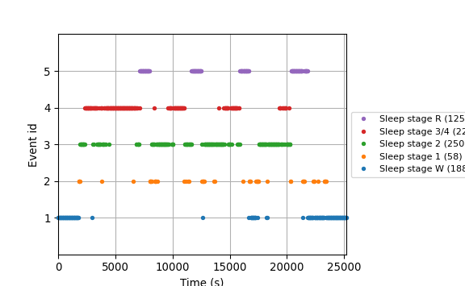

    Not setting metadata
    841 matching events found
    No baseline correction applied
    0 projection items activated

    <Epochs |  841 events (good & bad), 0 – 29.99 s, baseline off, ~11 kB, data not loaded,
     'Sleep stage W': 188
     'Sleep stage 1': 58
     'Sleep stage 2': 250
     'Sleep stage 3/4': 220
     'Sleep stage R': 125>

    Extracting EDF parameters from /Users/evanwoods/mne_data/physionet-sleep-data/SC4011E0-PSG.edf...
    EDF file detected
    Channel 'EEG Fpz-Cz' recognized as type EEG (renamed to 'Fpz-Cz').
    Channel 'EEG Pz-Oz' recognized as type EEG (renamed to 'Pz-Oz').
    Channel 'EOG horizontal' recognized as type EOG (renamed to 'horizontal').
    Channel 'Resp oro-nasal' recognized as type RESP (renamed to 'oro-nasal').
    Channel 'EMG submental' recognized as type EMG (renamed to 'submental').
    Channel 'Temp rectal' recognized as type TEMP (renamed to 'rectal').
    Setting channel info structure...
    Creating raw.info structure...
    Reading 0 ... 8405999  =      0.000 ... 84059.990 secs...

    <Annotations | 125 segments: Sleep stage 1 (33), Sleep stage 2 (40), Sleep ...>

    <RawEDF | SC4011E0-PSG.edf, 7 x 8406000 (84060.0 s), ~448.9 MB, data loaded>

    Used Annotations descriptions: ['Sleep stage 1', 'Sleep stage 2', 'Sleep stage 3', 'Sleep stage 4', 'Sleep stage R', 'Sleep stage W']

    Not setting metadata
    1103 matching events found
    No baseline correction applied
    0 projection items activated

    <Epochs |  1103 events (good & bad), 0 – 29.99 s, baseline off, ~11 kB, data not loaded,
     'Sleep stage W': 157
     'Sleep stage 1': 109
     'Sleep stage 2': 562
     'Sleep stage 3/4': 105
     'Sleep stage R': 170>

    Using data from preloaded Raw for 58 events and 3000 original time points ...
    0 bad epochs dropped
        Using multitaper spectrum estimation with 7 DPSS windows
    Averaging across epochs...
    <Figure size 1200x740 with 2 Axes>
    Using data from preloaded Raw for 250 events and 3000 original time points ...
    0 bad epochs dropped
        Using multitaper spectrum estimation with 7 DPSS windows
    Averaging across epochs...
    <Figure size 1200x740 with 2 Axes>
    Using data from preloaded Raw for 220 events and 3000 original time points ...
    0 bad epochs dropped
        Using multitaper spectrum estimation with 7 DPSS windows
    Averaging across epochs...
    <Figure size 1200x740 with 2 Axes>
    Using data from preloaded Raw for 125 events and 3000 original time points ...
    0 bad epochs dropped
        Using multitaper spectrum estimation with 7 DPSS windows
    Averaging across epochs...
    <Figure size 1200x740 with 2 Axes>
    Using data from preloaded Raw for 188 events and 3000 original time points ...
    0 bad epochs dropped
        Using multitaper spectrum estimation with 7 DPSS windows
    Averaging across epochs...
    <Figure size 1200x740 with 2 Axes>
    [Text(0.5, 1.0, 'Alice'), Text(0.5, 0, 'Frequency (Hz)')]
    Using data from preloaded Raw for 109 events and 3000 original time points ...
    0 bad epochs dropped
        Using multitaper spectrum estimation with 7 DPSS windows
    Averaging across epochs...
    <Figure size 1200x740 with 2 Axes>
    Using data from preloaded Raw for 562 events and 3000 original time points ...
    0 bad epochs dropped
        Using multitaper spectrum estimation with 7 DPSS windows
    Averaging across epochs...
    <Figure size 1200x740 with 2 Axes>
    Using data from preloaded Raw for 105 events and 3000 original time points ...
    0 bad epochs dropped
        Using multitaper spectrum estimation with 7 DPSS windows
    Averaging across epochs...
    <Figure size 1200x740 with 2 Axes>
    Using data from preloaded Raw for 170 events and 3000 original time points ...
    0 bad epochs dropped
        Using multitaper spectrum estimation with 7 DPSS windows
    Averaging across epochs...
    <Figure size 1200x740 with 2 Axes>
    Using data from preloaded Raw for 157 events and 3000 original time points ...
    0 bad epochs dropped
        Using multitaper spectrum estimation with 7 DPSS windows
    Averaging across epochs...
    <Figure size 1200x740 with 2 Axes>
    [Text(0.5, 1.0, 'Bob'), Text(0.5, 0, 'Frequency (Hz)')]

    [Text(0, 0.5, 'µV²/Hz (dB)')]

    <matplotlib.legend.Legend object at 0x2aef7b490>

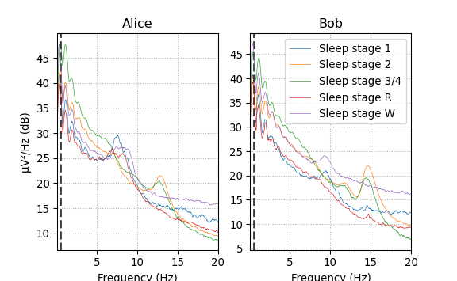

    Using data from preloaded Raw for 841 events and 3000 original time points ...
    0 bad epochs dropped
        Using multitaper spectrum estimation with 7 DPSS windows
    Pipeline(steps=[('functiontransformer',
                     FunctionTransformer(func=<function eeg_power_band at 0x2aef8dd00>)),
                    ('randomforestclassifier',
                     RandomForestClassifier(random_state=42))])

    Using data from preloaded Raw for 1103 events and 3000 original time points ...
    0 bad epochs dropped
        Using multitaper spectrum estimation with 7 DPSS windows

    Accuracy score: 0.6844968268359021

    [[155   1   0   1   0]
     [ 71  26   7   1   4]
     [ 48  34 435  25  20]
     [  0   0   4 101   0]
     [ 51  63  18   0  38]]

                     precision    recall  f1-score   support

      Sleep stage W       0.48      0.99      0.64       157
      Sleep stage 1       0.21      0.24      0.22       109
      Sleep stage 2       0.94      0.77      0.85       562
    Sleep stage 3/4       0.79      0.96      0.87       105
      Sleep stage R       0.61      0.22      0.33       170

           accuracy                           0.68      1103
          macro avg       0.61      0.64      0.58      1103
       weighted avg       0.74      0.68      0.68      1103

    Using data from preloaded Raw for 841 events and 3000 original time points ...
        Using multitaper spectrum estimation with 7 DPSS windows

    Using data from preloaded Raw for 1103 events and 3000 original time points ...
        Using multitaper spectrum estimation with 7 DPSS windows

    Call:
    lm(formula = sleep_stage ~ ., data = train)

    Residuals:
        Min      1Q  Median      3Q     Max 
    -3.0877 -0.5699 -0.0926  0.3537  3.2902 

    Coefficients:
                Estimate Std. Error t value Pr(>|t|)    
    (Intercept)    -9672       2084  -4.642 4.01e-06 ***
    delta1       1258939     240998   5.224 2.22e-07 ***
    delta2        -97799      77418  -1.263    0.207    
    theta1       1259234     240982   5.225 2.20e-07 ***
    theta2        -97861      77415  -1.264    0.207    
    alpha1        943513     180728   5.221 2.26e-07 ***
    alpha2        -73769      58055  -1.271    0.204    
    sigma1       1259940     240943   5.229 2.16e-07 ***
    sigma2       -101270      77342  -1.309    0.191    
    beta1        4569486     875215   5.221 2.25e-07 ***
    beta2        -356090     281456  -1.265    0.206    
    ---
    Signif. codes:  0 '***' 0.001 '**' 0.01 '*' 0.05 '.' 0.1 ' ' 1

    Residual standard error: 1.049 on 830 degrees of freedom
    Multiple R-squared:  0.4025,    Adjusted R-squared:  0.3953 
    F-statistic: 55.91 on 10 and 830 DF,  p-value: < 2.2e-16

    The mse of the randomforest with 500 trees is: 2.335.

    The mse of the boosted model is: 2.547.

    The mse of the bagged model is: 2.424.

    The mse of the linear model is: 2.634.

    The mse of the random forest created from 100 estimators is: 1.739.
