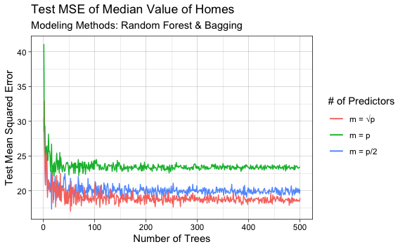

Lab 8 Decision Trees Exercises
================
Evan Woods
2023-12-23

## Applied

### Question 7:

In the lab, we applied random forests to the Boston data using mtry = 6
and using ntree = 25 and ntree = 500. Create a plot displaying the test
error resulting from random forests on this data set for a more
comprehensive range of values for mtry and ntree. You can model your
plot after Figure 8.10. Describe the results obtained.

    Of the three modeling methods, the bagged model had the highest mean squared
    error whereas the random forest model with the number of predictors equal to the
    square root of the total number of predictors had the lowest test mean squared
    error. This is owing to the fact that choosing a lower number of predictors per
    split of each internal node allows for a greater variety between trees. This
    leads to a decorrelation of the predictions between trees which reduces model
    variance and lowers the test mean squared error.
