Lab 9 Support Vector Machines Exercises
================
Evan Woods
2023-12-29

## Applied

### Question 4

Generate a simulated two-class data set with 100 observations and two
features in which there is a visible but non-linear separation between
the two classes. Show that in this setting, a support vector machine
with a polynomial kernel (with degree greater than 1) or a radial kernel
will outperform a support vector classifier on the training data. Which
technique performs best on the test data? Make plots and report training
and test error rates in order to back up your assertions.

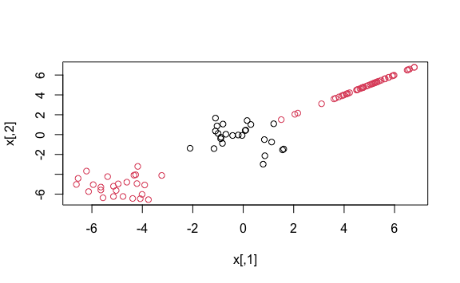

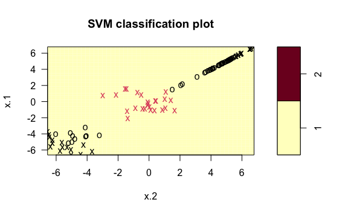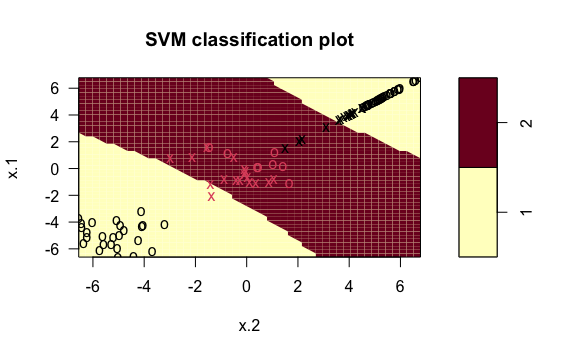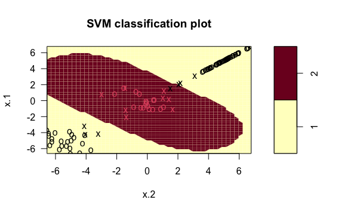

           truth
    predict  1  2
          1 45 55
          2  0  0

    The accuracy of the support vector classifier fit on the data with a non-linear
    boundary is 45%.

           truth
    predict  1  2
          1 32 37
          2 13 18

    The accuracy of the support vector machine implementing a polynomial kernel on
    the test data with a non-linear boundary is 50%.

           truth
    predict  1  2
          1 35 40
          2 10 15

    The accuracy of the support vector machine with a radial kernel fit on test data
    with a non-linear boundary is 50%.

    Parameter tuning of 'svm':

    - sampling method: 10-fold cross validation 

    - best parameters:
     cost gamma
       10   0.5

    - best performance: 0 

    - Detailed performance results:
        cost gamma error dispersion
    1  1e-01   0.5  0.01 0.03162278
    2  1e+00   0.5  0.02 0.04216370
    3  1e+01   0.5  0.00 0.00000000
    4  1e+02   0.5  0.02 0.04216370
    5  1e+03   0.5  0.02 0.04216370
    6  1e-01   1.0  0.02 0.04216370
    7  1e+00   1.0  0.01 0.03162278
    8  1e+01   1.0  0.02 0.04216370
    9  1e+02   1.0  0.02 0.04216370
    10 1e+03   1.0  0.02 0.04216370
    11 1e-01   2.0  0.01 0.03162278
    12 1e+00   2.0  0.00 0.00000000
    13 1e+01   2.0  0.02 0.04216370
    14 1e+02   2.0  0.02 0.04216370
    15 1e+03   2.0  0.02 0.04216370
    16 1e-01   3.0  0.02 0.04216370
    17 1e+00   3.0  0.00 0.00000000
    18 1e+01   3.0  0.02 0.04216370
    19 1e+02   3.0  0.02 0.04216370
    20 1e+03   3.0  0.02 0.04216370
    21 1e-01   4.0  0.01 0.03162278
    22 1e+00   4.0  0.00 0.00000000
    23 1e+01   4.0  0.02 0.04216370
    24 1e+02   4.0  0.02 0.04216370
    25 1e+03   4.0  0.02 0.04216370

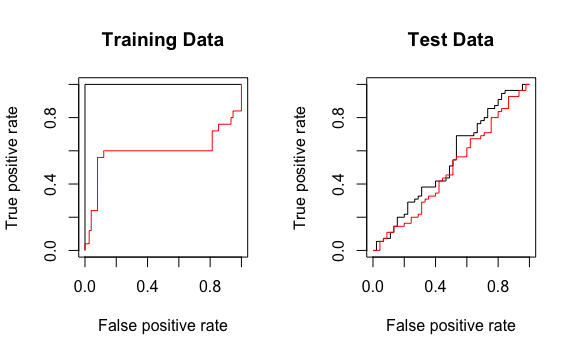

    The support vector machine is shown in black and the support vector classifier
    is show in red above. The support vector machine fits perfectly to the training
    data whereas the support vector classifier is a poor fit to the training data.
    This is intuitive as the data is non-linear where no hyperplane will evenly
    segregate both classes of data. After tuning the support vector machine, there
    is a modest improvement shown in the ROC curve with respect to the support
    vector classifier. The support vector classifier's accuracy is not much better
    than a random classifier.

### Question 5:

We have seen that we can fit an SVM with a non-linear kernel in order to
perform classification using a non-linear decision boundary. We will now
see that we can also obtain a non-linear decision boundary by performing
logistic regression using non-linear transformations of the features.

- **Question 5-a**: Generate a data set with n = 500 and p = 2, such
  that the observations belong to two classes with quadratic decision
  boundary between them.
  - **Answer**:
- **Question 5-b**: Plot the observations, colored according to their
  class labels. Your plot should display X1 on the x-axis and
  X2 on the y-axis.
  - **Answer**:

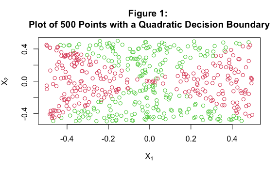

- **Question 5-c**: Fit a logistic regression model to the data, using
  X1 and X2 as predictors.
  - **Answer**:
- **Question 5-d**: Apply this model to the *training* *data* in order
  to obtain a predicted class label for each training observation. Plot
  the observations, colored according to the *predicted* class labels.
  The decision boundary should be linear.
  - **Answer**:
    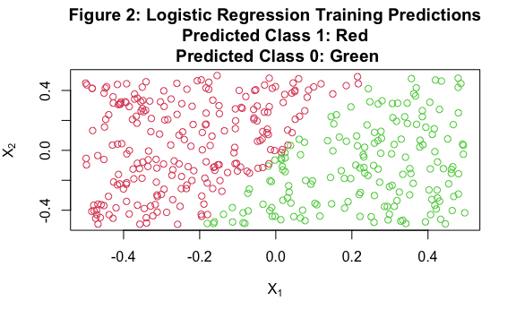
- **Question 5-e**: Now fit a logistic regression model to the data
  using non-linear functions X1 and X2 as
  predictors.
  - **Answer**:
- **Question 5-f**: Apply this model to the *training* *data* in order
  to obtain a predicted class label for each training observation. Plot
  the observations, colored according to the *predicted* class labels.
  The decision boundary should be obviously non-linear. If it is not
  then repeat (a) - (e) until you come up with an example in which the
  predicted class labels are obviously non-linear
  - **Answer**:

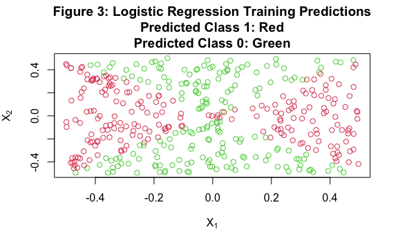

- **Question 5-g**: Fit a support vector classifier to the data with
  X1 and X2 as predictors. Obtain a class
  prediction for each training observation. Plot the observations,
  colored according to the *predicted* *class* *labels*.
  - **Answer**:

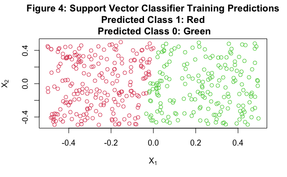

- **Question 5-h**: Fit a SVM using a non-linear kernel to the data.
  Obtain a class prediction for each training observation. Plot the
  observations, colored according to the *predicted* *class* *labels*
  - **Answer**:
    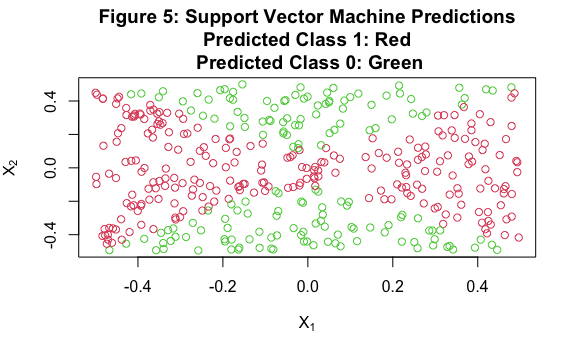
- **Question 5-i**: Comment on your results
  - **Answer**:

<!-- -->

    The cant of the class predictions made by the logistic regression fit to the
    training data shown in Figure 2 is more angled than the cant of the class
    predictions made by the support vector classifier shown in Figure 4. In Figure
    3, the class predictions made by the logistic regression fit to training data
    that has been transformed by the squares of predictors X1 and X2 are very
    similar to the true class predicitons observable in Figure 1. This is due to
    the fact that the true function of y is a function of the sum of the squares of
    predictors X1 and X2. The support vector machine shown in Figure 5 implements
    a polynomial kernel with degree equal to 2 and creates predictions similar to
    those shown in Figure 3 albeit a wider middle band of predictions for class 1.

### Question 6:

At the end of Seciton 9.6.1, it is claimed that in the case of data that
is just barely linearly separable, a support vector classifier with a
small value of cost that misclassifies a couple of training observations
may perform better on test data than one with a huge value of cost that
does not misclassify any training observations. You will now investigate
this claim.

- **Question 6-a**: Generate two-class data with p = 2 in such a way
  that the classes are just barely linearly separable.
  - **Answer**:

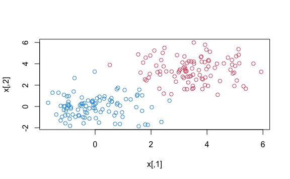

- **Question 6-b**: Compute the cross-validation error rates for support
  vector classifiers with a range of cost values. How many training
  observations are misclassified for each value of cost considered, and
  how does this relate to the cross-validation errors obtained?
  - **Answer**:

<!-- -->

    Parameter tuning of 'svm':

    - sampling method: 10-fold cross validation 

    - best parameters:
     cost
      0.1

    - best performance: 0.1525406 

    - Detailed performance results:
       cost     error dispersion
    1 1e-05 2.0380990 0.41235060
    2 1e-04 1.9113986 0.38380585
    3 1e-03 0.8935571 0.15787728
    4 1e-02 0.1633436 0.03483539
    5 1e-01 0.1525406 0.03588388
    6 1e+00 0.1527430 0.03860874
    7 5e+00 0.1530914 0.03860145
    8 1e+01 0.1530095 0.03865334
    9 1e+02 0.1529918 0.03864701

    Call:
    best.tune(METHOD = svm, train.x = y ~ ., data = six.dat, ranges = list(cost = c(1e-05, 
        1e-04, 0.001, 0.01, 0.1, 1, 5, 10, 100)), kernel = "linear")

    Parameters:
       SVM-Type:  eps-regression 
     SVM-Kernel:  linear 
           cost:  0.1 
          gamma:  0.5 
        epsilon:  0.1 

    Number of Support Vectors:  164

    SVM Cost = 0.00001

              truth
    prediction  -1   1
            -1 100   2
            1    0  98

    There are 2 misclassified training observations.

    SVM Cost = 0.0001

              truth
    prediction  -1   1
            -1 100   0
            1    0 100

    There are 0 misclassified training observations.

    SVM Cost = 0.001

              truth
    prediction  -1   1
            -1 100   0
            1    0 100

    There are 0 misclassified training observations.

    SVM Cost = 0.01

              truth
    prediction  -1   1
            -1 100   0
            1    0 100

    There are 0 misclassified training observations.

    SVM Cost = 0.1

              truth
    prediction  -1   1
            -1 100   0
            1    0 100

    There are 0 misclassified training observations.

    SVM Cost = 1

              truth
    prediction  -1   1
            -1  99   0
            1    1 100

    There are 1 misclassified training observations.

    SVM Cost = 5

              truth
    prediction  -1   1
            -1 100   0
            1    0 100

    There are 0 misclassified training observations.

    SVM Cost = 10

              truth
    prediction  -1   1
            -1 100   0
            1    0 100

    There are 0 misclassified training observations.

    SVM Cost = 100

              truth
    prediction  -1   1
            -1 100   0
            1    0 100

    There are 0 misclassified training observations.

    There is a trending proportional relationship between the number of
    misclassified training observations and the cross-validated error where a larger
    cost results in a smaller error.

- **Question 6-c**: Generate an appropriate test data set, and compute
  the test errors corresponding to each of the values of cost
  considered. Which value of cost leads to the fewest test errors, and
  how does this compare to the values of cost that yield the fewest
  training errors and the fewest cross-validation errors?
  - **Answer**:

<!-- -->

    SVM Cost = .000001

              truth
    prediction  -1   1
            -1  99   0
            1    1 100

    There are 1 misclassified training observations.

    SVM Cost = .00001

              truth
    prediction  -1   1
            -1  99   0
            1    1 100

    There are 1 misclassified training observations.

    SVM Cost = .0001

              truth
    prediction  -1   1
            -1  98   0
            1    2 100

    There are 2 misclassified training observations.

    SVM Cost = .001

              truth
    prediction  -1   1
            -1  98   0
            1    2 100

    There are 2 misclassified training observations.

    SVM Cost = .01

              truth
    prediction  -1   1
            -1  98   0
            1    2 100

    There are 2 misclassified training observations.

    SVM Cost = .1

              truth
    prediction  -1   1
            -1  98   0
            1    2 100

    There are 2 misclassified training observations.

    SVM Cost = 1

              truth
    prediction  -1   1
            -1  98   0
            1    2 100

    There are 2 misclassified training observations.

    SVM Cost = 5

              truth
    prediction  -1   1
            -1  99   0
            1    1 100

    There are 1 misclassified training observations.

    SVM Cost = 10

              truth
    prediction  -1   1
            -1  98   0
            1    2 100

    There are 2 misclassified training observations.

    SVM Cost = 100

              truth
    prediction  -1   1
            -1  98   0
            1    2 100

    There are 2 misclassified training observations.

    SVM Cost = 1000

              truth
    prediction  -1   1
            -1  98   0
            1    2 100

    There are 2 misclassified training observations.

      six.svm_millionth_mse_test
    1                      0.005

      six.svm_millionth_mse_test six.svm_hundred_thousandth_mse_test
    1                      0.005                               0.005
      six.svm_ten_thousandth_mse_test six.svm_thousandth_mse_test
    1                            0.01                        0.01
      six.svm_hundreth_mse_test six.svm_tenth_mse_test six.svm_1_mse_test
    1                      0.01                   0.01               0.01
      six.svm_5_mse_test six.svm_10_mse_test six.svm_100_mse_test
    1              0.005                0.01                 0.01
      six.svm_1000_mse_test
    1                  0.01

    The cost that yields the lowest value of test MSE, according to the which.min
    function, is associated with the value of cost of 0.00001. The lowest value of
    test MSE is tied with associated costs of 0.000001 and 0.00001. The smallest
    test errors are associated with the ultimate and penultimate smallest costs.
    These costs are as follows: .000001 & .00001. The test mse of 1000 and
    one-millionth were tested to examine if the trend of smallest test mse continues
    toward the limits of the values of cost. The cost that yielded the fewest
    training errors were the following costs: 0.0001, 0.001, 0.01, 0.1, 5, 10, &
    100. These costs had no training errors. The largest number of misclassified
    training observations is associated with the smallest cost of 0.00001. The
    associated cost of the smallest cross-validated error was also associated with
    the largest cost of 100. Larger values of cost yield lower values for training
    error and higher values for test error due to rigidity of the model and high
    variance. The test MSE results are not trending in alignment with the training
    or cross validation errors due to this variance present in the models.

- **Question 6-d**:
  - **Answer**:

<!-- -->

    Section 9.6.1 claims that smaller values of cost will result in smaller test
    errors due to the fact that the cost of crossing the boundary is less - allowing
    a more flexible fit to the data, a more generalized model, and fewer test
    errors. The results have proven this to be the case. When the linear decision
    boundary is very narrow, large values of cost will create narrow margins and
    results in a model that tolerates less misclassifications of observations.
    However, applying this same model to test data where the linear decision
    boundary of the separating hyperplane is not necessarily narrow will lead to
    an increased number of observations being misclassified. Therefore, lower costs
    allow for more generalized models and lower test error when the training data
    has a very narrow decision boundary.

### Question 7:

In this problem, you will use support vector approaches in order to
predict whether a given car gets high or low gas mileage based on the
Auto data set.

- **Question 7-a**: Create a binary variable that takes on a 1 for cars
  with gas mileage above the median, and a 0 for cars with gas mileage
  below the median.
  - **Answer**:

<!-- -->

      mpg_median cylinders displacement horsepower weight acceleration year origin
    1          0         8          307        130   3504         12.0   70      1
    2          0         8          350        165   3693         11.5   70      1
    3          0         8          318        150   3436         11.0   70      1
    4          0         8          304        150   3433         12.0   70      1
    5          0         8          302        140   3449         10.5   70      1
    6          0         8          429        198   4341         10.0   70      1
                           name
    1 chevrolet chevelle malibu
    2         buick skylark 320
    3        plymouth satellite
    4             amc rebel sst
    5               ford torino
    6          ford galaxie 500

- **Question 7-b**: Fit a support vector classifier to the data with
  various values of cost, in order to predict whether a car gets high or
  low gas mileage. Report the cross-validation errors associated with
  different values of this parameter. Comment on your results. Note you
  will need to fit the classifier without the gas mileage variable to
  produce sensible results.
  - **Answer**:

<!-- -->

    Parameter tuning of 'svm':

    - sampling method: 10-fold cross validation 

    - best parameters:
     cost
     0.01

    - best performance: 0.08916667 

    - Detailed performance results:
       cost      error dispersion
    1 1e-05 0.59679487 0.05312225
    2 1e-04 0.59679487 0.05312225
    3 1e-03 0.12775641 0.06746999
    4 1e-02 0.08916667 0.05258186
    5 1e-01 0.09160256 0.05869690
    6 1e+00 0.09173077 0.04357345
    7 5e+00 0.10942308 0.04734731
    8 1e+01 0.11705128 0.05314992
    9 1e+02 0.12993590 0.05797340

    The minimum cross validation error is associated with a cost of .01. The cross
    validation error of this cost is 0.089.

- **Question 7-c**: Now repeat (b), this time using SVMs with radial and
  polynomial basis kernels, with different values of gamma and degree
  and cost. Comment on your results.
  - **Answer**:

<!-- -->

    Parameter tuning of 'svm':

    - sampling method: 10-fold cross validation 

    - best parameters:
     cost degree
      100      1

    - best performance: 0.08153846 

    - Detailed performance results:
        cost degree      error dispersion
    1  1e-05  1e-03 0.59679487 0.05312225
    2  1e-04  1e-03 0.59679487 0.05312225
    3  1e-03  1e-03 0.59679487 0.05312225
    4  1e-02  1e-03 0.59679487 0.05312225
    5  1e-01  1e-03 0.59679487 0.05312225
    6  1e+00  1e-03 0.59679487 0.05312225
    7  5e+00  1e-03 0.59679487 0.05312225
    8  1e+01  1e-03 0.59679487 0.05312225
    9  1e+02  1e-03 0.59679487 0.05312225
    10 1e-05  1e-02 0.59679487 0.05312225
    11 1e-04  1e-02 0.59679487 0.05312225
    12 1e-03  1e-02 0.59679487 0.05312225
    13 1e-02  1e-02 0.59679487 0.05312225
    14 1e-01  1e-02 0.59679487 0.05312225
    15 1e+00  1e-02 0.59679487 0.05312225
    16 5e+00  1e-02 0.59679487 0.05312225
    17 1e+01  1e-02 0.59679487 0.05312225
    18 1e+02  1e-02 0.59679487 0.05312225
    19 1e-05  1e-01 0.59679487 0.05312225
    20 1e-04  1e-01 0.59679487 0.05312225
    21 1e-03  1e-01 0.59679487 0.05312225
    22 1e-02  1e-01 0.59679487 0.05312225
    23 1e-01  1e-01 0.59679487 0.05312225
    24 1e+00  1e-01 0.59679487 0.05312225
    25 5e+00  1e-01 0.59679487 0.05312225
    26 1e+01  1e-01 0.59679487 0.05312225
    27 1e+02  1e-01 0.59679487 0.05312225
    28 1e-05  1e+00 0.59679487 0.05312225
    29 1e-04  1e+00 0.59679487 0.05312225
    30 1e-03  1e+00 0.59679487 0.05312225
    31 1e-02  1e+00 0.59679487 0.05312225
    32 1e-01  1e+00 0.34961538 0.09771674
    33 1e+00  1e+00 0.11487179 0.05151018
    34 5e+00  1e+00 0.08660256 0.05519479
    35 1e+01  1e+00 0.08653846 0.05996931
    36 1e+02  1e+00 0.08153846 0.04902512
    37 1e-05  1e+01 0.59679487 0.05312225
    38 1e-04  1e+01 0.59679487 0.05312225
    39 1e-03  1e+01 0.59679487 0.05312225
    40 1e-02  1e+01 0.59679487 0.05312225
    41 1e-01  1e+01 0.59679487 0.05312225
    42 1e+00  1e+01 0.59679487 0.05312225
    43 5e+00  1e+01 0.59679487 0.05312225
    44 1e+01  1e+01 0.59679487 0.05312225
    45 1e+02  1e+01 0.59679487 0.05312225
    46 1e-05  1e+02 0.59679487 0.05312225
    47 1e-04  1e+02 0.59679487 0.05312225
    48 1e-03  1e+02 0.59679487 0.05312225
    49 1e-02  1e+02 0.59679487 0.05312225
    50 1e-01  1e+02 0.59679487 0.05312225
    51 1e+00  1e+02 0.59679487 0.05312225
    52 5e+00  1e+02 0.59679487 0.05312225
    53 1e+01  1e+02 0.59679487 0.05312225
    54 1e+02  1e+02 0.59679487 0.05312225

    Parameter tuning of 'svm':

    - sampling method: 10-fold cross validation 

    - best parameters:
     cost gamma
        5   0.1

    - best performance: 0.07365385 

    - Detailed performance results:
        cost gamma      error dispersion
    1  1e-05 1e-03 0.58429487 0.04703306
    2  1e-04 1e-03 0.58429487 0.04703306
    3  1e-03 1e-03 0.58429487 0.04703306
    4  1e-02 1e-03 0.58429487 0.04703306
    5  1e-01 1e-03 0.58429487 0.04703306
    6  1e+00 1e-03 0.11474359 0.04974917
    7  5e+00 1e-03 0.08910256 0.05517705
    8  1e+01 1e-03 0.08653846 0.05507766
    9  1e+02 1e-03 0.08660256 0.05261832
    10 1e-05 1e-02 0.58429487 0.04703306
    11 1e-04 1e-02 0.58429487 0.04703306
    12 1e-03 1e-02 0.58429487 0.04703306
    13 1e-02 1e-02 0.58429487 0.04703306
    14 1e-01 1e-02 0.11474359 0.04974917
    15 1e+00 1e-02 0.08653846 0.05507766
    16 5e+00 1e-02 0.08910256 0.05105094
    17 1e+01 1e-02 0.08403846 0.05237828
    18 1e+02 1e-02 0.08391026 0.05191600
    19 1e-05 1e-01 0.58429487 0.04703306
    20 1e-04 1e-01 0.58429487 0.04703306
    21 1e-03 1e-01 0.58429487 0.04703306
    22 1e-02 1e-01 0.26820513 0.08481167
    23 1e-01 1e-01 0.08910256 0.05383683
    24 1e+00 1e-01 0.08910256 0.05105094
    25 5e+00 1e-01 0.07365385 0.05090715
    26 1e+01 1e-01 0.07865385 0.06205126
    27 1e+02 1e-01 0.10442308 0.06834297
    28 1e-05 1e+00 0.58429487 0.04703306
    29 1e-04 1e+00 0.58429487 0.04703306
    30 1e-03 1e+00 0.58429487 0.04703306
    31 1e-02 1e+00 0.58429487 0.04703306
    32 1e-01 1e+00 0.58429487 0.04703306
    33 1e+00 1e+00 0.07884615 0.05530928
    34 5e+00 1e+00 0.08141026 0.05580238
    35 1e+01 1e+00 0.08141026 0.05580238
    36 1e+02 1e+00 0.08141026 0.05580238
    37 1e-05 1e+01 0.58429487 0.04703306
    38 1e-04 1e+01 0.58429487 0.04703306
    39 1e-03 1e+01 0.58429487 0.04703306
    40 1e-02 1e+01 0.58429487 0.04703306
    41 1e-01 1e+01 0.58429487 0.04703306
    42 1e+00 1e+01 0.54352564 0.05929897
    43 5e+00 1e+01 0.54096154 0.05632638
    44 1e+01 1e+01 0.54096154 0.05632638
    45 1e+02 1e+01 0.54096154 0.05632638
    46 1e-05 1e+02 0.58429487 0.04703306
    47 1e-04 1e+02 0.58429487 0.04703306
    48 1e-03 1e+02 0.58429487 0.04703306
    49 1e-02 1e+02 0.58429487 0.04703306
    50 1e-01 1e+02 0.58429487 0.04703306
    51 1e+00 1e+02 0.58429487 0.04703306
    52 5e+00 1e+02 0.58429487 0.04703306
    53 1e+01 1e+02 0.58429487 0.04703306
    54 1e+02 1e+02 0.58429487 0.04703306

    The best polynomial performance is 0.082 with an associated cost of 100 and a
    degree of 1.

    The best radial performance is 0.074 with an associated cost of 5 and a gamma
    value of 0.10.

- **Question 7-d**: Make some plots to back up your assertions in (b)
  and (c).
  - **Answer**:

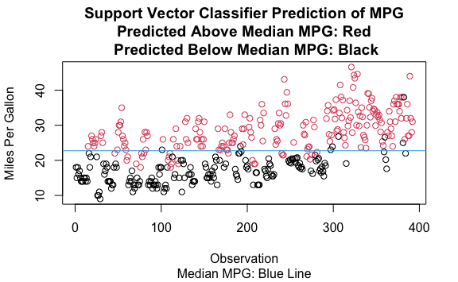

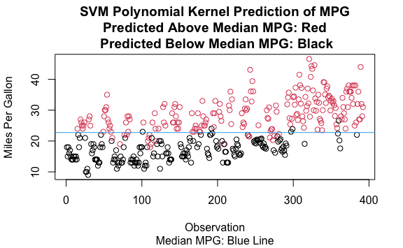

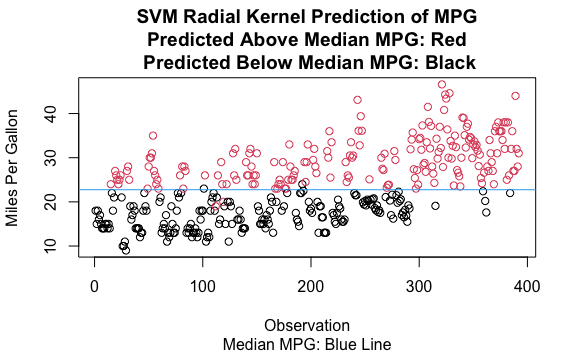

### Question 8:

This problem involves the OJ data set which is part of the ISLR2
package.

- **Question 8-a**: Create a training set containing a random sample of
  800 observations, and a test set containing the remaining
  observations.
  - **Answer**:

<!-- -->

        Purchase WeekofPurchase StoreID PriceCH PriceMM DiscCH DiscMM SpecialCH
    917       CH            246       2    1.89    2.09    0.0    0.0         0
    70        CH            272       4    1.99    2.09    0.0    0.4         0
    948       MM            260       3    1.99    2.09    0.0    0.0         0
    412       MM            230       3    1.79    1.79    0.0    0.0         0
    776       CH            232       7    1.69    1.99    0.0    0.4         1
    90        CH            277       3    2.09    2.09    0.2    0.4         0
        SpecialMM  LoyalCH SalePriceMM SalePriceCH PriceDiff Store7 PctDiscMM
    917         0 0.400000        2.09        1.89       0.2     No  0.000000
    70          0 0.647889        1.69        1.99      -0.3     No  0.191388
    948         0 0.011649        2.09        1.99       0.1     No  0.000000
    412         0 0.283886        1.79        1.79       0.0     No  0.000000
    776         1 0.600000        1.59        1.69      -0.1    Yes  0.201005
    90          0 0.795200        1.69        1.89      -0.2     No  0.191388
        PctDiscCH ListPriceDiff STORE
    917  0.000000           0.2     2
    70   0.000000           0.1     4
    948  0.000000           0.1     3
    412  0.000000           0.0     3
    776  0.000000           0.3     0
    90   0.095694           0.0     3

       Purchase WeekofPurchase StoreID PriceCH PriceMM DiscCH DiscMM SpecialCH
    2        CH            239       1    1.75    1.99   0.00    0.3         0
    7        CH            232       7    1.69    1.99   0.00    0.4         1
    10       CH            238       7    1.75    1.99   0.00    0.4         0
    20       CH            254       7    1.86    2.18   0.00    0.0         0
    21       CH            257       7    1.86    2.18   0.00    0.0         0
    24       CH            264       7    1.86    2.13   0.37    0.0         1
       SpecialMM  LoyalCH SalePriceMM SalePriceCH PriceDiff Store7 PctDiscMM
    2          1 0.600000        1.69        1.75     -0.06     No  0.150754
    7          1 0.972182        1.59        1.69     -0.10    Yes  0.201005
    10         0 0.985757        1.59        1.75     -0.16    Yes  0.201005
    20         0 0.500000        2.18        1.86      0.32    Yes  0.000000
    21         0 0.600000        2.18        1.86      0.32    Yes  0.000000
    24         0 0.795200        2.13        1.49      0.64    Yes  0.000000
       PctDiscCH ListPriceDiff STORE
    2   0.000000          0.24     1
    7   0.000000          0.30     0
    10  0.000000          0.24     0
    20  0.000000          0.32     0
    21  0.000000          0.32     0
    24  0.198925          0.27     0

- **Question 8-b**: Fit a support vector classifier to the training data
  using cost = 0.01, with Purchase as the response and the other
  variables as predictors. Use the summary() function to produce summary
  statistics, and describe the results obtained.
  - **Answer**:

<!-- -->

    Call:
    svm(formula = Purchase ~ ., data = oj[train, ], cost = 0.01, kernel = "linear", 
        scale = FALSE)

    Parameters:
       SVM-Type:  C-classification 
     SVM-Kernel:  linear 
           cost:  0.01 

    Number of Support Vectors:  620

     ( 311 309 )

    Number of Classes:  2 

    Levels: 
     CH MM

    The summary statistics show a linear kernel with a cost of 0.01. There are
    631 support vectors and 2 classes. 314 support vectors belong to the CH class
    whereas 317 support vectors belong to the MM class.

- **Question 8-c**: What are the training and test error rates?
  - **Answer**:

<!-- -->

    The training MSE is 0.229.

    The test MSE is 0.461.

- **Question 8-d**: Use the tune() function to select an optimal cost.
  Consider values in the range 0.01 to 10.
  - **Answer**:

<!-- -->

    Parameter tuning of 'svm':

    - sampling method: 10-fold cross validation 

    - best parameters:
     cost
       10

    - best performance: 0.1682243 

    - Detailed performance results:
       cost     error dispersion
    1  0.01 0.1728972 0.04322254
    2  0.10 0.1738318 0.04018571
    3  1.00 0.1738318 0.04321132
    4  5.00 0.1710280 0.03990702
    5 10.00 0.1682243 0.03632992

- **Question 8-e**: Compute the training and test error rates using this
  new value for cost.
  - **Answer**:

<!-- -->

    The training MSE is 0.163.

    The test MSE is 0.500.

- **Question 8-f**: Repeat parts (b) through (e) using a support vector
  machine with a radial kernel. Use the default value for gamma.
  - **Answer**:

<!-- -->

    Call:
    svm(formula = Purchase ~ ., data = oj[train, ], kernel = "radial", 
        scale = FALSE)

    Parameters:
       SVM-Type:  C-classification 
     SVM-Kernel:  radial 
           cost:  1 

    Number of Support Vectors:  545

     ( 280 265 )

    Number of Classes:  2 

    Levels: 
     CH MM

    The summary statistics show a radial kernel with a default gamma value of 1.
    There are 545 support vectors and 2 classes. 280 support vectors belong to the
    CH class whereas 265 support vectors belong to the MM class.

    The training MSE is 0.227.

    The test MSE is 0.465.

    Parameter tuning of 'svm':

    - sampling method: 10-fold cross validation 

    - best parameters:
     cost
        5

    - best performance: 0.1728972 

    - Detailed performance results:
       cost     error dispersion
    1  0.01 0.3897196 0.03990702
    2  0.10 0.1747664 0.03525896
    3  1.00 0.1747664 0.03553314
    4  5.00 0.1728972 0.02963598
    5 10.00 0.1766355 0.04072546

    The training MSE is 0.149.

    The test MSE is 0.491.

- **Question 8-g**: Repeat parts (b) through (e) using a support vector
  machine with a polynomial kernel. Set degree = 2.
  - **Answer**:

<!-- -->

    Call:
    svm(formula = Purchase ~ ., data = oj[train, ], degree = 2, kernel = "polynomial", 
        scale = FALSE)

    Parameters:
       SVM-Type:  C-classification 
     SVM-Kernel:  polynomial 
           cost:  1 
         degree:  2 
         coef.0:  0 

    Number of Support Vectors:  251

     ( 125 126 )

    Number of Classes:  2 

    Levels: 
     CH MM

    The summary statistics show a polynomial kernel with a degree of 2. There are
    251 support vectors and 2 classes. 125 support vectors belong to the CH class
    whereas 126 support vectors belong to the MM class.

    The training MSE is 0.153.

    The test MSE is 0.509.

    Parameter tuning of 'svm':

    - sampling method: 10-fold cross validation 

    - best parameters:
     cost
        5

    - best performance: 0.182243 

    - Detailed performance results:
       cost     error dispersion
    1  0.01 0.3691589 0.04604905
    2  0.10 0.3000000 0.04096307
    3  1.00 0.1906542 0.03920781
    4  5.00 0.1822430 0.03639664
    5 10.00 0.1822430 0.03666231

    The training MSE is 0.151.

    The test MSE is 0.485.

- **Question 8-h**: Overall, which approach seems to give the best
  results on this data?
  - **Answer**:

<!-- -->

    The untuned Support Machine Classifier with a cost of 0.01 appears to give
    the best results on this data. The lowest test MSE is 0.461 compared to the
    following values test MSE: 0.500, 0.465, 0.491, 0.509, and 0.485 for the tuned
    support vector classifier, the radial SVM, the tuned radial SVM, the polynomial
    SVM, and the tuned polynomial SVM respectively. These results are suprising.
    Where the tuning did reduce training error, the test error increased after
    tuning.
